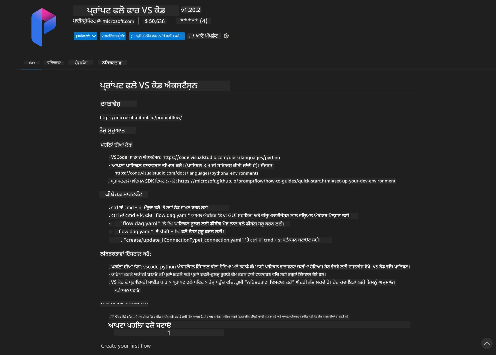
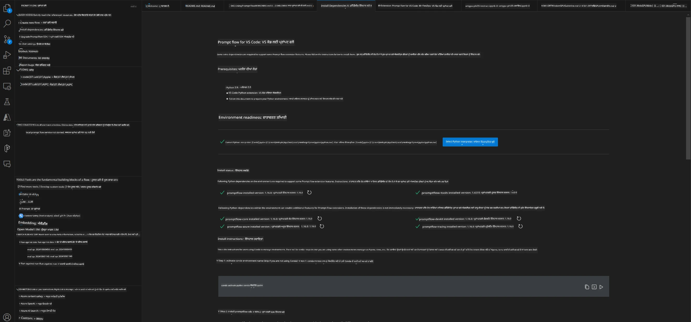
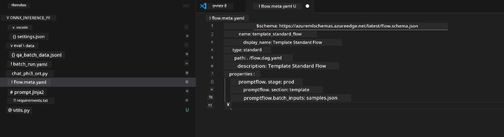
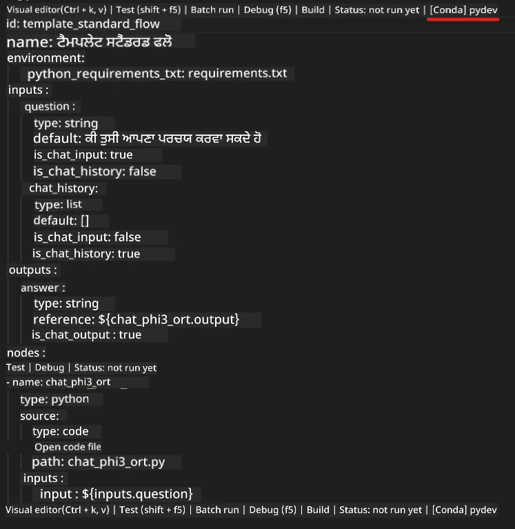
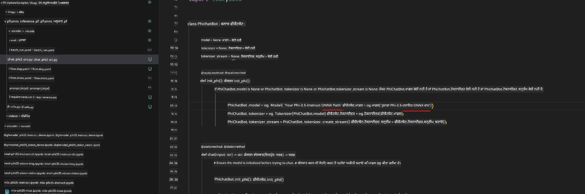
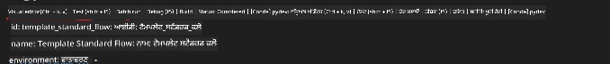
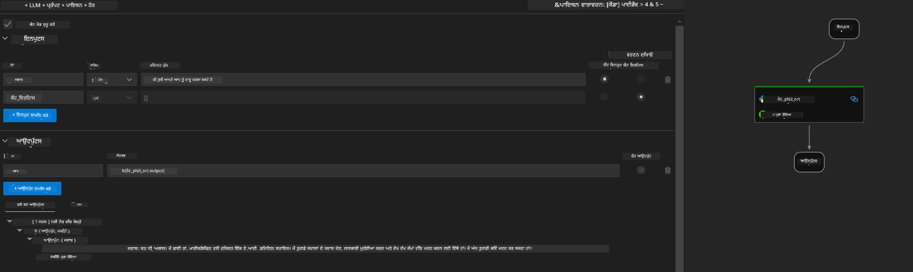
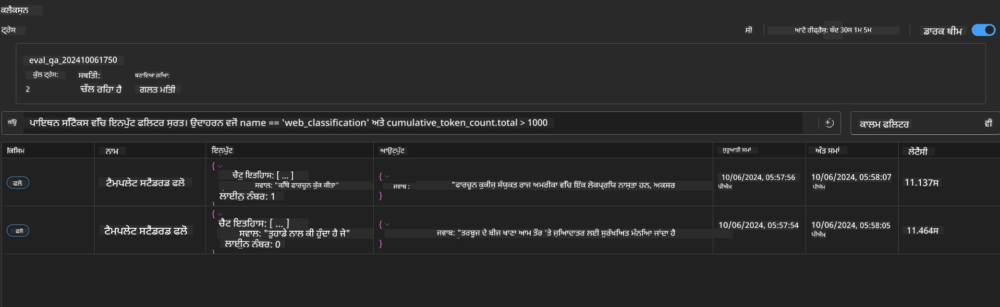

<!--
CO_OP_TRANSLATOR_METADATA:
{
  "original_hash": "92e7dac1e5af0dd7c94170fdaf6860fe",
  "translation_date": "2025-07-17T02:59:24+00:00",
  "source_file": "md/02.Application/01.TextAndChat/Phi3/UsingPromptFlowWithONNX.md",
  "language_code": "pa"
}
-->
# Windows GPU ਦੀ ਵਰਤੋਂ ਕਰਕੇ Phi-3.5-Instruct ONNX ਨਾਲ Prompt flow ਹੱਲ ਬਣਾਉਣਾ

ਹੇਠਾਂ ਦਿੱਤਾ ਦਸਤਾਵੇਜ਼ ਇਹ ਦਿਖਾਉਂਦਾ ਹੈ ਕਿ ਕਿਵੇਂ ONNX (Open Neural Network Exchange) ਨਾਲ PromptFlow ਦੀ ਵਰਤੋਂ ਕਰਕੇ Phi-3 ਮਾਡਲਾਂ 'ਤੇ ਆਧਾਰਿਤ AI ਐਪਲੀਕੇਸ਼ਨਾਂ ਨੂੰ ਵਿਕਸਿਤ ਕੀਤਾ ਜਾ ਸਕਦਾ ਹੈ।

PromptFlow ਇੱਕ ਵਿਕਾਸ ਟੂਲ ਸੂਟ ਹੈ ਜੋ LLM-ਆਧਾਰਿਤ (Large Language Model) AI ਐਪਲੀਕੇਸ਼ਨਾਂ ਦੇ ਪੂਰੇ ਵਿਕਾਸ ਚੱਕਰ ਨੂੰ ਆਸਾਨ ਬਣਾਉਂਦਾ ਹੈ, ਜਿਵੇਂ ਕਿ ਵਿਚਾਰ-ਵਟਾਂਦਰਾ, ਪ੍ਰੋਟੋਟਾਈਪਿੰਗ, ਟੈਸਟਿੰਗ ਅਤੇ ਮੁਲਾਂਕਣ।

PromptFlow ਨੂੰ ONNX ਨਾਲ ਜੋੜ ਕੇ ਵਿਕਾਸਕਾਰ ਇਹ ਕਰ ਸਕਦੇ ਹਨ:

- ਮਾਡਲ ਪ੍ਰਦਰਸ਼ਨ ਨੂੰ ਬਿਹਤਰ ਬਣਾਉਣਾ: ONNX ਦੀ ਵਰਤੋਂ ਕਰਕੇ ਮਾਡਲ ਇੰਫਰੈਂਸ ਅਤੇ ਡਿਪਲੋਇਮੈਂਟ ਨੂੰ ਪ੍ਰਭਾਵਸ਼ਾਲੀ ਬਣਾਓ।
- ਵਿਕਾਸ ਨੂੰ ਸਧਾਰਨ ਬਣਾਉਣਾ: PromptFlow ਨਾਲ ਵਰਕਫਲੋ ਨੂੰ ਮੈਨੇਜ ਕਰੋ ਅਤੇ ਦੁਹਰਾਏ ਜਾਣ ਵਾਲੇ ਕੰਮਾਂ ਨੂੰ ਆਟੋਮੇਟ ਕਰੋ।
- ਸਹਿਯੋਗ ਨੂੰ ਵਧਾਉਣਾ: ਟੀਮ ਮੈਂਬਰਾਂ ਵਿਚਕਾਰ ਬਿਹਤਰ ਸਹਿਯੋਗ ਲਈ ਇੱਕਜੁੱਟ ਵਿਕਾਸ ਵਾਤਾਵਰਣ ਪ੍ਰਦਾਨ ਕਰੋ।

**Prompt flow** ਇੱਕ ਵਿਕਾਸ ਟੂਲ ਸੂਟ ਹੈ ਜੋ LLM-ਆਧਾਰਿਤ AI ਐਪਲੀਕੇਸ਼ਨਾਂ ਦੇ ਪੂਰੇ ਵਿਕਾਸ ਚੱਕਰ ਨੂੰ ਆਸਾਨ ਬਣਾਉਂਦਾ ਹੈ, ਜਿਸ ਵਿੱਚ ਵਿਚਾਰ-ਵਟਾਂਦਰਾ, ਪ੍ਰੋਟੋਟਾਈਪਿੰਗ, ਟੈਸਟਿੰਗ, ਮੁਲਾਂਕਣ ਤੋਂ ਲੈ ਕੇ ਉਤਪਾਦਨ ਡਿਪਲੋਇਮੈਂਟ ਅਤੇ ਮਾਨੀਟਰਿੰਗ ਸ਼ਾਮਲ ਹਨ। ਇਹ prompt engineering ਨੂੰ ਬਹੁਤ ਸੌਖਾ ਬਣਾਉਂਦਾ ਹੈ ਅਤੇ ਤੁਹਾਨੂੰ ਉਤਪਾਦਨ ਗੁਣਵੱਤਾ ਵਾਲੀਆਂ LLM ਐਪਸ ਬਣਾਉਣ ਦੀ ਸਹੂਲਤ ਦਿੰਦਾ ਹੈ।

Prompt flow OpenAI, Azure OpenAI Service, ਅਤੇ ਕਸਟਮਾਈਜ਼ੇਬਲ ਮਾਡਲਾਂ (Huggingface, ਸਥਾਨਕ LLM/SLM) ਨਾਲ ਜੁੜ ਸਕਦਾ ਹੈ। ਅਸੀਂ ਉਮੀਦ ਕਰਦੇ ਹਾਂ ਕਿ Phi-3.5 ਦਾ quantized ONNX ਮਾਡਲ ਸਥਾਨਕ ਐਪਲੀਕੇਸ਼ਨਾਂ ਵਿੱਚ ਡਿਪਲੋਇਮੈਂਟ ਕੀਤਾ ਜਾਵੇਗਾ। Prompt flow ਸਾਡੇ ਕਾਰੋਬਾਰ ਦੀ ਯੋਜਨਾ ਬਣਾਉਣ ਅਤੇ Phi-3.5 'ਤੇ ਆਧਾਰਿਤ ਸਥਾਨਕ ਹੱਲ ਪੂਰੇ ਕਰਨ ਵਿੱਚ ਸਹਾਇਤਾ ਕਰ ਸਕਦਾ ਹੈ। ਇਸ ਉਦਾਹਰਨ ਵਿੱਚ, ਅਸੀਂ Windows GPU 'ਤੇ ਆਧਾਰਿਤ Prompt flow ਹੱਲ ਪੂਰਾ ਕਰਨ ਲਈ ONNX Runtime GenAI ਲਾਇਬ੍ਰੇਰੀ ਨੂੰ ਜੋੜਾਂਗੇ।

## **ਇੰਸਟਾਲੇਸ਼ਨ**

### **Windows GPU ਲਈ ONNX Runtime GenAI**

Windows GPU ਲਈ ONNX Runtime GenAI ਸੈੱਟ ਕਰਨ ਲਈ ਇਹ ਗਾਈਡਲਾਈਨ ਪੜ੍ਹੋ [click here](./ORTWindowGPUGuideline.md)

### **VSCode ਵਿੱਚ Prompt flow ਸੈੱਟ ਕਰੋ**

1. Prompt flow VS Code ਐਕਸਟੈਂਸ਼ਨ ਇੰਸਟਾਲ ਕਰੋ



2. Prompt flow VS Code ਐਕਸਟੈਂਸ਼ਨ ਇੰਸਟਾਲ ਕਰਨ ਤੋਂ ਬਾਅਦ, ਐਕਸਟੈਂਸ਼ਨ 'ਤੇ ਕਲਿੱਕ ਕਰੋ ਅਤੇ **Installation dependencies** ਚੁਣੋ, ਇਸ ਗਾਈਡਲਾਈਨ ਨੂੰ ਫਾਲੋ ਕਰਦੇ ਹੋਏ ਆਪਣੇ ਵਾਤਾਵਰਣ ਵਿੱਚ Prompt flow SDK ਇੰਸਟਾਲ ਕਰੋ



3. [Sample Code](../../../../../../code/09.UpdateSamples/Aug/pf/onnx_inference_pf) ਡਾਊਨਲੋਡ ਕਰੋ ਅਤੇ VS Code ਨਾਲ ਇਹ ਸੈਂਪਲ ਖੋਲ੍ਹੋ



4. **flow.dag.yaml** ਖੋਲ੍ਹੋ ਅਤੇ ਆਪਣਾ Python ਵਾਤਾਵਰਣ ਚੁਣੋ



   **chat_phi3_ort.py** ਖੋਲ੍ਹੋ ਅਤੇ ਆਪਣੀ Phi-3.5-instruct ONNX ਮਾਡਲ ਦੀ ਥਾਂ ਬਦਲੋ



5. ਆਪਣਾ prompt flow ਟੈਸਟ ਕਰਨ ਲਈ ਚਲਾਓ

**flow.dag.yaml** ਖੋਲ੍ਹੋ ਅਤੇ visual editor 'ਤੇ ਕਲਿੱਕ ਕਰੋ



ਇਸ 'ਤੇ ਕਲਿੱਕ ਕਰਨ ਤੋਂ ਬਾਅਦ, ਟੈਸਟ ਕਰਨ ਲਈ ਚਲਾਓ



1. ਹੋਰ ਨਤੀਜੇ ਵੇਖਣ ਲਈ ਤੁਸੀਂ ਟਰਮੀਨਲ ਵਿੱਚ ਬੈਚ ਚਲਾ ਸਕਦੇ ਹੋ

```bash

pf run create --file batch_run.yaml --stream --name 'Your eval qa name'    

```

ਤੁਸੀਂ ਆਪਣੇ ਡਿਫਾਲਟ ਬ੍ਰਾਊਜ਼ਰ ਵਿੱਚ ਨਤੀਜੇ ਵੇਖ ਸਕਦੇ ਹੋ



**ਅਸਵੀਕਾਰੋਪੱਤਰ**:  
ਇਹ ਦਸਤਾਵੇਜ਼ AI ਅਨੁਵਾਦ ਸੇਵਾ [Co-op Translator](https://github.com/Azure/co-op-translator) ਦੀ ਵਰਤੋਂ ਕਰਕੇ ਅਨੁਵਾਦਿਤ ਕੀਤਾ ਗਿਆ ਹੈ। ਜਦੋਂ ਕਿ ਅਸੀਂ ਸਹੀਤਾ ਲਈ ਕੋਸ਼ਿਸ਼ ਕਰਦੇ ਹਾਂ, ਕਿਰਪਾ ਕਰਕੇ ਧਿਆਨ ਰੱਖੋ ਕਿ ਸਵੈਚਾਲਿਤ ਅਨੁਵਾਦਾਂ ਵਿੱਚ ਗਲਤੀਆਂ ਜਾਂ ਅਸਮਰਥਤਾਵਾਂ ਹੋ ਸਕਦੀਆਂ ਹਨ। ਮੂਲ ਦਸਤਾਵੇਜ਼ ਆਪਣੀ ਮੂਲ ਭਾਸ਼ਾ ਵਿੱਚ ਪ੍ਰਮਾਣਿਕ ਸਰੋਤ ਮੰਨਿਆ ਜਾਣਾ ਚਾਹੀਦਾ ਹੈ। ਮਹੱਤਵਪੂਰਨ ਜਾਣਕਾਰੀ ਲਈ, ਪੇਸ਼ੇਵਰ ਮਨੁੱਖੀ ਅਨੁਵਾਦ ਦੀ ਸਿਫਾਰਸ਼ ਕੀਤੀ ਜਾਂਦੀ ਹੈ। ਇਸ ਅਨੁਵਾਦ ਦੀ ਵਰਤੋਂ ਤੋਂ ਉਤਪੰਨ ਕਿਸੇ ਵੀ ਗਲਤਫਹਿਮੀ ਜਾਂ ਗਲਤ ਵਿਆਖਿਆ ਲਈ ਅਸੀਂ ਜ਼ਿੰਮੇਵਾਰ ਨਹੀਂ ਹਾਂ।