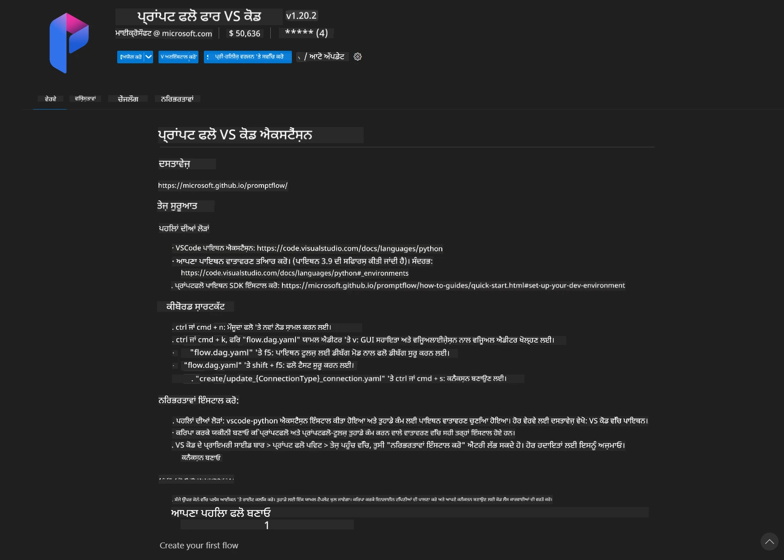
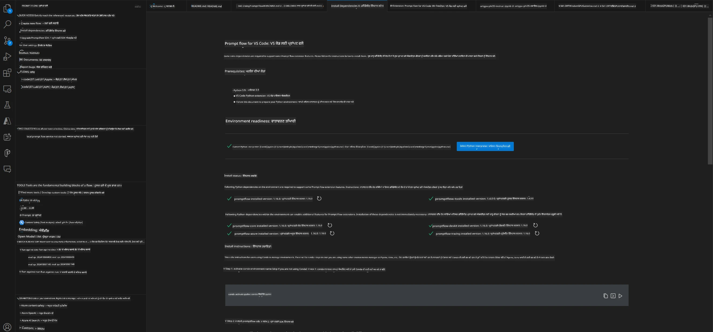
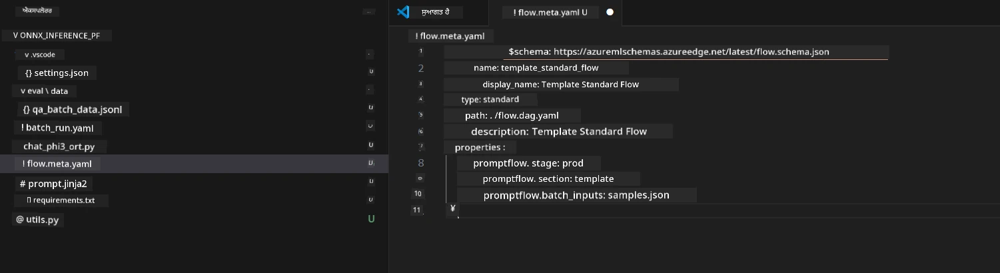
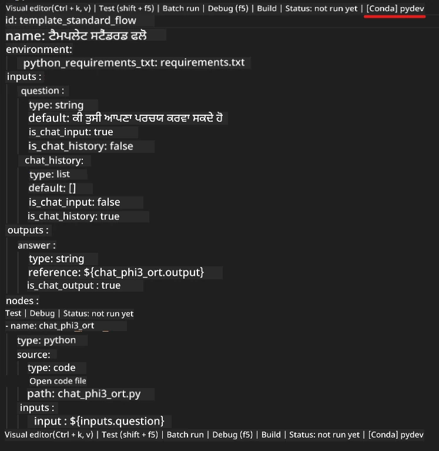
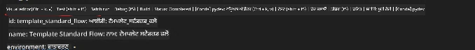
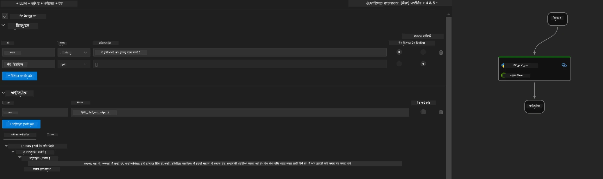
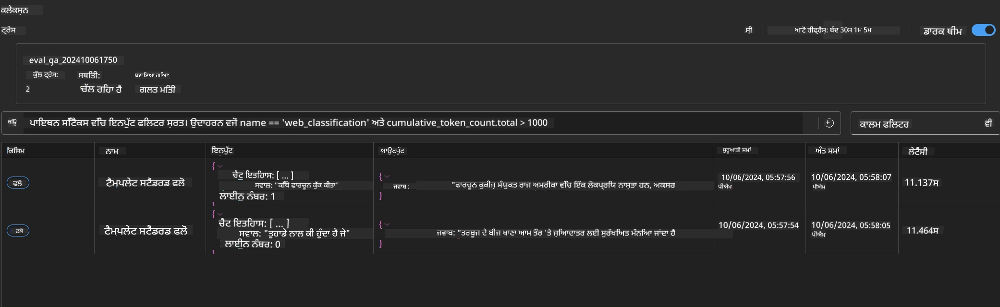

# Windows GPU ਦੀ ਵਰਤੋਂ ਕਰਕੇ Phi-3.5-Instruct ONNX ਨਾਲ Prompt flow ਹੱਲ ਬਣਾਉਣਾ 

ਹੇਠਾਂ ਦਿੱਤਾ ਦਸਤਾਵੇਜ਼ ਇਹ ਉਦਾਹਰਨ ਹੈ ਕਿ ONNX (Open Neural Network Exchange) ਨਾਲ PromptFlow ਨੂੰ Phi-3 ਮਾਡਲਾਂ ਅਧਾਰਿਤ AI ਐਪਲੀਕੇਸ਼ਨਾਂ ਵਿਕਸਿਤ ਕਰਨ ਲਈ ਕਿਵੇਂ ਵਰਤਣਾ ਹੈ।

PromptFlow ਇੱਕ ਐਸਾ ਵਿਕਾਸ ਟੂਲ ਸੂਟ ਹੈ ਜੋ LLM-ਅਧਾਰਿਤ (ਵੱਡੇ ਭਾਸ਼ਾ ਮਾਡਲ) AI ਐਪਲੀਕੇਸ਼ਨਾਂ ਦੇ ਸਮੂਹ-ਚਕਰ ਵਿਕਾਸ ਚੱਕਰ ਨੂੰ ਸੁਚਾਰੂ ਬਣਾਉਣ ਲਈ ਬਣਾਇਆ ਗਿਆ ਹੈ, ਵਿਚਾਰ ਤੋਂ ਲੈ ਕੇ ਪ੍ਰੋਟੋਟਾਈਪਿੰਗ, ਟੈਸਟਿੰਗ ਅਤੇ ਮੁਲਾਂਕਣ ਤੱਕ।

PromptFlow ਨੂੰ ONNX ਨਾਲ ਇੰਤਿਗ੍ਰੇਟ ਕਰਕੇ ਵਿਕਾਸਕਾਰ ਕਰ ਸਕਦੇ ਹਨ:

- ਮਾਡਲ ਪ੍ਰਦਰਸ਼ਨ ਦੀ ਬਿਹਤਰੀ ਕਰੋ: ONNX ਦੀ ਵਰਤੋਂ ਨਾਲ ਮਾਡਲ ਇੰਫਰੰਸ ਅਤੇਤਨਖੇਦਾਰੀ ਵਿੱਚ ਕੁਸ਼ਲਤਾ ਪ੍ਰਾਪਤ ਕਰੋ।
- ਵਿਕਾਸ ਨੂੰ ਸਧਾਰਿਤ ਕਰੋ: PromptFlow ਦੀ ਵਰਤੋਂ ਉੱਪਰ-ਕਾਰਜ ਪ੍ਰਬੰਧਨ ਲਈ ਅਤੇ ਮੁੜ-ਮੁੜ ਕਾਮਾਂ ਨੂੰ ਆਟੋਮੈਟ ਕਰਨ ਲਈ ਕਰੋ।
- ਸਹਿਯੋਗ ਨੂੰ ਬਿਹਤਰ ਬਣਾਓ: ਟੀਮ ਮੈਂਬਰਾਂ ਵਿੱਚ ਚੰਗਾ ਸਹਿਯੋਗ ਯਕੀਨੀ ਬਨਾਉਣ ਲਈ ਇਕਸਾਰ ਵਿਕਾਸ ਵਾਤਾਵਰਨ ਮੁਹੱਈਆ ਕਰੋ।

**Prompt flow** ਇੱਕ ਐਸਾ ਵਿਕਾਸ ਟੂਲ ਸੂਟ ਹੈ ਜੋ LLM-ਅਧਾਰਿਤ AI ਐਪਲੀਕੇਸ਼ਨਾਂ ਦੇ ਸਮੂਹ-ਚਕਰ ਵਿਕਾਸ ਨੂੰ ਸੁਚਾਰੂ ਬਣਾਉਣ ਲਈ ਬਣਾਇਆ ਗਿਆ ਹੈ, ਵਿਚਾਰ, ਪ੍ਰੋਟੋਟਾਈਪ, ਟੈਸਟਿੰਗ, ਮੁਲਾਂਕਣ ਤੋਂ ਲੈ ਕੇ ਉਤਪਾਦਨ ਤੱਕ। ਇਹ ਪ੍ਰੋਮਪਟ ਇੰਜੀਨੀਅਰਿੰਗ ਨੂੰ ਬਹੁਤ ਅਸਾਨ ਬਣਾਉਂਦਾ ਹੈ ਅਤੇ ਤੁਹਾਨੂੰ ਉਤਪਾਦਨ ਗੁਣਵੱਤਾ ਵਾਲੇ LLM ਐਪ ਬਣਾਉਣ ਵਿੱਚ ਮਦਦ ਕਰਦਾ ਹੈ।

Prompt flow OpenAI, Azure OpenAI Service ਅਤੇ ਕਸਟਮਾਈਜ਼ੇਬਲ ਮਾਡਲਾਂ (Huggingface, ਸਥਾਨਕ LLM/SLM) ਨਾਲ ਜੁੜ ਸਕਦਾ ਹੈ। ਅਸੀਂ Phi-3.5 ਦੇ ਕੁਐਂਟਾਈਜ਼ਡ ONNX ਮਾਡਲ ਨੂੰ ਸਥਾਨਕ ਐਪਲੀਕੇਸ਼ਨਾਂ ਵਿੱਚ ਤਾਇਨਾਤ ਕਰਨ ਦੀ ਉਮੀਦ ਰੱਖਦੇ ਹਾਂ। Prompt flow ਸਾਡੇ ਕਾਰੋਬਾਰ ਨੂੰ ਬਿਹਤਰ ਯੋਜਨਾ ਬਣਾਉਣ ਵਿੱਚ ਅਤੇ Phi-3.5 ਦੇ ਆਧਾਰ 'ਤੇ ਸਥਾਨਕ ਹੱਲ ਪੂਰੇ ਕਰਨ ਵਿੱਚ ਸਹਾਇਤਾ ਕਰ ਸਕਦਾ ਹੈ। ਇਸ ਉਦਾਹਰਨ ਵਿੱਚ, ਅਸੀਂ ONNX Runtime GenAI ਲਾਇਬ੍ਰੇਰੀ ਨੂੰ ਜੋੜ ਕੇ Windows GPU 'ਤੇ ਆਧਾਰਿਤ Prompt flow ਹੱਲ ਨੂੰ ਪੂਰਾ ਕਰਾਂਗੇ।

## **ਇੰਸਟਾਲੇਸ਼ਨ**

### **Windows GPU ਲਈ ONNX Runtime GenAI**

Windows GPU ਲਈ ONNX Runtime GenAI ਸੈਟ ਕਰਨ ਲਈ ਇਹ ਸਲਾਹ-ਮਸਵਰਾ ਪੜ੍ਹੋ [click here](./ORTWindowGPUGuideline.md)

### **VSCode ਵਿੱਚ Prompt flow ਸੈੱਟ ਅੱਪ ਕਰੋ**

1. Prompt flow VS Code ਐਕਸਟੈਂਸ਼ਨ ਇੰਸਟਾਲ ਕਰੋ



2. Prompt flow VS Code ਐਕਸਟੈਂਸ਼ਨ ਇੰਸਟਾਲ ਕਰਨ ਤੋਂ ਬਾਅਦ, ਐਕਸਟੈਂਸ਼ਨ 'ਤੇ ਕਲਿੱਕ ਕਰੋ, ਅਤੇ **ਇੰਸਟਾਲੇਸ਼ਨ ਡਿਪੈਂਡੈਂਸੀਜ਼** ਚੁਣੋ, ਇਸ ਸਲਾਹ-ਮਸਵਰੇ ਨੂੰ ਫਾਲੋ ਕਰਦੇ ਹੋਏ Prompt flow SDK ਆਪਣੇ ਵਾਤਾਵਰਨ ਵਿੱਚ ਇੰਸਟਾਲ ਕਰੋ



3. [Sample Code](../../../../../../code/09.UpdateSamples/Aug/pf/onnx_inference_pf) ਡਾਊਨਲੋਡ ਕਰੋ ਅਤੇ VS Code ਨਾਲ ਇਸ ਸੈਂਪਲ ਨੂੰ ਖੋਲ੍ਹੋ



4. **flow.dag.yaml** ਖੋਲ੍ਹੋ ਅਤੇ ਆਪਣਾ Python ਵਾਤਾਵਰਨ ਚੁਣੋ



   **chat_phi3_ort.py** ਖੋਲ੍ਹੋ ਅਤੇ ਆਪਣੀ Phi-3.5-instruct ONNX ਮਾਡਲ ਸਥਿਤੀ ਬਦਲੋ


5. ਆਪਣੇ prompt flow ਨੂੰ ਟੈਸਟ ਕਰਨ ਲਈ ਚਲਾਓ

**flow.dag.yaml** ਖੋਲ੍ਹੋ ਅਤੇ visual editor 'ਤੇ ਕਲਿੱਕ ਕਰੋ



ਇਸ 'ਤੇ ਕਲਿੱਕ ਕਰਨ ਤੋਂ ਬਾਅਦ, ਇਸ ਨੂੰ ਚਲਾ ਕੇ ਟੈਸਟ ਕਰੋ



1. ਤੁਸੀਂ ਮੋਰ ਨਤੀਜਿਆਂ ਲਈ ਟਰਮੀਨਲ ਵਿੱਚ ਬੈਚ ਚਲਾ ਸਕਦੇ ਹੋ


```bash

pf run create --file batch_run.yaml --stream --name 'Your eval qa name'    

```

ਤੁਸੀਂ ਆਪਣੇ ਡਿਫਾਲਟ ਬ੍ਰਾਊਜ਼ਰ ਵਿੱਚ ਨਤੀਜੇ ਦੇਖ ਸਕਦੇ ਹੋ




---

<!-- CO-OP TRANSLATOR DISCLAIMER START -->
**ਅਸਵੀਕਾਰੋਪਣ**:
ਇਸ ਦਸਤਾਵੇਜ਼ ਦਾ ਅਨੁਵਾਦ ਏਆਈ ਅਨੁਵਾਦ ਸੇਵਾ [Co-op Translator](https://github.com/Azure/co-op-translator) ਦੀ ਵਰਤੋਂ ਕਰਕੇ ਕੀਤਾ ਗਿਆ ਹੈ। ਜਦੋਂ ਕਿ ਅਸੀਂ ਸਹੀਤਾਵਾਂ ਲਈ ਯਤਨਸ਼ੀਲ ਹਾਂ, ਕਿਰਪਾ ਕਰਕੇ ਧਿਆਨ ਰੱਖੋ ਕਿ ਸਵੈਚਾਲਿਤ ਅਨੁਵਾਦਾਂ ਵਿੱਚ ਗਲਤੀਆਂ ਜਾਂ ਅਸਮੱਤਿਆਵਾਂ ਹੋ ਸਕਦੀਆਂ ਹਨ। ਮੂਲ ਦਸਤਾਵੇਜ਼ ਆਪਣੀ ਮੂਲ ਭਾਸ਼ਾ ਵਿੱਚ ਅਧਿਕਾਰਕ ਸਰੋਤ ਮੰਨਿਆ ਜਾਣਾ ਚਾਹੀਦਾ ਹੈ। ਜਰੂਰੀ ਜਾਣਕਾਰੀ ਲਈ, ਪੇਸ਼ੇਵਰ ਮਨੁੱਖੀ ਅਨੁਵਾਦ ਦੀ ਸਿਫ਼ਾਰਸ਼ ਕੀਤੀ ਜਾਂਦੀ ਹੈ। ਅਸੀਂ ਇਸ ਅਨੁਵਾਦ ਦੇ ਉਪਯੋਗ ਤੋਂ ਪੈਦਾ ਹੋਣ ਵਾਲੀਆਂ ਕਿਸੇ ਵੀ ਗਲਤਫਹਿਮੀਆਂ ਜਾਂ ਗਲਤ ਵਿਆਖਿਆਵਾਂ ਲਈ ਜਵਾਬਦੇਹ ਨਹੀਂ ਹਾਂ।
<!-- CO-OP TRANSLATOR DISCLAIMER END -->