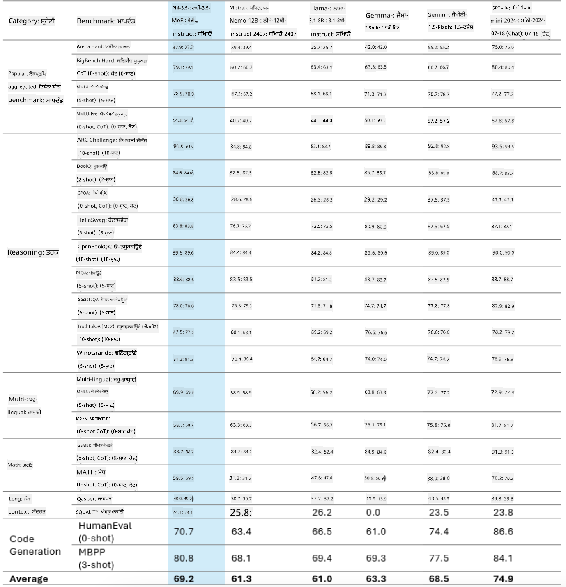
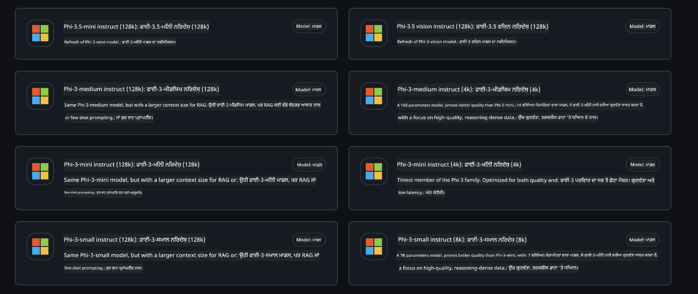
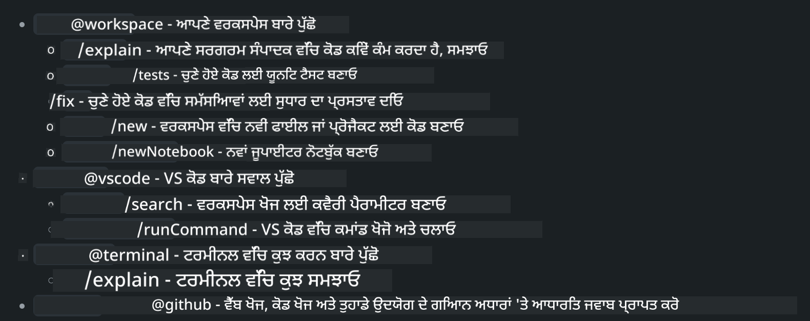
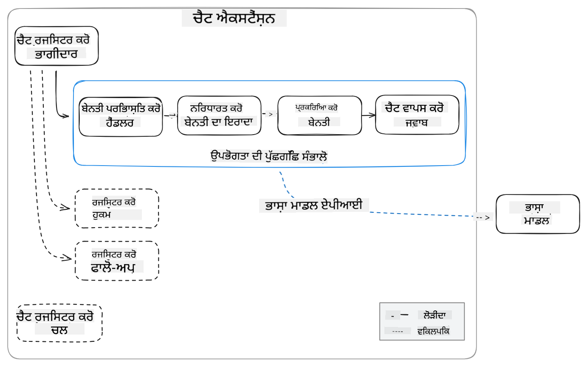
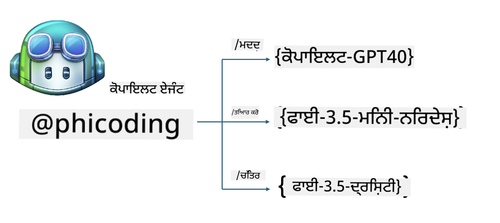
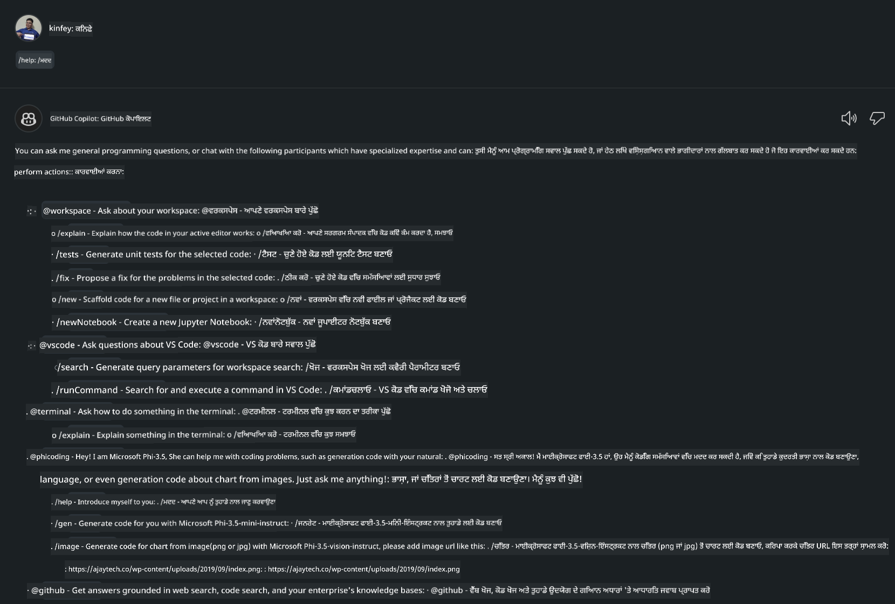
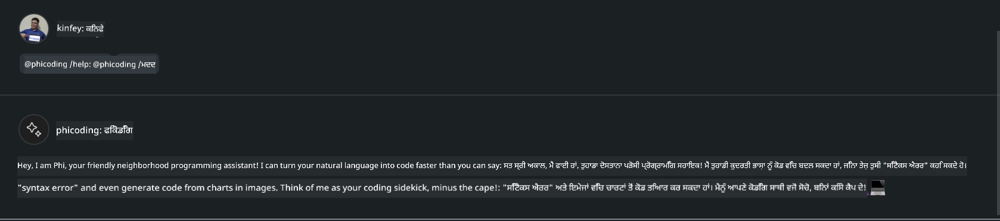
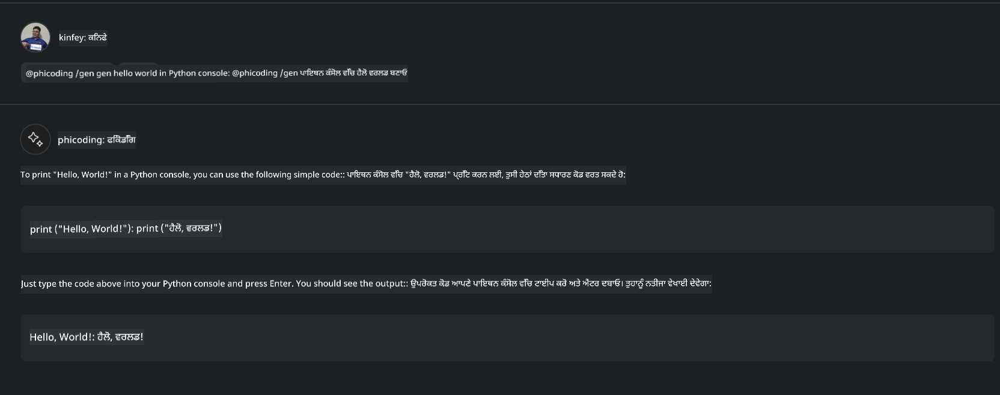
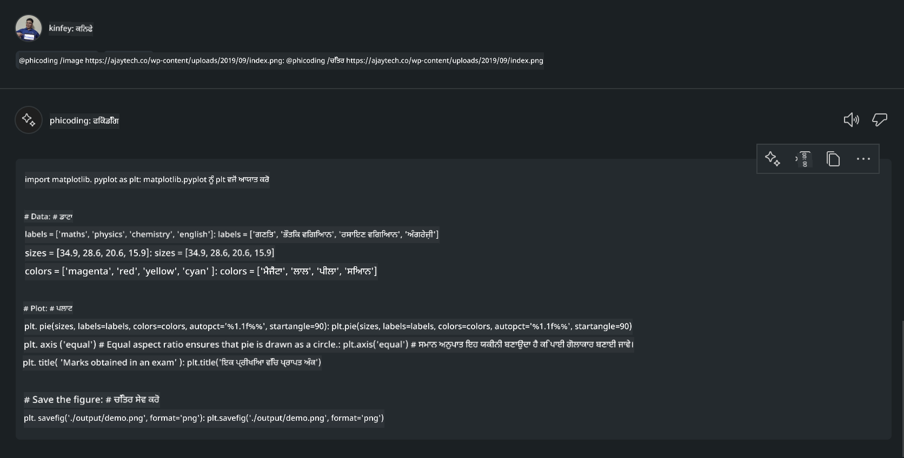

<!--
CO_OP_TRANSLATOR_METADATA:
{
  "original_hash": "35bf81388ac6917277b8d9a0c39bdc70",
  "translation_date": "2025-07-17T03:24:36+00:00",
  "source_file": "md/02.Application/02.Code/Phi3/CreateVSCodeChatAgentWithGitHubModels.md",
  "language_code": "pa"
}
-->
# **GitHub Models ਨਾਲ Phi-3.5 ਦੀ ਵਰਤੋਂ ਕਰਕੇ ਆਪਣਾ Visual Studio Code Chat Copilot ਏਜੰਟ ਬਣਾਓ**

ਕੀ ਤੁਸੀਂ Visual Studio Code Copilot ਵਰਤ ਰਹੇ ਹੋ? ਖਾਸ ਕਰਕੇ Chat ਵਿੱਚ, ਤੁਸੀਂ ਵੱਖ-ਵੱਖ ਏਜੰਟਾਂ ਦੀ ਵਰਤੋਂ ਕਰਕੇ Visual Studio Code ਵਿੱਚ ਪ੍ਰੋਜੈਕਟ ਬਣਾਉਣ, ਲਿਖਣ ਅਤੇ ਸੰਭਾਲਣ ਦੀ ਸਮਰੱਥਾ ਨੂੰ ਬਿਹਤਰ ਕਰ ਸਕਦੇ ਹੋ। Visual Studio Code ਇੱਕ API ਪ੍ਰਦਾਨ ਕਰਦਾ ਹੈ ਜੋ ਕੰਪਨੀਆਂ ਅਤੇ ਵਿਅਕਤੀਆਂ ਨੂੰ ਆਪਣੇ ਕਾਰੋਬਾਰ ਦੇ ਅਧਾਰ 'ਤੇ ਵੱਖ-ਵੱਖ ਏਜੰਟ ਬਣਾਉਣ ਦੀ ਆਗਿਆ ਦਿੰਦਾ ਹੈ ਤਾਂ ਜੋ ਉਹ ਆਪਣੇ ਖਾਸ ਖੇਤਰਾਂ ਵਿੱਚ ਆਪਣੀ ਸਮਰੱਥਾ ਨੂੰ ਵਧਾ ਸਕਣ। ਇਸ ਲੇਖ ਵਿੱਚ, ਅਸੀਂ GitHub Models ਦੇ **Phi-3.5-mini-instruct (128k)** ਅਤੇ **Phi-3.5-vision-instruct (128k)** 'ਤੇ ਧਿਆਨ ਕੇਂਦ੍ਰਿਤ ਕਰਾਂਗੇ ਤਾਂ ਜੋ ਤੁਸੀਂ ਆਪਣਾ Visual Studio Code ਏਜੰਟ ਬਣਾ ਸਕੋ।

## **GitHub Models 'ਤੇ Phi-3.5 ਬਾਰੇ**

ਸਾਨੂੰ ਪਤਾ ਹੈ ਕਿ Phi-3/3.5-mini-instruct Phi-3/3.5 ਪਰਿਵਾਰ ਵਿੱਚ ਮਜ਼ਬੂਤ ਕੋਡ ਸਮਝਣ ਅਤੇ ਬਣਾਉਣ ਦੀ ਸਮਰੱਥਾ ਰੱਖਦਾ ਹੈ, ਅਤੇ ਇਹ Gemma-2-9b ਅਤੇ Mistral-Nemo-12B-instruct-2407 ਨਾਲੋਂ ਬਿਹਤਰ ਹੈ।



ਤਾਜ਼ਾ GitHub Models ਪਹਿਲਾਂ ਹੀ Phi-3.5-mini-instruct (128k) ਅਤੇ Phi-3.5-vision-instruct (128k) ਮਾਡਲਾਂ ਦੀ ਪਹੁੰਚ ਦਿੰਦੇ ਹਨ। ਡਿਵੈਲਪਰ OpenAI SDK, Azure AI Inference SDK, ਅਤੇ REST API ਰਾਹੀਂ ਇਨ੍ਹਾਂ ਤੱਕ ਪਹੁੰਚ ਕਰ ਸਕਦੇ ਹਨ।



***Note:*** ਇੱਥੇ Azure AI Inference SDK ਦੀ ਵਰਤੋਂ ਕਰਨ ਦੀ ਸਿਫਾਰਸ਼ ਕੀਤੀ ਜਾਂਦੀ ਹੈ, ਕਿਉਂਕਿ ਇਹ ਪ੍ਰੋਡਕਸ਼ਨ ਵਾਤਾਵਰਣ ਵਿੱਚ Azure Model Catalog ਨਾਲ ਬਿਹਤਰ ਤਰੀਕੇ ਨਾਲ ਸਵਿੱਚ ਕਰ ਸਕਦਾ ਹੈ।

ਹੇਠਾਂ GitHub Models ਨਾਲ ਡਾਕਿੰਗ ਤੋਂ ਬਾਅਦ ਕੋਡ ਬਣਾਉਣ ਦੇ ਸੰਦਰਭ ਵਿੱਚ **Phi-3.5-mini-instruct (128k)** ਅਤੇ **Phi-3.5-vision-instruct (128k)** ਦੇ ਨਤੀਜੇ ਦਿੱਤੇ ਗਏ ਹਨ, ਅਤੇ ਅਗਲੇ ਉਦਾਹਰਣਾਂ ਲਈ ਤਿਆਰੀ ਕੀਤੀ ਗਈ ਹੈ।

**ਡੈਮੋ: GitHub Models Phi-3.5-mini-instruct (128k) ਪ੍ਰਾਂਪਟ ਤੋਂ ਕੋਡ ਬਣਾਉਣਾ** ([ਇਸ ਲਿੰਕ 'ਤੇ ਕਲਿੱਕ ਕਰੋ](../../../../../../code/09.UpdateSamples/Aug/ghmodel_phi35_instruct_demo.ipynb))

**ਡੈਮੋ: GitHub Models Phi-3.5-vision-instruct (128k) ਚਿੱਤਰ ਤੋਂ ਕੋਡ ਬਣਾਉਣਾ** ([ਇਸ ਲਿੰਕ 'ਤੇ ਕਲਿੱਕ ਕਰੋ](../../../../../../code/09.UpdateSamples/Aug/ghmodel_phi35_vision_demo.ipynb))


## **GitHub Copilot Chat Agent ਬਾਰੇ**

GitHub Copilot Chat Agent ਵੱਖ-ਵੱਖ ਪ੍ਰੋਜੈਕਟ ਸੰਦਰਭਾਂ ਵਿੱਚ ਕੋਡ ਦੇ ਅਧਾਰ 'ਤੇ ਵੱਖ-ਵੱਖ ਕੰਮ ਪੂਰੇ ਕਰ ਸਕਦਾ ਹੈ। ਸਿਸਟਮ ਵਿੱਚ ਚਾਰ ਏਜੰਟ ਹਨ: workspace, github, terminal, vscode



ਏਜੰਟ ਦੇ ਨਾਮ ਨਾਲ ‘@’ ਜੋੜ ਕੇ, ਤੁਸੀਂ ਜਲਦੀ ਨਾਲ ਸੰਬੰਧਿਤ ਕੰਮ ਪੂਰਾ ਕਰ ਸਕਦੇ ਹੋ। ਉਦਯੋਗਾਂ ਲਈ, ਜੇ ਤੁਸੀਂ ਆਪਣੇ ਕਾਰੋਬਾਰੀ ਸੰਬੰਧੀ ਸਮੱਗਰੀ ਜਿਵੇਂ ਕਿ ਲੋੜਾਂ, ਕੋਡਿੰਗ, ਟੈਸਟ ਵਿਸ਼ੇਸ਼ਤਾਵਾਂ, ਅਤੇ ਰਿਲੀਜ਼ ਸ਼ਾਮਲ ਕਰਦੇ ਹੋ, ਤਾਂ ਤੁਸੀਂ GitHub Copilot ਦੇ ਆਧਾਰ 'ਤੇ ਹੋਰ ਸ਼ਕਤੀਸ਼ਾਲੀ ਉਦਯੋਗੀ ਨਿੱਜੀ ਫੰਕਸ਼ਨ ਪ੍ਰਾਪਤ ਕਰ ਸਕਦੇ ਹੋ।

Visual Studio Code Chat Agent ਹੁਣ ਆਪਣਾ API ਅਧਿਕਾਰਕ ਤੌਰ 'ਤੇ ਜਾਰੀ ਕਰ ਚੁੱਕਾ ਹੈ, ਜੋ ਉਦਯੋਗਾਂ ਜਾਂ ਉਦਯੋਗੀ ਡਿਵੈਲਪਰਾਂ ਨੂੰ ਵੱਖ-ਵੱਖ ਸਾਫਟਵੇਅਰ ਕਾਰੋਬਾਰੀ ਪਰਿਵਾਰਾਂ ਦੇ ਅਧਾਰ 'ਤੇ ਏਜੰਟ ਵਿਕਸਿਤ ਕਰਨ ਦੀ ਆਗਿਆ ਦਿੰਦਾ ਹੈ। Visual Studio Code Extension Development ਦੇ ਵਿਕਾਸ ਤਰੀਕੇ ਦੇ ਅਧਾਰ 'ਤੇ, ਤੁਸੀਂ ਆਸਾਨੀ ਨਾਲ Visual Studio Code Chat Agent API ਦਾ ਇੰਟਰਫੇਸ ਪ੍ਰਾਪਤ ਕਰ ਸਕਦੇ ਹੋ। ਅਸੀਂ ਇਸ ਪ੍ਰਕਿਰਿਆ ਦੇ ਅਧਾਰ 'ਤੇ ਵਿਕਾਸ ਕਰ ਸਕਦੇ ਹਾਂ।



ਵਿਕਾਸ ਸੰਦਰਭ ਤੀਜੀ ਪੱਖ ਮਾਡਲ API (ਜਿਵੇਂ GitHub Models, Azure Model Catalog, ਅਤੇ ਖੁੱਲ੍ਹੇ ਸਰੋਤ ਮਾਡਲਾਂ ਦੇ ਆਧਾਰ 'ਤੇ ਬਣਾਈਆਂ ਸੇਵਾਵਾਂ) ਤੱਕ ਪਹੁੰਚ ਦਾ ਸਮਰਥਨ ਕਰਦਾ ਹੈ ਅਤੇ GitHub Copilot ਵੱਲੋਂ ਪ੍ਰਦਾਨ ਕੀਤੇ ਗਏ gpt-35-turbo, gpt-4, ਅਤੇ gpt-4o ਮਾਡਲਾਂ ਦੀ ਵਰਤੋਂ ਵੀ ਕਰ ਸਕਦਾ ਹੈ।

## **Phi-3.5 ਦੇ ਆਧਾਰ 'ਤੇ @phicoding ਏਜੰਟ ਸ਼ਾਮਲ ਕਰੋ**

ਅਸੀਂ Phi-3.5 ਦੀ ਪ੍ਰੋਗ੍ਰਾਮਿੰਗ ਸਮਰੱਥਾ ਨੂੰ ਇਕੱਠਾ ਕਰਨ ਦੀ ਕੋਸ਼ਿਸ਼ ਕਰਦੇ ਹਾਂ ਤਾਂ ਜੋ ਕੋਡ ਲਿਖਣਾ, ਚਿੱਤਰ ਬਣਾਉਣ ਵਾਲਾ ਕੋਡ ਅਤੇ ਹੋਰ ਕੰਮ ਪੂਰੇ ਕੀਤੇ ਜਾ ਸਕਣ। Phi-3.5 ਦੇ ਆਧਾਰ 'ਤੇ ਬਣਾਇਆ ਗਿਆ ਏਜੰਟ - @PHI, ਹੇਠਾਂ ਕੁਝ ਫੰਕਸ਼ਨ ਹਨ:

1. GitHub Copilot ਵੱਲੋਂ ਪ੍ਰਦਾਨ ਕੀਤੇ GPT-4o ਦੇ ਆਧਾਰ 'ਤੇ **@phicoding /help** ਕਮਾਂਡ ਰਾਹੀਂ ਸਵੈ-ਪਰੀਚਯ ਬਣਾਓ

2. **Phi-3.5-mini-instruct (128k)** ਦੇ ਆਧਾਰ 'ਤੇ ਵੱਖ-ਵੱਖ ਪ੍ਰੋਗ੍ਰਾਮਿੰਗ ਭਾਸ਼ਾਵਾਂ ਲਈ ਕੋਡ **@phicoding /gen** ਕਮਾਂਡ ਰਾਹੀਂ ਬਣਾਓ

3. **Phi-3.5-vision-instruct (128k)** ਅਤੇ ਚਿੱਤਰ ਪੂਰਨਤਾ ਦੇ ਆਧਾਰ 'ਤੇ ਕੋਡ **@phicoding /image** ਕਮਾਂਡ ਰਾਹੀਂ ਬਣਾਓ



## **ਸੰਬੰਧਿਤ ਕਦਮ**

1. npm ਦੀ ਵਰਤੋਂ ਕਰਕੇ Visual Studio Code Extension ਵਿਕਾਸ ਸਹਾਇਤਾ ਇੰਸਟਾਲ ਕਰੋ

```bash

npm install --global yo generator-code 

```

2. Visual Studio Code Extension ਪਲੱਗਇਨ ਬਣਾਓ (Typescript ਵਿਕਾਸ ਮੋਡ ਵਿੱਚ, ਨਾਮ phiext)

```bash

yo code 

```

3. ਬਣਾਏ ਪ੍ਰੋਜੈਕਟ ਨੂੰ ਖੋਲ੍ਹੋ ਅਤੇ package.json ਨੂੰ ਸੋਧੋ। ਇੱਥੇ ਸੰਬੰਧਿਤ ਹਦਾਇਤਾਂ ਅਤੇ ਸੰਰਚਨਾਵਾਂ ਹਨ, ਨਾਲ ਹੀ GitHub Models ਦੀ ਸੰਰਚਨਾ ਵੀ। ਧਿਆਨ ਦਿਓ ਕਿ ਤੁਹਾਨੂੰ ਇੱਥੇ ਆਪਣਾ GitHub Models ਟੋਕਨ ਸ਼ਾਮਲ ਕਰਨਾ ਹੈ।

```json

{
  "name": "phiext",
  "displayName": "phiext",
  "description": "",
  "version": "0.0.1",
  "engines": {
    "vscode": "^1.93.0"
  },
  "categories": [
    "AI",
    "Chat"
  ],
  "activationEvents": [],
  "enabledApiProposals": [
      "chatVariableResolver"
  ],
  "main": "./dist/extension.js",
  "contributes": {
    "chatParticipants": [
        {
            "id": "chat.phicoding",
            "name": "phicoding",
            "description": "Hey! I am Microsoft Phi-3.5, She can help me with coding problems, such as generation code with your natural language, or even generation code about chart from images. Just ask me anything!",
            "isSticky": true,
            "commands": [
                {
                    "name": "help",
                    "description": "Introduce myself to you"
                },
                {
                    "name": "gen",
                    "description": "Generate code for you with Microsoft Phi-3.5-mini-instruct"
                },
                {
                    "name": "image",
                    "description": "Generate code for chart from image(png or jpg) with Microsoft Phi-3.5-vision-instruct, please add image url like this : https://ajaytech.co/wp-content/uploads/2019/09/index.png"
                }
            ]
        }
    ],
    "commands": [
        {
            "command": "phicoding.namesInEditor",
            "title": "Use Microsoft Phi 3.5 in Editor"
        }
    ],
    "configuration": {
      "type": "object",
      "title": "githubmodels",
      "properties": {
        "githubmodels.endpoint": {
          "type": "string",
          "default": "https://models.inference.ai.azure.com",
          "description": "Your GitHub Models Endpoint",
          "order": 0
        },
        "githubmodels.api_key": {
          "type": "string",
          "default": "Your GitHub Models Token",
          "description": "Your GitHub Models Token",
          "order": 1
        },
        "githubmodels.phi35instruct": {
          "type": "string",
          "default": "Phi-3.5-mini-instruct",
          "description": "Your Phi-35-Instruct Model",
          "order": 2
        },
        "githubmodels.phi35vision": {
          "type": "string",
          "default": "Phi-3.5-vision-instruct",
          "description": "Your Phi-35-Vision Model",
          "order": 3
        }
      }
    }
  },
  "scripts": {
    "vscode:prepublish": "npm run package",
    "compile": "webpack",
    "watch": "webpack --watch",
    "package": "webpack --mode production --devtool hidden-source-map",
    "compile-tests": "tsc -p . --outDir out",
    "watch-tests": "tsc -p . -w --outDir out",
    "pretest": "npm run compile-tests && npm run compile && npm run lint",
    "lint": "eslint src",
    "test": "vscode-test"
  },
  "devDependencies": {
    "@types/vscode": "^1.93.0",
    "@types/mocha": "^10.0.7",
    "@types/node": "20.x",
    "@typescript-eslint/eslint-plugin": "^8.3.0",
    "@typescript-eslint/parser": "^8.3.0",
    "eslint": "^9.9.1",
    "typescript": "^5.5.4",
    "ts-loader": "^9.5.1",
    "webpack": "^5.94.0",
    "webpack-cli": "^5.1.4",
    "@vscode/test-cli": "^0.0.10",
    "@vscode/test-electron": "^2.4.1"
  },
  "dependencies": {
    "@types/node-fetch": "^2.6.11",
    "node-fetch": "^3.3.2",
    "@azure-rest/ai-inference": "latest",
    "@azure/core-auth": "latest",
    "@azure/core-sse": "latest"
  }
}


```

4. src/extension.ts ਨੂੰ ਸੋਧੋ

```typescript

// The module 'vscode' contains the VS Code extensibility API
// Import the module and reference it with the alias vscode in your code below
import * as vscode from 'vscode';
import ModelClient from "@azure-rest/ai-inference";
import { AzureKeyCredential } from "@azure/core-auth";


interface IPhiChatResult extends vscode.ChatResult {
    metadata: {
        command: string;
    };
}


const MODEL_SELECTOR: vscode.LanguageModelChatSelector = { vendor: 'copilot', family: 'gpt-4o' };

function isValidImageUrl(url: string): boolean {
    const regex = /^(https?:\/\/.*\.(?:png|jpg))$/i;
    return regex.test(url);
}
  

// This method is called when your extension is activated
// Your extension is activated the very first time the command is executed
export function activate(context: vscode.ExtensionContext) {

    const codinghandler: vscode.ChatRequestHandler = async (request: vscode.ChatRequest, context: vscode.ChatContext, stream: vscode.ChatResponseStream, token: vscode.CancellationToken): Promise<IPhiChatResult> => {


        const config : any = vscode.workspace.getConfiguration('githubmodels');
        const endPoint: string = config.get('endpoint');
        const apiKey: string = config.get('api_key');
        const phi35instruct: string = config.get('phi35instruct');
        const phi35vision: string = config.get('phi35vision');
        
        if (request.command === 'help') {

            const content = "Welcome to Coding assistant with Microsoft Phi-3.5"; 
            stream.progress(content);


            try {
                const [model] = await vscode.lm.selectChatModels(MODEL_SELECTOR);
                if (model) {
                    const messages = [
                        vscode.LanguageModelChatMessage.User("Please help me express this content in a humorous way: I am a programming assistant who can help you convert natural language into code and generate code based on the charts in the images. output format like this : Hey I am Phi ......")
                    ];
                    const chatResponse = await model.sendRequest(messages, {}, token);
                    for await (const fragment of chatResponse.text) {
                        stream.markdown(fragment);
                    }
                }
            } catch(err) {
                console.log(err);
            }


            return { metadata: { command: 'help' } };

        }

        
        if (request.command === 'gen') {

            const content = "Welcome to use phi-3.5 to generate code";

            stream.progress(content);

            const client = new ModelClient(endPoint, new AzureKeyCredential(apiKey));

            const response = await client.path("/chat/completions").post({
              body: {
                messages: [
                  { role:"system", content: "You are a coding assistant.Help answer all code generation questions." },
                  { role:"user", content: request.prompt }
                ],
                model: phi35instruct,
                temperature: 0.4,
                max_tokens: 1000,
                top_p: 1.
              }
            });

            stream.markdown(response.body.choices[0].message.content);

            return { metadata: { command: 'gen' } };

        }


        
        if (request.command === 'image') {


            const content = "Welcome to use phi-3.5 to generate code from image(png or jpg),image url like this:https://ajaytech.co/wp-content/uploads/2019/09/index.png";

            stream.progress(content);

            if (!isValidImageUrl(request.prompt)) {
                stream.markdown('Please provide a valid image URL');
                return { metadata: { command: 'image' } };
            }
            else
            {

                const client = new ModelClient(endPoint, new AzureKeyCredential(apiKey));
    
                const response = await client.path("/chat/completions").post({
                    body: {
                      messages: [
                        { role: "system", content: "You are a helpful assistant that describes images in details." },
                        { role: "user", content: [
                            { type: "text", text: "Please generate code according to the chart in the picture according to the following requirements\n1. Keep all information in the chart, including data and text\n2. Do not generate additional information that is not included in the chart\n3. Please extract data from the picture, do not generate it from csv\n4. Please save the regenerated chart as a chart and save it to ./output/demo.png"},
                            { type: "image_url", image_url: {url: request.prompt}
                            }
                          ]
                        }
                      ],
                      model: phi35vision,
                      temperature: 0.4,
                      max_tokens: 2048,
                      top_p: 1.
                    }
                  });
    
                
                stream.markdown(response.body.choices[0].message.content);
    
                return { metadata: { command: 'image' } };
            }


        }


        return { metadata: { command: '' } };
    };


    const phi_ext = vscode.chat.createChatParticipant("chat.phicoding", codinghandler);

    phi_ext.iconPath = new vscode.ThemeIcon('sparkle');


    phi_ext.followupProvider = {
        provideFollowups(result: IPhiChatResult, context: vscode.ChatContext, token: vscode.CancellationToken) {
            return [{
                prompt: 'Let us coding with Phi-3.5 😋😋😋😋',
                label: vscode.l10n.t('Enjoy coding with Phi-3.5'),
                command: 'help'
            } satisfies vscode.ChatFollowup];
        }
    };

    context.subscriptions.push(phi_ext);
}

// This method is called when your extension is deactivated
export function deactivate() {}


```

6. ਚਲਾਉਣਾ

***/help***



***@phicoding /help***



***@phicoding /gen***



***@phicoding /image***



ਤੁਸੀਂ ਨਮੂਨਾ ਕੋਡ ਡਾਊਨਲੋਡ ਕਰ ਸਕਦੇ ਹੋ: [ਇੱਥੇ ਕਲਿੱਕ ਕਰੋ](../../../../../../code/09.UpdateSamples/Aug/vscode)

## **ਸੰਸਾਧਨ**

1. GitHub Models ਲਈ ਸਾਈਨ ਅਪ ਕਰੋ [https://gh.io/models](https://gh.io/models)

2. Visual Studio Code Extension Development ਸਿੱਖੋ [https://code.visualstudio.com/api/get-started/your-first-extension](https://code.visualstudio.com/api/get-started/your-first-extension)

3. Visual Studio Code Copilot Chat API ਬਾਰੇ ਜਾਣੋ [https://code.visualstudio.com/api/extension-guides/chat](https://code.visualstudio.com/api/extension-guides/chat)

**ਅਸਵੀਕਾਰੋਪਣ**:  
ਇਹ ਦਸਤਾਵੇਜ਼ AI ਅਨੁਵਾਦ ਸੇਵਾ [Co-op Translator](https://github.com/Azure/co-op-translator) ਦੀ ਵਰਤੋਂ ਕਰਕੇ ਅਨੁਵਾਦਿਤ ਕੀਤਾ ਗਿਆ ਹੈ। ਜਦੋਂ ਕਿ ਅਸੀਂ ਸਹੀਤਾ ਲਈ ਕੋਸ਼ਿਸ਼ ਕਰਦੇ ਹਾਂ, ਕਿਰਪਾ ਕਰਕੇ ਧਿਆਨ ਰੱਖੋ ਕਿ ਸਵੈਚਾਲਿਤ ਅਨੁਵਾਦਾਂ ਵਿੱਚ ਗਲਤੀਆਂ ਜਾਂ ਅਸਮਰਥਤਾਵਾਂ ਹੋ ਸਕਦੀਆਂ ਹਨ। ਮੂਲ ਦਸਤਾਵੇਜ਼ ਆਪਣੀ ਮੂਲ ਭਾਸ਼ਾ ਵਿੱਚ ਪ੍ਰਮਾਣਿਕ ਸਰੋਤ ਮੰਨਿਆ ਜਾਣਾ ਚਾਹੀਦਾ ਹੈ। ਮਹੱਤਵਪੂਰਨ ਜਾਣਕਾਰੀ ਲਈ, ਪੇਸ਼ੇਵਰ ਮਨੁੱਖੀ ਅਨੁਵਾਦ ਦੀ ਸਿਫਾਰਸ਼ ਕੀਤੀ ਜਾਂਦੀ ਹੈ। ਅਸੀਂ ਇਸ ਅਨੁਵਾਦ ਦੀ ਵਰਤੋਂ ਤੋਂ ਉਤਪੰਨ ਕਿਸੇ ਵੀ ਗਲਤਫਹਿਮੀ ਜਾਂ ਗਲਤ ਵਿਆਖਿਆ ਲਈ ਜ਼ਿੰਮੇਵਾਰ ਨਹੀਂ ਹਾਂ।