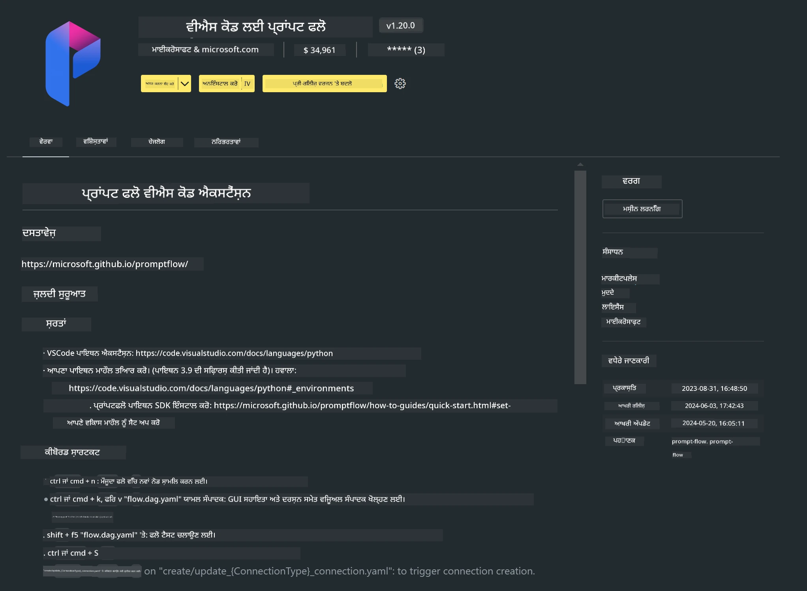

# **ਲੈਬ 0 - ਇੰਸਟਾਲੇਸ਼ਨ**

ਜਦੋਂ ਅਸੀਂ ਲੈਬ ਵਿੱਚ ਦਾਖਲ ਹੁੰਦੇ ਹਾਂ, ਤਾਂ ਸਾਨੂੰ ਸਬੰਧਤ ਵਾਤਾਵਰਣ ਨੂੰ ਸੈੱਟਅੱਪ ਕਰਨਾ ਪੈਂਦਾ ਹੈ :


### **1. Python 3.11+**

ਤੁਹਾਡੇ Python ਵਾਤਾਵਰਣ ਨੂੰ ਸੈੱਟਅੱਪ ਕਰਨ ਲਈ miniforge ਵਰਤਣਾ ਸਿਫਾਰਸ਼ੀ ਹੈ

miniforge ਸੈੱਟਅੱਪ ਕਰਨ ਲਈ, ਕਿਰਪਾ ਕਰਕੇ [https://github.com/conda-forge/miniforge](https://github.com/conda-forge/miniforge) ਨੂੰ ਵੇਖੋ

miniforge ਸੈੱਟਅੱਪ ਕਰਨ ਤੋਂ ਬਾਅਦ, Power Shell ਵਿੱਚ ਹੇਠਾਂ ਦਿੱਤਾ ਕਮਾਂਡ ਚਲਾਓ

```bash

conda create -n pyenv python==3.11.8 -y

conda activate pyenv

```


### **2. Prompt flow SDK ਇੰਸਟਾਲ ਕਰੋ**

ਲੈਬ 1 ਵਿੱਚ ਅਸੀਂ Prompt flow ਵਰਤਾਂਗੇ, ਇਸ ਲਈ ਤੁਹਾਨੂੰ Prompt flow SDK ਸੈੱਟਅੱਪ ਕਰਨਾ ਪਵੇਗਾ।

```bash

pip install promptflow --upgrade

```

ਤੁਸੀਂ ਇਸ ਕਮਾਂਡ ਨਾਲ promptflow sdk ਦੀ ਜਾਂਚ ਕਰ ਸਕਦੇ ਹੋ


```bash

pf --version

```

### **3. Visual Studio Code Prompt flow ਐਕਸਟੈਂਸ਼ਨ ਇੰਸਟਾਲ ਕਰੋ**




### **4. Intel NPU ਐਕਸਲੇਰੇਸ਼ਨ ਲਾਇਬ੍ਰੇਰੀ**

Intel ਦੇ ਨਵੇਂ ਜਨਰੇਸ਼ਨ ਪ੍ਰੋਸੈਸਰ NPU ਨੂੰ ਸਪੋਰਟ ਕਰਦੇ ਹਨ। ਜੇ ਤੁਸੀਂ LLMs / SLMs ਨੂੰ ਲੋਕਲ ਤੌਰ 'ਤੇ ਚਲਾਉਣ ਲਈ NPU ਵਰਤਣਾ ਚਾਹੁੰਦੇ ਹੋ, ਤਾਂ ਤੁਸੀਂ ***Intel NPU Acceleration Library*** ਵਰਤ ਸਕਦੇ ਹੋ। ਹੋਰ ਜਾਣਕਾਰੀ ਲਈ, ਤੁਸੀਂ [https://github.com/microsoft/PhiCookBook/blob/main/md/01.Introduction/03/AIPC_Inference.md](https://github.com/microsoft/PhiCookBook/blob/main/md/01.Introduction/03/AIPC_Inference.md) ਪੜ੍ਹ ਸਕਦੇ ਹੋ।

bash ਵਿੱਚ Intel NPU Acceleration Library ਇੰਸਟਾਲ ਕਰੋ


```bash

pip install intel-npu-acceleration-library

```

***Note***: ਕਿਰਪਾ ਕਰਕੇ ਧਿਆਨ ਦਿਓ ਕਿ ਇਹ ਲਾਇਬ੍ਰੇਰੀ transformers ***4.40.2*** ਨੂੰ ਸਪੋਰਟ ਕਰਦੀ ਹੈ, ਕਿਰਪਾ ਕਰਕੇ ਵਰਜਨ ਦੀ ਪੁਸ਼ਟੀ ਕਰੋ


### **5. ਹੋਰ Python ਲਾਇਬ੍ਰੇਰੀਜ਼**


requirements.txt ਬਣਾਓ ਅਤੇ ਇਸ ਸਮੱਗਰੀ ਨੂੰ ਸ਼ਾਮਲ ਕਰੋ

```txt

notebook
numpy 
scipy 
scikit-learn 
matplotlib 
pandas 
pillow 
graphviz

```


### **6. NVM ਇੰਸਟਾਲ ਕਰੋ**

Powershell ਵਿੱਚ nvm ਇੰਸਟਾਲ ਕਰੋ


```bash

winget install -e --id CoreyButler.NVMforWindows

```

nodejs 18.20 ਇੰਸਟਾਲ ਕਰੋ


```bash

nvm install 18.20.0

nvm use 18.20.0

```

### **7. Visual Studio Code ਵਿਕਾਸ ਸਹਾਇਤਾ ਇੰਸਟਾਲ ਕਰੋ**


```bash

npm install --global yo generator-code

```

ਵਧਾਈਆਂ! ਤੁਸੀਂ SDK ਸਫਲਤਾਪੂਰਵਕ ਸੈੱਟਅੱਪ ਕਰ ਲਿਆ ਹੈ। ਹੁਣ ਅਗਲੇ ਹੱਥ-ਅਨੁਭਵ ਕਦਮਾਂ ਵੱਲ ਵਧੋ।

**ਅਸਵੀਕਾਰੋਪਣ**:  
ਇਹ ਦਸਤਾਵੇਜ਼ AI ਅਨੁਵਾਦ ਸੇਵਾ [Co-op Translator](https://github.com/Azure/co-op-translator) ਦੀ ਵਰਤੋਂ ਕਰਕੇ ਅਨੁਵਾਦਿਤ ਕੀਤਾ ਗਿਆ ਹੈ। ਜਦੋਂ ਕਿ ਅਸੀਂ ਸਹੀਅਤ ਲਈ ਕੋਸ਼ਿਸ਼ ਕਰਦੇ ਹਾਂ, ਕਿਰਪਾ ਕਰਕੇ ਧਿਆਨ ਰੱਖੋ ਕਿ ਸਵੈਚਾਲਿਤ ਅਨੁਵਾਦਾਂ ਵਿੱਚ ਗਲਤੀਆਂ ਜਾਂ ਅਸਮਰਥਤਾਵਾਂ ਹੋ ਸਕਦੀਆਂ ਹਨ। ਮੂਲ ਦਸਤਾਵੇਜ਼ ਆਪਣੀ ਮੂਲ ਭਾਸ਼ਾ ਵਿੱਚ ਪ੍ਰਮਾਣਿਕ ਸਰੋਤ ਮੰਨਿਆ ਜਾਣਾ ਚਾਹੀਦਾ ਹੈ। ਮਹੱਤਵਪੂਰਨ ਜਾਣਕਾਰੀ ਲਈ, ਪੇਸ਼ੇਵਰ ਮਨੁੱਖੀ ਅਨੁਵਾਦ ਦੀ ਸਿਫਾਰਸ਼ ਕੀਤੀ ਜਾਂਦੀ ਹੈ। ਅਸੀਂ ਇਸ ਅਨੁਵਾਦ ਦੀ ਵਰਤੋਂ ਤੋਂ ਉਤਪੰਨ ਕਿਸੇ ਵੀ ਗਲਤਫਹਿਮੀ ਜਾਂ ਗਲਤ ਵਿਆਖਿਆ ਲਈ ਜ਼ਿੰਮੇਵਾਰ ਨਹੀਂ ਹਾਂ।