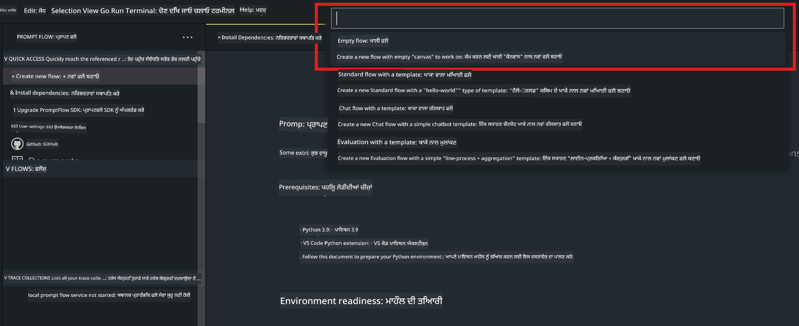
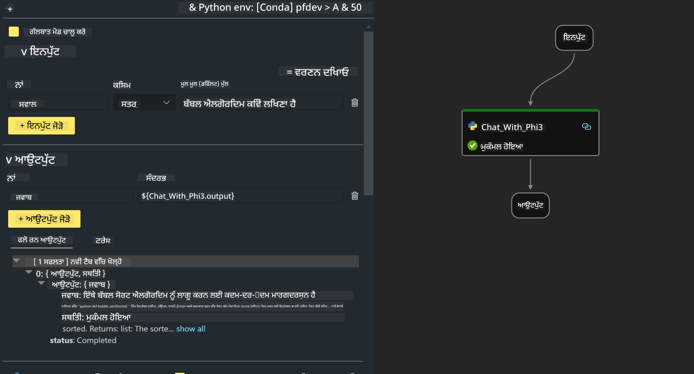
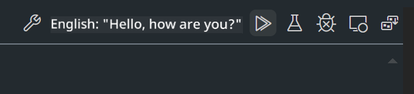

<!--
CO_OP_TRANSLATOR_METADATA:
{
  "original_hash": "bc29f7fe7fc16bed6932733eac8c81b8",
  "translation_date": "2025-05-09T19:22:27+00:00",
  "source_file": "md/02.Application/02.Code/Phi3/VSCodeExt/HOL/AIPC/02.PromptflowWithNPU.md",
  "language_code": "pa"
}
-->
# **ਲੈਬ 2 - AIPC ਵਿੱਚ Phi-3-mini ਨਾਲ Prompt flow ਚਲਾਉਣਾ**

## **Prompt flow ਕੀ ਹੈ**

Prompt flow ਇੱਕ ਵਿਕਾਸ ਟੂਲਜ਼ ਦਾ ਸੈੱਟ ਹੈ ਜੋ LLM-ਆਧਾਰਿਤ AI ਐਪਲੀਕੇਸ਼ਨਾਂ ਦੇ ਪੂਰੇ ਵਿਕਾਸ ਚੱਕਰ ਨੂੰ ਆਸਾਨ ਬਣਾਉਂਦਾ ਹੈ, ਜਿਵੇਂ ਕਿ ਵਿਚਾਰ ਬਣਾਉਣਾ, ਪ੍ਰੋਟੋਟਾਈਪ ਤਿਆਰ ਕਰਨਾ, ਟੈਸਟਿੰਗ, ਮੁਲਾਂਕਣ ਤੋਂ ਲੈ ਕੇ ਪ੍ਰੋਡਕਸ਼ਨ ਤੱਕ ਤੈਨਾਤੀ ਅਤੇ ਨਿਗਰਾਨੀ ਤੱਕ। ਇਹ prompt engineering ਨੂੰ ਬਹੁਤ ਸੌਖਾ ਬਣਾਉਂਦਾ ਹੈ ਅਤੇ ਤੁਹਾਨੂੰ ਪ੍ਰੋਡਕਸ਼ਨ ਗੁਣਵੱਤਾ ਵਾਲੀਆਂ LLM ਐਪਸ ਬਣਾਉਣ ਦੀ ਸਹੂਲਤ ਦਿੰਦਾ ਹੈ।

Prompt flow ਨਾਲ, ਤੁਸੀਂ ਇਹ ਕਰ ਸਕੋਗੇ:

- LLMs, prompts, Python ਕੋਡ ਅਤੇ ਹੋਰ ਟੂਲਜ਼ ਨੂੰ ਜੋੜ ਕੇ executable workflow ਬਣਾਉਣਾ।

- ਆਪਣੇ flows ਨੂੰ ਡੀਬੱਗ ਅਤੇ ਦੁਹਰਾਉਣਾ, ਖਾਸ ਕਰਕੇ LLMs ਨਾਲ ਇੰਟਰੈਕਸ਼ਨ ਨੂੰ ਆਸਾਨੀ ਨਾਲ।

- ਆਪਣੇ flows ਦਾ ਮੁਲਾਂਕਣ ਕਰਨਾ, ਵੱਡੇ ਡੇਟਾਸੈਟਸ ਨਾਲ ਕੁਆਲਟੀ ਅਤੇ ਪ੍ਰਦਰਸ਼ਨ ਮੈਟ੍ਰਿਕਸ ਕੈਲਕੁਲੇਟ ਕਰਨਾ।

- ਟੈਸਟਿੰਗ ਅਤੇ ਮੁਲਾਂਕਣ ਨੂੰ ਆਪਣੇ CI/CD ਸਿਸਟਮ ਵਿੱਚ ਸ਼ਾਮਿਲ ਕਰਕੇ ਆਪਣੇ flow ਦੀ ਗੁਣਵੱਤਾ ਯਕੀਨੀ ਬਣਾਉਣਾ।

- ਆਪਣੇ flows ਨੂੰ ਚੁਣੀ ਹੋਈ ਸਰਵਿੰਗ ਪਲੇਟਫਾਰਮ 'ਤੇ ਤੈਨਾਤ ਕਰਨਾ ਜਾਂ ਆਪਣੇ ਐਪ ਦੇ ਕੋਡ ਬੇਸ ਵਿੱਚ ਆਸਾਨੀ ਨਾਲ ਇੰਟੀਗ੍ਰੇਟ ਕਰਨਾ।

- (ਵਿਕਲਪਿਕ ਪਰ ਬਹੁਤ ਸਿਫਾਰਸ਼ੀ) Azure AI ਵਿੱਚ Prompt flow ਦੀ ਕਲਾਉਡ ਵਰਜਨ ਦੀ ਵਰਤੋਂ ਕਰਕੇ ਆਪਣੀ ਟੀਮ ਨਾਲ ਸਹਿਯੋਗ ਕਰਨਾ।

## **AIPC ਕੀ ਹੈ**

AI PC ਵਿੱਚ ਇੱਕ CPU, GPU ਅਤੇ NPU ਹੁੰਦੇ ਹਨ, ਜਿਹੜੇ ਹਰ ਇੱਕ ਦੇ ਆਪਣੇ ਖਾਸ AI ਐਕਸੇਲੇਰੇਸ਼ਨ ਸਮਰੱਥਾ ਹੁੰਦੀ ਹੈ। NPU, ਜਾਂ neural processing unit, ਇੱਕ ਖਾਸ ਐਕਸੇਲੇਰੇਟਰ ਹੈ ਜੋ ਤੁਹਾਡੇ PC 'ਤੇ ਹੀ artificial intelligence (AI) ਅਤੇ machine learning (ML) ਕੰਮ ਸੰਭਾਲਦਾ ਹੈ, ਬਜਾਏ ਇਸਦੇ ਕਿ ਡੇਟਾ ਨੂੰ ਕਲਾਉਡ ਵਿੱਚ ਭੇਜਿਆ ਜਾਵੇ। GPU ਅਤੇ CPU ਵੀ ਇਹ ਕੰਮ ਕਰ ਸਕਦੇ ਹਨ, ਪਰ NPU ਖਾਸ ਤੌਰ 'ਤੇ ਘੱਟ ਪਾਵਰ ਵਾਲੇ AI ਗਣਨਾਵਾਂ ਲਈ ਬਹੁਤ ਵਧੀਆ ਹੈ। AI PC ਸਾਡੇ ਕੰਪਿਊਟਰਾਂ ਦੇ ਕੰਮ ਕਰਨ ਦੇ ਢੰਗ ਵਿੱਚ ਇੱਕ ਬੁਨਿਆਦੀ ਬਦਲਾਅ ਲਿਆਉਂਦਾ ਹੈ। ਇਹ ਕੋਈ ਐਸੀ ਸਮੱਸਿਆ ਦਾ ਹੱਲ ਨਹੀਂ ਜੋ ਪਹਿਲਾਂ ਮੌਜੂਦ ਨਾ ਸੀ, ਸਗੋਂ ਇਹ ਰੋਜ਼ਾਨਾ PC ਦੀ ਵਰਤੋਂ ਲਈ ਵੱਡਾ ਸੁਧਾਰ ਵਾਅਦਾ ਕਰਦਾ ਹੈ।

ਫਿਰ ਇਹ ਕਿਵੇਂ ਕੰਮ ਕਰਦਾ ਹੈ? ਜਨਰੇਟਿਵ AI ਅਤੇ ਵੱਡੇ ਭਾਸ਼ਾ ਮਾਡਲਾਂ (LLMs) ਨਾਲ ਤੁਲਨਾ ਕਰਦਿਆਂ, ਜੋ ਬਹੁਤ ਸਾਰੇ ਪਬਲਿਕ ਡੇਟਾ 'ਤੇ ਟ੍ਰੇਨ ਕੀਤੇ ਗਏ ਹਨ, AI ਜੋ ਤੁਹਾਡੇ PC 'ਤੇ ਚੱਲੇਗਾ ਉਹ ਕਾਫੀ ਹੱਦ ਤੱਕ ਹਰ ਪੱਧਰ ਤੇ ਜ਼ਿਆਦਾ ਪਹੁੰਚਯੋਗ ਹੈ। ਇਹ ਧਾਰਨਾ ਸਮਝਣ ਵਿੱਚ ਆਸਾਨ ਹੈ, ਅਤੇ ਕਿਉਂਕਿ ਇਹ ਤੁਹਾਡੇ ਡੇਟਾ 'ਤੇ ਟ੍ਰੇਨ ਹੁੰਦਾ ਹੈ, ਕਲਾਉਡ ਤੱਕ ਪਹੁੰਚ ਦੀ ਲੋੜ ਨਹੀਂ ਹੁੰਦੀ, ਇਸ ਲਈ ਲਾਭ ਵਧੇਰੇ ਲੋਕਾਂ ਲਈ ਤੁਰੰਤ ਆਕਰਸ਼ਕ ਹੁੰਦੇ ਹਨ।

ਜਲਦੀ ਹੀ, AI PC ਦੀ ਦੁਨੀਆ ਵਿੱਚ ਨਿੱਜੀ ਸਹਾਇਕ ਅਤੇ ਛੋਟੇ AI ਮਾਡਲ ਸਿੱਧੇ ਤੁਹਾਡੇ PC 'ਤੇ ਚੱਲਣਗੇ, ਤੁਹਾਡੇ ਡੇਟਾ ਦੀ ਵਰਤੋਂ ਕਰਕੇ ਨਿੱਜੀ, ਪ੍ਰਾਈਵੇਟ ਅਤੇ ਜ਼ਿਆਦਾ ਸੁਰੱਖਿਅਤ AI ਸੁਧਾਰ ਮੁਹੱਈਆ ਕਰਨਗੇ ਜੋ ਤੁਸੀਂ ਹਰ ਰੋਜ਼ ਕਰਦੇ ਹੋ – ਮੀਟਿੰਗ ਦੇ ਨੋਟਸ ਬਣਾਉਣਾ, ਫੈਂਟਸੀ ਫੁੱਟਬਾਲ ਲੀਗ ਦਾ ਪ੍ਰਬੰਧਨ, ਫੋਟੋ ਅਤੇ ਵੀਡੀਓ ਸੰਪਾਦਨ ਲਈ ਸੁਧਾਰਾਂ ਦਾ ਆਟੋਮੇਸ਼ਨ, ਜਾਂ ਪਰਿਵਾਰਕ ਮਿਲਣ-ਜੁਲਣ ਲਈ ਸਾਰੇ ਲੋਕਾਂ ਦੀ ਆਗਮਨ ਅਤੇ ਵਿਦਾ ਸਮੇਂ ਦੇ ਅਧਾਰ 'ਤੇ ਪੂਰੀ ਯੋਜਨਾ ਬਣਾਉਣਾ।

## **AIPC 'ਤੇ generation code flows ਬਣਾਉਣਾ**

***Note*** ：ਜੇ ਤੁਸੀਂ ਵਾਤਾਵਰਣ ਇੰਸਟਾਲੇਸ਼ਨ ਪੂਰੀ ਨਹੀਂ ਕੀਤੀ, ਤਾਂ ਕਿਰਪਾ ਕਰਕੇ [Lab 0 -Installations](./01.Installations.md) ਵੇਖੋ

1. Visual Studio Code ਵਿੱਚ Prompt flow Extension ਖੋਲ੍ਹੋ ਅਤੇ ਖਾਲੀ flow ਪ੍ਰੋਜੈਕਟ ਬਣਾਓ



2. Inputs ਅਤੇ Outputs ਪੈਰਾਮੀਟਰ ਜੋੜੋ ਅਤੇ Python Code ਨੂੰ ਨਵੇਂ flow ਵਜੋਂ ਸ਼ਾਮਿਲ ਕਰੋ



ਤੁਸੀਂ ਇਸ structure (flow.dag.yaml) ਨੂੰ ਆਪਣੇ flow ਬਣਾਉਣ ਲਈ ਰੇਫਰ ਕਰ ਸਕਦੇ ਹੋ

```yaml

inputs:
  question:
    type: string
    default: how to write Bubble Algorithm
outputs:
  answer:
    type: string
    reference: ${Chat_With_Phi3.output}
nodes:
- name: Chat_With_Phi3
  type: python
  source:
    type: code
    path: Chat_With_Phi3.py
  inputs:
    question: ${inputs.question}


```

3. ***Chat_With_Phi3.py*** ਵਿੱਚ ਕੋਡ ਜੋੜੋ

```python


from promptflow.core import tool

# import torch
from transformers import AutoTokenizer, pipeline,TextStreamer
import intel_npu_acceleration_library as npu_lib

import warnings

import asyncio
import platform

class Phi3CodeAgent:
    
    model = None
    tokenizer = None
    text_streamer = None
    
    model_id = "microsoft/Phi-3-mini-4k-instruct"

    @staticmethod
    def init_phi3():
        
        if Phi3CodeAgent.model is None or Phi3CodeAgent.tokenizer is None or Phi3CodeAgent.text_streamer is None:
            Phi3CodeAgent.model = npu_lib.NPUModelForCausalLM.from_pretrained(
                                    Phi3CodeAgent.model_id,
                                    torch_dtype="auto",
                                    dtype=npu_lib.int4,
                                    trust_remote_code=True
                                )
            Phi3CodeAgent.tokenizer = AutoTokenizer.from_pretrained(Phi3CodeAgent.model_id)
            Phi3CodeAgent.text_streamer = TextStreamer(Phi3CodeAgent.tokenizer, skip_prompt=True)

    

    @staticmethod
    def chat_with_phi3(prompt):
        
        Phi3CodeAgent.init_phi3()

        messages = "<|system|>You are a AI Python coding assistant. Please help me to generate code in Python.The answer only genertated Python code, but any comments and instructions do not need to be generated<|end|><|user|>" + prompt +"<|end|><|assistant|>"


        generation_args = {
            "max_new_tokens": 1024,
            "return_full_text": False,
            "temperature": 0.3,
            "do_sample": False,
            "streamer": Phi3CodeAgent.text_streamer,
        }

        pipe = pipeline(
            "text-generation",
            model=Phi3CodeAgent.model,
            tokenizer=Phi3CodeAgent.tokenizer,
            # **generation_args
        )

        result = ''

        with warnings.catch_warnings():
            warnings.simplefilter("ignore")
            response = pipe(messages, **generation_args)
            result =response[0]['generated_text']
            return result


@tool
def my_python_tool(question: str) -> str:
    if platform.system() == 'Windows':
        asyncio.set_event_loop_policy(asyncio.WindowsSelectorEventLoopPolicy())
    return Phi3CodeAgent.chat_with_phi3(question)


```

4. ਤੁਸੀਂ Debug ਜਾਂ Run ਤੋਂ flow ਦੀ ਟੈਸਟਿੰਗ ਕਰ ਸਕਦੇ ਹੋ ਕਿ generation code ਠੀਕ ਕੰਮ ਕਰ ਰਿਹਾ ਹੈ ਜਾਂ ਨਹੀਂ



5. ਟਰਮੀਨਲ ਵਿੱਚ development API ਵਜੋਂ flow ਚਲਾਓ

```

pf flow serve --source ./ --port 8080 --host localhost   

```

ਤੁਸੀਂ ਇਸਨੂੰ Postman / Thunder Client ਵਿੱਚ ਟੈਸਟ ਕਰ ਸਕਦੇ ਹੋ

### **Note**

1. ਪਹਿਲੀ ਵਾਰੀ ਚਲਾਉਣ ਵਿੱਚ ਸਮਾਂ ਲੱਗਦਾ ਹੈ। ਸੁਝਾਅ ਹੈ ਕਿ phi-3 ਮਾਡਲ Hugging face CLI ਤੋਂ ਡਾਊਨਲੋਡ ਕਰੋ।

2. Intel NPU ਦੀ ਸੀਮਿਤ ਕਮਪਿਊਟਿੰਗ ਸ਼ਕਤੀ ਨੂੰ ਧਿਆਨ ਵਿੱਚ ਰੱਖਦੇ ਹੋਏ, Phi-3-mini-4k-instruct ਦੀ ਵਰਤੋਂ ਕਰਨ ਦੀ ਸਿਫਾਰਸ਼ ਕੀਤੀ ਜਾਂਦੀ ਹੈ।

3. ਅਸੀਂ Intel NPU Acceleration ਨਾਲ INT4 ਕਵਾਂਟਾਈਜ਼ੇਸ਼ਨ ਕਰਦੇ ਹਾਂ, ਪਰ ਜੇ ਤੁਸੀਂ ਸਰਵਿਸ ਨੂੰ ਦੁਬਾਰਾ ਚਲਾਉਂਦੇ ਹੋ, ਤਾਂ cache ਅਤੇ nc_workshop ਫੋਲਡਰਾਂ ਨੂੰ ਹਟਾਉਣਾ ਲਾਜ਼ਮੀ ਹੈ।

## **ਸੰਸਾਧਨ**

1. Promptflow ਸਿੱਖੋ [https://microsoft.github.io/promptflow/](https://microsoft.github.io/promptflow/)

2. Intel NPU Acceleration ਬਾਰੇ ਜਾਣੋ [https://github.com/intel/intel-npu-acceleration-library](https://github.com/intel/intel-npu-acceleration-library)

3. ਸੈਂਪਲ ਕੋਡ ਡਾਊਨਲੋਡ ਕਰੋ [Local NPU Agent Sample Code](../../../../../../../../../code/07.Lab/01/AIPC)

**ਅਸਵੀਕਾਰੋਤਾ**:  
ਇਹ ਦਸਤਾਵੇਜ਼ AI ਅਨੁਵਾਦ ਸੇਵਾ [Co-op Translator](https://github.com/Azure/co-op-translator) ਦੀ ਵਰਤੋਂ ਨਾਲ ਅਨੁਵਾਦਿਤ ਕੀਤਾ ਗਿਆ ਹੈ। ਜਦੋਂ ਕਿ ਅਸੀਂ ਸਹੀਤਾ ਲਈ ਯਤਨ ਕਰਦੇ ਹਾਂ, ਕਿਰਪਾ ਕਰਕੇ ਧਿਆਨ ਵਿੱਚ ਰੱਖੋ ਕਿ ਆਟੋਮੈਟਿਕ ਅਨੁਵਾਦਾਂ ਵਿੱਚ ਗਲਤੀਆਂ ਜਾਂ ਅਸਥਿਰਤਾਵਾਂ ਹੋ ਸਕਦੀਆਂ ਹਨ। ਮੂਲ ਦਸਤਾਵੇਜ਼ ਆਪਣੇ ਮੂਲ ਭਾਸ਼ਾ ਵਿੱਚ ਅਧਿਕਾਰਿਕ ਸਰੋਤ ਮੰਨਿਆ ਜਾਣਾ ਚਾਹੀਦਾ ਹੈ। ਜਰੂਰੀ ਜਾਣਕਾਰੀ ਲਈ, ਪੇਸ਼ੇਵਰ ਮਨੁੱਖੀ ਅਨੁਵਾਦ ਦੀ ਸਿਫਾਰਿਸ਼ ਕੀਤੀ ਜਾਂਦੀ ਹੈ। ਅਸੀਂ ਇਸ ਅਨੁਵਾਦ ਦੀ ਵਰਤੋਂ ਨਾਲ ਹੋਣ ਵਾਲੀਆਂ ਕਿਸੇ ਵੀ ਗਲਤਫਹਿਮੀਆਂ ਜਾਂ ਭੁੱਲਾਂ ਲਈ ਜ਼ਿੰਮੇਵਾਰ ਨਹੀਂ ਹਾਂ।