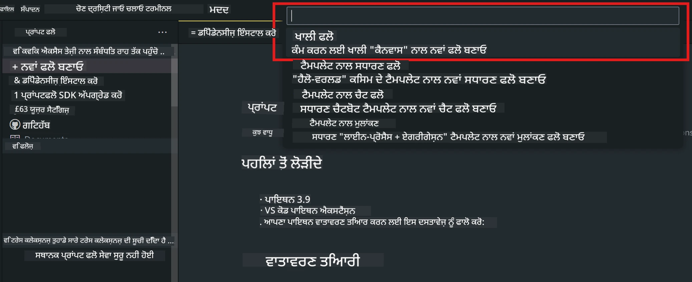

# **ਲੈਬ 2 - AIPC ਵਿੱਚ Phi-3-mini ਨਾਲ Prompt flow ਚਲਾਉਣਾ**

## **Prompt flow ਕੀ ਹੈ**

Prompt flow ਇੱਕ ਵਿਕਾਸ ਟੂਲ ਸੂਟ ਹੈ ਜੋ LLM-ਆਧਾਰਿਤ AI ਐਪਲੀਕੇਸ਼ਨਾਂ ਦੇ ਆਈਡੀਆ ਤੋਂ ਲੈ ਕੇ ਪ੍ਰੋਟੋਟਾਈਪਿੰਗ, ਟੈਸਟਿੰਗ, ਮੁਲਾਂਕਣ ਅਤੇ ਪ੍ਰੋਡਕਸ਼ਨ ਤੱਕ ਦੇ ਪੂਰੇ ਵਿਕਾਸ ਚੱਕਰ ਨੂੰ ਆਸਾਨ ਬਣਾਉਂਦਾ ਹੈ। ਇਹ prompt engineering ਨੂੰ ਬਹੁਤ ਸੌਖਾ ਕਰਦਾ ਹੈ ਅਤੇ ਤੁਹਾਨੂੰ ਉੱਚ ਗੁਣਵੱਤਾ ਵਾਲੀਆਂ LLM ਐਪਸ ਬਣਾਉਣ ਦੀ ਸਹੂਲਤ ਦਿੰਦਾ ਹੈ।

Prompt flow ਨਾਲ, ਤੁਸੀਂ ਇਹ ਕਰ ਸਕੋਗੇ:

- ਐਸੇ ਫਲੋ ਬਣਾਓ ਜੋ LLMs, prompts, Python ਕੋਡ ਅਤੇ ਹੋਰ ਟੂਲਜ਼ ਨੂੰ ਇੱਕ ਚਲਾਉਣਯੋਗ ਵਰਕਫਲੋ ਵਿੱਚ ਜੋੜਦੇ ਹਨ।

- ਆਪਣੇ ਫਲੋਜ਼ ਨੂੰ ਡੀਬੱਗ ਅਤੇ ਦੁਹਰਾਓ, ਖਾਸ ਕਰਕੇ LLMs ਨਾਲ ਇੰਟਰੈਕਸ਼ਨ ਨੂੰ ਆਸਾਨੀ ਨਾਲ ਸੰਭਾਲੋ।

- ਆਪਣੇ ਫਲੋਜ਼ ਦਾ ਮੁਲਾਂਕਣ ਕਰੋ, ਵੱਡੇ ਡੇਟਾਸੈੱਟ ਨਾਲ ਗੁਣਵੱਤਾ ਅਤੇ ਪ੍ਰਦਰਸ਼ਨ ਮੈਟਰਿਕਸ ਦੀ ਗਣਨਾ ਕਰੋ।

- ਟੈਸਟਿੰਗ ਅਤੇ ਮੁਲਾਂਕਣ ਨੂੰ ਆਪਣੇ CI/CD ਸਿਸਟਮ ਵਿੱਚ ਸ਼ਾਮਲ ਕਰੋ ਤਾਂ ਜੋ ਫਲੋ ਦੀ ਗੁਣਵੱਤਾ ਯਕੀਨੀ ਬਣਾਈ ਜਾ ਸਕੇ।

- ਆਪਣੇ ਫਲੋਜ਼ ਨੂੰ ਚੁਣੇ ਹੋਏ ਸਰਵਿੰਗ ਪਲੇਟਫਾਰਮ 'ਤੇ ਡਿਪਲੋਇ ਕਰੋ ਜਾਂ ਆਪਣੇ ਐਪ ਦੇ ਕੋਡ ਬੇਸ ਵਿੱਚ ਆਸਾਨੀ ਨਾਲ ਇੰਟੀਗ੍ਰੇਟ ਕਰੋ।

- (ਵਿਕਲਪਿਕ ਪਰ ਬਹੁਤ ਸਿਫਾਰਸ਼ੀ) Azure AI ਵਿੱਚ Prompt flow ਦੇ ਕਲਾਉਡ ਵਰਜ਼ਨ ਦੀ ਵਰਤੋਂ ਕਰਕੇ ਆਪਣੀ ਟੀਮ ਨਾਲ ਸਹਿਯੋਗ ਕਰੋ।

## **AIPC ਕੀ ਹੈ**

AI PC ਵਿੱਚ CPU, GPU ਅਤੇ NPU ਹੁੰਦੇ ਹਨ, ਜਿਨ੍ਹਾਂ ਵਿੱਚ ਹਰ ਇੱਕ ਦੀ ਆਪਣੀ ਖਾਸ AI ਤੇਜ਼ੀ ਦੀ ਸਮਰੱਥਾ ਹੁੰਦੀ ਹੈ। NPU, ਜਾਂ neural processing unit, ਇੱਕ ਵਿਸ਼ੇਸ਼ ਤਰ੍ਹਾਂ ਦਾ ਐਕਸਲੇਰੇਟਰ ਹੈ ਜੋ ਤੁਹਾਡੇ PC 'ਤੇ ਹੀ AI ਅਤੇ ਮਸ਼ੀਨ ਲਰਨਿੰਗ ਕੰਮ ਕਰਦਾ ਹੈ, ਬਦਲੇ ਵਿੱਚ ਡੇਟਾ ਕਲਾਉਡ ਵਿੱਚ ਭੇਜਣ ਦੀ ਜ਼ਰੂਰਤ ਨਹੀਂ ਹੁੰਦੀ। GPU ਅਤੇ CPU ਵੀ ਇਹ ਕੰਮ ਕਰ ਸਕਦੇ ਹਨ, ਪਰ NPU ਖਾਸ ਕਰਕੇ ਘੱਟ ਪਾਵਰ ਵਾਲੇ AI ਕੈਲਕੁਲੇਸ਼ਨਾਂ ਲਈ ਬਹੁਤ ਵਧੀਆ ਹੈ। AI PC ਸਾਡੇ ਕੰਪਿਊਟਰਾਂ ਦੇ ਕੰਮ ਕਰਨ ਦੇ ਢੰਗ ਵਿੱਚ ਇੱਕ ਬੁਨਿਆਦੀ ਬਦਲਾਅ ਹੈ। ਇਹ ਕਿਸੇ ਪਹਿਲਾਂ ਮੌਜੂਦ ਸਮੱਸਿਆ ਦਾ ਹੱਲ ਨਹੀਂ, ਸਗੋਂ ਰੋਜ਼ਾਨਾ PC ਦੀ ਵਰਤੋਂ ਲਈ ਇੱਕ ਵੱਡਾ ਸੁਧਾਰ ਹੈ।

ਤਾਂ ਇਹ ਕਿਵੇਂ ਕੰਮ ਕਰਦਾ ਹੈ? ਜਨਰੇਟਿਵ AI ਅਤੇ ਵੱਡੇ ਭਾਸ਼ਾਈ ਮਾਡਲਾਂ (LLMs) ਨਾਲ ਤੁਲਨਾ ਕਰਨ 'ਤੇ, ਜੋ ਬਹੁਤ ਸਾਰੇ ਜਨਤਕ ਡੇਟਾ 'ਤੇ ਟ੍ਰੇਨ ਕੀਤੇ ਜਾਂਦੇ ਹਨ, ਤੁਹਾਡੇ PC 'ਤੇ ਚੱਲਣ ਵਾਲਾ AI ਹਰ ਪੱਧਰ 'ਤੇ ਜ਼ਿਆਦਾ ਪਹੁੰਚਯੋਗ ਹੈ। ਇਹ ਧਾਰਣਾ ਸਮਝਣ ਵਿੱਚ ਆਸਾਨ ਹੈ, ਅਤੇ ਕਿਉਂਕਿ ਇਹ ਤੁਹਾਡੇ ਡੇਟਾ 'ਤੇ ਟ੍ਰੇਨ ਕੀਤਾ ਜਾਂਦਾ ਹੈ ਅਤੇ ਕਲਾਉਡ ਦੀ ਲੋੜ ਨਹੀਂ ਹੁੰਦੀ, ਇਸਦੇ ਫਾਇਦੇ ਵੱਡੇ ਪੱਧਰ 'ਤੇ ਲੋਕਾਂ ਲਈ ਤੁਰੰਤ ਆਕਰਸ਼ਕ ਹਨ।

ਨਜ਼ਦੀਕੀ ਭਵਿੱਖ ਵਿੱਚ, AI PC ਦੁਨੀਆ ਵਿੱਚ ਨਿੱਜੀ ਸਹਾਇਕ ਅਤੇ ਛੋਟੇ AI ਮਾਡਲ ਸਿੱਧੇ ਤੁਹਾਡੇ PC 'ਤੇ ਚੱਲਣਗੇ, ਜੋ ਤੁਹਾਡੇ ਡੇਟਾ ਦੀ ਵਰਤੋਂ ਕਰਕੇ ਨਿੱਜੀ, ਪ੍ਰਾਈਵੇਟ ਅਤੇ ਜ਼ਿਆਦਾ ਸੁਰੱਖਿਅਤ AI ਸੁਧਾਰ ਪ੍ਰਦਾਨ ਕਰਨਗੇ, ਜਿਵੇਂ ਕਿ ਮੀਟਿੰਗ ਮਿੰਟਸ ਲੈਣਾ, ਫੈਂਟਸੀ ਫੁੱਟਬਾਲ ਲੀਗ ਦਾ ਆਯੋਜਨ ਕਰਨਾ, ਫੋਟੋ ਅਤੇ ਵੀਡੀਓ ਐਡੀਟਿੰਗ ਲਈ ਸੁਧਾਰਾਂ ਨੂੰ ਆਟੋਮੇਟ ਕਰਨਾ, ਜਾਂ ਪਰਿਵਾਰਕ ਮਿਲਾਪ ਲਈ ਸਭ ਦੇ ਆਗਮਨ ਅਤੇ ਰਵਾਨਗੀ ਸਮਿਆਂ ਦੇ ਅਧਾਰ 'ਤੇ ਪੂਰੀ ਯਾਤਰਾ ਯੋਜਨਾ ਬਣਾਉਣਾ।

## **AIPC 'ਤੇ generation ਕੋਡ ਫਲੋ ਬਣਾਉਣਾ**

***Note*** ：ਜੇ ਤੁਸੀਂ ਵਾਤਾਵਰਣ ਸੈਟਅੱਪ ਨਹੀਂ ਕੀਤਾ, ਤਾਂ ਕਿਰਪਾ ਕਰਕੇ [Lab 0 -Installations](./01.Installations.md) ਵੇਖੋ

1. Visual Studio Code ਵਿੱਚ Prompt flow Extension ਖੋਲ੍ਹੋ ਅਤੇ ਇੱਕ ਖਾਲੀ flow ਪ੍ਰੋਜੈਕਟ ਬਣਾਓ



2. Inputs ਅਤੇ Outputs ਪੈਰਾਮੀਟਰ ਸ਼ਾਮਲ ਕਰੋ ਅਤੇ ਨਵਾਂ flow ਵਜੋਂ Python ਕੋਡ ਜੋੜੋ


ਤੁਸੀਂ ਆਪਣੇ flow ਨੂੰ ਬਣਾਉਣ ਲਈ ਇਸ ਢਾਂਚੇ (flow.dag.yaml) ਨੂੰ ਦੇਖ ਸਕਦੇ ਹੋ

```yaml

inputs:
  question:
    type: string
    default: how to write Bubble Algorithm
outputs:
  answer:
    type: string
    reference: ${Chat_With_Phi3.output}
nodes:
- name: Chat_With_Phi3
  type: python
  source:
    type: code
    path: Chat_With_Phi3.py
  inputs:
    question: ${inputs.question}


```

3. ***Chat_With_Phi3.py*** ਵਿੱਚ ਕੋਡ ਸ਼ਾਮਲ ਕਰੋ

```python


from promptflow.core import tool

# import torch
from transformers import AutoTokenizer, pipeline,TextStreamer
import intel_npu_acceleration_library as npu_lib

import warnings

import asyncio
import platform

class Phi3CodeAgent:
    
    model = None
    tokenizer = None
    text_streamer = None
    
    model_id = "microsoft/Phi-3-mini-4k-instruct"

    @staticmethod
    def init_phi3():
        
        if Phi3CodeAgent.model is None or Phi3CodeAgent.tokenizer is None or Phi3CodeAgent.text_streamer is None:
            Phi3CodeAgent.model = npu_lib.NPUModelForCausalLM.from_pretrained(
                                    Phi3CodeAgent.model_id,
                                    torch_dtype="auto",
                                    dtype=npu_lib.int4,
                                    trust_remote_code=True
                                )
            Phi3CodeAgent.tokenizer = AutoTokenizer.from_pretrained(Phi3CodeAgent.model_id)
            Phi3CodeAgent.text_streamer = TextStreamer(Phi3CodeAgent.tokenizer, skip_prompt=True)

    

    @staticmethod
    def chat_with_phi3(prompt):
        
        Phi3CodeAgent.init_phi3()

        messages = "<|system|>You are a AI Python coding assistant. Please help me to generate code in Python.The answer only genertated Python code, but any comments and instructions do not need to be generated<|end|><|user|>" + prompt +"<|end|><|assistant|>"


        generation_args = {
            "max_new_tokens": 1024,
            "return_full_text": False,
            "temperature": 0.3,
            "do_sample": False,
            "streamer": Phi3CodeAgent.text_streamer,
        }

        pipe = pipeline(
            "text-generation",
            model=Phi3CodeAgent.model,
            tokenizer=Phi3CodeAgent.tokenizer,
            # **generation_args
        )

        result = ''

        with warnings.catch_warnings():
            warnings.simplefilter("ignore")
            response = pipe(messages, **generation_args)
            result =response[0]['generated_text']
            return result


@tool
def my_python_tool(question: str) -> str:
    if platform.system() == 'Windows':
        asyncio.set_event_loop_policy(asyncio.WindowsSelectorEventLoopPolicy())
    return Phi3CodeAgent.chat_with_phi3(question)


```

4. ਤੁਸੀਂ Debug ਜਾਂ Run ਤੋਂ flow ਦੀ ਜਾਂਚ ਕਰ ਸਕਦੇ ਹੋ ਕਿ generation ਕੋਡ ਠੀਕ ਹੈ ਜਾਂ ਨਹੀਂ


5. ਟਰਮੀਨਲ ਵਿੱਚ development API ਵਜੋਂ flow ਚਲਾਓ

```

pf flow serve --source ./ --port 8080 --host localhost   

```

ਤੁਸੀਂ ਇਸਨੂੰ Postman / Thunder Client ਵਿੱਚ ਟੈਸਟ ਕਰ ਸਕਦੇ ਹੋ

### **Note**

1. ਪਹਿਲੀ ਵਾਰੀ ਚਲਾਉਣ ਵਿੱਚ ਵਧੇਰੇ ਸਮਾਂ ਲੱਗਦਾ ਹੈ। ਸਿਫਾਰਸ਼ ਕੀਤੀ ਜਾਂਦੀ ਹੈ ਕਿ phi-3 ਮਾਡਲ Hugging face CLI ਤੋਂ ਡਾਊਨਲੋਡ ਕਰੋ।

2. Intel NPU ਦੀ ਸੀਮਿਤ ਕੰਪਿਊਟਿੰਗ ਸਮਰੱਥਾ ਨੂੰ ਧਿਆਨ ਵਿੱਚ ਰੱਖਦੇ ਹੋਏ, Phi-3-mini-4k-instruct ਵਰਤਣਾ ਵਧੀਆ ਰਹੇਗਾ।

3. ਅਸੀਂ Intel NPU Acceleration ਦੀ ਵਰਤੋਂ ਕਰਕੇ INT4 ਕਵਾਂਟਾਈਜ਼ੇਸ਼ਨ ਕਰਦੇ ਹਾਂ, ਪਰ ਜੇ ਤੁਸੀਂ ਸੇਵਾ ਨੂੰ ਦੁਬਾਰਾ ਚਲਾਉਂਦੇ ਹੋ, ਤਾਂ cache ਅਤੇ nc_workshop ਫੋਲਡਰਾਂ ਨੂੰ ਹਟਾਉਣਾ ਜ਼ਰੂਰੀ ਹੈ।

## **ਸੰਸਾਧਨ**

1. Promptflow ਸਿੱਖੋ [https://microsoft.github.io/promptflow/](https://microsoft.github.io/promptflow/)

2. Intel NPU Acceleration ਸਿੱਖੋ [https://github.com/intel/intel-npu-acceleration-library](https://github.com/intel/intel-npu-acceleration-library)

3. ਨਮੂਨਾ ਕੋਡ, ਡਾਊਨਲੋਡ ਕਰੋ [Local NPU Agent Sample Code](../../../../../../../../../code/07.Lab/01/AIPC)

**ਅਸਵੀਕਾਰੋਪਣ**:  
ਇਹ ਦਸਤਾਵੇਜ਼ AI ਅਨੁਵਾਦ ਸੇਵਾ [Co-op Translator](https://github.com/Azure/co-op-translator) ਦੀ ਵਰਤੋਂ ਕਰਕੇ ਅਨੁਵਾਦਿਤ ਕੀਤਾ ਗਿਆ ਹੈ। ਜਦੋਂ ਕਿ ਅਸੀਂ ਸਹੀਤਾ ਲਈ ਕੋਸ਼ਿਸ਼ ਕਰਦੇ ਹਾਂ, ਕਿਰਪਾ ਕਰਕੇ ਧਿਆਨ ਰੱਖੋ ਕਿ ਸਵੈਚਾਲਿਤ ਅਨੁਵਾਦਾਂ ਵਿੱਚ ਗਲਤੀਆਂ ਜਾਂ ਅਸਮਰਥਤਾਵਾਂ ਹੋ ਸਕਦੀਆਂ ਹਨ। ਮੂਲ ਦਸਤਾਵੇਜ਼ ਆਪਣੀ ਮੂਲ ਭਾਸ਼ਾ ਵਿੱਚ ਪ੍ਰਮਾਣਿਕ ਸਰੋਤ ਮੰਨਿਆ ਜਾਣਾ ਚਾਹੀਦਾ ਹੈ। ਮਹੱਤਵਪੂਰਨ ਜਾਣਕਾਰੀ ਲਈ, ਪੇਸ਼ੇਵਰ ਮਨੁੱਖੀ ਅਨੁਵਾਦ ਦੀ ਸਿਫਾਰਸ਼ ਕੀਤੀ ਜਾਂਦੀ ਹੈ। ਅਸੀਂ ਇਸ ਅਨੁਵਾਦ ਦੀ ਵਰਤੋਂ ਤੋਂ ਉਤਪੰਨ ਕਿਸੇ ਵੀ ਗਲਤਫਹਮੀ ਜਾਂ ਗਲਤ ਵਿਆਖਿਆ ਲਈ ਜ਼ਿੰਮੇਵਾਰ ਨਹੀਂ ਹਾਂ।