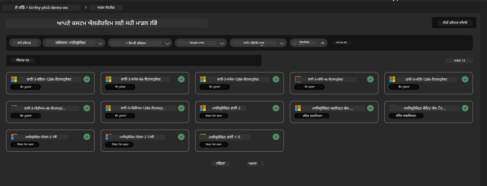
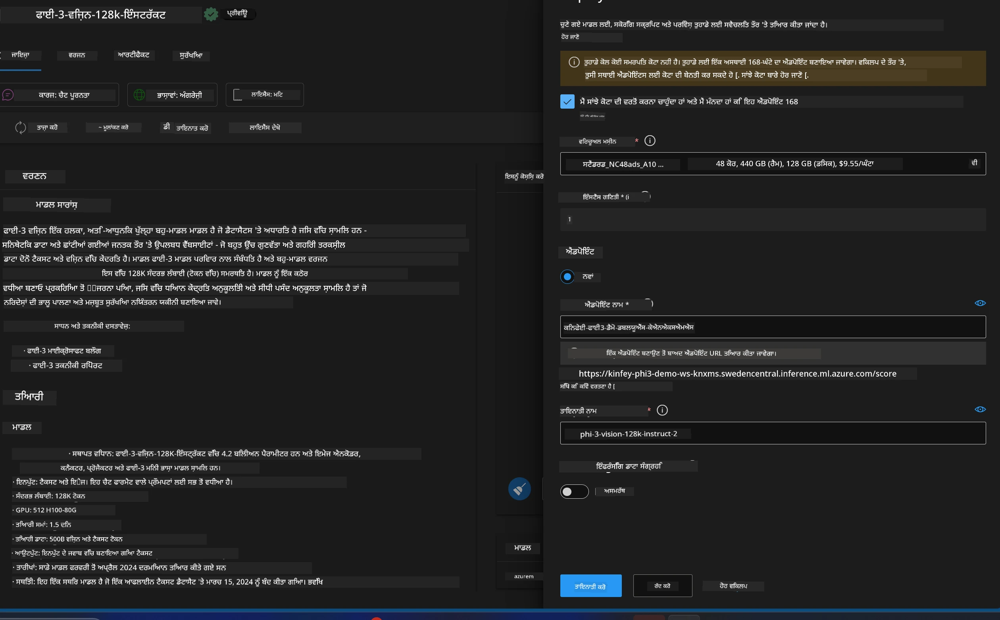
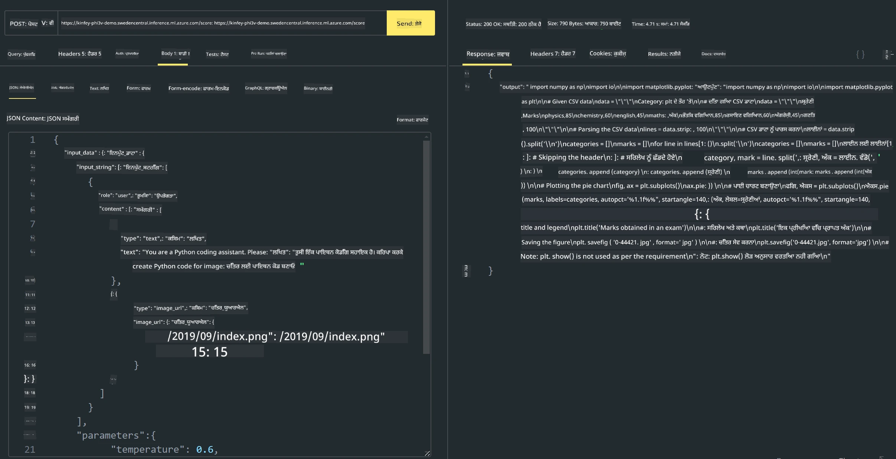

# **ਲੈਬ 3 - Azure Machine Learning Service 'ਤੇ Phi-3-vision ਨੂੰ ਡਿਪਲੋਇ ਕਰੋ**

ਅਸੀਂ NPU ਦੀ ਵਰਤੋਂ ਕਰਕੇ ਲੋਕਲ ਕੋਡ ਦੀ ਪ੍ਰੋਡਕਸ਼ਨ ਡਿਪਲੋਇਮੈਂਟ ਪੂਰੀ ਕਰਦੇ ਹਾਂ, ਅਤੇ ਫਿਰ ਅਸੀਂ ਇਸ ਰਾਹੀਂ PHI-3-VISION ਨੂੰ ਲਿਆਉਣ ਦੀ ਸਮਰੱਥਾ ਸ਼ਾਮਲ ਕਰਨਾ ਚਾਹੁੰਦੇ ਹਾਂ ਤਾਂ ਜੋ ਤਸਵੀਰਾਂ ਤੋਂ ਕੋਡ ਬਣਾਇਆ ਜਾ ਸਕੇ।

ਇਸ ਜਾਣ-ਪਛਾਣ ਵਿੱਚ, ਅਸੀਂ Azure Machine Learning Service ਵਿੱਚ ਤੇਜ਼ੀ ਨਾਲ Model As Service Phi-3 Vision ਸੇਵਾ ਬਣਾਉਣ ਦੇ ਯੋਗ ਹੋ ਜਾਂਦੇ ਹਾਂ।

***Note***： Phi-3 Vision ਨੂੰ ਤੇਜ਼ੀ ਨਾਲ ਸਮੱਗਰੀ ਬਣਾਉਣ ਲਈ ਕਮਪਿਊਟਿੰਗ ਪਾਵਰ ਦੀ ਲੋੜ ਹੁੰਦੀ ਹੈ। ਸਾਨੂੰ ਇਹ ਪ੍ਰਾਪਤ ਕਰਨ ਲਈ ਕਲਾਉਡ ਕਮਪਿਊਟਿੰਗ ਪਾਵਰ ਦੀ ਜਰੂਰਤ ਹੈ।


### **1. Azure Machine Learning Service ਬਣਾਓ**

ਸਾਨੂੰ Azure ਪੋਰਟਲ ਵਿੱਚ ਇੱਕ Azure Machine Learning Service ਬਣਾਉਣੀ ਪਵੇਗੀ। ਜੇ ਤੁਸੀਂ ਸਿੱਖਣਾ ਚਾਹੁੰਦੇ ਹੋ ਕਿ ਕਿਵੇਂ, ਤਾਂ ਕਿਰਪਾ ਕਰਕੇ ਇਸ ਲਿੰਕ 'ਤੇ ਜਾਓ [https://learn.microsoft.com/azure/machine-learning/quickstart-create-resources?view=azureml-api-2](https://learn.microsoft.com/azure/machine-learning/quickstart-create-resources?view=azureml-api-2)


### **2. Azure Machine Learning Service ਵਿੱਚ Phi-3 Vision ਚੁਣੋ**




### **3. Azure ਵਿੱਚ Phi-3-Vision ਡਿਪਲੋਇ ਕਰੋ**





### **4. Postman ਵਿੱਚ Endpoint ਦੀ ਜਾਂਚ ਕਰੋ**





***Note***

1. ਭੇਜੇ ਜਾਣ ਵਾਲੇ ਪੈਰਾਮੀਟਰਾਂ ਵਿੱਚ Authorization, azureml-model-deployment, ਅਤੇ Content-Type ਸ਼ਾਮਲ ਹੋਣੇ ਚਾਹੀਦੇ ਹਨ। ਤੁਹਾਨੂੰ ਡਿਪਲੋਇਮੈਂਟ ਜਾਣਕਾਰੀ ਚੈੱਕ ਕਰਕੇ ਇਹ ਪ੍ਰਾਪਤ ਕਰਨਾ ਪਵੇਗਾ।

2. ਪੈਰਾਮੀਟਰ ਭੇਜਣ ਲਈ, Phi-3-Vision ਨੂੰ ਇੱਕ ਤਸਵੀਰ ਲਿੰਕ ਭੇਜਣੀ ਪੈਂਦੀ ਹੈ। ਕਿਰਪਾ ਕਰਕੇ GPT-4-Vision ਦੇ ਤਰੀਕੇ ਨੂੰ ਦੇਖੋ ਜਿਵੇਂ ਕਿ

```json

{
  "input_data":{
    "input_string":[
      {
        "role":"user",
        "content":[ 
          {
            "type": "text",
            "text": "You are a Python coding assistant.Please create Python code for image "
          },
          {
              "type": "image_url",
              "image_url": {
                "url": "https://ajaytech.co/wp-content/uploads/2019/09/index.png"
              }
          }
        ]
      }
    ],
    "parameters":{
          "temperature": 0.6,
          "top_p": 0.9,
          "do_sample": false,
          "max_new_tokens": 2048
    }
  }
}

```

3. Post ਮੈਥਡ ਦੀ ਵਰਤੋਂ ਕਰਕੇ **/score** ਨੂੰ ਕਾਲ ਕਰੋ

**ਵਧਾਈਆਂ**! ਤੁਸੀਂ ਤੇਜ਼ PHI-3-VISION ਡਿਪਲੋਇਮੈਂਟ ਪੂਰਾ ਕਰ ਲਿਆ ਹੈ ਅਤੇ ਤਸਵੀਰਾਂ ਤੋਂ ਕੋਡ ਬਣਾਉਣ ਦਾ ਤਰੀਕਾ ਅਜ਼ਮਾਇਆ ਹੈ। ਅਗਲੇ ਕਦਮ ਵਿੱਚ, ਅਸੀਂ NPUs ਅਤੇ ਕਲਾਉਡ ਦੇ ਮਿਲਾਪ ਨਾਲ ਐਪਲੀਕੇਸ਼ਨ ਬਣਾਉਣਗੇ।

**ਅਸਵੀਕਾਰੋਪਣ**:  
ਇਹ ਦਸਤਾਵੇਜ਼ AI ਅਨੁਵਾਦ ਸੇਵਾ [Co-op Translator](https://github.com/Azure/co-op-translator) ਦੀ ਵਰਤੋਂ ਕਰਕੇ ਅਨੁਵਾਦ ਕੀਤਾ ਗਿਆ ਹੈ। ਜਦੋਂ ਕਿ ਅਸੀਂ ਸਹੀਅਤ ਲਈ ਕੋਸ਼ਿਸ਼ ਕਰਦੇ ਹਾਂ, ਕਿਰਪਾ ਕਰਕੇ ਧਿਆਨ ਰੱਖੋ ਕਿ ਸਵੈਚਾਲਿਤ ਅਨੁਵਾਦਾਂ ਵਿੱਚ ਗਲਤੀਆਂ ਜਾਂ ਅਸਮਰਥਤਾਵਾਂ ਹੋ ਸਕਦੀਆਂ ਹਨ। ਮੂਲ ਦਸਤਾਵੇਜ਼ ਆਪਣੀ ਮੂਲ ਭਾਸ਼ਾ ਵਿੱਚ ਪ੍ਰਮਾਣਿਕ ਸਰੋਤ ਮੰਨਿਆ ਜਾਣਾ ਚਾਹੀਦਾ ਹੈ। ਮਹੱਤਵਪੂਰਨ ਜਾਣਕਾਰੀ ਲਈ, ਪੇਸ਼ੇਵਰ ਮਨੁੱਖੀ ਅਨੁਵਾਦ ਦੀ ਸਿਫਾਰਸ਼ ਕੀਤੀ ਜਾਂਦੀ ਹੈ। ਅਸੀਂ ਇਸ ਅਨੁਵਾਦ ਦੀ ਵਰਤੋਂ ਤੋਂ ਉਤਪੰਨ ਕਿਸੇ ਵੀ ਗਲਤਫਹਿਮੀ ਜਾਂ ਗਲਤ ਵਿਆਖਿਆ ਲਈ ਜ਼ਿੰਮੇਵਾਰ ਨਹੀਂ ਹਾਂ।