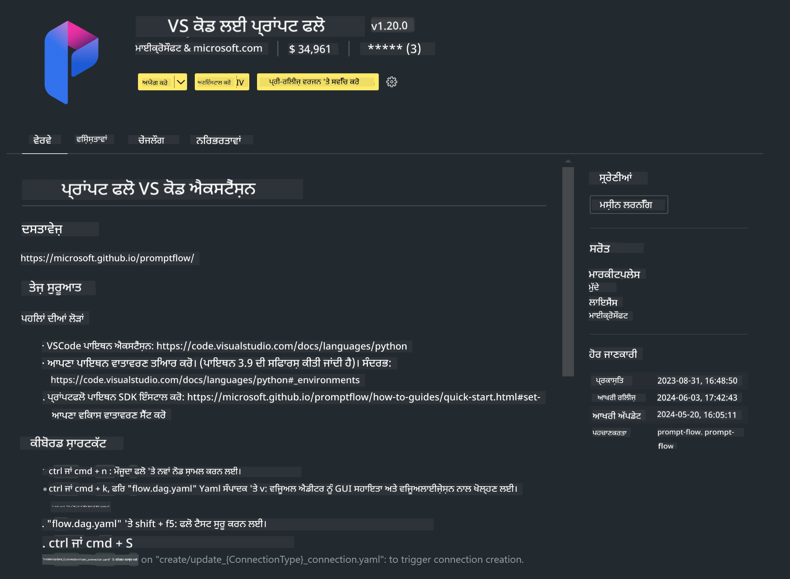

<!--
CO_OP_TRANSLATOR_METADATA:
{
  "original_hash": "4b16264917d9b93169745d92b8ce8c65",
  "translation_date": "2025-07-17T04:18:16+00:00",
  "source_file": "md/02.Application/02.Code/Phi3/VSCodeExt/HOL/Apple/01.Installations.md",
  "language_code": "pa"
}
-->
# **ਲੈਬ 0 - ਇੰਸਟਾਲੇਸ਼ਨ**

ਜਦੋਂ ਅਸੀਂ ਲੈਬ ਵਿੱਚ ਦਾਖਲ ਹੁੰਦੇ ਹਾਂ, ਤਾਂ ਸਾਨੂੰ ਸਬੰਧਤ ਵਾਤਾਵਰਣ ਨੂੰ ਸੈੱਟਅੱਪ ਕਰਨਾ ਪੈਂਦਾ ਹੈ :


### **1. Python 3.11+**

ਤੁਹਾਡੇ Python ਵਾਤਾਵਰਣ ਨੂੰ ਸੈੱਟਅੱਪ ਕਰਨ ਲਈ miniforge ਵਰਤਣਾ ਸਿਫਾਰਸ਼ੀ ਹੈ

miniforge ਸੈੱਟਅੱਪ ਕਰਨ ਲਈ, ਕਿਰਪਾ ਕਰਕੇ [https://github.com/conda-forge/miniforge](https://github.com/conda-forge/miniforge) ਨੂੰ ਵੇਖੋ

miniforge ਸੈੱਟਅੱਪ ਕਰਨ ਤੋਂ ਬਾਅਦ, Power Shell ਵਿੱਚ ਹੇਠਾਂ ਦਿੱਤਾ ਕਮਾਂਡ ਚਲਾਓ

```bash

conda create -n pyenv python==3.11.8 -y

conda activate pyenv

```


### **2. Install Prompt flow SDK**

ਲੈਬ 1 ਵਿੱਚ ਅਸੀਂ Prompt flow ਵਰਤਾਂਗੇ, ਇਸ ਲਈ ਤੁਹਾਨੂੰ Prompt flow SDK ਸੈੱਟਅੱਪ ਕਰਨਾ ਲਾਜ਼ਮੀ ਹੈ।

```bash

pip install promptflow --upgrade

```

ਤੁਸੀਂ ਇਸ ਕਮਾਂਡ ਨਾਲ promptflow sdk ਦੀ ਜਾਂਚ ਕਰ ਸਕਦੇ ਹੋ


```bash

pf --version

```

### **3. Install Visual Studio Code Prompt flow Extension**



### **4. Apple's MLX Framework**

MLX Apple ਸਿਲੀਕਾਨ 'ਤੇ ਮਸ਼ੀਨ ਲਰਨਿੰਗ ਰਿਸਰਚ ਲਈ ਇੱਕ ਐਰੇ ਫਰੇਮਵਰਕ ਹੈ, ਜੋ Apple ਮਸ਼ੀਨ ਲਰਨਿੰਗ ਰਿਸਰਚ ਵੱਲੋਂ ਲਿਆਇਆ ਗਿਆ ਹੈ। ਤੁਸੀਂ **Apple MLX framework** ਦੀ ਵਰਤੋਂ ਕਰਕੇ Apple Silicon ਨਾਲ LLM / SLM ਨੂੰ ਤੇਜ਼ ਕਰ ਸਕਦੇ ਹੋ। ਜੇ ਤੁਸੀਂ ਹੋਰ ਜਾਣਨਾ ਚਾਹੁੰਦੇ ਹੋ, ਤਾਂ ਤੁਸੀਂ [https://github.com/microsoft/PhiCookBook/blob/main/md/01.Introduction/03/MLX_Inference.md](https://github.com/microsoft/PhiCookBook/blob/main/md/01.Introduction/03/MLX_Inference.md) ਪੜ੍ਹ ਸਕਦੇ ਹੋ।

bash ਵਿੱਚ MLX framework ਲਾਇਬ੍ਰੇਰੀ ਇੰਸਟਾਲ ਕਰੋ


```bash

pip install mlx-lm

```


### **5. Other Python Library**


requirements.txt ਬਣਾਓ ਅਤੇ ਇਸ ਵਿੱਚ ਇਹ ਸਮੱਗਰੀ ਸ਼ਾਮਲ ਕਰੋ

```txt

notebook
numpy 
scipy 
scikit-learn 
matplotlib 
pandas 
pillow 
graphviz

```


### **6. Install NVM**

Powershell ਵਿੱਚ nvm ਇੰਸਟਾਲ ਕਰੋ


```bash

brew install nvm

```

nodejs 18.20 ਇੰਸਟਾਲ ਕਰੋ


```bash

nvm install 18.20.0

nvm use 18.20.0

```

### **7. Install Visual Studio Code Development Support**


```bash

npm install --global yo generator-code

```

ਵਧਾਈਆਂ! ਤੁਸੀਂ SDK ਸਫਲਤਾਪੂਰਵਕ ਸੈੱਟਅੱਪ ਕਰ ਲਿਆ ਹੈ। ਹੁਣ ਅਗਲੇ ਹੱਥ-ਅਮਲ ਕਦਮਾਂ ਵੱਲ ਵਧੋ।

**ਅਸਵੀਕਾਰੋਪਣ**:  
ਇਹ ਦਸਤਾਵੇਜ਼ AI ਅਨੁਵਾਦ ਸੇਵਾ [Co-op Translator](https://github.com/Azure/co-op-translator) ਦੀ ਵਰਤੋਂ ਕਰਕੇ ਅਨੁਵਾਦਿਤ ਕੀਤਾ ਗਿਆ ਹੈ। ਜਦੋਂ ਕਿ ਅਸੀਂ ਸਹੀਅਤ ਲਈ ਕੋਸ਼ਿਸ਼ ਕਰਦੇ ਹਾਂ, ਕਿਰਪਾ ਕਰਕੇ ਧਿਆਨ ਰੱਖੋ ਕਿ ਸਵੈਚਾਲਿਤ ਅਨੁਵਾਦਾਂ ਵਿੱਚ ਗਲਤੀਆਂ ਜਾਂ ਅਸਮਰਥਤਾਵਾਂ ਹੋ ਸਕਦੀਆਂ ਹਨ। ਮੂਲ ਦਸਤਾਵੇਜ਼ ਆਪਣੀ ਮੂਲ ਭਾਸ਼ਾ ਵਿੱਚ ਅਧਿਕਾਰਤ ਸਰੋਤ ਮੰਨਿਆ ਜਾਣਾ ਚਾਹੀਦਾ ਹੈ। ਮਹੱਤਵਪੂਰਨ ਜਾਣਕਾਰੀ ਲਈ, ਪੇਸ਼ੇਵਰ ਮਨੁੱਖੀ ਅਨੁਵਾਦ ਦੀ ਸਿਫਾਰਸ਼ ਕੀਤੀ ਜਾਂਦੀ ਹੈ। ਅਸੀਂ ਇਸ ਅਨੁਵਾਦ ਦੀ ਵਰਤੋਂ ਤੋਂ ਉਤਪੰਨ ਕਿਸੇ ਵੀ ਗਲਤਫਹਿਮੀ ਜਾਂ ਗਲਤ ਵਿਆਖਿਆ ਲਈ ਜ਼ਿੰਮੇਵਾਰ ਨਹੀਂ ਹਾਂ।