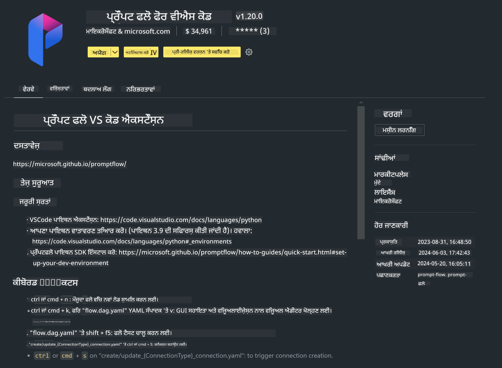

<!--
CO_OP_TRANSLATOR_METADATA:
{
  "original_hash": "4b16264917d9b93169745d92b8ce8c65",
  "translation_date": "2025-05-09T19:34:45+00:00",
  "source_file": "md/02.Application/02.Code/Phi3/VSCodeExt/HOL/Apple/01.Installations.md",
  "language_code": "pa"
}
-->
# **ਲੈਬ 0 - ਇੰਸਟਾਲੇਸ਼ਨ**

ਜਦੋਂ ਅਸੀਂ ਲੈਬ ਵਿੱਚ ਦਾਖਲ ਹੁੰਦੇ ਹਾਂ, ਤਾਂ ਸਾਨੂੰ ਸਬੰਧਿਤ ਵਾਤਾਵਰਨ ਨੂੰ ਸੰਰਚਿਤ ਕਰਨਾ ਪੈਂਦਾ ਹੈ :


### **1. Python 3.11+**

ਆਪਣੇ Python ਵਾਤਾਵਰਨ ਨੂੰ ਸੰਰਚਿਤ ਕਰਨ ਲਈ miniforge ਵਰਤਣਾ ਸਿਫਾਰਸ਼ੀ ਹੈ

miniforge ਨੂੰ ਸੰਰਚਿਤ ਕਰਨ ਲਈ, ਕਿਰਪਾ ਕਰਕੇ [https://github.com/conda-forge/miniforge](https://github.com/conda-forge/miniforge) ਨੂੰ ਵੇਖੋ

miniforge ਸੰਰਚਿਤ ਕਰਨ ਤੋਂ ਬਾਅਦ, Power Shell ਵਿੱਚ ਹੇਠਾਂ ਦਿੱਤਾ ਕਮਾਂਡ ਚਲਾਓ

```bash

conda create -n pyenv python==3.11.8 -y

conda activate pyenv

```


### **2. Install Prompt flow SDK**

ਲੈਬ 1 ਵਿੱਚ ਅਸੀਂ Prompt flow ਵਰਤਾਂਗੇ, ਇਸ ਲਈ ਤੁਹਾਨੂੰ Prompt flow SDK ਨੂੰ ਸੰਰਚਿਤ ਕਰਨਾ ਪਵੇਗਾ।

```bash

pip install promptflow --upgrade

```

ਤੁਸੀਂ ਇਸ ਕਮਾਂਡ ਨਾਲ promptflow sdk ਦੀ ਜਾਂਚ ਕਰ ਸਕਦੇ ਹੋ


```bash

pf --version

```

### **3. Install Visual Studio Code Prompt flow Extension**



### **4. Apple's MLX Framework**

MLX ਇੱਕ ਐਰੇ ਫਰੇਮਵਰਕ ਹੈ ਜੋ Apple ਸਿਲੀਕਾਨ ਉੱਤੇ ਮਸ਼ੀਨ ਲਰਨਿੰਗ ਖੋਜ ਲਈ ਹੈ, ਜੋ Apple ਮਸ਼ੀਨ ਲਰਨਿੰਗ ਖੋਜ ਵੱਲੋਂ ਲਿਆਇਆ ਗਿਆ ਹੈ। ਤੁਸੀਂ **Apple MLX framework** ਦੀ ਵਰਤੋਂ ਕਰਕੇ Apple Silicon ਨਾਲ LLM / SLM ਨੂੰ ਤੇਜ਼ ਕਰ ਸਕਦੇ ਹੋ। ਜੇ ਤੁਸੀਂ ਹੋਰ ਜਾਣਨਾ ਚਾਹੁੰਦੇ ਹੋ, ਤਾਂ ਤੁਸੀਂ [https://github.com/microsoft/PhiCookBook/blob/main/md/01.Introduction/03/MLX_Inference.md](https://github.com/microsoft/PhiCookBook/blob/main/md/01.Introduction/03/MLX_Inference.md) ਨੂੰ ਪੜ੍ਹ ਸਕਦੇ ਹੋ।

bash ਵਿੱਚ MLX framework ਲਾਇਬ੍ਰੇਰੀ ਇੰਸਟਾਲ ਕਰੋ


```bash

pip install mlx-lm

```


### **5. Other Python Library**


requirements.txt ਬਣਾਓ ਅਤੇ ਇਸ ਸਮੱਗਰੀ ਨੂੰ ਜੋੜੋ

```txt

notebook
numpy 
scipy 
scikit-learn 
matplotlib 
pandas 
pillow 
graphviz

```


### **6. Install NVM**

Powershell ਵਿੱਚ nvm ਇੰਸਟਾਲ ਕਰੋ


```bash

brew install nvm

```

nodejs 18.20 ਇੰਸਟਾਲ ਕਰੋ


```bash

nvm install 18.20.0

nvm use 18.20.0

```

### **7. Install Visual Studio Code Development Support**


```bash

npm install --global yo generator-code

```

ਵਧਾਈਆਂ! ਤੁਸੀਂ SDK ਨੂੰ ਸਫਲਤਾਪੂਰਵਕ ਸੰਰਚਿਤ ਕਰ ਲਿਆ ਹੈ। ਹੁਣ, ਹੱਥੋਂ-ਹੱਥ ਕਦਮਾਂ ਵੱਲ ਵਧੋ।

**ਅਸਵੀਕਾਰੋਪੱਤਰ**:  
ਇਹ ਦਸਤਾਵੇਜ਼ AI ਅਨੁਵਾਦ ਸੇਵਾ [Co-op Translator](https://github.com/Azure/co-op-translator) ਦੀ ਵਰਤੋਂ ਕਰਕੇ ਅਨੁਵਾਦ ਕੀਤਾ ਗਿਆ ਹੈ। ਜਦੋਂ ਕਿ ਅਸੀਂ ਸਹੀਤਾ ਲਈ ਕੋਸ਼ਿਸ਼ ਕਰਦੇ ਹਾਂ, ਕਿਰਪਾ ਕਰਕੇ ਧਿਆਨ ਵਿੱਚ ਰੱਖੋ ਕਿ ਸਵੈਚਲਿਤ ਅਨੁਵਾਦਾਂ ਵਿੱਚ ਗਲਤੀਆਂ ਜਾਂ ਅਸਥਿਰਤਾਵਾਂ ਹੋ ਸਕਦੀਆਂ ਹਨ। ਮੂਲ ਦਸਤਾਵੇਜ਼ ਆਪਣੀ ਮੂਲ ਭਾਸ਼ਾ ਵਿੱਚ ਹੀ ਪ੍ਰਮਾਣਿਕ ਸਰੋਤ ਮੰਨਿਆ ਜਾਣਾ ਚਾਹੀਦਾ ਹੈ। ਜਰੂਰੀ ਜਾਣਕਾਰੀ ਲਈ, ਪੇਸ਼ੇਵਰ ਮਨੁੱਖੀ ਅਨੁਵਾਦ ਦੀ ਸਿਫਾਰਸ਼ ਕੀਤੀ ਜਾਂਦੀ ਹੈ। ਇਸ ਅਨੁਵਾਦ ਦੀ ਵਰਤੋਂ ਤੋਂ ਉਤਪੰਨ ਕਿਸੇ ਵੀ ਗਲਤਫਹਿਮੀ ਜਾਂ ਭ੍ਰਮ ਲਈ ਅਸੀਂ ਜ਼ਿੰਮੇਵਾਰ ਨਹੀਂ ਹਾਂ।