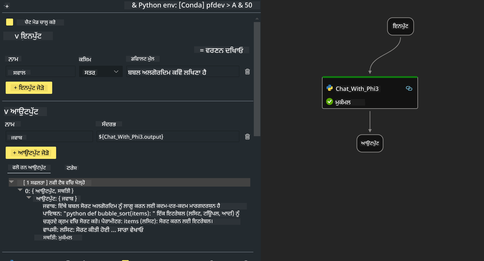

<!--
CO_OP_TRANSLATOR_METADATA:
{
  "original_hash": "3dbbf568625b1ee04b354c2dc81d3248",
  "translation_date": "2025-07-17T04:25:03+00:00",
  "source_file": "md/02.Application/02.Code/Phi3/VSCodeExt/HOL/Apple/02.PromptflowWithMLX.md",
  "language_code": "pa"
}
-->
# **ਲੈਬ 2 - AIPC ਵਿੱਚ Phi-3-mini ਨਾਲ Prompt flow ਚਲਾਉਣਾ**

## **Prompt flow ਕੀ ਹੈ**

Prompt flow ਇੱਕ ਵਿਕਾਸ ਟੂਲ ਸੂਟ ਹੈ ਜੋ LLM-ਆਧਾਰਿਤ AI ਐਪਲੀਕੇਸ਼ਨਾਂ ਦੇ ਆਈਡੀਆ ਤੋਂ ਲੈ ਕੇ ਪ੍ਰੋਟੋਟਾਈਪਿੰਗ, ਟੈਸਟਿੰਗ, ਮੁਲਾਂਕਣ ਅਤੇ ਪ੍ਰੋਡਕਸ਼ਨ ਤੱਕ ਦੇ ਪੂਰੇ ਵਿਕਾਸ ਚੱਕਰ ਨੂੰ ਆਸਾਨ ਬਣਾਉਂਦਾ ਹੈ। ਇਹ prompt engineering ਨੂੰ ਬਹੁਤ ਸੌਖਾ ਕਰਦਾ ਹੈ ਅਤੇ ਤੁਹਾਨੂੰ ਉੱਚ ਗੁਣਵੱਤਾ ਵਾਲੀਆਂ LLM ਐਪਸ ਬਣਾਉਣ ਦੀ ਸਹੂਲਤ ਦਿੰਦਾ ਹੈ।

Prompt flow ਨਾਲ, ਤੁਸੀਂ ਇਹ ਕਰ ਸਕੋਗੇ:

- ਐਸੇ ਫਲੋ ਬਣਾਓ ਜੋ LLMs, prompts, Python ਕੋਡ ਅਤੇ ਹੋਰ ਟੂਲਜ਼ ਨੂੰ ਇੱਕ executable workflow ਵਿੱਚ ਜੋੜਦੇ ਹਨ।

- ਆਪਣੇ ਫਲੋਜ਼ ਨੂੰ ਡੀਬੱਗ ਅਤੇ ਦੁਹਰਾਓ, ਖਾਸ ਕਰਕੇ LLMs ਨਾਲ ਇੰਟਰੈਕਸ਼ਨ ਨੂੰ ਆਸਾਨੀ ਨਾਲ ਸੰਭਾਲੋ।

- ਆਪਣੇ ਫਲੋਜ਼ ਦਾ ਮੁਲਾਂਕਣ ਕਰੋ, ਵੱਡੇ ਡੇਟਾਸੈੱਟ ਨਾਲ ਗੁਣਵੱਤਾ ਅਤੇ ਪ੍ਰਦਰਸ਼ਨ ਮੈਟਰਿਕਸ ਦੀ ਗਣਨਾ ਕਰੋ।

- ਟੈਸਟਿੰਗ ਅਤੇ ਮੁਲਾਂਕਣ ਨੂੰ ਆਪਣੇ CI/CD ਸਿਸਟਮ ਵਿੱਚ ਸ਼ਾਮਲ ਕਰੋ ਤਾਂ ਜੋ ਤੁਹਾਡੇ ਫਲੋ ਦੀ ਗੁਣਵੱਤਾ ਯਕੀਨੀ ਬਣਾਈ ਜਾ ਸਕੇ।

- ਆਪਣੇ ਫਲੋਜ਼ ਨੂੰ ਚੁਣੇ ਹੋਏ ਸਰਵਿੰਗ ਪਲੇਟਫਾਰਮ 'ਤੇ ਡਿਪਲੋਇ ਕਰੋ ਜਾਂ ਆਪਣੇ ਐਪ ਦੇ ਕੋਡ ਬੇਸ ਵਿੱਚ ਆਸਾਨੀ ਨਾਲ ਇੰਟੀਗ੍ਰੇਟ ਕਰੋ।

- (ਵਿਕਲਪਿਕ ਪਰ ਬਹੁਤ ਸਿਫਾਰਸ਼ੀ) Azure AI ਵਿੱਚ Prompt flow ਦੇ ਕਲਾਉਡ ਵਰਜ਼ਨ ਦੀ ਵਰਤੋਂ ਕਰਕੇ ਆਪਣੀ ਟੀਮ ਨਾਲ ਸਹਿਯੋਗ ਕਰੋ।


## **Apple Silicon 'ਤੇ generation ਕੋਡ ਫਲੋ ਬਣਾਉਣਾ**

***Note*** ：ਜੇ ਤੁਸੀਂ ਵਾਤਾਵਰਣ ਸੈਟਅੱਪ ਨਹੀਂ ਕੀਤਾ, ਤਾਂ ਕਿਰਪਾ ਕਰਕੇ [Lab 0 -Installations](./01.Installations.md) ਵੇਖੋ

1. Visual Studio Code ਵਿੱਚ Prompt flow Extension ਖੋਲ੍ਹੋ ਅਤੇ ਇੱਕ ਖਾਲੀ flow ਪ੍ਰੋਜੈਕਟ ਬਣਾਓ


2. Inputs ਅਤੇ Outputs ਪੈਰਾਮੀਟਰ ਸ਼ਾਮਲ ਕਰੋ ਅਤੇ ਨਵਾਂ flow ਵਜੋਂ Python ਕੋਡ ਜੋੜੋ



ਤੁਸੀਂ ਆਪਣੇ flow ਨੂੰ ਬਣਾਉਣ ਲਈ ਇਸ ਸਟ੍ਰਕਚਰ (flow.dag.yaml) ਨੂੰ ਰੈਫਰ ਕਰ ਸਕਦੇ ਹੋ

```yaml

inputs:
  prompt:
    type: string
    default: Write python code for Fibonacci serie. Please use markdown as output
outputs:
  result:
    type: string
    reference: ${gen_code_by_phi3.output}
nodes:
- name: gen_code_by_phi3
  type: python
  source:
    type: code
    path: gen_code_by_phi3.py
  inputs:
    prompt: ${inputs.prompt}


```

3. phi-3-mini ਨੂੰ quantify ਕਰੋ

ਅਸੀਂ ਚਾਹੁੰਦੇ ਹਾਂ ਕਿ SLM ਨੂੰ ਲੋਕਲ ਡਿਵਾਈਸਾਂ 'ਤੇ ਬਿਹਤਰ ਚਲਾਇਆ ਜਾ ਸਕੇ। ਆਮ ਤੌਰ 'ਤੇ, ਅਸੀਂ ਮਾਡਲ ਨੂੰ quantify ਕਰਦੇ ਹਾਂ (INT4, FP16, FP32)

```bash

python -m mlx_lm.convert --hf-path microsoft/Phi-3-mini-4k-instruct

```

**Note:** ਡਿਫਾਲਟ ਫੋਲਡਰ mlx_model ਹੈ

4. ***Chat_With_Phi3.py*** ਵਿੱਚ ਕੋਡ ਸ਼ਾਮਲ ਕਰੋ

```python


from promptflow import tool

from mlx_lm import load, generate


# The inputs section will change based on the arguments of the tool function, after you save the code
# Adding type to arguments and return value will help the system show the types properly
# Please update the function name/signature per need
@tool
def my_python_tool(prompt: str) -> str:

    model_id = './mlx_model_phi3_mini'

    model, tokenizer = load(model_id)

    # <|user|>\nWrite python code for Fibonacci serie. Please use markdown as output<|end|>\n<|assistant|>

    response = generate(model, tokenizer, prompt="<|user|>\n" + prompt  + "<|end|>\n<|assistant|>", max_tokens=2048, verbose=True)

    return response


```

4. ਤੁਸੀਂ Debug ਜਾਂ Run ਤੋਂ flow ਦੀ ਜਾਂਚ ਕਰ ਸਕਦੇ ਹੋ ਕਿ generation ਕੋਡ ਠੀਕ ਹੈ ਜਾਂ ਨਹੀਂ


5. ਟਰਮੀਨਲ ਵਿੱਚ development API ਵਜੋਂ flow ਚਲਾਓ

```

pf flow serve --source ./ --port 8080 --host localhost   

```

ਤੁਸੀਂ ਇਸਨੂੰ Postman / Thunder Client ਵਿੱਚ ਟੈਸਟ ਕਰ ਸਕਦੇ ਹੋ


### **Note**

1. ਪਹਿਲੀ ਵਾਰੀ ਚਲਾਉਣ ਵਿੱਚ ਵਧੇਰੇ ਸਮਾਂ ਲੱਗਦਾ ਹੈ। ਸਿਫਾਰਸ਼ ਕੀਤੀ ਜਾਂਦੀ ਹੈ ਕਿ phi-3 ਮਾਡਲ Hugging face CLI ਤੋਂ ਡਾਊਨਲੋਡ ਕਰੋ।

2. Intel NPU ਦੀ ਸੀਮਿਤ ਕਮਪਿਊਟਿੰਗ ਪਾਵਰ ਨੂੰ ਧਿਆਨ ਵਿੱਚ ਰੱਖਦੇ ਹੋਏ, Phi-3-mini-4k-instruct ਵਰਤਣਾ ਬਿਹਤਰ ਰਹੇਗਾ।

3. ਅਸੀਂ INT4 ਕਨਵਰਜ਼ਨ ਲਈ Intel NPU Acceleration ਦੀ ਵਰਤੋਂ ਕਰਦੇ ਹਾਂ, ਪਰ ਜੇ ਤੁਸੀਂ ਸੇਵਾ ਨੂੰ ਦੁਬਾਰਾ ਚਲਾਉਂਦੇ ਹੋ ਤਾਂ cache ਅਤੇ nc_workshop ਫੋਲਡਰਾਂ ਨੂੰ ਹਟਾਉਣਾ ਪਵੇਗਾ।


## **ਸੰਸਾਧਨ**

1. Promptflow ਸਿੱਖੋ [https://microsoft.github.io/promptflow/](https://microsoft.github.io/promptflow/)

2. Intel NPU Acceleration ਸਿੱਖੋ [https://github.com/intel/intel-npu-acceleration-library](https://github.com/intel/intel-npu-acceleration-library)

3. ਸੈਂਪਲ ਕੋਡ, ਡਾਊਨਲੋਡ ਕਰੋ [Local NPU Agent Sample Code](../../../../../../../../../code/07.Lab/01/AIPC/local-npu-agent)

**ਅਸਵੀਕਾਰੋਪਣ**:  
ਇਹ ਦਸਤਾਵੇਜ਼ AI ਅਨੁਵਾਦ ਸੇਵਾ [Co-op Translator](https://github.com/Azure/co-op-translator) ਦੀ ਵਰਤੋਂ ਕਰਕੇ ਅਨੁਵਾਦਿਤ ਕੀਤਾ ਗਿਆ ਹੈ। ਜਦੋਂ ਕਿ ਅਸੀਂ ਸਹੀਤਾ ਲਈ ਕੋਸ਼ਿਸ਼ ਕਰਦੇ ਹਾਂ, ਕਿਰਪਾ ਕਰਕੇ ਧਿਆਨ ਰੱਖੋ ਕਿ ਸਵੈਚਾਲਿਤ ਅਨੁਵਾਦਾਂ ਵਿੱਚ ਗਲਤੀਆਂ ਜਾਂ ਅਸਮਰਥਤਾਵਾਂ ਹੋ ਸਕਦੀਆਂ ਹਨ। ਮੂਲ ਦਸਤਾਵੇਜ਼ ਆਪਣੀ ਮੂਲ ਭਾਸ਼ਾ ਵਿੱਚ ਪ੍ਰਮਾਣਿਕ ਸਰੋਤ ਮੰਨਿਆ ਜਾਣਾ ਚਾਹੀਦਾ ਹੈ। ਮਹੱਤਵਪੂਰਨ ਜਾਣਕਾਰੀ ਲਈ, ਪੇਸ਼ੇਵਰ ਮਨੁੱਖੀ ਅਨੁਵਾਦ ਦੀ ਸਿਫਾਰਸ਼ ਕੀਤੀ ਜਾਂਦੀ ਹੈ। ਅਸੀਂ ਇਸ ਅਨੁਵਾਦ ਦੀ ਵਰਤੋਂ ਤੋਂ ਉਤਪੰਨ ਕਿਸੇ ਵੀ ਗਲਤਫਹਿਮੀ ਜਾਂ ਗਲਤ ਵਿਆਖਿਆ ਲਈ ਜ਼ਿੰਮੇਵਾਰ ਨਹੀਂ ਹਾਂ।