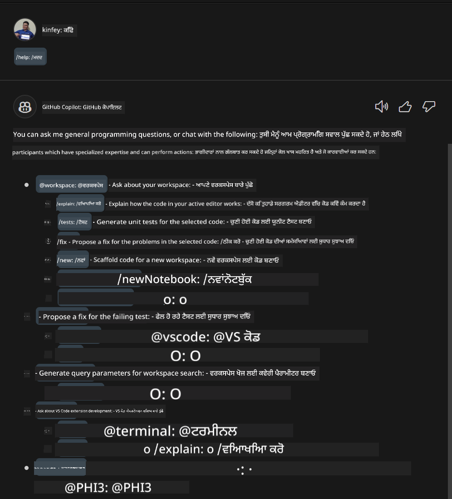
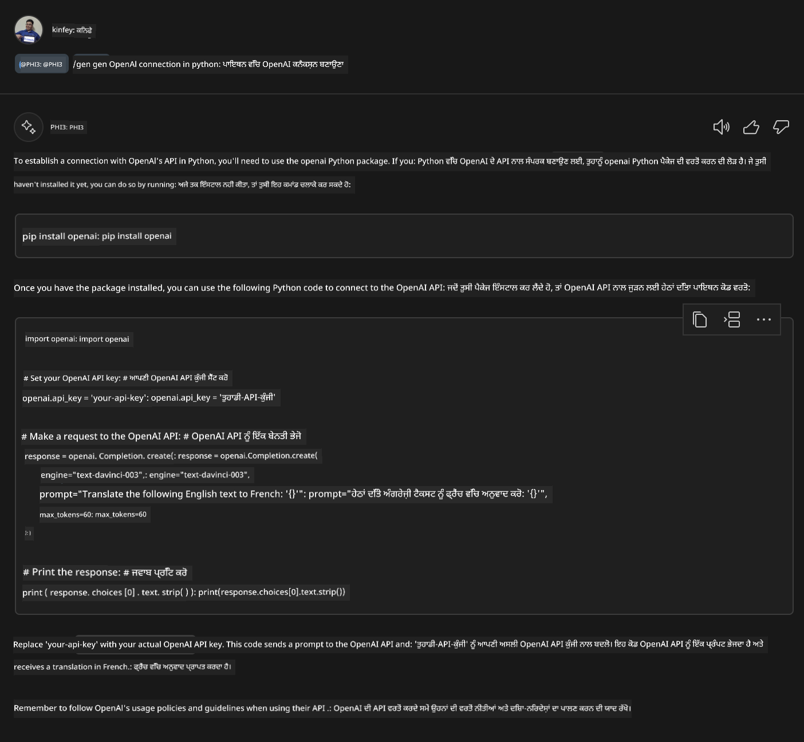
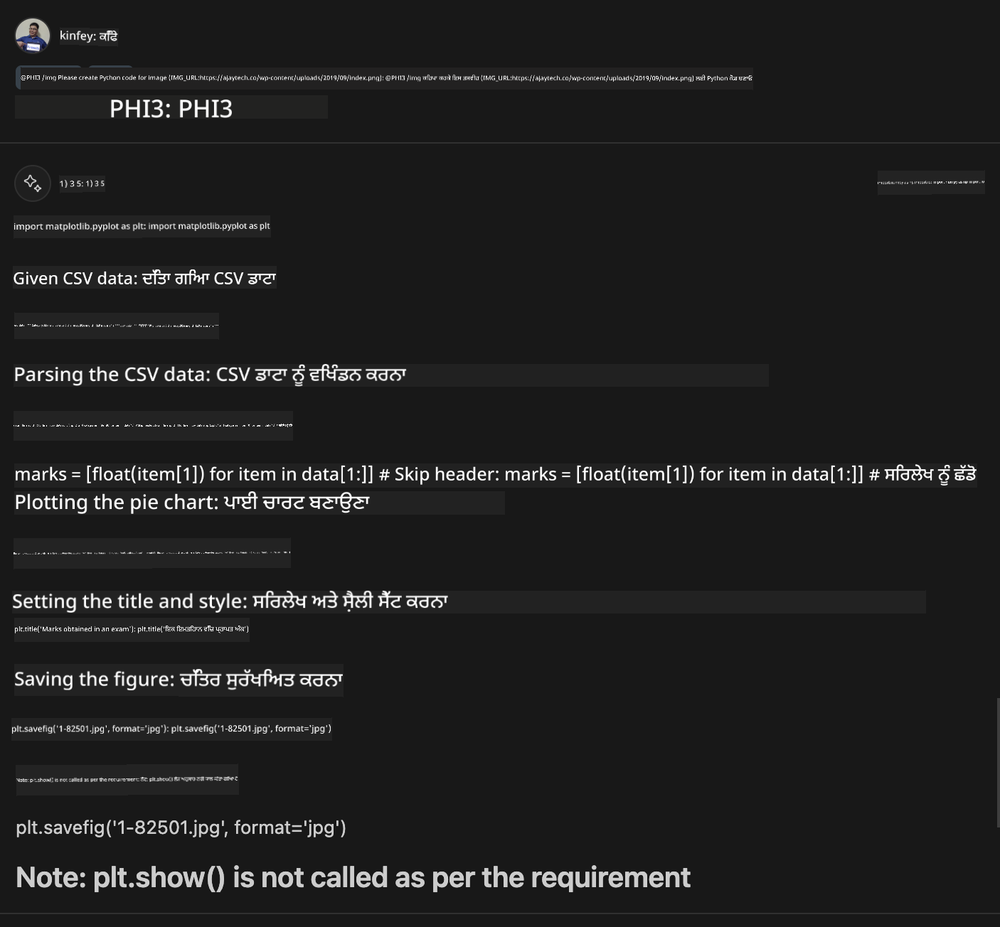

<!--
CO_OP_TRANSLATOR_METADATA:
{
  "original_hash": "df19a4d9fe96fe7335665bede9298a62",
  "translation_date": "2025-05-09T19:46:10+00:00",
  "source_file": "md/02.Application/02.Code/Phi3/VSCodeExt/HOL/Apple/04.CreatePhi3AgentInVSCode.md",
  "language_code": "pa"
}
-->
# **ਲੈਬ 3 - GitHub Copilot Chat ਵਿੱਚ @PHI3 ਏਜੰਟ ਬਣਾਓ**

Visual Studio Code Copilot Chat ਵਿੱਚ, ਤੁਸੀਂ @workspace ਰਾਹੀਂ ਸਾਰੇ ਪ੍ਰੋਜੈਕਟ ਨੂੰ ਮੈਨੇਜ ਕਰ ਸਕਦੇ ਹੋ। ਉਦਯੋਗਿਕ ਸੰਦਰਭਾਂ ਲਈ, ਅਸੀਂ Copilot Chat ਦੇ ਏਜੰਟ ਨੂੰ ਹੋਰ ਲਚਕੀਲੇ ਤਰੀਕੇ ਨਾਲ ਕਸਟਮਾਈਜ਼ ਵੀ ਕਰ ਸਕਦੇ ਹਾਂ।


ਪਿਛਲੀ ਲੈਬ ਵਿੱਚ, ਅਸੀਂ MX ਫਰੇਮਵਰਕ ਅਤੇ ਕਲਾਉਡ ਨੂੰ ਜੋੜ ਕੇ Phi3 ਏਜੰਟ ਲਈ Visual Studio Code ਐਕਸਟੈਂਸ਼ਨ ਬਣਾਈ ਸੀ।



### **1. VSCode ਵਿਕਾਸ ਐਕਸਟੈਂਸ਼ਨ ਬਣਾਓ**

ਕਿਰਪਾ ਕਰਕੇ ਇਸ ਲਿੰਕ [https://code.visualstudio.com/api/get-started/your-first-extension](https://code.visualstudio.com/api/get-started/your-first-extension) ਨੂੰ ਵੇਖੋ ਤਾਂ ਜੋ ਇੱਕ ਐਕਸਟੈਂਸ਼ਨ ਪ੍ਰੋਜੈਕਟ ਬਣਾਇਆ ਜਾ ਸਕੇ

***NOTE:*** ਇਸ ਪ੍ਰੋਜੈਕਟ ਲਈ Typescript ਅਤੇ WebPack ਵਰਤੋਂ ਵਿੱਚ ਲਿਆਓ

### **2. vscode.d.ts ਸ਼ਾਮਿਲ ਕਰੋ**

Visual Studio Code Chat API ਹਾਲੇ ਤੱਕ ਕੋਡ API ਵਿੱਚ ਮਰਜ ਨਹੀਂ ਹੋਈ ਹੈ, ਪਰ ਹੁਣ ਇਹ ਐਕਸਟੈਂਸ਼ਨ ਰਾਹੀਂ ਸ਼ਾਮਿਲ ਕੀਤੀ ਜਾਂਦੀ ਹੈ।

vscode.d.ts ਡਾਊਨਲੋਡ ਕਰੋ [https://github.com/microsoft/vscode/blob/main/src/vscode-dts/vscode.d.ts](https://github.com/microsoft/vscode/blob/main/src/vscode-dts/vscode.d.ts)

***NOTE:*** ਕਿਰਪਾ ਕਰਕੇ Visual Studio Code Insiders 1.90+ ਵਿੱਚ ਚਲਾਓ


### **3. package.json ਅੱਪਡੇਟ ਕਰੋ**

```json

{
  "name": "phi3ext",
  "displayName": "phi3ext",
  "description": "",
  "version": "0.0.1",
  "engines": {
    "vscode": "^1.90.0"
  },
  "categories": [
      "AI",
      "Chat"
  ],
  "activationEvents": [],
  "enabledApiProposals": [
      "chatVariableResolver"
  ],
  "main": "./dist/extension.js",
  "contributes": {
      "chatParticipants": [
          {
              "id": "chat.PHI3",
              "name": "PHI3",
              "description": "Hey! I am PHI3",
              "isSticky": true,
              "commands": [
                  {
                      "name": "gen",
                      "description": "I am PHI3, you can gen code with me"
                  },
                  {
                      "name": "img",
                      "description": "I am PHI3-vision, you can gen code from img with me"
                  }
              ]
          }
      ],
      "commands": [
          {
              "command": "PHI3.namesInEditor",
              "title": "Use PHI3 in Editor"
          }
      ]
  },  
  "scripts": {
    "vscode:prepublish": "npm run package",
    "compile": "webpack",
    "watch": "webpack --watch",
    "package": "webpack --mode production --devtool hidden-source-map",
    "compile-tests": "tsc -p . --outDir out",
    "watch-tests": "tsc -p . -w --outDir out",
    "pretest": "npm run compile-tests && npm run compile && npm run lint",
    "lint": "eslint src --ext ts",
    "test": "vscode-test"
  },
  "devDependencies": {
    "@types/vscode": "^1.90.0",
    "@types/mocha": "^10.0.6",
    "@types/node": "18.x",
    "@typescript-eslint/eslint-plugin": "^7.11.0",
    "@typescript-eslint/parser": "^7.11.0",
    "eslint": "^8.57.0",
    "typescript": "^5.4.5",
    "ts-loader": "^9.5.1",
    "webpack": "^5.91.0",
    "webpack-cli": "^5.1.4",
    "@vscode/test-cli": "^0.0.9",
    "@vscode/test-electron": "^2.4.0"
  },
  "dependencies": {
    "@types/node-fetch": "^2.6.11",
    "node-fetch": "^3.3.2"
  }
}

```

ਤੁਸੀਂ ਟਰਮੀਨਲ ਵਿੱਚ **npm install** ਚਲਾ ਕੇ ਆਪਣੀ ਐਕਸਟੈਂਸ਼ਨ ਨੂੰ ਡੀਬੱਗ ਕਰਕੇ ਟੈਸਟ ਕਰ ਸਕਦੇ ਹੋ।

***Download Sample Code*** [ਇੱਥੇ ਕਲਿੱਕ ਕਰੋ](../../../../../../../../../code/07.Lab/01/Apple)


### **4. src/extension.ts ਬਦਲੋ**


```ts

// The module 'vscode' contains the VS Code extensibility API
// Import the module and reference it with the alias vscode in your code below
import * as vscode from 'vscode';


interface IPHI3ChatResult extends vscode.ChatResult {
    metadata: {
        command: string;
    }
}


// This method is called when your extension is activated
// Your extension is activated the very first time the command is executed
export function activate(extcontext: vscode.ExtensionContext) {


	// Define a SHEIN chat handler. 
	const phi3handler: vscode.ChatRequestHandler = async (request: vscode.ChatRequest, context: vscode.ChatContext, stream: vscode.ChatResponseStream, token: vscode.CancellationToken): Promise<IPHI3ChatResult> => {

		if (request.command == 'gen') {

			const content = "Welcome to Phi-3 to gen code";

			const result = await gen(request.prompt);

			const code = result;
			
			
			stream.markdown(code)


            return { metadata: { command: 'gen' } };

		}
		if (request.command == 'img') {

			const content = "Welcome to Phi-3 vision to gen code in image";

			const prompt = request.prompt;

			if(prompt.indexOf("(IMG_URL:")>-1){

				const img_url = prompt.split("(IMG_URL:")[1].split(")")[0];
				const question = prompt.split("(IMG_URL:")[0];
				const tmp = question;

				const result = await genImage(question,img_url);
	
				const code = result;
				
				
				stream.markdown(code)
	
	
				return { metadata: { command: 'img' } };
			}
			else
			{
				var result = "Please ask question like this Your question (IMG_URL:https://example.com/image.jpg)";
				stream.markdown(result);
			}


            return { metadata: { command: 'img' } };

		}


		return { metadata: { command: '' } };

	}


	const phi3 = vscode.chat.createChatParticipant("chat.PHI3", phi3handler);

	phi3.iconPath = new vscode.ThemeIcon('sparkle');


    phi3.followupProvider = {
        provideFollowups(result: IPHI3ChatResult, context: vscode.ChatContext, token: vscode.CancellationToken) {
            return [{
                prompt: 'let us code with Phi-3 Family',
                label: vscode.l10n.t('Dev with Phi-3 Family'),
                command: 'help'
            } satisfies vscode.ChatFollowup];
        }
    };

	extcontext.subscriptions.push(phi3);
}


interface GenCode {
	prompt: string;
}

interface ImgGenCodeResponse {
	output: string;
}


interface GenCodeResponse {
	result: string;
}

async function gen(prompt: string) {

	const postData: GenCode = {
		prompt: prompt
	};
	const response = await fetch('http://localhost:8080/score', {
		method: 'POST',
		body: JSON.stringify(postData),
		headers: { 'Content-Type': 'application/json' }
	});
	const post = await response.json();
	const resultResponse = post as GenCodeResponse;
	return resultResponse.result;
}

async function genImage(prompt: string, img_url: string) {

	// const postData: GenCode = {
	// 	question: prompt
	// };
	const response = await fetch('Your Phi-3 Endpoint', {
		method: 'POST',
		body: JSON.stringify({
			"input_data":{
			  "input_string":[
				{
				  "role":"user",
				  "content":[ 
					{
					  "type": "text",
					  "text": prompt
					},
					{
						"type": "image_url",
						"image_url": {
						  "url": img_url
						}
					}
				  ]
				}
			  ],
			  "parameters":{
					"temperature": 0.6,
					"top_p": 0.9,
					"do_sample": false,
					"max_new_tokens": 2048
			  }
			}
		}),
		headers: { 'Content-Type': 'application/json', 'Authorization' : 'Bearer Your Phi-3-Vision Endpoint Key', 'azureml-model-deployment': 'Your Phi-3-Vision Deployment Name' }
	});
	const post = await response.json();
	const resultResponse = post as ImgGenCodeResponse;
	return resultResponse.output;
}

// This method is called when your extension is deactivated
export function deactivate() {}


```

ਵਧਾਈਆਂ! ਤੁਸੀਂ ਸਾਰੇ ਲੈਬ ਖਤਮ ਕਰ ਲਏ ਹਨ। ਮੈਂ ਉਮੀਦ ਕਰਦਾ ਹਾਂ ਕਿ ਇਹ ਤੁਹਾਨੂੰ Phi-3 ਪਰਿਵਾਰ ਅਤੇ GitHub Copilot Chat ਨੂੰ ਵਰਤਣ ਬਾਰੇ ਸਮਝਣ ਵਿੱਚ ਮਦਦ ਕਰੇਗਾ।

ਤੁਸੀਂ ***@PHI3 /gen*** ਟਰਾਈ ਕਰ ਸਕਦੇ ਹੋ



ਤੁਸੀਂ ***@PHI3 /img*** ਟਰਾਈ ਕਰ ਸਕਦੇ ਹੋ



**ਅਸਪਸ਼ਟੀਕਰਨ**:  
ਇਹ ਦਸਤਾਵੇਜ਼ AI ਅਨੁਵਾਦ ਸੇਵਾ [Co-op Translator](https://github.com/Azure/co-op-translator) ਦੀ ਵਰਤੋਂ ਨਾਲ ਅਨੁਵਾਦਿਤ ਕੀਤਾ ਗਿਆ ਹੈ। ਜਦੋਂ ਕਿ ਅਸੀਂ ਸਹੀਤਾ ਲਈ ਕੋਸ਼ਿਸ਼ ਕਰਦੇ ਹਾਂ, ਕਿਰਪਾ ਕਰਕੇ ਧਿਆਨ ਵਿੱਚ ਰੱਖੋ ਕਿ ਸਵੈਚਾਲਿਤ ਅਨੁਵਾਦਾਂ ਵਿੱਚ ਗਲਤੀਆਂ ਜਾਂ ਅਣਸਹੀਤੀਆਂ ਹੋ ਸਕਦੀਆਂ ਹਨ। ਮੂਲ ਦਸਤਾਵੇਜ਼ ਆਪਣੇ ਮੂਲ ਭਾਸ਼ਾ ਵਿੱਚ ਹੀ ਪ੍ਰਮਾਣਿਕ ਸਰੋਤ ਮੰਨਿਆ ਜਾਣਾ ਚਾਹੀਦਾ ਹੈ। ਮਹੱਤਵਪੂਰਨ ਜਾਣਕਾਰੀ ਲਈ, ਪੇਸ਼ੇਵਰ ਮਨੁੱਖੀ ਅਨੁਵਾਦ ਦੀ ਸਿਫਾਰਿਸ਼ ਕੀਤੀ ਜਾਂਦੀ ਹੈ। ਇਸ ਅਨੁਵਾਦ ਦੀ ਵਰਤੋਂ ਕਰਕੇ ਹੋਣ ਵਾਲੀਆਂ ਕਿਸੇ ਵੀ ਗਲਤਫਹਿਮੀਆਂ ਜਾਂ ਗਲਤ ਵਿਆਖਿਆਵਾਂ ਲਈ ਅਸੀਂ ਜ਼ਿੰਮੇਵਾਰ ਨਹੀਂ ਹਾਂ।