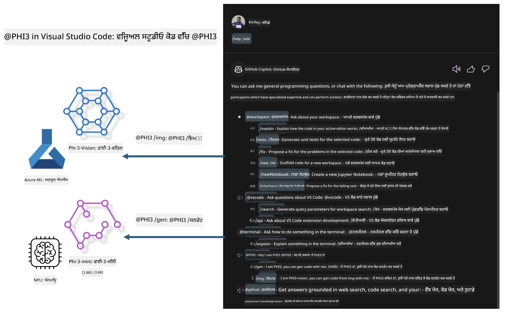

<!--
CO_OP_TRANSLATOR_METADATA:
{
  "original_hash": "00b7a699de8ac405fa821f4c0f7fc0ab",
  "translation_date": "2025-05-09T19:11:33+00:00",
  "source_file": "md/02.Application/02.Code/Phi3/VSCodeExt/README.md",
  "language_code": "pa"
}
-->
# **ਆਪਣਾ ਖੁਦ ਦਾ Visual Studio Code GitHub Copilot Chat Microsoft Phi-3 ਪਰਿਵਾਰ ਨਾਲ ਬਣਾਓ**

ਕੀ ਤੁਸੀਂ GitHub Copilot Chat ਵਿੱਚ workspace ਏਜੰਟ ਦੀ ਵਰਤੋਂ ਕੀਤੀ ਹੈ? ਕੀ ਤੁਸੀਂ ਆਪਣੀ ਟੀਮ ਲਈ ਕੋਡ ਏਜੰਟ ਬਣਾਉਣਾ ਚਾਹੁੰਦੇ ਹੋ? ਇਹ ਹੱਥ-ਅਨੁਭਵੀ ਲੈਬ ਖੁੱਲ੍ਹੇ ਸਰੋਤ ਮਾਡਲ ਨੂੰ ਮਿਲਾ ਕੇ ਉਦਯੋਗ-ਪੱਧਰੀ ਕੋਡ ਬਿਜ਼ਨਸ ਏਜੰਟ ਬਣਾਉਣ ਦੀ ਕੋਸ਼ਿਸ਼ ਕਰਦੀ ਹੈ।

## **ਬੁਨਿਆਦ**

### **Microsoft Phi-3 ਕਿਉਂ ਚੁਣੀਏ**

Phi-3 ਇੱਕ ਪਰਿਵਾਰ ਸੀਰੀਜ਼ ਹੈ, ਜਿਸ ਵਿੱਚ phi-3-mini, phi-3-small, ਅਤੇ phi-3-medium ਸ਼ਾਮਲ ਹਨ ਜੋ ਵੱਖ-ਵੱਖ ਟ੍ਰੇਨਿੰਗ ਪੈਰਾਮੀਟਰਾਂ ਦੇ ਆਧਾਰ 'ਤੇ ਟੈਕਸਟ ਜਨਰੇਸ਼ਨ, ਡਾਇਲਾਗ ਕੰਪਲੀਸ਼ਨ, ਅਤੇ ਕੋਡ ਜਨਰੇਸ਼ਨ ਲਈ ਹਨ। ਇਸ ਦੇ ਨਾਲ phi-3-vision ਵੀ ਹੈ ਜੋ ਵਿਜ਼ਨ 'ਤੇ ਆਧਾਰਿਤ ਹੈ। ਇਹ ਉਦਯੋਗਾਂ ਜਾਂ ਵੱਖ-ਵੱਖ ਟੀਮਾਂ ਲਈ ਆਫਲਾਈਨ ਜਨਰੇਟਿਵ AI ਹੱਲ ਬਣਾਉਣ ਲਈ موزੂਨ ਹੈ।

ਇਸ ਲਿੰਕ ਨੂੰ ਪੜ੍ਹਨ ਦੀ ਸਿਫਾਰਿਸ਼ ਕੀਤੀ ਜਾਂਦੀ ਹੈ [https://github.com/microsoft/PhiCookBook/blob/main/md/01.Introduction/01/01.PhiFamily.md](https://github.com/microsoft/PhiCookBook/blob/main/md/01.Introduction/01/01.PhiFamily.md)

### **Microsoft GitHub Copilot Chat**

GitHub Copilot Chat ਐਕਸਟੇਸ਼ਨ ਤੁਹਾਨੂੰ ਇੱਕ ਚੈਟ ਇੰਟਰਫੇਸ ਦਿੰਦਾ ਹੈ ਜੋ GitHub Copilot ਨਾਲ ਗੱਲਬਾਤ ਕਰਨ ਅਤੇ ਕੋਡਿੰਗ ਸੰਬੰਧੀ ਸਵਾਲਾਂ ਦੇ ਜਵਾਬ VS Code ਵਿੱਚ ਹੀ ਸਿੱਧਾ ਪ੍ਰਾਪਤ ਕਰਨ ਦੀ ਆਗਿਆ ਦਿੰਦਾ ਹੈ, ਜਿਸ ਲਈ ਤੁਹਾਨੂੰ ਦਸਤਾਵੇਜ਼ਾਂ ਵਿੱਚ ਜਾਂ ਫੋਰਮਾਂ ਵਿੱਚ ਖੋਜ ਕਰਨ ਦੀ ਲੋੜ ਨਹੀਂ।

Copilot Chat ਸੰਭਵ ਹੈ ਕਿ ਜਵਾਬ ਨੂੰ ਵਧੀਆ ਸਮਝਣ ਲਈ syntax highlighting, indentation, ਅਤੇ ਹੋਰ ਫਾਰਮੈਟਿੰਗ ਵਿਸ਼ੇਸ਼ਤਾਵਾਂ ਵਰਤੇ। ਯੂਜ਼ਰ ਦੇ ਸਵਾਲ ਦੇ ਕਿਸਮ ਦੇ ਅਨੁਸਾਰ, ਨਤੀਜੇ ਵਿੱਚ ਉਹ ਸੰਦਰਭ ਲਿੰਕ ਸ਼ਾਮਲ ਹੋ ਸਕਦੇ ਹਨ ਜਿਨ੍ਹਾਂ ਨੂੰ Copilot ਨੇ ਜਵਾਬ ਬਣਾਉਣ ਲਈ ਵਰਤਿਆ, ਜਿਵੇਂ ਕਿ ਸੋਰਸ ਕੋਡ ਫਾਈਲਾਂ ਜਾਂ ਦਸਤਾਵੇਜ਼, ਜਾਂ VS Code ਫੰਕਸ਼ਨਲਿਟੀ ਤੱਕ ਪਹੁੰਚ ਦੇ ਬਟਨ।

- Copilot Chat ਤੁਹਾਡੇ ਡਿਵੈਲਪਰ ਫਲੋ ਵਿੱਚ ਸ਼ਾਮਲ ਹੁੰਦਾ ਹੈ ਅਤੇ ਜਿੱਥੇ ਲੋੜ ਹੋਵੇ ਮਦਦ ਦਿੰਦਾ ਹੈ:

- ਐਡੀਟਰ ਜਾਂ ਟਰਮੀਨਲ ਤੋਂ ਸਿੱਧਾ ਇਨਲਾਈਨ ਚੈਟ ਸ਼ੁਰੂ ਕਰੋ ਜਦੋਂ ਤੁਸੀਂ ਕੋਡ ਕਰ ਰਹੇ ਹੋ

- ਚੈਟ ਵਿਊ ਵਰਤੋ ਤਾਂ ਜੋ ਕਿਸੇ ਵੀ ਸਮੇਂ ਇੱਕ AI ਸਹਾਇਕ ਤੁਹਾਡੇ ਨਾਲ ਹੋਵੇ

- Quick Chat ਲਾਂਚ ਕਰੋ ਜਿੱਥੇ ਤੁਸੀਂ ਤੇਜ਼ ਸਵਾਲ ਪੁੱਛ ਸਕਦੇ ਹੋ ਅਤੇ ਫਿਰ ਆਪਣਾ ਕੰਮ ਜਾਰੀ ਰੱਖ ਸਕਦੇ ਹੋ

ਤੁਸੀਂ GitHub Copilot Chat ਨੂੰ ਕਈ ਸਥਿਤੀਆਂ ਵਿੱਚ ਵਰਤ ਸਕਦੇ ਹੋ, ਜਿਵੇਂ:

- ਕਿਸੇ ਸਮੱਸਿਆ ਦਾ ਸਭ ਤੋਂ ਵਧੀਆ ਹੱਲ ਕਿਵੇਂ ਕਰਨਾ ਹੈ ਇਸ ਬਾਰੇ ਕੋਡਿੰਗ ਸਵਾਲਾਂ ਦੇ ਜਵਾਬ ਦੇਣਾ

- ਕਿਸੇ ਹੋਰ ਦੇ ਕੋਡ ਨੂੰ ਸਮਝਾਉਣਾ ਅਤੇ ਸੁਧਾਰ ਸੁਝਾਅ ਦੇਣਾ

- ਕੋਡ ਫਿਕਸ ਪ੍ਰਸਤਾਵਿਤ ਕਰਨਾ

- ਯੂਨਿਟ ਟੈਸਟ ਕੇਸ ਬਣਾਉਣਾ

- ਕੋਡ ਦਸਤਾਵੇਜ਼ ਬਣਾਉਣਾ

ਇਸ ਲਿੰਕ ਨੂੰ ਪੜ੍ਹਨ ਦੀ ਸਿਫਾਰਿਸ਼ ਕੀਤੀ ਜਾਂਦੀ ਹੈ [https://code.visualstudio.com/docs/copilot/copilot-chat](https://code.visualstudio.com/docs/copilot/copilot-chat?WT.mc_id=aiml-137032-kinfeylo)

###  **Microsoft GitHub Copilot Chat @workspace**

Copilot Chat ਵਿੱਚ **@workspace** ਦਾ ਹਵਾਲਾ ਦੇ ਕੇ ਤੁਸੀਂ ਆਪਣੇ ਪੂਰੇ ਕੋਡਬੇਸ ਬਾਰੇ ਸਵਾਲ ਪੁੱਛ ਸਕਦੇ ਹੋ। ਸਵਾਲ ਦੇ ਆਧਾਰ 'ਤੇ, Copilot ਸਿਆਣਪ ਨਾਲ ਸੰਬੰਧਿਤ ਫਾਈਲਾਂ ਅਤੇ ਸਿੰਬਲ ਖੋਜਦਾ ਹੈ, ਜੋ ਉਹ ਆਪਣੇ ਜਵਾਬ ਵਿੱਚ ਲਿੰਕਾਂ ਅਤੇ ਕੋਡ ਉਦਾਹਰਣਾਂ ਵਜੋਂ ਵਰਤਦਾ ਹੈ।

ਤੁਹਾਡੇ ਸਵਾਲ ਦਾ ਜਵਾਬ ਦੇਣ ਲਈ, **@workspace** ਉਹਨਾਂ ਸਰੋਤਾਂ ਵਿੱਚ ਖੋਜ ਕਰਦਾ ਹੈ ਜਿਹੜੇ ਡਿਵੈਲਪਰ VS Code ਵਿੱਚ ਕੋਡਬੇਸ ਨੂੰ ਨੇਵੀਗੇਟ ਕਰਦੇ ਸਮੇਂ ਵਰਤਦੇ ਹਨ:

- ਵਰਕਸਪੇਸ ਦੀਆਂ ਸਾਰੀਆਂ ਫਾਈਲਾਂ, ਸਿਵਾਏ ਉਹਨਾਂ ਫਾਈਲਾਂ ਦੇ ਜੋ .gitignore ਫਾਈਲ ਦੁਆਰਾ ਅਣਡਿੱਠੀਆਂ ਕੀਤੀਆਂ ਗਈਆਂ ਹਨ

- ਡਾਇਰੈਕਟਰੀ ਸਟ੍ਰਕਚਰ ਨਾਲ ਨੈਸਟਡ ਫੋਲਡਰ ਅਤੇ ਫਾਈਲਾਂ ਦੇ ਨਾਮ

- ਜੇ ਵਰਕਸਪੇਸ GitHub ਰਿਪੋਜ਼ਟਰੀ ਹੈ ਅਤੇ ਕੋਡ ਸર્ચ ਦੁਆਰਾ ਇੰਡੈਕਸ ਕੀਤਾ ਗਿਆ ਹੈ ਤਾਂ GitHub ਦਾ ਕੋਡ ਖੋਜ ਇੰਡੈਕਸ

- ਵਰਕਸਪੇਸ ਵਿੱਚ ਸਿੰਬਲ ਅਤੇ ਪਰਿਭਾਸ਼ਾਵਾਂ

- ਵਰਤਮਾਨ ਚੁਣਿਆ ਹੋਇਆ ਟੈਕਸਟ ਜਾਂ ਐਕਟਿਵ ਐਡੀਟਰ ਵਿੱਚ ਦਿਖਾਈ ਦੇ ਰਹਾ ਟੈਕਸਟ

ਨੋਟ: ਜੇ ਤੁਸੀਂ ਅਣਡਿੱਠੀ ਕੀਤੀ ਫਾਈਲ ਵਿੱਚ ਕੋਈ ਫਾਈਲ ਖੋਲ੍ਹੀ ਹੋਈ ਹੈ ਜਾਂ ਟੈਕਸਟ ਚੁਣਿਆ ਹੋਇਆ ਹੈ ਤਾਂ .gitignore ਨੂੰ ਬਾਈਪਾਸ ਕਰ ਦਿੱਤਾ ਜਾਂਦਾ ਹੈ।

ਇਸ ਲਿੰਕ ਨੂੰ ਪੜ੍ਹਨ ਦੀ ਸਿਫਾਰਿਸ਼ ਕੀਤੀ ਜਾਂਦੀ ਹੈ [[https://code.visualstudio.com/docs/copilot/copilot-chat](https://code.visualstudio.com/docs/copilot/workspace-context?WT.mc_id=aiml-137032-kinfeylo)]

## **ਇਸ ਲੈਬ ਬਾਰੇ ਹੋਰ ਜਾਣਕਾਰੀ**

GitHub Copilot ਨੇ ਉਦਯੋਗਾਂ ਦੀ ਪ੍ਰੋਗਰਾਮਿੰਗ ਕੁਸ਼ਲਤਾ ਵਿੱਚ ਵੱਡਾ ਸੁਧਾਰ ਕੀਤਾ ਹੈ, ਅਤੇ ਹਰ ਉਦਯੋਗ GitHub Copilot ਦੀਆਂ ਸੰਬੰਧਿਤ ਫੰਕਸ਼ਨਲਿਟੀਆਂ ਨੂੰ ਕਸਟਮਾਈਜ਼ ਕਰਨ ਦੀ ਆਸ ਕਰਦਾ ਹੈ। ਬਹੁਤ ਸਾਰੇ ਉਦਯੋਗ ਆਪਣੇ ਕਾਰੋਬਾਰੀ ਸੰਦਰਭਾਂ ਅਤੇ ਖੁੱਲ੍ਹੇ ਸਰੋਤ ਮਾਡਲਾਂ ਦੇ ਆਧਾਰ 'ਤੇ GitHub Copilot ਵਰਗੀਆਂ ਕਸਟਮ ਐਕਸਟੇਸ਼ਨ ਬਣਾਈਆਂ ਹਨ। ਉਦਯੋਗਾਂ ਲਈ, ਕਸਟਮ ਐਕਸਟੇਸ਼ਨਜ਼ ਨੂੰ ਕੰਟਰੋਲ ਕਰਨਾ ਆਸਾਨ ਹੁੰਦਾ ਹੈ, ਪਰ ਇਹ ਯੂਜ਼ਰ ਅਨੁਭਵ ਨੂੰ ਪ੍ਰਭਾਵਿਤ ਕਰ ਸਕਦਾ ਹੈ। ਆਖਿਰਕਾਰ, GitHub Copilot ਦੇ ਕੋਲ ਆਮ ਸਥਿਤੀਆਂ ਅਤੇ ਵਿਸ਼ੇਸ਼ਗਿਆਨ ਨਾਲ ਨਿਬਟਣ ਵਿੱਚ ਮਜ਼ਬੂਤ ਫੰਕਸ਼ਨ ਹਨ। ਜੇ ਅਨੁਭਵ ਇੱਕਸਾਰ ਰਿਹਾ ਜਾਵੇ, ਤਾਂ ਆਪਣਾ ਖ਼ਾਸ ਉਦਯੋਗੀ ਐਕਸਟੇਸ਼ਨ ਬਣਾਉਣਾ ਵਧੀਆ ਰਹੇਗਾ। GitHub Copilot Chat ਉਦਯੋਗਾਂ ਲਈ ਚੈਟ ਅਨੁਭਵ ਵਿੱਚ ਵਾਧਾ ਕਰਨ ਲਈ ਸੰਬੰਧਿਤ APIs ਮੁਹੱਈਆ ਕਰਵਾਉਂਦਾ ਹੈ। ਇੱਕਸਾਰ ਅਨੁਭਵ ਰੱਖਣਾ ਅਤੇ ਕਸਟਮ ਫੰਕਸ਼ਨ ਹੋਣਾ ਇੱਕ ਵਧੀਆ ਯੂਜ਼ਰ ਅਨੁਭਵ ਹੈ।

ਇਹ ਲੈਬ ਮੁੱਖ ਤੌਰ 'ਤੇ Phi-3 ਮਾਡਲ ਨੂੰ ਸਥਾਨਕ NPU ਅਤੇ Azure ਹਾਈਬ੍ਰਿਡ ਨਾਲ ਜੋੜ ਕੇ GitHub Copilot Chat ਵਿੱਚ ਇੱਕ ਕਸਟਮ ਏਜੰਟ ***@PHI3*** ਬਣਾਉਂਦੀ ਹੈ ਜੋ ਉਦਯੋਗੀ ਡਿਵੈਲਪਰਾਂ ਦੀ ਕੋਡ ਜਨਰੇਸ਼ਨ ***(@PHI3 /gen)*** ਅਤੇ ਚਿੱਤਰਾਂ ਦੇ ਆਧਾਰ 'ਤੇ ਕੋਡ ਜਨਰੇਸ਼ਨ ***(@PHI3 /img)*** ਵਿੱਚ ਮਦਦ ਕਰਦਾ ਹੈ।

### ***ਨੋਟ:*** 

ਇਹ ਲੈਬ ਇਸ ਵੇਲੇ Intel CPU ਅਤੇ Apple Silicon ਦੇ AIPC ਵਿੱਚ ਲਾਗੂ ਕੀਤੀ ਗਈ ਹੈ। ਅਸੀਂ Qualcomm ਵਰਜਨ ਦੇ NPU ਨੂੰ ਅੱਗੇ ਅਪਡੇਟ ਕਰਦੇ ਰਹਾਂਗੇ।

## **ਲੈਬ**

| ਨਾਮ | ਵੇਰਵਾ | AIPC | Apple |
| ------------ | ----------- | -------- |-------- |
| Lab0 - Installations(✅) | ਸੰਬੰਧਿਤ ਵਾਤਾਵਰਣ ਅਤੇ ਇੰਸਟਾਲੇਸ਼ਨ ਟੂਲਜ਼ ਨੂੰ ਸੰਰਚਿਤ ਅਤੇ ਇੰਸਟਾਲ ਕਰੋ | [Go](./HOL/AIPC/01.Installations.md) |[Go](./HOL/Apple/01.Installations.md) |
| Lab1 - Run Prompt flow with Phi-3-mini (✅) | AIPC / Apple Silicon ਨਾਲ ਮਿਲਾ ਕੇ, ਸਥਾਨਕ NPU ਦੀ ਵਰਤੋਂ ਕਰਕੇ Phi-3-mini ਦੁਆਰਾ ਕੋਡ ਜਨਰੇਸ਼ਨ ਬਣਾਓ | [Go](./HOL/AIPC/02.PromptflowWithNPU.md) |  [Go](./HOL/Apple/02.PromptflowWithMLX.md) |
| Lab2 - Deploy Phi-3-vision on Azure Machine Learning Service(✅) | Azure Machine Learning Service ਦੇ ਮਾਡਲ ਕੈਟਾਲੌਗ - Phi-3-vision ਇਮੇਜ ਨੂੰ ਡਿਪਲੌਇ ਕਰਕੇ ਕੋਡ ਜਨਰੇਟ ਕਰੋ | [Go](./HOL/AIPC/03.DeployPhi3VisionOnAzure.md) |[Go](./HOL/Apple/03.DeployPhi3VisionOnAzure.md) |
| Lab3 - Create a @phi-3 agent in GitHub Copilot Chat(✅)  | GitHub Copilot Chat ਵਿੱਚ ਇੱਕ ਕਸਟਮ Phi-3 ਏਜੰਟ ਬਣਾਓ ਜੋ ਕੋਡ ਜਨਰੇਸ਼ਨ, ਗ੍ਰਾਫ ਜਨਰੇਸ਼ਨ ਕੋਡ, RAG ਆਦਿ ਨੂੰ ਪੂਰਾ ਕਰੇ | [Go](./HOL/AIPC/04.CreatePhi3AgentInVSCode.md) | [Go](./HOL/Apple/04.CreatePhi3AgentInVSCode.md) |
| Sample Code (✅)  | ਸੈਂਪਲ ਕੋਡ ਡਾਊਨਲੋਡ ਕਰੋ | [Go](../../../../../../../code/07.Lab/01/AIPC) | [Go](../../../../../../../code/07.Lab/01/Apple) |

## **ਸੰਸਾਧਨ**

1. Phi-3 Cookbook [https://github.com/microsoft/Phi-3CookBook](https://github.com/microsoft/Phi-3CookBook)

2. GitHub Copilot ਬਾਰੇ ਹੋਰ ਜਾਣੋ [https://learn.microsoft.com/training/paths/copilot/](https://learn.microsoft.com/training/paths/copilot/?WT.mc_id=aiml-137032-kinfeylo)

3. GitHub Copilot Chat ਬਾਰੇ ਹੋਰ ਜਾਣੋ [https://learn.microsoft.com/training/paths/accelerate-app-development-using-github-copilot/](https://learn.microsoft.com/training/paths/accelerate-app-development-using-github-copilot/?WT.mc_id=aiml-137032-kinfeylo)

4. GitHub Copilot Chat API ਬਾਰੇ ਹੋਰ ਜਾਣੋ [https://code.visualstudio.com/api/extension-guides/chat](https://code.visualstudio.com/api/extension-guides/chat?WT.mc_id=aiml-137032-kinfeylo)

5. Azure AI Foundry ਬਾਰੇ ਹੋਰ ਜਾਣੋ [https://learn.microsoft.com/training/paths/create-custom-copilots-ai-studio/](https://learn.microsoft.com/training/paths/create-custom-copilots-ai-studio/?WT.mc_id=aiml-137032-kinfeylo)

6. Azure AI Foundry ਦੇ Model Catalog ਬਾਰੇ ਹੋਰ ਜਾਣੋ [https://learn.microsoft.com/azure/ai-studio/how-to/model-catalog-overview](https://learn.microsoft.com/azure/ai-studio/how-to/model-catalog-overview)

**ਅਸਵੀਕਾਰੋਪਣ**:  
ਇਸ ਦਸਤਾਵੇਜ਼ ਦਾ ਅਨੁਵਾਦ ਏਆਈ ਅਨੁਵਾਦ ਸੇਵਾ [Co-op Translator](https://github.com/Azure/co-op-translator) ਦੀ ਵਰਤੋਂ ਕਰਕੇ ਕੀਤਾ ਗਿਆ ਹੈ। ਜਦੋਂ ਕਿ ਅਸੀਂ ਸਹੀਤਾ ਲਈ ਕੋਸ਼ਿਸ਼ ਕਰਦੇ ਹਾਂ, ਕਿਰਪਾ ਕਰਕੇ ਧਿਆਨ ਵਿੱਚ ਰੱਖੋ ਕਿ ਆਟੋਮੈਟਿਕ ਅਨੁਵਾਦਾਂ ਵਿੱਚ ਗਲਤੀਆਂ ਜਾਂ ਅਸਪਸ਼ਟਤਾਵਾਂ ਹੋ ਸਕਦੀਆਂ ਹਨ। ਮੂਲ ਦਸਤਾਵੇਜ਼ ਆਪਣੀ ਮੂਲ ਭਾਸ਼ਾ ਵਿੱਚ ਹੀ ਅਧਿਕਾਰਿਕ ਸਰੋਤ ਸਮਝਿਆ ਜਾਣਾ ਚਾਹੀਦਾ ਹੈ। ਜਰੂਰੀ ਜਾਣਕਾਰੀ ਲਈ, ਪੇਸ਼ੇਵਰ ਮਨੁੱਖੀ ਅਨੁਵਾਦ ਦੀ ਸਿਫਾਰਿਸ਼ ਕੀਤੀ ਜਾਂਦੀ ਹੈ। ਅਸੀਂ ਇਸ ਅਨੁਵਾਦ ਦੀ ਵਰਤੋਂ ਨਾਲ ਹੋਣ ਵਾਲੀਆਂ ਕਿਸੇ ਵੀ ਗਲਤਫਹਿਮੀਆਂ ਜਾਂ ਗਲਤ ਸਮਝਾਂ ਲਈ ਜ਼ਿੰਮੇਵਾਰ ਨਹੀਂ ਹਾਂ।