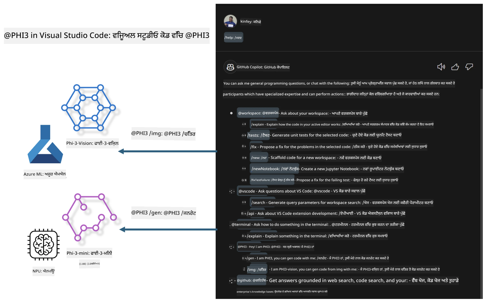

# **ਆਪਣਾ ਖੁਦ ਦਾ Visual Studio Code GitHub Copilot Chat Microsoft Phi-3 ਪਰਿਵਾਰ ਨਾਲ ਬਣਾਓ**

ਕੀ ਤੁਸੀਂ GitHub Copilot Chat ਵਿੱਚ workspace agent ਵਰਤਿਆ ਹੈ? ਕੀ ਤੁਸੀਂ ਆਪਣੀ ਟੀਮ ਦਾ ਕੋਡ ਏਜੰਟ ਬਣਾਉਣਾ ਚਾਹੁੰਦੇ ਹੋ? ਇਹ ਹੱਥ-ਵਰਕਸ਼ਾਪ ਖੁੱਲ੍ਹੇ ਸਰੋਤ ਮਾਡਲ ਨੂੰ ਮਿਲਾ ਕੇ ਇੱਕ ਉਦਯੋਗ-ਪੱਧਰੀ ਕੋਡ ਬਿਜ਼ਨਸ ਏਜੰਟ ਬਣਾਉਣ ਦੀ ਕੋਸ਼ਿਸ਼ ਕਰਦਾ ਹੈ।

## **ਬੁਨਿਆਦ**

### **Microsoft Phi-3 ਕਿਉਂ ਚੁਣੀਏ**

Phi-3 ਇੱਕ ਪਰਿਵਾਰਕ ਸੀਰੀਜ਼ ਹੈ, ਜਿਸ ਵਿੱਚ phi-3-mini, phi-3-small, ਅਤੇ phi-3-medium ਸ਼ਾਮਲ ਹਨ ਜੋ ਵੱਖ-ਵੱਖ ਟ੍ਰੇਨਿੰਗ ਪੈਰਾਮੀਟਰਾਂ ਦੇ ਆਧਾਰ 'ਤੇ ਟੈਕਸਟ ਜਨਰੇਸ਼ਨ, ਡਾਇਲਾਗ ਪੂਰਾ ਕਰਨ ਅਤੇ ਕੋਡ ਜਨਰੇਸ਼ਨ ਲਈ ਬਣਾਏ ਗਏ ਹਨ। ਇਸਦੇ ਨਾਲ ਹੀ Vision 'ਤੇ ਆਧਾਰਿਤ phi-3-vision ਵੀ ਹੈ। ਇਹ ਉਦਯੋਗਾਂ ਜਾਂ ਵੱਖ-ਵੱਖ ਟੀਮਾਂ ਲਈ ਆਫਲਾਈਨ ਜਨਰੇਟਿਵ AI ਹੱਲ ਬਣਾਉਣ ਲਈ ਉਚਿਤ ਹੈ।

ਸਿਫਾਰਸ਼ ਕੀਤੀ ਜਾਂਦੀ ਹੈ ਕਿ ਇਸ ਲਿੰਕ ਨੂੰ ਪੜ੍ਹੋ [https://github.com/microsoft/PhiCookBook/blob/main/md/01.Introduction/01/01.PhiFamily.md](https://github.com/microsoft/PhiCookBook/blob/main/md/01.Introduction/01/01.PhiFamily.md)

### **Microsoft GitHub Copilot Chat**

GitHub Copilot Chat ਐਕਸਟੈਂਸ਼ਨ ਤੁਹਾਨੂੰ ਇੱਕ ਚੈਟ ਇੰਟਰਫੇਸ ਦਿੰਦਾ ਹੈ ਜੋ ਤੁਹਾਨੂੰ GitHub Copilot ਨਾਲ ਗੱਲਬਾਤ ਕਰਨ ਅਤੇ ਕੋਡਿੰਗ-ਸੰਬੰਧੀ ਸਵਾਲਾਂ ਦੇ ਜਵਾਬ ਸਿੱਧੇ VS Code ਵਿੱਚ ਪ੍ਰਾਪਤ ਕਰਨ ਦੀ ਆਗਿਆ ਦਿੰਦਾ ਹੈ, ਬਿਨਾਂ ਦਸਤਾਵੇਜ਼ਾਂ ਨੂੰ ਖੋਜਣ ਜਾਂ ਆਨਲਾਈਨ ਫੋਰਮਾਂ ਵਿੱਚ ਲੱਭਣ ਦੀ ਲੋੜ ਦੇ।

Copilot Chat ਜਵਾਬ ਨੂੰ ਸਪਸ਼ਟ ਬਣਾਉਣ ਲਈ syntax highlighting, indentation ਅਤੇ ਹੋਰ ਫਾਰਮੈਟਿੰਗ ਵਿਸ਼ੇਸ਼ਤਾਵਾਂ ਵਰਤ ਸਕਦਾ ਹੈ। ਉਪਭੋਗਤਾ ਦੇ ਸਵਾਲ ਦੇ ਕਿਸਮ ਦੇ ਅਨੁਸਾਰ, ਨਤੀਜੇ ਵਿੱਚ ਉਹ ਸੰਦਰਭ ਲਿੰਕ ਸ਼ਾਮਲ ਹੋ ਸਕਦੇ ਹਨ ਜੋ Copilot ਨੇ ਜਵਾਬ ਤਿਆਰ ਕਰਨ ਲਈ ਵਰਤੇ ਹਨ, ਜਿਵੇਂ ਕਿ ਸੋਰਸ ਕੋਡ ਫਾਈਲਾਂ ਜਾਂ ਦਸਤਾਵੇਜ਼, ਜਾਂ VS Code ਦੀਆਂ ਫੰਕਸ਼ਨਲਿਟੀ ਲਈ ਬਟਨ।

- Copilot Chat ਤੁਹਾਡੇ ਡਿਵੈਲਪਰ ਫਲੋ ਵਿੱਚ ਸ਼ਾਮਲ ਹੁੰਦਾ ਹੈ ਅਤੇ ਜਿੱਥੇ ਲੋੜ ਹੋਵੇ ਮਦਦ ਦਿੰਦਾ ਹੈ:

- ਸੰਪਾਦਕ ਜਾਂ ਟਰਮੀਨਲ ਤੋਂ ਸਿੱਧਾ ਇਨਲਾਈਨ ਚੈਟ ਗੱਲਬਾਤ ਸ਼ੁਰੂ ਕਰੋ ਜਦੋਂ ਤੁਸੀਂ ਕੋਡਿੰਗ ਕਰ ਰਹੇ ਹੋ

- Chat ਵਿਊ ਦੀ ਵਰਤੋਂ ਕਰੋ ਤਾਂ ਜੋ ਕਿਸੇ ਵੀ ਸਮੇਂ ਤੁਹਾਡੇ ਨਾਲ ਇੱਕ AI ਸਹਾਇਕ ਹੋਵੇ

- Quick Chat ਸ਼ੁਰੂ ਕਰੋ ਤਾਂ ਜੋ ਇੱਕ ਛੋਟਾ ਸਵਾਲ ਪੁੱਛ ਕੇ ਫਿਰ ਆਪਣੇ ਕੰਮ ਵਿੱਚ ਵਾਪਸ ਜਾ ਸਕੋ

ਤੁਸੀਂ GitHub Copilot Chat ਨੂੰ ਵੱਖ-ਵੱਖ ਸਥਿਤੀਆਂ ਵਿੱਚ ਵਰਤ ਸਕਦੇ ਹੋ, ਜਿਵੇਂ:

- ਕਿਸੇ ਸਮੱਸਿਆ ਦਾ ਸਭ ਤੋਂ ਵਧੀਆ ਹੱਲ ਕਿਵੇਂ ਕਰਨਾ ਹੈ, ਇਸ ਬਾਰੇ ਕੋਡਿੰਗ ਸਵਾਲਾਂ ਦੇ ਜਵਾਬ ਦੇਣਾ

- ਕਿਸੇ ਹੋਰ ਦੇ ਕੋਡ ਨੂੰ ਸਮਝਾਉਣਾ ਅਤੇ ਸੁਧਾਰ ਸੁਝਾਅ ਦੇਣਾ

- ਕੋਡ ਫਿਕਸ ਦੀ ਪੇਸ਼ਕਸ਼ ਕਰਨਾ

- ਯੂਨਿਟ ਟੈਸਟ ਕੇਸ ਬਣਾਉਣਾ

- ਕੋਡ ਦਸਤਾਵੇਜ਼ ਬਣਾਉਣਾ

ਸਿਫਾਰਸ਼ ਕੀਤੀ ਜਾਂਦੀ ਹੈ ਕਿ ਇਸ ਲਿੰਕ ਨੂੰ ਪੜ੍ਹੋ [https://code.visualstudio.com/docs/copilot/copilot-chat](https://code.visualstudio.com/docs/copilot/copilot-chat?WT.mc_id=aiml-137032-kinfeylo)

###  **Microsoft GitHub Copilot Chat @workspace**

Copilot Chat ਵਿੱਚ **@workspace** ਦਾ ਹਵਾਲਾ ਦੇ ਕੇ ਤੁਸੀਂ ਆਪਣੇ ਪੂਰੇ ਕੋਡਬੇਸ ਬਾਰੇ ਸਵਾਲ ਪੁੱਛ ਸਕਦੇ ਹੋ। ਸਵਾਲ ਦੇ ਆਧਾਰ 'ਤੇ, Copilot ਸਮਝਦਾਰੀ ਨਾਲ ਸੰਬੰਧਿਤ ਫਾਈਲਾਂ ਅਤੇ ਸਿੰਬਲ ਲੱਭਦਾ ਹੈ, ਜੋ ਫਿਰ ਆਪਣੇ ਜਵਾਬ ਵਿੱਚ ਲਿੰਕਾਂ ਅਤੇ ਕੋਡ ਉਦਾਹਰਣਾਂ ਵਜੋਂ ਦਰਸਾਉਂਦਾ ਹੈ।

ਤੁਹਾਡੇ ਸਵਾਲ ਦਾ ਜਵਾਬ ਦੇਣ ਲਈ, **@workspace** ਉਹੀ ਸਰੋਤ ਖੋਜਦਾ ਹੈ ਜੋ ਡਿਵੈਲਪਰ VS Code ਵਿੱਚ ਕੋਡਬੇਸ ਨੂੰ ਨੈਵੀਗੇਟ ਕਰਦਿਆਂ ਵਰਤਦਾ ਹੈ:

- ਵਰਕਸਪੇਸ ਦੀਆਂ ਸਾਰੀਆਂ ਫਾਈਲਾਂ, ਸਿਵਾਏ ਉਹਨਾਂ ਫਾਈਲਾਂ ਦੇ ਜੋ .gitignore ਫਾਈਲ ਦੁਆਰਾ ਅਣਡਿੱਠੀਆਂ ਕੀਤੀਆਂ ਗਈਆਂ ਹਨ

- ਡਾਇਰੈਕਟਰੀ ਸਟ੍ਰਕਚਰ ਜਿਸ ਵਿੱਚ ਨੇਸਟਡ ਫੋਲਡਰ ਅਤੇ ਫਾਈਲਾਂ ਦੇ ਨਾਮ ਸ਼ਾਮਲ ਹਨ

- ਜੇ ਵਰਕਸਪੇਸ GitHub ਰਿਪੋਜ਼ਟਰੀ ਹੈ ਅਤੇ ਕੋਡ ਖੋਜ ਦੁਆਰਾ ਇੰਡੈਕਸ ਕੀਤਾ ਗਿਆ ਹੈ ਤਾਂ GitHub ਦਾ ਕੋਡ ਖੋਜ ਇੰਡੈਕਸ

- ਵਰਕਸਪੇਸ ਵਿੱਚ ਸਿੰਬਲ ਅਤੇ ਪਰਿਭਾਸ਼ਾਵਾਂ

- ਵਰਤਮਾਨ ਚੁਣਿਆ ਹੋਇਆ ਟੈਕਸਟ ਜਾਂ ਐਕਟਿਵ ਸੰਪਾਦਕ ਵਿੱਚ ਦਿੱਖ ਰਹੀ ਟੈਕਸਟ

ਨੋਟ: ਜੇ ਤੁਸੀਂ ਕਿਸੇ ਅਣਡਿੱਠੀ ਫਾਈਲ ਨੂੰ ਖੋਲ੍ਹਿਆ ਹੈ ਜਾਂ ਉਸ ਵਿੱਚ ਟੈਕਸਟ ਚੁਣਿਆ ਹੈ ਤਾਂ .gitignore ਨੂੰ ਬਾਈਪਾਸ ਕੀਤਾ ਜਾਂਦਾ ਹੈ।

ਸਿਫਾਰਸ਼ ਕੀਤੀ ਜਾਂਦੀ ਹੈ ਕਿ ਇਸ ਲਿੰਕ ਨੂੰ ਪੜ੍ਹੋ [[https://code.visualstudio.com/docs/copilot/copilot-chat](https://code.visualstudio.com/docs/copilot/workspace-context?WT.mc_id=aiml-137032-kinfeylo)]

## **ਇਸ ਲੈਬ ਬਾਰੇ ਹੋਰ ਜਾਣੋ**

GitHub Copilot ਨੇ ਉਦਯੋਗਾਂ ਦੀ ਪ੍ਰੋਗ੍ਰਾਮਿੰਗ ਕੁਸ਼ਲਤਾ ਵਿੱਚ ਬਹੁਤ ਸੁਧਾਰ ਕੀਤਾ ਹੈ, ਅਤੇ ਹਰ ਉਦਯੋਗ GitHub Copilot ਦੀਆਂ ਸੰਬੰਧਿਤ ਫੰਕਸ਼ਨਲਿਟੀਜ਼ ਨੂੰ ਕਸਟਮਾਈਜ਼ ਕਰਨ ਦੀ ਆਸ ਰੱਖਦਾ ਹੈ। ਕਈ ਉਦਯੋਗਾਂ ਨੇ ਆਪਣੇ ਕਾਰੋਬਾਰੀ ਸੰਦਰਭਾਂ ਅਤੇ ਖੁੱਲ੍ਹੇ ਸਰੋਤ ਮਾਡਲਾਂ ਦੇ ਆਧਾਰ 'ਤੇ GitHub Copilot ਵਰਗੀਆਂ ਕਸਟਮ ਐਕਸਟੈਂਸ਼ਨ ਬਣਾਈਆਂ ਹਨ। ਉਦਯੋਗਾਂ ਲਈ, ਕਸਟਮ ਐਕਸਟੈਂਸ਼ਨਜ਼ ਨੂੰ ਕੰਟਰੋਲ ਕਰਨਾ ਆਸਾਨ ਹੁੰਦਾ ਹੈ, ਪਰ ਇਸ ਨਾਲ ਉਪਭੋਗਤਾ ਅਨੁਭਵ 'ਤੇ ਵੀ ਅਸਰ ਪੈਂਦਾ ਹੈ। ਆਖ਼ਰਕਾਰ, GitHub Copilot ਆਮ ਸਥਿਤੀਆਂ ਅਤੇ ਵਿਸ਼ੇਸ਼ਗਿਆਤਾ ਨਾਲ ਨਿਪਟਣ ਵਿੱਚ ਮਜ਼ਬੂਤ ਹੈ। ਜੇ ਅਨੁਭਵ ਸਥਿਰ ਰਹਿ ਸਕੇ, ਤਾਂ ਆਪਣੀ ਉਦਯੋਗ ਦੀ ਕਸਟਮ ਐਕਸਟੈਂਸ਼ਨ ਬਣਾਉਣਾ ਵਧੀਆ ਰਹੇਗਾ। GitHub Copilot Chat ਉਦਯੋਗਾਂ ਨੂੰ ਚੈਟ ਅਨੁਭਵ ਵਿੱਚ ਵਾਧਾ ਕਰਨ ਲਈ ਸੰਬੰਧਿਤ APIs ਪ੍ਰਦਾਨ ਕਰਦਾ ਹੈ। ਇੱਕ ਸਥਿਰ ਅਨੁਭਵ ਬਣਾਈ ਰੱਖਣਾ ਅਤੇ ਕਸਟਮ ਫੰਕਸ਼ਨਲਿਟੀਜ਼ ਹੋਣਾ ਇੱਕ ਵਧੀਆ ਉਪਭੋਗਤਾ ਅਨੁਭਵ ਹੈ।

ਇਹ ਲੈਬ ਮੁੱਖ ਤੌਰ 'ਤੇ Phi-3 ਮਾਡਲ ਨੂੰ ਸਥਾਨਕ NPU ਅਤੇ Azure ਹਾਈਬ੍ਰਿਡ ਨਾਲ ਜੋੜ ਕੇ GitHub Copilot Chat ਵਿੱਚ ਇੱਕ ਕਸਟਮ ਏਜੰਟ ***@PHI3*** ਬਣਾਉਂਦਾ ਹੈ ਜੋ ਉਦਯੋਗਿਕ ਡਿਵੈਲਪਰਾਂ ਨੂੰ ਕੋਡ ਜਨਰੇਸ਼ਨ ***(@PHI3 /gen)*** ਅਤੇ ਚਿੱਤਰਾਂ ਦੇ ਆਧਾਰ 'ਤੇ ਕੋਡ ਜਨਰੇਟ ਕਰਨ ਵਿੱਚ ***(@PHI3 /img)*** ਮਦਦ ਕਰਦਾ ਹੈ।

### ***ਨੋਟ:*** 

ਇਹ ਲੈਬ ਇਸ ਸਮੇਂ Intel CPU ਅਤੇ Apple Silicon ਦੇ AIPC ਵਿੱਚ ਲਾਗੂ ਕੀਤੀ ਗਈ ਹੈ। ਅਸੀਂ Qualcomm ਵਰਜਨ ਦੇ NPU ਨੂੰ ਅੱਗੇ ਅਪਡੇਟ ਕਰਦੇ ਰਹਾਂਗੇ।

## **ਲੈਬ**

| ਨਾਮ | ਵੇਰਵਾ | AIPC | Apple |
| ------------ | ----------- | -------- |-------- |
| Lab0 - Installations(✅) | ਸੰਬੰਧਿਤ ਵਾਤਾਵਰਣ ਅਤੇ ਇੰਸਟਾਲੇਸ਼ਨ ਟੂਲਜ਼ ਨੂੰ ਸੰਰਚਿਤ ਅਤੇ ਇੰਸਟਾਲ ਕਰੋ | [Go](./HOL/AIPC/01.Installations.md) |[Go](./HOL/Apple/01.Installations.md) |
| Lab1 - Run Prompt flow with Phi-3-mini (✅) | AIPC / Apple Silicon ਨਾਲ ਮਿਲਾ ਕੇ, ਸਥਾਨਕ NPU ਦੀ ਵਰਤੋਂ ਕਰਕੇ Phi-3-mini ਰਾਹੀਂ ਕੋਡ ਜਨਰੇਸ਼ਨ ਬਣਾਓ | [Go](./HOL/AIPC/02.PromptflowWithNPU.md) |  [Go](./HOL/Apple/02.PromptflowWithMLX.md) |
| Lab2 - Deploy Phi-3-vision on Azure Machine Learning Service(✅) | Azure Machine Learning Service ਦੇ ਮਾਡਲ ਕੈਟਾਲੌਗ - Phi-3-vision ਚਿੱਤਰ ਨੂੰ ਡਿਪਲੋਇ ਕਰਕੇ ਕੋਡ ਜਨਰੇਟ ਕਰੋ | [Go](./HOL/AIPC/03.DeployPhi3VisionOnAzure.md) |[Go](./HOL/Apple/03.DeployPhi3VisionOnAzure.md) |
| Lab3 - Create a @phi-3 agent in GitHub Copilot Chat(✅)  | GitHub Copilot Chat ਵਿੱਚ ਇੱਕ ਕਸਟਮ Phi-3 ਏਜੰਟ ਬਣਾਓ ਜੋ ਕੋਡ ਜਨਰੇਸ਼ਨ, ਗ੍ਰਾਫ ਜਨਰੇਸ਼ਨ ਕੋਡ, RAG ਆਦਿ ਪੂਰਾ ਕਰੇ | [Go](./HOL/AIPC/04.CreatePhi3AgentInVSCode.md) | [Go](./HOL/Apple/04.CreatePhi3AgentInVSCode.md) |
| Sample Code (✅)  | ਨਮੂਨਾ ਕੋਡ ਡਾਊਨਲੋਡ ਕਰੋ | [Go](../../../../../../../code/07.Lab/01/AIPC) | [Go](../../../../../../../code/07.Lab/01/Apple) |

## **ਸੰਸਾਧਨ**

1. Phi-3 Cookbook [https://github.com/microsoft/Phi-3CookBook](https://github.com/microsoft/Phi-3CookBook)

2. GitHub Copilot ਬਾਰੇ ਹੋਰ ਜਾਣੋ [https://learn.microsoft.com/training/paths/copilot/](https://learn.microsoft.com/training/paths/copilot/?WT.mc_id=aiml-137032-kinfeylo)

3. GitHub Copilot Chat ਬਾਰੇ ਹੋਰ ਜਾਣੋ [https://learn.microsoft.com/training/paths/accelerate-app-development-using-github-copilot/](https://learn.microsoft.com/training/paths/accelerate-app-development-using-github-copilot/?WT.mc_id=aiml-137032-kinfeylo)

4. GitHub Copilot Chat API ਬਾਰੇ ਹੋਰ ਜਾਣੋ [https://code.visualstudio.com/api/extension-guides/chat](https://code.visualstudio.com/api/extension-guides/chat?WT.mc_id=aiml-137032-kinfeylo)

5. Azure AI Foundry ਬਾਰੇ ਹੋਰ ਜਾਣੋ [https://learn.microsoft.com/training/paths/create-custom-copilots-ai-studio/](https://learn.microsoft.com/training/paths/create-custom-copilots-ai-studio/?WT.mc_id=aiml-137032-kinfeylo)

6. Azure AI Foundry ਦੇ Model Catalog ਬਾਰੇ ਹੋਰ ਜਾਣੋ [https://learn.microsoft.com/azure/ai-studio/how-to/model-catalog-overview](https://learn.microsoft.com/azure/ai-studio/how-to/model-catalog-overview)

**ਅਸਵੀਕਾਰੋਪੱਤਰ**:  
ਇਹ ਦਸਤਾਵੇਜ਼ AI ਅਨੁਵਾਦ ਸੇਵਾ [Co-op Translator](https://github.com/Azure/co-op-translator) ਦੀ ਵਰਤੋਂ ਕਰਕੇ ਅਨੁਵਾਦਿਤ ਕੀਤਾ ਗਿਆ ਹੈ। ਜਦੋਂ ਕਿ ਅਸੀਂ ਸਹੀਤਾ ਲਈ ਕੋਸ਼ਿਸ਼ ਕਰਦੇ ਹਾਂ, ਕਿਰਪਾ ਕਰਕੇ ਧਿਆਨ ਰੱਖੋ ਕਿ ਸਵੈਚਾਲਿਤ ਅਨੁਵਾਦਾਂ ਵਿੱਚ ਗਲਤੀਆਂ ਜਾਂ ਅਸਮਰਥਤਾਵਾਂ ਹੋ ਸਕਦੀਆਂ ਹਨ। ਮੂਲ ਦਸਤਾਵੇਜ਼ ਆਪਣੀ ਮੂਲ ਭਾਸ਼ਾ ਵਿੱਚ ਪ੍ਰਮਾਣਿਕ ਸਰੋਤ ਮੰਨਿਆ ਜਾਣਾ ਚਾਹੀਦਾ ਹੈ। ਮਹੱਤਵਪੂਰਨ ਜਾਣਕਾਰੀ ਲਈ, ਪੇਸ਼ੇਵਰ ਮਨੁੱਖੀ ਅਨੁਵਾਦ ਦੀ ਸਿਫਾਰਸ਼ ਕੀਤੀ ਜਾਂਦੀ ਹੈ। ਇਸ ਅਨੁਵਾਦ ਦੀ ਵਰਤੋਂ ਤੋਂ ਉਤਪੰਨ ਕਿਸੇ ਵੀ ਗਲਤਫਹਿਮੀ ਜਾਂ ਗਲਤ ਵਿਆਖਿਆ ਲਈ ਅਸੀਂ ਜ਼ਿੰਮੇਵਾਰ ਨਹੀਂ ਹਾਂ।