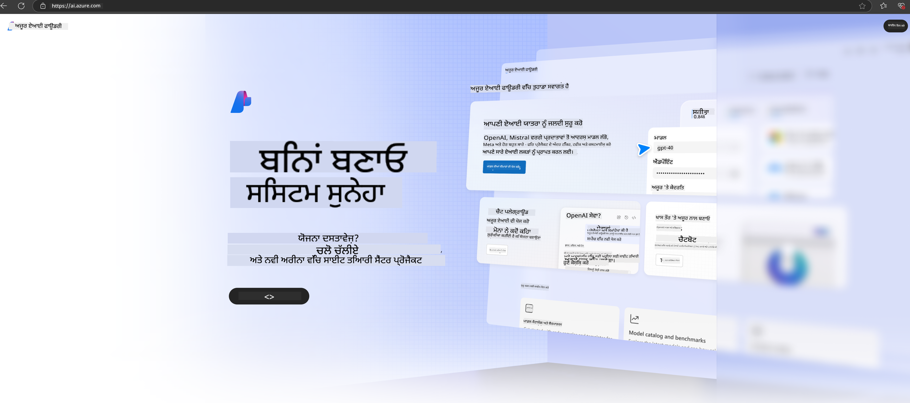

<!--
CO_OP_TRANSLATOR_METADATA:
{
  "original_hash": "3a1e48b628022485aac989c9f733e792",
  "translation_date": "2025-07-17T05:22:19+00:00",
  "source_file": "md/02.QuickStart/AzureAIFoundry_QuickStart.md",
  "language_code": "pa"
}
-->
# **Azure AI Foundry ਵਿੱਚ Phi-3 ਦੀ ਵਰਤੋਂ**

ਜਨਰੇਟਿਵ AI ਦੇ ਵਿਕਾਸ ਨਾਲ, ਅਸੀਂ ਉਮੀਦ ਕਰਦੇ ਹਾਂ ਕਿ ਵੱਖ-ਵੱਖ LLM ਅਤੇ SLM, ਐਂਟਰਪ੍ਰਾਈਜ਼ ਡੇਟਾ ਇੰਟੀਗ੍ਰੇਸ਼ਨ, ਫਾਈਨ-ਟਿਊਨਿੰਗ/RAG ਓਪਰੇਸ਼ਨਜ਼ ਅਤੇ LLM ਅਤੇ SLM ਦੇ ਇੰਟੀਗ੍ਰੇਸ਼ਨ ਤੋਂ ਬਾਅਦ ਵੱਖ-ਵੱਖ ਐਂਟਰਪ੍ਰਾਈਜ਼ ਕਾਰੋਬਾਰਾਂ ਦੀ ਮੁਲਾਂਕਣ ਨੂੰ ਇੱਕ ਸੰਗਠਿਤ ਪਲੇਟਫਾਰਮ 'ਤੇ ਸੰਭਾਲਿਆ ਜਾ ਸਕੇ, ਤਾਂ ਜੋ ਜਨਰੇਟਿਵ AI ਸਮਾਰਟ ਐਪਲੀਕੇਸ਼ਨਾਂ ਨੂੰ ਬਿਹਤਰ ਢੰਗ ਨਾਲ ਲਾਗੂ ਕੀਤਾ ਜਾ ਸਕੇ। [Azure AI Foundry](https://ai.azure.com) ਇੱਕ ਐਂਟਰਪ੍ਰਾਈਜ਼-ਸਤਰ ਦਾ ਜਨਰੇਟਿਵ AI ਐਪਲੀਕੇਸ਼ਨ ਪਲੇਟਫਾਰਮ ਹੈ।

Azure AI Foundry ਨਾਲ, ਤੁਸੀਂ ਵੱਡੇ ਭਾਸ਼ਾ ਮਾਡਲ (LLM) ਦੇ ਜਵਾਬਾਂ ਦੀ ਮੁਲਾਂਕਣ ਕਰ ਸਕਦੇ ਹੋ ਅਤੇ ਪ੍ਰੋਮਪਟ ਫਲੋ ਨਾਲ ਪ੍ਰੋਮਪਟ ਐਪਲੀਕੇਸ਼ਨ ਕੰਪੋਨੈਂਟਸ ਨੂੰ ਆਰਕੀਸਟ੍ਰੇਟ ਕਰਕੇ ਬਿਹਤਰ ਪ੍ਰਦਰਸ਼ਨ ਪ੍ਰਾਪਤ ਕਰ ਸਕਦੇ ਹੋ। ਇਹ ਪਲੇਟਫਾਰਮ ਪ੍ਰੂਫ ਆਫ ਕਾਂਸੈਪਟ ਨੂੰ ਪੂਰੇ ਉਤਪਾਦਨ ਵਿੱਚ ਬਦਲਣ ਲਈ ਸਕੇਲਬਿਲਟੀ ਸਹੂਲਤ ਦਿੰਦਾ ਹੈ। ਲੰਬੇ ਸਮੇਂ ਲਈ ਸਫਲਤਾ ਲਈ ਲਗਾਤਾਰ ਨਿਗਰਾਨੀ ਅਤੇ ਸੁਧਾਰ ਸਹਾਇਤਾ ਪ੍ਰਦਾਨ ਕਰਦਾ ਹੈ।

ਅਸੀਂ ਸਧਾਰਣ ਕਦਮਾਂ ਰਾਹੀਂ Azure AI Foundry 'ਤੇ ਤੇਜ਼ੀ ਨਾਲ Phi-3 ਮਾਡਲ ਨੂੰ ਡਿਪਲੋਇ ਕਰ ਸਕਦੇ ਹਾਂ, ਅਤੇ ਫਿਰ Azure AI Foundry ਦੀ ਵਰਤੋਂ ਕਰਕੇ Phi-3 ਨਾਲ ਸੰਬੰਧਿਤ Playground/ਚੈਟ, ਫਾਈਨ-ਟਿਊਨਿੰਗ, ਮੁਲਾਂਕਣ ਅਤੇ ਹੋਰ ਕੰਮ ਪੂਰੇ ਕਰ ਸਕਦੇ ਹਾਂ।

## **1. ਤਿਆਰੀ**

ਜੇ ਤੁਹਾਡੇ ਕੋਲ ਪਹਿਲਾਂ ਹੀ [Azure Developer CLI](https://learn.microsoft.com/azure/developer/azure-developer-cli/overview?WT.mc_id=aiml-138114-kinfeylo) ਤੁਹਾਡੇ ਮਸ਼ੀਨ 'ਤੇ ਇੰਸਟਾਲ ਹੈ, ਤਾਂ ਇਸ ਟੈਮਪਲੇਟ ਦੀ ਵਰਤੋਂ ਨਵੀਂ ਡਾਇਰੈਕਟਰੀ ਵਿੱਚ ਇਹ ਕਮਾਂਡ ਚਲਾਉਣ ਜਿੰਨੀ ਆਸਾਨ ਹੈ।

## ਮੈਨੂਅਲ ਬਣਾਉਣਾ

Microsoft Azure AI Foundry ਪ੍ਰੋਜੈਕਟ ਅਤੇ ਹੱਬ ਬਣਾਉਣਾ ਤੁਹਾਡੇ AI ਕੰਮ ਨੂੰ ਸੰਗਠਿਤ ਅਤੇ ਪ੍ਰਬੰਧਿਤ ਕਰਨ ਦਾ ਵਧੀਆ ਤਰੀਕਾ ਹੈ। ਇੱਥੇ ਇੱਕ ਕਦਮ-ਦਰ-ਕਦਮ ਗਾਈਡ ਹੈ ਜੋ ਤੁਹਾਨੂੰ ਸ਼ੁਰੂ ਕਰਨ ਵਿੱਚ ਮਦਦ ਕਰੇਗੀ:

### Azure AI Foundry ਵਿੱਚ ਪ੍ਰੋਜੈਕਟ ਬਣਾਉਣਾ

1. **Azure AI Foundry 'ਤੇ ਜਾਓ**: Azure AI Foundry ਪੋਰਟਲ ਵਿੱਚ ਸਾਈਨ ਇਨ ਕਰੋ।
2. **ਪ੍ਰੋਜੈਕਟ ਬਣਾਓ**:
   - ਜੇ ਤੁਸੀਂ ਕਿਸੇ ਪ੍ਰੋਜੈਕਟ ਵਿੱਚ ਹੋ, ਤਾਂ ਪੇਜ਼ ਦੇ ਉੱਪਰ ਖੱਬੇ ਕੋਨੇ 'ਤੇ "Azure AI Foundry" ਚੁਣੋ ਤਾਂ ਜੋ ਹੋਮ ਪੇਜ਼ 'ਤੇ ਜਾ ਸਕੋ।
   - "+ Create project" ਚੁਣੋ।
   - ਪ੍ਰੋਜੈਕਟ ਲਈ ਨਾਮ ਦਿਓ।
   - ਜੇ ਤੁਹਾਡੇ ਕੋਲ ਹੱਬ ਹੈ, ਤਾਂ ਉਹ ਡਿਫਾਲਟ ਤੌਰ 'ਤੇ ਚੁਣਿਆ ਜਾਵੇਗਾ। ਜੇ ਤੁਹਾਡੇ ਕੋਲ ਇੱਕ ਤੋਂ ਵੱਧ ਹੱਬਾਂ ਦੀ ਪਹੁੰਚ ਹੈ, ਤਾਂ ਤੁਸੀਂ ਡ੍ਰੌਪਡਾਊਨ ਵਿੱਚੋਂ ਵੱਖਰਾ ਹੱਬ ਚੁਣ ਸਕਦੇ ਹੋ। ਜੇ ਤੁਸੀਂ ਨਵਾਂ ਹੱਬ ਬਣਾਉਣਾ ਚਾਹੁੰਦੇ ਹੋ, ਤਾਂ "Create new hub" ਚੁਣੋ ਅਤੇ ਨਾਮ ਦਿਓ।
   - "Create" ਚੁਣੋ।

### Azure AI Foundry ਵਿੱਚ ਹੱਬ ਬਣਾਉਣਾ

1. **Azure AI Foundry 'ਤੇ ਜਾਓ**: ਆਪਣੇ Azure ਖਾਤੇ ਨਾਲ ਸਾਈਨ ਇਨ ਕਰੋ।
2. **ਹੱਬ ਬਣਾਓ**:
   - ਖੱਬੇ ਮੀਨੂ ਤੋਂ Management center ਚੁਣੋ।
   - "All resources" ਚੁਣੋ, ਫਿਰ "+ New project" ਦੇ ਨਾਲ ਡਾਊਨ ਐਰੋ 'ਤੇ ਕਲਿੱਕ ਕਰੋ ਅਤੇ "+ New hub" ਚੁਣੋ।
   - "Create a new hub" ਡਾਇਲਾਗ ਵਿੱਚ, ਆਪਣੇ ਹੱਬ ਲਈ ਨਾਮ ਦਿਓ (ਜਿਵੇਂ contoso-hub) ਅਤੇ ਹੋਰ ਖੇਤਰਾਂ ਨੂੰ ਜਰੂਰਤ ਮੁਤਾਬਕ ਬਦਲੋ।
   - "Next" ਚੁਣੋ, ਜਾਣਕਾਰੀ ਦੀ ਸਮੀਖਿਆ ਕਰੋ, ਅਤੇ ਫਿਰ "Create" ਚੁਣੋ।

ਵਧੇਰੇ ਵਿਸਥਾਰ ਲਈ, ਤੁਸੀਂ ਅਧਿਕਾਰਿਕ [Microsoft ਦਸਤਾਵੇਜ਼](https://learn.microsoft.com/azure/ai-studio/how-to/create-projects) ਨੂੰ ਵੇਖ ਸਕਦੇ ਹੋ।

ਸਫਲ ਬਣਾਉਣ ਤੋਂ ਬਾਅਦ, ਤੁਸੀਂ ਆਪਣੇ ਬਣਾਏ ਸਟੂਡੀਓ ਨੂੰ [ai.azure.com](https://ai.azure.com/) ਰਾਹੀਂ ਐਕਸੈਸ ਕਰ ਸਕਦੇ ਹੋ।

ਇੱਕ AI Foundry 'ਤੇ ਕਈ ਪ੍ਰੋਜੈਕਟ ਹੋ ਸਕਦੇ ਹਨ। ਤਿਆਰੀ ਲਈ AI Foundry ਵਿੱਚ ਪ੍ਰੋਜੈਕਟ ਬਣਾਓ।

Azure AI Foundry [QuickStarts](https://learn.microsoft.com/azure/ai-studio/quickstarts/get-started-code) ਬਣਾਓ।

## **2. Azure AI Foundry ਵਿੱਚ Phi ਮਾਡਲ ਡਿਪਲੋਇ ਕਰੋ**

ਪ੍ਰੋਜੈਕਟ ਦੇ Explore ਵਿਕਲਪ 'ਤੇ ਕਲਿੱਕ ਕਰੋ ਤਾਂ ਜੋ Model Catalog ਵਿੱਚ ਜਾ ਸਕੋ ਅਤੇ Phi-3 ਚੁਣੋ।

Phi-3-mini-4k-instruct ਚੁਣੋ।

Phi-3-mini-4k-instruct ਮਾਡਲ ਨੂੰ ਡਿਪਲੋਇ ਕਰਨ ਲਈ 'Deploy' 'ਤੇ ਕਲਿੱਕ ਕਰੋ।

> [!NOTE]
>
> ਡਿਪਲੋਇ ਕਰਨ ਸਮੇਂ ਤੁਸੀਂ ਕੰਪਿਊਟਿੰਗ ਪਾਵਰ ਚੁਣ ਸਕਦੇ ਹੋ।

## **3. Azure AI Foundry ਵਿੱਚ Playground Chat Phi**

ਡਿਪਲੋਇਮੈਂਟ ਪੇਜ਼ 'ਤੇ ਜਾਓ, Playground ਚੁਣੋ, ਅਤੇ Azure AI Foundry ਦੇ Phi-3 ਨਾਲ ਗੱਲਬਾਤ ਕਰੋ।

## **4. Azure AI Foundry ਤੋਂ ਮਾਡਲ ਡਿਪਲੋਇ ਕਰਨਾ**

Azure Model Catalog ਤੋਂ ਮਾਡਲ ਡਿਪਲੋਇ ਕਰਨ ਲਈ, ਤੁਸੀਂ ਇਹ ਕਦਮ ਫਾਲੋ ਕਰ ਸਕਦੇ ਹੋ:

- Azure AI Foundry ਵਿੱਚ ਸਾਈਨ ਇਨ ਕਰੋ।
- Azure AI Foundry ਮਾਡਲ ਕੈਟਾਲੌਗ ਵਿੱਚੋਂ ਆਪਣਾ ਮਾਡਲ ਚੁਣੋ।
- ਮਾਡਲ ਦੇ Details ਪੇਜ਼ 'ਤੇ Deploy ਚੁਣੋ ਅਤੇ ਫਿਰ Serverless API with Azure AI Content Safety ਚੁਣੋ।
- ਉਸ ਪ੍ਰੋਜੈਕਟ ਨੂੰ ਚੁਣੋ ਜਿਸ ਵਿੱਚ ਤੁਸੀਂ ਮਾਡਲ ਡਿਪਲੋਇ ਕਰਨਾ ਚਾਹੁੰਦੇ ਹੋ। Serverless API ਦੀ ਵਰਤੋਂ ਲਈ, ਤੁਹਾਡਾ ਵਰਕਸਪੇਸ East US 2 ਜਾਂ Sweden Central ਖੇਤਰ ਵਿੱਚ ਹੋਣਾ ਚਾਹੀਦਾ ਹੈ। ਤੁਸੀਂ Deployment ਦਾ ਨਾਮ ਕਸਟਮਾਈਜ਼ ਕਰ ਸਕਦੇ ਹੋ।
- ਡਿਪਲੋਇਮੈਂਟ ਵਿਜ਼ਾਰਡ 'ਤੇ, Pricing ਅਤੇ terms ਚੁਣੋ ਤਾਂ ਜੋ ਕੀਮਤ ਅਤੇ ਵਰਤੋਂ ਦੀਆਂ ਸ਼ਰਤਾਂ ਬਾਰੇ ਜਾਣਕਾਰੀ ਮਿਲੇ।
- Deploy ਚੁਣੋ। ਡਿਪਲੋਇਮੈਂਟ ਤਿਆਰ ਹੋਣ ਤੱਕ ਉਡੀਕ ਕਰੋ ਅਤੇ ਜਦੋਂ ਤੁਸੀਂ Deployments ਪੇਜ਼ 'ਤੇ ਰੀਡਾਇਰੈਕਟ ਹੋ ਜਾਓ।
- ਮਾਡਲ ਨਾਲ ਇੰਟਰਐਕਟ ਕਰਨ ਲਈ Open in playground ਚੁਣੋ।
- ਤੁਸੀਂ Deployments ਪੇਜ਼ 'ਤੇ ਵਾਪਸ ਜਾ ਸਕਦੇ ਹੋ, ਡਿਪਲੋਇਮੈਂਟ ਚੁਣੋ ਅਤੇ Endpoint ਦਾ Target URL ਅਤੇ Secret Key ਨੋਟ ਕਰ ਸਕਦੇ ਹੋ, ਜੋ ਤੁਸੀਂ ਡਿਪਲੋਇਮੈਂਟ ਨੂੰ ਕਾਲ ਕਰਨ ਅਤੇ ਕਮਪਲੀਸ਼ਨ ਬਣਾਉਣ ਲਈ ਵਰਤ ਸਕਦੇ ਹੋ।
- Endpoint ਦੇ ਵੇਰਵੇ, URL ਅਤੇ ਐਕਸੈਸ ਕੀਜ਼ Build ਟੈਬ ਵਿੱਚ Components ਸੈਕਸ਼ਨ ਤੋਂ Deployments ਚੁਣ ਕੇ ਹਮੇਸ਼ਾ ਲੱਭੇ ਜਾ ਸਕਦੇ ਹਨ।

> [!NOTE]
> ਕਿਰਪਾ ਕਰਕੇ ਧਿਆਨ ਦਿਓ ਕਿ ਇਹ ਕਦਮ ਕਰਨ ਲਈ ਤੁਹਾਡੇ ਖਾਤੇ ਕੋਲ Resource Group 'ਤੇ Azure AI Developer ਰੋਲ ਦੀਆਂ ਅਧਿਕਾਰ ਹੋਣੇ ਜ਼ਰੂਰੀ ਹਨ।

## **5. Azure AI Foundry ਵਿੱਚ Phi API ਦੀ ਵਰਤੋਂ**

ਤੁਸੀਂ https://{Your project name}.region.inference.ml.azure.com/swagger.json ਨੂੰ Postman GET ਰਾਹੀਂ ਐਕਸੈਸ ਕਰ ਸਕਦੇ ਹੋ ਅਤੇ Key ਨਾਲ ਮਿਲਾ ਕੇ ਦਿੱਤੇ ਗਏ ਇੰਟਰਫੇਸ ਬਾਰੇ ਜਾਣ ਸਕਦੇ ਹੋ।

ਤੁਸੀਂ ਬਹੁਤ ਆਸਾਨੀ ਨਾਲ ਰਿਕਵੇਸਟ ਪੈਰਾਮੀਟਰ ਅਤੇ ਜਵਾਬ ਪੈਰਾਮੀਟਰ ਪ੍ਰਾਪਤ ਕਰ ਸਕਦੇ ਹੋ।

**ਅਸਵੀਕਾਰੋਪੱਤਰ**:  
ਇਹ ਦਸਤਾਵੇਜ਼ AI ਅਨੁਵਾਦ ਸੇਵਾ [Co-op Translator](https://github.com/Azure/co-op-translator) ਦੀ ਵਰਤੋਂ ਕਰਕੇ ਅਨੁਵਾਦਿਤ ਕੀਤਾ ਗਿਆ ਹੈ। ਜਦੋਂ ਕਿ ਅਸੀਂ ਸਹੀਤਾ ਲਈ ਕੋਸ਼ਿਸ਼ ਕਰਦੇ ਹਾਂ, ਕਿਰਪਾ ਕਰਕੇ ਧਿਆਨ ਰੱਖੋ ਕਿ ਸਵੈਚਾਲਿਤ ਅਨੁਵਾਦਾਂ ਵਿੱਚ ਗਲਤੀਆਂ ਜਾਂ ਅਸਮਰਥਤਾਵਾਂ ਹੋ ਸਕਦੀਆਂ ਹਨ। ਮੂਲ ਦਸਤਾਵੇਜ਼ ਆਪਣੀ ਮੂਲ ਭਾਸ਼ਾ ਵਿੱਚ ਪ੍ਰਮਾਣਿਕ ਸਰੋਤ ਮੰਨਿਆ ਜਾਣਾ ਚਾਹੀਦਾ ਹੈ। ਮਹੱਤਵਪੂਰਨ ਜਾਣਕਾਰੀ ਲਈ, ਪੇਸ਼ੇਵਰ ਮਨੁੱਖੀ ਅਨੁਵਾਦ ਦੀ ਸਿਫਾਰਸ਼ ਕੀਤੀ ਜਾਂਦੀ ਹੈ। ਇਸ ਅਨੁਵਾਦ ਦੀ ਵਰਤੋਂ ਤੋਂ ਉਤਪੰਨ ਕਿਸੇ ਵੀ ਗਲਤਫਹਿਮੀ ਜਾਂ ਗਲਤ ਵਿਆਖਿਆ ਲਈ ਅਸੀਂ ਜ਼ਿੰਮੇਵਾਰ ਨਹੀਂ ਹਾਂ।