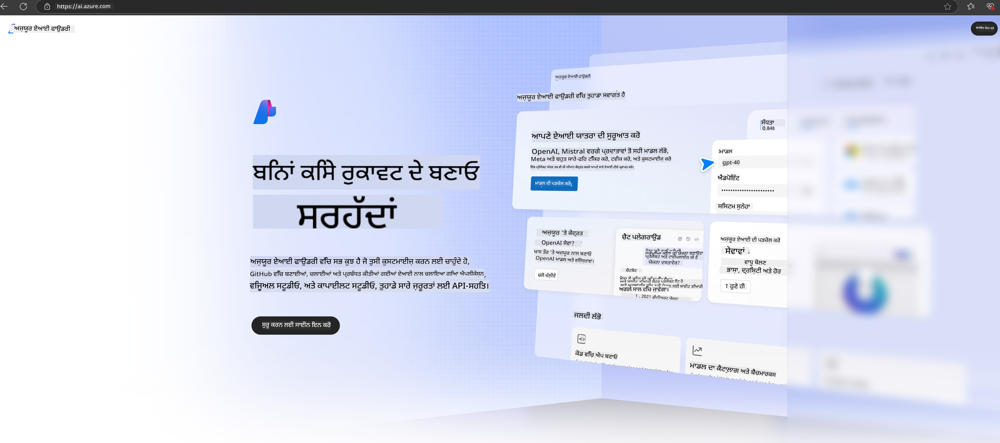

<!--
CO_OP_TRANSLATOR_METADATA:
{
  "original_hash": "3a1e48b628022485aac989c9f733e792",
  "translation_date": "2025-05-09T20:10:26+00:00",
  "source_file": "md/02.QuickStart/AzureAIFoundry_QuickStart.md",
  "language_code": "pa"
}
-->
# **Azure AI Foundry ਵਿੱਚ Phi-3 ਦੀ ਵਰਤੋਂ**

ਜਨਰੇਟਿਵ AI ਦੇ ਵਿਕਾਸ ਨਾਲ, ਅਸੀਂ ਇੱਕ ਏਕਜੁਟ ਪਲੇਟਫਾਰਮ ਦੀ ਉਮੀਦ ਕਰਦੇ ਹਾਂ ਜੋ ਵੱਖ-ਵੱਖ LLM ਅਤੇ SLM, ਉਦਯੋਗ ਡੇਟਾ ਇੰਟੀਗ੍ਰੇਸ਼ਨ, ਫਾਈਨ-ਟਿਊਨਿੰਗ/RAG ਓਪਰੇਸ਼ਨਜ਼, ਅਤੇ LLM ਅਤੇ SLM ਦੇ ਇੰਟੀਗ੍ਰੇਸ਼ਨ ਤੋਂ ਬਾਅਦ ਵੱਖ-ਵੱਖ ਉਦਯੋਗਿਕ ਕਾਰੋਬਾਰਾਂ ਦੀ ਮੁਲਾਂਕਣ ਕਰ ਸਕੇ, ਤਾਂ ਜੋ ਜਨਰੇਟਿਵ AI ਸਿਆਣੇ ਐਪਲੀਕੇਸ਼ਨਾਂ ਨੂੰ ਬਿਹਤਰ ਤਰੀਕੇ ਨਾਲ ਲਾਗੂ ਕੀਤਾ ਜਾ ਸਕੇ। [Azure AI Foundry](https://ai.azure.com) ਇੱਕ ਉਦਯੋਗ-ਪੱਧਰੀ ਜਨਰੇਟਿਵ AI ਐਪਲੀਕੇਸ਼ਨ ਪਲੇਟਫਾਰਮ ਹੈ।

Azure AI Foundry ਨਾਲ, ਤੁਸੀਂ ਵੱਡੇ ਭਾਸ਼ਾ ਮਾਡਲ (LLM) ਦੇ ਜਵਾਬਾਂ ਦੀ ਮੁਲਾਂਕਣ ਕਰ ਸਕਦੇ ਹੋ ਅਤੇ ਬਿਹਤਰ ਪ੍ਰਦਰਸ਼ਨ ਲਈ prompt flow ਨਾਲ ਪ੍ਰੰਪਟ ਐਪਲੀਕੇਸ਼ਨ ਕੰਪੋਨੈਂਟਾਂ ਨੂੰ ਆਯੋਜਿਤ ਕਰ ਸਕਦੇ ਹੋ। ਇਹ ਪਲੇਟਫਾਰਮ ਸਬੂਤ-ਆਧਾਰਿਤ ਨਮੂਨਿਆਂ ਨੂੰ ਪੂਰੇ ਉਤਪਾਦਨ ਵਿੱਚ ਬਦਲਣ ਲਈ ਸਕੇਲਬਿਲਿਟੀ ਨੂੰ ਸਹੂਲਤ ਦਿੰਦਾ ਹੈ। ਲੰਬੇ ਸਮੇਂ ਦੀ ਸਫਲਤਾ ਲਈ ਲਗਾਤਾਰ ਨਿਗਰਾਨੀ ਅਤੇ ਸੁਧਾਰ ਸਮਰਥਿਤ ਹੁੰਦਾ ਹੈ।

ਅਸੀਂ ਸਧਾਰਣ ਕਦਮਾਂ ਰਾਹੀਂ Azure AI Foundry ‘ਤੇ Phi-3 ਮਾਡਲ ਨੂੰ ਤੇਜ਼ੀ ਨਾਲ ਤੈਨਾਤ ਕਰ ਸਕਦੇ ਹਾਂ, ਅਤੇ ਫਿਰ Azure AI Foundry ਦੀ ਵਰਤੋਂ ਕਰਕੇ Phi-3 ਸੰਬੰਧੀ Playground/ਚੈਟ, ਫਾਈਨ-ਟਿਊਨਿੰਗ, ਮੁਲਾਂਕਣ ਅਤੇ ਹੋਰ ਸੰਬੰਧਿਤ ਕੰਮ ਕਰ ਸਕਦੇ ਹਾਂ।

## **1. ਤਿਆਰੀ**

ਜੇ ਤੁਹਾਡੇ ਕੋਲ ਪਹਿਲਾਂ ਹੀ [Azure Developer CLI](https://learn.microsoft.com/azure/developer/azure-developer-cli/overview?WT.mc_id=aiml-138114-kinfeylo) ਇੰਸਟਾਲ ਹੈ, ਤਾਂ ਇਸ ਟੈਂਪਲੇਟ ਦੀ ਵਰਤੋਂ ਨਵੀਂ ਡਾਇਰੈਕਟਰੀ ਵਿੱਚ ਇਹ ਕਮਾਂਡ ਚਲਾਉਣ ਜਿੰਨੀ ਸੌਖੀ ਹੈ।

## ਮੈਨੁਅਲ ਬਣਾਉਣਾ

Microsoft Azure AI Foundry ਪ੍ਰੋਜੈਕਟ ਅਤੇ ਹੱਬ ਬਣਾਉਣਾ ਤੁਹਾਡੇ AI ਕੰਮ ਨੂੰ ਠੀਕ ਢੰਗ ਨਾਲ ਸੰਗਠਿਤ ਅਤੇ ਪ੍ਰਬੰਧਿਤ ਕਰਨ ਦਾ ਵਧੀਆ ਤਰੀਕਾ ਹੈ। ਸ਼ੁਰੂ ਕਰਨ ਲਈ ਇਹ ਕਦਮ-ਬਾਈ-ਕਦਮ ਗਾਈਡ ਹੈ:

### Azure AI Foundry ਵਿੱਚ ਪ੍ਰੋਜੈਕਟ ਬਣਾਉਣਾ

1. **Azure AI Foundry ‘ਤੇ ਜਾਓ**: Azure AI Foundry ਪੋਰਟਲ ਵਿੱਚ ਸਾਈਨ ਇਨ ਕਰੋ।
2. **ਪ੍ਰੋਜੈਕਟ ਬਣਾਓ**:
   - ਜੇ ਤੁਸੀਂ ਕਿਸੇ ਪ੍ਰੋਜੈਕਟ ਵਿੱਚ ਹੋ, ਤਾਂ ਪੇਜ਼ ਦੇ ਉੱਪਰ ਖੱਬੇ ਕੋਨੇ ‘ਤੇ "Azure AI Foundry" ਚੁਣੋ ਤਾਂ ਜੋ ਹੋਮ ਪੇਜ਼ ‘ਤੇ ਜਾ ਸਕੋ।
   - "+ Create project" ਚੁਣੋ।
   - ਪ੍ਰੋਜੈਕਟ ਲਈ ਇੱਕ ਨਾਮ ਦਿਓ।
   - ਜੇ ਤੁਹਾਡੇ ਕੋਲ ਕੋਈ ਹੱਬ ਹੈ, ਤਾਂ ਉਹ ਡਿਫਾਲਟ ਰੂਪ ਵਿੱਚ ਚੁਣਿਆ ਜਾਵੇਗਾ। ਜੇ ਤੁਹਾਨੂੰ ਕਈ ਹੱਬਾਂ ਦੀ ਪਹੁੰਚ ਹੈ, ਤਾਂ ਤੁਸੀਂ ਡ੍ਰੌਪਡਾਊਨ ਵਿੱਚੋਂ ਵੱਖਰਾ ਹੱਬ ਚੁਣ ਸਕਦੇ ਹੋ। ਜੇ ਤੁਸੀਂ ਨਵਾਂ ਹੱਬ ਬਣਾਉਣਾ ਚਾਹੁੰਦੇ ਹੋ, ਤਾਂ "Create new hub" ਚੁਣੋ ਅਤੇ ਇੱਕ ਨਾਮ ਦਿਓ।
   - "Create" ਚੁਣੋ।

### Azure AI Foundry ਵਿੱਚ ਹੱਬ ਬਣਾਉਣਾ

1. **Azure AI Foundry ‘ਤੇ ਜਾਓ**: ਆਪਣੇ Azure ਖਾਤੇ ਨਾਲ ਸਾਈਨ ਇਨ ਕਰੋ।
2. **ਹੱਬ ਬਣਾਓ**:
   - ਖੱਬੇ ਮੇਨੂ ਤੋਂ Management center ਚੁਣੋ।
   - "All resources" ਚੁਣੋ, ਫਿਰ "+ New project" ਦੇ ਨਾਲ ਡਾਊਨ ਐਰੋ ‘ਤੇ ਕਲਿੱਕ ਕਰੋ ਅਤੇ "+ New hub" ਚੁਣੋ।
   - "Create a new hub" ਡਾਇਲਾਗ ਵਿੱਚ, ਆਪਣੇ ਹੱਬ ਲਈ ਇੱਕ ਨਾਮ ਦਿਓ (ਜਿਵੇਂ ਕਿ contoso-hub) ਅਤੇ ਹੋਰ ਫੀਲਡਾਂ ਨੂੰ ਜਿਵੇਂ ਚਾਹੁੰਦੇ ਹੋ ਸੋਧੋ।
   - "Next" ਚੁਣੋ, ਜਾਣਕਾਰੀ ਦੀ ਸਮੀਖਿਆ ਕਰੋ, ਅਤੇ ਫਿਰ "Create" ਤੇ ਕਲਿੱਕ ਕਰੋ।

ਵਧੇਰੇ ਵਿਸਥਾਰ ਵਾਲੀਆਂ ਹਦਾਇਤਾਂ ਲਈ, ਤੁਸੀਂ ਅਧਿਕਾਰਕ [Microsoft ਦਸਤਾਵੇਜ਼](https://learn.microsoft.com/azure/ai-studio/how-to/create-projects) ਵੇਖ ਸਕਦੇ ਹੋ।

ਸਫਲਤਾਪੂਰਵਕ ਬਣਾਉਣ ਤੋਂ ਬਾਅਦ, ਤੁਸੀਂ ਆਪਣੇ ਬਣਾਏ ਹੋਏ ਸਟੂਡੀਓ ਨੂੰ [ai.azure.com](https://ai.azure.com/) ਰਾਹੀਂ ਐਕਸੈੱਸ ਕਰ ਸਕਦੇ ਹੋ।

ਇੱਕ AI Foundry ‘ਤੇ ਕਈ ਪ੍ਰੋਜੈਕਟ ਹੋ ਸਕਦੇ ਹਨ। AI Foundry ਵਿੱਚ ਪ੍ਰੋਜੈਕਟ ਬਣਾਉਣ ਨਾਲ ਤਿਆਰੀ ਕਰੋ।

Azure AI Foundry [QuickStarts](https://learn.microsoft.com/azure/ai-studio/quickstarts/get-started-code) ਬਣਾਓ।

## **2. Azure AI Foundry ਵਿੱਚ Phi ਮਾਡਲ ਤੈਨਾਤ ਕਰੋ**

ਪ੍ਰੋਜੈਕਟ ਦੇ Explore ਵਿਕਲਪ ‘ਤੇ ਕਲਿੱਕ ਕਰੋ ਤਾਂ ਜੋ Model Catalog ਵਿੱਚ ਜਾ ਕੇ Phi-3 ਚੁਣ ਸਕੋ।

Phi-3-mini-4k-instruct ਚੁਣੋ।

Phi-3-mini-4k-instruct ਮਾਡਲ ਨੂੰ ਤੈਨਾਤ ਕਰਨ ਲਈ 'Deploy' ‘ਤੇ ਕਲਿੱਕ ਕਰੋ।

> [!NOTE]
>
> ਤੈਨਾਤ ਸਮੇਂ ਤੁਸੀਂ ਕੰਪਿਊਟਿੰਗ ਪਾਵਰ ਚੁਣ ਸਕਦੇ ਹੋ।

## **3. Azure AI Foundry ਵਿੱਚ Playground Chat Phi**

ਤੈਨਾਤ ਪੇਜ਼ ‘ਤੇ ਜਾਓ, Playground ਚੁਣੋ, ਅਤੇ Azure AI Foundry ਦੇ Phi-3 ਨਾਲ ਗੱਲਬਾਤ ਕਰੋ।

## **4. Azure AI Foundry ਤੋਂ ਮਾਡਲ ਤੈਨਾਤ ਕਰਨਾ**

Azure Model Catalog ਤੋਂ ਮਾਡਲ ਤੈਨਾਤ ਕਰਨ ਲਈ, ਤੁਸੀਂ ਇਹ ਕਦਮ ਫੋਲੋ ਕਰ ਸਕਦੇ ਹੋ:

- Azure AI Foundry ਵਿੱਚ ਸਾਈਨ ਇਨ ਕਰੋ।
- Azure AI Foundry ਮਾਡਲ ਕੈਟਾਲੌਗ ਵਿੱਚੋਂ ਆਪਣਾ ਤੈਨਾਤ ਕਰਨ ਵਾਲਾ ਮਾਡਲ ਚੁਣੋ।
- ਮਾਡਲ ਦੇ Details ਪੇਜ਼ ‘ਤੇ Deploy ਚੁਣੋ ਅਤੇ ਫਿਰ Serverless API with Azure AI Content Safety ਚੁਣੋ।
- ਉਸ ਪ੍ਰੋਜੈਕਟ ਨੂੰ ਚੁਣੋ ਜਿਸ ਵਿੱਚ ਤੁਸੀਂ ਆਪਣੇ ਮਾਡਲ ਤੈਨਾਤ ਕਰਨਾ ਚਾਹੁੰਦੇ ਹੋ। Serverless API ਦੀ ਵਰਤੋਂ ਕਰਨ ਲਈ, ਤੁਹਾਡੇ ਵਰਕਸਪੇਸ ਨੂੰ East US 2 ਜਾਂ Sweden Central ਖੇਤਰ ਵਿੱਚ ਹੋਣਾ ਜਰੂਰੀ ਹੈ। ਤੁਸੀਂ Deployment ਦਾ ਨਾਮ ਕਸਟਮਾਈਜ਼ ਕਰ ਸਕਦੇ ਹੋ।
- ਤੈਨਾਤ ਵਿਜ਼ਾਰਡ ‘ਤੇ, Pricing ਅਤੇ terms ਨੂੰ ਵੇਖੋ ਤਾਂ ਜੋ ਕੀਮਤ ਅਤੇ ਵਰਤੋਂ ਦੀਆਂ ਸ਼ਰਤਾਂ ਬਾਰੇ ਜਾਣਕਾਰੀ ਮਿਲੇ।
- Deploy ਚੁਣੋ। ਤੈਨਾਤ ਤਿਆਰ ਹੋਣ ਤੱਕ ਉਡੀਕ ਕਰੋ ਅਤੇ ਜਦੋਂ ਤੁਸੀਂ Deployments ਪੇਜ਼ ‘ਤੇ ਰੀਡਾਇਰੈਕਟ ਹੋ ਜਾਓ।
- Open in playground ਚੁਣੋ ਤਾਂ ਜੋ ਮਾਡਲ ਨਾਲ ਇੰਟਰਐਕਸ਼ਨ ਸ਼ੁਰੂ ਕਰ ਸਕੋ।
- ਤੁਸੀਂ Deployments ਪੇਜ਼ ‘ਤੇ ਵਾਪਸ ਜਾ ਸਕਦੇ ਹੋ, ਤੈਨਾਤ ਚੁਣ ਸਕਦੇ ਹੋ, ਅਤੇ Endpoint ਦਾ Target URL ਅਤੇ Secret Key ਨੋਟ ਕਰ ਸਕਦੇ ਹੋ, ਜੋ ਤੁਸੀਂ ਕਾਲ ਕਰਨ ਅਤੇ ਕਮਪਲੀਸ਼ਨ ਬਣਾਉਣ ਲਈ ਵਰਤ ਸਕਦੇ ਹੋ।
- Endpoint ਦੇ ਵੇਰਵੇ, URL, ਅਤੇ ਐਕਸੈੱਸ ਕੀਜ਼ Build ਟੈਬ ਵਿੱਚ Components ਸੈਕਸ਼ਨ ਤੋਂ Deployments ਚੁਣ ਕੇ ਹਮੇਸ਼ਾ ਲੱਭ ਸਕਦੇ ਹੋ।

> [!NOTE]
> ਕਿਰਪਾ ਕਰਕੇ ਧਿਆਨ ਦਿਓ ਕਿ ਇਹ ਕਦਮ ਕਰਨ ਲਈ ਤੁਹਾਡੇ ਖਾਤੇ ਕੋਲ Resource Group ‘ਤੇ Azure AI Developer ਰੋਲ ਦੀ ਪਰਮਿਸ਼ਨ ਹੋਣੀ ਚਾਹੀਦੀ ਹੈ।

## **5. Azure AI Foundry ਵਿੱਚ Phi API ਦੀ ਵਰਤੋਂ**

ਤੁਸੀਂ https://{Your project name}.region.inference.ml.azure.com/swagger.json ਨੂੰ Postman GET ਰਾਹੀਂ ਐਕਸੈੱਸ ਕਰ ਸਕਦੇ ਹੋ ਅਤੇ Key ਨਾਲ ਜੋੜ ਕੇ ਪ੍ਰਦਾਨ ਕੀਤੇ ਗਏ ਇੰਟਰਫੇਸ ਬਾਰੇ ਜਾਣਕਾਰੀ ਪ੍ਰਾਪਤ ਕਰ ਸਕਦੇ ਹੋ।

ਤੁਹਾਨੂੰ ਬਹੁਤ ਆਸਾਨੀ ਨਾਲ ਰਿਕਵੇਸਟ ਪੈਰਾਮੀਟਰ ਅਤੇ ਜਵਾਬ ਦੇ ਪੈਰਾਮੀਟਰ ਮਿਲ ਜਾਣਗੇ।

**ਇਲਾਨ**:  
ਇਹ ਦਸਤਾਵੇਜ਼ AI ਅਨੁਵਾਦ ਸੇਵਾ [Co-op Translator](https://github.com/Azure/co-op-translator) ਦੀ ਵਰਤੋਂ ਕਰਕੇ ਅਨੁਵਾਦਿਤ ਕੀਤਾ ਗਿਆ ਹੈ। ਜਦੋਂ ਕਿ ਅਸੀਂ ਸਹੀਤਾ ਲਈ ਕੋਸ਼ਿਸ਼ ਕਰਦੇ ਹਾਂ, ਕਿਰਪਾ ਕਰਕੇ ਧਿਆਨ ਰੱਖੋ ਕਿ ਆਟੋਮੈਟਿਕ ਅਨੁਵਾਦਾਂ ਵਿੱਚ ਗਲਤੀਆਂ ਜਾਂ ਅਸਥਿਰਤਾਵਾਂ ਹੋ ਸਕਦੀਆਂ ਹਨ। ਮੂਲ ਦਸਤਾਵੇਜ਼ ਆਪਣੀ ਮੂਲ ਭਾਸ਼ਾ ਵਿੱਚ ਹੀ ਅਧਿਕਾਰਤ ਸਰੋਤ ਮੰਨਿਆ ਜਾਣਾ ਚਾਹੀਦਾ ਹੈ। ਮਹੱਤਵਪੂਰਨ ਜਾਣਕਾਰੀ ਲਈ, ਪੇਸ਼ੇਵਰ ਮਨੁੱਖੀ ਅਨੁਵਾਦ ਦੀ ਸਿਫਾਰਸ਼ ਕੀਤੀ ਜਾਂਦੀ ਹੈ। ਅਸੀਂ ਇਸ ਅਨੁਵਾਦ ਦੀ ਵਰਤੋਂ ਤੋਂ ਪੈਦਾ ਹੋਣ ਵਾਲੀਆਂ ਕਿਸੇ ਵੀ ਗਲਤਫਹਿਮੀਆਂ ਜਾਂ ਗਲਤ ਵਿਆਖਿਆਵਾਂ ਲਈ ਜ਼ਿੰਮੇਵਾਰ ਨਹੀਂ ਹਾਂ।