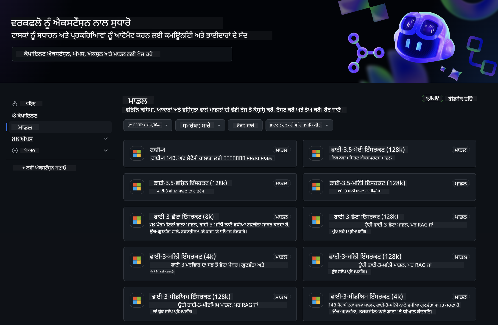
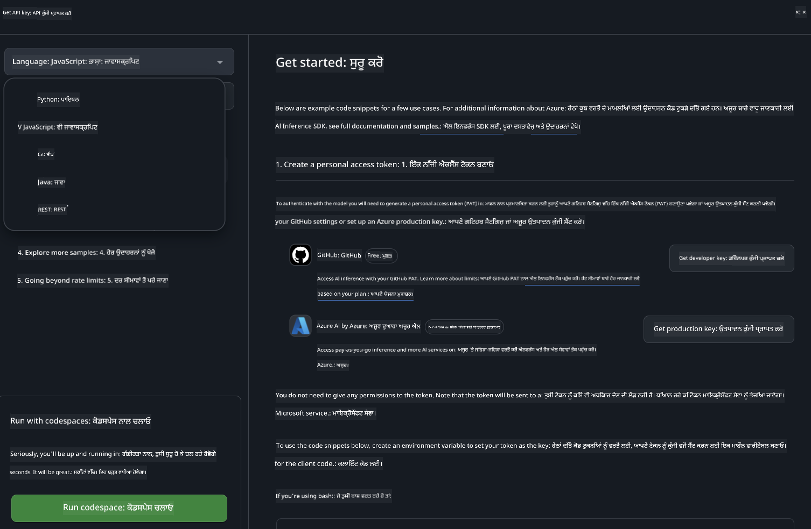
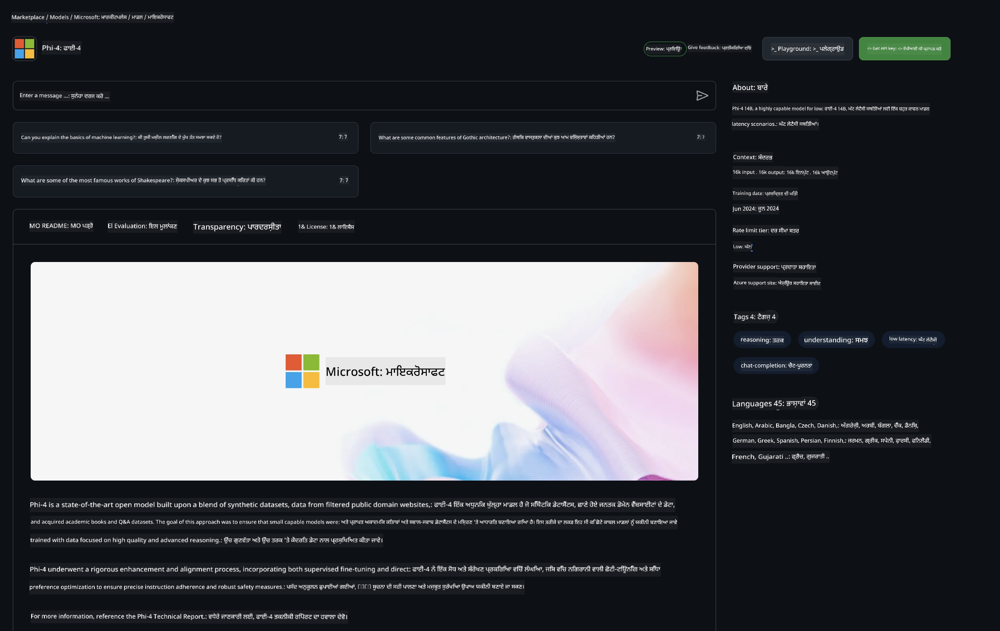

<!--
CO_OP_TRANSLATOR_METADATA:
{
  "original_hash": "5113634b77370af6790f9697d5d7de90",
  "translation_date": "2025-05-09T20:16:38+00:00",
  "source_file": "md/02.QuickStart/GitHubModel_QuickStart.md",
  "language_code": "pa"
}
-->
## GitHub Models - محدود پبلک بیٹا

[GitHub Models](https://github.com/marketplace/models) وچ تُہاڈا استقبال اے! اسی Azure AI تے ہوسٹ کیتے گئے AI ماڈلز نوں دریافت کرن لئی سب کچھ تیار کر چکے آں۔



GitHub Models تے دستیاب ماڈلز بارے ہور معلومات لئی، [GitHub Model Marketplace](https://github.com/marketplace/models) ویکھو۔

## دستیاب ماڈلز

ہر ماڈل لئی خاص playground تے نمونہ کوڈ موجود اے۔


### GitHub Model Catalog وچ Phi-3 ماڈلز

[Phi-3-Medium-128k-Instruct](https://github.com/marketplace/models/azureml/Phi-3-medium-128k-instruct)

[Phi-3-medium-4k-instruct](https://github.com/marketplace/models/azureml/Phi-3-medium-4k-instruct)

[Phi-3-mini-128k-instruct](https://github.com/marketplace/models/azureml/Phi-3-mini-128k-instruct)

[Phi-3-mini-4k-instruct](https://github.com/marketplace/models/azureml/Phi-3-mini-4k-instruct)

[Phi-3-small-128k-instruct](https://github.com/marketplace/models/azureml/Phi-3-small-128k-instruct)

[Phi-3-small-8k-instruct](https://github.com/marketplace/models/azureml/Phi-3-small-8k-instruct)

## شروعات

کجھ بنیادی مثالاں تیار نیں جیہڑیاں تُسی فوراً چلا سکدے او۔ ایہہ samples ڈائریکٹری وچ مل جان گیاں۔ جے تُہاڈا پسندیدہ زبان سیدھا چلانا اے، تاں تُسی ایہہ مثالاں مندرجہ ذیل زبانواں وچ لبھ سکدے او:

- Python
- JavaScript
- cURL

نمونیاں تے ماڈلز چلاؤن لئی خاص Codespaces ماحول وی دستیاب اے۔



## نمونہ کوڈ

ہِتھ تھوڑے جیہے کوڈ سنیپٹس نیں مختلف استعمالات لئی۔ Azure AI Inference SDK بارے ہور تفصیل تے نمونے دیکھن لئی مکمل دستاویزات ویکھو۔

## سیٹ اپ

1. ذاتی رسائی ٹوکن بناؤ  
ٹوکن نوں کسی اجازت دی لوڑ نہیں۔ دھیان رکھو کہ ایہہ ٹوکن Microsoft سروس ول بھیجیا جائے گا۔

ہِتھ والے کوڈ سنیپٹس استعمال کرن لئی، اپنا ٹوکن کلائنٹ کوڈ لئی کلید ورگی ماحول متغیر وچ سیٹ کرو۔

جے تُسی bash استعمال کر رہے او:  
```
export GITHUB_TOKEN="<your-github-token-goes-here>"
```  
جے تُسی powershell وچ او:  

```
$Env:GITHUB_TOKEN="<your-github-token-goes-here>"
```  

جے تُسی Windows کمانڈ پرامپٹ وچ او:  

```
set GITHUB_TOKEN=<your-github-token-goes-here>
```  

## Python نمونہ

### انحصار انسٹال کرو  
Azure AI Inference SDK pip نال انسٹال کرو (ضرورت: Python >=3.8):  

```
pip install azure-ai-inference
```  

### ایک بنیادی کوڈ نمونہ چلاؤ

ایہہ نمونہ chat completion API نوں بنیادی کال دکھاندا اے۔ ایہہ GitHub AI ماڈل انفرنس اینڈپوائنٹ تے تُہاڈا GitHub ٹوکن استعمال کر رہا اے۔ کال synchronous اے۔  

```
import os
from azure.ai.inference import ChatCompletionsClient
from azure.ai.inference.models import SystemMessage, UserMessage
from azure.core.credentials import AzureKeyCredential

endpoint = "https://models.inference.ai.azure.com"
# Replace Model_Name 
model_name = "Phi-3-small-8k-instruct"
token = os.environ["GITHUB_TOKEN"]

client = ChatCompletionsClient(
    endpoint=endpoint,
    credential=AzureKeyCredential(token),
)

response = client.complete(
    messages=[
        SystemMessage(content="You are a helpful assistant."),
        UserMessage(content="What is the capital of France?"),
    ],
    model=model_name,
    temperature=1.,
    max_tokens=1000,
    top_p=1.
)

print(response.choices[0].message.content)
```  

### ملٹی ٹرن گَل بات چلاؤ

ایہہ نمونہ chat completion API نال ملٹی ٹرن گَل بات دکھاندا اے۔ جدو تُسی ماڈل نوں چیٹ ایپ وچ استعمال کر رہے او، تاں تُہاڈے کول اوہ گَل بات دی ہسٹری ہونی چاہیدی اے تے تازہ ترین پیغامات ماڈل ول بھیجنے پین گے۔  

```
import os
from azure.ai.inference import ChatCompletionsClient
from azure.ai.inference.models import AssistantMessage, SystemMessage, UserMessage
from azure.core.credentials import AzureKeyCredential

token = os.environ["GITHUB_TOKEN"]
endpoint = "https://models.inference.ai.azure.com"
# Replace Model_Name
model_name = "Phi-3-small-8k-instruct"

client = ChatCompletionsClient(
    endpoint=endpoint,
    credential=AzureKeyCredential(token),
)

messages = [
    SystemMessage(content="You are a helpful assistant."),
    UserMessage(content="What is the capital of France?"),
    AssistantMessage(content="The capital of France is Paris."),
    UserMessage(content="What about Spain?"),
]

response = client.complete(messages=messages, model=model_name)

print(response.choices[0].message.content)
```  

### آؤٹ پٹ نوں سٹریم کرو

بہتر یوزر تجربے لئی، تُسی ماڈل دی ریپانس نوں سٹریم کرنا چاہو گے تاکہ پہلا ٹوکن جلدی ویکھائی دے تے تُسی لمبی ریپانس دا انتظار نہ کرو۔  

```
import os
from azure.ai.inference import ChatCompletionsClient
from azure.ai.inference.models import SystemMessage, UserMessage
from azure.core.credentials import AzureKeyCredential

token = os.environ["GITHUB_TOKEN"]
endpoint = "https://models.inference.ai.azure.com"
# Replace Model_Name
model_name = "Phi-3-small-8k-instruct"

client = ChatCompletionsClient(
    endpoint=endpoint,
    credential=AzureKeyCredential(token),
)

response = client.complete(
    stream=True,
    messages=[
        SystemMessage(content="You are a helpful assistant."),
        UserMessage(content="Give me 5 good reasons why I should exercise every day."),
    ],
    model=model_name,
)

for update in response:
    if update.choices:
        print(update.choices[0].delta.content or "", end="")

client.close()
```  

## JavaScript

### انحصار انسٹال کرو

Node.js انسٹال کرو۔

مندرجہ ذیل لائنز نوں کاپی کر کے اپنے فولڈر وچ package.json فائل وچ محفوظ کرو۔  

```
{
  "type": "module",
  "dependencies": {
    "@azure-rest/ai-inference": "latest",
    "@azure/core-auth": "latest",
    "@azure/core-sse": "latest"
  }
}
```  

نوٹ: @azure/core-sse صرف اوہدوں چاہیدا جدو تُسی چیٹ کمپلیشنز دی ریپانس سٹریم کر رہے او۔  

اس فولڈر وچ ٹرمینل کھولو تے npm install چلاؤ۔  

ہر کوڈ سنیپٹ نوں sample.js وچ کاپی کرو تے node sample.js نال چلاؤ۔  

### ایک بنیادی کوڈ نمونہ چلاؤ

ایہہ نمونہ chat completion API نوں بنیادی کال دکھاندا اے۔ ایہہ GitHub AI ماڈل انفرنس اینڈپوائنٹ تے تُہاڈا GitHub ٹوکن استعمال کر رہا اے۔ کال synchronous اے۔  

```
import ModelClient from "@azure-rest/ai-inference";
import { AzureKeyCredential } from "@azure/core-auth";

const token = process.env["GITHUB_TOKEN"];
const endpoint = "https://models.inference.ai.azure.com";
// Update your modelname
const modelName = "Phi-3-small-8k-instruct";

export async function main() {

  const client = new ModelClient(endpoint, new AzureKeyCredential(token));

  const response = await client.path("/chat/completions").post({
    body: {
      messages: [
        { role:"system", content: "You are a helpful assistant." },
        { role:"user", content: "What is the capital of France?" }
      ],
      model: modelName,
      temperature: 1.,
      max_tokens: 1000,
      top_p: 1.
    }
  });

  if (response.status !== "200") {
    throw response.body.error;
  }
  console.log(response.body.choices[0].message.content);
}

main().catch((err) => {
  console.error("The sample encountered an error:", err);
});
```  

### ملٹی ٹرن گَل بات چلاؤ

ایہہ نمونہ chat completion API نال ملٹی ٹرن گَل بات دکھاندا اے۔ جدو تُسی ماڈل نوں چیٹ ایپ وچ استعمال کر رہے او، تاں تُہاڈے کول اوہ گَل بات دی ہسٹری ہونی چاہیدی اے تے تازہ ترین پیغامات ماڈل ول بھیجنے پین گے۔  

```
import ModelClient from "@azure-rest/ai-inference";
import { AzureKeyCredential } from "@azure/core-auth";

const token = process.env["GITHUB_TOKEN"];
const endpoint = "https://models.inference.ai.azure.com";
// Update your modelname
const modelName = "Phi-3-small-8k-instruct";

export async function main() {

  const client = new ModelClient(endpoint, new AzureKeyCredential(token));

  const response = await client.path("/chat/completions").post({
    body: {
      messages: [
        { role: "system", content: "You are a helpful assistant." },
        { role: "user", content: "What is the capital of France?" },
        { role: "assistant", content: "The capital of France is Paris." },
        { role: "user", content: "What about Spain?" },
      ],
      model: modelName,
    }
  });

  if (response.status !== "200") {
    throw response.body.error;
  }

  for (const choice of response.body.choices) {
    console.log(choice.message.content);
  }
}

main().catch((err) => {
  console.error("The sample encountered an error:", err);
});
```  

### آؤٹ پٹ نوں سٹریم کرو

بہتر یوزر تجربے لئی، تُسی ماڈل دی ریپانس نوں سٹریم کرنا چاہو گے تاکہ پہلا ٹوکن جلدی ویکھائی دے تے تُسی لمبی ریپانس دا انتظار نہ کرو۔  

```
import ModelClient from "@azure-rest/ai-inference";
import { AzureKeyCredential } from "@azure/core-auth";
import { createSseStream } from "@azure/core-sse";

const token = process.env["GITHUB_TOKEN"];
const endpoint = "https://models.inference.ai.azure.com";
// Update your modelname
const modelName = "Phi-3-small-8k-instruct";

export async function main() {

  const client = new ModelClient(endpoint, new AzureKeyCredential(token));

  const response = await client.path("/chat/completions").post({
    body: {
      messages: [
        { role: "system", content: "You are a helpful assistant." },
        { role: "user", content: "Give me 5 good reasons why I should exercise every day." },
      ],
      model: modelName,
      stream: true
    }
  }).asNodeStream();

  const stream = response.body;
  if (!stream) {
    throw new Error("The response stream is undefined");
  }

  if (response.status !== "200") {
    stream.destroy();
    throw new Error(`Failed to get chat completions, http operation failed with ${response.status} code`);
  }

  const sseStream = createSseStream(stream);

  for await (const event of sseStream) {
    if (event.data === "[DONE]") {
      return;
    }
    for (const choice of (JSON.parse(event.data)).choices) {
        process.stdout.write(choice.delta?.content ?? ``);
    }
  }
}

main().catch((err) => {
  console.error("The sample encountered an error:", err);
});
```  

## REST

### ایک بنیادی کوڈ نمونہ چلاؤ

مندرجہ ذیل کمانڈ نوں شیل وچ پیسٹ کرو:  

```
curl -X POST "https://models.inference.ai.azure.com/chat/completions" \
    -H "Content-Type: application/json" \
    -H "Authorization: Bearer $GITHUB_TOKEN" \
    -d '{
        "messages": [
            {
                "role": "system",
                "content": "You are a helpful assistant."
            },
            {
                "role": "user",
                "content": "What is the capital of France?"
            }
        ],
        "model": "Phi-3-small-8k-instruct"
    }'
```  

### ملٹی ٹرن گَل بات چلاؤ

chat completion API نوں کال کرو تے چیٹ ہسٹری پاس کرو:  

```
curl -X POST "https://models.inference.ai.azure.com/chat/completions" \
    -H "Content-Type: application/json" \
    -H "Authorization: Bearer $GITHUB_TOKEN" \
    -d '{
        "messages": [
            {
                "role": "system",
                "content": "You are a helpful assistant."
            },
            {
                "role": "user",
                "content": "What is the capital of France?"
            },
            {
                "role": "assistant",
                "content": "The capital of France is Paris."
            },
            {
                "role": "user",
                "content": "What about Spain?"
            }
        ],
        "model": "Phi-3-small-8k-instruct"
    }'
```  

### آؤٹ پٹ نوں سٹریم کرو

ایہہ اینڈپوائنٹ کال کرن تے ریپانس نوں سٹریم کرن دی مثال اے۔  

```
curl -X POST "https://models.inference.ai.azure.com/chat/completions" \
    -H "Content-Type: application/json" \
    -H "Authorization: Bearer $GITHUB_TOKEN" \
    -d '{
        "messages": [
            {
                "role": "system",
                "content": "You are a helpful assistant."
            },
            {
                "role": "user",
                "content": "Give me 5 good reasons why I should exercise every day."
            }
        ],
        "stream": true,
        "model": "Phi-3-small-8k-instruct"
    }'
```  

## GitHub Models لئی مفت استعمال تے ریٹ لمٹس



[playground تے مفت API استعمال دے ریٹ لمٹس](https://docs.github.com/en/github-models/prototyping-with-ai-models#rate-limits) تُہاڈی مدد کرن لئی نیں تاکہ تُسی ماڈلز نال تجربہ کر سکو تے اپنی AI ایپلیکیشن دا پروٹوٹائپ بنا سکو۔ ایہہ حد توں ودھ استعمال لئی، تے اپنی ایپلیکیشن نوں اسکیل کرن لئی، تُہاڈے کول Azure اکاؤنٹ توں ریسورسز پروویژن کرنے تے اوتھوں توں توثیق کرنی پیندی اے، نہ کہ تُہاڈے GitHub ذاتی رسائی ٹوکن توں۔ تُہاڈے کوڈ وچ ہور کجھ بدلاؤ دی لوڑ نہیں۔ Azure AI وچ مفت سطح دی حد توں ودھ جان لئی ایہہ لنک استعمال کرو۔  

### انکشافات

یاد رکھو جدو تُسی ماڈل نال رابطہ کر رہے او، تے تُسی AI نال تجربہ کر رہے او، ایس لئی مواد وچ غلطیاں ممکن نیں۔  

ایہہ فیچر مختلف حد بندیواں دے تابع اے (جیمیں درخواستاں فی منٹ، درخواستاں فی دن، ٹوکنز فی درخواست، تے بیک وقت درخواستاں) تے ایہہ پروڈکشن استعمال لئی ڈیزائن نہیں کیتا گیا۔  

GitHub Models Azure AI Content Safety استعمال کردا اے۔ ایہہ فلٹرز GitHub Models تجربے دا حصہ ہون کرکے بند نہیں کیتے جا سکدے۔ جے تُسی ماڈلز نوں پیڈ سروس تھرو استعمال کرنا چاہندے او، تاں براہ کرم اپنے مواد فلٹرز نوں اپنی ضروریات مطابق ترتیب دو۔  

ایہہ سروس GitHub دے Pre-release Terms تحت اے۔

**ਅਸਵੀਕਾਰੋਪਣ**:  
ਇਹ ਦਸਤਾਵੇਜ਼ ਏਆਈ ਅਨੁਵਾਦ ਸੇਵਾ [Co-op Translator](https://github.com/Azure/co-op-translator) ਦੀ ਵਰਤੋਂ ਕਰਕੇ ਅਨੁਵਾਦਿਤ ਕੀਤਾ ਗਿਆ ਹੈ। ਜਦੋਂ ਕਿ ਅਸੀਂ ਸਹੀਤਾ ਲਈ ਕੋਸ਼ਿਸ਼ ਕਰਦੇ ਹਾਂ, ਕਿਰਪਾ ਕਰਕੇ ਧਿਆਨ ਵਿੱਚ ਰੱਖੋ ਕਿ ਸਵੈਚਾਲਿਤ ਅਨੁਵਾਦਾਂ ਵਿੱਚ ਗਲਤੀਆਂ ਜਾਂ ਅਸਹੀਤਾਵਾਂ ਹੋ ਸਕਦੀਆਂ ਹਨ। ਮੂਲ ਦਸਤਾਵੇਜ਼ ਆਪਣੀ ਮੂਲ ਭਾਸ਼ਾ ਵਿੱਚ ਹੀ ਅਧਿਕਾਰਤ ਸਰੋਤ ਮੰਨਿਆ ਜਾਣਾ ਚਾਹੀਦਾ ਹੈ। ਮਹੱਤਵਪੂਰਣ ਜਾਣਕਾਰੀ ਲਈ, ਪੇਸ਼ੇਵਰ ਮਨੁੱਖੀ ਅਨੁਵਾਦ ਦੀ ਸਿਫਾਰਸ਼ ਕੀਤੀ ਜਾਂਦੀ ਹੈ। ਅਸੀਂ ਇਸ ਅਨੁਵਾਦ ਦੀ ਵਰਤੋਂ ਨਾਲ ਉਤਪੰਨ ਹੋਣ ਵਾਲੀਆਂ ਕਿਸੇ ਵੀ ਗਲਤਫਹਿਮੀਆਂ ਜਾਂ ਗਲਤ ਵਿਵਰਤੀਆਂ ਲਈ ਜ਼ਿੰਮੇਵਾਰ ਨਹੀਂ ਹਾਂ।