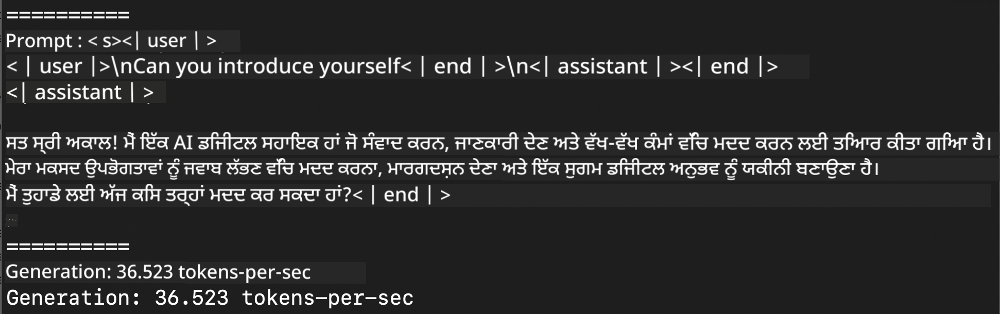
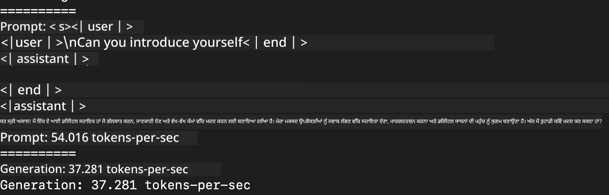
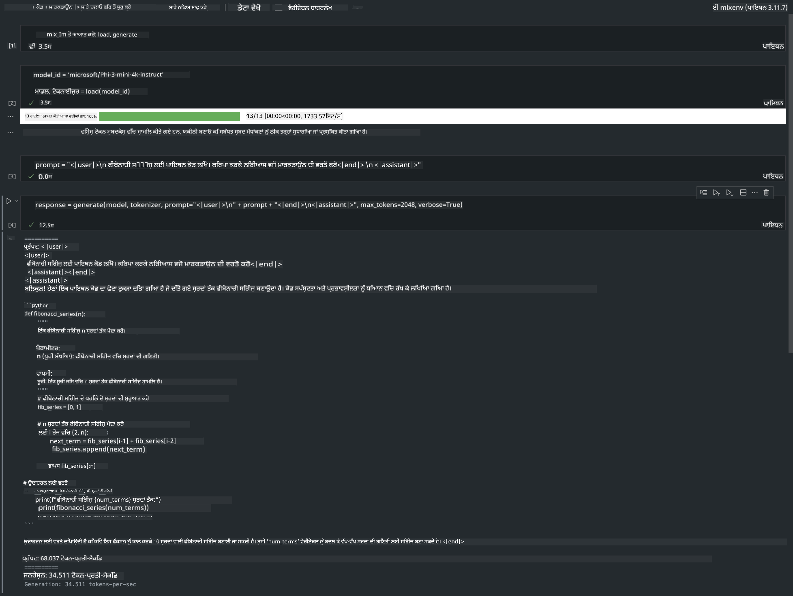

<!--
CO_OP_TRANSLATOR_METADATA:
{
  "original_hash": "dcb656f3d206fc4968e236deec5d4384",
  "translation_date": "2025-05-09T22:31:00+00:00",
  "source_file": "md/03.FineTuning/03.Inference/MLX_Inference.md",
  "language_code": "pa"
}
-->
# **Inference Phi-3 Apple MLX Framework ਨਾਲ**

## **MLX Framework ਕੀ ਹੈ**

MLX ਇੱਕ ਐਰੇ ਫਰੇਮਵਰਕ ਹੈ ਜੋ Apple ਸਿਲਿਕਾਨ 'ਤੇ ਮਸ਼ੀਨ ਲਰਨਿੰਗ ਖੋਜ ਲਈ ਬਣਾਇਆ ਗਿਆ ਹੈ, ਜੋ Apple ਮਸ਼ੀਨ ਲਰਨਿੰਗ ਖੋਜ ਵੱਲੋਂ ਪੇਸ਼ ਕੀਤਾ ਗਿਆ ਹੈ।

MLX ਮਸ਼ੀਨ ਲਰਨਿੰਗ ਖੋਜਕਾਰਾਂ ਵੱਲੋਂ ਮਸ਼ੀਨ ਲਰਨਿੰਗ ਖੋਜਕਾਰਾਂ ਲਈ ਡਿਜ਼ਾਇਨ ਕੀਤਾ ਗਿਆ ਹੈ। ਇਹ ਫਰੇਮਵਰਕ ਵਰਤੋਂਕਾਰ-ਮਿੱਤਰਤਾਪੂਰਕ ਹੈ, ਪਰ ਫਿਰ ਵੀ ਮਾਡਲਾਂ ਨੂੰ ਸਿਖਾਉਣ ਅਤੇ ਚਲਾਉਣ ਲਈ ਪ੍ਰਭਾਵਸ਼ਾਲੀ ਹੈ। ਫਰੇਮਵਰਕ ਦੀ ਡਿਜ਼ਾਇਨ ਆਪੇ ਵਿੱਚ ਵੀ ਸਿਧੀ ਹੈ। ਸਾਡਾ ਮਕਸਦ ਹੈ ਕਿ ਖੋਜਕਾਰਾਂ ਲਈ MLX ਨੂੰ ਆਸਾਨੀ ਨਾਲ ਵਧਾਉਣਾ ਅਤੇ ਸੁਧਾਰਨਾ, ਤਾਂ ਜੋ ਨਵੇਂ ਵਿਚਾਰਾਂ ਨੂੰ ਤੇਜ਼ੀ ਨਾਲ ਪਰਖਿਆ ਜਾ ਸਕੇ।

Apple Silicon ਡਿਵਾਈਸਾਂ 'ਤੇ LLMs ਨੂੰ MLX ਰਾਹੀਂ ਤੇਜ਼ ਕੀਤਾ ਜਾ ਸਕਦਾ ਹੈ, ਅਤੇ ਮਾਡਲਾਂ ਨੂੰ ਬਹੁਤ ਆਸਾਨੀ ਨਾਲ ਲੋਕਲ ਚਲਾਇਆ ਜਾ ਸਕਦਾ ਹੈ।

## **MLX ਨਾਲ Phi-3-mini ਦਾ ਇੰਫਰੈਂਸ ਕਰਨਾ**

### **1. ਆਪਣਾ MLX ਵਾਤਾਵਰਣ ਸੈੱਟ ਕਰੋ**

1. Python 3.11.x
2. MLX ਲਾਇਬ੍ਰੇਰੀ ਇੰਸਟਾਲ ਕਰੋ


```bash

pip install mlx-lm

```

### **2. MLX ਨਾਲ ਟਰਮੀਨਲ 'ਚ Phi-3-mini ਚਲਾਉਣਾ**


```bash

python -m mlx_lm.generate --model microsoft/Phi-3-mini-4k-instruct --max-token 2048 --prompt  "<|user|>\nCan you introduce yourself<|end|>\n<|assistant|>"

```

ਨਤੀਜਾ (ਮੇਰਾ ਵਾਤਾਵਰਣ Apple M1 Max, 64GB ਹੈ) ਇਹ ਹੈ



### **3. MLX ਨਾਲ ਟਰਮੀਨਲ 'ਚ Phi-3-mini ਨੂੰ Quantize ਕਰਨਾ**


```bash

python -m mlx_lm.convert --hf-path microsoft/Phi-3-mini-4k-instruct

```

***Note：*** ਮਾਡਲ ਨੂੰ mlx_lm.convert ਰਾਹੀਂ Quantize ਕੀਤਾ ਜਾ ਸਕਦਾ ਹੈ, ਅਤੇ ਡਿਫਾਲਟ Quantization INT4 ਹੈ। ਇਸ ਉਦਾਹਰਨ ਵਿੱਚ Phi-3-mini ਨੂੰ INT4 ਵਿੱਚ Quantize ਕੀਤਾ ਗਿਆ ਹੈ।

ਮਾਡਲ mlx_lm.convert ਰਾਹੀਂ Quantize ਕੀਤਾ ਜਾ ਸਕਦਾ ਹੈ, ਅਤੇ ਡਿਫਾਲਟ Quantization INT4 ਹੈ। ਇਸ ਉਦਾਹਰਨ ਦਾ ਮਕਸਦ Phi-3-mini ਨੂੰ INT4 ਵਿੱਚ Quantize ਕਰਨਾ ਹੈ। Quantization ਤੋਂ ਬਾਅਦ, ਇਹ ਮਾਡਲ ਡਿਫਾਲਟ ਡਾਇਰੈਕਟਰੀ ./mlx_model ਵਿੱਚ ਸਟੋਰ ਕੀਤਾ ਜਾਵੇਗਾ।

ਅਸੀਂ ਟਰਮੀਨਲ ਤੋਂ MLX ਨਾਲ Quantize ਕੀਤਾ ਮਾਡਲ ਟੈਸਟ ਕਰ ਸਕਦੇ ਹਾਂ


```bash

python -m mlx_lm.generate --model ./mlx_model/ --max-token 2048 --prompt  "<|user|>\nCan you introduce yourself<|end|>\n<|assistant|>"

```

ਨਤੀਜਾ ਇਹ ਹੈ




### **4. Jupyter Notebook ਵਿੱਚ MLX ਨਾਲ Phi-3-mini ਚਲਾਉਣਾ**




***Note:*** ਕਿਰਪਾ ਕਰਕੇ ਇਸ ਸੈਂਪਲ ਨੂੰ ਪੜ੍ਹੋ [click this link](../../../../../code/03.Inference/MLX/MLX_DEMO.ipynb)


## **ਸੰਸਾਧਨ**

1. Apple MLX Framework ਬਾਰੇ ਜਾਣਕਾਰੀ ਲਈ [https://ml-explore.github.io](https://ml-explore.github.io/mlx/build/html/index.html)

2. Apple MLX GitHub Repo [https://github.com/ml-explore](https://github.com/ml-explore)

**ਅਸਵੀਕਾਰੋਪਣ**:  
ਇਹ ਦਸਤਾਵੇਜ਼ AI ਅਨੁਵਾਦ ਸੇਵਾ [Co-op Translator](https://github.com/Azure/co-op-translator) ਦੀ ਵਰਤੋਂ ਕਰਕੇ ਅਨੁਵਾਦ ਕੀਤਾ ਗਿਆ ਹੈ। ਜਦੋਂ ਕਿ ਅਸੀਂ ਸਹੀਅਤਾ ਲਈ ਕੋਸ਼ਿਸ਼ ਕਰਦੇ ਹਾਂ, ਕਿਰਪਾ ਕਰਕੇ ਧਿਆਨ ਵਿੱਚ ਰੱਖੋ ਕਿ ਆਟੋਮੇਟਿਕ ਅਨੁਵਾਦਾਂ ਵਿੱਚ ਗਲਤੀਆਂ ਜਾਂ ਅਸਮਰੱਥਤਾਵਾਂ ਹੋ ਸਕਦੀਆਂ ਹਨ। ਮੂਲ ਦਸਤਾਵੇਜ਼ ਆਪਣੀ ਮੂਲ ਭਾਸ਼ਾ ਵਿੱਚ ਅਧਿਕਾਰਤ ਸਰੋਤ ਮੰਨਿਆ ਜਾਣਾ ਚਾਹੀਦਾ ਹੈ। ਮਹੱਤਵਪੂਰਨ ਜਾਣਕਾਰੀ ਲਈ, ਪੇਸ਼ੇਵਰ ਮਨੁੱਖੀ ਅਨੁਵਾਦ ਦੀ ਸਿਫ਼ਾਰਿਸ਼ ਕੀਤੀ ਜਾਂਦੀ ਹੈ। ਅਸੀਂ ਇਸ ਅਨੁਵਾਦ ਦੀ ਵਰਤੋਂ ਨਾਲ ਪੈਦਾ ਹੋਣ ਵਾਲੀਆਂ ਕਿਸੇ ਵੀ ਗਲਤਫਹਮੀਆਂ ਜਾਂ ਗਲਤ ਵਿਆਖਿਆਵਾਂ ਲਈ ਜ਼ਿੰਮੇਵਾਰ ਨਹੀਂ ਹਾਂ।