# Azure AI Foundry ਨਾਲ Phi-3 ਨੂੰ ਫਾਈਨ-ਟਿਊਨ ਕਰਨਾ

ਆਓ ਵੇਖੀਏ ਕਿ Microsoft ਦੇ Phi-3 Mini ਭਾਸ਼ਾ ਮਾਡਲ ਨੂੰ Azure AI Foundry ਦੀ ਵਰਤੋਂ ਕਰਕੇ ਕਿਵੇਂ ਫਾਈਨ-ਟਿਊਨ ਕੀਤਾ ਜਾ ਸਕਦਾ ਹੈ। ਫਾਈਨ-ਟਿਊਨਿੰਗ ਤੁਹਾਨੂੰ Phi-3 Mini ਨੂੰ ਖਾਸ ਕੰਮਾਂ ਲਈ ਅਨੁਕੂਲਿਤ ਕਰਨ ਦੀ ਆਗਿਆ ਦਿੰਦੀ ਹੈ, ਜਿਸ ਨਾਲ ਇਹ ਹੋਰ ਵੀ ਸ਼ਕਤੀਸ਼ਾਲੀ ਅਤੇ ਸੰਦਰਭ-ਸੂਚਕ ਬਣ ਜਾਂਦਾ ਹੈ।

## ਵਿਚਾਰ ਕਰਨ ਵਾਲੀਆਂ ਗੱਲਾਂ

- **ਸਮਰੱਥਾਵਾਂ:** ਕਿਹੜੇ ਮਾਡਲ ਫਾਈਨ-ਟਿਊਨ ਕਰਨ ਯੋਗ ਹਨ? ਬੇਸ ਮਾਡਲ ਨੂੰ ਕਿਹੜੇ ਕੰਮਾਂ ਲਈ ਫਾਈਨ-ਟਿਊਨ ਕੀਤਾ ਜਾ ਸਕਦਾ ਹੈ?
- **ਲਾਗਤ:** ਫਾਈਨ-ਟਿਊਨਿੰਗ ਲਈ ਕੀ ਕੀਮਤ ਮਾਡਲ ਹੈ?
- **ਕਸਟਮਾਈਜ਼ੇਬਿਲਟੀ:** ਮੈਂ ਬੇਸ ਮਾਡਲ ਵਿੱਚ ਕਿੰਨਾ ਬਦਲਾਅ ਕਰ ਸਕਦਾ ਹਾਂ – ਅਤੇ ਕਿਹੜੇ ਤਰੀਕਿਆਂ ਨਾਲ?
- **ਸੁਵਿਧਾ:** ਫਾਈਨ-ਟਿਊਨਿੰਗ ਕਿਵੇਂ ਹੁੰਦੀ ਹੈ – ਕੀ ਮੈਨੂੰ ਕਸਟਮ ਕੋਡ ਲਿਖਣਾ ਪੈਂਦਾ ਹੈ? ਕੀ ਮੈਨੂੰ ਆਪਣਾ ਕੰਪਿਊਟ ਲਿਆਉਣਾ ਪੈਂਦਾ ਹੈ?
- **ਸੁਰੱਖਿਆ:** ਫਾਈਨ-ਟਿਊਨ ਕੀਤੇ ਮਾਡਲਾਂ ਨਾਲ ਸੁਰੱਖਿਆ ਸੰਬੰਧੀ ਖਤਰੇ ਹੁੰਦੇ ਹਨ – ਕੀ ਕੋਈ ਸੁਰੱਖਿਆ ਬੰਧਨ ਹਨ ਜੋ ਅਣਚਾਹੇ ਨੁਕਸਾਨ ਤੋਂ ਬਚਾਉਂਦੇ ਹਨ?

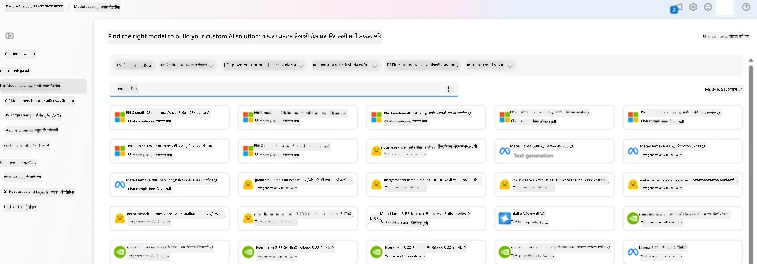

## ਫਾਈਨ-ਟਿਊਨਿੰਗ ਲਈ ਤਿਆਰੀ

### ਜ਼ਰੂਰੀ ਸ਼ਰਤਾਂ

> [!NOTE]
> Phi-3 ਪਰਿਵਾਰ ਦੇ ਮਾਡਲਾਂ ਲਈ, pay-as-you-go ਮਾਡਲ ਫਾਈਨ-ਟਿਊਨਿੰਗ ਸੇਵਾ ਸਿਰਫ **East US 2** ਖੇਤਰਾਂ ਵਿੱਚ ਬਣਾਏ ਗਏ ਹੱਬਾਂ ਲਈ ਉਪਲਬਧ ਹੈ।

- ਇੱਕ Azure ਸਬਸਕ੍ਰਿਪਸ਼ਨ। ਜੇ ਤੁਹਾਡੇ ਕੋਲ Azure ਸਬਸਕ੍ਰਿਪਸ਼ਨ ਨਹੀਂ ਹੈ, ਤਾਂ ਸ਼ੁਰੂ ਕਰਨ ਲਈ ਇੱਕ [ਪੇਡ Azure ਖਾਤਾ](https://azure.microsoft.com/pricing/purchase-options/pay-as-you-go) ਬਣਾਓ।

- ਇੱਕ [AI Foundry ਪ੍ਰੋਜੈਕਟ](https://ai.azure.com?WT.mc_id=aiml-138114-kinfeylo)।
- Azure ਰੋਲ-ਆਧਾਰਿਤ ਐਕਸੈਸ ਕੰਟਰੋਲ (Azure RBAC) Azure AI Foundry ਵਿੱਚ ਓਪਰੇਸ਼ਨਾਂ ਲਈ ਪਹੁੰਚ ਦੇਣ ਲਈ ਵਰਤੇ ਜਾਂਦੇ ਹਨ। ਇਸ ਲੇਖ ਵਿੱਚ ਦਿੱਤੇ ਕਦਮ ਕਰਨ ਲਈ, ਤੁਹਾਡੇ ਯੂਜ਼ਰ ਖਾਤੇ ਨੂੰ __Azure AI Developer ਰੋਲ__ ਰਿਸੋਰਸ ਗਰੁੱਪ 'ਤੇ ਦਿੱਤਾ ਹੋਣਾ ਚਾਹੀਦਾ ਹੈ।

### ਸਬਸਕ੍ਰਿਪਸ਼ਨ ਪ੍ਰੋਵਾਈਡਰ ਰਜਿਸਟ੍ਰੇਸ਼ਨ

ਪੱਕਾ ਕਰੋ ਕਿ ਸਬਸਕ੍ਰਿਪਸ਼ਨ `Microsoft.Network` ਰਿਸੋਰਸ ਪ੍ਰੋਵਾਈਡਰ ਨਾਲ ਰਜਿਸਟਰਡ ਹੈ।

1. [Azure ਪੋਰਟਲ](https://portal.azure.com) ਵਿੱਚ ਸਾਈਨ ਇਨ ਕਰੋ।
2. ਖੱਬੇ ਮੀਨੂ ਤੋਂ **Subscriptions** ਚੁਣੋ।
3. ਆਪਣੀ ਵਰਤੋਂ ਵਾਲੀ ਸਬਸਕ੍ਰਿਪਸ਼ਨ ਚੁਣੋ।
4. ਖੱਬੇ ਮੀਨੂ ਤੋਂ **AI project settings** > **Resource providers** ਚੁਣੋ।
5. ਪੱਕਾ ਕਰੋ ਕਿ **Microsoft.Network** ਰਿਸੋਰਸ ਪ੍ਰੋਵਾਈਡਰਾਂ ਦੀ ਸੂਚੀ ਵਿੱਚ ਹੈ। ਨਹੀਂ ਤਾਂ ਇਸਨੂੰ ਸ਼ਾਮਲ ਕਰੋ।

### ਡਾਟਾ ਤਿਆਰ ਕਰਨਾ

ਆਪਣੇ ਮਾਡਲ ਨੂੰ ਫਾਈਨ-ਟਿਊਨ ਕਰਨ ਲਈ ਆਪਣਾ ਟ੍ਰੇਨਿੰਗ ਅਤੇ ਵੈਰੀਫਿਕੇਸ਼ਨ ਡਾਟਾ ਤਿਆਰ ਕਰੋ। ਤੁਹਾਡੇ ਟ੍ਰੇਨਿੰਗ ਅਤੇ ਵੈਰੀਫਿਕੇਸ਼ਨ ਡਾਟਾ ਸੈੱਟ ਵਿੱਚ ਉਹ ਇਨਪੁੱਟ ਅਤੇ ਆਉਟਪੁੱਟ ਉਦਾਹਰਣਾਂ ਹੁੰਦੀਆਂ ਹਨ ਜਿਨ੍ਹਾਂ ਦੇ ਅਧਾਰ 'ਤੇ ਤੁਸੀਂ ਮਾਡਲ ਨੂੰ ਕੰਮ ਕਰਵਾਉਣਾ ਚਾਹੁੰਦੇ ਹੋ।

ਸਾਰੇ ਟ੍ਰੇਨਿੰਗ ਉਦਾਹਰਣਾਂ ਨੂੰ ਇੰਫਰੈਂਸ ਲਈ ਉਮੀਦ ਕੀਤੇ ਗਏ ਫਾਰਮੈਟ ਵਿੱਚ ਹੋਣਾ ਚਾਹੀਦਾ ਹੈ। ਮਾਡਲਾਂ ਨੂੰ ਪ੍ਰਭਾਵਸ਼ਾਲੀ ਤਰੀਕੇ ਨਾਲ ਫਾਈਨ-ਟਿਊਨ ਕਰਨ ਲਈ, ਇੱਕ ਸੰਤੁਲਿਤ ਅਤੇ ਵੱਖ-ਵੱਖ ਕਿਸਮ ਦਾ ਡਾਟਾ ਸੈੱਟ ਜ਼ਰੂਰੀ ਹੈ।

ਇਸ ਵਿੱਚ ਡਾਟਾ ਸੰਤੁਲਨ ਬਣਾਈ ਰੱਖਣਾ, ਵੱਖ-ਵੱਖ ਸਥਿਤੀਆਂ ਨੂੰ ਸ਼ਾਮਲ ਕਰਨਾ ਅਤੇ ਸਮੇਂ-ਸਮੇਂ 'ਤੇ ਟ੍ਰੇਨਿੰਗ ਡਾਟਾ ਨੂੰ ਅਸਲੀ ਦੁਨੀਆ ਦੀਆਂ ਉਮੀਦਾਂ ਦੇ ਅਨੁਕੂਲ ਬਨਾਉਣਾ ਸ਼ਾਮਲ ਹੈ, ਜਿਸ ਨਾਲ ਮਾਡਲ ਦੇ ਜਵਾਬ ਹੋਰ ਸਹੀ ਅਤੇ ਸੰਤੁਲਿਤ ਬਣਦੇ ਹਨ।

ਵੱਖ-ਵੱਖ ਮਾਡਲ ਕਿਸਮਾਂ ਲਈ ਟ੍ਰੇਨਿੰਗ ਡਾਟਾ ਦਾ ਫਾਰਮੈਟ ਵੱਖਰਾ ਹੁੰਦਾ ਹੈ।

### ਚੈਟ ਕੰਪਲੀਸ਼ਨ

ਤੁਹਾਡੇ ਦੁਆਰਾ ਵਰਤੇ ਜਾਣ ਵਾਲੇ ਟ੍ਰੇਨਿੰਗ ਅਤੇ ਵੈਰੀਫਿਕੇਸ਼ਨ ਡਾਟਾ ਨੂੰ JSON Lines (JSONL) ਦਸਤਾਵੇਜ਼ ਦੇ ਰੂਪ ਵਿੱਚ ਹੋਣਾ **ਲਾਜ਼ਮੀ** ਹੈ। `Phi-3-mini-128k-instruct` ਲਈ ਫਾਈਨ-ਟਿਊਨਿੰਗ ਡਾਟਾ ਸੈੱਟ ਨੂੰ ਚੈਟ ਕੰਪਲੀਸ਼ਨ API ਵੱਲੋਂ ਵਰਤੇ ਜਾਣ ਵਾਲੇ ਗੱਲਬਾਤੀ ਫਾਰਮੈਟ ਵਿੱਚ ਹੋਣਾ ਚਾਹੀਦਾ ਹੈ।

### ਉਦਾਹਰਣ ਫਾਇਲ ਫਾਰਮੈਟ

```json
    {"messages": [{"role": "system", "content": "You are an Xbox customer support agent whose primary goal is to help users with issues they are experiencing with their Xbox devices. You are friendly and concise. You only provide factual answers to queries, and do not provide answers that are not related to Xbox."}, {"role": "user", "content": "Is Xbox better than PlayStation?"}, {"role": "assistant", "content": "I apologize, but I cannot provide personal opinions. My primary job is to assist you with any issues related to your Xbox device. Do you have any Xbox-related issues that need addressing?"}]}
    {"messages": [{"role": "system", "content": "You are an Xbox customer support agent whose primary goal is to help users with issues they are experiencing with their Xbox devices. You are friendly and concise. You only provide factual answers to queries, and do not provide answers that are not related to Xbox."}, {"role": "user", "content": "Can I play PC games on my Xbox?"}, {"role": "assistant", "content": "While Xbox consoles don't natively support PC games, they can play an array of Xbox games, many of which are also available on PC. Can I assist you with finding games compatible with your Xbox device?"}]}
    {"messages": [{"role": "system", "content": "You are an Xbox customer support agent whose primary goal is to help users with issues they are experiencing with their Xbox devices. You are friendly and concise. You only provide factual answers to queries, and do not provide answers that are not related to Xbox."}, {"role": "user", "content": "I'm having trouble connecting my Xbox to the Wi-Fi."}, {"role": "assistant", "content": "No worries, let's go through the network settings on your Xbox. Can you please tell me what happens when you try to connect it to the Wi-Fi?"}]}
```

ਸਹਾਇਕ ਫਾਇਲ ਕਿਸਮ JSON Lines ਹੈ। ਫਾਇਲਾਂ ਡਿਫਾਲਟ ਡਾਟਾਸਟੋਰ ਵਿੱਚ ਅਪਲੋਡ ਕੀਤੀਆਂ ਜਾਂਦੀਆਂ ਹਨ ਅਤੇ ਤੁਹਾਡੇ ਪ੍ਰੋਜੈਕਟ ਵਿੱਚ ਉਪਲਬਧ ਹੁੰਦੀਆਂ ਹਨ।

## Azure AI Foundry ਨਾਲ Phi-3 ਨੂੰ ਫਾਈਨ-ਟਿਊਨ ਕਰਨਾ

Azure AI Foundry ਤੁਹਾਨੂੰ ਵੱਡੇ ਭਾਸ਼ਾ ਮਾਡਲਾਂ ਨੂੰ ਆਪਣੇ ਨਿੱਜੀ ਡਾਟਾਸੈੱਟ ਲਈ ਅਨੁਕੂਲਿਤ ਕਰਨ ਦੀ ਆਗਿਆ ਦਿੰਦਾ ਹੈ, ਜਿਸਨੂੰ ਫਾਈਨ-ਟਿਊਨਿੰਗ ਕਿਹਾ ਜਾਂਦਾ ਹੈ। ਫਾਈਨ-ਟਿਊਨਿੰਗ ਖਾਸ ਕੰਮਾਂ ਅਤੇ ਐਪਲੀਕੇਸ਼ਨਾਂ ਲਈ ਕਸਟਮਾਈਜ਼ੇਸ਼ਨ ਅਤੇ ਅਪਟੀਮਾਈਜ਼ੇਸ਼ਨ ਦੇ ਕੇ ਮਹੱਤਵਪੂਰਨ ਮੁੱਲ ਪੈਦਾ ਕਰਦਾ ਹੈ। ਇਸ ਨਾਲ ਪ੍ਰਦਰਸ਼ਨ ਵਿੱਚ ਸੁਧਾਰ, ਲਾਗਤ ਦੀ ਬਚਤ, ਘੱਟ ਲੇਟੈਂਸੀ ਅਤੇ ਨਿੱਜੀ ਨਤੀਜੇ ਮਿਲਦੇ ਹਨ।

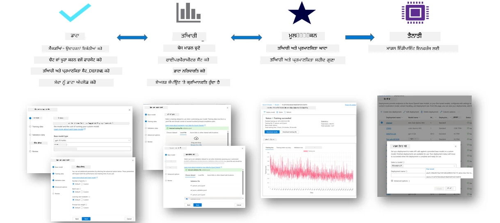

### ਨਵਾਂ ਪ੍ਰੋਜੈਕਟ ਬਣਾਓ

1. [Azure AI Foundry](https://ai.azure.com) ਵਿੱਚ ਸਾਈਨ ਇਨ ਕਰੋ।

2. Azure AI Foundry ਵਿੱਚ ਨਵਾਂ ਪ੍ਰੋਜੈਕਟ ਬਣਾਉਣ ਲਈ **+New project** ਚੁਣੋ।

    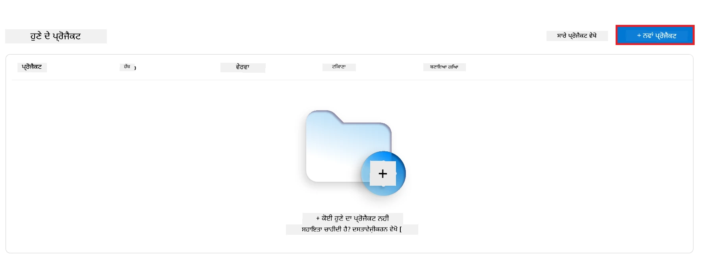

3. ਹੇਠਾਂ ਦਿੱਤੇ ਕੰਮ ਕਰੋ:

    - ਪ੍ਰੋਜੈਕਟ ਦਾ **Hub name** ਦਿਓ। ਇਹ ਇੱਕ ਵਿਲੱਖਣ ਮੁੱਲ ਹੋਣਾ ਚਾਹੀਦਾ ਹੈ।
    - ਵਰਤੋਂ ਲਈ **Hub** ਚੁਣੋ (ਜੇ ਲੋੜ ਹੋਵੇ ਤਾਂ ਨਵਾਂ ਬਣਾਓ)।

    

4. ਨਵਾਂ ਹੱਬ ਬਣਾਉਣ ਲਈ ਹੇਠਾਂ ਦਿੱਤੇ ਕੰਮ ਕਰੋ:

    - **Hub name** ਦਿਓ। ਇਹ ਇੱਕ ਵਿਲੱਖਣ ਮੁੱਲ ਹੋਣਾ ਚਾਹੀਦਾ ਹੈ।
    - ਆਪਣੀ Azure **Subscription** ਚੁਣੋ।
    - ਵਰਤੋਂ ਲਈ **Resource group** ਚੁਣੋ (ਜੇ ਲੋੜ ਹੋਵੇ ਤਾਂ ਨਵਾਂ ਬਣਾਓ)।
    - ਵਰਤੋਂ ਲਈ **Location** ਚੁਣੋ।
    - ਵਰਤੋਂ ਲਈ **Connect Azure AI Services** ਚੁਣੋ (ਜੇ ਲੋੜ ਹੋਵੇ ਤਾਂ ਨਵਾਂ ਬਣਾਓ)।
    - **Connect Azure AI Search** ਲਈ **Skip connecting** ਚੁਣੋ।

    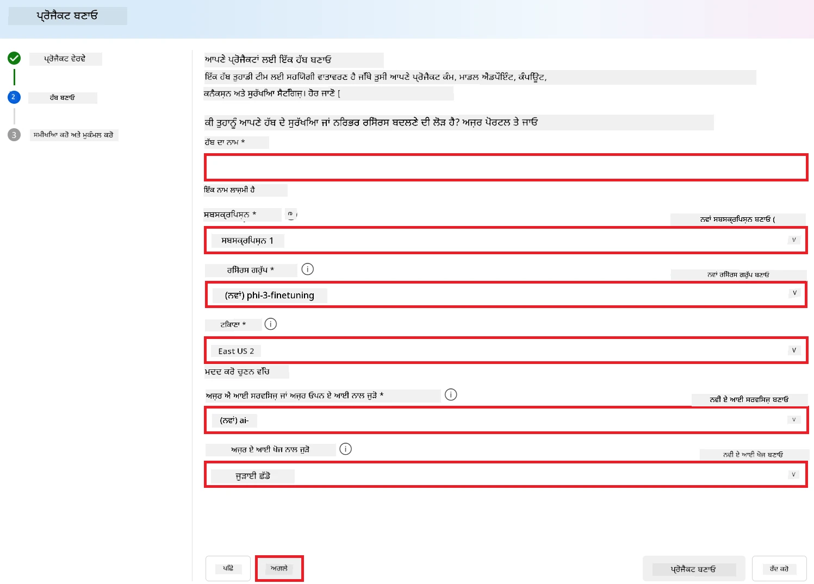

5. **Next** ਚੁਣੋ।
6. **Create a project** ਚੁਣੋ।

### ਡਾਟਾ ਤਿਆਰ ਕਰਨਾ

ਫਾਈਨ-ਟਿਊਨਿੰਗ ਤੋਂ ਪਹਿਲਾਂ, ਆਪਣੇ ਕੰਮ ਨਾਲ ਸੰਬੰਧਿਤ ਡਾਟਾ ਇਕੱਠਾ ਕਰੋ ਜਾਂ ਬਣਾਓ, ਜਿਵੇਂ ਕਿ ਚੈਟ ਨਿਰਦੇਸ਼, ਸਵਾਲ-ਜਵਾਬ ਜੋੜੇ, ਜਾਂ ਹੋਰ ਕੋਈ ਲੋੜੀਂਦਾ ਟੈਕਸਟ ਡਾਟਾ। ਇਸ ਡਾਟਾ ਨੂੰ ਸਾਫ਼ ਕਰੋ ਅਤੇ ਪ੍ਰੀ-ਪ੍ਰੋਸੈਸ ਕਰੋ, ਜਿਵੇਂ ਕਿ ਸ਼ੋਰ ਹਟਾਉਣਾ, ਗੁੰਮ ਹੋਏ ਮੁੱਲਾਂ ਨੂੰ ਸੰਭਾਲਣਾ, ਅਤੇ ਟੈਕਸਟ ਨੂੰ ਟੋਕਨਾਈਜ਼ ਕਰਨਾ।

### Azure AI Foundry ਵਿੱਚ Phi-3 ਮਾਡਲਾਂ ਨੂੰ ਫਾਈਨ-ਟਿਊਨ ਕਰੋ

> [!NOTE]
> Phi-3 ਮਾਡਲਾਂ ਦੀ ਫਾਈਨ-ਟਿਊਨਿੰਗ ਇਸ ਸਮੇਂ ਸਿਰਫ East US 2 ਖੇਤਰਾਂ ਵਿੱਚ ਮੌਜੂਦ ਪ੍ਰੋਜੈਕਟਾਂ ਵਿੱਚ ਸਹਾਇਕ ਹੈ।

1. ਖੱਬੇ ਪਾਸੇ ਟੈਬ ਤੋਂ **Model catalog** ਚੁਣੋ।

2. **search bar** ਵਿੱਚ *phi-3* ਟਾਈਪ ਕਰੋ ਅਤੇ ਆਪਣਾ ਵਰਤੋਂ ਵਾਲਾ phi-3 ਮਾਡਲ ਚੁਣੋ।

    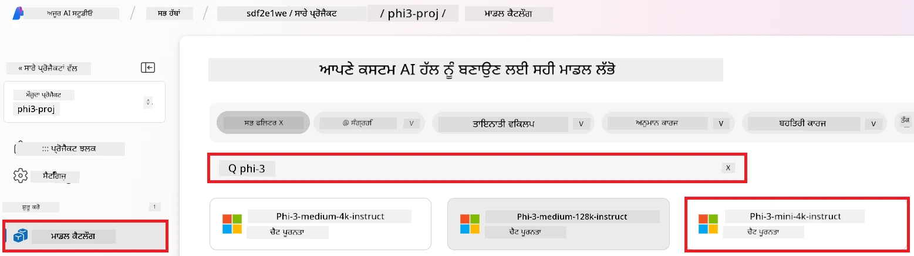

3. **Fine-tune** ਚੁਣੋ।

    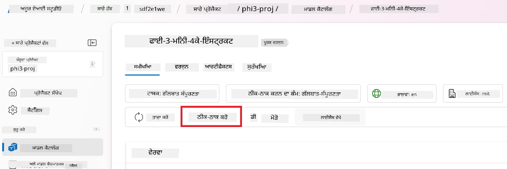

4. **Fine-tuned model name** ਦਿਓ।

    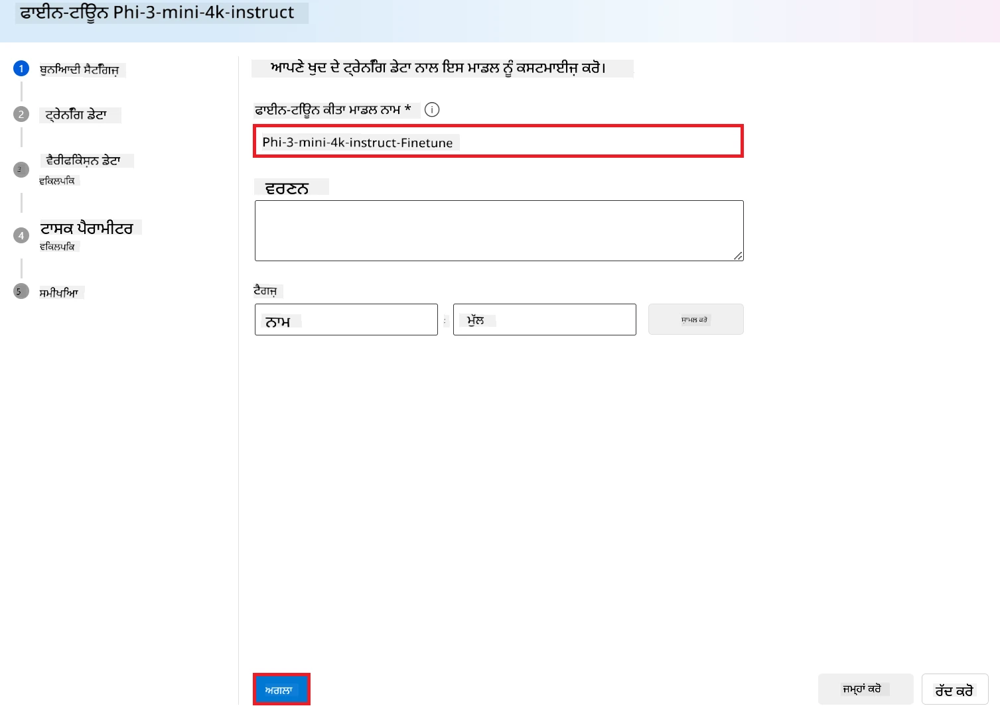

5. **Next** ਚੁਣੋ।

6. ਹੇਠਾਂ ਦਿੱਤੇ ਕੰਮ ਕਰੋ:

    - **task type** ਲਈ **Chat completion** ਚੁਣੋ।
    - ਵਰਤੋਂ ਲਈ **Training data** ਚੁਣੋ। ਤੁਸੀਂ ਇਸਨੂੰ Azure AI Foundry ਦੇ ਡਾਟਾ ਤੋਂ ਜਾਂ ਆਪਣੇ ਲੋਕਲ ਮਾਹੌਲ ਤੋਂ ਅਪਲੋਡ ਕਰ ਸਕਦੇ ਹੋ।

    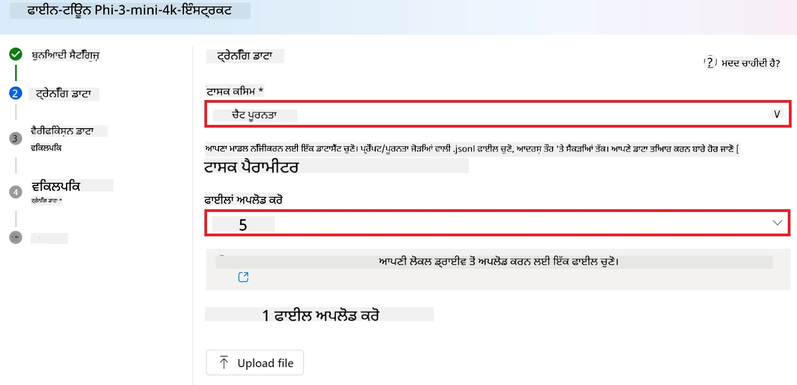

7. **Next** ਚੁਣੋ।

8. ਵਰਤੋਂ ਲਈ **Validation data** ਅਪਲੋਡ ਕਰੋ ਜਾਂ **Automatic split of training data** ਚੁਣੋ।

    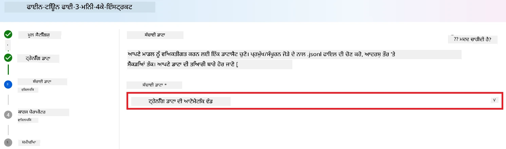

9. **Next** ਚੁਣੋ।

10. ਹੇਠਾਂ ਦਿੱਤੇ ਕੰਮ ਕਰੋ:

    - ਵਰਤੋਂ ਲਈ **Batch size multiplier** ਚੁਣੋ।
    - ਵਰਤੋਂ ਲਈ **Learning rate** ਚੁਣੋ।
    - ਵਰਤੋਂ ਲਈ **Epochs** ਚੁਣੋ।

    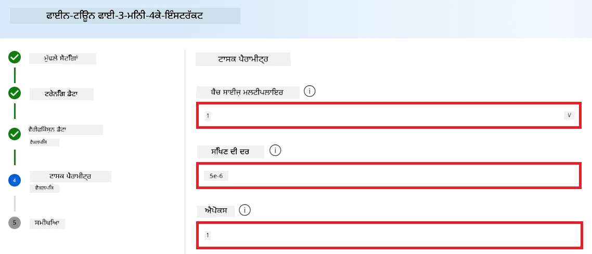

11. ਫਾਈਨ-ਟਿਊਨਿੰਗ ਪ੍ਰਕਿਰਿਆ ਸ਼ੁਰੂ ਕਰਨ ਲਈ **Submit** ਚੁਣੋ।

    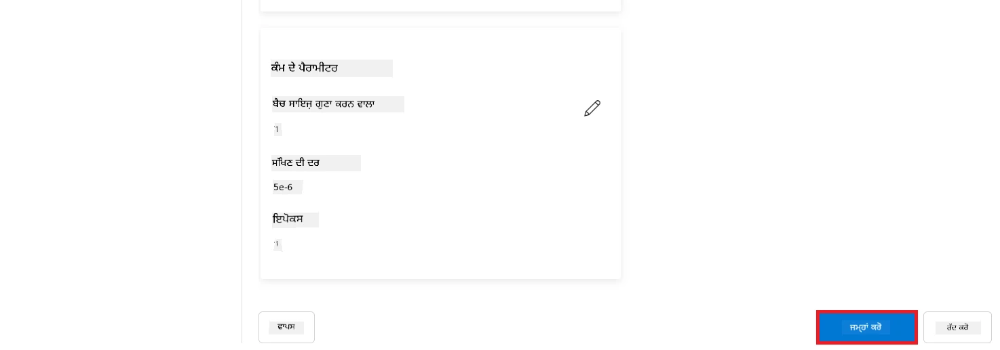

12. ਜਦੋਂ ਤੁਹਾਡਾ ਮਾਡਲ ਫਾਈਨ-ਟਿਊਨ ਹੋ ਜਾਵੇਗਾ, ਤਾਂ ਸਥਿਤੀ **Completed** ਵਜੋਂ ਦਿਖਾਈ ਦੇਵੇਗੀ। ਹੁਣ ਤੁਸੀਂ ਮਾਡਲ ਨੂੰ ਡਿਪਲੋਇ ਕਰ ਸਕਦੇ ਹੋ ਅਤੇ ਆਪਣੇ ਐਪਲੀਕੇਸ਼ਨ, ਪਲੇਗ੍ਰਾਊਂਡ ਜਾਂ ਪ੍ਰਾਂਪਟ ਫਲੋ ਵਿੱਚ ਵਰਤ ਸਕਦੇ ਹੋ। ਹੋਰ ਜਾਣਕਾਰੀ ਲਈ ਵੇਖੋ [How to deploy Phi-3 family of small language models with Azure AI Foundry](https://learn.microsoft.com/azure/ai-studio/how-to/deploy-models-phi-3?tabs=phi-3-5&pivots=programming-language-python)।

    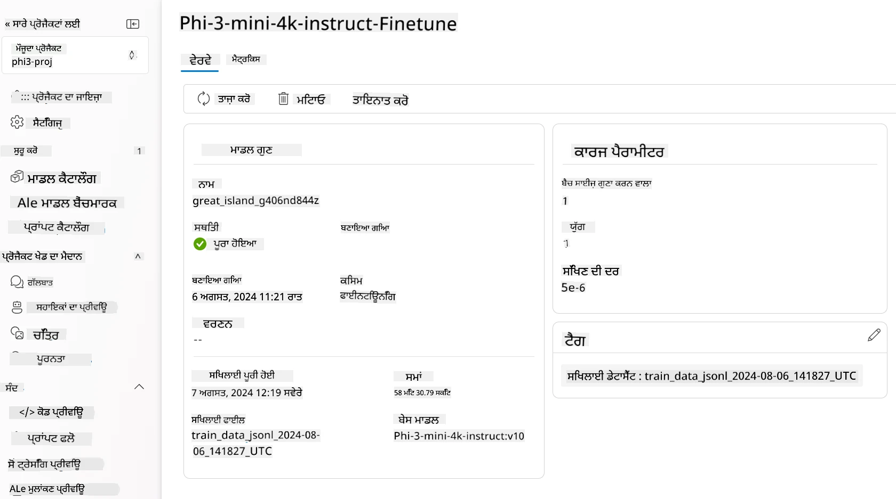

> [!NOTE]
> Phi-3 ਦੀ ਫਾਈਨ-ਟਿਊਨਿੰਗ ਬਾਰੇ ਹੋਰ ਵਿਸਥਾਰ ਲਈ, ਕਿਰਪਾ ਕਰਕੇ [Fine-tune Phi-3 models in Azure AI Foundry](https://learn.microsoft.com/azure/ai-studio/how-to/fine-tune-phi-3?tabs=phi-3-mini) ਵੇਖੋ।

## ਆਪਣੇ ਫਾਈਨ-ਟਿਊਨ ਕੀਤੇ ਮਾਡਲਾਂ ਨੂੰ ਸਾਫ਼ ਕਰਨਾ

ਤੁਸੀਂ [Azure AI Foundry](https://ai.azure.com) ਵਿੱਚ ਫਾਈਨ-ਟਿਊਨ ਮਾਡਲ ਸੂਚੀ ਜਾਂ ਮਾਡਲ ਵੇਰਵੇ ਪੰਨੇ ਤੋਂ ਫਾਈਨ-ਟਿਊਨ ਕੀਤੇ ਮਾਡਲ ਨੂੰ ਹਟਾ ਸਕਦੇ ਹੋ। ਫਾਈਨ-ਟਿਊਨ ਪੰਨੇ ਤੋਂ ਮਿਟਾਉਣ ਲਈ ਮਾਡਲ ਚੁਣੋ ਅਤੇ ਫਿਰ ਮਿਟਾਉਣ ਲਈ Delete ਬਟਨ ਦਬਾਓ।

> [!NOTE]
> ਜੇ ਕਿਸੇ ਕਸਟਮ ਮਾਡਲ ਦੀ ਡਿਪਲੋਇਮੈਂਟ ਮੌਜੂਦ ਹੈ, ਤਾਂ ਤੁਸੀਂ ਉਸਨੂੰ ਮਿਟਾ ਨਹੀਂ ਸਕਦੇ। ਪਹਿਲਾਂ ਆਪਣੀ ਮਾਡਲ ਡਿਪਲੋਇਮੈਂਟ ਨੂੰ ਮਿਟਾਉਣਾ ਜ਼ਰੂਰੀ ਹੈ।

## ਲਾਗਤ ਅਤੇ ਕੋਟਾ

### Phi-3 ਮਾਡਲਾਂ ਦੀ ਸੇਵਾ ਵਜੋਂ ਫਾਈਨ-ਟਿਊਨਿੰਗ ਲਈ ਲਾਗਤ ਅਤੇ ਕੋਟਾ

Phi ਮਾਡਲਾਂ ਨੂੰ ਸੇਵਾ ਵਜੋਂ Microsoft ਵੱਲੋਂ ਪ੍ਰਦਾਨ ਕੀਤਾ ਜਾਂਦਾ ਹੈ ਅਤੇ Azure AI Foundry ਨਾਲ ਇੰਟੀਗ੍ਰੇਟ ਕੀਤਾ ਗਿਆ ਹੈ। ਤੁਸੀਂ ਮਾਡਲਾਂ ਨੂੰ [ਡਿਪਲੋਇ](https://learn.microsoft.com/azure/ai-studio/how-to/deploy-models-phi-3?tabs=phi-3-5&pivots=programming-language-python) ਜਾਂ ਫਾਈਨ-ਟਿਊਨ ਕਰਨ ਸਮੇਂ ਕੀਮਤ ਵੇਖ ਸਕਦੇ ਹੋ, ਜੋ ਡਿਪਲੋਇਮੈਂਟ ਵਿਜ਼ਾਰਡ ਦੇ Pricing and terms ਟੈਬ ਵਿੱਚ ਮਿਲਦੀ ਹੈ।

## ਸਮੱਗਰੀ ਫਿਲਟਰਿੰਗ

ਪੇ-ਐਜ਼-ਯੂ-ਗੋ ਸੇਵਾ ਵਜੋਂ ਡਿਪਲੋਇ ਕੀਤੇ ਮਾਡਲ Azure AI Content Safety ਨਾਲ ਸੁਰੱਖਿਅਤ ਹੁੰਦੇ ਹਨ। ਜਦੋਂ ਇਹ ਰੀਅਲ-ਟਾਈਮ ਐਂਡਪੌਇੰਟਸ 'ਤੇ ਡਿਪਲੋਇ ਹੁੰਦੇ ਹਨ, ਤਾਂ ਤੁਸੀਂ ਇਸ ਸਮਰੱਥਾ ਤੋਂ ਬਾਹਰ ਰਹਿਣਾ ਚੁਣ ਸਕਦੇ ਹੋ। Azure AI Content Safety ਚਾਲੂ ਹੋਣ 'ਤੇ, ਪ੍ਰਾਂਪਟ ਅਤੇ ਕੰਪਲੀਸ਼ਨ ਦੋਹਾਂ ਨੂੰ ਹਾਨਿਕਾਰਕ ਸਮੱਗਰੀ ਦੇ ਨਿਕਾਸ ਨੂੰ ਰੋਕਣ ਲਈ ਕਈ ਕਲਾਸੀਫਿਕੇਸ਼ਨ ਮਾਡਲਾਂ ਦੇ ਜਥੇ ਵਿੱਚੋਂ ਲੰਘਾਇਆ ਜਾਂਦਾ ਹੈ। ਸਮੱਗਰੀ ਫਿਲਟਰਿੰਗ ਸਿਸਟਮ ਇਨਪੁੱਟ ਪ੍ਰਾਂਪਟ ਅਤੇ ਆਉਟਪੁੱਟ ਕੰਪਲੀਸ਼ਨ ਦੋਹਾਂ ਵਿੱਚ ਸੰਭਾਵਿਤ ਹਾਨਿਕਾਰਕ ਸਮੱਗਰੀ ਦੀਆਂ ਵਿਸ਼ੇਸ਼ ਸ਼੍ਰੇਣੀਆਂ ਦੀ ਪਹਿਚਾਣ ਕਰਦਾ ਹੈ ਅਤੇ ਉਨ੍ਹਾਂ 'ਤੇ ਕਾਰਵਾਈ ਕਰਦਾ ਹੈ। ਹੋਰ ਜਾਣਕਾਰੀ ਲਈ ਵੇਖੋ [Azure AI Content Safety](https://learn.microsoft.com/azure/ai-studio/concepts/content-filtering)।

**ਫਾਈਨ-ਟਿਊਨਿੰਗ ਸੰਰਚਨਾ**

ਹਾਈਪਰਪੈਰਾਮੀਟਰ: ਲਰਨਿੰਗ ਰੇਟ, ਬੈਚ ਸਾਈਜ਼, ਅਤੇ ਟ੍ਰੇਨਿੰਗ ਇਪੋਕਸ ਦੀ ਗਿਣਤੀ ਵਰਗੇ ਹਾਈਪਰਪੈਰਾਮੀਟਰ ਪਰਿਭਾਸ਼ਿਤ ਕਰੋ।

**ਲਾਸ ਫੰਕਸ਼ਨ**

ਆਪਣੇ ਕੰਮ ਲਈ ਉਚਿਤ ਲਾਸ ਫੰਕਸ਼ਨ ਚੁਣੋ (ਜਿਵੇਂ ਕਿ cross-entropy)।

**ਆਪਟੀਮਾਈਜ਼ਰ**

ਟ੍ਰੇਨਿੰਗ ਦੌਰਾਨ ਗ੍ਰੈਡੀਐਂਟ ਅਪਡੇਟ ਲਈ ਇੱਕ ਆਪਟੀਮਾਈਜ਼ਰ ਚੁਣੋ (ਜਿਵੇਂ ਕਿ Adam)।

**ਫਾਈਨ-ਟਿਊਨਿੰਗ ਪ੍ਰਕਿਰਿਆ**

- ਪ੍ਰੀ-ਟ੍ਰੇਨਡ ਮਾਡਲ ਲੋਡ ਕਰੋ: Phi-3 Mini ਚੈਕਪੌਇੰਟ ਲੋਡ ਕਰੋ।
- ਕਸਟਮ ਲੇਅਰ ਸ਼ਾਮਲ ਕਰੋ: ਕੰਮ-ਵਿਸ਼ੇਸ਼ ਲੇਅਰ (ਜਿਵੇਂ ਕਿ ਚੈਟ ਨਿਰਦੇਸ਼ਾਂ ਲਈ ਕਲਾਸੀਫਿਕੇਸ਼ਨ ਹੈਡ) ਸ਼ਾਮਲ ਕਰੋ।

**ਮਾਡਲ ਨੂੰ ਟ੍ਰੇਨ ਕਰੋ**  
ਆਪਣੇ ਤਿਆਰ ਕੀਤੇ ਡਾਟਾਸੈੱਟ ਨਾਲ ਮਾਡਲ ਨੂੰ ਫਾਈਨ-ਟਿਊਨ ਕਰੋ। ਟ੍ਰੇਨਿੰਗ ਦੀ ਪ੍ਰਗਤੀ ਦੀ ਨਿਗਰਾਨੀ ਕਰੋ ਅਤੇ ਜ਼ਰੂਰਤ ਮੁਤਾਬਕ ਹਾਈਪਰਪੈਰਾਮੀਟਰ ਬਦਲੋ।

**ਮੁਲਾਂਕਣ ਅਤੇ ਵੈਰੀਫਿਕੇਸ਼ਨ**

ਵੈਰੀਫਿਕੇਸ਼ਨ ਸੈੱਟ: ਆਪਣੇ ਡਾਟਾ ਨੂੰ ਟ੍ਰੇਨਿੰਗ ਅਤੇ ਵੈਰੀਫਿਕੇਸ਼ਨ

**ਅਸਵੀਕਾਰੋਪਣ**:  
ਇਹ ਦਸਤਾਵੇਜ਼ AI ਅਨੁਵਾਦ ਸੇਵਾ [Co-op Translator](https://github.com/Azure/co-op-translator) ਦੀ ਵਰਤੋਂ ਕਰਕੇ ਅਨੁਵਾਦਿਤ ਕੀਤਾ ਗਿਆ ਹੈ। ਜਦੋਂ ਕਿ ਅਸੀਂ ਸਹੀਅਤ ਲਈ ਕੋਸ਼ਿਸ਼ ਕਰਦੇ ਹਾਂ, ਕਿਰਪਾ ਕਰਕੇ ਧਿਆਨ ਰੱਖੋ ਕਿ ਸਵੈਚਾਲਿਤ ਅਨੁਵਾਦਾਂ ਵਿੱਚ ਗਲਤੀਆਂ ਜਾਂ ਅਸਮਰਥਤਾਵਾਂ ਹੋ ਸਕਦੀਆਂ ਹਨ। ਮੂਲ ਦਸਤਾਵੇਜ਼ ਆਪਣੀ ਮੂਲ ਭਾਸ਼ਾ ਵਿੱਚ ਪ੍ਰਮਾਣਿਕ ਸਰੋਤ ਮੰਨਿਆ ਜਾਣਾ ਚਾਹੀਦਾ ਹੈ। ਮਹੱਤਵਪੂਰਨ ਜਾਣਕਾਰੀ ਲਈ, ਪੇਸ਼ੇਵਰ ਮਨੁੱਖੀ ਅਨੁਵਾਦ ਦੀ ਸਿਫਾਰਸ਼ ਕੀਤੀ ਜਾਂਦੀ ਹੈ। ਅਸੀਂ ਇਸ ਅਨੁਵਾਦ ਦੀ ਵਰਤੋਂ ਤੋਂ ਉਤਪੰਨ ਕਿਸੇ ਵੀ ਗਲਤਫਹਿਮੀ ਜਾਂ ਗਲਤ ਵਿਆਖਿਆ ਲਈ ਜ਼ਿੰਮੇਵਾਰ ਨਹੀਂ ਹਾਂ।