<!--
CO_OP_TRANSLATOR_METADATA:
{
  "original_hash": "c1559c5af6caccf6f623fd43a6b3a9a3",
  "translation_date": "2025-05-09T20:28:54+00:00",
  "source_file": "md/03.FineTuning/FineTuning_AIFoundry.md",
  "language_code": "pa"
}
-->
# Azure AI Foundry ਨਾਲ Phi-3 ਨੂੰ ਫਾਈਨ-ਟਿਊਨ ਕਰਨਾ

ਆਓ ਵੇਖੀਏ ਕਿ Microsoft ਦੇ Phi-3 Mini ਭਾਸ਼ਾ ਮਾਡਲ ਨੂੰ Azure AI Foundry ਦੀ ਵਰਤੋਂ ਕਰਕੇ ਕਿਵੇਂ ਫਾਈਨ-ਟਿਊਨ ਕੀਤਾ ਜਾ ਸਕਦਾ ਹੈ। ਫਾਈਨ-ਟਿਊਨਿੰਗ ਨਾਲ ਤੁਸੀਂ Phi-3 Mini ਨੂੰ ਖਾਸ ਟਾਸਕਾਂ ਲਈ ਅਨੁਕੂਲਿਤ ਕਰ ਸਕਦੇ ਹੋ, ਜਿਸ ਨਾਲ ਇਹ ਹੋਰ ਵੀ ਸ਼ਕਤੀਸ਼ਾਲੀ ਅਤੇ ਸੰਦਰਭ-ਸੂਚਕ ਬਣ ਜਾਂਦਾ ਹੈ।

## ਵਿਚਾਰ

- **ਯੋਗਤਾਵਾਂ:** ਕਿਹੜੇ ਮਾਡਲ ਫਾਈਨ-ਟਿਊਨ ਕਰਨ ਯੋਗ ਹਨ? ਬੇਸ ਮਾਡਲ ਨੂੰ ਕੀ ਕੁਝ ਕਰਨ ਲਈ ਫਾਈਨ-ਟਿਊਨ ਕੀਤਾ ਜਾ ਸਕਦਾ ਹੈ?
- **ਲਾਗਤ:** ਫਾਈਨ-ਟਿਊਨਿੰਗ ਲਈ ਕੀ ਕੀਮਤ ਮਾਡਲ ਹੈ?
- **ਕਸਟਮਾਈਜ਼ੇਸ਼ਨ:** ਮੈਂ ਬੇਸ ਮਾਡਲ ਵਿੱਚ ਕਿੰਨਾ ਬਦਲਾਅ ਕਰ ਸਕਦਾ ਹਾਂ – ਅਤੇ ਕਿਹੜੇ ਤਰੀਕਿਆਂ ਨਾਲ?
- **ਸੁਵਿਧਾ:** ਫਾਈਨ-ਟਿਊਨਿੰਗ ਅਸਲ ਵਿੱਚ ਕਿਵੇਂ ਹੁੰਦੀ ਹੈ – ਕੀ ਮੈਨੂੰ ਕਸਟਮ ਕੋਡ ਲਿਖਣ ਦੀ ਲੋੜ ਹੈ? ਕੀ ਮੈਨੂੰ ਆਪਣਾ ਕੰਪਿਊਟ ਲੈ ਕੇ ਆਉਣਾ ਪਵੇਗਾ?
- **ਸੁਰੱਖਿਆ:** ਫਾਈਨ-ਟਿਊਨ ਕੀਤੇ ਮਾਡਲਾਂ ਨਾਲ ਸੁਰੱਖਿਆ ਦੇ ਖਤਰੇ ਹੁੰਦੇ ਹਨ – ਕੀ ਕੋਈ ਸੁਰੱਖਿਆ ਗਾਰਡਰੇਲ ਹਨ ਜੋ ਅਣਚਾਹੀ ਨੁਕਸਾਨ ਤੋਂ ਬਚਾਉਂਦੇ ਹਨ?

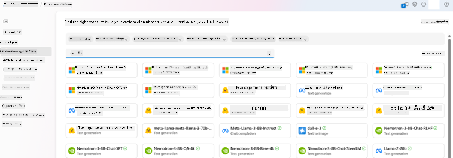

## ਫਾਈਨ-ਟਿਊਨਿੰਗ ਲਈ ਤਿਆਰੀ

### ਲੋੜੀਂਦੇ ਸਾਮਾਨ

> [!NOTE]
> Phi-3 ਪਰਿਵਾਰ ਦੇ ਮਾਡਲਾਂ ਲਈ, pay-as-you-go ਮਾਡਲ ਫਾਈਨ-ਟਿਊਨ ਸੇਵਾ ਸਿਰਫ **East US 2** ਖੇਤਰਾਂ ਵਿੱਚ ਬਣਾਏ ਗਏ ਹੱਬਜ਼ ਲਈ ਉਪਲਬਧ ਹੈ।

- ਇੱਕ Azure ਸਬਸਕ੍ਰਿਪਸ਼ਨ। ਜੇ ਤੁਹਾਡੇ ਕੋਲ Azure ਸਬਸਕ੍ਰਿਪਸ਼ਨ ਨਹੀਂ ਹੈ, ਤਾਂ ਸ਼ੁਰੂ ਕਰਨ ਲਈ ਇੱਕ [paid Azure account](https://azure.microsoft.com/pricing/purchase-options/pay-as-you-go) ਬਣਾਓ।

- ਇੱਕ [AI Foundry project](https://ai.azure.com?WT.mc_id=aiml-138114-kinfeylo)।
- Azure role-based access controls (Azure RBAC) ਦਾ ਇਸਤੇਮਾਲ Azure AI Foundry ਵਿੱਚ ਓਪਰੇਸ਼ਨਾਂ ਦੀ ਪਹੁੰਚ ਦੇਣ ਲਈ ਕੀਤਾ ਜਾਂਦਾ ਹੈ। ਇਸ ਲੇਖ ਵਿੱਚ ਦਿੱਤੇ ਕਦਮ ਕਰਨ ਲਈ, ਤੁਹਾਡੇ ਯੂਜ਼ਰ ਅਕਾਊਂਟ ਨੂੰ resource group 'ਤੇ __Azure AI Developer role__ ਮਿਲਣਾ ਜ਼ਰੂਰੀ ਹੈ।

### ਸਬਸਕ੍ਰਿਪਸ਼ਨ ਪ੍ਰੋਵਾਈਡਰ ਰਜਿਸਟ੍ਰੇਸ਼ਨ

ਪੱਕਾ ਕਰੋ ਕਿ ਸਬਸਕ੍ਰਿਪਸ਼ਨ `Microsoft.Network` resource provider ਨਾਲ ਰਜਿਸਟਰਡ ਹੈ।

1. [Azure portal](https://portal.azure.com) ਵਿੱਚ ਸਾਈਨ ਇਨ ਕਰੋ।
1. ਖੱਬੇ ਮੇਨੂ ਵਿੱਚੋਂ **Subscriptions** ਚੁਣੋ।
1. ਆਪਣੀ ਵਰਤੋਂ ਲਈ ਸਬਸਕ੍ਰਿਪਸ਼ਨ ਚੁਣੋ।
1. ਖੱਬੇ ਮੇਨੂ ਵਿੱਚੋਂ **AI project settings** > **Resource providers** ਚੁਣੋ।
1. ਯਕੀਨੀ ਬਣਾਓ ਕਿ **Microsoft.Network** resource providers ਦੀ ਸੂਚੀ ਵਿੱਚ ਹੈ, ਨਹੀਂ ਤਾਂ ਇਸਨੂੰ ਸ਼ਾਮਲ ਕਰੋ।

### ਡੇਟਾ ਤਿਆਰ ਕਰਨਾ

ਆਪਣੇ ਮਾਡਲ ਨੂੰ ਫਾਈਨ-ਟਿਊਨ ਕਰਨ ਲਈ ਆਪਣੇ ਟ੍ਰੇਨਿੰਗ ਅਤੇ ਵੈਲਿਡੇਸ਼ਨ ਡੇਟਾ ਤਿਆਰ ਕਰੋ। ਇਹ ਡੇਟਾ ਇੰਪੁੱਟ ਅਤੇ ਆਉਟਪੁੱਟ ਉਦਾਹਰਣਾਂ ਦਾ ਸਮੂਹ ਹੁੰਦਾ ਹੈ ਜੋ ਦੱਸਦਾ ਹੈ ਕਿ ਤੁਸੀਂ ਮਾਡਲ ਤੋਂ ਕੀ ਉਮੀਦ ਰੱਖਦੇ ਹੋ।

ਪੱਕਾ ਕਰੋ ਕਿ ਸਾਰੇ ਟ੍ਰੇਨਿੰਗ ਉਦਾਹਰਣ ਇਨਫਰੈਂਸ ਲਈ ਉਮੀਦ ਕੀਤੇ ਫਾਰਮੈਟ ਵਿੱਚ ਹਨ। ਪ੍ਰਭਾਵਸ਼ਾਲੀ ਫਾਈਨ-ਟਿਊਨਿੰਗ ਲਈ, ਸੰਤੁਲਿਤ ਅਤੇ ਵੱਖ-ਵੱਖ ਕਿਸਮ ਦਾ ਡੇਟਾ ਹੋਣਾ ਜ਼ਰੂਰੀ ਹੈ।

ਇਸ ਵਿੱਚ ਡੇਟਾ ਦਾ ਸੰਤੁਲਨ ਬਣਾਈ ਰੱਖਣਾ, ਵੱਖ-ਵੱਖ ਸਥਿਤੀਆਂ ਸ਼ਾਮਲ ਕਰਨਾ, ਅਤੇ ਸਮੇਂ-ਸਮੇਂ ਤੇ ਟ੍ਰੇਨਿੰਗ ਡੇਟਾ ਨੂੰ ਅਸਲੀ ਦੁਨੀਆ ਦੀਆਂ ਉਮੀਦਾਂ ਦੇ ਅਨੁਕੂਲ ਬਦਲਣਾ ਸ਼ਾਮਲ ਹੈ, ਜਿਸ ਨਾਲ ਮਾਡਲ ਦੇ ਜਵਾਬ ਹੋਰ ਸਹੀ ਅਤੇ ਸੰਤੁਲਿਤ ਬਣਦੇ ਹਨ।

ਵੱਖ-ਵੱਖ ਮਾਡਲ ਕਿਸਮਾਂ ਲਈ ਵੱਖ-ਵੱਖ ਟ੍ਰੇਨਿੰਗ ਡੇਟਾ ਫਾਰਮੈਟ ਦੀ ਲੋੜ ਹੁੰਦੀ ਹੈ।

### ਚੈਟ ਕਮਪਲੀਸ਼ਨ

ਤੁਹਾਡੇ ਟ੍ਰੇਨਿੰਗ ਅਤੇ ਵੈਲਿਡੇਸ਼ਨ ਡੇਟਾ ਨੂੰ JSON Lines (JSONL) ਦਸਤਾਵੇਜ਼ ਦੇ ਰੂਪ ਵਿੱਚ ਫਾਰਮੈਟ ਕੀਤਾ ਜਾਣਾ **ਲਾਜ਼ਮੀ** ਹੈ। `Phi-3-mini-128k-instruct` ਲਈ ਫਾਈਨ-ਟਿਊਨਿੰਗ ਡੇਟਾ ਸੈੱਟ ਨੂੰ ਚੈਟ ਕਮਪਲੀਸ਼ਨ API ਵੱਲੋਂ ਵਰਤੇ ਜਾਂਦੇ ਗੱਲਬਾਤੀ ਫਾਰਮੈਟ ਵਿੱਚ ਹੋਣਾ ਚਾਹੀਦਾ ਹੈ।

### ਉਦਾਹਰਣ ਫਾਈਲ ਫਾਰਮੈਟ

```json
    {"messages": [{"role": "system", "content": "You are an Xbox customer support agent whose primary goal is to help users with issues they are experiencing with their Xbox devices. You are friendly and concise. You only provide factual answers to queries, and do not provide answers that are not related to Xbox."}, {"role": "user", "content": "Is Xbox better than PlayStation?"}, {"role": "assistant", "content": "I apologize, but I cannot provide personal opinions. My primary job is to assist you with any issues related to your Xbox device. Do you have any Xbox-related issues that need addressing?"}]}
    {"messages": [{"role": "system", "content": "You are an Xbox customer support agent whose primary goal is to help users with issues they are experiencing with their Xbox devices. You are friendly and concise. You only provide factual answers to queries, and do not provide answers that are not related to Xbox."}, {"role": "user", "content": "Can I play PC games on my Xbox?"}, {"role": "assistant", "content": "While Xbox consoles don't natively support PC games, they can play an array of Xbox games, many of which are also available on PC. Can I assist you with finding games compatible with your Xbox device?"}]}
    {"messages": [{"role": "system", "content": "You are an Xbox customer support agent whose primary goal is to help users with issues they are experiencing with their Xbox devices. You are friendly and concise. You only provide factual answers to queries, and do not provide answers that are not related to Xbox."}, {"role": "user", "content": "I'm having trouble connecting my Xbox to the Wi-Fi."}, {"role": "assistant", "content": "No worries, let's go through the network settings on your Xbox. Can you please tell me what happens when you try to connect it to the Wi-Fi?"}]}
```

ਸਮਰਥਿਤ ਫਾਈਲ ਕਿਸਮ JSON Lines ਹੈ। ਫਾਈਲਾਂ ਡਿਫਾਲਟ ਡੇਟਾਸਟੋਰ ਵਿੱਚ ਅਪਲੋਡ ਕੀਤੀਆਂ ਜਾਂਦੀਆਂ ਹਨ ਅਤੇ ਤੁਹਾਡੇ ਪ੍ਰੋਜੈਕਟ ਵਿੱਚ ਉਪਲਬਧ ਹੁੰਦੀਆਂ ਹਨ।

## Azure AI Foundry ਨਾਲ Phi-3 ਨੂੰ ਫਾਈਨ-ਟਿਊਨ ਕਰਨਾ

Azure AI Foundry ਤੁਹਾਨੂੰ ਵੱਡੇ ਭਾਸ਼ਾ ਮਾਡਲਾਂ ਨੂੰ ਆਪਣੇ ਖਾਸ ਡੇਟਾਸੈੱਟ ਨਾਲ ਅਨੁਕੂਲਿਤ ਕਰਨ ਦੀ ਆਗਿਆ ਦਿੰਦਾ ਹੈ, ਜਿਸਨੂੰ ਫਾਈਨ-ਟਿਊਨਿੰਗ ਕਹਿੰਦੇ ਹਨ। ਫਾਈਨ-ਟਿਊਨਿੰਗ ਖਾਸ ਟਾਸਕਾਂ ਅਤੇ ਐਪਲੀਕੇਸ਼ਨਾਂ ਲਈ ਕਸਟਮਾਈਜ਼ੇਸ਼ਨ ਅਤੇ ਅਪਟਾਈਮਾਈਜ਼ੇਸ਼ਨ ਦੀ ਸਮਰੱਥਾ ਦਿੰਦਾ ਹੈ। ਇਸ ਨਾਲ ਪ੍ਰਦਰਸ਼ਨ ਸੁਧਾਰਦਾ ਹੈ, ਲਾਗਤ ਘਟਦੀ ਹੈ, ਲੇਟੰਸੀ ਘਟਦੀ ਹੈ ਅਤੇ ਨਤੀਜੇ ਵਧੇਰੇ ਮੋਹਤਾਜ਼ ਬਣਦੇ ਹਨ।

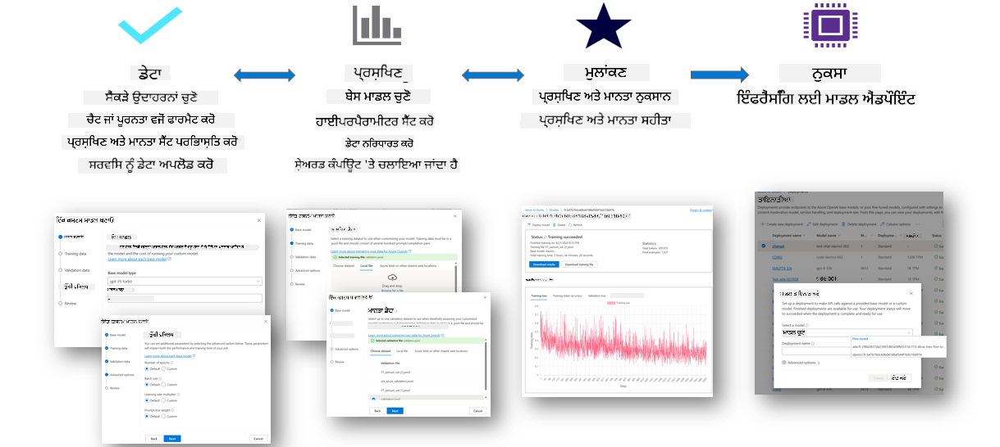

### ਨਵਾਂ ਪ੍ਰੋਜੈਕਟ ਬਣਾਓ

1. [Azure AI Foundry](https://ai.azure.com) ਵਿੱਚ ਸਾਈਨ ਇਨ ਕਰੋ।

1. Azure AI Foundry ਵਿੱਚ ਨਵਾਂ ਪ੍ਰੋਜੈਕਟ ਬਣਾਉਣ ਲਈ **+New project** ਚੁਣੋ।

    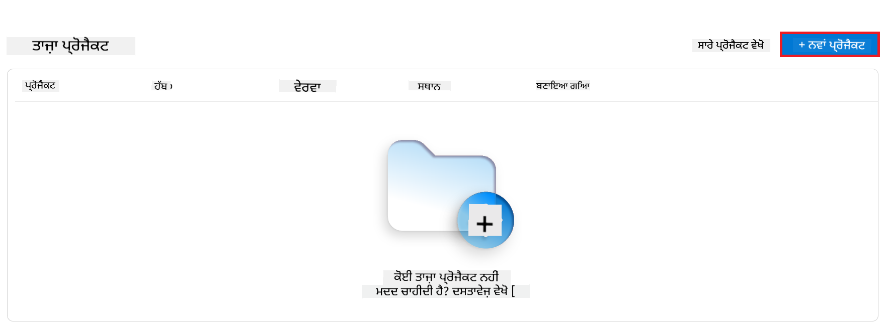

1. ਹੇਠ ਲਿਖੇ ਕੰਮ ਕਰੋ:

    - ਪ੍ਰੋਜੈਕਟ ਦਾ **Hub name** ਦਿਓ। ਇਹ ਵਿਲੱਖਣ ਹੋਣਾ ਚਾਹੀਦਾ ਹੈ।
    - ਵਰਤੋਂ ਲਈ **Hub** ਚੁਣੋ (ਲੋੜ ਪੈਣ ‘ਤੇ ਨਵਾਂ ਬਣਾਓ)।

    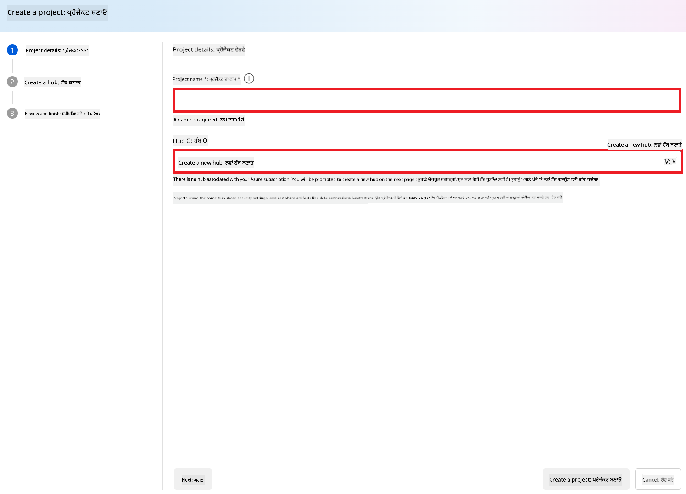

1. ਨਵਾਂ ਹੱਬ ਬਣਾਉਣ ਲਈ ਹੇਠ ਲਿਖੇ ਕੰਮ ਕਰੋ:

    - **Hub name** ਦਿਓ। ਇਹ ਵਿਲੱਖਣ ਹੋਣਾ ਚਾਹੀਦਾ ਹੈ।
    - ਆਪਣੀ Azure **Subscription** ਚੁਣੋ।
    - ਵਰਤੋਂ ਲਈ **Resource group** ਚੁਣੋ (ਲੋੜ ਪੈਣ ‘ਤੇ ਨਵਾਂ ਬਣਾਓ)।
    - ਵਰਤੋਂ ਲਈ **Location** ਚੁਣੋ।
    - ਵਰਤੋਂ ਲਈ **Connect Azure AI Services** ਚੁਣੋ (ਲੋੜ ਪੈਣ ‘ਤੇ ਨਵਾਂ ਬਣਾਓ)।
    - **Connect Azure AI Search** ‘ਤੇ **Skip connecting** ਚੁਣੋ।

    

1. **Next** ਚੁਣੋ।
1. **Create a project** ਚੁਣੋ।

### ਡੇਟਾ ਤਿਆਰ ਕਰਨਾ

ਫਾਈਨ-ਟਿਊਨਿੰਗ ਤੋਂ ਪਹਿਲਾਂ, ਆਪਣੇ ਟਾਸਕ ਲਈ ਸੰਬੰਧਿਤ ਡੇਟਾ ਸੈੱਟ ਇਕੱਠਾ ਕਰੋ ਜਾਂ ਬਣਾਓ, ਜਿਵੇਂ ਕਿ ਚੈਟ ਨਿਰਦੇਸ਼, ਸਵਾਲ-ਜਵਾਬ ਜੋੜੇ, ਜਾਂ ਹੋਰ ਕੋਈ ਟੈਕਸਟ ਡੇਟਾ। ਇਸ ਡੇਟਾ ਨੂੰ ਸਾਫ ਕਰੋ ਅਤੇ ਪ੍ਰੀ-ਪ੍ਰੋਸੈਸ ਕਰੋ, ਜਿਵੇਂ ਕਿ ਸ਼ੋਰ ਹਟਾਉਣਾ, ਗੁੰਮ ਹੋਏ ਮੁੱਲਾਂ ਦਾ ਇਲਾਜ ਕਰਨਾ ਅਤੇ ਟੈਕਸਟ ਨੂੰ ਟੋਕਨਾਈਜ਼ ਕਰਨਾ।

### Azure AI Foundry ਵਿੱਚ Phi-3 ਮਾਡਲਾਂ ਨੂੰ ਫਾਈਨ-ਟਿਊਨ ਕਰੋ

> [!NOTE]
> Phi-3 ਮਾਡਲਾਂ ਦੀ ਫਾਈਨ-ਟਿਊਨਿੰਗ ਇਸ ਸਮੇਂ ਸਿਰਫ East US 2 ਖੇਤਰਾਂ ਵਿੱਚ ਮੌਜੂਦ ਪ੍ਰੋਜੈਕਟਾਂ ਵਿੱਚ ਸਮਰਥਿਤ ਹੈ।

1. ਖੱਬੇ ਸਾਈਡ ਟੈਬ ਤੋਂ **Model catalog** ਚੁਣੋ।

1. **search bar** ਵਿੱਚ *phi-3* ਟਾਈਪ ਕਰੋ ਅਤੇ ਆਪਣਾ ਚਾਹੁੰਦਾ phi-3 ਮਾਡਲ ਚੁਣੋ।

    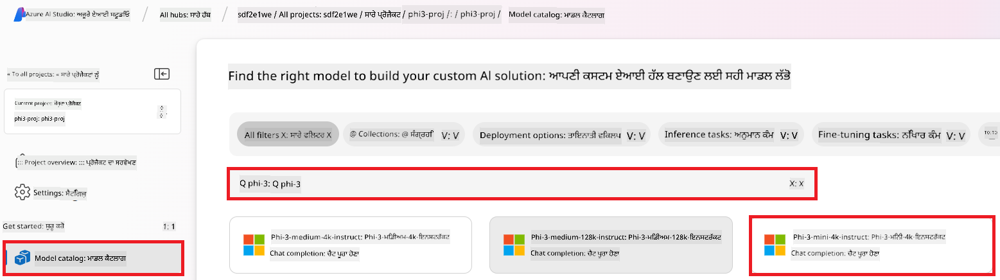

1. **Fine-tune** ਚੁਣੋ।

    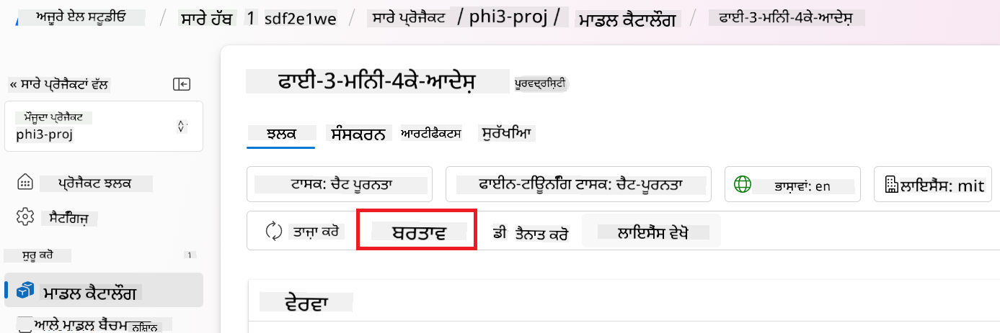

1. **Fine-tuned model name** ਦਿਓ।

    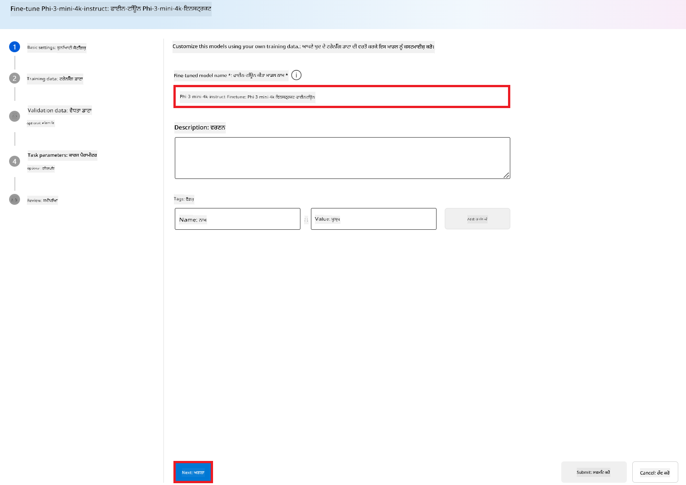

1. **Next** ਚੁਣੋ।

1. ਹੇਠ ਲਿਖੇ ਕੰਮ ਕਰੋ:

    - **task type** ਨੂੰ **Chat completion** ਚੁਣੋ।
    - ਵਰਤੋਂ ਲਈ **Training data** ਚੁਣੋ। ਤੁਸੀਂ ਇਸਨੂੰ Azure AI Foundry ਦੇ ਡੇਟਾ ਰਾਹੀਂ ਜਾਂ ਆਪਣੇ ਲੋਕਲ ਮਾਹੌਲ ਤੋਂ ਅਪਲੋਡ ਕਰ ਸਕਦੇ ਹੋ।

    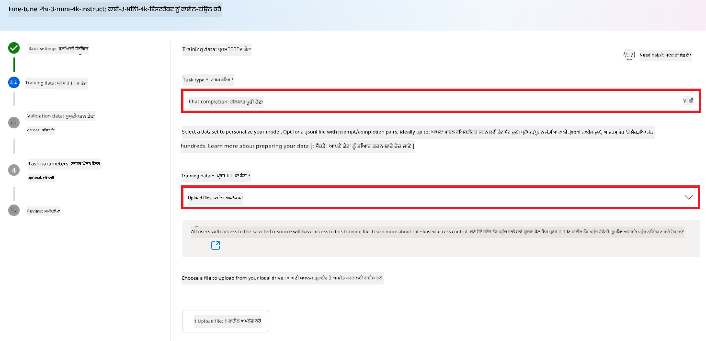

1. **Next** ਚੁਣੋ।

1. ਵਰਤੋਂ ਲਈ **Validation data** ਅਪਲੋਡ ਕਰੋ ਜਾਂ **Automatic split of training data** ਚੁਣੋ।

    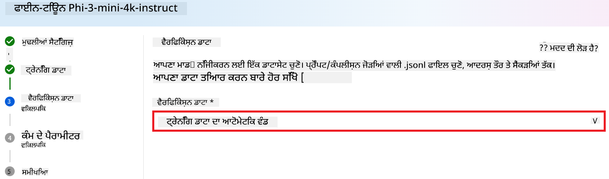

1. **Next** ਚੁਣੋ।

1. ਹੇਠ ਲਿਖੇ ਕੰਮ ਕਰੋ:

    - ਵਰਤੋਂ ਲਈ **Batch size multiplier** ਚੁਣੋ।
    - ਵਰਤੋਂ ਲਈ **Learning rate** ਚੁਣੋ।
    - ਵਰਤੋਂ ਲਈ **Epochs** ਚੁਣੋ।

    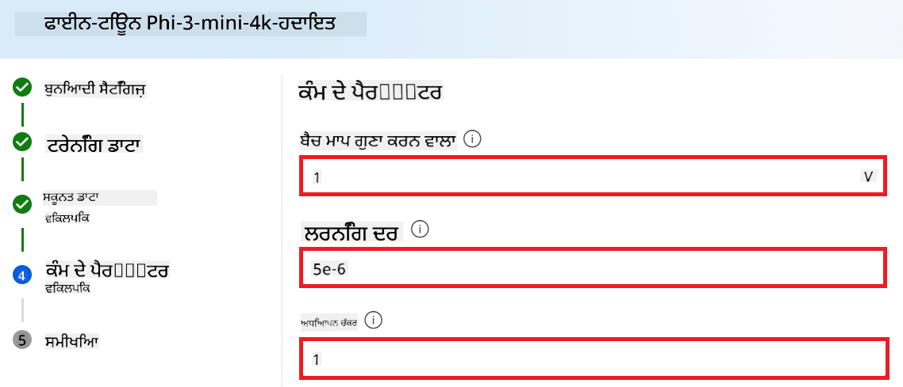

1. ਫਾਈਨ-ਟਿਊਨਿੰਗ ਪ੍ਰਕਿਰਿਆ ਸ਼ੁਰੂ ਕਰਨ ਲਈ **Submit** ਚੁਣੋ।

    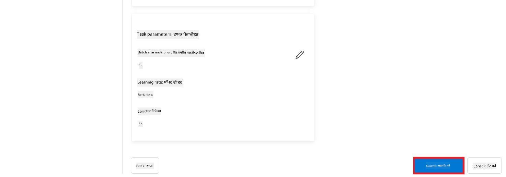

1. ਜਦੋਂ ਤੁਹਾਡਾ ਮਾਡਲ ਫਾਈਨ-ਟਿਊਨ ਹੋ ਜਾਵੇਗਾ, ਤਾਂ ਸਥਿਤੀ **Completed** ਵਜੋਂ ਦਿਖਾਈ ਦੇਵੇਗੀ। ਹੁਣ ਤੁਸੀਂ ਮਾਡਲ ਨੂੰ ਡਿਪਲੋਏ ਕਰ ਸਕਦੇ ਹੋ ਅਤੇ ਆਪਣੀ ਐਪਲੀਕੇਸ਼ਨ, ਪਲੇਗਰਾਊਂਡ ਜਾਂ ਪ੍ਰੋਮਪਟ ਫਲੋ ਵਿੱਚ ਵਰਤ ਸਕਦੇ ਹੋ। ਵਧੇਰੇ ਜਾਣਕਾਰੀ ਲਈ ਵੇਖੋ [How to deploy Phi-3 family of small language models with Azure AI Foundry](https://learn.microsoft.com/azure/ai-studio/how-to/deploy-models-phi-3?tabs=phi-3-5&pivots=programming-language-python)।

    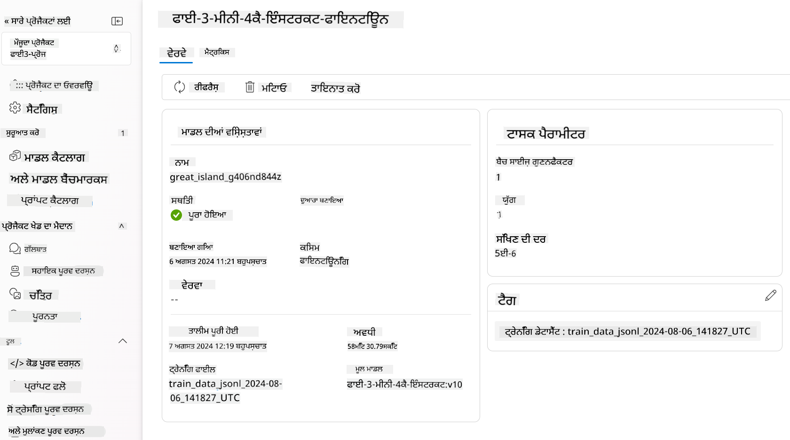

> [!NOTE]
> Phi-3 ਦੀ ਫਾਈਨ-ਟਿਊਨਿੰਗ ਬਾਰੇ ਹੋਰ ਵਿਸਥਾਰ ਲਈ, ਕਿਰਪਾ ਕਰਕੇ ਵੇਖੋ [Fine-tune Phi-3 models in Azure AI Foundry](https://learn.microsoft.com/azure/ai-studio/how-to/fine-tune-phi-3?tabs=phi-3-mini)।

## ਆਪਣੇ ਫਾਈਨ-ਟਿਊਨ ਕੀਤੇ ਮਾਡਲਾਂ ਨੂੰ ਸਾਫ਼ ਕਰਨਾ

ਤੁਸੀਂ Azure AI Foundry ਵਿੱਚ ਫਾਈਨ-ਟਿਊਨ ਮਾਡਲ ਸੂਚੀ ਤੋਂ ਜਾਂ ਮਾਡਲ ਡੀਟੇਲ ਪੇਜ ਤੋਂ ਫਾਈਨ-ਟਿਊਨ ਕੀਤਾ ਮਾਡਲ ਹਟਾ ਸਕਦੇ ਹੋ। ਫਾਈਨ-ਟਿਊਨ ਪੇਜ ਤੋਂ ਮਾਡਲ ਚੁਣੋ ਅਤੇ ਫਿਰ Delete ਬਟਨ ਦਬਾ ਕੇ ਮਾਡਲ ਹਟਾਓ।

> [!NOTE]
> ਜੇਕਰ ਕਿਸੇ ਕਸਟਮ ਮਾਡਲ ਦੀ ਡਿਪਲੋਏਮੈਂਟ ਮੌਜੂਦ ਹੈ, ਤਾਂ ਤੁਸੀਂ ਉਸਨੂੰ ਮਿਟਾ ਕੇ ਹੀ ਮਾਡਲ ਨੂੰ ਹਟਾ ਸਕਦੇ ਹੋ।

## ਲਾਗਤ ਅਤੇ ਕੁਆਟਾ

### Phi-3 ਮਾਡਲਾਂ ਲਈ ਸੇਵਾ ਵਜੋਂ ਫਾਈਨ-ਟਿਊਨਿੰਗ ਦੀ ਲਾਗਤ ਅਤੇ ਕੁਆਟਾ

Phi ਮਾਡਲਾਂ ਨੂੰ Microsoft ਵੱਲੋਂ ਸੇਵਾ ਵਜੋਂ ਦਿੱਤਾ ਜਾਂਦਾ ਹੈ ਅਤੇ Azure AI Foundry ਨਾਲ ਇੰਟੀਗ੍ਰੇਟ ਕੀਤਾ ਗਿਆ ਹੈ। ਮਾਡਲਾਂ ਨੂੰ ਡਿਪਲੋਏ ਜਾਂ ਫਾਈਨ-ਟਿਊਨ ਕਰਨ ਵੇਲੇ ਕੀਮਤ deployment wizard ਦੇ Pricing and terms ਟੈਬ ਵਿੱਚ ਮਿਲੇਗੀ।

## ਸਮੱਗਰੀ ਫਿਲਟਰਿੰਗ

ਪੇ-ਅਜ਼-ਯੂ-ਗੋ ਸੇਵਾ ਵਜੋਂ ਡਿਪਲੋਏ ਕੀਤੇ ਮਾਡਲ Azure AI Content Safety ਨਾਲ ਸੁਰੱਖਿਅਤ ਹੁੰਦੇ ਹਨ। ਜਦੋਂ ਇਹ ਰੀਅਲ-ਟਾਈਮ ਐਂਡਪੌਇੰਟਾਂ ‘ਤੇ ਡਿਪਲੋਏ ਹੁੰਦੇ ਹਨ, ਤਾਂ ਤੁਸੀਂ ਇਸ ਖੂਬੀ ਤੋਂ ਬਾਹਰ ਰਹਿਣ ਦੀ ਚੋਣ ਕਰ ਸਕਦੇ ਹੋ। Azure AI Content Safety ਸਹਾਇਤਾ ਨਾਲ, ਪ੍ਰਾਂਪਟ ਅਤੇ ਕਮਪਲੀਸ਼ਨ ਦੋਹਾਂ ਨੂੰ ਇੱਕ ਕਲਾਸੀਫਿਕੇਸ਼ਨ ਮਾਡਲ ਦੇ ਸੈੱਟ ਰਾਹੀਂ ਲੰਘਾਇਆ ਜਾਂਦਾ ਹੈ ਜੋ ਨੁਕਸਾਨਦਾਇਕ ਸਮੱਗਰੀ ਦੀ ਪਛਾਣ ਅਤੇ ਰੋਕਥਾਮ ਕਰਦਾ ਹੈ। ਸਮੱਗਰੀ ਫਿਲਟਰਿੰਗ ਸਿਸਟਮ ਇਨਪੁੱਟ ਪ੍ਰਾਂਪਟਾਂ ਅਤੇ ਆਉਟਪੁੱਟ ਕਮਪਲੀਸ਼ਨਾਂ ਵਿੱਚ ਸੰਭਾਵਿਤ ਨੁਕਸਾਨਦਾਇਕ ਸਮੱਗਰੀ ਦੇ ਖਾਸ ਵਰਗਾਂ ਦੀ ਪਛਾਣ ਕਰਦਾ ਹੈ ਅਤੇ ਕਾਰਵਾਈ ਕਰਦਾ ਹੈ। ਹੋਰ ਜਾਣਕਾਰੀ ਲਈ ਵੇਖੋ [Azure AI Content Safety](https://learn.microsoft.com/azure/ai-studio/concepts/content-filtering)।

**ਫਾਈਨ-ਟਿਊਨਿੰਗ ਸੰਰਚਨਾ**

ਹਾਇਪਰਪੈਰਾਮੀਟਰ: ਲਰਨਿੰਗ ਰੇਟ, ਬੈਚ ਸਾਈਜ਼ ਅਤੇ ਟ੍ਰੇਨਿੰਗ ਏਪੋਕਸ ਦੀ ਗਿਣਤੀ ਵਰਗੇ ਹਾਇਪਰਪੈਰਾਮੀਟਰ ਪਰਿਭਾਸ਼ਿਤ ਕਰੋ।

**ਲਾਸ ਫੰਕਸ਼ਨ**

ਆਪਣੇ ਟਾਸਕ ਲਈ ਉਚਿਤ ਲਾਸ ਫੰਕਸ਼ਨ ਚੁਣੋ (ਜਿਵੇਂ ਕਿ cross-entropy)।

**ਆਪਟਿਮਾਈਜ਼ਰ**

ਟ੍ਰੇਨਿੰਗ ਦੌਰਾਨ ਗ੍ਰੇਡੀਐਂਟ ਅੱਪਡੇਟ ਲਈ ਇਕ ਆਪਟਿਮਾਈਜ਼ਰ ਚੁਣੋ (ਜਿਵੇਂ Adam)।

**ਫਾਈਨ-ਟਿਊਨਿੰਗ ਪ੍ਰਕਿਰਿਆ**

- ਪ੍ਰੀ-ਟ੍ਰੇਨਡ ਮਾਡਲ ਲੋਡ ਕਰੋ: Phi-3 Mini ਚੈਕਪੋਇੰਟ ਲੋਡ ਕਰੋ।
- ਕਸਟਮ ਲੇਅਰ ਸ਼ਾਮਲ ਕਰੋ: ਟਾਸਕ-ਖਾਸ ਲੇਅਰ (ਜਿਵੇਂ ਚੈਟ ਨਿਰਦੇਸ਼ਾਂ ਲਈ ਕਲਾਸੀਫਿਕੇਸ਼ਨ ਹੈੱਡ) ਜੋੜੋ।

**ਮਾਡਲ ਟ੍ਰੇਨ ਕਰੋ**

ਆਪਣੇ ਤਿਆਰ ਕੀਤੇ ਡੇਟਾਸੈੱਟ ਨਾਲ ਮਾਡਲ ਨੂੰ ਫਾਈਨ-ਟਿਊਨ ਕਰੋ। ਟ੍ਰੇਨਿੰਗ ਪ੍ਰਗਤੀ ਦੀ ਨਿਗਰਾਨੀ ਕਰੋ ਅਤੇ ਜਰੂਰਤ ਅਨੁਸਾਰ ਹਾਇਪਰਪੈਰਾਮੀਟਰ ਬਦਲੋ।

**ਮੁਲਾਂਕਣ ਅਤੇ ਵੈਲਿਡੇਸ਼ਨ**

ਵੈਲਿਡੇਸ਼ਨ ਸੈੱਟ: ਆਪਣੇ ਡੇਟਾ ਨੂੰ ਟ੍ਰੇਨਿੰਗ ਅਤੇ ਵੈਲਿਡੇਸ਼ਨ ਸੈੱਟਾਂ ਵਿੱਚ ਵੰਡੋ।

**ਪ੍ਰਦਰਸ਼ਨ ਦਾ ਮੁਲਾਂਕਣ ਕਰੋ**

ਮਾਡਲ ਦੇ ਪ੍ਰਦਰਸ਼ਨ ਨੂੰ ਅੰਕੜਿਆਂ ਜਿਵੇਂ ਸਹੀਤਾ (accuracy), F1-ਸਕੋਰ ਜਾਂ perplexity ਨਾਲ ਮਾਪੋ।

## ਫਾਈਨ-ਟਿਊਨ ਕੀਤੇ ਮਾਡਲ ਨੂੰ ਸੇਵ ਕਰੋ

**ਚੈਕਪੋਇੰਟ**

ਭਵਿੱਖ ਵਿੱਚ ਵਰਤੋਂ ਲਈ ਫਾਈਨ-ਟਿਊਨ ਮਾਡਲ ਚੈਕਪੋਇੰਟ ਸੇਵ ਕਰੋ।

## ਡਿਪਲੋਏਮੈਂਟ

- ਵੈੱਬ ਸੇਵਾ ਵਜੋਂ ਡਿਪਲੋਏ ਕਰੋ: ਆਪਣਾ ਫਾਈਨ-ਟਿਊਨ ਮਾਡਲ Azure AI Foundry ਵਿੱਚ ਵੈੱਬ ਸੇਵਾ ਵਜੋਂ ਡਿਪਲੋਏ ਕਰੋ

**ਅਸਵੀਕਾਰੋਪਣ**:  
ਇਹ ਦਸਤਾਵੇਜ਼ AI ਅਨੁਵਾਦ ਸੇਵਾ [Co-op Translator](https://github.com/Azure/co-op-translator) ਦੀ ਵਰਤੋਂ ਕਰਕੇ ਅਨੁਵਾਦ ਕੀਤਾ ਗਿਆ ਹੈ। ਜਦੋਂ ਕਿ ਅਸੀਂ ਸਹੀਤਾ ਲਈ ਕੋਸ਼ਿਸ਼ ਕਰਦੇ ਹਾਂ, ਕਿਰਪਾ ਕਰਕੇ ਧਿਆਨ ਵਿੱਚ ਰੱਖੋ ਕਿ ਸਵੈਚਾਲਿਤ ਅਨੁਵਾਦਾਂ ਵਿੱਚ ਗਲਤੀਆਂ ਜਾਂ ਅਸਮਰਥਤਾਵਾਂ ਹੋ ਸਕਦੀਆਂ ਹਨ। ਮੂਲ ਦਸਤਾਵੇਜ਼ ਆਪਣੇ ਮੂਲ ਭਾਸ਼ਾ ਵਿੱਚ ਹੀ ਅਧਿਕਾਰਤ ਸਰੋਤ ਮੰਨਿਆ ਜਾਣਾ ਚਾਹੀਦਾ ਹੈ। ਮਹੱਤਵਪੂਰਣ ਜਾਣਕਾਰੀ ਲਈ, ਪੇਸ਼ੇਵਰ ਮਨੁੱਖੀ ਅਨੁਵਾਦ ਦੀ ਸਿਫਾਰਸ਼ ਕੀਤੀ ਜਾਂਦੀ ਹੈ। ਅਸੀਂ ਇਸ ਅਨੁਵਾਦ ਦੀ ਵਰਤੋਂ ਨਾਲ ਹੋਣ ਵਾਲੀਆਂ ਕਿਸੇ ਵੀ ਗਲਤਫਹਿਮੀਆਂ ਜਾਂ ਗਲਤ ਵਿਆਖਿਆਵਾਂ ਲਈ ਜ਼ਿੰਮੇਵਾਰ ਨਹੀਂ ਹਾਂ।