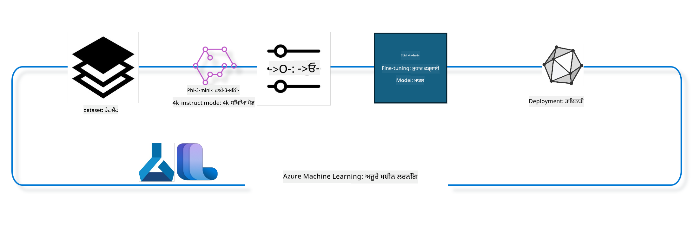

<!--
CO_OP_TRANSLATOR_METADATA:
{
  "original_hash": "944949f040e61b2ea25b3460f7394fd4",
  "translation_date": "2025-05-09T21:01:43+00:00",
  "source_file": "md/03.FineTuning/FineTuning_MLSDK.md",
  "language_code": "pa"
}
-->
## Azure ML ਸਿਸਟਮ ਰਜਿਸਟਰੀ ਤੋਂ chat-completion ਕੰਪੋਨੈਂਟਸ ਨੂੰ ਵਰਤ ਕੇ ਮਾਡਲ ਨੂੰ ਫਾਈਨ ਟਿਊਨ ਕਰਨ ਦਾ ਤਰੀਕਾ

ਇਸ ਉਦਾਹਰਨ ਵਿੱਚ ਅਸੀਂ Phi-3-mini-4k-instruct ਮਾਡਲ ਨੂੰ ਫਾਈਨ ਟਿਊਨ ਕਰਾਂਗੇ ਤਾਂ ਜੋ ultrachat_200k ਡੇਟਾਸੈੱਟ ਦੀ ਵਰਤੋਂ ਕਰਕੇ ਦੋ ਲੋਕਾਂ ਦੀ ਗੱਲਬਾਤ ਪੂਰੀ ਕੀਤੀ ਜਾ ਸਕੇ।



ਇਸ ਉਦਾਹਰਨ ਵਿੱਚ ਤੁਸੀਂ ਵੇਖੋਗੇ ਕਿ ਕਿਵੇਂ Azure ML SDK ਅਤੇ Python ਦੀ ਵਰਤੋਂ ਕਰਕੇ ਫਾਈਨ ਟਿਊਨਿੰਗ ਕੀਤੀ ਜਾਂਦੀ ਹੈ ਅਤੇ ਫਿਰ ਫਾਈਨ ਟਿਊਨ ਕੀਤਾ ਮਾਡਲ ਰੀਅਲ ਟਾਈਮ ਇੰਫਰੰਸ ਲਈ ਆਨਲਾਈਨ ਐਂਡਪੌਇੰਟ 'ਤੇ ਡਿਪਲੋਇ ਕੀਤਾ ਜਾਂਦਾ ਹੈ।

### ਟ੍ਰੇਨਿੰਗ ਡੇਟਾ

ਅਸੀਂ ultrachat_200k ਡੇਟਾਸੈੱਟ ਦੀ ਵਰਤੋਂ ਕਰਾਂਗੇ। ਇਹ UltraChat ਡੇਟਾਸੈੱਟ ਦਾ ਇੱਕ ਕਾਫੀ ਫਿਲਟਰ ਕੀਤਾ ਹੋਇਆ ਵਰਜਨ ਹੈ ਅਤੇ ਇਸ ਨਾਲ Zephyr-7B-β ਨੂੰ ਟ੍ਰੇਨ ਕੀਤਾ ਗਿਆ ਸੀ, ਜੋ ਇੱਕ ਅਗਲੇ ਦਰਜੇ ਦਾ 7b ਚੈਟ ਮਾਡਲ ਹੈ।

### ਮਾਡਲ

ਅਸੀਂ Phi-3-mini-4k-instruct ਮਾਡਲ ਦੀ ਵਰਤੋਂ ਕਰਾਂਗੇ ਤਾਂ ਜੋ ਦਿਖਾ ਸਕੀਏ ਕਿ ਕਿਸ ਤਰ੍ਹਾਂ ਯੂਜ਼ਰ ਚੈਟ-ਕੰਪਲੀਸ਼ਨ ਟਾਸਕ ਲਈ ਮਾਡਲ ਨੂੰ ਫਾਈਨ ਟਿਊਨ ਕਰ ਸਕਦਾ ਹੈ। ਜੇ ਤੁਸੀਂ ਇਹ ਨੋਟਬੁੱਕ ਕਿਸੇ ਖਾਸ ਮਾਡਲ ਕਾਰਡ ਤੋਂ ਖੋਲ੍ਹਿਆ ਹੈ, ਤਾਂ ਯਾਦ ਰੱਖੋ ਕਿ ਖਾਸ ਮਾਡਲ ਦਾ ਨਾਮ ਬਦਲੋ।

### ਟਾਸਕ

- ਫਾਈਨ ਟਿਊਨ ਕਰਨ ਲਈ ਮਾਡਲ ਚੁਣੋ।
- ਟ੍ਰੇਨਿੰਗ ਡੇਟਾ ਚੁਣੋ ਅਤੇ ਐਕਸਪਲੋਰ ਕਰੋ।
- ਫਾਈਨ ਟਿਊਨਿੰਗ ਜੌਬ ਕਨਫਿਗਰ ਕਰੋ।
- ਫਾਈਨ ਟਿਊਨਿੰਗ ਜੌਬ ਚਲਾਓ।
- ਟ੍ਰੇਨਿੰਗ ਅਤੇ ਮੁਲਾਂਕਣ ਮੈਟ੍ਰਿਕਸ ਦੀ ਸਮੀਖਿਆ ਕਰੋ।
- ਫਾਈਨ ਟਿਊਨ ਕੀਤਾ ਮਾਡਲ ਰਜਿਸਟਰ ਕਰੋ।
- ਫਾਈਨ ਟਿਊਨ ਕੀਤਾ ਮਾਡਲ ਰੀਅਲ ਟਾਈਮ ਇੰਫਰੰਸ ਲਈ ਡਿਪਲੋਇ ਕਰੋ।
- ਸਰੋਤਾਂ ਨੂੰ ਸਾਫ਼ ਕਰੋ।

## 1. ਜ਼ਰੂਰੀ ਤਿਆਰੀਆਂ ਸੈਟਅੱਪ ਕਰੋ

- ਡਿਪੈਂਡੇਨਸੀਜ਼ ਇੰਸਟਾਲ ਕਰੋ
- AzureML ਵਰਕਸਪੇਸ ਨਾਲ ਕਨੈਕਟ ਕਰੋ। SDK ਪ੍ਰਮਾਣਿਕਤਾ ਸੈਟਅੱਪ ਕਰਨ ਬਾਰੇ ਹੋਰ ਜਾਣੋ। ਹੇਠਾਂ <WORKSPACE_NAME>, <RESOURCE_GROUP> ਅਤੇ <SUBSCRIPTION_ID> ਨੂੰ ਬਦਲੋ।
- azureml ਸਿਸਟਮ ਰਜਿਸਟਰੀ ਨਾਲ ਕਨੈਕਟ ਕਰੋ
- ਇੱਕ ਵਿਕਲਪਿਕ ਐਕਸਪੇਰੀਮੈਂਟ ਨਾਮ ਸੈਟ ਕਰੋ
- ਕੰਪਿਊਟ ਚੈੱਕ ਕਰੋ ਜਾਂ ਬਣਾਓ।

> [!NOTE]  
> ਲੋੜ ਹੈ ਕਿ ਇੱਕ GPU ਨੋਡ ਵਿੱਚ ਕਈ GPU ਕਾਰਡ ਹੋ ਸਕਦੇ ਹਨ। ਉਦਾਹਰਨ ਵਜੋਂ, Standard_NC24rs_v3 ਦੇ ਇੱਕ ਨੋਡ ਵਿੱਚ 4 NVIDIA V100 GPUs ਹਨ, ਜਦਕਿ Standard_NC12s_v3 ਵਿੱਚ 2 NVIDIA V100 GPUs ਹਨ। ਇਸ ਜਾਣਕਾਰੀ ਲਈ ਡੌਕਸ ਵੇਖੋ। ਪ੍ਰਤੀ ਨੋਡ GPU ਕਾਰਡ ਦੀ ਗਿਣਤੀ ਹੇਠਾਂ ਦਿੱਤੇ param gpus_per_node ਵਿੱਚ ਸੈਟ ਕੀਤੀ ਜਾਂਦੀ ਹੈ। ਇਸ ਨੂੰ ਠੀਕ ਸੈਟ ਕਰਨ ਨਾਲ ਸਾਰੇ GPUs ਦੀ ਵਰਤੋਂ ਯਕੀਨੀ ਬਣਦੀ ਹੈ। ਸਿਫਾਰਸ਼ੀ GPU ਕੰਪਿਊਟ SKUs ਇੱਥੇ ਅਤੇ ਇੱਥੇ ਮਿਲ ਸਕਦੇ ਹਨ।

### Python ਲਾਇਬ੍ਰੇਰੀਜ਼

ਡਿਪੈਂਡੇਨਸੀਜ਼ ਇੰਸਟਾਲ ਕਰਨ ਲਈ ਹੇਠਾਂ ਦਿੱਤਾ ਕੋਡ ਚਲਾਓ। ਨਵੇਂ ਇਨਵਾਇਰਨਮੈਂਟ ਵਿੱਚ ਇਹ ਕਦਮ ਜਰੂਰੀ ਹੈ।

```bash
pip install azure-ai-ml
pip install azure-identity
pip install datasets==2.9.0
pip install mlflow
pip install azureml-mlflow
```

### Azure ML ਨਾਲ ਇੰਟਰੈਕਟ ਕਰਨਾ

1. ਇਹ Python ਸਕ੍ਰਿਪਟ Azure Machine Learning (Azure ML) ਸੇਵਾ ਨਾਲ ਇੰਟਰੈਕਟ ਕਰਨ ਲਈ ਹੈ। ਇਹ ਕੀ ਕਰਦਾ ਹੈ, ਇਹ ਹੈ:

    - ਇਹ azure.ai.ml, azure.identity, ਅਤੇ azure.ai.ml.entities ਪੈਕੇਜਾਂ ਤੋਂ ਜ਼ਰੂਰੀ ਮੋਡੀਊਲ ਇੰਪੋਰਟ ਕਰਦਾ ਹੈ। ਨਾਲ ਹੀ time ਮੋਡੀਊਲ ਵੀ ਇੰਪੋਰਟ ਹੁੰਦਾ ਹੈ।

    - ਇਹ DefaultAzureCredential() ਨਾਲ ਪ੍ਰਮਾਣਿਕਤਾ ਕਰਨ ਦੀ ਕੋਸ਼ਿਸ਼ ਕਰਦਾ ਹੈ, ਜੋ ਕਿ ਇੱਕ ਆਸਾਨ ਤਰੀਕਾ ਹੈ Azure ਕਲਾਉਡ ਵਿੱਚ ਐਪਲੀਕੇਸ਼ਨਾਂ ਨੂੰ ਤੇਜ਼ੀ ਨਾਲ ਡਿਵੈਲਪ ਕਰਨ ਲਈ। ਜੇ ਇਹ ਫੇਲ ਹੁੰਦਾ ਹੈ, ਤਾਂ ਇਹ InteractiveBrowserCredential() 'ਤੇ ਜਾਵੇਗਾ, ਜੋ ਇੰਟਰਐਕਟਿਵ ਲੋਗਿਨ ਪ੍ਰਾਂਪਟ ਦਿੰਦਾ ਹੈ।

    - ਫਿਰ ਇਹ from_config ਮੈਥਡ ਨਾਲ MLClient ਇੰਸਟੈਂਸ ਬਣਾਉਂਦਾ ਹੈ, ਜੋ ਡਿਫਾਲਟ config.json ਫਾਈਲ ਤੋਂ ਸੈਟਿੰਗਜ਼ ਲੈਂਦਾ ਹੈ। ਜੇ ਇਹ ਫੇਲ ਹੁੰਦਾ ਹੈ, ਤਾਂ subscription_id, resource_group_name ਅਤੇ workspace_name ਦੇ ਕੇ ਮੈਨੁਅਲ ਤੌਰ 'ਤੇ MLClient ਬਣਾਉਂਦਾ ਹੈ।

    - ਇਹ "azureml" ਨਾਮਕ Azure ML ਰਜਿਸਟਰੀ ਲਈ ਦੂਜਾ MLClient ਬਣਾਉਂਦਾ ਹੈ। ਇਹ ਰਜਿਸਟਰੀ ਮਾਡਲ, ਫਾਈਨ-ਟਿਊਨਿੰਗ ਪਾਈਪਲਾਈਨ ਅਤੇ ਇਨਵਾਇਰਨਮੈਂਟਾਂ ਲਈ ਹੈ।

    - ਇਹ experiment_name ਨੂੰ "chat_completion_Phi-3-mini-4k-instruct" ਸੈਟ ਕਰਦਾ ਹੈ।

    - ਇਹ ਵਰਤਮਾਨ ਸਮਾਂ (ਸੈਕਿੰਡ ਵਿੱਚ) ਨੂੰ ਇੰਟ ਤੇ ਸਟਰਿੰਗ ਵਿੱਚ ਬਦਲ ਕੇ ਇੱਕ ਵਿਲੱਖਣ ਟਾਈਮਸਟੈਂਪ ਬਣਾਉਂਦਾ ਹੈ, ਜੋ ਯੂਨੀਕ ਨਾਂਅ ਅਤੇ ਵਰਜ਼ਨ ਬਣਾਉਣ ਲਈ ਵਰਤਿਆ ਜਾ ਸਕਦਾ ਹੈ।

    ```python
    # Import necessary modules from Azure ML and Azure Identity
    from azure.ai.ml import MLClient
    from azure.identity import (
        DefaultAzureCredential,
        InteractiveBrowserCredential,
    )
    from azure.ai.ml.entities import AmlCompute
    import time  # Import time module
    
    # Try to authenticate using DefaultAzureCredential
    try:
        credential = DefaultAzureCredential()
        credential.get_token("https://management.azure.com/.default")
    except Exception as ex:  # If DefaultAzureCredential fails, use InteractiveBrowserCredential
        credential = InteractiveBrowserCredential()
    
    # Try to create an MLClient instance using the default config file
    try:
        workspace_ml_client = MLClient.from_config(credential=credential)
    except:  # If that fails, create an MLClient instance by manually providing the details
        workspace_ml_client = MLClient(
            credential,
            subscription_id="<SUBSCRIPTION_ID>",
            resource_group_name="<RESOURCE_GROUP>",
            workspace_name="<WORKSPACE_NAME>",
        )
    
    # Create another MLClient instance for the Azure ML registry named "azureml"
    # This registry is where models, fine-tuning pipelines, and environments are stored
    registry_ml_client = MLClient(credential, registry_name="azureml")
    
    # Set the experiment name
    experiment_name = "chat_completion_Phi-3-mini-4k-instruct"
    
    # Generate a unique timestamp that can be used for names and versions that need to be unique
    timestamp = str(int(time.time()))
    ```

## 2. ਫਾਈਨ ਟਿਊਨ ਕਰਨ ਲਈ ਬੁਨਿਆਦੀ ਮਾਡਲ ਚੁਣੋ

1. Phi-3-mini-4k-instruct ਇੱਕ 3.8 ਬਿਲੀਅਨ ਪੈਰਾਮੀਟਰਾਂ ਵਾਲਾ ਹਲਕਾ ਅਤੇ ਅਗਲੇ ਦਰਜੇ ਦਾ ਖੁੱਲ੍ਹਾ ਮਾਡਲ ਹੈ ਜੋ Phi-2 ਲਈ ਵਰਤੇ ਗਏ ਡੇਟਾਸੈੱਟਸ 'ਤੇ ਬਣਿਆ ਹੈ। ਇਹ ਮਾਡਲ Phi-3 ਪਰਿਵਾਰ ਦਾ ਹੈ, ਅਤੇ Mini ਵਰਜਨ ਦੋ ਕਿਸਮਾਂ ਵਿੱਚ ਮਿਲਦਾ ਹੈ: 4K ਅਤੇ 128K, ਜੋ ਕਾਂਟੈਕਸਟ ਲੰਬਾਈ (ਟੋਕਨਜ਼ ਵਿੱਚ) ਦੱਸਦਾ ਹੈ। ਸਾਡੇ ਖਾਸ ਉਦੇਸ਼ ਲਈ ਇਸ ਨੂੰ ਫਾਈਨ ਟਿਊਨ ਕਰਨ ਦੀ ਲੋੜ ਹੈ। ਤੁਸੀਂ ਇਹ ਮਾਡਲ AzureML Studio ਦੇ Model Catalog ਵਿੱਚ chat-completion ਟਾਸਕ ਦੇ ਫਿਲਟਰ ਨਾਲ ਵੇਖ ਸਕਦੇ ਹੋ। ਇਸ ਉਦਾਹਰਨ ਵਿੱਚ ਅਸੀਂ Phi-3-mini-4k-instruct ਵਰਤ ਰਹੇ ਹਾਂ। ਜੇ ਤੁਸੀਂ ਇਹ ਨੋਟਬੁੱਕ ਕਿਸੇ ਹੋਰ ਮਾਡਲ ਲਈ ਖੋਲ੍ਹਿਆ ਹੈ, ਤਾਂ ਮਾਡਲ ਦਾ ਨਾਮ ਅਤੇ ਵਰਜ਼ਨ ਬਦਲੋ।

    > [!NOTE]  
    > ਮਾਡਲ ਦਾ id ਪ੍ਰਾਪਰਟੀ ਜੋ ਫਾਈਨ ਟਿਊਨਿੰਗ ਜੌਬ ਵਿੱਚ ਇਨਪੁੱਟ ਵਜੋਂ ਦਿੱਤੀ ਜਾਵੇਗੀ। ਇਹ AzureML Studio Model Catalog ਵਿੱਚ Asset ID ਫੀਲਡ ਵਜੋਂ ਵੀ ਮਿਲਦੀ ਹੈ।

2. ਇਹ Python ਸਕ੍ਰਿਪਟ Azure Machine Learning (Azure ML) ਸੇਵਾ ਨਾਲ ਇੰਟਰੈਕਟ ਕਰਦਾ ਹੈ। ਇਹ ਕੀ ਕਰਦਾ ਹੈ:

    - model_name ਨੂੰ "Phi-3-mini-4k-instruct" ਸੈਟ ਕਰਦਾ ਹੈ।

    - registry_ml_client ਦੀ models ਪ੍ਰਾਪਰਟੀ ਦੇ get ਮੈਥਡ ਨਾਲ ਇਸ ਨਾਮ ਵਾਲੇ ਮਾਡਲ ਦਾ ਨਵਾਂ ਵਰਜ਼ਨ Azure ML ਰਜਿਸਟਰੀ ਤੋਂ ਲਿਆਉਂਦਾ ਹੈ। get ਮੈਥਡ ਨੂੰ ਦੋ ਆਰਗੂਮੈਂਟ ਦਿੱਤੇ ਜਾਂਦੇ ਹਨ: ਮਾਡਲ ਦਾ ਨਾਮ ਅਤੇ ਲੇਬਲ ਜੋ ਦੱਸਦਾ ਹੈ ਕਿ ਨਵਾਂ ਵਰਜ਼ਨ ਲਿਆਉਣਾ ਹੈ।

    - ਕਨਸੋਲ ਵਿੱਚ ਪ੍ਰਿੰਟ ਕਰਦਾ ਹੈ ਕਿ ਕਿਹੜਾ ਮਾਡਲ ਨਾਮ, ਵਰਜ਼ਨ ਅਤੇ id ਫਾਈਨ-ਟਿਊਨ ਲਈ ਵਰਤਿਆ ਜਾਵੇਗਾ। ਇਹ ਸੂਚਨਾ foundation_model ਦੇ ਪ੍ਰਾਪਰਟੀਜ਼ ਤੋਂ ਲੈ ਕੇ ਪ੍ਰਿੰਟ ਕੀਤੀ ਜਾਂਦੀ ਹੈ।

    ```python
    # Set the model name
    model_name = "Phi-3-mini-4k-instruct"
    
    # Get the latest version of the model from the Azure ML registry
    foundation_model = registry_ml_client.models.get(model_name, label="latest")
    
    # Print the model name, version, and id
    # This information is useful for tracking and debugging
    print(
        "\n\nUsing model name: {0}, version: {1}, id: {2} for fine tuning".format(
            foundation_model.name, foundation_model.version, foundation_model.id
        )
    )
    ```

## 3. ਜੌਬ ਲਈ ਕੰਪਿਊਟ ਬਣਾਓ

ਫਾਈਨ ਟਿਊਨ ਜੌਬ ਸਿਰਫ GPU ਕੰਪਿਊਟ ਨਾਲ ਹੀ ਚਲਦਾ ਹੈ। ਕੰਪਿਊਟ ਦਾ ਆਕਾਰ ਮਾਡਲ ਦੇ ਆਕਾਰ 'ਤੇ ਨਿਰਭਰ ਕਰਦਾ ਹੈ ਅਤੇ ਜ਼ਿਆਦਾਤਰ ਮਾਮਲਿਆਂ ਵਿੱਚ ਸਹੀ ਕੰਪਿਊਟ ਚੁਣਨਾ ਔਖਾ ਹੁੰਦਾ ਹੈ। ਇਸ ਕੋਡ ਵਿੱਚ ਅਸੀਂ ਯੂਜ਼ਰ ਨੂੰ ਸਹੀ ਕੰਪਿਊਟ ਚੁਣਨ ਲਈ ਗਾਈਡ ਕਰਦੇ ਹਾਂ।

> [!NOTE]  
> ਹੇਠਾਂ ਦਿੱਤੇ ਕੰਪਿਊਟ ਸਭ ਤੋਂ ਵਧੀਆ ਕਨਫਿਗਰੇਸ਼ਨ ਨਾਲ ਕੰਮ ਕਰਦੇ ਹਨ। ਕਿਸੇ ਵੀ ਤਬਦੀਲੀ ਨਾਲ Cuda Out Of Memory ਦੀ ਗਲਤੀ ਆ ਸਕਦੀ ਹੈ। ਇਸ ਲਈ ਜੇ ਗਲਤੀ ਆਵੇ ਤਾਂ ਕੰਪਿਊਟ ਨੂੰ ਵੱਡੇ ਆਕਾਰ ਵਿੱਚ ਅੱਪਗ੍ਰੇਡ ਕਰਨ ਦੀ ਕੋਸ਼ਿਸ਼ ਕਰੋ।

> [!NOTE]  
> compute_cluster_size ਚੁਣਦੇ ਸਮੇਂ ਇਹ ਯਕੀਨੀ ਬਣਾਓ ਕਿ ਕੰਪਿਊਟ ਤੁਹਾਡੇ ਰਿਸੋਰਸ ਗਰੁੱਪ ਵਿੱਚ ਉਪਲਬਧ ਹੈ। ਜੇ ਕੋਈ ਖਾਸ ਕੰਪਿਊਟ ਉਪਲਬਧ ਨਹੀਂ ਹੈ ਤਾਂ ਉਸ ਲਈ ਅਨੁਰੋਧ ਕਰ ਸਕਦੇ ਹੋ।

### ਫਾਈਨ ਟਿਊਨ ਸਪੋਰਟ ਲਈ ਮਾਡਲ ਚੈੱਕ ਕਰਨਾ

1. ਇਹ Python ਸਕ੍ਰਿਪਟ Azure ML ਮਾਡਲ ਨਾਲ ਇੰਟਰੈਕਟ ਕਰਦਾ ਹੈ। ਇਹ ਕੀ ਕਰਦਾ ਹੈ:

    - ast ਮੋਡੀਊਲ ਇੰਪੋਰਟ ਕਰਦਾ ਹੈ, ਜੋ Python ਅਬਸਟ੍ਰੈਕਟ ਸਿੰਟੈਕਸ ਟ੍ਰੀ ਪ੍ਰੋਸੈਸ ਕਰਨ ਲਈ ਹੈ।

    - ਚੈੱਕ ਕਰਦਾ ਹੈ ਕਿ foundation_model ਵਿੱਚ finetune_compute_allow_list ਨਾਮਕ ਟੈਗ ਹੈ ਜਾਂ ਨਹੀਂ। Azure ML ਵਿੱਚ ਟੈਗ ਕੀ-ਵੈਲਿਊ ਜੋੜੇ ਹੁੰਦੇ ਹਨ ਜੋ ਮਾਡਲ ਫਿਲਟਰ ਕਰਨ ਲਈ ਵਰਤੇ ਜਾਂਦੇ ਹਨ।

    - ਜੇ finetune_compute_allow_list ਟੈਗ ਹੈ, ਤਾਂ ast.literal_eval ਨਾਲ ਇਸਦੀ value ਨੂੰ ਸੁਰੱਖਿਅਤ ਤਰੀਕੇ ਨਾਲ Python ਲਿਸਟ ਵਿੱਚ ਬਦਲਦਾ ਹੈ ਅਤੇ computes_allow_list ਵਿੱਚ ਰੱਖਦਾ ਹੈ। ਫਿਰ ਸੁਨੇਹਾ ਪ੍ਰਿੰਟ ਕਰਦਾ ਹੈ ਕਿ ਇਸ ਲਿਸਟ ਵਿੱਚੋਂ ਕੰਪਿਊਟ ਬਣਾਓ।

    - ਜੇ ਟੈਗ ਨਹੀਂ ਹੈ, ਤਾਂ computes_allow_list ਨੂੰ None ਕਰਦਾ ਹੈ ਅਤੇ ਸੁਨੇਹਾ ਦਿੰਦਾ ਹੈ ਕਿ ਇਹ ਟੈਗ ਮਾਡਲ ਦੇ ਟੈਗਜ਼ ਵਿੱਚ ਨਹੀਂ ਹੈ।

    - ਖ਼ੁਲਾਸਾ, ਇਹ ਸਕ੍ਰਿਪਟ ਮਾਡਲ ਦੀ ਮੈਟਾਡੇਟਾ ਵਿੱਚ ਇੱਕ ਖਾਸ ਟੈਗ ਲੱਭਦਾ ਹੈ, ਜੇ ਹੈ ਤਾਂ ਉਸਦੀ value ਨੂੰ ਲਿਸਟ ਵਿੱਚ ਬਦਲਦਾ ਹੈ ਅਤੇ ਯੂਜ਼ਰ ਨੂੰ ਜਾਣਕਾਰੀ ਦਿੰਦਾ ਹੈ।

    ```python
    # Import the ast module, which provides functions to process trees of the Python abstract syntax grammar
    import ast
    
    # Check if the 'finetune_compute_allow_list' tag is present in the model's tags
    if "finetune_compute_allow_list" in foundation_model.tags:
        # If the tag is present, use ast.literal_eval to safely parse the tag's value (a string) into a Python list
        computes_allow_list = ast.literal_eval(
            foundation_model.tags["finetune_compute_allow_list"]
        )  # convert string to python list
        # Print a message indicating that a compute should be created from the list
        print(f"Please create a compute from the above list - {computes_allow_list}")
    else:
        # If the tag is not present, set computes_allow_list to None
        computes_allow_list = None
        # Print a message indicating that the 'finetune_compute_allow_list' tag is not part of the model's tags
        print("`finetune_compute_allow_list` is not part of model tags")
    ```

### ਕੰਪਿਊਟ ਇੰਸਟੈਂਸ ਚੈੱਕ ਕਰਨਾ

1. ਇਹ Python ਸਕ੍ਰਿਪਟ Azure ML ਸੇਵਾ ਨਾਲ ਕੰਪਿਊਟ ਇੰਸਟੈਂਸ ਦੀ ਚੈੱਕਿੰਗ ਕਰਦਾ ਹੈ। ਇਹ ਕੀ ਕਰਦਾ ਹੈ:

    - compute_cluster ਵਿੱਚ ਸਟੋਰ ਕੀਤੇ ਨਾਮ ਵਾਲਾ ਕੰਪਿਊਟ ਇੰਸਟੈਂਸ ਵਰਕਸਪੇਸ ਤੋਂ ਲੱਭਦਾ ਹੈ। ਜੇ ਇਸਦਾ provisioning state "failed" ਹੈ, ਤਾਂ ValueError ਉਠਾਉਂਦਾ ਹੈ।

    - ਜੇ computes_allow_list None ਨਹੀਂ ਹੈ, ਤਾਂ ਸਾਰੀ ਲਿਸਟ ਦੇ ਕੰਪਿਊਟ ਸਾਈਜ਼ ਲੋਅਰਕੇਸ ਕਰਕੇ ਵੇਖਦਾ ਹੈ ਕਿ ਮੌਜੂਦਾ ਕੰਪਿਊਟ ਸਾਈਜ਼ ਇਸ ਵਿੱਚ ਹੈ ਜਾਂ ਨਹੀਂ। ਨਹੀਂ ਹੋਣ 'ਤੇ ValueError ਦਿੰਦਾ ਹੈ।

    - ਜੇ computes_allow_list None ਹੈ, ਤਾਂ ਇਹ ਵੇਖਦਾ ਹੈ ਕਿ ਮੌਜੂਦਾ ਕੰਪਿਊਟ ਸਾਈਜ਼ unsupported GPU VM ਸਾਈਜ਼ਾਂ ਦੀ ਲਿਸਟ ਵਿੱਚ ਹੈ ਜਾਂ ਨਹੀਂ। ਜੇ ਹੈ, ਤਾਂ ValueError ਦਿੰਦਾ ਹੈ।

    - ਵਰਕਸਪੇਸ ਵਿੱਚ ਉਪਲਬਧ ਸਾਰੇ ਕੰਪਿਊਟ ਸਾਈਜ਼ ਲਿਸਟ ਲੈਂਦਾ ਹੈ। ਫਿਰ ਹਰ ਇੱਕ ਸਾਈਜ਼ ਲਈ ਵੇਖਦਾ ਹੈ ਕਿ ਇਹ ਮੌਜੂਦਾ ਕੰਪਿਊਟ ਦੇ ਸਾਈਜ਼ ਨਾਲ ਮੇਲ ਖਾਂਦਾ ਹੈ ਜਾਂ ਨਹੀਂ। ਜੇ ਮਿਲਦਾ ਹੈ, ਤਾਂ ਉਸ ਕੰਪਿਊਟ ਸਾਈਜ਼ ਵਿੱਚ GPU ਦੀ ਗਿਣਤੀ ਲੈਂਦਾ ਹੈ ਅਤੇ gpu_count_found ਨੂੰ True ਕਰਦਾ ਹੈ।

    - ਜੇ gpu_count_found True ਹੈ, ਤਾਂ GPU ਦੀ ਗਿਣਤੀ ਪ੍ਰਿੰਟ ਕਰਦਾ ਹੈ। ਨਹੀਂ ਤਾਂ ValueError ਦਿੰਦਾ ਹੈ।

    - ਸਾਰਾਂਖ, ਇਹ ਸਕ੍ਰਿਪਟ Azure ML ਵਰਕਸਪੇਸ ਵਿੱਚ ਕੰਪਿਊਟ ਇੰਸਟੈਂਸ ਦੇ provisioning state, ਸਾਈਜ਼ ਅਤੇ GPU ਗਿਣਤੀ ਦੀ ਜਾਂਚ ਕਰਦਾ ਹੈ।

    ```python
    # Print the exception message
    print(e)
    # Raise a ValueError if the compute size is not available in the workspace
    raise ValueError(
        f"WARNING! Compute size {compute_cluster_size} not available in workspace"
    )
    
    # Retrieve the compute instance from the Azure ML workspace
    compute = workspace_ml_client.compute.get(compute_cluster)
    # Check if the provisioning state of the compute instance is "failed"
    if compute.provisioning_state.lower() == "failed":
        # Raise a ValueError if the provisioning state is "failed"
        raise ValueError(
            f"Provisioning failed, Compute '{compute_cluster}' is in failed state. "
            f"please try creating a different compute"
        )
    
    # Check if computes_allow_list is not None
    if computes_allow_list is not None:
        # Convert all compute sizes in computes_allow_list to lowercase
        computes_allow_list_lower_case = [x.lower() for x in computes_allow_list]
        # Check if the size of the compute instance is in computes_allow_list_lower_case
        if compute.size.lower() not in computes_allow_list_lower_case:
            # Raise a ValueError if the size of the compute instance is not in computes_allow_list_lower_case
            raise ValueError(
                f"VM size {compute.size} is not in the allow-listed computes for finetuning"
            )
    else:
        # Define a list of unsupported GPU VM sizes
        unsupported_gpu_vm_list = [
            "standard_nc6",
            "standard_nc12",
            "standard_nc24",
            "standard_nc24r",
        ]
        # Check if the size of the compute instance is in unsupported_gpu_vm_list
        if compute.size.lower() in unsupported_gpu_vm_list:
            # Raise a ValueError if the size of the compute instance is in unsupported_gpu_vm_list
            raise ValueError(
                f"VM size {compute.size} is currently not supported for finetuning"
            )
    
    # Initialize a flag to check if the number of GPUs in the compute instance has been found
    gpu_count_found = False
    # Retrieve a list of all available compute sizes in the workspace
    workspace_compute_sku_list = workspace_ml_client.compute.list_sizes()
    available_sku_sizes = []
    # Iterate over the list of available compute sizes
    for compute_sku in workspace_compute_sku_list:
        available_sku_sizes.append(compute_sku.name)
        # Check if the name of the compute size matches the size of the compute instance
        if compute_sku.name.lower() == compute.size.lower():
            # If it does, retrieve the number of GPUs for that compute size and set gpu_count_found to True
            gpus_per_node = compute_sku.gpus
            gpu_count_found = True
    # If gpu_count_found is True, print the number of GPUs in the compute instance
    if gpu_count_found:
        print(f"Number of GPU's in compute {compute.size}: {gpus_per_node}")
    else:
        # If gpu_count_found is False, raise a ValueError
        raise ValueError(
            f"Number of GPU's in compute {compute.size} not found. Available skus are: {available_sku_sizes}."
            f"This should not happen. Please check the selected compute cluster: {compute_cluster} and try again."
        )
    ```

## 4. ਮਾਡਲ ਲਈ ਫਾਈਨ-ਟਿਊਨਿੰਗ ਡੇਟਾਸੈੱਟ ਚੁਣੋ

1. ਅਸੀਂ ultrachat_200k ਡੇਟਾਸੈੱਟ ਵਰਤਦੇ ਹਾਂ। ਇਸ ਡੇਟਾਸੈੱਟ ਵਿੱਚ ਚਾਰ ਸਪਲਿਟ ਹਨ, ਜੋ Supervised fine-tuning (sft) ਲਈ موزوں ਹਨ। ਜਨਰੇਸ਼ਨ ਰੈਂਕਿੰਗ (gen)। ਹਰ ਸਪਲਿਟ ਵਿੱਚ ਉਦਾਹਰਨਾਂ ਦੀ ਗਿਣਤੀ ਹੇਠਾਂ ਦਿੱਤੀ ਗਈ ਹੈ:

    ```bash
    train_sft test_sft  train_gen  test_gen
    207865  23110  256032  28304
    ```

1. ਅਗਲੇ ਕੁਝ ਸੈੱਲ ਫਾਈਨ ਟਿਊਨ ਲਈ ਬੁਨਿਆਦੀ ਡੇਟਾ ਤਿਆਰ ਕਰਨ ਦਿਖਾਉਂਦੇ ਹਨ:

### ਕੁਝ ਡੇਟਾ ਰੋਜ਼ ਵਿਖਾਓ

ਅਸੀਂ ਚਾਹੁੰਦੇ ਹਾਂ ਕਿ ਇਹ ਸੈਂਪਲ ਜਲਦੀ ਚੱਲੇ, ਇਸ ਲਈ train_sft ਅਤੇ test_sft ਫਾਈਲਾਂ ਸਿਰਫ 5% ਕੱਟੇ ਹੋਏ ਡੇਟਾ ਰੋਜ਼ ਰੱਖਦੀਆਂ ਹਨ। ਇਸ ਕਰਕੇ ਫਾਈਨ ਟਿਊਨ ਕੀਤਾ ਮਾਡਲ ਘੱਟ ਸਹੀ ਹੋਵੇਗਾ, ਇਸ ਲਈ ਇਸਨੂੰ ਅਸਲੀ ਵਰਤੋਂ ਵਿੱਚ ਨਾ ਲਿਆ ਜਾਵੇ।  
download-dataset.py ਸਕ੍ਰਿਪਟ ultrachat_200k ਡੇਟਾਸੈੱਟ ਡਾਊਨਲੋਡ ਅਤੇ ਫਾਈਨਟਿਊਨ ਪਾਈਪਲਾਈਨ ਕੰਪੋਨੈਂਟ ਲਈ ਫਾਰਮੈਟ ਵਿੱਚ ਬਦਲਣ ਲਈ ਵਰਤਿਆ ਜਾਂਦਾ ਹੈ। ਡੇਟਾਸੈੱਟ ਵੱਡਾ ਹੋਣ ਕਰਕੇ ਸਿਰਫ ਹਿੱਸਾ ਹੀ ਇੱਥੇ ਹੈ।

1. ਹੇਠਾਂ ਦਿੱਤਾ ਸਕ੍ਰਿਪਟ ਸਿਰਫ 5% ਡੇਟਾ ਡਾਊਨਲੋਡ ਕਰਦਾ ਹੈ। ਇਹ dataset_split_pc ਪੈਰਾਮੀਟਰ ਬਦਲ ਕੇ ਵਧਾਇਆ ਜਾ ਸਕਦਾ ਹੈ।

    > [!NOTE]  
    > ਕੁਝ ਭਾਸ਼ਾ ਮਾਡਲਾਂ ਦੇ ਵੱਖ-ਵੱਖ ਭਾਸ਼ਾ ਕੋਡ ਹੁੰਦੇ ਹਨ, ਇਸ ਲਈ ਡੇਟਾਸੈੱਟ ਵਿੱਚ ਕਾਲਮ ਦੇ ਨਾਮ ਭਾਸ਼ਾ ਦੇ ਅਨੁਸਾਰ ਹੋਣੇ ਚਾਹੀਦੇ ਹਨ।

1. ਡੇਟਾ ਇਸ ਤਰ੍ਹਾਂ ਦਾ ਹੋਣਾ ਚਾਹੀਦਾ ਹੈ:  
ਚੈਟ-ਕੰਪਲੀਸ਼ਨ ਡੇਟਾਸੈੱਟ parquet ਫਾਰਮੈਟ ਵਿੱਚ ਹੈ, ਜਿਸ ਵਿੱਚ ਹਰ ਐਂਟਰੀ ਹੇਠਾਂ ਦਿੱਤੇ ਸਕੀਮਾ ਅਨੁਸਾਰ ਹੁੰਦੀ ਹੈ:

    - ਇਹ ਇੱਕ JSON (JavaScript Object Notation) ਦਸਤਾਵੇਜ਼ ਹੈ, ਜੋ ਡੇਟਾ ਸਾਂਝਾ ਕਰਨ ਲਈ ਵਰਤਿਆ ਜਾਂਦਾ ਹੈ। ਇਹ executable ਕੋਡ ਨਹੀਂ, ਸਿਰਫ ਡੇਟਾ ਸਟੋਰ ਕਰਨ ਦਾ ਤਰੀਕਾ ਹੈ।

    - "prompt": ਇਹ ਕੁੰਜੀ ਇੱਕ ਸਤਰ ਰੱਖਦੀ ਹੈ ਜੋ AI ਸਹਾਇਕ ਨੂੰ ਦਿੱਤਾ ਗਿਆ ਟਾਸਕ ਜਾਂ ਸਵਾਲ ਦਰਸਾਉਂਦੀ ਹੈ।

    - "messages": ਇਹ ਕੁੰਜੀ ਇਕ ਆਬਜੈਕਟਾਂ ਦੀ ਲੜੀ ਰੱਖਦੀ ਹੈ। ਹਰ ਆਬਜੈਕਟ ਗੱਲਬਾਤ ਵਿੱਚ ਇਕ ਸੁਨੇਹਾ ਹੈ ਜੋ ਯੂਜ਼ਰ ਅਤੇ AI ਸਹਾਇਕ ਵਿੱਚ ਹੁੰਦਾ ਹੈ। ਹਰ ਸੁਨੇਹੇ ਵਿੱਚ ਦੋ ਕੁੰਜੀਆਂ ਹੁੰਦੀਆਂ ਹਨ:

        - "content": ਸੁਨੇਹੇ ਦੀ ਸਤਰ
        - "role": ਸੁਨੇਹਾ ਭੇਜਣ ਵਾਲੇ ਦੀ ਭੂਮਿਕਾ, ਜੋ "user" ਜਾਂ "assistant" ਹੋ ਸਕਦੀ ਹੈ।

    - "prompt_id": ਪ੍ਰੋਮਪਟ ਲਈ ਵਿਲੱਖਣ ਪਹਿਚਾਣਕ ਨੰਬਰ।

1. ਇਸ ਖਾਸ JSON ਦਸਤਾਵੇਜ਼ ਵਿੱਚ, ਇੱਕ ਗੱਲਬਾਤ ਦਿਖਾਈ ਗਈ ਹੈ ਜਿੱਥੇ ਯੂਜ਼ਰ AI ਸਹਾਇਕ ਨੂੰ dystopian ਕਹਾਣੀ ਲਈ ਪ੍ਰੋਟੈਗਨਿਸਟ ਬਣਾਉਣ ਲਈ ਕਹਿੰਦਾ ਹੈ। ਸਹਾਇਕ ਜਵਾਬ ਦਿੰਦਾ ਹੈ, ਫਿਰ ਯੂਜ਼ਰ ਹੋਰ ਜਾਣਕਾਰੀ ਮੰਗਦਾ ਹੈ ਅਤੇ ਸਹਾਇਕ ਹੋਰ ਵੇਰਵੇ ਦੇਣ ਲਈ ਤਿਆਰ ਹੈ। ਇਹ
training pipeline ਵੱਖ-ਵੱਖ ਪੈਰਾਮੀਟਰਾਂ ਦੇ ਆਧਾਰ 'ਤੇ ਬਣਾਈ ਜਾਂਦੀ ਹੈ, ਅਤੇ ਫਿਰ ਇਸ ਡਿਸਪਲੇ ਨਾਮ ਨੂੰ ਪ੍ਰਿੰਟ ਕੀਤਾ ਜਾਂਦਾ ਹੈ। ```python
    # Define a function to generate a display name for the training pipeline
    def get_pipeline_display_name():
        # Calculate the total batch size by multiplying the per-device batch size, the number of gradient accumulation steps, the number of GPUs per node, and the number of nodes used for fine-tuning
        batch_size = (
            int(finetune_parameters.get("per_device_train_batch_size", 1))
            * int(finetune_parameters.get("gradient_accumulation_steps", 1))
            * int(gpus_per_node)
            * int(finetune_parameters.get("num_nodes_finetune", 1))
        )
        # Retrieve the learning rate scheduler type
        scheduler = finetune_parameters.get("lr_scheduler_type", "linear")
        # Retrieve whether DeepSpeed is applied
        deepspeed = finetune_parameters.get("apply_deepspeed", "false")
        # Retrieve the DeepSpeed stage
        ds_stage = finetune_parameters.get("deepspeed_stage", "2")
        # If DeepSpeed is applied, include "ds" followed by the DeepSpeed stage in the display name; if not, include "nods"
        if deepspeed == "true":
            ds_string = f"ds{ds_stage}"
        else:
            ds_string = "nods"
        # Retrieve whether Layer-wise Relevance Propagation (LoRa) is applied
        lora = finetune_parameters.get("apply_lora", "false")
        # If LoRa is applied, include "lora" in the display name; if not, include "nolora"
        if lora == "true":
            lora_string = "lora"
        else:
            lora_string = "nolora"
        # Retrieve the limit on the number of model checkpoints to keep
        save_limit = finetune_parameters.get("save_total_limit", -1)
        # Retrieve the maximum sequence length
        seq_len = finetune_parameters.get("max_seq_length", -1)
        # Construct the display name by concatenating all these parameters, separated by hyphens
        return (
            model_name
            + "-"
            + "ultrachat"
            + "-"
            + f"bs{batch_size}"
            + "-"
            + f"{scheduler}"
            + "-"
            + ds_string
            + "-"
            + lora_string
            + f"-save_limit{save_limit}"
            + f"-seqlen{seq_len}"
        )
    
    # Call the function to generate the display name
    pipeline_display_name = get_pipeline_display_name()
    # Print the display name
    print(f"Display name used for the run: {pipeline_display_name}")
    ```

### Pipeline ਨੂੰ ਕਨਫਿਗਰ ਕਰਨਾ

ਇਹ Python ਸਕ੍ਰਿਪਟ Azure Machine Learning SDK ਦੀ ਵਰਤੋਂ ਕਰਕੇ ਇੱਕ ਮਸ਼ੀਨ ਲਰਨਿੰਗ pipeline ਨੂੰ ਪਰਿਭਾਸ਼ਿਤ ਅਤੇ ਕਨਫਿਗਰ ਕਰ ਰਹੀ ਹੈ। ਇਹਦਾ ਵੇਰਵਾ ਇਸ ਤਰ੍ਹਾਂ ਹੈ:

1. ਇਹ Azure AI ML SDK ਤੋਂ ਜਰੂਰੀ ਮੋਡੀਊਲ ਇੰਪੋਰਟ ਕਰਦਾ ਹੈ।

1. ਇਹ ਰਜਿਸਟਰੀ ਤੋਂ "chat_completion_pipeline" ਨਾਮਕ pipeline ਕੰਪੋਨੈਂਟ ਨੂੰ ਫੈਚ ਕਰਦਾ ਹੈ।

1. ਇਹ `@pipeline` decorator and the function `create_pipeline`. The name of the pipeline is set to `pipeline_display_name`.

1. Inside the `create_pipeline` function, it initializes the fetched pipeline component with various parameters, including the model path, compute clusters for different stages, dataset splits for training and testing, the number of GPUs to use for fine-tuning, and other fine-tuning parameters.

1. It maps the output of the fine-tuning job to the output of the pipeline job. This is done so that the fine-tuned model can be easily registered, which is required to deploy the model to an online or batch endpoint.

1. It creates an instance of the pipeline by calling the `create_pipeline` function.

1. It sets the `force_rerun` setting of the pipeline to `True`, meaning that cached results from previous jobs will not be used.

1. It sets the `continue_on_step_failure` setting of the pipeline to `False` ਦੀ ਵਰਤੋਂ ਕਰਕੇ pipeline ਜੌਬ ਪਰਿਭਾਸ਼ਿਤ ਕਰਦਾ ਹੈ, ਜਿਸਦਾ ਮਤਲਬ ਹੈ ਕਿ ਜੇ ਕਿਸੇ ਵੀ ਸਟੈਪ ਵਿੱਚ ਫੇਲ੍ਹ ਹੁੰਦਾ ਹੈ ਤਾਂ pipeline ਰੁਕ ਜਾਵੇਗੀ।

1. ਸੰਖੇਪ ਵਿੱਚ, ਇਹ ਸਕ੍ਰਿਪਟ Azure Machine Learning SDK ਦੀ ਵਰਤੋਂ ਕਰਕੇ ਚੈਟ ਕੰਪਲੀਸ਼ਨ ਟਾਸਕ ਲਈ ਮਸ਼ੀਨ ਲਰਨਿੰਗ pipeline ਨੂੰ ਪਰਿਭਾਸ਼ਿਤ ਅਤੇ ਕਨਫਿਗਰ ਕਰ ਰਹੀ ਹੈ।

```python
    # Import necessary modules from the Azure AI ML SDK
    from azure.ai.ml.dsl import pipeline
    from azure.ai.ml import Input
    
    # Fetch the pipeline component named "chat_completion_pipeline" from the registry
    pipeline_component_func = registry_ml_client.components.get(
        name="chat_completion_pipeline", label="latest"
    )
    
    # Define the pipeline job using the @pipeline decorator and the function create_pipeline
    # The name of the pipeline is set to pipeline_display_name
    @pipeline(name=pipeline_display_name)
    def create_pipeline():
        # Initialize the fetched pipeline component with various parameters
        # These include the model path, compute clusters for different stages, dataset splits for training and testing, the number of GPUs to use for fine-tuning, and other fine-tuning parameters
        chat_completion_pipeline = pipeline_component_func(
            mlflow_model_path=foundation_model.id,
            compute_model_import=compute_cluster,
            compute_preprocess=compute_cluster,
            compute_finetune=compute_cluster,
            compute_model_evaluation=compute_cluster,
            # Map the dataset splits to parameters
            train_file_path=Input(
                type="uri_file", path="./ultrachat_200k_dataset/train_sft.jsonl"
            ),
            test_file_path=Input(
                type="uri_file", path="./ultrachat_200k_dataset/test_sft.jsonl"
            ),
            # Training settings
            number_of_gpu_to_use_finetuning=gpus_per_node,  # Set to the number of GPUs available in the compute
            **finetune_parameters
        )
        return {
            # Map the output of the fine tuning job to the output of pipeline job
            # This is done so that we can easily register the fine tuned model
            # Registering the model is required to deploy the model to an online or batch endpoint
            "trained_model": chat_completion_pipeline.outputs.mlflow_model_folder
        }
    
    # Create an instance of the pipeline by calling the create_pipeline function
    pipeline_object = create_pipeline()
    
    # Don't use cached results from previous jobs
    pipeline_object.settings.force_rerun = True
    
    # Set continue on step failure to False
    # This means that the pipeline will stop if any step fails
    pipeline_object.settings.continue_on_step_failure = False
    ```

### ਜੌਬ ਸਬਮਿਟ ਕਰਨਾ

1. ਇਹ Python ਸਕ੍ਰਿਪਟ Azure Machine Learning ਵਰਕਸਪੇਸ ਨੂੰ ਮਸ਼ੀਨ ਲਰਨਿੰਗ pipeline ਜੌਬ ਸਬਮਿਟ ਕਰ ਰਿਹਾ ਹੈ ਅਤੇ ਫਿਰ ਜੌਬ ਦੇ ਪੂਰਾ ਹੋਣ ਦੀ ਉਡੀਕ ਕਰ ਰਿਹਾ ਹੈ। ਇਹਦਾ ਵੇਰਵਾ:

- ਇਹ workspace_ml_client ਦੇ jobs ਓਬਜੈਕਟ ਦੀ create_or_update ਮੈਥਡ ਨੂੰ ਕਾਲ ਕਰਕੇ pipeline ਜੌਬ ਸਬਮਿਟ ਕਰਦਾ ਹੈ। ਚਲਾਈ ਜਾਣ ਵਾਲੀ pipeline pipeline_object ਨਾਲ ਦਰਸਾਈ ਜਾਂਦੀ ਹੈ ਅਤੇ ਜੌਬ ਕਿਸ ਐਕਸਪੀਰੀਮੈਂਟ ਹੇਠ ਚਲਾਇਆ ਜਾ ਰਿਹਾ ਹੈ ਉਹ experiment_name ਨਾਲ ਦਿੱਤਾ ਗਿਆ ਹੈ।

- ਫਿਰ ਇਹ workspace_ml_client ਦੇ jobs ਓਬਜੈਕਟ ਦੀ stream ਮੈਥਡ ਨੂੰ ਕਾਲ ਕਰਦਾ ਹੈ ਤਾਂ ਜੋ pipeline ਜੌਬ ਦੇ ਪੂਰਾ ਹੋਣ ਦੀ ਉਡੀਕ ਕਰ ਸਕੇ। ਜੌਬ ਜਿਸ ਦੀ ਉਡੀਕ ਕੀਤੀ ਜਾ ਰਹੀ ਹੈ ਉਹ pipeline_job ਦੇ name ਐਟ੍ਰਿਬਿਊਟ ਨਾਲ ਦਿੱਤਾ ਗਿਆ ਹੈ।

- ਸੰਖੇਪ ਵਿੱਚ, ਇਹ ਸਕ੍ਰਿਪਟ Azure Machine Learning ਵਰਕਸਪੇਸ ਨੂੰ ਮਸ਼ੀਨ ਲਰਨਿੰਗ pipeline ਜੌਬ ਸਬਮਿਟ ਕਰ ਰਿਹਾ ਹੈ ਅਤੇ ਫਿਰ ਜੌਬ ਦੇ ਪੂਰਾ ਹੋਣ ਦੀ ਉਡੀਕ ਕਰ ਰਿਹਾ ਹੈ।

```python
    # Submit the pipeline job to the Azure Machine Learning workspace
    # The pipeline to be run is specified by pipeline_object
    # The experiment under which the job is run is specified by experiment_name
    pipeline_job = workspace_ml_client.jobs.create_or_update(
        pipeline_object, experiment_name=experiment_name
    )
    
    # Wait for the pipeline job to complete
    # The job to wait for is specified by the name attribute of the pipeline_job object
    workspace_ml_client.jobs.stream(pipeline_job.name)
    ```

## 6. ਫਾਈਨ-ਟਿਊਨ ਕੀਤੇ ਮਾਡਲ ਨੂੰ ਵਰਕਸਪੇਸ ਨਾਲ ਰਜਿਸਟਰ ਕਰਨਾ

ਅਸੀਂ ਫਾਈਨ-ਟਿਊਨ ਜੌਬ ਦੇ ਆਉਟਪੁੱਟ ਤੋਂ ਮਾਡਲ ਨੂੰ ਰਜਿਸਟਰ ਕਰਾਂਗੇ। ਇਸ ਨਾਲ ਫਾਈਨ-ਟਿਊਨ ਮਾਡਲ ਅਤੇ ਫਾਈਨ-ਟਿਊਨ ਜੌਬ ਵਿਚਕਾਰ lineage ਟਰੈਕ ਹੋਵੇਗੀ। ਫਾਈਨ-ਟਿਊਨ ਜੌਬ, ਅੱਗੇ, ਫਾਊਂਡੇਸ਼ਨ ਮਾਡਲ, ਡਾਟਾ ਅਤੇ ਟ੍ਰੇਨਿੰਗ ਕੋਡ ਨਾਲ lineage ਟਰੈਕ ਕਰਦਾ ਹੈ।

### ML ਮਾਡਲ ਨੂੰ ਰਜਿਸਟਰ ਕਰਨਾ

1. ਇਹ Python ਸਕ੍ਰਿਪਟ ਇੱਕ ਮਸ਼ੀਨ ਲਰਨਿੰਗ ਮਾਡਲ ਨੂੰ ਰਜਿਸਟਰ ਕਰ ਰਿਹਾ ਹੈ ਜੋ Azure Machine Learning pipeline ਵਿੱਚ ਟ੍ਰੇਨ ਕੀਤਾ ਗਿਆ ਸੀ। ਇਹਦਾ ਵੇਰਵਾ:

- ਇਹ Azure AI ML SDK ਤੋਂ ਜਰੂਰੀ ਮੋਡੀਊਲ ਇੰਪੋਰਟ ਕਰਦਾ ਹੈ।

- ਇਹ ਜਾਂਚਦਾ ਹੈ ਕਿ pipeline ਜੌਬ ਤੋਂ trained_model ਆਉਟਪੁੱਟ ਉਪਲਬਧ ਹੈ ਕਿ ਨਹੀਂ, ਜੋ ਕਿ workspace_ml_client ਦੇ jobs ਓਬਜੈਕਟ ਦੀ get ਮੈਥਡ ਨੂੰ ਕਾਲ ਕਰਕੇ ਅਤੇ ਉਸਦੇ outputs ਐਟ੍ਰਿਬਿਊਟ ਨੂੰ ਐਕਸੈੱਸ ਕਰਕੇ ਕੀਤਾ ਜਾਂਦਾ ਹੈ।

- ਇਹ pipeline ਜੌਬ ਦੇ ਨਾਮ ਅਤੇ ਆਉਟਪੁੱਟ ("trained_model") ਦੇ ਨਾਮ ਨਾਲ ਮਾਡਲ ਦਾ ਪਾਥ ਬਣਾਉਂਦਾ ਹੈ।

- ਇਹ fine-tuned ਮਾਡਲ ਲਈ ਨਾਮ ਪਰਿਭਾਸ਼ਿਤ ਕਰਦਾ ਹੈ, ਜਿਸ ਵਿੱਚ ਮੂਲ ਮਾਡਲ ਨਾਮ ਦੇ ਅੰਤ ਵਿੱਚ "-ultrachat-200k" ਜੋੜ ਕੇ ਅਤੇ ਕਿਸੇ ਵੀ ਸਲੈਸ਼ ਨੂੰ ਹਾਈਫਨ ਨਾਲ ਬਦਲ ਕੇ।

- ਇਹ ਮਾਡਲ ਨੂੰ ਰਜਿਸਟਰ ਕਰਨ ਲਈ Model ਓਬਜੈਕਟ ਬਣਾਉਂਦਾ ਹੈ ਜਿਸ ਵਿੱਚ ਮਾਡਲ ਦਾ ਪਾਥ, ਮਾਡਲ ਦੀ ਕਿਸਮ (MLflow ਮਾਡਲ), ਮਾਡਲ ਦਾ ਨਾਮ ਅਤੇ ਵਰਜਨ, ਅਤੇ ਮਾਡਲ ਦਾ ਵੇਰਵਾ ਸ਼ਾਮਲ ਹੁੰਦੇ ਹਨ।

- ਇਹ models ਓਬਜੈਕਟ ਦੀ create_or_update ਮੈਥਡ ਨੂੰ ਕਾਲ ਕਰਕੇ Model ਓਬਜੈਕਟ ਦੇ ਨਾਲ ਮਾਡਲ ਨੂੰ ਰਜਿਸਟਰ ਕਰਦਾ ਹੈ।

- ਇਹ ਰਜਿਸਟਰ ਕੀਤੇ ਮਾਡਲ ਨੂੰ ਪ੍ਰਿੰਟ ਕਰਦਾ ਹੈ।

1. ਸੰਖੇਪ ਵਿੱਚ, ਇਹ ਸਕ੍ਰਿਪਟ Azure Machine Learning pipeline ਵਿੱਚ ਟ੍ਰੇਨ ਕੀਤੇ ਮਸ਼ੀਨ ਲਰਨਿੰਗ ਮਾਡਲ ਨੂੰ ਰਜਿਸਟਰ ਕਰ ਰਿਹਾ ਹੈ।

```python
    # Import necessary modules from the Azure AI ML SDK
    from azure.ai.ml.entities import Model
    from azure.ai.ml.constants import AssetTypes
    
    # Check if the `trained_model` output is available from the pipeline job
    print("pipeline job outputs: ", workspace_ml_client.jobs.get(pipeline_job.name).outputs)
    
    # Construct a path to the trained model by formatting a string with the name of the pipeline job and the name of the output ("trained_model")
    model_path_from_job = "azureml://jobs/{0}/outputs/{1}".format(
        pipeline_job.name, "trained_model"
    )
    
    # Define a name for the fine-tuned model by appending "-ultrachat-200k" to the original model name and replacing any slashes with hyphens
    finetuned_model_name = model_name + "-ultrachat-200k"
    finetuned_model_name = finetuned_model_name.replace("/", "-")
    
    print("path to register model: ", model_path_from_job)
    
    # Prepare to register the model by creating a Model object with various parameters
    # These include the path to the model, the type of the model (MLflow model), the name and version of the model, and a description of the model
    prepare_to_register_model = Model(
        path=model_path_from_job,
        type=AssetTypes.MLFLOW_MODEL,
        name=finetuned_model_name,
        version=timestamp,  # Use timestamp as version to avoid version conflict
        description=model_name + " fine tuned model for ultrachat 200k chat-completion",
    )
    
    print("prepare to register model: \n", prepare_to_register_model)
    
    # Register the model by calling the create_or_update method of the models object in the workspace_ml_client with the Model object as the argument
    registered_model = workspace_ml_client.models.create_or_update(
        prepare_to_register_model
    )
    
    # Print the registered model
    print("registered model: \n", registered_model)
    ```

## 7. ਫਾਈਨ-ਟਿਊਨ ਕੀਤੇ ਮਾਡਲ ਨੂੰ ਆਨਲਾਈਨ ਏਂਡਪੋਇੰਟ 'ਤੇ ਡਿਪਲੌਇ ਕਰਨਾ

ਆਨਲਾਈਨ ਏਂਡਪੋਇੰਟ ਇੱਕ ਟਿਕਾਊ REST API ਪ੍ਰਦਾਨ ਕਰਦੇ ਹਨ ਜੋ ਐਪਲੀਕੇਸ਼ਨਾਂ ਨਾਲ ਇੰਟੀਗ੍ਰੇਟ ਕਰਨ ਲਈ ਵਰਤੇ ਜਾ ਸਕਦੇ ਹਨ ਜੋ ਮਾਡਲ ਦੀ ਵਰਤੋਂ ਕਰਨੀ ਹੈ।

### Endpoint ਨੂੰ ਮੈਨੇਜ ਕਰਨਾ

1. ਇਹ Python ਸਕ੍ਰਿਪਟ Azure Machine Learning ਵਿੱਚ ਇੱਕ ਮੈਨੇਜਡ ਆਨਲਾਈਨ ਏਂਡਪੋਇੰਟ ਬਣਾ ਰਿਹਾ ਹੈ ਜੋ ਇੱਕ ਰਜਿਸਟਰ ਮਾਡਲ ਲਈ ਹੈ। ਇਹਦਾ ਵੇਰਵਾ:

- ਇਹ Azure AI ML SDK ਤੋਂ ਜਰੂਰੀ ਮੋਡੀਊਲ ਇੰਪੋਰਟ ਕਰਦਾ ਹੈ।

- ਇਹ "ultrachat-completion-" ਸਟਰਿੰਗ ਦੇ ਨਾਲ ਇੱਕ ਟਾਈਮਸਟੈਂਪ ਜੋੜ ਕੇ ਆਨਲਾਈਨ ਏਂਡਪੋਇੰਟ ਲਈ ਇੱਕ ਵਿਲੱਖਣ ਨਾਮ ਪਰਿਭਾਸ਼ਿਤ ਕਰਦਾ ਹੈ।

- ਇਹ ManagedOnlineEndpoint ਓਬਜੈਕਟ ਬਣਾਉਂਦਾ ਹੈ ਜਿਸ ਵਿੱਚ ਏਂਡਪੋਇੰਟ ਦਾ ਨਾਮ, ਵੇਰਵਾ ਅਤੇ authentication mode ("key") ਸ਼ਾਮਲ ਹਨ।

- ਇਹ workspace_ml_client ਦੀ begin_create_or_update ਮੈਥਡ ਨੂੰ ਕਾਲ ਕਰਕੇ ManagedOnlineEndpoint ਓਬਜੈਕਟ ਨਾਲ ਆਨਲਾਈਨ ਏਂਡਪੋਇੰਟ ਬਣਾਉਂਦਾ ਹੈ ਅਤੇ ਫਿਰ wait ਮੈਥਡ ਨਾਲ ਬਣਾਉਣ ਦੀ ਪ੍ਰਕਿਰਿਆ ਦੇ ਪੂਰਾ ਹੋਣ ਦੀ ਉਡੀਕ ਕਰਦਾ ਹੈ।

1. ਸੰਖੇਪ ਵਿੱਚ, ਇਹ ਸਕ੍ਰਿਪਟ Azure Machine Learning ਵਿੱਚ ਇੱਕ ਮੈਨੇਜਡ ਆਨਲਾਈਨ ਏਂਡਪੋਇੰਟ ਬਣਾ ਰਿਹਾ ਹੈ ਜੋ ਇੱਕ ਰਜਿਸਟਰ ਮਾਡਲ ਲਈ ਹੈ।

```python
    # Import necessary modules from the Azure AI ML SDK
    from azure.ai.ml.entities import (
        ManagedOnlineEndpoint,
        ManagedOnlineDeployment,
        ProbeSettings,
        OnlineRequestSettings,
    )
    
    # Define a unique name for the online endpoint by appending a timestamp to the string "ultrachat-completion-"
    online_endpoint_name = "ultrachat-completion-" + timestamp
    
    # Prepare to create the online endpoint by creating a ManagedOnlineEndpoint object with various parameters
    # These include the name of the endpoint, a description of the endpoint, and the authentication mode ("key")
    endpoint = ManagedOnlineEndpoint(
        name=online_endpoint_name,
        description="Online endpoint for "
        + registered_model.name
        + ", fine tuned model for ultrachat-200k-chat-completion",
        auth_mode="key",
    )
    
    # Create the online endpoint by calling the begin_create_or_update method of the workspace_ml_client with the ManagedOnlineEndpoint object as the argument
    # Then wait for the creation operation to complete by calling the wait method
    workspace_ml_client.begin_create_or_update(endpoint).wait()
    ```

> [!NOTE]  
> ਤੁਸੀਂ ਇੱਥੇ ਡਿਪਲੌਇਮੈਂਟ ਲਈ ਸਮਰਥਿਤ SKUਜ਼ ਦੀ ਸੂਚੀ ਦੇਖ ਸਕਦੇ ਹੋ - [Managed online endpoints SKU list](https://learn.microsoft.com/azure/machine-learning/reference-managed-online-endpoints-vm-sku-list)

### ML ਮਾਡਲ ਨੂੰ ਡਿਪਲੌਇ ਕਰਨਾ

1. ਇਹ Python ਸਕ੍ਰਿਪਟ Azure Machine Learning ਵਿੱਚ ਇੱਕ ਮੈਨੇਜਡ ਆਨਲਾਈਨ ਏਂਡਪੋਇੰਟ 'ਤੇ ਇੱਕ ਰਜਿਸਟਰ ਕੀਤੇ ਮਸ਼ੀਨ ਲਰਨਿੰਗ ਮਾਡਲ ਨੂੰ ਡਿਪਲੌਇ ਕਰ ਰਿਹਾ ਹੈ। ਇਹਦਾ ਵੇਰਵਾ:

- ਇਹ ast ਮੋਡੀਊਲ ਇੰਪੋਰਟ ਕਰਦਾ ਹੈ, ਜੋ Python ਦੇ abstract syntax grammar ਦੇ ਟ੍ਰੀਜ਼ ਨੂੰ ਪ੍ਰੋਸੈਸ ਕਰਨ ਵਾਲੀਆਂ ਫੰਕਸ਼ਨਾਂ ਨੂੰ ਪ੍ਰਦਾਨ ਕਰਦਾ ਹੈ।

- ਇਹ ਡਿਪਲੌਇਮੈਂਟ ਲਈ instance type ਨੂੰ "Standard_NC6s_v3" ਸੈੱਟ ਕਰਦਾ ਹੈ।

- ਇਹ foundation ਮਾਡਲ ਵਿੱਚ inference_compute_allow_list ਟੈਗ ਦੀ ਮੌਜੂਦਗੀ ਚੈੱਕ ਕਰਦਾ ਹੈ। ਜੇ ਮੌਜੂਦ ਹੈ, ਤਾਂ ਇਹ ਟੈਗ ਦੀ ਵੈਲਯੂ ਨੂੰ ਸਟਰਿੰਗ ਤੋਂ Python ਲਿਸਟ ਵਿੱਚ ਬਦਲ ਕੇ inference_computes_allow_list ਨੂੰ ਸੌਂਪਦਾ ਹੈ। ਨਹੀਂ ਤਾਂ ਇਹ inference_computes_allow_list ਨੂੰ None ਕਰਦਾ ਹੈ।

- ਇਹ ਜਾਂਚਦਾ ਹੈ ਕਿ ਦਿੱਤਾ ਗਿਆ instance type allow list ਵਿੱਚ ਹੈ ਕਿ ਨਹੀਂ। ਜੇ ਨਹੀਂ ਹੈ, ਤਾਂ ਇਹ ਯੂਜ਼ਰ ਨੂੰ allow list ਵਿੱਚੋਂ instance type ਚੁਣਨ ਲਈ ਕਹਿੰਦਾ ਹੈ।

- ਇਹ ManagedOnlineDeployment ਓਬਜੈਕਟ ਬਣਾਉਂਦਾ ਹੈ ਜਿਸ ਵਿੱਚ deployment ਦਾ ਨਾਮ, endpoint ਦਾ ਨਾਮ, ਮਾਡਲ ਦਾ ID, instance type ਅਤੇ ਗਿਣਤੀ, liveness probe ਸੈਟਿੰਗਜ਼ ਅਤੇ request ਸੈਟਿੰਗਜ਼ ਸ਼ਾਮਲ ਹਨ।

- ਇਹ workspace_ml_client ਦੀ begin_create_or_update ਮੈਥਡ ਨੂੰ ਕਾਲ ਕਰਕੇ ManagedOnlineDeployment ਓਬਜੈਕਟ ਨਾਲ ਡਿਪਲੌਇਮੈਂਟ ਬਣਾਉਂਦਾ ਹੈ ਅਤੇ wait ਮੈਥਡ ਨਾਲ ਬਣਾਉਣ ਦੀ ਪ੍ਰਕਿਰਿਆ ਦੇ ਪੂਰਾ ਹੋਣ ਦੀ ਉਡੀਕ ਕਰਦਾ ਹੈ।

- ਇਹ endpoint ਦੇ ਟ੍ਰੈਫਿਕ ਨੂੰ 100% "demo" ਡਿਪਲੌਇਮੈਂਟ ਵੱਲ ਦਿਸ਼ਾ ਨਿਰਦੇਸ਼ਿਤ ਕਰਦਾ ਹੈ।

- ਇਹ workspace_ml_client ਦੀ begin_create_or_update ਮੈਥਡ ਨੂੰ ਕਾਲ ਕਰਕੇ endpoint ਨੂੰ ਅਪਡੇਟ ਕਰਦਾ ਹੈ ਅਤੇ result ਮੈਥਡ ਨਾਲ ਅਪਡੇਟ ਦੇ ਪੂਰਾ ਹੋਣ ਦੀ ਉਡੀਕ ਕਰਦਾ ਹੈ।

1. ਸੰਖੇਪ ਵਿੱਚ, ਇਹ ਸਕ੍ਰਿਪਟ Azure Machine Learning ਵਿੱਚ ਇੱਕ ਮੈਨੇਜਡ ਆਨਲਾਈਨ ਏਂਡਪੋਇੰਟ 'ਤੇ ਇੱਕ ਰਜਿਸਟਰ ਕੀਤੇ ਮਸ਼ੀਨ ਲਰਨਿੰਗ ਮਾਡਲ ਨੂੰ ਡਿਪਲੌਇ ਕਰ ਰਿਹਾ ਹੈ।

```python
    # Import the ast module, which provides functions to process trees of the Python abstract syntax grammar
    import ast
    
    # Set the instance type for the deployment
    instance_type = "Standard_NC6s_v3"
    
    # Check if the `inference_compute_allow_list` tag is present in the foundation model
    if "inference_compute_allow_list" in foundation_model.tags:
        # If it is, convert the tag value from a string to a Python list and assign it to `inference_computes_allow_list`
        inference_computes_allow_list = ast.literal_eval(
            foundation_model.tags["inference_compute_allow_list"]
        )
        print(f"Please create a compute from the above list - {computes_allow_list}")
    else:
        # If it's not, set `inference_computes_allow_list` to `None`
        inference_computes_allow_list = None
        print("`inference_compute_allow_list` is not part of model tags")
    
    # Check if the specified instance type is in the allow list
    if (
        inference_computes_allow_list is not None
        and instance_type not in inference_computes_allow_list
    ):
        print(
            f"`instance_type` is not in the allow listed compute. Please select a value from {inference_computes_allow_list}"
        )
    
    # Prepare to create the deployment by creating a `ManagedOnlineDeployment` object with various parameters
    demo_deployment = ManagedOnlineDeployment(
        name="demo",
        endpoint_name=online_endpoint_name,
        model=registered_model.id,
        instance_type=instance_type,
        instance_count=1,
        liveness_probe=ProbeSettings(initial_delay=600),
        request_settings=OnlineRequestSettings(request_timeout_ms=90000),
    )
    
    # Create the deployment by calling the `begin_create_or_update` method of the `workspace_ml_client` with the `ManagedOnlineDeployment` object as the argument
    # Then wait for the creation operation to complete by calling the `wait` method
    workspace_ml_client.online_deployments.begin_create_or_update(demo_deployment).wait()
    
    # Set the traffic of the endpoint to direct 100% of the traffic to the "demo" deployment
    endpoint.traffic = {"demo": 100}
    
    # Update the endpoint by calling the `begin_create_or_update` method of the `workspace_ml_client` with the `endpoint` object as the argument
    # Then wait for the update operation to complete by calling the `result` method
    workspace_ml_client.begin_create_or_update(endpoint).result()
    ```

## 8. ਨਮੂਨੇ ਦੇ ਡਾਟਾ ਨਾਲ endpoint ਦਾ ਟੈਸਟ ਕਰਨਾ

ਅਸੀਂ ਟੈਸਟ ਡੇਟਾਸੈੱਟ ਤੋਂ ਕੁਝ ਨਮੂਨੇ ਵਾਲਾ ਡਾਟਾ ਲੈ ਕੇ ਆਨਲਾਈਨ ਏਂਡਪੋਇੰਟ ਨੂੰ ਇੰਫਰੈਂਸ ਲਈ ਸਬਮਿਟ ਕਰਾਂਗੇ। ਫਿਰ ਅਸੀਂ ਸਕੋਰ ਕੀਤੇ ਲੇਬਲ ਨੂੰ ਅਸਲੀ ਲੇਬਲਾਂ ਦੇ ਨਾਲ ਦਿਖਾਵਾਂਗੇ।

### ਨਤੀਜੇ ਪੜ੍ਹਨਾ

1. ਇਹ Python ਸਕ੍ਰਿਪਟ ਇੱਕ JSON Lines ਫਾਇਲ ਨੂੰ pandas DataFrame ਵਿੱਚ ਪੜ੍ਹ ਰਿਹਾ ਹੈ, ਇੱਕ ਰੈਂਡਮ ਨਮੂਨਾ ਲੈ ਰਿਹਾ ਹੈ, ਅਤੇ ਇੰਡੈਕਸ ਰੀਸੈੱਟ ਕਰ ਰਿਹਾ ਹੈ। ਇਹਦਾ ਵੇਰਵਾ:

- ਇਹ ਫਾਇਲ ./ultrachat_200k_dataset/test_gen.jsonl ਨੂੰ pandas DataFrame ਵਿੱਚ ਪੜ੍ਹਦਾ ਹੈ। read_json ਫੰਕਸ਼ਨ ਨੂੰ lines=True ਆਰਗੁਮੈਂਟ ਦੇ ਨਾਲ ਵਰਤਿਆ ਗਿਆ ਹੈ ਕਿਉਂਕਿ ਫਾਇਲ JSON Lines ਫਾਰਮੈਟ ਵਿੱਚ ਹੈ, ਜਿਸ ਵਿੱਚ ਹਰ ਲਾਈਨ ਇੱਕ ਵੱਖਰਾ JSON ਆਬਜੈਕਟ ਹੁੰਦਾ ਹੈ।

- ਇਹ DataFrame ਵਿੱਚੋਂ 1 ਰਾਂਡਮ ਰੋ ਚੁਣਦਾ ਹੈ। sample ਫੰਕਸ਼ਨ ਨੂੰ n=1 ਆਰਗੁਮੈਂਟ ਨਾਲ ਵਰਤਿਆ ਗਿਆ ਹੈ ਜੋ ਚੁਣੇ ਜਾਣ ਵਾਲੇ ਰਾਂਡਮ ਰੋ ਦੀ ਗਿਣਤੀ ਦਰਸਾਉਂਦਾ ਹੈ।

- ਇਹ DataFrame ਦਾ ਇੰਡੈਕਸ ਰੀਸੈੱਟ ਕਰਦਾ ਹੈ। reset_index ਫੰਕਸ਼ਨ ਨੂੰ drop=True ਨਾਲ ਵਰਤਿਆ ਗਿਆ ਹੈ ਤਾਂ ਜੋ ਅਸਲੀ ਇੰਡੈਕਸ ਨੂੰ ਹਟਾ ਕੇ ਨਵਾਂ ਡਿਫਾਲਟ ਇੰਟੀਜਰ ਇੰਡੈਕਸ ਬਣਾਇਆ ਜਾ ਸਕੇ।

- ਇਹ head ਫੰਕਸ਼ਨ ਨਾਲ DataFrame ਦੀ ਪਹਿਲੀ 2 ਰੋਜ਼ ਦਿਖਾਉਂਦਾ ਹੈ। ਪਰ ਕਿਉਂਕਿ ਸੈਂਪਲਿੰਗ ਤੋਂ ਬਾਅਦ DataFrame ਵਿੱਚ ਸਿਰਫ ਇੱਕ ਰੋ ਹੁੰਦੀ ਹੈ, ਇਸ ਲਈ ਇਹ ਸਿਰਫ ਉਸੇ ਇੱਕ ਰੋ ਨੂੰ ਦਿਖਾਏਗਾ।

1. ਸੰਖੇਪ ਵਿੱਚ, ਇਹ ਸਕ੍ਰਿਪਟ ਇੱਕ JSON Lines ਫਾਇਲ ਨੂੰ pandas DataFrame ਵਿੱਚ ਪੜ੍ਹਦਾ ਹੈ, 1 ਰਾਂਡਮ ਰੋ ਦਾ ਨਮੂਨਾ ਲੈਂਦਾ ਹੈ, ਇੰਡੈਕਸ ਰੀਸੈੱਟ ਕਰਦਾ ਹੈ ਅਤੇ ਪਹਿਲੀ ਰੋ ਦਿਖਾਉਂਦਾ ਹੈ।

```python
    # Import pandas library
    import pandas as pd
    
    # Read the JSON Lines file './ultrachat_200k_dataset/test_gen.jsonl' into a pandas DataFrame
    # The 'lines=True' argument indicates that the file is in JSON Lines format, where each line is a separate JSON object
    test_df = pd.read_json("./ultrachat_200k_dataset/test_gen.jsonl", lines=True)
    
    # Take a random sample of 1 row from the DataFrame
    # The 'n=1' argument specifies the number of random rows to select
    test_df = test_df.sample(n=1)
    
    # Reset the index of the DataFrame
    # The 'drop=True' argument indicates that the original index should be dropped and replaced with a new index of default integer values
    # The 'inplace=True' argument indicates that the DataFrame should be modified in place (without creating a new object)
    test_df.reset_index(drop=True, inplace=True)
    
    # Display the first 2 rows of the DataFrame
    # However, since the DataFrame only contains one row after the sampling, this will only display that one row
    test_df.head(2)
    ```

### JSON ਆਬਜੈਕਟ ਬਣਾਉਣਾ

1. ਇਹ Python ਸਕ੍ਰਿਪਟ ਖਾਸ ਪੈਰਾਮੀਟਰਾਂ ਨਾਲ ਇੱਕ JSON ਆਬਜੈਕਟ ਬਣਾਉਂਦਾ ਹੈ ਅਤੇ ਇਸਨੂੰ ਇੱਕ ਫਾਇਲ ਵਿੱਚ ਸੇਵ ਕਰਦਾ ਹੈ। ਇਹਦਾ ਵੇਰਵਾ:

- ਇਹ json ਮੋਡੀਊਲ ਇੰਪੋਰਟ ਕਰਦਾ ਹੈ, ਜੋ JSON ਡਾਟਾ ਨਾਲ ਕੰਮ ਕਰਨ ਵਾਲੀਆਂ ਫੰਕਸ਼ਨਾਂ ਨੂੰ ਪ੍ਰਦਾਨ ਕਰਦਾ ਹੈ।

- ਇਹ parameters ਨਾਮਕ ਡਿਕਸ਼ਨਰੀ ਬਣਾਉਂਦਾ ਹੈ ਜਿਸ ਵਿੱਚ ਮਸ਼ੀਨ ਲਰਨਿੰਗ ਮਾਡਲ ਲਈ ਪੈਰਾਮੀਟਰ ਹਨ। ਕੁੰਜੀਆਂ ਹਨ "temperature", "top_p", "do_sample", ਅਤੇ "max_new_tokens", ਜਿਨ੍ਹਾਂ ਦੀਆਂ ਮੁੱਲਾਂ 0.6, 0.9, True, ਅਤੇ 200 ਹਨ।

- ਇਹ ਇੱਕ ਹੋਰ ਡਿਕਸ਼ਨਰੀ test_json ਬਣਾਉਂਦਾ ਹੈ ਜਿਸ ਵਿੱਚ ਦੋ ਕੁੰਜੀਆਂ ਹਨ: "input_data" ਅਤੇ "params"। "input_data" ਦੀ ਵੈਲਯੂ ਇੱਕ ਹੋਰ ਡਿਕਸ਼ਨਰੀ ਹੈ ਜਿਸ ਵਿੱਚ "input_string" ਅਤੇ "parameters" ਹਨ। "input_string" ਇੱਕ ਲਿਸਟ ਹੈ ਜਿਸ ਵਿੱਚ test_df DataFrame ਦਾ ਪਹਿਲਾ ਮੈਸੇਜ ਸ਼ਾਮਲ ਹੈ। "parameters" ਉਹ parameters ਡਿਕਸ਼ਨਰੀ ਹੈ ਜੋ ਪਹਿਲਾਂ ਬਣਾਈ ਗਈ ਸੀ। "params" ਇੱਕ ਖਾਲੀ ਡਿਕਸ਼ਨਰੀ ਹੈ।

- ਇਹ sample_score.json ਨਾਮਕ ਫਾਇਲ ਨੂੰ ਖੋਲ੍ਹਦਾ ਹੈ।

```python
    # Import the json module, which provides functions to work with JSON data
    import json
    
    # Create a dictionary `parameters` with keys and values that represent parameters for a machine learning model
    # The keys are "temperature", "top_p", "do_sample", and "max_new_tokens", and their corresponding values are 0.6, 0.9, True, and 200 respectively
    parameters = {
        "temperature": 0.6,
        "top_p": 0.9,
        "do_sample": True,
        "max_new_tokens": 200,
    }
    
    # Create another dictionary `test_json` with two keys: "input_data" and "params"
    # The value of "input_data" is another dictionary with keys "input_string" and "parameters"
    # The value of "input_string" is a list containing the first message from the `test_df` DataFrame
    # The value of "parameters" is the `parameters` dictionary created earlier
    # The value of "params" is an empty dictionary
    test_json = {
        "input_data": {
            "input_string": [test_df["messages"][0]],
            "parameters": parameters,
        },
        "params": {},
    }
    
    # Open a file named `sample_score.json` in the `./ultrachat_200k_dataset` directory in write mode
    with open("./ultrachat_200k_dataset/sample_score.json", "w") as f:
        # Write the `test_json` dictionary to the file in JSON format using the `json.dump` function
        json.dump(test_json, f)
    ```

### Endpoint ਨੂੰ ਕਾਲ ਕਰਨਾ

1. ਇਹ Python ਸਕ੍ਰਿਪਟ Azure Machine Learning ਵਿੱਚ ਇੱਕ ਆਨਲਾਈਨ ਏਂਡਪੋਇੰਟ ਨੂੰ ਕਾਲ ਕਰ ਰਿਹਾ ਹੈ ਤਾਂ ਜੋ ਇੱਕ JSON ਫਾਇਲ ਨੂੰ ਸਕੋਰ ਕਰ ਸਕੇ। ਇਹਦਾ ਵੇਰਵਾ:

- ਇਹ workspace_ml_client ਦੇ online_endpoints ਪ੍ਰਾਪਰਟੀ ਦੀ invoke ਮੈਥਡ ਨੂੰ ਕਾਲ ਕਰਦਾ ਹੈ। ਇਹ ਮੈਥਡ ਆਨਲਾਈਨ ਏਂਡਪੋਇੰਟ ਨੂੰ ਰਿਕਵੇਸਟ ਭੇਜਣ ਅਤੇ ਜਵਾਬ ਪ੍ਰਾਪਤ ਕਰਨ ਲਈ ਵਰਤੀ ਜਾਂਦੀ ਹੈ।

- ਇਹ endpoint_name ਅਤੇ deployment_name ਆਰਗੁਮੈਂਟਾਂ ਨਾਲ ਏਂਡਪੋਇੰਟ ਦਾ ਨਾਮ ਅਤੇ ਡਿਪਲੌਇਮੈਂਟ ਦੱਸਦਾ ਹੈ। ਇਸ ਮਾਮਲੇ ਵਿੱਚ, endpoint ਦਾ ਨਾਮ online_endpoint_name ਵੈਰੀਏਬਲ ਵਿੱਚ ਹੈ ਅਤੇ ਡਿਪਲੌਇਮੈਂਟ ਦਾ ਨਾਮ "demo" ਹੈ।

- ਇਹ request_file ਆਰਗੁਮੈਂਟ ਨਾਲ ਸਕੋਰ ਕਰਨ ਲਈ JSON ਫਾਇਲ ਦਾ ਪਾਥ ਦੱਸਦਾ ਹੈ। ਇਸ ਮਾਮਲੇ ਵਿੱਚ, ਫਾਇਲ ./ultrachat_200k_dataset/sample_score.json ਹੈ।

- ਇਹ endpoint ਤੋਂ ਮਿਲੇ ਜਵਾਬ ਨੂੰ response ਵੈਰੀਏਬਲ ਵਿੱਚ ਸਟੋਰ ਕਰਦਾ ਹੈ।

- ਇਹ raw ਜਵਾਬ ਨੂੰ ਪ੍ਰਿੰਟ ਕਰਦਾ ਹੈ।

1. ਸੰਖੇਪ ਵਿੱਚ, ਇਹ ਸਕ੍ਰਿਪਟ Azure Machine Learning ਵਿੱਚ ਇੱਕ ਆਨਲਾਈਨ ਏਂਡਪੋਇੰਟ ਨੂੰ ਕਾਲ ਕਰ ਰਿਹਾ ਹੈ ਤਾਂ ਜੋ JSON ਫਾਇਲ ਨੂੰ ਸਕੋਰ ਕਰ ਸਕੇ ਅਤੇ ਜਵਾਬ ਪ੍ਰਿੰਟ ਕਰਦਾ ਹੈ।

```python
    # Invoke the online endpoint in Azure Machine Learning to score the `sample_score.json` file
    # The `invoke` method of the `online_endpoints` property of the `workspace_ml_client` object is used to send a request to an online endpoint and get a response
    # The `endpoint_name` argument specifies the name of the endpoint, which is stored in the `online_endpoint_name` variable
    # The `deployment_name` argument specifies the name of the deployment, which is "demo"
    # The `request_file` argument specifies the path to the JSON file to be scored, which is `./ultrachat_200k_dataset/sample_score.json`
    response = workspace_ml_client.online_endpoints.invoke(
        endpoint_name=online_endpoint_name,
        deployment_name="demo",
        request_file="./ultrachat_200k_dataset/sample_score.json",
    )
    
    # Print the raw response from the endpoint
    print("raw response: \n", response, "\n")
    ```

## 9. ਆਨਲਾਈਨ ਏਂਡਪੋਇੰਟ ਨੂੰ ਡਿਲੀਟ ਕਰਨਾ

1. ਆਨਲਾਈਨ ਏਂਡਪੋਇੰਟ ਨੂੰ ਡਿਲੀਟ ਕਰਨਾ ਨਾ ਭੁੱਲੋ, ਨਹੀਂ ਤਾਂ ਤੁਸੀਂ ਏਂਡਪੋਇੰਟ ਦੁਆਰਾ ਵਰਤੇ ਗਏ ਕੰਪਿਊਟ ਲਈ ਬਿਲਿੰਗ ਮੀਟਰ ਚੱਲਦਾ ਰਹੇਗਾ। ਇਹ Python ਕੋਡ Azure Machine Learning ਵਿੱਚ ਇੱਕ ਆਨਲਾਈਨ ਏਂਡਪੋਇੰਟ ਨੂੰ ਡਿਲੀਟ ਕਰ ਰਿਹਾ ਹੈ। ਇਹਦਾ ਵੇਰਵਾ:

- ਇਹ workspace_ml_client ਦੇ online_endpoints ਪ੍ਰਾਪਰਟੀ ਦੀ begin_delete ਮੈਥਡ ਨੂੰ ਕਾਲ ਕਰਦਾ ਹੈ। ਇਹ ਮੈਥਡ ਆਨਲਾਈਨ ਏਂਡਪੋਇੰਟ ਦੀ ਮਿਟਾਈ ਸ਼ੁਰੂ ਕਰਨ ਲਈ ਵਰਤੀ ਜਾਂਦੀ ਹੈ।

- ਇਹ name ਆਰਗੁਮੈਂਟ ਨਾਲ ਡਿਲੀਟ ਕਰਨ ਵਾਲੇ ਏਂਡਪੋਇੰਟ ਦਾ ਨਾਮ ਦੱਸਦਾ ਹੈ। ਇਸ ਮਾਮਲੇ ਵਿੱਚ, ਏਂਡਪੋਇੰਟ ਦਾ ਨਾਮ online_endpoint_name ਵੈਰੀਏਬਲ ਵਿੱਚ ਹੈ।

- ਇਹ wait ਮੈਥਡ ਨੂੰ ਕਾਲ ਕਰਦਾ ਹੈ ਤਾਂ ਜੋ ਡਿਲੀਟ ਕਰਨ ਦੀ ਪ੍ਰਕਿਰਿਆ ਪੂਰੀ ਹੋਣ ਤੱਕ ਉਡੀਕ ਕਰ ਸਕੇ। ਇਹ ਇੱਕ ਬਲਾਕਿੰਗ ਓਪਰੇਸ਼ਨ ਹੈ, ਜਿਸਦਾ ਮਤਲਬ ਹੈ ਕਿ ਸਕ੍ਰਿਪਟ ਅੱਗੇ ਨਹੀਂ ਵਧੇਗਾ ਜਦ ਤੱਕ ਡਿਲੀਟ ਹੋ ਕੇ ਨਾ ਖਤਮ ਹੋ ਜਾਵੇ।

- ਸੰਖੇਪ ਵਿੱਚ, ਇਹ ਕੋਡ Azure Machine Learning ਵਿੱਚ ਇੱਕ ਆਨਲਾਈਨ ਏਂਡਪੋਇੰਟ ਦੀ ਮਿਟਾਈ ਸ਼ੁਰੂ ਕਰ ਰਿਹਾ ਹੈ ਅਤੇ ਓਪਰੇਸ਼ਨ ਦੇ ਪੂਰਾ ਹੋਣ ਦੀ ਉਡੀਕ ਕਰ ਰਿਹਾ ਹੈ।

```python
    # Delete the online endpoint in Azure Machine Learning
    # The `begin_delete` method of the `online_endpoints` property of the `workspace_ml_client` object is used to start the deletion of an online endpoint
    # The `name` argument specifies the name of the endpoint to be deleted, which is stored in the `online_endpoint_name` variable
    # The `wait` method is called to wait for the deletion operation to complete. This is a blocking operation, meaning that it will prevent the script from continuing until the deletion is finished
    workspace_ml_client.online_endpoints.begin_delete(name=online_endpoint_name).wait()
    ```

**ਅਸਵੀਕਾਰੋਧ**:  
ਇਹ ਦਸਤਾਵੇਜ਼ AI ਅਨੁਵਾਦ ਸੇਵਾ [Co-op Translator](https://github.com/Azure/co-op-translator) ਦੀ ਵਰਤੋਂ ਕਰਕੇ ਅਨੁਵਾਦਿਤ ਕੀਤਾ ਗਿਆ ਹੈ। ਜਦੋਂ ਕਿ ਅਸੀਂ ਸਹੀਅਤ ਲਈ ਕੋਸ਼ਿਸ਼ ਕਰਦੇ ਹਾਂ, ਕਿਰਪਾ ਕਰਕੇ ਧਿਆਨ ਵਿੱਚ ਰੱਖੋ ਕਿ ਸਵੈਚਾਲਿਤ ਅਨੁਵਾਦਾਂ ਵਿੱਚ ਗਲਤੀਆਂ ਜਾਂ ਅਸਤੀਰਤਾ ਹੋ ਸਕਦੀ ਹੈ। ਮੂਲ ਦਸਤਾਵੇਜ਼ ਆਪਣੀ ਮੂਲ ਭਾਸ਼ਾ ਵਿੱਚ ਪ੍ਰਮਾਣਿਕ ਸਰੋਤ ਮੰਨਿਆ ਜਾਣਾ ਚਾਹੀਦਾ ਹੈ। ਜ਼ਰੂਰੀ ਜਾਣਕਾਰੀ ਲਈ, ਪੇਸ਼ੇਵਰ ਮਨੁੱਖੀ ਅਨੁਵਾਦ ਦੀ ਸਿਫ਼ਾਰਿਸ਼ ਕੀਤੀ ਜਾਂਦੀ ਹੈ। ਅਸੀਂ ਇਸ ਅਨੁਵਾਦ ਦੇ ਉਪਯੋਗ ਤੋਂ ਪੈਦਾ ਹੋਣ ਵਾਲੀਆਂ ਕਿਸੇ ਵੀ ਗਲਤਫਹਿਮੀਆਂ ਜਾਂ ਭ੍ਰਮਾਂ ਲਈ ਜ਼ਿੰਮੇਵਾਰ ਨਹੀਂ ਹਾਂ।