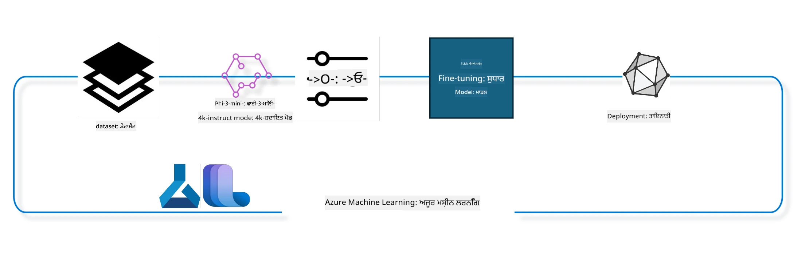

## Azure ML ਸਿਸਟਮ ਰਜਿਸਟਰੀ ਤੋਂ ਚੈਟ-ਕੰਪਲੀਸ਼ਨ ਕੰਪੋਨੇਟਾਂ ਨੂੰ ਮਾਡਲ ਨੂੰ ਫਾਈਨ-ਟਿਊਨ ਕਰਨ ਲਈ ਕਿਵੇਂ ਵਰਤਣਾ ਹੈ

ਇਸ ਉਦਾਹਰਨ ਵਿੱਚ ਅਸੀਂ Phi-3-mini-4k-instruct ਮਾਡਲ ਨੂੰ ultrachat_200k ਡੇਟਾਸੈੱਟ ਦੀ ਵਰਤੋਂ ਕਰਕੇ 2 ਲੋਕਾਂ ਦਰਮਿਆਨ ਗੱਲਬਾਤ ਨੂੰ ਪੂਰਾ ਕਰਨ ਲਈ ਫਾਈਨ ਟਿਊਨਿੰਗ ਕਰਾਂਗੇ।



ਉਦਾਹਰਨ ਤੁਹਾਨੂੰ ਦਿਖਾਏਗੀ ਕਿ ਕਿਵੇਂ Azure ML SDK ਅਤੇ ਪਾਇਥਨ ਦੀ ਵਰਤੋਂ ਕਰਕੇ ਫਾਈਨ ਟਿਊਨਿੰਗ ਕਰਨੀ ਹੈ ਅਤੇ ਫਿਰ ਫਾਈਨ-ਟਿਊਨ ਕੀਤਾ ਮਾਡਲ ਰੀਅਲ ਟਾਈਮ ਇੰਫਰਨਸ ਲਈ ਇੱਕ ਆਨਲਾਈਨ ਐਂਡਪੌਇੰਟ 'ਤੇ ਡਿਪਲੌਇ ਕਰਨਾ ਹੈ।

### ਟਰੇਨਿੰਗ ਡੇਟਾ

ਅਸੀਂ ultrachat_200k ਡੇਟਾਸੈੱਟ ਦੀ ਵਰਤੋਂ ਕਰਾਂਗੇ। ਇਹ UltraChat ਡੇਟਾਸੈੱਟ ਦਾ ਭਾਰੀ ਤਰ੍ਹਾਂ ਫਿਲਟਰਡ ਵਰਜ਼ਨ ਹੈ ਅਤੇ Zephyr-7B-β ਨੂੰ ਟਰੇਨ ਕਰਨ ਲਈ ਵਰਤਿਆ ਗਿਆ ਸੀ, ਜੋ ਇਕ ਅੱਜ ਦਾ ਟਕਨੀਕੀ 7b ਚੈਟ ਮਾਡਲ ਹੈ।

### ਮਾਡਲ

ਅਸੀਂ Phi-3-mini-4k-instruct ਮਾਡਲ ਦੀ ਵਰਤੋਂ ਕਰਾਂਗੇ ਤਾਂ ਜੋ ਦਿਖਾ ਸਕੀਏ ਕਿ ਵਪਰੀ ਪੈਰ ਤੱਕ ਕਿਵੇਂ ਮਾਡਲ ਨੂੰ ਚੈਟ-ਕੰਪਲੀਸ਼ਨ ਕੰਮ ਲਈ ਫਾਈਨਟਿਊਨ ਕੀਤਾ ਜਾ ਸਕਦਾ ਹੈ। ਜੇਕਰ ਤੁਸੀਂ ਇਹ ਨੋਟਬੁੱਕ ਕਿਸੇ ਖਾਸ ਮਾਡਲ ਕਾਰਡ ਤੋਂ ਖੋਲ੍ਹਿਆ ਹੈ, ਤਾਂ ਯਾਦ ਰੱਖੋ ਕਿ ਖਾਸ ਮਾਡਲ ਨਾਂ ਨੂੰ ਬਦਲਣਾ ਹੈ।

### ਕੰਮ

- ਇੱਕ ਮਾਡਲ ਚੁਣੋ ਜੋ ਫਾਈਨ ਟਿਊਨ ਕੀਤਾ ਜਾਵੇ।
- ਟਰੇਨਿੰਗ ਡੇਟਾ ਚੁਣੋ ਅਤੇ ਖੰਗਾਲੋ।
- ਫਾਈਨ ਟਿਊਨਿੰਗ ਜ਼ਾਬ ਦੀ ਸੰਰਚਨਾ ਕਰੋ।
- ਫਾਈਨ ਟਿਊਨਿੰਗ ਜ਼ਾਬ ਚਲਾਓ।
- ਟਰੇਨਿੰਗ ਅਤੇ ਮਾਪਦੰਡਾਂ ਦੀ ਸਮੀਖਿਆ ਕਰੋ।
- ਫਾਈਨ-ਟਿਊਨ ਕੀਤਾ ਮਾਡਲ ਰਜਿਸਟਰ ਕਰੋ।
- ਫਾਈਨ-ਟਿਊਨ ਕੀਤਾ ਮਾਡਲ ਰੀਅਲ ਟਾਈਮ ਇੰਫਰਨਸ ਲਈ ਡਿਪਲੌਇ ਕਰੋ।
- ਸਰੋਤਾਂ ਨੂੰ ਸਾਫ਼ ਕਰੋ।

## 1. ਲੋੜੀਂਦੇ ਤੱਤ ਸੈੱਟਅੱਪ ਕਰੋ

- ਡਿਪੈਂਡੈਂਸੀਜ਼ ਇੰਸਟਾਲ ਕਰੋ
- AzureML ਵਰਕਸਪੇਸ ਨਾਲ ਕਨੈਕਟ ਕਰੋ। ਹੋਰ ਸਿੱਖੋ ਸੈੱਟ ਅੱਪ SDK ਪ੍ਰਮਾਣਿਕਤਾ 'ਤੇ। ਹੇਠਾਂ <WORKSPACE_NAME>, <RESOURCE_GROUP> ਅਤੇ <SUBSCRIPTION_ID> ਬਦਲੋ।
- azureml ਸਿਸਟਮ ਰਜਿਸਟਰੀ ਨਾਲ ਕਨੈਕਟ ਕਰੋ
- ਇੱਕ ਵਿਕਲਪੀ ਤਜਰਬਾ ਨਾਂ ਸੈੱਟ ਕਰੋ
- ਕਮਪਿਊਟ ਚੈੱਕ ਜਾਂ ਬਣਾਓ।

> [!NOTE]
> ਲੋੜ ਹੈ ਕਿ ਇੱਕ ਸਿੰਗਲ GPU ਨੋਡ ਵਿੱਚ ਕਈ GPU ਕਾਰਡ ਹੋ ਸਕਦੇ ਹਨ। ਉਦਾਹਰਨ ਵਜੋਂ, Standard_NC24rs_v3 ਦੇ ਇੱਕ ਨੋਡ ਵਿੱਚ 4 NVIDIA V100 GPUs ਹਨ ਜਦ ਕਿ Standard_NC12s_v3 ਵਿੱਚ 2 NVIDIA V100 GPUs ਹਨ। ਇਸ ਜਾਣਕਾਰੀ ਲਈ ਦਸਤਾਵੇਜ਼ ਵੇਖੋ। ਪਰ ਨੋਡ ਪ੍ਰਤੀ GPU ਕਾਰਡ ਦੀ ਸੰਖਿਆ ਹੇਠਾਂ ਦਿੱਤੇ gpus_per_node ਪੈਰਾਮੀਟਰ ਵਿੱਚ ਸੈਟ ਕੀਤੀ ਜਾਂਦੀ ਹੈ। ਇਸ ਨੂੰ ਸਹੀ ਢੰਗ ਨਾਲ ਸੈਟ ਕਰਨਾ ਯਕੀਨੀ ਬਣਾਏਗਾ ਕਿ ਸਾਰੇ GPUs ਵਰਤੇ ਜਾ ਰਹੇ ਹਨ। ਸਿਫਾਰਸ਼ੀ GPU ਕਮਪਿਊਟ SKU ਇਥੇ ਅਤੇ ਇਥੇ ਮਿਲ ਸਕਦੇ ਹਨ।

### ਪਾਇਥਨ ਲਾਇਬਰੇਰੀਜ਼

ਡਿਪੈਂਡੈਂਸੀਜ਼ ਇੰਸਟਾਲ ਕਰਨ ਲਈ ਹੇਠਾਂ ਦਿੱਤੀ ਸੈੱਲ ਨੂੰ ਚਲਾਓ। ਨਵੇਂ ਵਾਤਾਵਰਣ ਵਿੱਚ ਚਲਾਉਣ ਲਈ ਇਹ ਵਿਕਲਪੀ ਕਦਮ ਨਹੀਂ ਹੈ।

```bash
pip install azure-ai-ml
pip install azure-identity
pip install datasets==2.9.0
pip install mlflow
pip install azureml-mlflow
```

### Azure ML ਨਾਲ ਇੰਟਰੈਕਟ ਕਰਨਾ

1. ਇਹ ਪਾਇਥਨ ਸਕ੍ਰਿਪਟ Azure Machine Learning (Azure ML) ਸੇਵਾ ਨਾਲ ਇੰਟਰੈਕਟ ਕਰਨ ਲਈ ਵਰਤੀ ਜਾਂਦੀ ਹੈ। ਹੇਠਾਂ ਇਸ ਦਾ ਵੇਰਵਾ ਹੈ:

    - ਇਹ azure.ai.ml, azure.identity, ਅਤੇ azure.ai.ml.entities ਪੈਕੇਜਾਂ ਤੋਂ ਜ਼ਰੂਰੀ ਮੌਡਿਊਲ ਆਮਦ ਕਰਦਾ ਹੈ। ਨਾਲ ਹੀ time ਮੌਡਿਊਲ ਵੀ ਆਮਦ ਕਰਦਾ ਹੈ।

    - ਪਹਿਲਾਂ DefaultAzureCredential() ਨਾਲ ਪ੍ਰਮਾਣੀਕਰਨ ਕਰਨ ਦੀ ਕੋਸ਼ਿਸ਼ ਕਰਦਾ ਹੈ, ਜੋ ਐਜ਼ੂਰ ਕਲਾਉਡ ਵਿੱਚ ਐਪਲੀਕੇਸ਼ਨ Jaldi ਤਿਆਰ ਕਰਨ ਲਈ ਸਰਲ ਪ੍ਰਮਾਣੀਕਰਨ ਪ੍ਰਦਾਨ ਕਰਦਾ ਹੈ। ਜੇ ਇਹ ਫੇਲ ਹੋ ਜਾਵੇ ਤਾਂ ਇਹ InteractiveBrowserCredential() ਤੇ ਆ ਜਾਂਦਾ ਹੈ, ਜੋ ਇੰਟਰੈਕਟਿਵ ਲੋਗਿਨ ਪ੍ਰੰਪਟ ਦਿੰਦਾ ਹੈ।

    - ਫਿਰ ਇਹ MLClient ਇੰਸਟੈਂਸ from_config ਵਿਧੀ ਨਾਲ ਬਣਾਉਂਦਾ ਹੈ, ਜੋ ਡਿਫਾਲਟ config ਫਾਈਲ (config.json) ਤੋਂ ਸੰਰਚਨਾਂ ਨੂੰ ਪੜ੍ਹਦਾ ਹੈ। ਜੇ ਇਹ ਫੇਲ ਹੁੰਦਾ ਹੈ, ਤਾਂ ਮੇਨੂਅਲੀ subscription_id, resource_group_name, ਅਤੇ workspace_name ਸਪਲਾਈ ਕਰਕੇ MLClient ਬਣਾ ਲੈਂਦਾ ਹੈ।

    - ਇਹ ਹੋਰ ਇੱਕ MLClient ਇੰਸਟੈਂਸ ਬਣਾਉਂਦਾ ਹੈ, ਇਸ ਵਾਰੀ Azure ML ਰਜਿਸਟਰੀ "azureml" ਲਈ। ਇਹ ਰਜਿਸਟਰੀ ਮਾਡਲਜ਼, ਫਾਈਨ-ਟਿਊਨਿੰਗ ਪਾਈਪਲਾਈਨ, ਅਤੇ ਮਾਹੌਲਾਂ ਨੂੰ ਸਟੋਰ ਕਰਦੀ ਹੈ।

    - ਇਹ experiment_name "chat_completion_Phi-3-mini-4k-instruct" ਸੈੱਟ ਕਰਦਾ ਹੈ।

    - ਇਹ ਇੱਕ ਯੂਨੀਕ ਟਾਈਮਸਟੈਂਪ ਬਣਾਉਂਦਾ ਹੈ ਜਿਸਦਾ ਫਾਰਮੈਟ ਵਰਤ ਕੇ ਹੁਣ ਦੀ ਸਹੀ ਸਮਾਂ ਦੀ ਵੱਡੀ ਗਿਣਤੀ ਨੂੰ ਪੂਰੇ ਅੰਕਾਂ ਵਿੱਚ ਤਬਦੀਲ ਕਰਦਾ ਹੈ ਅਤੇ ਫਿਰ ਇਸਨੂੰ ਸਟ੍ਰਿੰਗ ਬਣਾਂਦਾ ਹੈ। ਇਹ ਟਾਈਮਸਟੈਂਪ ਵਿਲੱਖਣ ਨਾਂ ਅਤੇ ਵਰਜਨ ਬਣਾਉਣ ਲਈ ਵਰਤਿਆ ਜਾ ਸਕਦਾ ਹੈ।

    ```python
    # Azure ML ਅਤੇ Azure Identity ਤੋਂ ਜ਼ਰੂਰੀ ਮੋਡੀਊਲ ਆਯਾਤ ਕਰੋ
    from azure.ai.ml import MLClient
    from azure.identity import (
        DefaultAzureCredential,
        InteractiveBrowserCredential,
    )
    from azure.ai.ml.entities import AmlCompute
    import time  # ਸਮੇਂ ਮੋਡੀਊਲ ਆਯਾਤ ਕਰੋ
    
    # DefaultAzureCredential ਦੀ ਵਰਤੋਂ ਕਰਕੇ ਪ੍ਰਮਾਣੀਕਰਨ ਦੀ ਕੋਸ਼ਿਸ਼ ਕਰੋ
    try:
        credential = DefaultAzureCredential()
        credential.get_token("https://management.azure.com/.default")
    except Exception as ex:  # ਜੇ DefaultAzureCredential ਅਸਫਲ ਹੋ ਜਾਂਦਾ ਹੈ, ਤਾਂ InteractiveBrowserCredential ਦੀ ਵਰਤੋਂ ਕਰੋ
        credential = InteractiveBrowserCredential()
    
    # ਡਿਫਾਲਟ ਕਨਫਿਗ ਫਾਇਲ ਦੀ ਵਰਤੋਂ ਕਰਕੇ MLClient ਇੰਸਟੈਂਸ ਬਣਾਉਣ ਦੀ ਕੋਸ਼ਿਸ਼ ਕਰੋ
    try:
        workspace_ml_client = MLClient.from_config(credential=credential)
    except:  # ਜੇ ਇਹ ਅਸਫਲ ਰਹਿੰਦਾ ਹੈ, ਤਾਂ ਵੇਰਵਿਆਂ ਨੂੰ ਮੈਨੂਅਲੀ ਪ੍ਰਦਾਨ ਕਰਕੇ MLClient ਇੰਸਟੈਂਸ ਬਣਾਓ
        workspace_ml_client = MLClient(
            credential,
            subscription_id="<SUBSCRIPTION_ID>",
            resource_group_name="<RESOURCE_GROUP>",
            workspace_name="<WORKSPACE_NAME>",
        )
    
    # "azureml" ਨਾਮਕ Azure ML ਰਜਿਸਟਰੀ ਲਈ ਇਕ ਹੋਰ MLClient ਇੰਸਟੈਂਸ ਬਣਾਓ
    # ਇਸ ਰਜਿਸਟਰੀ ਵਿੱਚ ਮਾਡਲ, ਫਾਈਨ-ਟਿਊਨਿੰਗ ਪਾਈਪਲਾਈਨਸ ਅਤੇ ਵਾਤਾਵਰਨ ਸੰਭਾਲੇ ਜਾਂਦੇ ਹਨ
    registry_ml_client = MLClient(credential, registry_name="azureml")
    
    # ਪ੍ਰਯੋਗ ਦਾ ਨਾਮ ਸੈੱਟ ਕਰੋ
    experiment_name = "chat_completion_Phi-3-mini-4k-instruct"
    
    # ਇੱਕ ਵਿਲੱਖਣ ਟਾਈਮਸਟੈਂਪ ਤਿਆਰ ਕਰੋ ਜੋ ਨਾਮਾਂ ਅਤੇ ਵਰਜ਼ਨਾਂ ਲਈ ਵਰਤਿਆ ਜਾ ਸਕਦਾ ਹੈ ਜਿਨ੍ਹਾਂ ਨੂੰ ਵਿਲੱਖਣ ਹੋਣਾ ਲਾਜ਼ਮੀ ਹੈ
    timestamp = str(int(time.time()))
    ```

## 2. ਫਾਈਨ-ਟਿਊਨ ਕਰਨ ਲਈ ਇੱਕ ਫਾਊਂਡੇਸ਼ਨ ਮਾਡਲ ਚੁਣੋ

1. Phi-3-mini-4k-instruct ਇੱਕ 3.8B ਪੈਰਾਮੀਟਰ ਦਾ ਹਲਕਾ, ਅੱਜ ਦਾ ਖੁੱਲਾ ਮਾਡਲ ਹੈ ਜੋ Phi-2 ਲਈ ਵਰਤੇ ਡੇਟਾਸੈੱਟ 'ਤੇ ਤਿਆਰ ਕੀਤਾ ਗਿਆ ਹੈ। ਇਹ ਮਾਡਲ Phi-3 ਮਾਡਲ ਪਰਿਵਾਰ ਦਾ ਹਿੱਸਾ ਹੈ, ਅਤੇ ਮਿਨੀ ਵਰਜਨ ਦੋ ਵੈਰੀਅੰਟ 4K ਅਤੇ 128K ਵਿੱਚ ਆਉਂਦਾ ਹੈ ਜੋ ਕਾਂਟੈਕਸਟ ਲੰਬਾਈ (ਟੋਕਨ ਵਿੱਚ) ਹੈ ਜਿਸਨੂੰ ਇਹ ਸਹਿਯੋਗ ਦੇ ਸਕਦਾ ਹੈ। ਸਾਨੂੰ ਇਸਨੂੰ ਆਪਣੇ ਖਾਸ ਮਕਸਦ ਲਈ ਫਾਈਨਟਿਊਨ ਕਰਨ ਦੀ ਲੋੜ ਹੈ। ਤੁਸੀਂ AzureML ਸਟੂਡੀਓ ਵਿੱਚ ਮਾਡਲ ਕੈਟਾਲਾਗ ਵਿੱਚ ਇਨ੍ਹਾਂ ਮਾਡਲਜ਼ ਨੂੰ ਚੈਟ-ਕੰਪਲੀਸ਼ਨ ਟਾਸਕ ਰਾਹੀਂ ਫਿਲਟਰ ਕਰਕੇ ਵੇਖ ਸਕਦੇ ਹੋ। ਇਸ ਉਦਾਹਰਨ ਵਿੱਚ ਅਸੀਂ Phi-3-mini-4k-instruct ਮਾਡਲ ਦੀ ਵਰਤੋਂ ਕਰ ਰਹੇ ਹਾਂ। ਜੇ ਤੁਸੀਂ ਇਹ ਨੋਟਬੁੱਕ ਕਿਸੇ ਵੱਖਰੇ ਮਾਡਲ ਲਈ ਖੋਲ੍ਹਿਆ ਹੈ, ਤਾਂ ਮਾਡਲ ਦਾ ਨਾਂ ਅਤੇ ਵਰਜਨ ਅਨੁਸਾਰ ਬਦਲੋ।

> [!NOTE]
> ਮਾਡਲ ਦੀ ਮਾਡਲ ਆਈਡੀ ਗੁਣਮਾਨ। ਇਹ ਫਾਈਨ ਟਿਊਨਿੰਗ ਜ਼ਾਬ ਵਿੱਚ ਆਦਾਨ-ਪ੍ਰਦਾਨ ਵਜੋਂ ਦਿੱਤੀ ਜਾਵੇਗੀ। ਇਹ AzureML ਸਟੂਡੀਓ ਮਾਡਲ ਕੈਟਾਲਾਗ ਦੇ ਮਾਡਲ ਵੇਰਵੇ ਸਫ਼ੇ ਵਿੱਚ ਐਸੈਟ ਆਈਡੀ ਖੇਤਰ ਵਿੱਚ ਵੀ ਉਪਲਬਧ ਹੈ।

2. ਇਹ ਪਾਇਥਨ ਸਕ੍ਰਿਪਟ Azure Machine Learning (Azure ML) ਸੇਵਾ ਨਾਲ ਇੰਟਰੈਕਟ ਕਰ ਰਹੀ ਹੈ। ਇਸ ਕਰਵਾਈ ਦੀ ਵਿਵਰਣ ਹੈ:

    - ਇਹ model_name ਨੂੰ "Phi-3-mini-4k-instruct" ਸੈੱਟ ਕਰਦਾ ਹੈ।

    - ਇਹ registry_ml_client ऑਬਜੈਕਟ ਦੇ models ਸੰਪਤੀ ਦੀ get ਵਿਧੀ ਦੀ ਵਰਤੋਂ ਕਰਦਾ ਹੈ, ਤਾ ਕਿ ਇਹ ਸੂਚੀ ਲੇਟੇਸਟ ਵਰਜਨ ਮਾਡਲ ਦੇ ਨਾਮ ਨਾਲ Azure ML ਰਜਿਸਟਰੀ ਤੋਂ ਪ੍ਰਾਪਤ ਕਰ ਸਕੇ। get ਵਿਧੀ ਦੋ ਅਰਗੁਮੈਂਟ ਨਾਲ ਕਾਲ ਹੁੰਦੀ ਹੈ: ਮਾਡਲ ਦਾ ਨਾਮ ਅਤੇ ਲੇਬਲ ਜੋ ਦੱਸਦਾ ਹੈ ਕਿ ਹਮੇਸ਼ਾ ਲੇਟੇਸਟ ਵਰਜਨ ਲਿਆ ਜਾਵੇ।

    - ਇਹ ਕੰਸੋਲ 'ਤੇ ਸੁਨੇਹਾ ਪ੍ਰਿੰਟ ਕਰਦਾ ਹੈ ਕਿ ਕਿਹੜਾ ਨਾਮ, ਵਰਜਨ ਅਤੇ ਆਈਡੀ ਵਾਲਾ ਮਾਡਲ ਫਾਈਨ-ਟਿਊਨਿੰਗ ਲਈ ਵਰਤਿਆ ਜਾਵੇਗਾ। string ਦਾ format ਵਿਧੀ ਇਹਨਾਂ ਨੂੰ ਸੁਨੇਹੇ ਵਿੱਚ ਸ਼ਾਮਲ ਕਰਨ ਲਈ ਵਰਤੀ ਜਾਂਦੀ ਹੈ। ਮਾਡਲ ਦੇ ਨਾਮ, ਵਰਜਨ ਅਤੇ ਆਈਡੀ ਨੂੰ foundation_model ਵਾਲੀ ਗੁਣਮਤਾ ਵਜੋਂ ਪ੍ਰਾਪਤ ਕੀਤਾ ਜਾਂਦਾ ਹੈ।

    ```python
    # ਮਾਡਲ ਦਾ ਨਾਮ ਸੈੱਟ ਕਰੋ
    model_name = "Phi-3-mini-4k-instruct"
    
    # ਅਜ਼ੂਰੇ ਐੱਮਐੱਲ ਰਜਿਸਟਰੀ ਤੋਂ ਮਾਡਲ ਦਾ ਨਵਾਂ ਸੰਸਕਰਣ ਪ੍ਰਾਪਤ ਕਰੋ
    foundation_model = registry_ml_client.models.get(model_name, label="latest")
    
    # ਮਾਡਲ ਦਾ ਨਾਮ, ਸੰਸਕਰਣ ਅਤੇ ਆਈਡੀ ਪ੍ਰਿੰਟ ਕਰੋ
    # ਇਹ ਜਾਣਕਾਰੀ ਟ੍ਰੈਕ ਕਰਨ ਅਤੇ ਡੀਬੱਗ ਕਰਨ ਲਈ ਲਾਭਦਾਇਕ ਹੈ
    print(
        "\n\nUsing model name: {0}, version: {1}, id: {2} for fine tuning".format(
            foundation_model.name, foundation_model.version, foundation_model.id
        )
    )
    ```

## 3. ਜ਼ਾਬ ਨਾਲ ਵਰਤਣ ਲਈ ਕਮਪਿਊਟ ਬਣਾਓ

ਫਾਈਨਟਿਊਨ ਜ਼ਾਬ ਸਿਰਫ GPU ਕਮਪਿਊਟ ਨਾਲ ਕੰਮ ਕਰਦਾ ਹੈ। ਕਮਪਿਊਟ ਦਾ ਆਕਾਰ ਮਾਡਲ ਦੀਆਂ ਵੱਡੀਆ ਬਣਤ ਦੇ ਅਨੁਸਾਰ ਹੁੰਦਾ ਹੈ ਅਤੇ ਜ਼ਿਆਦਾਤਰ ਕੇਸਾਂ ਵਿੱਚ ਆਪਣੀ ਜ਼ਾਬ ਲਈ ਸਹੀ ਕਮਪਿਊਟ ਚੁਣਨਾ ਔਖਾ ਹੁੰਦਾ ਹੈ। ਇਸ ਸੈੱਲ ਵਿੱਚ ਅਸੀਂ ਵਰਤੋਂਕਾਰ ਨੂੰ ਸਹੀ ਕਮਪਿਊਟ ਚੁਣਣ ਵਿੱਚ ਮਦਦ ਕਰਾਂਗੇ।

> [!NOTE]
> ਹੇਠਾਂ ਦਿੱਤੇ ਕਮਪਿਊਟ ਸਭ ਤੋਂ ਵਧੀਆ ਸੰਰਚਨਾ ਨਾਲ ਕੰਮ ਕਰਦੇ ਹਨ। ਸੰਰਚਨਾ ਵਿੱਚ ਕੋਈ ਭੀ ਤਬਦੀਲੀ CUDA Out Of Memory ਦੀ ਗਲਤੀ ਲਿਆ ਸਕਦੀ ਹੈ। ਇਸ ਤਰ੍ਹਾਂ ਦੇ ਮਾਮਲੇ ਵਿੱਚ, ਕਮਪਿਊਟ ਨੂੰ ਵੱਡੇ ਆਕਾਰ ਨਾਲ ਅਪਗ੍ਰੇਡ ਕਰਨ ਦੀ ਕੋਸ਼ਿਸ਼ ਕਰੋ।

> [!NOTE]
> ਕਮਪਿਊਟ_ਕਲੱਸਟਰ_ਸਾਈਜ਼ ਚੁਣਦੇ ਸਮੇਂ ਨਿਸ਼ਚਿਤ ਕਰੋ ਕਿ ਕਮਪਿਊਟ ਤੁਹਾਡੇ ਰਿਸੋਰਸ ਗਰੁੱਪ ਵਿੱਚ ਉਪਲਬਧ ਹੈ। ਜੇ ਕੋਈ ਖਾਸ ਕਮਪਿਊਟ ਉਪਲਬਧ ਨਹੀਂ, ਤਾ ਤੁਸੀਂ ਕਮਪਿਊਟ ਸਰੋਤਾਂ ਲਈ ਐਕਸੈਸ ਦੀ ਬੇਨਤੀ ਕਰ ਸਕਦੇ ਹੋ।

### ਫਾਈਨ ਟਿਊਨਿੰਗ ਸਹਾਇਤਾ ਲਈ ਮਾਡਲ ਦੀ ਜਾਂਚ

1. ਇਹ ਪਾਇਥਨ ਸਕ੍ਰਿਪਟ Azure Machine Learning (Azure ML) ਮਾਡਲ ਨਾਲ ਇੰਟਰੈਕਟ ਕਰ ਰਹੀ ਹੈ। ਇਸ ਦੀ ਸੰਖੇਪ ਸਮਝ:

    - ਇਹ ast ਮੌਡੀਊਲ ਆਮਦ ਕਰਦੀ ਹੈ, ਜੋ ਪਾਇਥਨ ਦੇ ਅਬਰੈਕਟ ਸਿੰਟੈਕਸ ਗ੍ਰੈਮਰ ਦੇ ਟ੍ਰੀਜ਼ ਨੂੰ ਪ੍ਰਕਿਰਿਆ ਕਰਨ ਲਈ ਫੰਕਸ਼ਨ ਦਿੰਦਾ ਹੈ।

    - ਇਹ ਦੇਖਦੀ ਹੈ ਕਿ foundation_model ਜ਼ਖ਼ੀਰਾ (ਜੋ Azure ML ਵਿੱਚ ਮਾਡਲ ਦਰਸਾਉਂਦਾ ਹੈ) ਕੋਲ finetune_compute_allow_list ਨਾਮਕ ਇੱਕ ਟੈਗ ਹੈ ਜਾਂ ਨਹੀਂ। Azure ML ਵਿੱਚ ਟੈਗਜ਼ ਕੁੰਜੀ-ਮੁੱਲ ਜੋੜੇ ਹੁੰਦੇ ਹਨ ਜੋ ਤੁਸੀਂ ਮਾਡਲ੍ਹਾਂ ਨੂੰ ਫਿਲਟਰ ਅਤੇ ਛਾਂਟਣ ਲਈ ਬਣਾਉਂਦੇ ਹੋ।

    - ਜੇ finetune_compute_allow_list ਟੈਗ ਹੈ, ਤਾਂ ਇਹ ast.literal_eval ਫੰਕਸ਼ਨ ਦੀ ਵਰਤੋਂ ਕਰ ਕੇ ਟੈਗ ਦਾ ਮੁੱਲ (ਸਟ੍ਰਿੰਗ) ਨੂੰ ਸੁਰੱਖਿਅਤ ਧੰਗ ਨਾਲ ਇੱਕ ਪਾਇਥਨ ਲਿਸਟ ਵਿੱਚ ਬਦਲਦਾ ਹੈ। ਫਿਰ ਇਹ ਲਿਸਟ computes_allow_list ਵੇਰਯਬਲ 'ਚ ਸੈੱਟ ਹੋ ਜਾਂਦੀ ਹੈ ਅਤੇ ਇਹ ਸੁਨੇਹਾ ਛਪਦਾ ਹੈ ਕਿ ਇਸ ਲਿਸਟ ਤੋਂ ਕਿਸੇ ਕਮਪਿਊਟ ਨੂੰ ਬਣਾਉਣਾ ਚਾਹੀਦਾ ਹੈ।

    - ਜੇ finetune_compute_allow_list ਟੈਗ ਮੌਜੂਦ ਨਹੀਂ ਹੈ, ਤਾਂ computes_allow_list ਨੂੰ None ਸੈੱਟ ਕੀਤਾ ਜਾਦਾ ਹੈ ਅਤੇ ਸੁਨੇਹਾ ਪ੍ਰਿੰਟ ਹੁੰਦਾ ਹੈ ਕਿ ਇਹ ਟੈਗ ਮਾਡਲ ਟੈਗਜ਼ ਵਿੱਚ ਨਹੀਂ ਹੈ।

    - ਸਾਰ ਦੇ ਤੌਰ 'ਤੇ, ਇਹ ਸਕ੍ਰਿਪਟ ਮਾਡਲ ਦੀ ਮੈਟਾਡੇਟਾ ਵਿੱਚ ਖਾਸ ਟੈਗ ਦੀ ਜਾਂਚ ਕਰਦਾ ਹੈ, ਜੇ ਉਹ ਮਿਲੇ ਤਾਂ ਉਸ ਦਾ ਮੁੱਲ ਲਿਸਟ ਵਿੱਚ ਬਦਲਦਾ ਹੈ ਅਤੇ ਵਰਤੋਂਕਾਰ ਨੂੰ ਜਾਣੂ ਕਰਵਾਉਂਦਾ ਹੈ।

    ```python
    # ast ਮੋਡੀਊਲ ਨੂੰ ਇੰਪੋਰਟ ਕਰੋ, ਜੋ ਕਿ Python ਅਬਸਟ੍ਰੈਕਟ ਸਿੰਟੈਕਸ ਗ੍ਰੈਮਰ ਦੇ ਦਰੱਖਤਾਂ ਨੂੰ ਪ੍ਰੋਸੈਸ ਕਰਨ ਲਈ ਫੰਕਸ਼ਨ ਪ੍ਰਦਾਨ ਕਰਦਾ ਹੈ
    import ast
    
    # ਜਾਂਚ ਕਰੋ ਕਿ ਮਾਡਲ ਦੇ ਟੈਗਾਂ ਵਿੱਚ 'finetune_compute_allow_list' ਟੈਗ ਮੌਜੂਦ ਹੈ
    if "finetune_compute_allow_list" in foundation_model.tags:
        # ਜੇ ਟੈਗ ਮੌਜੂਦ ਹੈ, ਤਾਂ ast.literal_eval ਦਾ ਉਪਯੋਗ ਕਰਕੇ ਟੈਗ ਦੀ ਵੈਲਯੂ (ਇੱਕ ਸਟ੍ਰਿੰਗ) ਨੂੰ ਸੁਰੱਖਿਅਤ ਤਰੀਕੇ ਨਾਲ Python ਲਿਸਟ ਵਿੱਚ ਪਰਸ ਕਰੋ
        computes_allow_list = ast.literal_eval(
            foundation_model.tags["finetune_compute_allow_list"]
        )  # ਸਟ੍ਰਿੰਗ ਨੂੰ Python ਲਿਸਟ ਵਿੱਚ ਬਦਲੋ
        # ਇੱਕ ਸੁਨੇਹਾ ਪ੍ਰਿੰਟ ਕਰੋ ਜੋ ਇਹ ਦਰਸਾਵੇ ਕਿ ਲਿਸਟ ਤੋਂ ਇੱਕ ਕਮਪਿਊਟ ਬਣਾਈ ਜਾ ਰਹੀ ਹੈ
        print(f"Please create a compute from the above list - {computes_allow_list}")
    else:
        # ਜੇ ਟੈਗ ਮੌਜੂਦ ਨਹੀਂ ਹੈ, ਤਾਂ computes_allow_list ਨੂੰ None ਸੈੱਟ ਕਰੋ
        computes_allow_list = None
        # ਇੱਕ ਸੁਨੇਹਾ ਪ੍ਰਿੰਟ ਕਰੋ ਜੋ ਦਰਸਾਵੇ ਕਿ 'finetune_compute_allow_list' ਟੈਗ ਮਾਡਲ ਦੇ ਟੈਗਾਂ ਦਾ ਹਿੱਸਾ ਨਹੀਂ ਹੈ
        print("`finetune_compute_allow_list` is not part of model tags")
    ```

### ਕਮਪਿਊਟ ਇੰਸਟੈਂਸ ਦੀ ਜਾਂਚ

1. ਇਹ ਪਾਇਥਨ ਸਕ੍ਰਿਪਟ Azure Machine Learning (Azure ML) ਸੇਵਾ ਨਾਲ ਇੰਟਰੈਕਟ ਕਰਦੀ ਹੈ ਅਤੇ ਇੱਕ ਕਮਪਿਊਟ ਇੰਸਟੈਂਸ ਉੱਤੇ ਕਈ ਜਾਂਚਾਂ ਕਰਦੀ ਹੈ। ਇਸ ਦਾ ਸੰਖੇਪ:

    - ਇਹ Azure ML ਵਰਕਸਪੇਸ ਤੋਂ compute_cluster ਵਿੱਚ ਸੰਭਾਲੇ ਨਾਮ ਵਾਲਾ ਕਮਪਿਊਟ ਇੰਸਟੈਂਸ ਲੱਭਦਾ ਹੈ। ਜੇ ਪ੍ਰੋਵਿਜ਼ਨਿੰਗ ਸਥਿਤੀ "failed" ਹੈ, ਤਾਂ ValueError ਦੇ ਰੂਪ ਵਿੱਚ ਗਲਤੀ ਫੇਂਕਦੀ ਹੈ।

    - ਇਹ ਜਾਂਚ ਕਰਦਾ ਹੈ ਕਿ computes_allow_list None ਨਹੀਂ ਹੈ। ਜੇ ਇਹ ਲਿਸਟ ਹੈ, ਤਾਂ ਇਸ ਵਿੱਚ ਲਿਖੇ ਸਾਰੇ ਸਾਈਜ਼ ਨੂੰ ਛੋਟੇ ਅੱਖਰਾਂ ਵਿੱਚ ਬਦਲ ਕੇ ਵੇਖਦਾ ਹੈ ਕਿ ਮੌਜੂਦਾ ਕਮਪਿਊਟ ਸਾਈਜ਼ ਇਸਲਿਸਟ ਵਿੱਚ ਹੈ ਜਾਂ ਨਹੀਂ। ਜੇ ਨਹੀਂ, ਤਾ ValueError ਫੇਂਕਦਾ ਹੈ।

    - ਜੇ computes_allow_list None ਹੈ, ਤਾਂ ਇਹ ਦੁਬਾਰਾ ਜਾਂਚ ਕਰਦਾ ਹੈ ਕਿ ਮੌਜੂਦਾ ਕਮਪਿਊਟ ਦਾ ਆਕਾਰ ਗੈਰ-ਸਮਰਥਿਤ GPU VM ਅਕਾਰਾਂ ਵਾਲੀ ਸੂਚੀ ਵਿੱਚ ਹੈ ਜਾਂ ਨਹੀਂ। ਜੇ ਹੈ, ਤਾਂ ValueError ਫੈਂਕਦਾ ਹੈ।

    - ਇਹ ਵਰਕਸਪੇਸ ਵਿੱਚ ਉਪਲਬਧ ਸਾਰੇ ਕਮਪਿਊਟ ਸਾਈਜ਼ ਦੀ ਸੂਚੀ ਪ੍ਰਾਪਤ ਕਰਦਾ ਹੈ। ਫਿਰ ਹਰ ਕਮਪਿਊਟ ਆਕਾਰ ਲਈ ਜਾਂਚਦਾ ਹੈ ਕਿ ਉਸਦਾ ਨਾਮ ਮੌਜੂਦਾ ਕਮਪਿਊਟ ਸਾਈਜ਼ ਨਾਲ ਮੇਲ ਖਾਂਦਾ ਹੈ ਜਾਂ ਨਹੀਂ। ਜੇ ਕਰਦਾ ਹੈ, ਤਾਂ ਗਿਣਤੀ ਕਰਦਾ ਹੈ ਕਿ ਉਸਦੇ ਕੋਲ ਕਿੰਨੇ GPUs ਹਨ ਅਤੇ gpu_count_found ਨੂੰ True ਕਰਦਾ ਹੈ।

    - ਜੇ gpu_count_found True ਹੁੰਦਾ ਹੈ, ਤਾਂ ਕੰਸੋਲ 'ਤੇ GPUs ਦੀ ਗਿਣਤੀ ਛਪਦੀ ਹੈ। ਜੇ False, ਤਾਂ ValueError ਫੈਂਕਦਾ ਹੈ।

    - ਸਾਰ ਰੂਪ ਵਿੱਚ, ਇਹ ਸਕ੍ਰਿਪਟ Azure ML ਵਰਕਸਪੇਸ ਵਿਚ ਇੱਕ ਕਮਪਿਊਟ ਇੰਸਟੈਂਸ ਦੀ ਪ੍ਰੋਵਿਜ਼ਨਿੰਗ ਸਥਿਤੀ, ਇਸਦੇ ਆਕਾਰ ਨੂੰ ਇੱਕ ਆਗਿਆ ਪ੍ਰਾਪਤ ਸੂਚੀ ਜਾਂ ਪ੍ਰਤੀਖੰਡ ਸੂਚੀ ਨਾਲ ਮਿਲਾਉਂਦਾ ਹੈ ਅਤੇ GPUs ਦੀ ਗਿਣਤੀ ਜਾਂਚਦਾ ਹੈ।

    ```python
    # ਐਕਸਸਪਸ਼ਨ ਸੁਨੇਹਾ ਪ੍ਰਿੰਟ ਕਰੋ
    print(e)
    # ਜੇ ਕੰਪਿਊਟ ਸਾਈਜ਼ ਵਰਕਸਪੇਸ ਵਿੱਚ ਉਪਲਬਧ ਨਾ ਹੋਵੇ ਤਾਂ ValueError ਉਠਾਓ
    raise ValueError(
        f"WARNING! Compute size {compute_cluster_size} not available in workspace"
    )
    
    # Azure ML ਵਰਕਸਪੇਸ ਤੋਂ ਕੰਪਿਊਟ ਇੰਸਟੈਂਸ ਪ੍ਰਾਪਤ ਕਰੋ
    compute = workspace_ml_client.compute.get(compute_cluster)
    # ਜਾਂਚੋ ਕਿ ਕੰਪਿਊਟ ਇੰਸਟੈਂਸ ਦੀ ਪ੍ਰੋਵਿਜ਼ਨਿੰਗ ਸਥਿਤੀ "ਫੇਲ" ਹੈ ਜਾਂ ਨਹੀਂ
    if compute.provisioning_state.lower() == "failed":
        # ਜੇ ਪ੍ਰੋਵਿਜ਼ਨਿੰਗ ਸਥਿਤੀ "ਫੇਲ" ਹੋਵੇ ਤਾਂ ValueError ਉਠਾਓ
        raise ValueError(
            f"Provisioning failed, Compute '{compute_cluster}' is in failed state. "
            f"please try creating a different compute"
        )
    
    # ਜਾਂਚੋ ਕਿ computes_allow_list None ਨਹੀਂ ਹੈ
    if computes_allow_list is not None:
        # computes_allow_list ਵਿੱਚ ਸਾਰੇ ਕੰਪਿਊਟ ਸਾਈਜ਼ ਨੂੰ ਛੋਟੇ ਅੱਖਰਾਂ ਵਿੱਚ ਬਦਲੋ
        computes_allow_list_lower_case = [x.lower() for x in computes_allow_list]
        # ਜਾਂਚੋ ਕਿ ਕੰਪਿਊਟ ਇੰਸਟੈਂਸ ਦਾ ਸਾਈਜ਼ computes_allow_list_lower_case ਵਿੱਚ ਹੈ ਜਾਂ ਨਹੀਂ
        if compute.size.lower() not in computes_allow_list_lower_case:
            # ਜੇ ਕੰਪਿਊਟ ਇੰਸਟੈਂਸ ਦਾ ਸਾਈਜ਼ computes_allow_list_lower_case ਵਿੱਚ ਨਾ ਹੋਵੇ ਤਾਂ ValueError ਉਠਾਓ
            raise ValueError(
                f"VM size {compute.size} is not in the allow-listed computes for finetuning"
            )
    else:
        # ਅਸਮਰਥਿਤ GPU VM ਸਾਈਜ਼ਾਂ ਦੀ ਸੂਚੀ ਪਰਿਭਾਸ਼ਿਤ ਕਰੋ
        unsupported_gpu_vm_list = [
            "standard_nc6",
            "standard_nc12",
            "standard_nc24",
            "standard_nc24r",
        ]
        # ਜਾਂਚੋ ਕਿ ਕੰਪਿਊਟ ਇੰਸਟੈਂਸ ਦਾ ਸਾਈਜ਼ unsupported_gpu_vm_list ਵਿੱਚ ਹੈ ਜਾਂ ਨਹੀਂ
        if compute.size.lower() in unsupported_gpu_vm_list:
            # ਜੇ ਕੰਪਿਊਟ ਇੰਸਟੈਂਸ ਦਾ ਸਾਈਜ਼ unsupported_gpu_vm_list ਵਿੱਚ ਹੈ ਤਾਂ ValueError ਉਠਾਓ
            raise ValueError(
                f"VM size {compute.size} is currently not supported for finetuning"
            )
    
    # ਇੱਕ ਫਲੈਗ ਸ਼ੁਰੂ ਕਰੋ ਜੋ ਜਾਂਚੇ ਕਿ ਕੰਪਿਊਟ ਇੰਸਟੈਂਸ ਵਿੱਚ GPU ਦੀ ਗਿਣਤੀ ਮਿਲੀ ਹੈ ਜਾਂ ਨਹੀਂ
    gpu_count_found = False
    # ਵਰਕਸਪੇਸ ਵਿੱਚ ਉਪਲਬਧ ਸਾਰੇ ਕੰਪਿਊਟ ਸਾਈਜ਼ਾਂ ਦੀ ਸੂਚੀ ਪ੍ਰਾਪਤ ਕਰੋ
    workspace_compute_sku_list = workspace_ml_client.compute.list_sizes()
    available_sku_sizes = []
    # ਉਪਲਬਧ ਕੰਪਿਊਟ ਸਾਈਜ਼ਾਂ ਦੀ ਸੂਚੀ 'ਤੇ ਦੁਹਰਾਓ
    for compute_sku in workspace_compute_sku_list:
        available_sku_sizes.append(compute_sku.name)
        # ਜਾਂਚੋ ਕਿ ਕੰਪਿਊਟ ਸਾਈਜ਼ ਦਾ ਨਾਮ ਕੰਪਿਊਟ ਇੰਸਟੈਂਸ ਦੇ ਸਾਈਜ਼ ਨਾਲ ਮੇਲ ਖਾਂਦਾ ਹੈ ਜਾਂ ਨਹੀਂ
        if compute_sku.name.lower() == compute.size.lower():
            # ਜੇ ਮੇਲ ਖਾਂਦਾ ਹੈ, ਤਾਂ ਉਸ ਕੰਪਿਊਟ ਸਾਈਜ਼ ਲਈ GPU ਦੀ ਗਿਣਤੀ ਪ੍ਰਾਪਤ ਕਰੋ ਅਤੇ gpu_count_found ਨੂੰ True ਕਰੋ
            gpus_per_node = compute_sku.gpus
            gpu_count_found = True
    # ਜੇ gpu_count_found True ਹੈ, ਤਾਂ ਕੰਪਿਊਟ ਇੰਸਟੈਂਸ ਵਿੱਚ GPU ਦੀ ਗਿਣਤੀ ਪ੍ਰਿੰਟ ਕਰੋ
    if gpu_count_found:
        print(f"Number of GPU's in compute {compute.size}: {gpus_per_node}")
    else:
        # ਜੇ gpu_count_found False ਹੈ, ਤਾਂ ValueError ਉਠਾਓ
        raise ValueError(
            f"Number of GPU's in compute {compute.size} not found. Available skus are: {available_sku_sizes}."
            f"This should not happen. Please check the selected compute cluster: {compute_cluster} and try again."
        )
    ```

## 4. ਮਾਡਲ ਲਈ ਫਾਈਨ-ਟਿਊਨਿੰਗ ਦਾ ਡੇਟਾਸੈੱਟ ਚੁਣੋ

1. ਅਸੀਂ ultrachat_200k ਡੇਟਾਸੈੱਟ ਦੀ ਵਰਤੋਂ ਕਰਦੇ ਹਾਂ। ਡੇਟਾ ਸੈੱਟ ਵਿੱਚ ਚਾਰ ਵੰਡ ਹਨ, ਜੋ ਸਪਰਵਾਈਜ਼ਡ ਫਾਈਨ-ਟਿਊਨਿੰਗ (sft) ਲਈ ਉਚਿਤ ਹਨ। ਜਨਰੇਸ਼ਨ ਰੈਂਕਿੰਗ (gen)। ਹਰ ਵੰਡ ਵਿੱਚ ਉਦਾਹਰਨਾਂ ਦੀ ਗਿਣਤੀ ਹੇਠਾਂ ਦਿੱਤੀ ਹੈ:

    ```bash
    train_sft test_sft  train_gen  test_gen
    207865  23110  256032  28304
    ```

1. ਅਗਲੇ ਕੁਝ ਸੈੱਲ ਬੁਨਿਆਦੀ ਡੇਟਾ ਤਿਆਰੀ ਦਿਖਾਉਂਦੇ ਹਨ:

### ਕੁਝ ਡੇਟਾ ਦੀਆਂ ਰੋਜ਼ ਨੂੰ ਵਿਜ਼ੂਅਲਾਈਜ਼ ਕਰੋ

ਅਸੀਂ ਚਾਹੁੰਦੇ ਹਾਂ ਕਿ ਇਹ ਨਮੂਨਾ ਤੇਜ਼ੀ ਨਾਲ ਚੱਲੇ, ਇਸ ਲਈ train_sft, test_sft ਫਾਈਲਾਂ ਬਚਾਓ ਜੋ ਪਹਿਲਾਂ ਹੀ ਕਰੀਬ 5% ਟਰਿਮ ਕੀਤੀਆਂ ਰੋਜ਼ ਸ਼ਾਮਲ ਕਰਦੀਆਂ ਹਨ। ਇਸਦਾ ਮਤਲਬ ਹੈ ਕਿ ਫਾਈਨ-ਟਿਊਨ ਮਾਡਲ ਦੀ ਸ਼ੁੱਧਤਾ ਘੱਟ ਹੋਵੇਗੀ, ਇਸ ਲਈ ਇਹ ਦੁਨੀਆਂ ਪ੍ਰਯੋਗ ਵਿੱਚ ਨਹੀਂ ਲਿਆਉਣਾ ਚਾਹੀਦਾ।
download-dataset.py ਖ਼ਾਸ ਤੌਰ ‘ਤੇ ultrachat_200k ਡੇਟਾਸੈੱਟ ਡਾਊਨਲੋਡ ਕਰਨ ਅਤੇ ਡੇਟਾਸੈੱਟ ਨੂੰ ਫਾਈਨ-ਟਿਊਨ ਪਾਈਪਲਾਈਨ ਕੰਪੋਨੇਟ ਲਈ ਸਹਜੇਗਾ ਪ੍ਰਾਰੂਪ ਵਿੱਚ ਬਦਲਣ ਲਈ ਵਰਤਿਆ ਜਾਂਦਾ ਹੈ। ਡੇਟਾ ਸੈੱਟ ਵੱਡਾ ਹੈ, ਇਸ ਲਈ ਇੱਥੇ ਸਾਡੇ ਕੋਲ ਕੇਵਲ ਡੇਟਾ ਦਾ ਇੱਕ ਹਿੱਸਾ ਹੈ।

1. ਹੇਠਾਂ ਦਿੱਤੇ ਸਕ੍ਰਿਪਟ ਨੂੰ ਚਲਾਉਣ ਨਾਲ ਸਿਰਫ 5% ਡੇਟਾ ਡਾਊਨਲੋਡ ਹੁੰਦਾ ਹੈ। ਇਸਨੂੰ dataset_split_pc ਪੈਰਾਮੀਟਰ ਬਦਲ ਕੇ ਵਧਾਇਆ ਜਾ ਸਕਦਾ ਹੈ।

> [!NOTE]
> ਕੁਝ ਭਾਸ਼ਾ ਮਾਡਲਾਂ ਵਿੱਚ ਵੱਖ ਵੱਖ ਭਾਸ਼ਾ ਕੋਡ ਹਨ ਅਤੇ ਇਨ੍ਹਾਂ ਲਈ ਡੇਟਾਸੈੱਟ ਵਿੱਚ ਸਤੰਭ ਨਾਂ ਵੀ ਉਸੇ ਤਰ੍ਹਾਂ ਹੋਣੇ ਚਾਹੀਦੇ ਹਨ।

1. ਡੇਟਾ ਇਸ ਤਰ੍ਹਾਂ ਦਾ ਹੋਣਾ ਚਾਹੀਦਾ ਹੈ:
ਚੈਟ-ਕੰਪਲੀਸ਼ਨ ਡੇਟਾਸੈੱਟ ਨੂੰ ਪਰਕੀਟ ਫਾਰਮੈਟ ਵਿੱਚ ਸੰਭਾਲਿਆ ਜਾਂਦਾ ਹੈ ਜਿਸ ਵਿੱਚ ਹਰ ਰਿਕਾਰਡ ਹੇਠ ਲਿਖੇ ਸਕੀਮਾ ਨਾਲ ਹੁੰਦਾ ਹੈ:

    - ਇਹ JSON (JavaScript Object Notation) ਦਸਤਾਵੇਜ਼ ਹੈ, ਜੋ ਪ੍ਰਸਿੱਧ ਡੇਟਾ ਅਦਲਾ-ਬਦਲੀ ਫਾਰਮੈਟ ਹੈ। ਇਹ ਕੋਡ ਨਹੀਂ ਹੈ, ਸਗੋਂ ਡਾਟਾ ਸੰਜੋਣ ਅਤੇ ਟ੍ਰਾਂਸਪੋਰਟ ਕਰਨ ਦਾ ਤਰੀਕਾ ਹੈ। ਇਸਦੀ ਬਣਤਰ ਹੇਠ ਲਿਖੀ ਹੈ:

    - "prompt": ਇਹ ਕੁੰਜੀ ਇੱਕ ਸਤਰ (string) ਰੱਖਦੀ ਹੈ ਜੋ ਇੱਕ ਕੰਮ ਜਾਂ ਸੁਆਲ ਨੂੰ ਦਰਸਾਉਂਦੀ ਹੈ ਜੋ ਏਆਈ ਮਦਦਗਾਰ ਨੂੰ ਦਿੱਤਾ ਗਿਆ ਹੈ।

    - "messages": ਇਹ ਕੁੰਜੀ ਆਬਜੈਕਟਾਂ ਦੀ ਇੱਕ ਐਰੇ ਰੱਖਦੀ ਹੈ। ਹਰ ਆਬਜੈਕਟ ਇੱਕ ਗੱਲਬਾਤ ਦਾ ਸੁਨੇਹਾ ਹੈ ਜੋ ਇੱਕ ਉਪਭੋਗਤਾ ਅਤੇ ਏਆਈ ਮਦਦਗਾਰ ਵਿਚਕਾਰ ਚਲ ਰਿਹਾ ਹੈ। ਹਰ ਸੁਨੇਹਾ ਵਸਤੂ ਵਿੱਚ ਦੋ ਕੁੰਜੀਆਂ ਹੁੰਦੀਆਂ ਹਨ:

    - "content": ਇਹ ਸੁਨੇਹੇ ਦਾ ਮੂਲ ਪਾਠ ਰੱਖਦੀ ਹੈ।
    - "role": ਇਹ ਉਸ ਹਿਸਾ ਦੀ ਭੂਮਿਕਾ ਨੂੰ ਦਰਸਾਉਂਦਾ ਹੈ ਜਿਸ ਨੇ ਸੁਨੇਹਾ ਭੇਜਿਆ, ਜੋ "user" ਜਾਂ "assistant" ਹੋ ਸਕਦਾ ਹੈ।
    - "prompt_id": ਇਹ ਕੁੰਜੀ ਇੱਕ ਖਾਸ ਪ੍ਰੋਮਪਟ ਦਾ ਵਿਲੱਖਣ ਪਛਾਣ ਸੂਤਰ ਰੱਖਦੀ ਹੈ।

1. ਇਸ ਖਾਸ JSON ਦਸਤਾਵੇਜ਼ ਵਿੱਚ ਇੱਕ ਗੱਲਬਾਤ ਦਰਸਾਈ ਗਈ ਹੈ ਜਿੱਥੇ ਉਪਭੋਗਤਾ ਏਆਈ ਮਦਦਗਾਰ ਨੂੰ ਇੱਕ ਡਾਯਸਟੋਪੀਅਨ ਕਹਾਣੀ ਲਈ ਪ੍ਰੋਟੈਗਨਿਸਟ ਬਣਾਉਣ ਲਈ ਕਹਿੰਦਾ ਹੈ। ਮਦਦਗਾਰ ਜਵਾਬ ਦਿੰਦਾ ਹੈ, ਫਿਰ ਉਪਭੋਗਤਾ ਹੋਰ ਵੇਰਵੇ ਮੰਗਦਾ ਹੈ। ਮਦਦਗਾਰ ਹੋਰ ਵੇਰਵਾ ਦੇਣ ਲਈ ਸਹਿਮਤ ਹੁੰਦਾ ਹੈ। ਸਾਰਾ ਗੱਲਬਾਤ ਇੱਕ ਖਾਸ prompt_id ਨਾਲ ਜੁੜਿਆ ਹੋਇਆ ਹੈ।

    ```python
    {
        // The task or question posed to an AI assistant
        "prompt": "Create a fully-developed protagonist who is challenged to survive within a dystopian society under the rule of a tyrant. ...",
        
        // An array of objects, each representing a message in a conversation between a user and an AI assistant
        "messages":[
            {
                // The content of the user's message
                "content": "Create a fully-developed protagonist who is challenged to survive within a dystopian society under the rule of a tyrant. ...",
                // The role of the entity that sent the message
                "role": "user"
            },
            {
                // The content of the assistant's message
                "content": "Name: Ava\n\n Ava was just 16 years old when the world as she knew it came crashing down. The government had collapsed, leaving behind a chaotic and lawless society. ...",
                // The role of the entity that sent the message
                "role": "assistant"
            },
            {
                // The content of the user's message
                "content": "Wow, Ava's story is so intense and inspiring! Can you provide me with more details.  ...",
                // The role of the entity that sent the message
                "role": "user"
            }, 
            {
                // The content of the assistant's message
                "content": "Certainly! ....",
                // The role of the entity that sent the message
                "role": "assistant"
            }
        ],
        
        // A unique identifier for the prompt
        "prompt_id": "d938b65dfe31f05f80eb8572964c6673eddbd68eff3db6bd234d7f1e3b86c2af"
    }
    ```

### ਡਾਟਾ ਡਾਊਨਲੋਡ ਕਰੋ

1. ਇਹ ਪਾਇਥਨ ਸਕ੍ਰਿਪਟ download-dataset.py ਮਦਦਗਾਰ ਸਕ੍ਰਿਪਟ ਦੀ ਵਰਤੋਂ ਕਰਕੇ ਡਾਟਾਸੈੱਟ ਡਾਊਨਲੋਡ ਕਰਨ ਲਈ ਵਰਤੀ ਜਾਂਦੀ ਹੈ। ਵੇਰਵਾ:

    - ਇਹ os ਮੌਡੀਊਲ ਆਮਦ ਕਰਦੀ ਹੈ, ਜੋ ਓਪਰੇਟਿੰਗ ਸਿਸਟਮ ਨਿਰਭਰਤਾਵਾਂ ਨੂੰ ਵਰਤਣ ਦਾ ਇੱਕ ਸਮਰੱਥ ਤਰੀਕਾ ਦਿੰਦੀ ਹੈ।

    - ਇਹ os.system ਫੰਕਸ਼ਨ ਦੀ ਵਰਤੋਂ ਕਰਦਾ ਹੈ download-dataset.py ਸਕ੍ਰਿਪਟ ਨੂੰ ਕਮਾਂਡ ਲਾਈਨ ਆਰਗੁਮੈਂਟਾਂ ਦੇ ਨਾਲ ਚਲਾਉਣ ਲਈ। ਆਰਗੁਮੈਂਟ 'HuggingFaceH4/ultrachat_200k' ਡਾਟਾ ਸੈੱਟ ਚੁਣਦੇ ਹਨ, ultrachat_200k_dataset ਡਾਇਰੈਕਟਰੀ ਵਿੱਚ ਡਾਊਨਲੋਡ ਕਰਨ ਲਈ, ਅਤੇ ਡਾਟਾਸੈੱਟ ਦਾ 5% ਹਿੱਸਾ ਕੱਢਣ ਲਈ। os.system ਇਸ ਕਮਾਂਡ ਦਾ ਏਗਜ਼ਿਟ ਸਟੇਟੱਸ ਵਾਪਸ ਦਿੰਦਾ ਹੈ ਜੋ exit_status ਵਿੱਚ ਸਟੋਰ ਹੁੰਦਾ ਹੈ।

    - ਜੇ exit_status 0 ਨਹੀਂ ਹੈ (ਜੋ ਅਮੂਮਨ ਕਮਾਂਡ ਦੀ ਸਫਲਤਾ ਦਰਸਾਉਂਦਾ ਹੈ), ਤਾਂ ਇਹ Exception ਫੇਂਕਦਾ ਹੈ ਜਿਸ ਵਿੱਚ ਕਹਿੰਦਾ ਹੈ ਕਿ ਡਾਟਾਸੈੱਟ ਡਾਊਨਲੋਡ ਕਰਦੇ ਸਮੇਂ ਗਲਤੀ ਹੈ।

    - ਸੰਖੇਪ ਵਿੱਚ, ਸਕ੍ਰਿਪਟ ਡਾਟਾ ਸੈੱਟ ਡਾਊਨਲੋਡ ਕਰਨ ਲਈ ਇੱਕ ਮਦਦਗਾਰ ਸਕ੍ਰਿਪਟ ਚਲਾਉਂਦਾ ਹੈ ਅਤੇ ਜੇ ਕਮਾਂਡ ਨਾਕਾਮ ਰਹੇ ਤਾਂ ਗਲਤੀ ਉਠਾਉਂਦਾ ਹੈ।

    ```python
    # os ਮਾਡਿਊਲ ਨੂੰ ਇੰਪੋਰਟ ਕਰੋ, ਜੋ ਕਿ ਓਪਰੇਟਿੰਗ ਸਿਸਟਮ ਤੇ منحصر ਫੰਕਸ਼ਨਲਿਟੀ ਵਰਤਣ ਦਾ ਤਰੀਕਾ ਦਿੰਦਾ ਹੈ
    import os
    
    # os.system ਫੰਕਸ਼ਨ ਨੂੰ ਵਰਤ ਕੇ download-dataset.py ਸਕ੍ਰਿਪਟ ਨਾਲ ਖਾਸ ਕਮਾਂਡ-ਲਾਈਨ ਆਰਗਯੂਮੈਂਟਸ ਦੇ ਕੇ ਸ਼ੈੱਲ ਵਿੱਚ ਚਲਾਓ
    # ਆਰਗਯੂਮੈਂਟ ਇਸ ਗੱਲ ਨੂੰ ਦਰਸਾਉਂਦੇ ਹਨ ਕਿ ਕਿਹੜਾ ਡੇਟਾਸੈੱਟ ਡਾਊਨਲੋਡ ਕਰਨਾ ਹੈ (HuggingFaceH4/ultrachat_200k), ਕਿਹੜੇ ਡਾਇਰੈਕਟਰੀ ਵਿੱਚ ਡਾਊਨਲੋਡ ਕਰਨਾ ਹੈ (ultrachat_200k_dataset), ਅਤੇ ਡੇਟਾਸੈੱਟ ਦਾ ਕਿੱਨਾ ਪ੍ਰਤੀਸ਼ਤ ਵੰਡਣਾ ਹੈ (5)
    # os.system ਫੰਕਸ਼ਨ ਉਸ ਕਮਾਂਡ ਦੀ ਏਗਜ਼ਿਟ ਸਥਿਤੀ ਵਾਪਸ ਦਿੰਦਾ ਹੈ ਜਿਸ ਨੂੰ ਇਸਨੇ ਚਲਾਇਆ; ਇਹ ਸਥਿਤੀ exit_status ਵੈਰੀਏਬਲ ਵਿੱਚ ਸਟੋਰ ਕੀਤੀ ਜਾਂਦੀ ਹੈ
    exit_status = os.system(
        "python ./download-dataset.py --dataset HuggingFaceH4/ultrachat_200k --download_dir ultrachat_200k_dataset --dataset_split_pc 5"
    )
    
    # ਚੈੱਕ ਕਰੋ ਕਿ exit_status 0 ਨਹੀਂ ਹੈ
    # ਯੂਨਿਕਸ-ਵਾਂਗ ਸਕੱਤਰ ਓਪਰੇਟਿੰਗ ਸਿਸਟਮਾਂ ਵਿੱਚ, 0 ਦਾ exit status ਆਮ ਤੌਰ 'ਤੇ ਇਹ ਦੱਸਦਾ ਹੈ ਕਿ ਕਮਾਂਡ ਸਫਲ ਹੋਈ ਹੈ, ਜਦਕਿ ਕਿਸੇ ਹੋਰ ਸੰਖਿਆ ਦਾ ਮਤਲਬ ਗਲਤੀ ਹੁੰਦੀ ਹੈ
    # ਜੇ exit_status 0 ਨਹੀਂ ਹੈ, ਤਾਂ Exception ਉਠਾਓ ਜਿਸ ਵਿੱਚ ਇਹ ਸੁਨੇਹਾ ਹੋਵੇ ਕਿ ਡੇਟਾਸੈੱਟ ਡਾਊਨਲੋਡ ਕਰਨ ਵਿੱਚ ਗਲਤੀ ਹੋਈ ਹੈ
    if exit_status != 0:
        raise Exception("Error downloading dataset")
    ```

### ਡਾਟਾ ਨੂੰ ਡੇਟਾਫਰੇਮ ਵਿੱਚ ਲੋਡ ਕਰਨਾ
1. ਇਹ Python ਸਕ੍ਰਿਪਟ ਇੱਕ JSON Lines ਫਾਇਲ ਨੂੰ pandas DataFrame ਵਿੱਚ ਲੋਡ ਕਰ ਰਿਹਾ ਹੈ ਅਤੇ ਪਹਿਲੇ 5 ਕਤਾਰਾਂ ਨੂੰ ਵਿਖਾ ਰਿਹਾ ਹੈ। ਇਹ ਰਹੀ ਇਸਦਾ ਵਿਸਥਾਰ:

    - ਇਹ pandas ਲਾਇਬ੍ਰੇਰੀ ਨੂੰ ਇੰਪੋਰਟ ਕਰਦਾ ਹੈ, ਜੋ ਕਿ ਇੱਕ ਤਾਕਤਵਰ ਡਾਟਾ ਹੈਂਡਲਿੰਗ ਅਤੇ ਵਿਸ਼ਲੇਸ਼ਣ ਲਾਇਬ੍ਰੇਰੀ ਹੈ।

    - ਇਹ pandas ਦੇ ਡਿਸਪਲੇਅ آپਸ਼ਨ ਲਈ ਵੱਧ ਤੋਂ ਵੱਧ ਕਾਲਮ ਚੌੜਾਈ 0 ਸੈੱਟ ਕਰਦਾ ਹੈ। ਇਸਦਾ ਮਤਲਬ ਹੈ ਕਿ DataFrame ਪ੍ਰਿੰਟ ਕਰਨ ਸਮੇਂ ਹਰ ਕਾਲਮ ਦਾ ਪੂਰਾ ਟੈਕਸਟ ਬਿਨਾਂ ਕਟਾਊਂਦੇ ਦਿਖਾਇਆ ਜਾਵੇਗਾ।

    - ਇਹ pd.read_json ਫੰਕਸ਼ਨ ਦੀ ਵਰਤੋਂ ਕਰਕੇ ultrachat_200k_dataset ਡਾਇਰੈਕਟਰੀ ਦੇ train_sft.jsonl ਫਾਇਲ ਨੂੰ DataFrame ਵਿੱਚ ਲੋਡ ਕਰਦਾ ਹੈ। lines=True ਆਰਗੂਮੈਂਟ ਦੱਸਦਾ ਹੈ ਕਿ ਫਾਇਲ JSON Lines ਫਾਰਮੈਟ ਵਿੱਚ ਹੈ, ਜਿੱਥੇ ਹਰ ਲਾਈਨ ਇੱਕ ਵੱਖਰਾ JSON ਵਸਤੂ ਹੈ।

    - ਇਹ head ਮੈਥਡ ਦੀ ਵਰਤੋਂ ਕਰਕੇ DataFrame ਦੀ ਪਹਿਲੀ 5 ਕਤਾਰਾਂ ਦਿਖਾਉਂਦਾ ਹੈ। ਜੇ DataFrame ਵਿੱਚ 5 ਤੋਂ ਘੱਟ ਕਤਾਰਾਂ ਹਨ, ਤਾਂ ਉਹ ਸਾਰੀਆਂ ਦਿਖਾਵੇਗਾ।

    - ਸਾਰ ਵਿੱਚ, ਇਹ ਸਕ੍ਰਿਪਟ ਇੱਕ JSON Lines ਫਾਇਲ ਨੂੰ DataFrame ਵਿੱਚ ਲੋਡ ਕਰ ਰਿਹਾ ਹੈ ਅਤੇ ਪਹਿਲੀਆਂ 5 ਕਤਾਰਾਂ ਪੂਰੇ ਕਾਲਮ ਟੈਕਸਟ ਦੇ ਨਾਲ ਦਿਖਾ ਰਿਹਾ ਹੈ।
    
    ```python
    # pandas ਲਾਇਬ੍ਰੇਰੀ ਨੂੰ ਇੰਪੋਰਟ ਕਰੋ, ਜੋ ਕਿ ਇੱਕ ਸ਼ਕਤੀਸ਼ਾਲੀ ਡੇਟਾ ਮੈਨਿਪੁਲੇਸ਼ਨ ਅਤੇ ਵਿਸ਼ਲੇਸ਼ਣ ਲਾਇਬ੍ਰੇਰੀ ਹੈ
    import pandas as pd
    
    # pandas ਦੀ ਡਿਸਪਲੇ ਓਪਸ਼ਨ ਲਈ ਵੱਧ ਤੋਂ ਵੱਧ ਕਾਲਮ ਚੌੜਾਈ 0 ਸੈੱਟ ਕਰੋ
    # ਇਸਦਾ ਮਤਲਬ ਹੈ ਕਿ ਹਰ ਕਾਲਮ ਦਾ ਪੂਰਾ ਟExt ਪ੍ਰਿੰਟ ਕਰਦੇ ਸਮੇਂ ਬਿਨਾਂ ਕਟਾਅ ਦੇ ਦਿਖਾਇਆ ਜਾਵੇਗਾ
    pd.set_option("display.max_colwidth", 0)
    
    # ultrachat_200k_dataset ਫੋਲਡਰ ਤੋਂ train_sft.jsonl ਫਾਇਲ ਨੂੰ DataFrame ਵਿੱਚ ਲੋਡ ਕਰਨ ਲਈ pd.read_json ਫੰਕਸ਼ਨ ਦੀ ਵਰਤੋਂ ਕਰੋ
    # lines=True ਆਰਗੂਮੈਂਟ ਦੱਸਦਾ ਹੈ ਕਿ ਫਾਇਲ JSON Lines ਫਾਰਮੈਟ ਵਿੱਚ ਹੈ, ਜਿੱਥੇ ਹਰ ਲਾਈਨ ਇੱਕ ਵੱਖਰਾ JSON ਆਬਜੈਕਟ ਹੁੰਦਾ ਹੈ
    df = pd.read_json("./ultrachat_200k_dataset/train_sft.jsonl", lines=True)
    
    # DataFrame ਦੀਆਂ ਪਹਿਲੀਆਂ 5 ਕਤਾਰਾਂ ਦਿਖਾਉਣ ਲਈ head ਮੈਥਡ ਦੀ ਵਰਤੋਂ ਕਰੋ
    # ਜੇਕਰ DataFrame ਵਿੱਚ 5 ਤੋਂ ਘੱਟ ਕਤਾਰਾਂ ਹਨ, ਤਾਂ ਇਹ ਸਾਰੀਆਂ ਕਤਾਰਾਂ ਦਿਖਾਏਗਾ
    df.head()
    ```

## 5. ਮਾਡਲ ਅਤੇ ਡਾਟਾ ਨੂੰ ਇਨਪੁਟ ਵਜੋਂ ਵਰਤ ਕੇ ਫਾਈਨ ਟਿਊਨਿੰਗ ਜੌਬ ਨੂੰ ਸਬਮਿਟ ਕਰੋ

ਉਹ ਜੌਬ ਬਣਾਓ ਜੋ chat-completion ਪਾਈਪਲਾਈਨ ਕੰਪੋਨੇਟ ਦੀ ਵਰਤੋਂ ਕਰਦਾ ਹੈ। ਫਾਈਨ ਟਿਊਨਿੰਗ ਲਈ ਸਾਰੀਆਂ ਸਮਰਥਿਤ ਪੈਰਾਮੀਟਰਾਂ ਬਾਰੇ ਹੋਰ ਜਾਨੋ।

### ਫਾਈਨਟਿਊਨ ਪੈਰਾਮੀਟਰਾਂ ਦੀ ਪਰਿਭਾਸ਼ਾ ਕਰੋ

1. ਫਾਈਨਟਿਊਨ ਪੈਰਾਮੀਟਰਾਂ ਨੂੰ 2 ਸ਼੍ਰੇਣੀਆਂ ਵਿੱਚ ਵੰਡਿਆ ਜਾ ਸਕਦਾ ਹੈ - ਟ੍ਰੇਨਿੰਗ ਪੈਰਾਮੀਟਰ ਅਤੇ ਅਪਟਿਮਾਈਜ਼ੇਸ਼ਨ ਪੈਰਾਮੀਟਰ

1. ਟ੍ਰੇਨਿੰਗ ਪੈਰਾਮੀਟਰ ਟ੍ਰੇਨਿੰਗ ਦੇ ਪਹਿਲੂਆਂ ਨੂੰ ਪਰਿਭਾਸ਼ਿਤ ਕਰਦੇ ਹਨ ਜਿਵੇਂ ਕਿ -

    - ਵਰਤਣ ਵਾਲਾ optimizer, scheduler
    - ਫਾਈਨਟਿਊਨ ਨੂੰ ਸੁਧਾਰਨ ਵਾਲਾ ਮੈਟ੍ਰਿਕ
    - ਟ੍ਰੇਨਿੰਗ ਸਟੈਪਾਂ ਦੀ ਗਿਣਤੀ ਅਤੇ ਬੈਚ ਸਾਈਜ਼ ਆਦਿ
    - Optimization ਪੈਰਾਮੀਟਰ GPU ਮੈਮੋਰੀ ਨੂੰ ਸੁਧਾਰਨ ਅਤੇ ਕੰਪਿਊਟ ਸਰੋਤਾਂ ਦੀ ਪ੍ਰਭਾਵਸ਼ੀਲ ਵਰਤੋਂ ਵਿੱਚ ਮਦਦ ਕਰਦੇ ਹਨ।

1. ਹੇਠਾਂ ਕੁਝ ਪੈਰਾਮੀਟਰ ਦਿੱਤੇ ਗਏ ਹਨ ਜੋ ਇਸ ਸ਼੍ਰੇਣੀ ਵਿੱਚ ਆਉਂਦੇ ਹਨ। ਅਪਟਿਮਾਈਜ਼ੇਸ਼ਨ ਪੈਰਾਮੀਟਰ ਹਰ ਮਾਡਲ ਲਈ ਵੱਖ-ਵੱਖ ਹੁੰਦੇ ਹਨ ਅਤੇ ਇਨਹਾਂ ਵੱਖਰੇਪਣਾਂ ਨੂੰ ਸੰਭਾਲਣ ਲਈ ਮਾਡਲ ਨਾਲ ਪੈਕ ਕੀਤੇ ਜਾਂਦੇ ਹਨ।

    - Deepspeed ਅਤੇ LoRA ਨੂੰ ਯੋਗ ਕਰੋ
    - ਮਿਕਸਟ ਪ੍ਰਿਸੀਜ਼ਨ ਟ੍ਰੇਨਿੰਗ ਨੂੰ ਯੋਗ ਕਰੋ
    - ਮਲਟੀ-ਨੋਡ ਟ੍ਰੇਨਿੰਗ ਨੂੰ ਯੋਗ ਕਰੋ

> [!NOTE]
> ਸੂਪਰਵਾਈਜ਼ਡ ਫਾਈਨਟਿਊਨਿੰਗ ਨਾਲ ਅਲਾਇਨਮੈਂਟ ਗੁੰਮ ਹੋਣ ਜਾਂ ਵੱਡਾ ਭੁੱਲ-ਭੱਗਣ ਹੋ ਸਕਦਾ ਹੈ। ਅਸੀਂ ਇਸ ਸਮੱਸਿਆ ਨੂੰ ਜाँच ਕਰਨ ਅਤੇ ਫਾਈਨਟਿਊਨਿੰਗ ਤੋਂ ਬਾਅਦ ਇੱਕ ਅਲਾਇਨਮੈਂਟ ਸਟੇਜ ਚਲਾਉਣ ਦੀ ਸਿਫਾਰਿਸ਼ ਕਰਦੇ ਹਾਂ।

### ਫਾਈਨ ਟਿਊਨਿੰਗ ਪੈਰਾਮੀਟਰ

1. ਇਹ Python ਸਕ੍ਰਿਪਟ ਮਸ਼ੀਨ ਲਰਨਿੰਗ ਮਾਡਲ ਲਈ ਫਾਈਨ-ਟਿਊਨਿੰਗ ਪੈਰਾਮੀਟਰ ਸੈੱਟ ਕਰ ਰਿਹਾ ਹੈ। ਇਹ ਰਹੀ ਇਸਦਾ ਵਿਸਥਾਰ:

    - ਇਹ ਮੂਲ ਟ੍ਰੇਨਿੰਗ ਪੈਰਾਮੀਟਰ ਜਿਵੇਂ ਟ੍ਰੇਨਿੰਗ ਇਪੋਚ ਦੀ ਗਿਣਤੀ, ਟ੍ਰੇਨਿੰਗ ਅਤੇ ਇਵੈਲੂਏਸ਼ਨ ਲਈ ਬੈਚ ਸਾਈਜ਼, ਲਰਨਿੰਗ ਰੇਟ, ਅਤੇ ਲਰਨਿੰਗ ਰੇਟ ਸਕੈਜੂਲਰ ਦੀ ਕਿਸਮ ਸੈੱਟ ਕਰਦਾ ਹੈ।

    - ਇਹ ਮੂਲ ਅਪਟਿਮਾਈਜ਼ੇਸ਼ਨ ਪੈਰਾਮੀਟਰ ਜਿਵੇਂ ਕਿ Layer-wise Relevance Propagation (LoRa) ਅਤੇ DeepSpeed ਲਾਗੂ ਕਰਨ ਦੀ ਸਥਿਤੀ ਅਤੇ DeepSpeed ਸਟੇਜ ਸੈੱਟ ਕਰਦਾ ਹੈ।

    - ਇਹ ਟ੍ਰੇਨਿੰਗ ਅਤੇ ਅਪਟਿਮਾਈਜ਼ੇਸ਼ਨ ਪੈਰਾਮੀਟਰਾਂ ਨੂੰ ਇੱਕ ਹੀ ਡਿਕਸ਼ਨਰੀ finetune_parameters ਵਿੱਚ ਜੋੜਦਾ ਹੈ।

    - ਇਹ ਜਾਂਚਦਾ ਹੈ ਕਿ foundation_model ਵਿੱਚ ਕੋਈ ਮਾਡਲ ਵਿਸ਼ੇਸ਼ ਮੂਲ ਪੈਰਾਮੀਟਰ ਹਨ ਜਾਂ ਨਹੀਂ। ਜੇ ਹਨ, ਤਾਂ ਇਹ ਚੇਤਾਵਨੀ ਸੁਨੇਹਾ ਪ੍ਰਿੰਟ ਕਰਦਾ ਹੈ ਅਤੇ finetune_parameters ਡਿਕਸ਼ਨਰੀ ਨਾਲ ਮਾਡਲ-ਵਿਸ਼ੇਸ਼ ਮੂਲ ਪੈਰਾਮੀਟਰਾਂ ਨੂੰ ਅਪਡੇਟ ਕਰਦਾ ਹੈ। ast.literal_eval ਫੰਕਸ਼ਨ ਮਾਡਲ-ਵਿਸ਼ੇਸ਼ ਮੂਲ ਪੈਰਾਮੀਟਰਾਂ ਨੂੰ ਸਟ੍ਰਿੰਗ ਤੋਂ Python ਡਿਕਸ਼ਨਰੀ ਵਿੱਚ ਬਦਲਣ ਲਈ ਵਰਤੀ ਜਾਂਦੀ ਹੈ।

    - ਇਹ ਚਲਾਉਣ ਲਈ ਅੰਤਿਮ ਫਾਈਨ-ਟਿਊਨਿੰਗ ਪੈਰਾਮੀਟਰ ਪ੍ਰਿੰਟ ਕਰਦਾ ਹੈ।

    - ਸਾਰ ਵਿੱਚ, ਇਹ ਸਕ੍ਰਿਪਟ ਮਸ਼ੀਨ ਲਰਨਿੰਗ ਮਾਡਲ ਦੇ ਫਾਈਨ-ਟਿਊਨਿੰਗ ਲਈ ਪੈਰਾਮੀਟਰ ਸੈੱਟ ਅਤੇ ਦਿਖਾ ਰਿਹਾ ਹੈ, ਅਤੇ ਮੂਲ ਪੈਰਾਮੀਟਰਾਂ ਨੂੰ ਮਾਡਲ-ਵਿਸ਼ੇਸ਼ ਨਾਲ ਬਦਲਣ ਦੀ ਯੋਗਤਾ رکھਦਾ ਹੈ।

    ```python
    # ਡਿਫਾਲਟ ਟ੍ਰੇਨਿੰਗ ਪੈਰਾਮੀਟਰ ਸੈੱਟ ਕਰੋ ਜਿਵੇਂ ਕਿ ਟ੍ਰੇਨਿੰਗ ਦੇ ਇਪੋਕਸ ਦੀ ਗਿਣਤੀ, ਟ੍ਰੇਨਿੰਗ ਅਤੇ ਇਵੈਲੂਏਸ਼ਨ ਲਈ ਬੈਚ ਸਾਈਜ਼, ਲਰਨਿੰਗ ਰੇਟ, ਅਤੇ ਲਰਨਿੰਗ ਰੇਟ ਸਕੈਜੂਲਰ ਦੀ ਕਿਸਮ
    training_parameters = dict(
        num_train_epochs=3,
        per_device_train_batch_size=1,
        per_device_eval_batch_size=1,
        learning_rate=5e-6,
        lr_scheduler_type="cosine",
    )
    
    # ਡਿਫਾਲਟ ਅਪਟੀਮਾਈਜੇਸ਼ਨ ਪੈਰਾਮੀਟਰ ਸੈੱਟ ਕਰੋ ਜਿਵੇਂ ਕਿ ਲੇਅਰ-ਵਾਈਜ਼ ਰਿਲਿਵੈਂਸ ਪ੍ਰੋਪਾਗੇਸ਼ਨ (LoRa) ਅਤੇ ਡੀਪਸਪੀਡ ਨੂੰ ਲਾਗੂ ਕਰਨਾ ਹੈ ਜਾਂ ਨਹੀਂ, ਅਤੇ ਡੀਪਸਪੀਡ ਸਟੇਜ
    optimization_parameters = dict(
        apply_lora="true",
        apply_deepspeed="true",
        deepspeed_stage=2,
    )
    
    # ਟ੍ਰੇਨਿੰਗ ਅਤੇ ਅਪਟੀਮਾਈਜੇਸ਼ਨ ਪੈਰਾਮੀਟਰਾਂ ਨੂੰ ਇਕੱਠਾ ਕਰ ਇੱਕ ਸਿੰਗਲ ਡਿਕਸ਼ਨਰੀ finetune_parameters ਵਿਚ ਜਮ੍ਹਾਂ ਕਰੋ
    finetune_parameters = {**training_parameters, **optimization_parameters}
    
    # ਜਾਂਚੋ ਕਿ foundation_model ਕੋਲ ਕੋਈ ਮਾਡਲ-ਨਿਰਧਾਰਿਤ ਡਿਫਾਲਟ ਪੈਰਾਮੀਟਰ ਹਨ ਜਾਂ ਨਹੀਂ
    # ਜੇ ਹਨ, ਤਾਂ ਇੱਕ ਚੇਤਾਵਨੀ ਸੁਨੇਹਾ ਪ੍ਰਿੰਟ ਕਰੋ ਅਤੇ finetune_parameters ਡਿਕਸ਼ਨਰੀ ਨੂੰ ਇਹਨਾਂ ਮਾਡਲ-ਨਿਰਧਾਰਿਤ ਡਿਫਾਲਟ ਨਾਲ ਅੱਪਡੇਟ ਕਰੋ
    # ast.literal_eval ਫੰਕਸ਼ਨ ਨੂੰ ਮਾਡਲ-ਨਿਰਧਾਰਿਤ ਡਿਫਾਲਟ ਨੂੰ ਸਟਰਿੰਗ ਤੋਂ ਪਾਇਥਨ ਡਿਕਸ਼ਨਰੀ ਵਿੱਚ ਬਦਲਣ ਲਈ ਵਰਤਿਆ ਜਾਂਦਾ ਹੈ
    if "model_specific_defaults" in foundation_model.tags:
        print("Warning! Model specific defaults exist. The defaults could be overridden.")
        finetune_parameters.update(
            ast.literal_eval(  # ਸਟਰਿੰਗ ਨੂੰ ਪਾਇਥਨ ਡਿਕਸ਼ਨਰੀ ਵਿੱਚ ਬਦਲੋ
                foundation_model.tags["model_specific_defaults"]
            )
        )
    
    # ਚਲਾਨ ਲਈ ਵਰਤੇ ਜਾਣ ਵਾਲੇ ਅੰਤਿਮ ਫਾਈਨ-ਟਿਊਨਿੰਗ ਪੈਰਾਮੀਟਰਾਂ ਨੂੰ ਪ੍ਰਿੰਟ ਕਰੋ
    print(
        f"The following finetune parameters are going to be set for the run: {finetune_parameters}"
    )
    ```

### ਟ੍ਰੇਨਿੰਗ ਪਾਈਪਲਾਈਨ

1. ਇਹ Python ਸਕ੍ਰਿਪਟ ਇੱਕ ਫੰਕਸ਼ਨ ਪਰਿਭਾਸ਼ਿਤ ਕਰ ਰਿਹਾ ਹੈ ਜੋ ਮਸ਼ੀਨ ਲਰਨਿੰਗ ਟ੍ਰੇਨਿੰਗ ਪਾਈਪਲਾਈਨ ਲਈ ਇੱਕ ਡਿਸਪਲੇ ਨਾਂ ਬਣਾਉਂਦਾ ਹੈ, ਅਤੇ ਫਿਰ ਇਸ ਫੰਕਸ਼ਨ ਨੂੰ ਕਾਲ ਕਰਕੇ ਡਿਸਪਲੇ ਨਾਂ ਬਣਾਉਂਦਾ ਅਤੇ ਪ੍ਰਿੰਟ ਕਰਦਾ ਹੈ। ਇਹ ਰਹੀ ਇਸਦਾ ਵਿਸਥਾਰ:

1. get_pipeline_display_name ਫੰਕਸ਼ਨ ਪਰਿਭਾਸ਼ਿਤ ਕੀਤਾ ਗਿਆ ਹੈ। ਇਹ ਫੰਕਸ਼ਨ ਟ੍ਰੇਨਿੰਗ ਪਾਈਪਲਾਈਨ ਨਾਲ ਸਬੰਧਿਤ ਵੱਖ-ਵੱਖ ਪੈਰਾਮੀਟਰਾਂ ‘ਤੇ ਆਧਾਰਿਤ ਡਿਸਪਲੇ ਨਾਂ ਬਣਾਉਂਦਾ ਹੈ।

1. ਫੰਕਸ਼ਨ ਦੇ ਅੰਦਰ, ਇਸ ਨੇ ਕੁੱਲ ਬੈਚ ਸਾਈਜ਼ ਦੀ ਗਿਣਤੀ ਕੀਤੀ ਹੈ ਜੋ ਪ੍ਰਤੀ-ਡਿਵਾਈਸ ਬੈਚ ਸਾਈਜ਼, ਗ੍ਰੇਡੀਐਂਟ ਅੱਸੀਮਲੇਸ਼ਨ ਸਟੈਪ ਦੀ ਗਿਣਤੀ, ਪ੍ਰਤੀ ਨੋਡ GPU ਦੀ ਗਿਣਤੀ, ਅਤੇ ਫਾਈਨ-ਟਿਊਨਿੰਗ ਲਈ ਵਰਤੇ ਨੋਡਾਂ ਦੀ ਗਿਣਤੀ ਨੂੰ ਗੁਣਾ ਕਰਕੇ ਮਿਲਦੀ ਹੈ।

1. ਇਹ ਵੱਖ-ਵੱਖ ਹੋਰ ਪੈਰਾਮੀਟਰ ਲੈਂਦਾ ਹੈ ਜਿਵੇਂ ਲਰਨਿੰਗ ਰੇਟ ਸਕੈਜੂਲਰ ਦੀ ਕਿਸਮ, ਕੀ DeepSpeed ਲਾਗੂ ਕੀਤਾ ਗਿਆ ਹੈ, DeepSpeed ਸਟੇਜ, Layer-wise Relevance Propagation (LoRa) ਦੀ ਲਾਗੂ ਸਥਿਤੀ, ਮਾਡਲ ਚੈੱਕਪੌਇੰਟਾਂ ਦੀ ਰੱਖਿਆ ਲਈ ਸੀਮਾ, ਅਤੇ ਵੱਧ ਤੋਂ ਵੱਧ ਸੀਕਵੈਂਸ ਲੰਬਾਈ।

1. ਇਹ ਸਾਰਿਆਂ ਪੈਰਾਮੀਟਰਾਂ ਨੂੰ ਹਾਈਫਨ ਨਾਲ ਜੋੜ ਕੇ ਸਟਰਿੰਗ ਬਣਾਉਂਦਾ ਹੈ। ਜੇ DeepSpeed ਜਾਂ LoRa ਲਾਗੂ ਹੈ, ਤਾਂ ਸਟਰਿੰਗ ਵਿੱਚ "ds" ਦੇ ਨਾਲ DeepSpeed ਸਟੇਜ ਜਾਂ "lora" ਸ਼ਾਮਲ ਹੁੰਦਾ ਹੈ। ਜੇ ਨਹੀ, ਤਾਂ "nods" ਜਾਂ "nolora" ਸ਼ਾਮਲ ਕਰਦਾ ਹੈ।

1. ਫੰਕਸ਼ਨ ਇਸ ਸਟਰਿੰਗ ਨੂੰ ਵਾਪਸ ਕਰਦਾ ਹੈ, ਜੋ ਟ੍ਰੇਨਿੰਗ ਪਾਈਪਲਾਈਨ ਲਈ ਡਿਸਪਲੇ ਨਾਂ ਦਾ ਕੰਮ ਕਰਦੀ ਹੈ।

1. ਫੰਕਸ਼ਨ ਨੂੰ ਪਰਿਭਾਸ਼ਿਤ ਕਰਨ ਤੋਂ ਬਾਅਦ, ਇਸਨੂੰ ਕਾਲ ਕੀਤਾ ਜਾਂਦਾ ਹੈ ਡਿਸਪਲੇ ਨਾਂ ਬਣਾਉਣ ਲਈ ਅਤੇ ਫਿਰ ਇਸ ਡਿਸਪਲੇ ਨਾਂ ਨੂੰ ਪ੍ਰਿੰਟ ਕੀਤਾ ਜਾਂਦਾ ਹੈ।

1. ਸਾਰ ਵਿੱਚ, ਇਹ ਸਕ੍ਰਿਪਟ ਵੱਖ-ਵੱਖ ਪੈਰਾਮੀਟਰਾਂ ਦੇ ਆਧਾਰ ‘ਤੇ ਮਸ਼ੀਨ ਲਰਨਿੰਗ ਟ੍ਰੇਨਿੰਗ ਪਾਈਪਲਾਈਨ ਲਈ ਡਿਸਪਲੇ ਨਾਂ ਬਣਾਉਂਦਾ ਹੈ ਅਤੇ ਫਿਰ ਇਸ ਨੂੰ ਪ੍ਰਿੰਟ ਕਰਦਾ ਹੈ।

    ```python
    # ਪ੍ਰਸ਼ਿਕਸ਼ਣ ਪਾਈਪਲਾਈਨ ਲਈ ਇੱਕ ਡਿਸਪਲੇ ਨਾਮ ਬਣਾਉਣ ਵਾਲਾ ਫੰਕਸ਼ਨ ਪਰਿਭਾਸ਼ਿਤ ਕਰੋ
    def get_pipeline_display_name():
        # ਪ੍ਰਤੀ-ਡਿਵਾਈਸ ਬੈਚ ਸਾਈਜ਼, ਗ੍ਰੇਡੀਐਂਟ ਸੰਗ੍ਰਹਿ ਕਦਮਾਂ ਦੀ ਗਿਣਤੀ, ਪ੍ਰਤੀ ਨੋਡ GPU ਦੀ ਗਿਣਤੀ, ਅਤੇ ਫਾਈਨ-ਟਿਊਨਿੰਗ ਲਈ ਵਰਤੇ ਗਏ ਨੋਡਾਂ ਦੀ ਗਿਣਤੀ ਨੂੰ ਗੁਣਾ ਕਰਕੇ ਕੁੱਲ ਬੈਚ ਸਾਈਜ਼ ਗਣਨਾ ਕਰੋ
        batch_size = (
            int(finetune_parameters.get("per_device_train_batch_size", 1))
            * int(finetune_parameters.get("gradient_accumulation_steps", 1))
            * int(gpus_per_node)
            * int(finetune_parameters.get("num_nodes_finetune", 1))
        )
        # ਲਰਨਿੰਗ ਰੇਟ ਸ਼ੈਡਿਊਲਰ ਕਿਸਮ ਪ੍ਰਾਪਤ ਕਰੋ
        scheduler = finetune_parameters.get("lr_scheduler_type", "linear")
        # ਪ੍ਰਾਪਤ ਕਰੋ ਕਿ ਕੀ DeepSpeed ਲਾਗੂ ਕੀਤਾ ਗਿਆ ਹੈ
        deepspeed = finetune_parameters.get("apply_deepspeed", "false")
        # DeepSpeed ਪੜਾਅ ਪ੍ਰਾਪਤ ਕਰੋ
        ds_stage = finetune_parameters.get("deepspeed_stage", "2")
        # ਜੇ DeepSpeed ਲਾਗੂ ਕੀਤਾ ਗਿਆ ਹੈ, ਤਾਂ ਡਿਸਪਲੇ ਨਾਮ ਵਿੱਚ "ds" ਨੂੰ DeepSpeed ਪੜਾਅ ਨਾਲ ਸ਼ਾਮਿਲ ਕਰੋ; ਜੇ ਨਹੀਂ, ਤਾਂ "nods" ਸ਼ਾਮਿਲ ਕਰੋ
        if deepspeed == "true":
            ds_string = f"ds{ds_stage}"
        else:
            ds_string = "nods"
        # ਪ੍ਰਾਪਤ ਕਰੋ ਕਿ Layer-wise Relevance Propagation (LoRa) ਲਾਗੂ ਕੀਤਾ ਗਿਆ ਹੈ ਜਾਂ ਨਹੀਂ
        lora = finetune_parameters.get("apply_lora", "false")
        # ਜੇ LoRa ਲਾਗੂ ਕੀਤਾ ਗਿਆ ਹੈ, ਤਾਂ ਡਿਸਪਲੇ ਨਾਮ ਵਿੱਚ "lora" ਸ਼ਾਮਿਲ ਕਰੋ; ਨਹੀਂ ਤਾਂ "nolora" ਸ਼ਾਮਿਲ ਕਰੋ
        if lora == "true":
            lora_string = "lora"
        else:
            lora_string = "nolora"
        # ਸੰਭਾਲਣ ਲਈ ਮਾਡਲ ਚੈਕਪੌਇੰਟਸ ਦੀ ਸੀਮਾ ਪ੍ਰਾਪਤ ਕਰੋ
        save_limit = finetune_parameters.get("save_total_limit", -1)
        # ਵੱਧ ਤੋਂ ਵੱਧ ਕ੍ਰਮ ਲੰਬਾਈ ਪ੍ਰਾਪਤ ਕਰੋ
        seq_len = finetune_parameters.get("max_seq_length", -1)
        # ਇਹ ਸਾਰੇ ਪੈਰਾਮੀਟਰਾਂ ਨੂੰ ਹਾਈਫਨ ਨਾਲ ਵੱਖ ਕਰਕੇ ਡਿਸਪਲੇ ਨਾਮ ਤਿਆਰ ਕਰੋ
        return (
            model_name
            + "-"
            + "ultrachat"
            + "-"
            + f"bs{batch_size}"
            + "-"
            + f"{scheduler}"
            + "-"
            + ds_string
            + "-"
            + lora_string
            + f"-save_limit{save_limit}"
            + f"-seqlen{seq_len}"
        )
    
    # ਡਿਸਪਲੇ ਨਾਮ ਬਣਾਉਣ ਲਈ ਫੰਕਸ਼ਨ ਕਾਲ ਕਰੋ
    pipeline_display_name = get_pipeline_display_name()
    # ਡਿਸਪਲੇ ਨਾਮ ਪ੍ਰਿੰਟ ਕਰੋ
    print(f"Display name used for the run: {pipeline_display_name}")
    ```

### ਪਾਈਪਲਾਈਨ ਦੀ ਸੰਰਚਨਾ

ਇਹ Python ਸਕ੍ਰਿਪਟ Azure Machine Learning SDK ਦੀ ਵਰਤੋਂ ਕਰਕੇ ਇੱਕ ਮਸ਼ੀਨ ਲਰਨਿੰਗ ਪਾਈਪਲਾਈਨ ਪ੍ਰਿਭਾਸ਼ਿਤ ਅਤੇ ਸੰਰਚਿਤ ਕਰ ਰਿਹਾ ਹੈ। ਇਸਦਾ ਵਿਸਥਾਰ ਇਹ ਹੈ:

1. ਇਸਨੇ Azure AI ML SDK ਤੋਂ ਜ਼ਰੂਰੀ ਮਾਡਿਊਲ ਇੰਪੋਰਟ ਕੀਤੇ ਹਨ।

1. ਇਹ ਰਜਿਸਟਰੀ ਵਿੱਚੋਂ "chat_completion_pipeline" ਨਾਮਕ ਇੱਕ ਪਾਈਪਲਾਈਨ ਕੰਪੋਨੇਟ ਲੈ ਕੇ ਆਇਆ ਹੈ।

1. ਇਹ `@pipeline` ਡੇਕੋਰੇਟਰ ਅਤੇ `create_pipeline` ਫੰਕਸ਼ਨ ਦੀ ਵਰਤੋਂ ਕਰਕੇ ਇੱਕ ਪਾਈਪਲਾਈਨ ਜੌਬ ਪਰਿਭਾਸ਼ਿਤ ਕਰਦਾ ਹੈ। ਪਾਈਪਲਾਈਨ ਦਾ ਨਾਮ `pipeline_display_name` ਰੱਖਿਆ ਗਿਆ ਹੈ।

1. `create_pipeline` ਫੰਕਸ਼ਨ ਦੇ ਅੰਦਰ, ਲਿਆਇਆ ਪਾਈਪਲਾਈਨ ਕੰਪੋਨੇਟ ਵੱਖ-ਵੱਖ ਪੈਰਾਮੀਟਰਾਂ ਨਾਲ ਇਨਿਸ਼ੀਅਲਾਈਜ਼ ਕੀਤਾ ਗਿਆ ਹੈ, ਜਿਸ ਵਿੱਚ ਮਾਡਲ ਪਾਥ, ਵੱਖ-ਵੱਖ ਸਟੇਜ ਲਈ ਕੰਪਿਊਟ ਕਲਸਟਰ, ਟ੍ਰੇਨਿੰਗ ਅਤੇ ਟੈਸਟਿੰਗ ਲਈ ਡਾਟਾਸੇਟ ਸਪਲਿੱਟ, ਫਾਈਨ-ਟਿਊਨਿੰਗ ਲਈ GPU ਦੀ ਗਿਣਤੀ ਅਤੇ ਹੋਰ ਫਾਈਨ-ਟਿਊਨਿੰਗ ਪੈਰਾਮੀਟਰ ਸ਼ਾਮਲ ਹਨ।

1. ਇਹ ਫਾਈਨ-ਟਿਊਨਿੰਗ ਜੌਬ ਦੇ আਊਟਪੁਟ ਨੂੰ ਪਾਈਪਲਾਈਨ ਜੌਬ ਦੇ ਆਊਟਪੁਟ ਨਾਲ ਜੋੜਦਾ ਹੈ, ਤਾਂ ਜੋ ਫਾਈਨ ਟਿਊਨ ਕੀਤਾ ਮਾਡਲ ਆਸਾਨੀ ਨਾਲ ਰਜਿਸਟਰ ਕੀਤਾ ਜਾ ਸਕੇ ਜੋ ਮਾਡਲ ਨੂੰ ਔਨਲਾਈਨ ਜਾਂ ਬੈਚ ਐਂਡਪੌਇੰਟ ਤੱਕ ਤैनਾਤ ਕਰਨ ਲਈ ਲਾਜ਼ਮੀ ਹੈ।

1. ਇਹ `create_pipeline` ਫੰਕਸ਼ਨ ਨੂੰ ਕਾਲ ਕਰਕੇ ਪਾਈਪਲਾਈਨ ਦਾ ਉਦਾਹਰਣ ਬਣਾਉਂਦਾ ਹੈ।

1. ਇਹ ਪਾਈਪਲਾਈਨ ਦੀ `force_rerun` ਸੈਟਿੰਗ ਨੂੰ `True` ਕਰਦਾ ਹੈ, ਜਿਸਦਾ ਅਰਥ ਹੈ ਕਿ ਪਿਛਲੇ ਜੌਬ ਤੋਂ ਕੈਸ਼ ਕੀਤੇ ਨਤੀਜੇ ਨਹੀਂ ਵਰਤੇ ਜਾਣਗੇ।

1. ਇਹ ਪਾਈਪਲਾਈਨ ਦੀ `continue_on_step_failure` ਸੈਟਿੰਗ ਨੂੰ `False` ਕਰਦਾ ਹੈ, ਜਿਸਦਾ ਮਤਲਬ ਹੈ ਕਿ ਜੇ ਕੋਈ ਵੀ ਕਦਮ ਫੇਲ੍ਹ ਹੋ ਜਾਵੇ ਤਾਂ ਪਾਈਪਲਾਈਨ ਰੁਕ ਜਾਵੇਗੀ।

1. ਸਾਰ ਵਿੱਚ, ਇਹ ਸਕ੍ਰਿਪਟ Azure Machine Learning SDK ਦੀ ਵਰਤੋਂ ਕਰਕੇ ਗੱਲਬਾਤ ਪੂਰਨ ਕਰਨ ਵਾਲੇ ਟਾਸਕ ਲਈ ਇੱਕ ਮਸ਼ੀਨ ਲਰਨਿੰਗ ਪਾਈਪਲਾਈਨ ਪਰਿਭਾਸ਼ਿਤ ਅਤੇ ਸੰਰਚਿਤ ਕਰ ਰਿਹਾ ਹੈ।

    ```python
    # ਆਏਜ਼ੁਰ ਏਆਈ ਐਮਐਲ ਐਸਡੀਕੇ ਤੋਂ ਜ਼ਰੂਰੀ ਮੋਡੀਊਲਾਂ ਨੂੰ ਇੰਪੋਰਟ ਕਰੋ
    from azure.ai.ml.dsl import pipeline
    from azure.ai.ml import Input
    
    # ਰਜਿਸਟਰੀ ਤੋਂ "chat_completion_pipeline" ਨਾਮਕ ਪਾਈਪਲਾਈਨ ਕੰਪੋਨੈਂਟ ਨੂੰ ਪ੍ਰਾਪਤ ਕਰੋ
    pipeline_component_func = registry_ml_client.components.get(
        name="chat_completion_pipeline", label="latest"
    )
    
    # @pipeline ਡੇਕੋਰੇਟਰ ਅਤੇ ਫੰਕਸ਼ਨ create_pipeline ਦੀ ਵਰਤੋਂ ਕਰਕੇ ਪਾਈਪਲਾਈਨ ਜੌਬ ਨੂੰ ਪਰਿਭਾਸ਼ਿਤ ਕਰੋ
    # ਪਾਈਪਲਾਈਨ ਦਾ ਨਾਮ pipeline_display_name 'ਤੇ ਸੈੱਟ ਕੀਤਾ ਗਿਆ ਹੈ
    @pipeline(name=pipeline_display_name)
    def create_pipeline():
        # ਪ੍ਰਾਪਤ ਕੀਤੇ ਪਾਈਪਲਾਈਨ ਕੰਪੋਨੈਂਟ ਨੂੰ ਵੱਖ-ਵੱਖ ਪੈਰਾਮੀਟਰਾਂ ਨਾਲ ਸ਼ੁਰੂ ਕਰੋ
        # ਇਹਨਾਂ ਵਿੱਚ ਮਾਡਲ ਦਾ ਰਾਸ਼ਤਾ, ਵੱਖ-ਵੱਖ ਪੜਾਵਾਂ ਲਈ ਕੰਪਿਊਟ ਕਲੱਸਟਰ, ਟ੍ਰੇਨਿੰਗ ਅਤੇ ਟੈਸਟਿੰਗ ਲਈ ਡੇਟਾਸੇਟ ਦੇ বিভਾਜਨ, ਫਾਈਨ-ਟਿਊਨਿੰਗ ਲਈ ਗਰਾਫਿਕਸ ਪ੍ਰੋਸੈਸਿੰਗ ਯੂਨਿਟਸ (GPU) ਦੀ ਗਿਣਤੀ, ਅਤੇ ਹੋਰ ਫਾਈਨ-ਟਿਊਨਿੰਗ ਪੈਰਾਮੀਟਰ ਸ਼ਾਮਿਲ ਹਨ
        chat_completion_pipeline = pipeline_component_func(
            mlflow_model_path=foundation_model.id,
            compute_model_import=compute_cluster,
            compute_preprocess=compute_cluster,
            compute_finetune=compute_cluster,
            compute_model_evaluation=compute_cluster,
            # ਡੇਟਾਸੇਟ ਦੇ ਵਿਭਾਜਨਾਂ ਨੂੰ ਪੈਰਾਮੀਟਰਾਂ ਨਾਲ ਮੈਪ ਕਰੋ
            train_file_path=Input(
                type="uri_file", path="./ultrachat_200k_dataset/train_sft.jsonl"
            ),
            test_file_path=Input(
                type="uri_file", path="./ultrachat_200k_dataset/test_sft.jsonl"
            ),
            # ਟ੍ਰੇਨਿੰਗ ਦੀਆਂ ਸੈਟਿੰਗਾਂ
            number_of_gpu_to_use_finetuning=gpus_per_node,  # ਉਪਲਬਧ GPUs ਦੀ ਗਿਣਤੀ ਉੱਤੇ ਸੈੱਟ ਕੀਤਾ गया
            **finetune_parameters
        )
        return {
            # ਫਾਈਨ-ਟਿਊਨਿੰਗ ਜੌਬ ਦੇ ਆਊਟਪੁੱਟ ਨੂੰ ਪਾਈਪਲਾਈਨ ਜੌਬ ਦੇ ਆਊਟਪੁੱਟ ਨਾਲ ਮੈਪ ਕਰੋ
            # ਇਹ ਇਸ ਲਈ ਕੀਤਾ ਜਾਂਦਾ ਹੈ ਤਾਂ ਕਿ ਅਸੀਂ ਆਸਾਨੀ ਨਾਲ ਫਾਈਨ-ਟਿਊਨਡ ਮਾਡਲ ਨੂੰ ਰਜਿਸਟਰ ਕਰ ਸਕੀਏ
            # ਮਾਡਲ ਨੂੰ ਇੱਕ ਆਨਲਾਈਨ ਜਾਂ ਬੈਚ ਅੰਟੀਪੁੱਟ ’ਤੇ ਡਿਪਲੋਇ ਕਰਨ ਲਈ ਮਾਡਲ ਦੀ ਰਜਿਸਟ੍ਰੇਸ਼ਨ ਜ਼ਰੂਰੀ ਹੈ
            "trained_model": chat_completion_pipeline.outputs.mlflow_model_folder
        }
    
    # create_pipeline ਫੰਕਸ਼ਨ ਨੂੰ ਕਾਲ ਕਰਕੇ ਪਾਈਪਲਾਈਨ ਦੀ ਇੱਕ ਇੰਸਟੈਂਸ ਬਣਾਓ
    pipeline_object = create_pipeline()
    
    # ਪਹਿਲਾਂ ਦੇ ਨੌਕਰੀਆਂ ਤੋਂ ਕੈਸ਼ ਕੀਤੇ ਨਤੀਜੇ ਨਾ ਵਰਤੋਂ
    pipeline_object.settings.force_rerun = True
    
    # ਸਟੈਪ ਫੇਲਿਊਰ 'ਤੇ ਜਾਰੀ ਰਹਿਣਾ False ਸੈੱਟ ਕਰੋ
    # ਇਸਦਾ ਮਤਲਬ ਹੈ ਕਿ ਜੇ ਕਿਸੇ ਵੀ ਸਟੈਪ ਵਿੱਚ ਫੇਲਿਊਰ ਹੋਵੇ ਤਾਂ ਪਾਈਪਲਾਈਨ ਰੁਕ ਜਾਵੇਗੀ
    pipeline_object.settings.continue_on_step_failure = False
    ```

### ਜੌਬ ਸਬਮਿਟ ਕਰੋ

1. ਇਹ Python ਸਕ੍ਰਿਪਟ ਇੱਕ Azure Machine Learning ਵਰਕਸਪੇਸ ਵਿੱਚ ਮਸ਼ੀਨ ਲਰਨਿੰਗ ਪਾਈਪਲਾਈਨ ਜੌਬ ਸਬਮਿਟ ਕਰ ਰਿਹਾ ਹੈ ਅਤੇ ਫਿਰ ਜੌਬ ਦੇ ਮੁਕੰਮਲ ਹੋਣ ਦੀ ਉਡੀਕ ਕਰ ਰਿਹਾ ਹੈ। ਇਹ ਰਹੀ ਇਸਦਾ ਵਿਸਥਾਰ:

    - ਇਹ workspace_ml_client ਵਿੱਚ jobs ਓਬਜੈਕਟ ਦੇ create_or_update ਮੈਥਡ ਨੂੰ ਕਾਲ ਕਰਦਾ ਹੈ ਤਾ ਕਿ ਪਾਈਪਲਾਈਨ ਜੌਬ ਸਬਮਿਟ ਹੋ ਜਾਵੇ। ਚਲਾਉਣ ਲਈ ਪਾਈਪਲਾਈਨ pipeline_object ਨਾਲ ਦਿੱਤਾ ਗਿਆ ਹੈ ਅਤੇ ਜੌਬ ਕਿਹੜੇ ਐਕਸਪਰਿਮੈਂਟ ਦੇ ਅੰਦਰ ਚੱਲ ਰਿਹਾ ਹੈ ਇਹ experiment_name ਨਾਲ ਦੱਸਿਆ ਗਿਆ ਹੈ।

    - ਫਿਰ ਇਹ workspace_ml_client ਵਿੱਚ jobs ਓਬਜੈਕਟ ਦੇ stream ਮੈਥਡ ਨੂੰ ਕਾਲ ਕਰਦਾ ਹੈ ਜੋ ਪਾਈਪਲਾਈਨ ਜੌਬ ਦੇ ਪੂਰਾ ਹੋਣ ਦੀ ਉਡੀਕ ਕਰਦਾ ਹੈ। ਉਡੀਕ ਕਰਨ ਵਾਲਾ ਜੌਬ pipeline_job ਓਬਜੈਕਟ ਦੇ name ਐਟਰਿਬਿਊਟ ਨਾਲ ਦੱਸਿਆ ਗਿਆ ਹੈ।

    - ਸਾਰ ਵਿੱਚ, ਇਹ ਸਕ੍ਰਿਪਟ ਇੱਕ Azure Machine Learning ਵਰਕਸਪੇਸ ਵਿੱਚ ਮਸ਼ੀਨ ਲਰਨਿੰਗ ਪਾਈਪਲਾਈਨ ਜੌਬ ਸਬਮਿਟ ਕਰਦਾ ਹੈ ਅਤੇ ਫਿਰ ਉਸ ਦੇ ਮੁਕੰਮਲ ਹੋਣ ਦੀ ਉਡੀਕ ਕਰਦਾ ਹੈ।

    ```python
    # ਅਜ਼ੁਰ ਮਸ਼ੀਨ ਲਰਨਿੰਗ ਵਰਕਸਪੇਸ ਵਿੱਚ ਪਾਈਪਲਾਈਨ ਜੌਬ ਜਮ੍ਹਾਂ ਕਰੋ
    # ਚਲਾਈ ਜਾਣ ਵਾਲੀ ਪਾਈਪਲਾਈਨ pipeline_object ਰਾਹੀਂ ਦਰਸਾਈ ਗਈ ਹੈ
    # ਇਸ ਪ੍ਰਯੋਗ ਦੇ ਤਹਿਤ ਜੌਬ ਚਲਾਇਆ ਜਾਂਦਾ ਹੈ ਜਿਸਦਾ ਨਾਮ experiment_name ਹੈ
    pipeline_job = workspace_ml_client.jobs.create_or_update(
        pipeline_object, experiment_name=experiment_name
    )
    
    # ਪਾਈਪਲਾਈਨ ਜੌਬ ਦੇ ਪੂਰਾ ਹੋਣ ਦੀ ਉਡੀਕ ਕਰੋ
    # ਉਡੀਕ ਕਰਨ ਲਈ ਜੌਬ pipeline_job ਓਬਜੈਕਟ ਦੇ name ਗੁਣ ਦੁਆਰਾ ਦਰਸਾਇਆ ਗਿਆ ਹੈ
    workspace_ml_client.jobs.stream(pipeline_job.name)
    ```

## 6. ਫਾਈਨ-ਟਿਊਨ ਕੀਤਾ ਮਾਡਲ ਵਰਕਸਪੇਸ ਵਿੱਚ ਰਜਿਸਟਰ ਕਰੋ

ਅਸੀਂ ਫਾਈਨ-ਟਿਊਨਿੰਗ ਜੌਬ ਦੇ ਆਊਟਪੁਟ ਤੋਂ ਮਾਡਲ ਰਜਿਸਟਰ ਕਰਾਂਗੇ। ਇਸ ਨਾਲ ਫਾਈਨ-ਟਿਊਨ ਮਾਡਲ ਅਤੇ ਫਾਈਨ-ਟਿਊਨਿੰਗ ਜੌਬ ਦੇ ਵਿਚਕਾਰ ਲੀਨੀਅਜ ਟ੍ਰੈਕ ਕੀਤਾ ਜਾਵੇਗਾ। ਫਾਈਨ-ਟਿਊਨਿੰਗ ਜੌਬ ਫਿਰ ਫਾਊਂਡੇਸ਼ਨ ਮਾਡਲ, ਡਾਟਾ ਅਤੇ ਟ੍ਰੇਨਿੰਗ ਕੋਡ ਨਾਲ ਲੀਨੀਅਜ ਟ੍ਰੈਕ ਕਰਦਾ ਹੈ।

### ML ਮਾਡਲ ਨੂੰ ਰਜਿਸਟਰ ਕਰਨਾ

1. ਇਹ Python ਸਕ੍ਰਿਪਟ ਇੱਕ ਮਸ਼ੀਨ ਲਰਨਿੰਗ ਮਾਡਲ ਨੂੰ ਰਜਿਸਟਰ ਕਰ ਰਿਹਾ ਹੈ ਜੋ Azure Machine Learning ਪਾਈਪਲਾਈਨ ਵਿੱਚ ਟ੍ਰੇਨ ਕੀਤਾ ਗਿਆ ਸੀ। ਇਹ ਰਹੀ ਇਸਦਾ ਵਿਸਥਾਰ:

    - ਇਹ Azure AI ML SDK ਤੋਂ ਜ਼ਰੂਰੀ ਮਾਡਿਊਲ ਇੰਪੋਰਟ ਕਰਦਾ ਹੈ।

    - ਇਹ ਜਾਂਚਦਾ ਹੈ ਕਿ pipeline ਜੌਬ ਦਾ trained_model ਆਊਟਪੁਟ ਉਪਲਬਧ ਹੈ ਜਾਂ ਨਹੀਂ, ਵੇਖਣ ਲਈ workspace_ml_client ਵਿੱਚ jobs ਓਬਜੈਕਟ ਦੀ get ਮੈਥਡ ਕਾਲ ਕਰ ਕੇ ਅਤੇ ਉਸਦੇ outputs ਐਟਰਿਬਿਊਟ ਤੱਕ ਪਹੁੰਚ ਕਰਕੇ।

    - ਇਹ pipeline ਜੌਬ ਦੇ ਨਾਮ ਅਤੇ ਆਊਟਪੁਟ ("trained_model") ਦੇ ਨਾਮ ਨਾਲ ਇੱਕ ਪਾਥ ਤਿਆਰ ਕਰਦਾ ਹੈ।

    - ਇਹ ਮੂਲ ਮਾਡਲ ਦੇ ਨਾਮ ਵਿੱਚ "-ultrachat-200k" ਜੋੜਦਾ ਹੈ ਅਤੇ ਸਲੇਸ਼ ਨੂੰ ਹਾਈਫਨ ਨਾਲ ਬਦਲ ਕੇ ਫਾਈਨ-ਟਿਊਨ ਮਾਡਲ ਦਾ ਨਾਂ ਡਿਫਾਈਨ ਕਰਦਾ ਹੈ।

    - ਇਹ ਮਾਡਲ ਨੂੰ ਰਜਿਸਟਰ ਕਰਨ ਲਈ ਇੱਕ Model ਓਬਜੈਕਟ ਬਣਾਉਂਦਾ ਹੈ ਜਿਸ ਵਿੱਚ ਮਾਡਲ ਦਾ ਪਾਥ, ਮਾਡਲ ਦੀ ਕਿਸਮ (MLflow ਮਾਡਲ), ਮਾਡਲ ਦਾ ਨਾਮ ਅਤੇ ਵਰਜ਼ਨ, ਅਤੇ ਮਾਡਲ ਦਾ ਵੇਰਵਾ ਸ਼ਾਮਲ ਹੁੰਦੇ ਹਨ।

    - ਇਹ workspace_ml_client ਵਿੱਚ models ਓਬਜੈਕਟ ਦੇ create_or_update ਮੈਥਡ ਨੂੰ ਕਾਲ ਕਰਕੇ Model ਓਬਜੈਕਟ ਨਾਲ ਮਾਡਲ ਨੂੰ ਰਜਿਸਟਰ ਕਰਦਾ ਹੈ।

    - ਇਹ ਰਜਿਸਟਰਡ ਮਾਡਲ ਪ੍ਰਿੰਟ ਕਰਦਾ ਹੈ।

1. ਸਾਰ ਵਿੱਚ, ਇਹ ਸਕ੍ਰਿਪਟ Azure Machine Learning ਪਾਈਪਲਾਈਨ ਵਿੱਚ ਟ੍ਰੇਨ ਕੀਤਾ ਮਸ਼ੀਨ ਲਰਨਿੰਗ ਮਾਡਲ ਰਜਿਸਟਰ ਕਰ ਰਿਹਾ ਹੈ।
    
    ```python
    # ਜ਼ਰੂਰੀ ਮੋਡੀਊਲਾਂ ਨੂੰ Azure AI ML SDK ਤੋਂ ਇੰਪੋਰਟ ਕਰੋ
    from azure.ai.ml.entities import Model
    from azure.ai.ml.constants import AssetTypes
    
    # ਜਾਂਚੋ ਕਿ pipeline job ਤੋਂ `trained_model` ਆਉਟਪੁੱਟ ਉਪਲਬਧ ਹੈ ਕਿ ਨਹੀਂ
    print("pipeline job outputs: ", workspace_ml_client.jobs.get(pipeline_job.name).outputs)
    
    # pipeline job ਦੇ ਨਾਮ ਅਤੇ ਆਉਟਪੁੱਟ ਦੇ ਨਾਮ ("trained_model") ਨਾਲ ਸਤਰ ਨੂੰ ਫਾਰਮੇਟ ਕਰਕੇ ਸਿੱਖੇ ਮਾਡਲ ਦਾ ਮਾਰਗ ਬਣਾਓ
    model_path_from_job = "azureml://jobs/{0}/outputs/{1}".format(
        pipeline_job.name, "trained_model"
    )
    
    # ਮੁਲ ਮਾਡਲ ਨਾਮ ਦੇ ਅੰਤ ਵਿੱਚ "-ultrachat-200k" ਜੋੜ ਕੇ ਅਤੇ ਕਿਸੇ ਵੀ ਸਲੇਸ਼ ਨੂੰ ਹਾਈਫਨ ਨਾਲ ਬਦਲ ਕੇ ਫਾਈਨ-ਟਿਊਨ ਕੀਤੇ ਮਾਡਲ ਲਈ ਨਾਮ ਪਰਿਭਾਸ਼ਿਤ ਕਰੋ
    finetuned_model_name = model_name + "-ultrachat-200k"
    finetuned_model_name = finetuned_model_name.replace("/", "-")
    
    print("path to register model: ", model_path_from_job)
    
    # ਵੱਖ-ਵੱਖ ਪੈਰامیਟਰਾਂ ਦੇ ਨਾਲ ਇੱਕ Model ਆਬਜੈਕਟ ਬਣਾਕੇ ਮਾਡਲ ਨੂੰ ਰਜਿਸਟਰ ਕਰਨ ਲਈ ਤਿਆਰੀ ਕਰੋ
    # ਇਸ ਵਿੱਚ ਮਾਡਲ ਦਾ ਮਾਰਗ, ਮਾਡਲ ਦੀ ਕਿਸਮ (MLflow ਮਾਡਲ), ਮਾਡਲ ਦਾ ਨਾਮ ਅਤੇ ਵਰਜਨ, ਅਤੇ ਮਾਡਲ ਦਾ ਵੇਰਵਾ ਸ਼ਾਮਲ ਹਨ
    prepare_to_register_model = Model(
        path=model_path_from_job,
        type=AssetTypes.MLFLOW_MODEL,
        name=finetuned_model_name,
        version=timestamp,  # ਵਰਜਨ ਕਾਂਪਲਿਕਸ਼ਨ ਤੋਂ ਬਚਣ ਲਈ timestamp ਨੂੰ ਵਰਜਨ ਵਜੋਂ ਵਰਤੋਂ
        description=model_name + " fine tuned model for ultrachat 200k chat-completion",
    )
    
    print("prepare to register model: \n", prepare_to_register_model)
    
    # workspace_ml_client ਵਿੱਚ ਮਾਡਲ ਆਬਜੈਕਟ ਨੂੰ ਦਲੀਲ ਵਜੋਂ ਦੇ ਕੇ models ਆਬਜੈਕਟ ਦੀ create_or_update ਵਿਧੀ ਨੂੰ ਕਾਲ ਕਰਕੇ ਮਾਡਲ ਨੂੰ ਰਜਿਸਟਰ ਕਰੋ
    registered_model = workspace_ml_client.models.create_or_update(
        prepare_to_register_model
    )
    
    # ਰਜਿਸਟਰ ਕੀਤੇ ਮਾਡਲ ਨੂੰ ਪ੍ਰਿੰਟ ਕਰੋ
    print("registered model: \n", registered_model)
    ```

## 7. ਫਾਈਨ-ਟਿਊਨ ਕੀਤਾ ਮਾਡਲ ਨੂੰ ਔਨਲਾਈਨ ਐਂਡਪਾਇੰਟ 'ਤੇ ਤੈਨਾਤ ਕਰੋ

ਔਨਲਾਈਨ ਐਂਡਪਾਇੰਟ ਇੱਕ ਟਿਕਾਊ REST API ਪ੍ਰਦਾਨ ਕਰਦੇ ਹਨ ਜੋ ਐਪਲੀਕੇਸ਼ਨਾਂ ਨਾਲ ਐਨਟੀਗ੍ਰੇਟ ਕਰਨ ਲਈ ਵਰਤੇ ਜਾ ਸਕਦੇ ਹਨ ਜੋ ਮਾਡਲ ਦੀ ਵਰਤੋਂ ਕਰਨੀ ਚਾਹੁੰਦੇ ਹਨ।

### ਐਂਡਪਾਇੰਟ ਦਾ ਪ੍ਰਬੰਧਨ ਕਰੋ

1. ਇਹ Python ਸਕ੍ਰਿਪਟ ਇੱਕ ਰਜਿਸਟਰਡ ਮਾਡਲ ਲਈ Azure Machine Learning ਵਿੱਚ ਮੈਨੇਜਡ ਔਨਲਾਈਨ ਐਂਡਪਾਇੰਟ ਬਣਾ ਰਿਹਾ ਹੈ। ਇਹ ਰਹੀ ਇਸਦਾ ਵਿਸਥਾਰ:

    - ਇਹ Azure AI ML SDK ਤੋਂ ਜ਼ਰੂਰੀ ਮਾਡਿਊਲ ਇੰਪੋਰਟ ਕਰਦਾ ਹੈ।

    - ਇਹ "ultrachat-completion-" ਸਟਰਿੰਗ ਦੇ ਨਾਲ ਟਾਈਮਸਟੈਂਪ ਜੋੜ ਕੇ ਇੱਕ ਵਿਲੱਖਣ ਨਾਂ ਪਰਿਭਾਸ਼ਿਤ ਕਰਦਾ ਹੈ।

    - ਇਹ ManagedOnlineEndpoint ਓਬਜੈਕਟ ਬਣਾਉਂਦਾ ਹੈ ਜਿਸ ਵਿੱਚ ਐਂਡਪਾਇੰਟ ਦਾ ਨਾਂ, ਵਰਣਨ, ਅਤੇ ਪ੍ਰਮਾਣਿਕਤਾ ਮੋਡ ("key") ਸ਼ਾਮਲ ਹਨ।

    - ਇਹ workspace_ml_client ਦੇ begin_create_or_update ਮੈਥਡ ਨੂੰ ਕਾਲ ਕਰਕੇ ਔਨਲਾਈਨ ਐਂਡਪਾਇੰਟ ਬਣਾਉਂਦਾ ਹੈ ਅਤੇ ਫਿਰ wait ਮੈਥਡ ਨਾਲ ਬਣਾਉਣ ਦੀ ਪ੍ਰਕਿਰਿਆ ਖਤਮ ਹੋਣ ਦੀ ਉਡੀਕ ਕਰਦਾ ਹੈ।

1. ਸਾਰ ਵਿੱਚ, ਇਹ ਸਕ੍ਰਿਪਟ Azure Machine Learning ਵਿੱਚ ਇੱਕ ਰਜਿਸਟਰਡ ਮਾਡਲ ਲਈ ਮੈਨੇਜਡ ਔਨਲਾਈਨ ਐਂਡਪਾਇੰਟ ਬਣਾ ਰਿਹਾ ਹੈ।

    ```python
    # Azure AI ML SDK ਤੋਂ ਜਰੂਰੀ ਮਾਡਿਊਲਾਂ ਨੂੰ ਆਯਾਤ ਕਰੋ
    from azure.ai.ml.entities import (
        ManagedOnlineEndpoint,
        ManagedOnlineDeployment,
        ProbeSettings,
        OnlineRequestSettings,
    )
    
    # "ultrachat-completion-" ਸਤਰ ਦੇ ਨਾਲ ਇੱਕ ਟਾਈਮਸਟੈਂਪ ਜੋੜ ਕੇ ਔਨਲਾਈਨ ਐਂਡਪਾਰਟ ਲਈ ਇੱਕ ਵਿਲੱਖਣ ਨਾਮ ਪਰਿਭਾਸ਼ਿਤ ਕਰੋ
    online_endpoint_name = "ultrachat-completion-" + timestamp
    
    # ਵੱਖ-ਵੱਖ ਪੈਰਾਮੀਟਰਾਂ ਨਾਲ ਇੱਕ ManagedOnlineEndpoint ਵਸਤੂ ਬਣਾਕੇ ਔਨਲਾਈਨ ਐਂਡਪਾਰਟ ਬਣਾਉਣ ਦੀ ਤਿਆਰੀ ਕਰੋ
    # इनमें ਐਂਡਪਾਰਟ ਦਾ ਨਾਮ, ਐਂਡਪਾਰਟ ਦਾ ਵਰਣਨ, ਅਤੇ ਪ੍ਰਮਾਣੀਕਰਨ ਮੋਡ ("ਕੰਜੀ") ਸ਼ਾਮਲ ਹਨ
    endpoint = ManagedOnlineEndpoint(
        name=online_endpoint_name,
        description="Online endpoint for "
        + registered_model.name
        + ", fine tuned model for ultrachat-200k-chat-completion",
        auth_mode="key",
    )
    
    # ManagedOnlineEndpoint ਵਸਤੂ ਨੂੰ ਦਲੀਲ ਵਜੋਂ ਲੈ ਕੇ workspace_ml_client ਦੇ begin_create_or_update ਢੰਗ ਨਾਲ ਔਨਲਾਈਨ ਐਂਡਪਾਰਟ ਬਣਾਓ
    # ਫਿਰ wait ਢੰਗ ਨੂੰ ਕਾਲ ਕਰਕੇ ਬਣਾਉਣ ਦੀ ਕਾਰਵਾਈ مڪمل ਹੋਣ ਦੀ ਉਡੀਕ ਕਰੋ
    workspace_ml_client.begin_create_or_update(endpoint).wait()
    ```

> [!NOTE]
> ਤੁਸੀਂ ਇੱਥੇ ਤੈਨਾਤੀ ਲਈ ਸਮਰਥਿਤ SKU ਦੀ ਸੂਚੀ ਲੱਭ ਸਕਦੇ ਹੋ - [Managed online endpoints SKU list](https://learn.microsoft.com/azure/machine-learning/reference-managed-online-endpoints-vm-sku-list)

### ML ਮਾਡਲ ਦੀ ਤੈਨਾਤੀ

1. ਇਹ Python ਸਕ੍ਰਿਪਟ ਇੱਕ ਰਜਿਸਟਰਡ ਮਸ਼ੀਨ ਲਰਨਿੰਗ ਮਾਡਲ ਨੂੰ Azure Machine Learning ਵਿੱਚ ਇੱਕ ਮੈਨੇਜਡ ਔਨਲਾਈਨ ਐਂਡਪਾਇੰਟ 'ਤੇ ਤੈਨਾਤ ਕਰ ਰਿਹਾ ਹੈ। ਇਹ ਰਹੀ ਇਸਦਾ ਵਿਸਥਾਰ:

    - ਇਹ ast ਮਾਡਿਊਲ ਇੰਪੋਰਟ ਕਰਦਾ ਹੈ, ਜੋ Python ਦੇ ਅਮੂर्त ਵਿਆਕਰਨ ਸੰਸਕਾਰ ਵਗੈਰਾ ਨੂੰ ਪ੍ਰਕਿਰਿਆ ਕਰਨ ਲਈ ਫੰਕਸ਼ਨਾਂ ਪ੍ਰਦਾਨ ਕਰਦਾ ਹੈ।

    - ਇਹ ਤੈਨਾਤੀ ਲਈ ਇੰਸਟੈਂਸ ਕਿਸਮ "Standard_NC6s_v3" ਸੈੱਟ ਕਰਦਾ ਹੈ।

    - ਇਹ ਜਾਂਚਦਾ ਹੈ ਕਿ foundation_model ਵਿੱਚ inference_compute_allow_list ਟੈਗ ਹੈ ਜਾਂ ਨਹੀਂ। ਜੇ ਹੈ, ਤਾਂ ਇਸਦੇ ਟੈਗ ਮੁੱਲ ਨੂੰ ਸਟ੍ਰਿੰਗ ਤੋਂ Python ਲਿਸਟ ਵਿੱਚ ਬਦਲ ਕੇ inference_computes_allow_list ਵਿੱਚ ਸੌਂਪਦਾ ਹੈ। ਨਹੀਂ ਤਾਂ, ਇਸ ਨੂੰ None ਸੈੱਟ ਕਰਦਾ ਹੈ।

    - ਇਹ ਜਾਂਚਦਾ ਹੈ ਕਿ ਦਰਜ ਕੀਤਾ ਇੰਸਟੈਂਸ ਕਿਸਮ allow list ਵਿੱਚ ਹੈ ਜਾਂ ਨਹੀਂ। ਜੇ ਨਹੀਂ, ਤਾਂ ਉਪਭੋਗਤਾ ਨੂੰ allow list ਵਿੱਚੋਂ ਕੋਈ ਇੰਸਟੈਂਸ ਕਿਸਮ ਚੁਣਨ ਲਈ ਕਹਿੰਦਾ ਹੈ।

    - ਇਹ ManagedOnlineDeployment ਓਬਜੈਕਟ ਬਣਾਉਂਦਾ ਹੈ ਜਿਸ ਵਿੱਚ ਤੈਨਾਤੀ ਦਾ ਨਾਂ, ਐਂਡਪਾਇੰਟ ਦਾ ਨਾਂ, ਮਾਡਲ ਦੀ ID, ਇੰਸਟੈਂਸ ਕਿਸਮ ਅਤੇ ਗਿਣਤੀ, ਲਾਈਵਨੈਸ ਪ੍ਰੋਬ ਸੈਟਿੰਗ, ਅਤੇ ਬੇਨਤੀ ਸੈਟਿੰਗ ਸ਼ਾਮਲ ਹਨ।

    - ਇਹ workspace_ml_client ਦੇ begin_create_or_update ਮੈਥਡ ਨਾਲ ਇਸ ਓਬਜੈਕਟ ਨੂੰ ਕਾਲ ਕਰਕੇ ਤੈਨਾਤੀ ਬਣਾਉਂਦਾ ਹੈ ਅਤੇ wait ਮੈਥਡ ਨਾਲ ਬਣਾਉਣ ਦੀ ਪ੍ਰਕਿਰਿਆ ਪੂਰੀ ਹੋਣ ਦੀ ਉਡੀਕ ਕਰਦਾ ਹੈ।

    - ਇਹ ਐਂਡਪਾਇੰਟ ਦੇ ਟ੍ਰੈਫਿਕ ਨੂੰ 100% "demo" ਤੈਨਾਤੀ 'ਤੇ ਡਾਇਰੈਕਟ ਕਰਦਾ ਹੈ।

    - ਇਹ ਅਪਡੇਟ ਕੀਤੇ ਐਂਡਪਾਇੰਟ ਨੂੰ begin_create_or_update ਨਾਲ ਅਪਡੇਟ ਕਰਦਾ ਹੈ ਅਤੇ ਇਸ ਅਪਡੇਟ ਕਾਰਵਾਈ ਦੇ ਮੁਕੰਮਲ ਹੋਣ ਤੱਕ ਉਡੀਕ ਕਰਦਾ ਹੈ।

1. ਸਾਰ ਵਿੱਚ, ਇਹ ਸਕ੍ਰਿਪਟ ਇੱਕ ਰਜਿਸਟਰਡ ਮਾਡਲ ਨੂੰ Azure Machine Learning ਵਿੱਚ ਮੈਨੇਜਡ ਔਨਲਾਈਨ ਐਂਡਪਾਇੰਟ 'ਤੇ ਤੈਨਾਤ ਕਰ ਰਿਹਾ ਹੈ।

    ```python
    # ast ਮਾਡਿਊਲ ਇੰਪੋਰਟ ਕਰੋ, ਜੋ ਕਿ ਪਾਇਥਨ ਅਬਸਟ੍ਰੈਕਟ ਸਿੰਟੈਕਸ ਗ੍ਰੈਮਰ ਦੇ ਦਰੱਖਤਾਂ ਨੂੰ ਪ੍ਰਕਿਰਿਆ ਕਰਨ ਲਈ ਫੰਕਸ਼ਨ ਪ੍ਰਦਾਨ ਕਰਦਾ ਹੈ
    import ast
    
    # ਡਿਪਲੋਇਮੈਂਟ ਲਈ ਇੰਸਟੈਂਸ ਟਾਈਪ ਸੈੱਟ ਕਰੋ
    instance_type = "Standard_NC6s_v3"
    
    # ਚੈੱਕ ਕਰੋ ਕਿ ਫਾਊਂਡੇਸ਼ਨ ਮਾਡਲ ਵਿੱਚ `inference_compute_allow_list` ਟੈਗ ਮੌਜੂਦ ਹੈ ਜਾਂ ਨਹੀਂ
    if "inference_compute_allow_list" in foundation_model.tags:
        # ਜੇ ਇਹ ਹੈ, ਤਾਂ ਟੈਗ ਮੁੱਲ ਨੂੰ ਸਟਰਿੰਗ ਤੋਂ ਪਾਇਥਨ ਲਿਸਟ ਵਿੱਚ ਬਦਲੋ ਅਤੇ ਇਸ ਨੂੰ `inference_computes_allow_list` ਨੂੰ ਸੌਂਪੋ
        inference_computes_allow_list = ast.literal_eval(
            foundation_model.tags["inference_compute_allow_list"]
        )
        print(f"Please create a compute from the above list - {computes_allow_list}")
    else:
        # ਜੇ ਇਹ ਨਹੀਂ ਹੈ, ਤਾਂ `inference_computes_allow_list` ਨੂੰ `None` ਸੈੱਟ ਕਰੋ
        inference_computes_allow_list = None
        print("`inference_compute_allow_list` is not part of model tags")
    
    # ਚੈੱਕ ਕਰੋ ਕਿ ਦਿੱਤਾ ਗਿਆ ਇੰਸਟੈਂਸ ਟਾਈਪ ਅਲਾਊ ਲਿਸਟ ਵਿੱਚ ਹੈ ਜਾਂ ਨਹੀਂ
    if (
        inference_computes_allow_list is not None
        and instance_type not in inference_computes_allow_list
    ):
        print(
            f"`instance_type` is not in the allow listed compute. Please select a value from {inference_computes_allow_list}"
        )
    
    # ਵੱਖ-ਵੱਖ ਪੈਰਾਮੀਟਰਾਂ ਨਾਲ ਇੱਕ `ManagedOnlineDeployment` ਆਬਜੈਕਟ ਬਣਾਕੇ ਡਿਪਲੋਇਮੈਂਟ ਬਣਾਉਣ ਲਈ ਤਿਆਰੀ ਕਰੋ
    demo_deployment = ManagedOnlineDeployment(
        name="demo",
        endpoint_name=online_endpoint_name,
        model=registered_model.id,
        instance_type=instance_type,
        instance_count=1,
        liveness_probe=ProbeSettings(initial_delay=600),
        request_settings=OnlineRequestSettings(request_timeout_ms=90000),
    )
    
    # `workspace_ml_client` ਦੇ `begin_create_or_update` ਮੈਥਡ ਨੂੰ `ManagedOnlineDeployment` ਆਬਜੈਕਟ ਦੇ ਨਾਲ ਕਾਲ ਕਰਕੇ ਡਿਪਲੋਇਮੈਂਟ ਬਣਾਓ
    # ਫਿਰ `wait` ਮੈਥਡ ਕਾਲ ਕਰਕੇ ਬਣਾਉਣ ਦੇ ਓਪਰੇਸ਼ਨ ਦੇ ਮੁਕੰਮਲ ਹੋਣ ਦਾ ਇੰਤਜ਼ਾਰ ਕਰੋ
    workspace_ml_client.online_deployments.begin_create_or_update(demo_deployment).wait()
    
    # ਐਂਡਪੌਇੰਟ ਦੇ ਟ੍ਰੈਫਿਕ ਨੂੰ 100% ਟ੍ਰੈਫਿਕ "ਡੈਮੋ" ਡਿਪਲੋਇਮੈਂਟ ਵੱਲ ਦਿਓ
    endpoint.traffic = {"demo": 100}
    
    # `workspace_ml_client` ਦੇ `begin_create_or_update` ਮੈਥਡ ਨੂੰ `endpoint` ਆਬਜੈਕਟ ਨਾਲ ਕਾਲ ਕਰਕੇ ਐਂਡਪੌਇੰਟ ਨੂੰ ਅਪਡੇਟ ਕਰੋ
    # ਫਿਰ `result` ਮੈਥਡ ਕਾਲ ਕਰਕੇ ਅਪਡੇਟ ਓਪਰੇਸ਼ਨ ਦੇ ਮੁਕੰਮਲ ਹੋਣ ਦਾ ਇੰਤਜ਼ਾਰ ਕਰੋ
    workspace_ml_client.begin_create_or_update(endpoint).result()
    ```

## 8. ਸੈਂਪਲ ਡਾਟਾ ਨਾਲ ਐਂਡਪਾਇੰਟ ਦੀ ਜਾਂਚ ਕਰੋ

ਅਸੀਂ ਟੈਸਟ ਡਾਟਾਸੇਟ ਤੋਂ ਕੁਝ ਸੈਂਪਲ ਡਾਟਾ ਲੈ ਕੇ ਔਨਲਾਈਨ ਐਂਡਪਾਇੰਟ 'ਤੇ ਭੇਜਾਂਗੇ ਤਾਂ ਜੋ ਇਨਫਰੰਸ ਹੋ ਸਕੇ। ਫਿਰ ਅਸੀਂ ਸਕੋਰ ਕੀਤੇ ਲੇਬਲਾਂ ਨੂੰ ਅਸਲ ਲੇਬਲਾਂ ਦੇ ਨਾਲ ਦਿਖਾਵਾਂਗੇ।

### ਨਤੀਜੇ ਪੜ੍ਹਨਾ

1. ਇਸ Python ਸਕ੍ਰਿਪਟ ਇੱਕ JSON Lines ਫਾਇਲ ਨੂੰ pandas DataFrame ਵਿੱਚ ਪੜ੍ਹ ਰਿਹਾ ਹੈ, ਇੱਕ ਵਿਹੜਾ ਨਮੂਨਾ ਲੈ ਰਿਹਾ ਹੈ ਅਤੇ ਇੰਡੇਕਸ ਰੀਸੈੱਟ ਕਰ ਰਿਹਾ ਹੈ। ਇਹ ਰਹੀ ਇਸਦਾ ਵਿਸਥਾਰ:

    - ਇਹ ਫਾਇਲ ./ultrachat_200k_dataset/test_gen.jsonl ਨੂੰ pandas DataFrame ਵਿੱਚ ਪੜ੍ਹਦਾ ਹੈ। read_json ਫੰਕਸ਼ਨ lines=True ਆਰਗੂਮੈਂਟ ਨਾਲ ਵਰਤਿਆ ਹੈ ਕਿਉਂਕਿ ਫਾਇਲ JSON Lines ਫਾਰਮੈਟ ਵਿੱਚ ਹੈ, ਜਿੱਥੇ ਹਰ ਲਾਈਨ ਇੱਕ ਵੱਖਰਾ JSON ਆਬਜੈਕਟ ਹੈ।

    - ਇਹ DataFrame ਵਿੱਚੋਂ 1 ਕਤਾਰ ਦਾ ਯਾਦ੍ਰਚਿਛਿਕ ਨਮੂਨਾ ਲੈਂਦਾ ਹੈ। sample ਫੰਕਸ਼ਨ n=1 ਆਰਗੂਮੈਂਟ ਨਾਲ ਵਰਤਿਆ ਗਿਆ ਹੈ ਜੋ ਚੁਣੇ ਜਾਣ ਵਾਲੇ ਕਤਾਰਾਂ ਦੀ ਗਿਣਤੀ ਦੱਸਦਾ ਹੈ।

    - ਇਹ DataFrame ਦਾ ਇੰਡੇਕਸ ਰੀਸੈੱਟ ਕਰਦਾ ਹੈ। reset_index ਫੰਕਸ਼ਨ drop=True ਨਾਲ ਵਰਤੀ ਜਾਂਦੀ ਹੈ ਜੋ ਮੂਲ ਇੰਡੇਕਸ ਨੂੰ ਹਟਾ ਕੇ ਨਵਾਂ ਡਿਫਾਲਟ ਇੰਡੇਕਸ ਲਗਾਂਦੀ ਹੈ।

    - ਇਹ head ਫੰਕਸ਼ਨ 2 ਨਾਲ DataFrame ਦੀ ਪਹਿਲੀ 2 ਕਤਾਰਾਂ ਦਿਖਾਉਂਦਾ ਹੈ। ਹਾਲਾਂਕਿ, ਕਿਉਂਕਿ ਨਮੂਨਾ ਲੈਣ ਤੋਂ ਬਾਅਦ ਸਿਰਫ 1 ਕਤਾਰ ਹੈ, ਇਸ ਲਈ ਸਿਰਫ ਉਹੀ ਇਕ ਕਤਾਰ ਦਿਖਾਈ ਜਾਵੇਗੀ।

1. ਸਾਰ ਵਿੱਚ, ਇਹ ਸਕ੍ਰਿਪਟ ਇੱਕ JSON Lines ਫਾਇਲ pandas DataFrame ਵਿੱਚ ਪੜ੍ਹਦਾ ਹੈ, ਇੱਕ ਕਤਾਰ ਦਾ ਯਾਦ੍ਰਚਿਛਿਕ ਨਮੂਨਾ ਲੈਂਦਾ ਹੈ, ਇੰਡੇਕਸ ਰੀਸੈੱਟ ਕਰਦਾ ਹੈ, ਅਤੇ ਪਹਿਲੀ ਕਤਾਰ ਦਿਖਾਉਂਦਾ ਹੈ।
    
    ```python
    # pandas ਲਾਇਬ੍ਰੇਰੀ ਆਯਾਤ ਕਰੋ
    import pandas as pd
    
    # './ultrachat_200k_dataset/test_gen.jsonl' JSON ਲਾਈਨਜ਼ ਫਾਈਲ ਨੂੰ pandas DataFrame ਵਿੱਚ ਪੜ੍ਹੋ
    # 'lines=True' ਦਲੀਲ ਦੱਸਦੀ ਹੈ ਕਿ ਫਾਈਲ JSON ਲਾਈਨਜ਼ ਫਾਰਮੈਟ ਵਿੱਚ ਹੈ, ਜਿੱਥੇ ਹਰ ਲਾਈਨ ਇਕ ਵੱਖਰਾ JSON ਆਬਜੈਕਟ ਹੁੰਦਾ ਹੈ
    test_df = pd.read_json("./ultrachat_200k_dataset/test_gen.jsonl", lines=True)
    
    # DataFrame ਵਿੱਚੋਂ 1 ਕਤਾਰ ਇਛਾਵੰਛਿਤ ਤੱਥਰੂਪ ਚੁਣੋ
    # 'n=1' ਦਲੀਲ ਚੁਣੇ ਜਾਣ ਵਾਲੇ ਕਤਾਰਾਂ ਦੀ ਗਿਣਤੀ ਦਰਸਾਉਂਦੀ ਹੈ
    test_df = test_df.sample(n=1)
    
    # DataFrame ਦਾ ਇੰਡੈਕਸ ਰੀਸੈੱਟ ਕਰੋ
    # 'drop=True' ਦਲੀਲ ਦੱਸਦੀ ਹੈ ਕਿ ਮੂਲ ਇੰਡੈਕਸ ਹਟਾ ਕੇ ਡਿਫੌਲਟ ਪੂਰਨਾਂਕ ਮੁਲਾਂ ਨਾਲ ਨਵਾਂ ਇੰਡੈਕਸ ਬਣਾਇਆ ਜਾਵੇ
    # 'inplace=True' ਦਲੀਲ ਦੱਸਦੀ ਹੈ ਕਿ DataFrame ਨੂੰ ਸਥਾਨ-ਸਥਿਤੀ ਵਿੱਥ ਸੰਸ਼ੋਧਿਤ ਕੀਤਾ ਜਾਵੇ (ਨਵੀਂ ਵਸਤੂ ਬਣਾਉਂਦੇ ਬਿਨਾਂ)
    test_df.reset_index(drop=True, inplace=True)
    
    # DataFrame ਦੀਆਂ ਪਹਿਲੀਆਂ 2 ਕਤਾਰਾਂ ਦਿਖਾਓ
    # ਪਰ ਚੁਣਾਈ ਤੋਂ ਬਾਅਦ DataFrame ਵਿੱਚ ਸਿਰਫ ਇਕੋ ਕਤਾਰ ਹੈ, ਇਸ ਲਈ ਇਹ ਸਿਰਫ ਉਸ ਇਕ ਕਤਾਰ ਨੂੰ ਹੀ ਦਿਖਾਏਗਾ
    test_df.head(2)
    ```

### JSON ਓਬਜੈਕਟ ਬਣਾਓ
1. ਇਹ Python ਸਕ੍ਰਿਪਟ ਖਾਸ ਪੈਰਾਮੀਟਰਾਂ ਨਾਲ ਇੱਕ JSON ਵਸਤੂ ਬਣਾਉਂਦੀ ਹੈ ਅਤੇ ਇਸਨੂੰ ਇੱਕ ਫਾਈਲ ਵਿੱਚ ਸੇਵ ਕਰਦੀ ਹੈ। ਇਹ ਰਹੀ ਇਸ ਦੀ ਵਿਵਰਣ:

    - ਇਹ json ਮੋਡੀਊਲ ਨੂੰ ਇੰਪੋਰਟ ਕਰਦਾ ਹੈ, ਜੋ ਕਿ JSON ਡੇਟਾ ਨਾਲ ਕੰਮ ਕਰਨ ਲਈ ਫੰਕਸ਼ਨ ਮੁਹੱਈਆ ਕਰਦਾ ਹੈ।

    - ਇਹ parameters ਨਾਮਕ ਡਿਕਸ਼ਨਰੀ ਬਣਾਉਂਦਾ ਹੈ ਜਿਸ ਵਿੱਚ keys ਤੇ values ਹਨ ਜੋ ਮਸ਼ੀਨ ਲਰਨਿੰਗ ਮਾਡਲ ਲਈ ਪੈਰਾਮੀਟਰਨੁਮਾ ਹਨ। keys ਹਨ "temperature", "top_p", "do_sample", ਅਤੇ "max_new_tokens", ਅਤੇ ਉਨ੍ਹਾਂ ਦੀਆਂ ਸੰਬੰਧਿਤ values 0.6, 0.9, True, ਅਤੇ 200 ਹਨ।

    - ਇਹ ਹੋਰ ਇੱਕ ਡਿਕਸ਼ਨਰੀ test_json ਬਣਾਉਂਦਾ ਹੈ ਜਿਸ ਵਿੱਚ ਦੋ keys ਹਨ: "input_data" ਅਤੇ "params"। "input_data" ਦੀ value ਇੱਕ ਹੋਰ ਡਿਕਸ਼ਨਰੀ ਹੈ ਜਿਸ ਵਿੱਚ keys "input_string" ਅਤੇ "parameters" ਹਨ। "input_string" ਦੀ value ਇੱਕ ਲਿਸਟ ਹੈ ਜਿਸ ਵਿੱਚ test_df DataFrame ਤੋਂ ਪਹਿਲਾ ਸੁਨੇਹਾ ਸ਼ਾਮਲ ਹੈ। "parameters" ਦੀ value ਪਹਿਲਾਂ ਬਣਾਈ parameters ਡਿਕਸ਼ਨਰੀ ਹੈ। "params" ਦੀ value ਖਾਲੀ ਡਿਕਸ਼ਨਰੀ ਹੈ।

    - ਇਹ sample_score.json ਨਾਮਕ ਫਾਈਲ ਖੋਲ੍ਹਦਾ ਹੈ
    
    ```python
    # json ਮਾਡਿਊਲ ਆਯਾਤ ਕਰੋ, ਜੋ JSON ਡੇਟਾ ਨਾਲ ਕੰਮ ਕਰਨ ਲਈ ਫੰਕਸ਼ਨ ਪ੍ਰਦਾਨ ਕਰਦਾ ਹੈ
    import json
    
    # ਇਕ ਡਿਕਸ਼ਨਰੀ `parameters` ਬਣਾਓ ਜਿਸ ਵਿੱਚ ਕੁੰਜੀਆਂ ਅਤੇ ਮੁੱਲ ਮਸ਼ੀਨ ਲਰਨਿੰਗ ਮਾਡਲ ਲਈ ਪੈਰਾਮੀਟਰ ਦਰਸਾਂਦੇ ਹਨ
    # ਕੁੰਜੀਆਂ "temperature", "top_p", "do_sample", ਅਤੇ "max_new_tokens" ਹਨ, ਅਤੇ ਉਨ੍ਹਾਂ ਦੇ ਸੰਬੰਧਿਤ ਮੁੱਲਾਂ 0.6, 0.9, True, ਅਤੇ 200 ਹਨ
    parameters = {
        "temperature": 0.6,
        "top_p": 0.9,
        "do_sample": True,
        "max_new_tokens": 200,
    }
    
    # ਇਕ ਹੋਰ ਡਿਕਸ਼ਨਰੀ `test_json` ਬਣਾਓ ਜਿਸ ਵਿੱਚ ਦੋ ਕੁੰਜੀਆਂ ਹਨ: "input_data" ਅਤੇ "params"
    # "input_data" ਦਾ ਮੁੱਲ ਇਕ ਹੋਰ ਡਿਕਸ਼ਨਰੀ ਹੈ ਜਿਸ ਵਿੱਚ ਕੁੰਜੀਆਂ "input_string" ਅਤੇ "parameters" ਹਨ
    # "input_string" ਦਾ ਮੁੱਲ ਇੱਕ ਸੂਚੀ ਹੈ ਜਿਸ ਵਿੱਚ `test_df` DataFrame ਦਾ ਪਹਿਲਾ ਸੁਨੇਹਾ ਸ਼ਾਮਲ ਹੈ
    # "parameters" ਦਾ ਮੁੱਲ ਪਹਿਲਾਂ ਬਣਾਈ ਗਈ `parameters` ਡਿਕਸ਼ਨਰੀ ਹੈ
    # "params" ਦਾ ਮੁੱਲ ਖਾਲੀ ਡਿਕਸ਼ਨਰੀ ਹੈ
    test_json = {
        "input_data": {
            "input_string": [test_df["messages"][0]],
            "parameters": parameters,
        },
        "params": {},
    }
    
    # `sample_score.json` ਨਾਮ ਦੀ ਫਾਈਲ ਨੂੰ `./ultrachat_200k_dataset` ਡਾਇਰੈਕਟਰੀ ਵਿੱਚ ਲਿਖਣ ਦੇ ਮੋਡ ਵਿੱਚ ਖੋਲ੍ਹੋ
    with open("./ultrachat_200k_dataset/sample_score.json", "w") as f:
        # `json.dump` ਫੰਕਸ਼ਨ ਦੀ ਵਰਤੋਂ ਕਰਕੇ `test_json` ਡਿਕਸ਼ਨਰੀ ਨੂੰ JSON ਫਾਰਮੈਟ ਵਿੱਚ ਫਾਈਲ ਵਿੱਚ ਲਿਖੋ
        json.dump(test_json, f)
    ```

### ਐਂਡਪੁਆਇੰਟ ਨੂੰ ਕਾਲ ਕਰਨਾ

1. ਇਹ Python ਸਕ੍ਰਿਪਟ Azure Machine Learning ਵਿੱਚ ਇੱਕ ਔਨਲਾਈਨ ਐਂਡਪੁਆਇੰਟ ਨੂੰ ਕਾਲ ਕਰ ਰਿਹਾ ਹੈ ਤਾਂ ਜੋ ਇੱਕ JSON ਫਾਈਲ ਨੂੰ ਸਕੋਰ ਕੀਤਾ ਜਾ ਸਕੇ। ਇਹ ਰਹੀ ਇਸ ਦੀ ਵਿਵਰਣ:

    - ਇਹ workspace_ml_client ਆਬਜੈਕਟ ਦੀ online_endpoints ਪ੍ਰਾਪਰਟੀ ਦੀ invoke ਵਿਧੀ ਨੂੰ ਕਾਲ ਕਰਦਾ ਹੈ। ਇਹ ਵਿਧੀ ਇੱਕ ਔਨਲਾਈਨ ਐਂਡਪੁਆਇੰਟ ਨੂੰ ਅਨੁਰੋਧ ਭੇਜਣ ਅਤੇ ਜਵਾਬ ਪ੍ਰਾਪਤ ਕਰਨ ਲਈ ਵਰਤੀ ਜਾਂਦੀ ਹੈ।

    - ਇਹ endpoint_name ਅਤੇ deployment_name ਆਰਗਯੂਮੈਂਟਾਂ ਨਾਲ ਐਂਡਪੁਆਇੰਟ ਦਾ ਨਾਮ ਅਤੇ ਡਿਪਲੋਇਮੈਂਟ ਨੂੰ ਦੱਸਦਾ ਹੈ। ਇਸ ਮਾਮਲੇ ਵਿੱਚ, ਐਂਡਪੁਆਇੰਟ ਦਾ ਨਾਮ online_endpoint_name ਵੈਰੀਏਬਲ ਵਿੱਚ ਸਟੋਰ ਹੈ ਅਤੇ ਡਿਪਲੋਇਮੈਂਟ ਨਾਮ "demo" ਹੈ।

    - ਇਹ request_file ਆਰਗਯੂਮੈਂਟ ਨਾਲ ਸਕੋਰ ਕਰਨ ਵਾਲੀ JSON ਫਾਈਲ ਦਾ ਰਾਹ ਦੱਸਦਾ ਹੈ। ਇਸ ਮਾਮਲੇ ਵਿੱਚ, ਫਾਈਲ ./ultrachat_200k_dataset/sample_score.json ਹੈ।

    - ਇਹ ਐਂਡਪੁਆਇੰਟ ਤੋਂ ਜਵਾਬ response ਵੈਰੀਏਬਲ ਵਿੱਚ ਸਟੋਰ ਕਰਦਾ ਹੈ।

    - ਇਹ ਕੱਚਾ ਜਵਾਬ ਪ੍ਰਿੰਟ ਕਰਦਾ ਹੈ।

1. ਸੰਖੇਪ ਵਿੱਚ, ਇਹ ਸਕ੍ਰਿਪਟ Azure Machine Learning ਵਿੱਚ ਇੱਕ ਔਨਲਾਈਨ ਐਂਡਪੁਆਇੰਟ ਨੂੰ ਕਾਲ ਕਰਦਾ ਹੈ ਤਾਂ ਜੋ ਇੱਕ JSON ਫਾਈਲ ਨੂੰ ਸਕੋਰ ਕੀਤਾ ਜਾ ਸਕੇ ਅਤੇ ਜਵਾਬ ਪ੍ਰਿੰਟ ਕਰਦਾ ਹੈ।

    ```python
    # Azure Machine Learning ਵਿੱਚ ਆਨਲਾਈਨ ਐਂਡਪੌਇੰਟ ਨੂੰ ਕਾਲ ਕਰਕੇ `sample_score.json` ਫਾਈਲ ਨੂੰ ਸਕੋਰ ਕਰੋ
    # `workspace_ml_client` ਆਬਜੈਕਟ ਦੀ `online_endpoints` ਪ੍ਰਾਪਰਟੀ ਦਾ `invoke` ਮੈਥਡ ਆਨਲਾਈਨ ਐਂਡਪੌਇੰਟ ਨੂੰ ਰਿਕਵੇਸਟ ਭੇਜਣ ਅਤੇ ਜਵਾਬ ਪ੍ਰਾਪਤ ਕਰਨ ਲਈ ਵਰਤੀ ਜਾਂਦੀ ਹੈ
    # `endpoint_name` ਆਰਗਯੂਮੈਂਟ ਐਂਡਪੌਇੰਟ ਦਾ ਨਾਮ ਦਰਸਾਉਂਦਾ ਹੈ, ਜੋ ਕਿ `online_endpoint_name` ਵੈਰੀਏਬਲ ਵਿੱਚ ਸਟੋਰ ਕੀਤਾ ਗਿਆ ਹੈ
    # `deployment_name` ਆਰਗਯੂਮੈਂਟ ਡਿਪਲੌਇਮੈਂਟ ਦਾ ਨਾਮ ਦਰਸਾਉਂਦਾ ਹੈ, ਜੋ "ਡੈਮੋ" ਹੈ
    # `request_file` ਆਰਗਯੂਮੈਂਟ ਉਸ JSON ਫਾਈਲ ਦਾ ਪਾਥ ਦੱਸਦਾ ਹੈ ਜਿਸ ਨੂੰ ਸਕੋਰ ਕੀਤਾ ਜਾਣਾ ਹੈ, ਜੋ ਕਿ `./ultrachat_200k_dataset/sample_score.json` ਹੈ
    response = workspace_ml_client.online_endpoints.invoke(
        endpoint_name=online_endpoint_name,
        deployment_name="demo",
        request_file="./ultrachat_200k_dataset/sample_score.json",
    )
    
    # ਐਂਡਪੌਇੰਟ ਤੋਂ ਸਿੱਧਾ ਜਵਾਬ ਪ੍ਰਿੰਟ ਕਰੋ
    print("raw response: \n", response, "\n")
    ```

## 9. ਔਨਲਾਈਨ ਐਂਡਪੁਆਇੰਟ ਨੂੰ ਹਟਾਓ

1. ਔਨਲਾਈਨ ਐਂਡਪੁਆਇੰਟ ਨੂੰ ਹਟਾਉਣਾ ਨਾ ਭੁੱਲੋ, ਨਹੀਂ ਤਾਂ ਤੁਸੀਂ ਐਂਡਪੁਆਇੰਟ ਦੁਆਰਾ ਵਰਤੇ ਗਏ ਕੰਪਿਊਟ ਲਈ ਬਿੱਲਿੰਗ ਮੀਟਰ ਚਾਲੂ ਛੱਡ ਦੋਗੇ। ਇਹ Python ਕੋਡ ਦੀ ਲਾਈਨ Azure Machine Learning ਵਿੱਚ ਇੱਕ ਔਨਲਾਈਨ ਐਂਡਪੁਆਇੰਟ ਨੂੰ ਹਟਾ ਰਹੀ ਹੈ। ਇਹ ਰਹੀ ਇਸ ਦੀ ਵਿਵਰਣ:

    - ਇਹ workspace_ml_client ਆਬਜੈਕਟ ਦੀ online_endpoints ਪ੍ਰਾਪਰਟੀ ਦੀ begin_delete ਵਿਧੀ ਨੂੰ ਕਾਲ ਕਰਦਾ ਹੈ। ਇਹ ਵਿਧੀ ਔਨਲਾਈਨ ਐਂਡਪੁਆਇੰਟ ਨੂੰ ਹਟਾਉਣ ਦੀ ਸ਼ੁਰੂਆਤ ਲਈ ਵਰਤੀ ਜਾਂਦੀ ਹੈ।

    - ਇਹ name ਆਰਗਯੂਮੈਂਟ ਨਾਲ ਹਟਾਇਆ ਜਾਣ ਵਾਲੇ ਐਂਡਪੁਆਇੰਟ ਦਾ ਨਾਮ ਦੱਸਦਾ ਹੈ। ਇਸ ਮਾਮਲੇ ਵਿੱਚ, ਐਂਡਪੁਆਇੰਟ ਨਾਮ online_endpoint_name ਵੈਰੀਏਬਲ ਵਿੱਚ ਸਟੋਰ ਹੈ।

    - ਇਹ wait ਵਿਧੀ ਨੂੰ ਕਾਲ ਕਰਦਾ ਹੈ ਤਾਂ ਜੋ ਹਟਾਉਣ ਵਾਲੇ ਓਪਰੇਸ਼ਨ ਦਾ ਮੁਕੰਮਲ ਹੋਣ ਦਾ ਇੰਤਜ਼ਾਰ ਕਰੇ। ਇਹ ਇੱਕ ਰੁਕੀ ਹੋਈ ਪ੍ਰਕ੍ਰਿਆ ਹੈ, ਜਰਦਾ ਅਰਥ ਹੈ ਕਿ ਇਹ ਸਕ੍ਰਿਪਟ ਨੂੰ ਜਾਰੀ ਰਹਿਣ ਤੋਂ ਰੋਕਦਾ ਹੈ ਜਦ ਤੱਕ ਹਟਾਉਣਾ ਮੁਕੰਮਲ ਨਾ ਹੋ ਜਾਏ।

    - ਸੰਖੇਪ ਵਿੱਚ, ਇਹ ਕੋਡ ਦੀ ਲਾਈਨ Azure Machine Learning ਵਿੱਚ ਇੱਕ ਔਨਲਾਈਨ ਐਂਡਪੁਆਇੰਟ ਨੂੰ ਹਟਾਉਣ ਦੀ ਸ਼ੁਰੂਆਤ ਕਰ ਰਹੀ ਹੈ ਅਤੇ ਓਪਰੇਸ਼ਨ ਮੁਕੰਮਲ ਹੋਣ ਦੀ ਉਡੀਕ ਕਰ ਰਹੀ ਹੈ।

    ```python
    # ਐਜ਼ੂਰ ਮਸ਼ੀਨ ਲਰਨਿੰਗ ਵਿੱਚ ਔਨਲਾਈਨ ਐਂਡਪਾਇੰਟ ਨੂੰ ਹਟਾਓ
    # `workspace_ml_client` ਵਸਤੂ ਦੀ `online_endpoints` پراپرٹی ਦਾ `begin_delete` ਢੰਗ ਔਨਲਾਈਨ ਐਂਡਪਾਇੰਟ ਦੇ ਮਿਟਾਊਣ ਦੀ ਸ਼ੁਰੂਆਤ ਕਰਨ ਲਈ ਵਰਤਿਆ ਜਾਂਦਾ ਹੈ
    # `name` ਦਲੀਲ ਉਸ ਐਂਡਪਾਇੰਟ ਦੇ ਨਾਮ ਨੂੰ ਦਰਸਾਉਂਦੀ ਹੈ ਜਿਸਨੂੰ ਮਿਟਾਇਆ ਜਾਣਾ ਹੈ, ਜੋ `online_endpoint_name` ਵੈਰੀਏਬਲ ਵਿੱਚ ਸੰਭਾਲਿਆ ਗਿਆ ਹੈ
    # ਮਿਟਾਊਣ ਦੀ ਕਾਰਵਾਈ ਪੂਰੀ ਹੋਣ ਦੀ ਉਡੀਕ ਕਰਨ ਲਈ `wait` ਢੰਗ ਨੂੰ ਕਾਲ ਕੀਤਾ ਜਾਂਦਾ ਹੈ। ਇਹ ਇੱਕ ਬਲਾਕਿੰਗ ਕਾਰਵਾਈ ਹੈ, ਜਿਸਦਾ ਮਤਲਬ ਹੈ ਕਿ ਸਕ੍ਰਿਪਟ ਨੂੰ ਅੱਗੇ ਵਧਣ ਤੋਂ ਰੋਕਣਾ ਜਦ ਤੱਕ ਮਿਟਾਊਣ ਖਤਮ ਨਹੀਂ ਹੋ ਜਾਂਦੀ
    workspace_ml_client.online_endpoints.begin_delete(name=online_endpoint_name).wait()
    ```

---

<!-- CO-OP TRANSLATOR DISCLAIMER START -->
**ਅਸਵੀਕਾਰੋਤੀ**:  
ਇਹ ਦਸਤਾਵੇਜ਼ ਏਆਈ ਅਨੁਵਾਦ ਸੇਵਾ [ਕੋ-ਆਪ ਟ੍ਰਾਂਸਲੇਟਰ](https://github.com/Azure/co-op-translator) ਦੀ ਵਰਤੋਂ ਨਾਲ ਅਨੁਵਾਦ ਕੀਤਾ ਗਿਆ ਹੈ। ਅਸੀਂ ਸਹੀਅਤ ਲਈ ਯਤਨ ਕਰਦੇ ਹਾਂ, ਪਰ ਕਿਰਪਾ ਕਰਕੇ ਧਿਆਨ ਵਿੱਚ ਰੱਖੋ ਕਿ ਆਟੋਮੇਟਿਡ ਅਨੁਵਾਦਾਂ ਵਿੱਚ ਗਲਤੀਆਂ ਜਾਂ ਅਸਤੀਰਥਤਾਵਾਂ ਹੋ ਸਕਦੀਆਂ ਹਨ। ਮੂਲ ਦਸਤਾਵੇਜ਼ ਉਸ ਦੀ ਮੂਲ ਭਾਸ਼ਾ ਵਿੱਚ ਹੀ ਅਧਿਕਾਰਕ ਸਰੋਤ ਮੰਨਿਆ ਜਾਣਾ ਚਾਹੀਦਾ ਹੈ। ਜਰੂਰੀ ਜਾਣਕਾਰੀ ਲਈ, ਪ੍ਰੋਫੈਸ਼ਨਲ ਮਨੁੱਖੀ ਅਨੁਵਾਦ ਦੀ ਸਿਫ਼ਾਰਿਸ਼ ਕੀਤੀ ਜਾਂਦੀ ਹੈ। ਇਸ ਅਨੁਵਾਦ ਦੀ ਵਰਤੋਂ ਕਰਕੇ ਹੋਣ ਵਾਲੀਆਂ ਕਿਸੇ ਵੀ ਗਲਤਫਹਿਮੀਆਂ ਜਾਂ ਮਿਸਇੰਟਰਪ੍ਰਿਟੇਸ਼ਨ ਲਈ ਅਸੀਂ ਜ਼ਿੰਮੇਵਾਰ ਨਹੀਂ ਹਾਂ।
<!-- CO-OP TRANSLATOR DISCLAIMER END -->