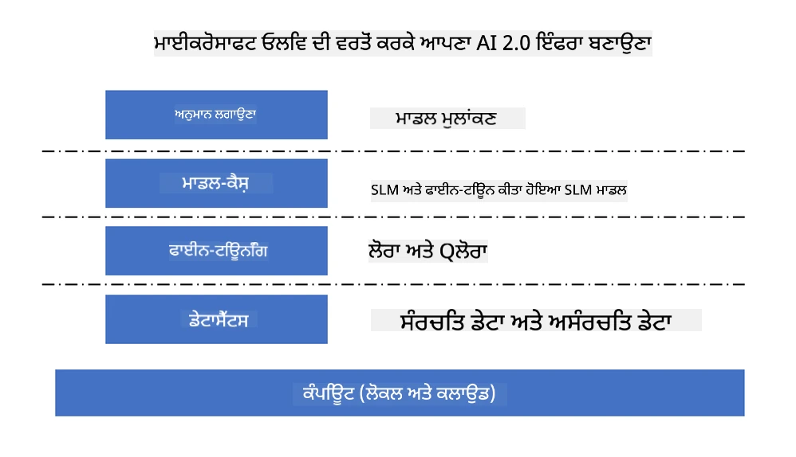
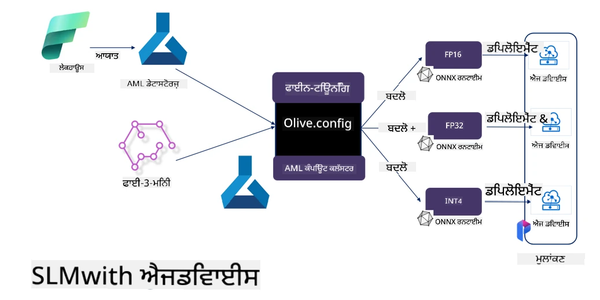

# **Microsoft Olive ਨਾਲ Phi-3 ਦੀ ਫਾਈਨ-ਟਿਊਨਿੰਗ**

[Olive](https://github.com/microsoft/OLive?WT.mc_id=aiml-138114-kinfeylo) ਇੱਕ ਆਸਾਨ-ਵਰਤੋਂ ਵਾਲਾ ਹਾਰਡਵੇਅਰ-ਅਵੇਅਰ ਮਾਡਲ ਅਪਟੀਮਾਈਜ਼ੇਸ਼ਨ ਟੂਲ ਹੈ ਜੋ ਮਾਡਲ ਕੰਪ੍ਰੈਸ਼ਨ, ਅਪਟੀਮਾਈਜ਼ੇਸ਼ਨ ਅਤੇ ਕੰਪਾਈਲੇਸ਼ਨ ਵਿੱਚ ਉਦਯੋਗ-ਅਗਵਾਈ ਤਕਨੀਕਾਂ ਨੂੰ ਇਕੱਠਾ ਕਰਦਾ ਹੈ।

ਇਹ ਮਸ਼ੀਨ ਲਰਨਿੰਗ ਮਾਡਲਾਂ ਨੂੰ ਅਪਟੀਮਾਈਜ਼ ਕਰਨ ਦੀ ਪ੍ਰਕਿਰਿਆ ਨੂੰ ਸਧਾਰਨ ਬਣਾਉਣ ਲਈ ਬਣਾਇਆ ਗਿਆ ਹੈ, ਤਾਂ ਜੋ ਇਹ ਨਿਰਧਾਰਿਤ ਹਾਰਡਵੇਅਰ ਆਰਕੀਟੈਕਚਰਾਂ ਦਾ ਸਭ ਤੋਂ ਪ੍ਰਭਾਵਸ਼ਾਲੀ ਇਸਤੇਮਾਲ ਕਰ ਸਕਣ।

ਚਾਹੇ ਤੁਸੀਂ ਕਲਾਉਡ-ਅਧਾਰਿਤ ਐਪਲੀਕੇਸ਼ਨਾਂ 'ਤੇ ਕੰਮ ਕਰ ਰਹੇ ਹੋ ਜਾਂ ਐਜ ਡਿਵਾਈਸز 'ਤੇ, Olive ਤੁਹਾਡੇ ਮਾਡਲਾਂ ਨੂੰ ਬਿਨਾਂ ਕਿਸੇ ਮੁਸ਼ਕਲ ਦੇ ਪ੍ਰਭਾਵਸ਼ਾਲੀ ਤਰੀਕੇ ਨਾਲ ਅਪਟੀਮਾਈਜ਼ ਕਰਨ ਦੀ ਸਹੂਲਤ ਦਿੰਦਾ ਹੈ।

## ਮੁੱਖ ਵਿਸ਼ੇਸ਼ਤਾਵਾਂ:
- Olive ਚਾਹੀਦੇ ਹਾਰਡਵੇਅਰ ਟਾਰਗੇਟਾਂ ਲਈ ਅਪਟੀਮਾਈਜ਼ੇਸ਼ਨ ਤਕਨੀਕਾਂ ਨੂੰ ਇਕੱਠਾ ਕਰਦਾ ਅਤੇ ਆਟੋਮੇਟ ਕਰਦਾ ਹੈ।
- ਕੋਈ ਇਕੱਲੀ ਅਪਟੀਮਾਈਜ਼ੇਸ਼ਨ ਤਕਨੀਕ ਸਾਰੇ ਸਥਿਤੀਆਂ ਲਈ ਠੀਕ ਨਹੀਂ ਹੁੰਦੀ, ਇਸ ਲਈ Olive ਉਦਯੋਗ ਦੇ ਮਾਹਿਰਾਂ ਨੂੰ ਆਪਣੀਆਂ ਨਵੀਂ ਤਕਨੀਕਾਂ ਜੋੜਨ ਦੀ ਆਜ਼ਾਦੀ ਦਿੰਦਾ ਹੈ।

## ਇੰਜੀਨੀਅਰਿੰਗ ਮਿਹਨਤ ਘਟਾਓ:
- ਡਿਵੈਲਪਰਾਂ ਨੂੰ ਅਕਸਰ ਤਿਆਰ ਕੀਤੇ ਮਾਡਲਾਂ ਨੂੰ ਡਿਪਲੋਇਮੈਂਟ ਲਈ ਤਿਆਰ ਕਰਨ ਅਤੇ ਅਪਟੀਮਾਈਜ਼ ਕਰਨ ਲਈ ਕਈ ਹਾਰਡਵੇਅਰ ਵੇਂਡਰ-ਖਾਸ ਟੂਲਚੇਨ ਸਿੱਖਣੇ ਅਤੇ ਵਰਤਣੇ ਪੈਂਦੇ ਹਨ।
- Olive ਇਸ ਤਜਰਬੇ ਨੂੰ ਸਧਾਰਨ ਬਣਾਉਂਦਾ ਹੈ ਅਤੇ ਚਾਹੀਦੇ ਹਾਰਡਵੇਅਰ ਲਈ ਅਪਟੀਮਾਈਜ਼ੇਸ਼ਨ ਤਕਨੀਕਾਂ ਨੂੰ ਆਟੋਮੇਟ ਕਰਦਾ ਹੈ।

## ਤਿਆਰ-ਵਰਤੋਂ E2E ਅਪਟੀਮਾਈਜ਼ੇਸ਼ਨ ਹੱਲ:

ਇਕੱਠੇ ਕੀਤੀਆਂ ਅਤੇ ਟਿਊਨ ਕੀਤੀਆਂ ਤਕਨੀਕਾਂ ਰਾਹੀਂ, Olive ਇੱਕ ਇਕਾਈ ਹੱਲ ਦਿੰਦਾ ਹੈ ਜੋ ਅੰਤ-ਤੱਕ ਅਪਟੀਮਾਈਜ਼ੇਸ਼ਨ ਕਰਦਾ ਹੈ।
ਇਹ ਮਾਡਲਾਂ ਨੂੰ ਅਪਟੀਮਾਈਜ਼ ਕਰਦਿਆਂ ਸਹੀਪਣ ਅਤੇ ਲੇਟੈਂਸੀ ਵਰਗੀਆਂ ਪਾਬੰਦੀਆਂ ਨੂੰ ਧਿਆਨ ਵਿੱਚ ਰੱਖਦਾ ਹੈ।

## Microsoft Olive ਨਾਲ ਫਾਈਨ-ਟਿਊਨਿੰਗ ਕਰਨਾ

Microsoft Olive ਇੱਕ ਬਹੁਤ ਹੀ ਆਸਾਨ ਵਰਤੋਂ ਵਾਲਾ ਖੁੱਲਾ ਸਰੋਤ ਮਾਡਲ ਅਪਟੀਮਾਈਜ਼ੇਸ਼ਨ ਟੂਲ ਹੈ ਜੋ ਜਨਰੇਟਿਵ ਕ੍ਰਿਤ੍ਰਿਮ ਬੁੱਧੀ ਦੇ ਖੇਤਰ ਵਿੱਚ ਫਾਈਨ-ਟਿਊਨਿੰਗ ਅਤੇ ਰੈਫਰੈਂਸ ਦੋਹਾਂ ਨੂੰ ਕਵਰ ਕਰ ਸਕਦਾ ਹੈ। ਇਹ ਸਿਰਫ ਸਧਾਰਣ ਸੰਰਚਨਾ ਦੀ ਲੋੜ ਰੱਖਦਾ ਹੈ, ਖੁੱਲੇ ਸਰੋਤ ਦੇ ਛੋਟੇ ਭਾਸ਼ਾ ਮਾਡਲਾਂ ਅਤੇ ਸੰਬੰਧਿਤ ਰਨਟਾਈਮ ਵਾਤਾਵਰਨ (AzureML / ਲੋਕਲ GPU, CPU, DirectML) ਦੇ ਨਾਲ ਮਿਲਾ ਕੇ, ਤੁਸੀਂ ਆਟੋਮੈਟਿਕ ਅਪਟੀਮਾਈਜ਼ੇਸ਼ਨ ਰਾਹੀਂ ਮਾਡਲ ਦੀ ਫਾਈਨ-ਟਿਊਨਿੰਗ ਜਾਂ ਰੈਫਰੈਂਸ ਪੂਰੀ ਕਰ ਸਕਦੇ ਹੋ ਅਤੇ ਸਭ ਤੋਂ ਵਧੀਆ ਮਾਡਲ ਕਲਾਉਡ ਜਾਂ ਐਜ ਡਿਵਾਈਸز 'ਤੇ ਡਿਪਲੋਇ ਕਰਨ ਲਈ ਲੱਭ ਸਕਦੇ ਹੋ। ਇਹ ਉਦਯੋਗਾਂ ਨੂੰ ਆਪਣੇ ਖੁਦ ਦੇ ਖੇਤਰ-ਵਿਸ਼ੇਸ਼ ਮਾਡਲਾਂ ਨੂੰ ਓਨ-ਪ੍ਰੇਮਿਸ ਅਤੇ ਕਲਾਉਡ ਵਿੱਚ ਬਣਾਉਣ ਦੀ ਆਗਿਆ ਦਿੰਦਾ ਹੈ।



## Microsoft Olive ਨਾਲ Phi-3 ਦੀ ਫਾਈਨ-ਟਿਊਨਿੰਗ



## Phi-3 Olive ਨਮੂਨਾ ਕੋਡ ਅਤੇ ਉਦਾਹਰਨ
ਇਸ ਉਦਾਹਰਨ ਵਿੱਚ ਤੁਸੀਂ Olive ਦੀ ਵਰਤੋਂ ਕਰਕੇ:

- LoRA ਐਡਾਪਟਰ ਨੂੰ ਫਾਈਨ-ਟਿਊਨ ਕਰੋ ਤਾਂ ਜੋ ਵਾਕਾਂਸ਼ਾਂ ਨੂੰ Sad, Joy, Fear, Surprise ਵਿੱਚ ਵਰਗੀਕ੍ਰਿਤ ਕੀਤਾ ਜਾ ਸਕੇ।
- ਐਡਾਪਟਰ ਦੇ ਵਜ਼ਨ ਬੇਸ ਮਾਡਲ ਵਿੱਚ ਮਿਲਾਓ।
- ਮਾਡਲ ਨੂੰ int4 ਵਿੱਚ ਅਪਟੀਮਾਈਜ਼ ਅਤੇ ਕਵਾਂਟਾਈਜ਼ ਕਰੋ।

[Sample Code](../../code/03.Finetuning/olive-ort-example/README.md)

### Microsoft Olive ਸੈਟਅਪ ਕਰੋ

Microsoft Olive ਦੀ ਇੰਸਟਾਲੇਸ਼ਨ ਬਹੁਤ ਸਧਾਰਣ ਹੈ, ਅਤੇ ਇਹ CPU, GPU, DirectML, ਅਤੇ Azure ML ਲਈ ਵੀ ਇੰਸਟਾਲ ਕੀਤੀ ਜਾ ਸਕਦੀ ਹੈ।

```bash
pip install olive-ai
```

ਜੇ ਤੁਸੀਂ CPU ਨਾਲ ONNX ਮਾਡਲ ਚਲਾਉਣਾ ਚਾਹੁੰਦੇ ਹੋ, ਤਾਂ ਤੁਸੀਂ ਇਹ ਵਰਤ ਸਕਦੇ ਹੋ

```bash
pip install olive-ai[cpu]
```

ਜੇ ਤੁਸੀਂ GPU ਨਾਲ ONNX ਮਾਡਲ ਚਲਾਉਣਾ ਚਾਹੁੰਦੇ ਹੋ, ਤਾਂ ਤੁਸੀਂ ਇਹ ਵਰਤ ਸਕਦੇ ਹੋ

```python
pip install olive-ai[gpu]
```

ਜੇ ਤੁਸੀਂ Azure ML ਵਰਤਣਾ ਚਾਹੁੰਦੇ ਹੋ, ਤਾਂ ਇਹ ਵਰਤੋ

```python
pip install git+https://github.com/microsoft/Olive#egg=olive-ai[azureml]
```

**Notice**  
OS ਦੀ ਲੋੜ: Ubuntu 20.04 / 22.04

### **Microsoft Olive ਦਾ Config.json**

ਇੰਸਟਾਲੇਸ਼ਨ ਤੋਂ ਬਾਅਦ, ਤੁਸੀਂ Config ਫਾਈਲ ਰਾਹੀਂ ਵੱਖ-ਵੱਖ ਮਾਡਲ-ਖਾਸ ਸੈਟਿੰਗਜ਼ ਨੂੰ ਸੰਰਚਿਤ ਕਰ ਸਕਦੇ ਹੋ, ਜਿਸ ਵਿੱਚ ਡੇਟਾ, ਕੰਪਿਊਟਿੰਗ, ਟ੍ਰੇਨਿੰਗ, ਡਿਪਲੋਇਮੈਂਟ ਅਤੇ ਮਾਡਲ ਜਨਰੇਸ਼ਨ ਸ਼ਾਮਲ ਹਨ।

**1. ਡੇਟਾ**

Microsoft Olive 'ਤੇ, ਲੋਕਲ ਡੇਟਾ ਅਤੇ ਕਲਾਉਡ ਡੇਟਾ 'ਤੇ ਟ੍ਰੇਨਿੰਗ ਸਹਾਇਤਾ ਕੀਤੀ ਜਾ ਸਕਦੀ ਹੈ ਅਤੇ ਇਹ ਸੈਟਿੰਗਜ਼ ਵਿੱਚ ਸੰਰਚਿਤ ਕੀਤੀ ਜਾ ਸਕਦੀ ਹੈ।

*ਲੋਕਲ ਡੇਟਾ ਸੈਟਿੰਗਜ਼*

ਤੁਸੀਂ ਸਿੱਧਾ ਉਹ ਡੇਟਾ ਸੈੱਟ ਸੈਟ ਕਰ ਸਕਦੇ ਹੋ ਜਿਸ 'ਤੇ ਫਾਈਨ-ਟਿਊਨਿੰਗ ਲਈ ਟ੍ਰੇਨਿੰਗ ਕਰਨੀ ਹੈ, ਆਮ ਤੌਰ 'ਤੇ json ਫਾਰਮੈਟ ਵਿੱਚ, ਅਤੇ ਇਸਨੂੰ ਡੇਟਾ ਟੈਮਪਲੇਟ ਨਾਲ ਅਨੁਕੂਲਿਤ ਕਰੋ। ਇਹ ਮਾਡਲ ਦੀਆਂ ਲੋੜਾਂ ਅਨੁਸਾਰ ਬਦਲਿਆ ਜਾ ਸਕਦਾ ਹੈ (ਜਿਵੇਂ ਕਿ Microsoft Phi-3-mini ਲਈ ਲੋੜੀਂਦੇ ਫਾਰਮੈਟ ਅਨੁਸਾਰ)। ਜੇ ਤੁਹਾਡੇ ਕੋਲ ਹੋਰ ਮਾਡਲ ਹਨ, ਤਾਂ ਕਿਰਪਾ ਕਰਕੇ ਹੋਰ ਮਾਡਲਾਂ ਦੀਆਂ ਲੋੜੀਂਦੀਆਂ ਫਾਈਨ-ਟਿਊਨਿੰਗ ਫਾਰਮੈਟਾਂ ਨੂੰ ਵੇਖੋ।

```json

    "data_configs": [
        {
            "name": "dataset_default_train",
            "type": "HuggingfaceContainer",
            "load_dataset_config": {
                "params": {
                    "data_name": "json", 
                    "data_files":"dataset/dataset-classification.json",
                    "split": "train"
                }
            },
            "pre_process_data_config": {
                "params": {
                    "dataset_type": "corpus",
                    "text_cols": [
                            "phrase",
                            "tone"
                    ],
                    "text_template": "### Text: {phrase}\n### The tone is:\n{tone}",
                    "corpus_strategy": "join",
                    "source_max_len": 2048,
                    "pad_to_max_len": false,
                    "use_attention_mask": false
                }
            }
        }
    ],
```

**ਕਲਾਉਡ ਡੇਟਾ ਸਰੋਤ ਸੈਟਿੰਗਜ਼**

Azure AI Studio/Azure Machine Learning Service ਦੇ ਡੇਟਾਸਟੋਰ ਨੂੰ ਕਲਾਉਡ ਵਿੱਚ ਡੇਟਾ ਨਾਲ ਜੋੜ ਕੇ, ਤੁਸੀਂ Microsoft Fabric ਅਤੇ Azure Data ਰਾਹੀਂ ਵੱਖ-ਵੱਖ ਡੇਟਾ ਸਰੋਤਾਂ ਨੂੰ Azure AI Studio/Azure Machine Learning Service ਵਿੱਚ ਲਿਆ ਸਕਦੇ ਹੋ, ਜੋ ਫਾਈਨ-ਟਿਊਨਿੰਗ ਲਈ ਸਹਾਇਤਾ ਦਿੰਦੇ ਹਨ।

```json

    "data_configs": [
        {
            "name": "dataset_default_train",
            "type": "HuggingfaceContainer",
            "load_dataset_config": {
                "params": {
                    "data_name": "json", 
                    "data_files": {
                        "type": "azureml_datastore",
                        "config": {
                            "azureml_client": {
                                "subscription_id": "Your Azure Subscrition ID",
                                "resource_group": "Your Azure Resource Group",
                                "workspace_name": "Your Azure ML Workspaces name"
                            },
                            "datastore_name": "workspaceblobstore",
                            "relative_path": "Your train_data.json Azure ML Location"
                        }
                    },
                    "split": "train"
                }
            },
            "pre_process_data_config": {
                "params": {
                    "dataset_type": "corpus",
                    "text_cols": [
                            "Question",
                            "Best Answer"
                    ],
                    "text_template": "<|user|>\n{Question}<|end|>\n<|assistant|>\n{Best Answer}\n<|end|>",
                    "corpus_strategy": "join",
                    "source_max_len": 2048,
                    "pad_to_max_len": false,
                    "use_attention_mask": false
                }
            }
        }
    ],
    
```

**2. ਕੰਪਿਊਟਿੰਗ ਸੰਰਚਨਾ**

ਜੇ ਤੁਹਾਨੂੰ ਲੋਕਲ ਹੋਣਾ ਹੈ, ਤਾਂ ਤੁਸੀਂ ਸਿੱਧਾ ਲੋਕਲ ਡੇਟਾ ਸਰੋਤਾਂ ਦੀ ਵਰਤੋਂ ਕਰ ਸਕਦੇ ਹੋ। ਜੇ ਤੁਹਾਨੂੰ Azure AI Studio / Azure Machine Learning Service ਦੇ ਸਰੋਤਾਂ ਦੀ ਲੋੜ ਹੈ, ਤਾਂ ਤੁਹਾਨੂੰ ਸੰਬੰਧਿਤ Azure ਪੈਰਾਮੀਟਰ, ਕੰਪਿਊਟਿੰਗ ਪਾਵਰ ਦਾ ਨਾਮ ਆਦਿ ਸੰਰਚਿਤ ਕਰਨੇ ਪੈਣਗੇ।

```json

    "systems": {
        "aml": {
            "type": "AzureML",
            "config": {
                "accelerators": ["gpu"],
                "hf_token": true,
                "aml_compute": "Your Azure AI Studio / Azure Machine Learning Service Compute Name",
                "aml_docker_config": {
                    "base_image": "Your Azure AI Studio / Azure Machine Learning Service docker",
                    "conda_file_path": "conda.yaml"
                }
            }
        },
        "azure_arc": {
            "type": "AzureML",
            "config": {
                "accelerators": ["gpu"],
                "aml_compute": "Your Azure AI Studio / Azure Machine Learning Service Compute Name",
                "aml_docker_config": {
                    "base_image": "Your Azure AI Studio / Azure Machine Learning Service docker",
                    "conda_file_path": "conda.yaml"
                }
            }
        }
    },
```

***Notice***

ਕਿਉਂਕਿ ਇਹ Azure AI Studio/Azure Machine Learning Service 'ਤੇ ਕੰਟੇਨਰ ਰਾਹੀਂ ਚਲਾਇਆ ਜਾਂਦਾ ਹੈ, ਲੋੜੀਂਦਾ ਵਾਤਾਵਰਨ ਸੰਰਚਿਤ ਕਰਨਾ ਜਰੂਰੀ ਹੈ। ਇਹ conda.yaml ਵਾਤਾਵਰਨ ਵਿੱਚ ਸੰਰਚਿਤ ਕੀਤਾ ਜਾਂਦਾ ਹੈ।

```yaml

name: project_environment
channels:
  - defaults
dependencies:
  - python=3.8.13
  - pip=22.3.1
  - pip:
      - einops
      - accelerate
      - azure-keyvault-secrets
      - azure-identity
      - bitsandbytes
      - datasets
      - huggingface_hub
      - peft
      - scipy
      - sentencepiece
      - torch>=2.2.0
      - transformers
      - git+https://github.com/microsoft/Olive@jiapli/mlflow_loading_fix#egg=olive-ai[gpu]
      - --extra-index-url https://aiinfra.pkgs.visualstudio.com/PublicPackages/_packaging/ORT-Nightly/pypi/simple/ 
      - ort-nightly-gpu==1.18.0.dev20240307004
      - --extra-index-url https://aiinfra.pkgs.visualstudio.com/PublicPackages/_packaging/onnxruntime-genai/pypi/simple/
      - onnxruntime-genai-cuda

    

```

**3. ਆਪਣਾ SLM ਚੁਣੋ**

ਤੁਸੀਂ ਮਾਡਲ ਨੂੰ ਸਿੱਧਾ Hugging Face ਤੋਂ ਵਰਤ ਸਕਦੇ ਹੋ, ਜਾਂ Azure AI Studio / Azure Machine Learning ਦੇ ਮਾਡਲ ਕੈਟਾਲੌਗ ਨਾਲ ਜੋੜ ਕੇ ਮਾਡਲ ਚੁਣ ਸਕਦੇ ਹੋ। ਹੇਠਾਂ ਦਿੱਤੇ ਕੋਡ ਉਦਾਹਰਨ ਵਿੱਚ ਅਸੀਂ Microsoft Phi-3-mini ਨੂੰ ਉਦਾਹਰਨ ਵਜੋਂ ਵਰਤਾਂਗੇ।

ਜੇ ਤੁਹਾਡੇ ਕੋਲ ਮਾਡਲ ਲੋਕਲ ਹੈ, ਤਾਂ ਤੁਸੀਂ ਇਹ ਤਰੀਕਾ ਵਰਤ ਸਕਦੇ ਹੋ

```json

    "input_model":{
        "type": "PyTorchModel",
        "config": {
            "hf_config": {
                "model_name": "model-cache/microsoft/phi-3-mini",
                "task": "text-generation",
                "model_loading_args": {
                    "trust_remote_code": true
                }
            }
        }
    },
```

ਜੇ ਤੁਸੀਂ Azure AI Studio / Azure Machine Learning Service ਤੋਂ ਮਾਡਲ ਵਰਤਣਾ ਚਾਹੁੰਦੇ ਹੋ, ਤਾਂ ਇਹ ਤਰੀਕਾ ਵਰਤੋ

```json

    "input_model":{
        "type": "PyTorchModel",
        "config": {
            "model_path": {
                "type": "azureml_registry_model",
                "config": {
                    "name": "microsoft/Phi-3-mini-4k-instruct",
                    "registry_name": "azureml-msr",
                    "version": "11"
                }
            },
             "model_file_format": "PyTorch.MLflow",
             "hf_config": {
                "model_name": "microsoft/Phi-3-mini-4k-instruct",
                "task": "text-generation",
                "from_pretrained_args": {
                    "trust_remote_code": true
                }
            }
        }
    },
```

**Notice:**  
ਸਾਨੂੰ Azure AI Studio / Azure Machine Learning Service ਨਾਲ ਇੰਟੀਗ੍ਰੇਟ ਕਰਨਾ ਪੈਂਦਾ ਹੈ, ਇਸ ਲਈ ਮਾਡਲ ਸੈਟਅਪ ਕਰਦਿਆਂ ਵਰਜਨ ਨੰਬਰ ਅਤੇ ਸੰਬੰਧਿਤ ਨਾਮਾਂ ਨੂੰ ਧਿਆਨ ਵਿੱਚ ਰੱਖੋ।

Azure 'ਤੇ ਸਾਰੇ ਮਾਡਲ PyTorch.MLflow 'ਤੇ ਸੈਟ ਹੋਣੇ ਚਾਹੀਦੇ ਹਨ।

ਤੁਹਾਨੂੰ Hugging Face ਖਾਤਾ ਹੋਣਾ ਚਾਹੀਦਾ ਹੈ ਅਤੇ ਕੁੰਜੀ ਨੂੰ Azure AI Studio / Azure Machine Learning ਦੀ Key value ਨਾਲ ਬਾਈਂਡ ਕਰਨਾ ਚਾਹੀਦਾ ਹੈ।

**4. ਅਲਗੋਰਿਦਮ**

Microsoft Olive ਨੇ Lora ਅਤੇ QLora ਫਾਈਨ-ਟਿਊਨਿੰਗ ਅਲਗੋਰਿਦਮਾਂ ਨੂੰ ਬਹੁਤ ਵਧੀਆ ਤਰੀਕੇ ਨਾਲ ਕੈਪਸੂਲ ਕੀਤਾ ਹੈ। ਤੁਹਾਨੂੰ ਸਿਰਫ ਕੁਝ ਸੰਬੰਧਿਤ ਪੈਰਾਮੀਟਰ ਸੰਰਚਿਤ ਕਰਨੇ ਹੁੰਦੇ ਹਨ। ਇੱਥੇ ਮੈਂ QLora ਨੂੰ ਉਦਾਹਰਨ ਵਜੋਂ ਲੈ ਰਿਹਾ ਹਾਂ।

```json
        "lora": {
            "type": "LoRA",
            "config": {
                "target_modules": [
                    "o_proj",
                    "qkv_proj"
                ],
                "double_quant": true,
                "lora_r": 64,
                "lora_alpha": 64,
                "lora_dropout": 0.1,
                "train_data_config": "dataset_default_train",
                "eval_dataset_size": 0.3,
                "training_args": {
                    "seed": 0,
                    "data_seed": 42,
                    "per_device_train_batch_size": 1,
                    "per_device_eval_batch_size": 1,
                    "gradient_accumulation_steps": 4,
                    "gradient_checkpointing": false,
                    "learning_rate": 0.0001,
                    "num_train_epochs": 3,
                    "max_steps": 10,
                    "logging_steps": 10,
                    "evaluation_strategy": "steps",
                    "eval_steps": 187,
                    "group_by_length": true,
                    "adam_beta2": 0.999,
                    "max_grad_norm": 0.3
                }
            }
        },
```

ਜੇ ਤੁਸੀਂ ਕਵਾਂਟਾਈਜ਼ੇਸ਼ਨ ਬਦਲਾਅ ਕਰਨਾ ਚਾਹੁੰਦੇ ਹੋ, ਤਾਂ Microsoft Olive ਦਾ ਮੁੱਖ ਬ੍ਰਾਂਚ ਪਹਿਲਾਂ ਹੀ onnxruntime-genai ਤਰੀਕੇ ਨੂੰ ਸਹਾਇਤਾ ਦਿੰਦਾ ਹੈ। ਤੁਸੀਂ ਆਪਣੀਆਂ ਲੋੜਾਂ ਅਨੁਸਾਰ ਇਸਨੂੰ ਸੈਟ ਕਰ ਸਕਦੇ ਹੋ:

1. ਐਡਾਪਟਰ ਵਜ਼ਨਾਂ ਨੂੰ ਬੇਸ ਮਾਡਲ ਵਿੱਚ ਮਿਲਾਓ  
2. ModelBuilder ਰਾਹੀਂ ਮਾਡਲ ਨੂੰ ਲੋੜੀਂਦੇ ਪ੍ਰਿਸੀਜ਼ਨ ਨਾਲ onnx ਮਾਡਲ ਵਿੱਚ ਬਦਲੋ

ਜਿਵੇਂ ਕਿ ਕਵਾਂਟਾਈਜ਼ਡ INT4 ਵਿੱਚ ਬਦਲਣਾ

```json

        "merge_adapter_weights": {
            "type": "MergeAdapterWeights"
        },
        "builder": {
            "type": "ModelBuilder",
            "config": {
                "precision": "int4"
            }
        }
```

**Notice**  
- ਜੇ ਤੁਸੀਂ QLoRA ਵਰਤਦੇ ਹੋ, ਤਾਂ ONNXRuntime-genai ਦੀ ਕਵਾਂਟਾਈਜ਼ੇਸ਼ਨ ਬਦਲਾਅ ਇਸ ਸਮੇਂ ਸਹਾਇਤਿਤ ਨਹੀਂ ਹੈ।  
- ਇੱਥੇ ਇਹ ਵੀ ਦੱਸਣਾ ਜਰੂਰੀ ਹੈ ਕਿ ਤੁਸੀਂ ਉਪਰੋਕਤ ਕਦਮਾਂ ਨੂੰ ਆਪਣੀਆਂ ਲੋੜਾਂ ਅਨੁਸਾਰ ਸੈਟ ਕਰ ਸਕਦੇ ਹੋ। ਇਹ ਜ਼ਰੂਰੀ ਨਹੀਂ ਕਿ ਤੁਸੀਂ ਸਾਰੇ ਕਦਮ ਪੂਰੀ ਤਰ੍ਹਾਂ ਸੰਰਚਿਤ ਕਰੋ। ਆਪਣੀਆਂ ਲੋੜਾਂ ਅਨੁਸਾਰ ਤੁਸੀਂ ਸਿੱਧਾ ਅਲਗੋਰਿਦਮ ਦੇ ਕਦਮ ਵਰਤ ਸਕਦੇ ਹੋ ਬਿਨਾਂ ਫਾਈਨ-ਟਿਊਨਿੰਗ ਦੇ। ਆਖ਼ਿਰ ਵਿੱਚ ਤੁਹਾਨੂੰ ਸੰਬੰਧਿਤ ਇੰਜਨਾਂ ਨੂੰ ਸੰਰਚਿਤ ਕਰਨਾ ਪਵੇਗਾ।

```json

    "engine": {
        "log_severity_level": 0,
        "host": "aml",
        "target": "aml",
        "search_strategy": false,
        "execution_providers": ["CUDAExecutionProvider"],
        "cache_dir": "../model-cache/models/phi3-finetuned/cache",
        "output_dir" : "../model-cache/models/phi3-finetuned"
    }
```

**5. ਫਾਈਨ-ਟਿਊਨਿੰਗ ਮੁਕੰਮਲ**

ਕਮਾਂਡ ਲਾਈਨ 'ਤੇ, olive-config.json ਵਾਲੇ ਡਾਇਰੈਕਟਰੀ ਵਿੱਚ ਇਹ ਚਲਾਓ

```bash
olive run --config olive-config.json  
```

**ਅਸਵੀਕਾਰੋਪਣ**:  
ਇਹ ਦਸਤਾਵੇਜ਼ AI ਅਨੁਵਾਦ ਸੇਵਾ [Co-op Translator](https://github.com/Azure/co-op-translator) ਦੀ ਵਰਤੋਂ ਕਰਕੇ ਅਨੁਵਾਦਿਤ ਕੀਤਾ ਗਿਆ ਹੈ। ਜਦੋਂ ਕਿ ਅਸੀਂ ਸਹੀਅਤ ਲਈ ਕੋਸ਼ਿਸ਼ ਕਰਦੇ ਹਾਂ, ਕਿਰਪਾ ਕਰਕੇ ਧਿਆਨ ਰੱਖੋ ਕਿ ਸਵੈਚਾਲਿਤ ਅਨੁਵਾਦਾਂ ਵਿੱਚ ਗਲਤੀਆਂ ਜਾਂ ਅਸਮਰਥਤਾਵਾਂ ਹੋ ਸਕਦੀਆਂ ਹਨ। ਮੂਲ ਦਸਤਾਵੇਜ਼ ਆਪਣੀ ਮੂਲ ਭਾਸ਼ਾ ਵਿੱਚ ਪ੍ਰਮਾਣਿਕ ਸਰੋਤ ਮੰਨਿਆ ਜਾਣਾ ਚਾਹੀਦਾ ਹੈ। ਮਹੱਤਵਪੂਰਨ ਜਾਣਕਾਰੀ ਲਈ, ਪੇਸ਼ੇਵਰ ਮਨੁੱਖੀ ਅਨੁਵਾਦ ਦੀ ਸਿਫਾਰਸ਼ ਕੀਤੀ ਜਾਂਦੀ ਹੈ। ਅਸੀਂ ਇਸ ਅਨੁਵਾਦ ਦੀ ਵਰਤੋਂ ਤੋਂ ਉਤਪੰਨ ਕਿਸੇ ਵੀ ਗਲਤਫਹਿਮੀ ਜਾਂ ਗਲਤ ਵਿਆਖਿਆ ਲਈ ਜ਼ਿੰਮੇਵਾਰ ਨਹੀਂ ਹਾਂ।