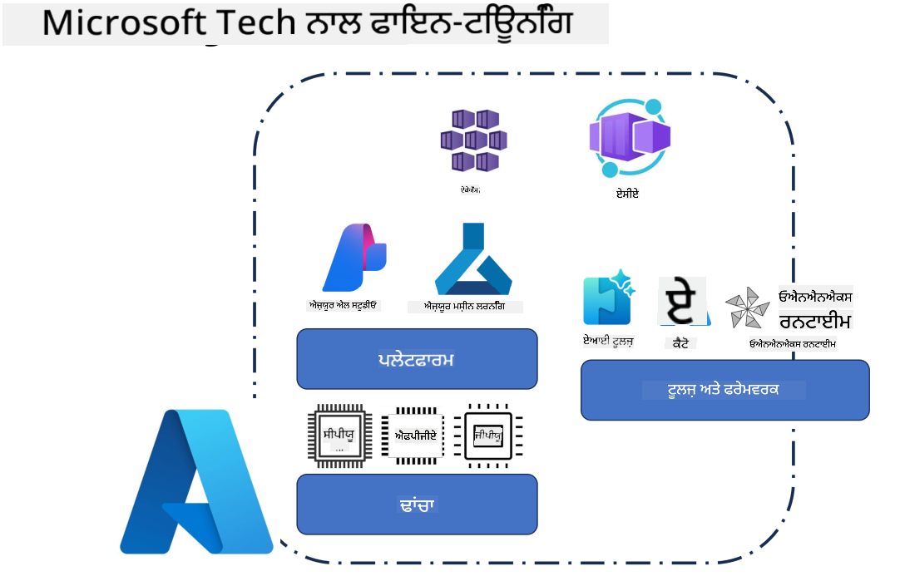
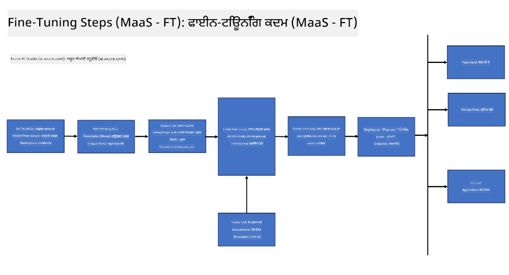
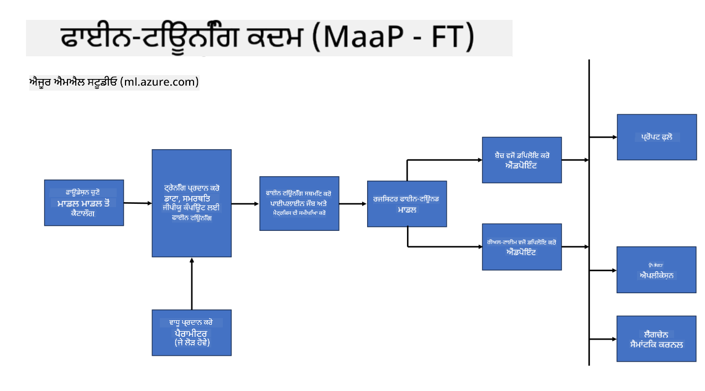
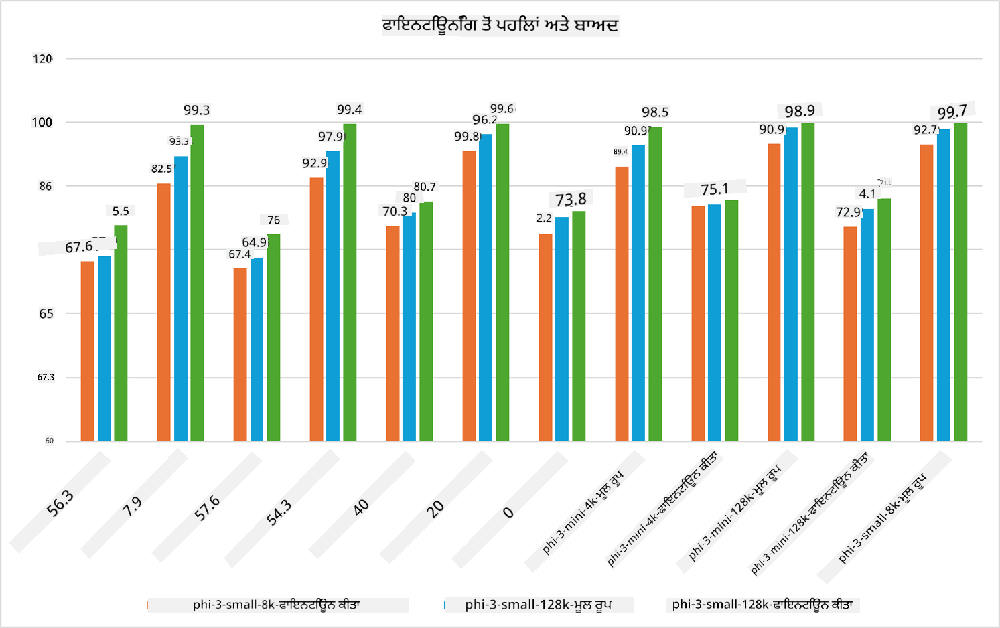

<!--
CO_OP_TRANSLATOR_METADATA:
{
  "original_hash": "cb5648935f63edc17e95ce38f23adc32",
  "translation_date": "2025-05-09T21:54:34+00:00",
  "source_file": "md/03.FineTuning/FineTuning_Scenarios.md",
  "language_code": "pa"
}
-->
## ਫਾਈਨ ਟਿਊਨਿੰਗ ਸਿਨਾਰੀਓਜ਼

**ਪਲੇਟਫਾਰਮ** ਇਸ ਵਿੱਚ ਵੱਖ-ਵੱਖ ਤਕਨਾਲੋਜੀਆਂ ਸ਼ਾਮਿਲ ਹਨ ਜਿਵੇਂ ਕਿ Azure AI Foundry, Azure Machine Learning, AI Tools, Kaito, ਅਤੇ ONNX Runtime।

**ਇੰਫ੍ਰਾਸਟਰੱਕਚਰ** ਇਸ ਵਿੱਚ CPU ਅਤੇ FPGA ਸ਼ਾਮਿਲ ਹਨ, ਜੋ ਫਾਈਨ-ਟਿਊਨਿੰਗ ਪ੍ਰਕਿਰਿਆ ਲਈ ਜ਼ਰੂਰੀ ਹਨ। ਮੈਂ ਤੁਹਾਨੂੰ ਹਰ ਇੱਕ ਤਕਨਾਲੋਜੀ ਦੇ ਆਈਕਾਨ ਦਿਖਾਉਂਦਾ ਹਾਂ।

**ਟੂਲਜ਼ ਅਤੇ ਫਰੇਮਵਰਕ** ਇਸ ਵਿੱਚ ONNX Runtime ਸ਼ਾਮਿਲ ਹੈ। ਮੈਂ ਤੁਹਾਨੂੰ ਹਰ ਇੱਕ ਤਕਨਾਲੋਜੀ ਦੇ ਆਈਕਾਨ ਦਿਖਾਉਂਦਾ ਹਾਂ।  
[Insert icons for ONNX Runtime and ONNX Runtime]

ਮਾਇਕ੍ਰੋਸਾਫਟ ਤਕਨਾਲੋਜੀਆਂ ਨਾਲ ਫਾਈਨ-ਟਿਊਨਿੰਗ ਪ੍ਰਕਿਰਿਆ ਵਿੱਚ ਵੱਖ-ਵੱਖ ਕੰਪੋਨੈਂਟ ਅਤੇ ਟੂਲਜ਼ ਸ਼ਾਮਿਲ ਹੁੰਦੇ ਹਨ। ਇਹ ਤਕਨਾਲੋਜੀਆਂ ਸਮਝ ਕੇ ਅਤੇ ਵਰਤ ਕੇ, ਅਸੀਂ ਆਪਣੀਆਂ ਐਪਲੀਕੇਸ਼ਨਾਂ ਨੂੰ ਪ੍ਰਭਾਵਸ਼ਾਲੀ ਤਰੀਕੇ ਨਾਲ ਫਾਈਨ-ਟਿਊਨ ਕਰ ਸਕਦੇ ਹਾਂ ਅਤੇ ਵਧੀਆ ਹੱਲ ਤਿਆਰ ਕਰ ਸਕਦੇ ਹਾਂ।

## ਮਾਡਲ ਐਜ਼ ਸਰਵਿਸ

ਹੋਸਟ ਕੀਤੀ ਫਾਈਨ-ਟਿਊਨਿੰਗ ਦੀ ਵਰਤੋਂ ਕਰਕੇ ਮਾਡਲ ਨੂੰ ਫਾਈਨ-ਟਿਊਨ ਕਰੋ, ਬਿਨਾਂ ਕੰਪਿਊਟ ਬਣਾਉਣ ਅਤੇ ਮੈਨੇਜ ਕਰਨ ਦੀ ਲੋੜ ਦੇ।

ਸਰਵਰਲੇਸ ਫਾਈਨ-ਟਿਊਨਿੰਗ Phi-3-mini ਅਤੇ Phi-3-medium ਮਾਡਲਾਂ ਲਈ ਉਪਲਬਧ ਹੈ, ਜਿਸ ਨਾਲ ਡਿਵੈਲਪਰਜ਼ ਮਾਡਲਾਂ ਨੂੰ ਕਲਾਉਡ ਅਤੇ ਐਜ ਸਿਨਾਰੀਓਜ਼ ਲਈ ਤੇਜ਼ੀ ਨਾਲ ਅਤੇ ਆਸਾਨੀ ਨਾਲ ਕਸਟਮਾਈਜ਼ ਕਰ ਸਕਦੇ ਹਨ ਬਿਨਾਂ ਕੰਪਿਊਟ ਦੀ ਵਿਵਸਥਾ ਕੀਤੇ। ਅਸੀਂ ਇਹ ਵੀ ਐਲਾਨ ਕੀਤਾ ਹੈ ਕਿ Phi-3-small ਹੁਣ Models-as-a-Service ਓਫਰਿੰਗ ਰਾਹੀਂ ਉਪਲਬਧ ਹੈ, ਤਾਂ ਜੋ ਡਿਵੈਲਪਰਜ਼ ਬਿਨਾਂ ਬੇਹਤਰ ਇੰਫ੍ਰਾਸਟਰੱਕਚਰ ਮੈਨੇਜਮੈਂਟ ਦੇ AI ਵਿਕਾਸ ਸ਼ੁਰੂ ਕਰ ਸਕਣ।

## ਮਾਡਲ ਐਜ਼ ਏ ਪਲੇਟਫਾਰਮ

ਯੂਜ਼ਰ ਆਪਣੇ ਕੰਪਿਊਟ ਨੂੰ ਮੈਨੇਜ ਕਰਦੇ ਹਨ ਤਾਂ ਜੋ ਆਪਣੇ ਮਾਡਲਾਂ ਨੂੰ ਫਾਈਨ-ਟਿਊਨ ਕਰ ਸਕਣ।

[Fine Tuning Sample](https://github.com/Azure/azureml-examples/blob/main/sdk/python/foundation-models/system/finetune/chat-completion/chat-completion.ipynb)

## ਫਾਈਨ ਟਿਊਨਿੰਗ ਸਿਨਾਰੀਓਜ਼

| | | | | | | |
|-|-|-|-|-|-|-|
|ਸਿਨਾਰੀਓ|LoRA|QLoRA|PEFT|DeepSpeed|ZeRO|DORA|
|ਪੂਰਵ-ਟ੍ਰੇਨ ਕੀਤੇ LLMs ਨੂੰ ਖਾਸ ਟਾਸਕਾਂ ਜਾਂ ਡੋਮੇਨਾਂ ਲਈ ਅਨੁਕੂਲ ਬਣਾਉਣਾ|ਹਾਂ|ਹਾਂ|ਹਾਂ|ਹਾਂ|ਹਾਂ|ਹਾਂ|
|NLP ਟਾਸਕਾਂ ਲਈ ਫਾਈਨ-ਟਿਊਨਿੰਗ ਜਿਵੇਂ ਕਿ ਟੈਕਸਟ ਕਲਾਸੀਫਿਕੇਸ਼ਨ, ਨਾਮਿਤ ਏਨਟੀਟੀ ਰਿਕਗਨਿਸ਼ਨ, ਅਤੇ ਮਸ਼ੀਨ ਟ੍ਰਾਂਸਲੇਸ਼ਨ|ਹਾਂ|ਹਾਂ|ਹਾਂ|ਹਾਂ|ਹਾਂ|ਹਾਂ|
|QA ਟਾਸਕਾਂ ਲਈ ਫਾਈਨ-ਟਿਊਨਿੰਗ|ਹਾਂ|ਹਾਂ|ਹਾਂ|ਹਾਂ|ਹਾਂ|ਹਾਂ|
|ਚੈਟਬੋਟ ਵਿੱਚ ਮਨੁੱਖੀ ਵਰਗੇ ਜਵਾਬ ਬਣਾਉਣ ਲਈ ਫਾਈਨ-ਟਿਊਨਿੰਗ|ਹਾਂ|ਹਾਂ|ਹਾਂ|ਹਾਂ|ਹਾਂ|ਹਾਂ|
|ਸੰਗੀਤ, ਕਲਾ ਜਾਂ ਹੋਰ ਕਿਸੇ ਰਚਨਾਤਮਕ ਰੂਪ ਲਈ ਫਾਈਨ-ਟਿਊਨਿੰਗ|ਹਾਂ|ਹਾਂ|ਹਾਂ|ਹਾਂ|ਹਾਂ|ਹਾਂ|
|ਕੰਪਿਊਟੇਸ਼ਨਲ ਅਤੇ ਵਿੱਤੀ ਲਾਗਤਾਂ ਨੂੰ ਘਟਾਉਣਾ|ਹਾਂ|ਹਾਂ|ਨਹੀਂ|ਹਾਂ|ਹਾਂ|ਨਹੀਂ|
|ਮੇਮੋਰੀ ਦੀ ਵਰਤੋਂ ਨੂੰ ਘਟਾਉਣਾ|ਨਹੀਂ|ਹਾਂ|ਨਹੀਂ|ਹਾਂ|ਹਾਂ|ਹਾਂ|
|ਘੱਟ ਪੈਰਾਮੀਟਰਾਂ ਦੀ ਵਰਤੋਂ ਕਰਕੇ ਪ੍ਰਭਾਵਸ਼ਾਲੀ ਫਾਈਨਟਿਊਨਿੰਗ|ਨਹੀਂ|ਹਾਂ|ਹਾਂ|ਨਹੀਂ|ਨਹੀਂ|ਹਾਂ|
|ਡਾਟਾ ਪੈਰਲੇਲਿਜ਼ਮ ਦੀ ਐਸੀ ਮੇਮੋਰੀ-ਇਫ਼ੀਸ਼ੀਅਂਟ ਫਾਰਮ ਜੋ ਸਾਰੇ GPU ਡਿਵਾਈਸਾਂ ਦੀ ਕੁੱਲ GPU ਮੇਮੋਰੀ ਤੱਕ ਪਹੁੰਚ ਦਿੰਦੀ ਹੈ|ਨਹੀਂ|ਨਹੀਂ|ਨਹੀਂ|ਹਾਂ|ਹਾਂ|ਹਾਂ|

## ਫਾਈਨ ਟਿਊਨਿੰਗ ਪਰਫਾਰਮੈਂਸ ਉਦਾਹਰਨਾਂ

**ਡਿਸਕਲੇਮਰ**:  
ਇਹ ਦਸਤਾਵੇਜ਼ AI ਅਨੁਵਾਦ ਸੇਵਾ [Co-op Translator](https://github.com/Azure/co-op-translator) ਦੀ ਵਰਤੋਂ ਕਰਕੇ ਅਨੁਵਾਦ ਕੀਤਾ ਗਿਆ ਹੈ। ਜਦੋਂ ਕਿ ਅਸੀਂ ਸਹੀਅਤ ਲਈ ਕੋਸ਼ਿਸ਼ ਕਰਦੇ ਹਾਂ, ਕਿਰਪਾ ਕਰਕੇ ਧਿਆਨ ਵਿੱਚ ਰੱਖੋ ਕਿ ਆਟੋਮੈਟਿਕ ਅਨੁਵਾਦਾਂ ਵਿੱਚ ਗਲਤੀਆਂ ਜਾਂ ਅਸਮਰਥਤਾਵਾਂ ਹੋ ਸਕਦੀਆਂ ਹਨ। ਮੂਲ ਦਸਤਾਵੇਜ਼ ਆਪਣੀ ਮੂਲ ਭਾਸ਼ਾ ਵਿੱਚ ਹੀ ਪ੍ਰਮਾਣਿਕ ਸਰੋਤ ਮੰਨਿਆ ਜਾਣਾ ਚਾਹੀਦਾ ਹੈ। ਜਰੂਰੀ ਜਾਣਕਾਰੀ ਲਈ, ਪੇਸ਼ੇਵਰ ਮਨੁੱਖੀ ਅਨੁਵਾਦ ਦੀ ਸਿਫਾਰਸ਼ ਕੀਤੀ ਜਾਂਦੀ ਹੈ। ਅਸੀਂ ਇਸ ਅਨੁਵਾਦ ਦੀ ਵਰਤੋਂ ਕਰਕੇ ਪੈਦਾ ਹੋਣ ਵਾਲੀਆਂ ਕਿਸੇ ਵੀ ਗਲਤਫਹਿਮੀਆਂ ਜਾਂ ਗਲਤ ਵਿਆਖਿਆਵਾਂ ਲਈ ਜ਼ਿੰਮੇਵਾਰ ਨਹੀਂ ਹਾਂ।