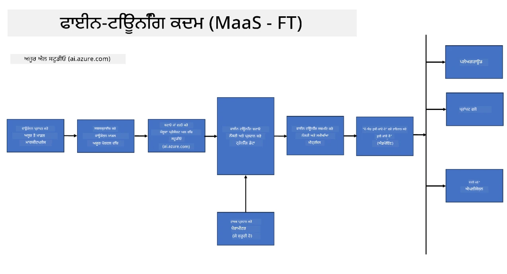
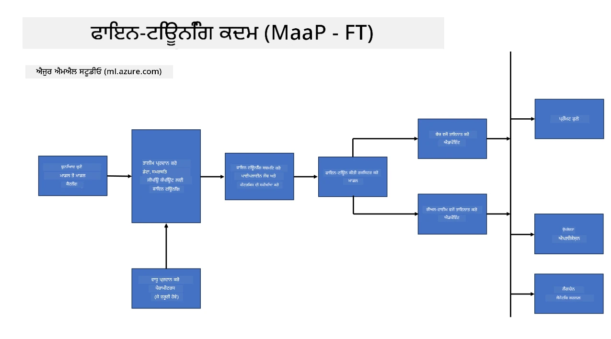
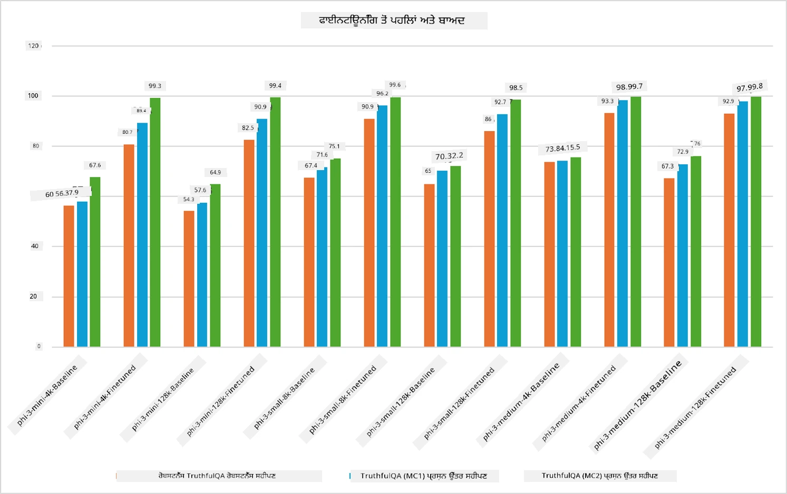

## ਫਾਈਨ ਟਿਊਨਿੰਗ ਸਿਨਾਰਿਓਜ਼

**ਪਲੇਟਫਾਰਮ** ਇਸ ਵਿੱਚ ਵੱਖ-ਵੱਖ ਤਕਨਾਲੋਜੀਆਂ ਸ਼ਾਮਲ ਹਨ ਜਿਵੇਂ ਕਿ Azure AI Foundry, Azure Machine Learning, AI Tools, Kaito, ਅਤੇ ONNX Runtime।

**ਇੰਫਰਾਸਟਰੱਕਚਰ** ਇਸ ਵਿੱਚ CPU ਅਤੇ FPGA ਸ਼ਾਮਲ ਹਨ, ਜੋ ਫਾਈਨ-ਟਿਊਨਿੰਗ ਪ੍ਰਕਿਰਿਆ ਲਈ ਜਰੂਰੀ ਹਨ। ਮੈਂ ਤੁਹਾਨੂੰ ਹਰ ਇੱਕ ਤਕਨਾਲੋਜੀ ਦੇ ਆਈਕਾਨ ਦਿਖਾਉਂਦਾ ਹਾਂ।

**ਟੂਲਜ਼ ਅਤੇ ਫਰੇਮਵਰਕ** ਇਸ ਵਿੱਚ ONNX Runtime ਸ਼ਾਮਲ ਹੈ। ਮੈਂ ਤੁਹਾਨੂੰ ਹਰ ਇੱਕ ਤਕਨਾਲੋਜੀ ਦੇ ਆਈਕਾਨ ਦਿਖਾਉਂਦਾ ਹਾਂ।

ਮਾਈਕ੍ਰੋਸਾਫਟ ਤਕਨਾਲੋਜੀਆਂ ਨਾਲ ਫਾਈਨ-ਟਿਊਨਿੰਗ ਪ੍ਰਕਿਰਿਆ ਵਿੱਚ ਵੱਖ-ਵੱਖ ਕੰਪੋਨੈਂਟ ਅਤੇ ਟੂਲਜ਼ ਸ਼ਾਮਲ ਹੁੰਦੇ ਹਨ। ਇਹ ਤਕਨਾਲੋਜੀਆਂ ਸਮਝ ਕੇ ਅਤੇ ਵਰਤ ਕੇ, ਅਸੀਂ ਆਪਣੇ ਐਪਲੀਕੇਸ਼ਨਾਂ ਨੂੰ ਪ੍ਰਭਾਵਸ਼ਾਲੀ ਢੰਗ ਨਾਲ ਫਾਈਨ-ਟਿਊਨ ਕਰ ਸਕਦੇ ਹਾਂ ਅਤੇ ਵਧੀਆ ਹੱਲ ਤਿਆਰ ਕਰ ਸਕਦੇ ਹਾਂ।

## ਮਾਡਲ ਐਜ਼ ਸਰਵਿਸ

ਹੋਸਟ ਕੀਤੀ ਫਾਈਨ-ਟਿਊਨਿੰਗ ਦੀ ਵਰਤੋਂ ਕਰਕੇ ਮਾਡਲ ਨੂੰ ਫਾਈਨ-ਟਿਊਨ ਕਰੋ, ਬਿਨਾਂ ਕਮਪਿਊਟ ਬਣਾਉਣ ਅਤੇ ਪ੍ਰਬੰਧਨ ਕਰਨ ਦੀ ਲੋੜ ਦੇ।

ਸਰਵਰਲੈੱਸ ਫਾਈਨ-ਟਿਊਨਿੰਗ Phi-3-mini ਅਤੇ Phi-3-medium ਮਾਡਲਾਂ ਲਈ ਉਪਲਬਧ ਹੈ, ਜੋ ਡਿਵੈਲਪਰਾਂ ਨੂੰ ਮਾਡਲਾਂ ਨੂੰ ਕਲਾਉਡ ਅਤੇ ਐਜ ਸਿਨਾਰਿਓਜ਼ ਲਈ ਤੇਜ਼ੀ ਨਾਲ ਅਤੇ ਆਸਾਨੀ ਨਾਲ ਕਸਟਮਾਈਜ਼ ਕਰਨ ਦੀ ਆਗਿਆ ਦਿੰਦਾ ਹੈ ਬਿਨਾਂ ਕਮਪਿਊਟ ਦੀ ਵਿਵਸਥਾ ਕੀਤੇ। ਅਸੀਂ ਇਹ ਵੀ ਐਲਾਨ ਕੀਤਾ ਹੈ ਕਿ Phi-3-small ਹੁਣ ਸਾਡੇ Models-as-a-Service ਆਫਰਿੰਗ ਰਾਹੀਂ ਉਪਲਬਧ ਹੈ, ਤਾਂ ਜੋ ਡਿਵੈਲਪਰ ਬਿਨਾਂ ਅਧਾਰਭੂਤ ਇੰਫਰਾਸਟਰੱਕਚਰ ਨੂੰ ਸੰਭਾਲੇ ਤੇਜ਼ੀ ਨਾਲ AI ਵਿਕਾਸ ਸ਼ੁਰੂ ਕਰ ਸਕਣ।

## ਮਾਡਲ ਐਜ਼ ਏ ਪਲੇਟਫਾਰਮ

ਉਪਭੋਗਤਾ ਆਪਣੇ ਕਮਪਿਊਟ ਨੂੰ ਪ੍ਰਬੰਧਿਤ ਕਰਦੇ ਹਨ ਤਾਂ ਜੋ ਆਪਣੇ ਮਾਡਲਾਂ ਨੂੰ ਫਾਈਨ-ਟਿਊਨ ਕਰ ਸਕਣ।

[Fine Tuning Sample](https://github.com/Azure/azureml-examples/blob/main/sdk/python/foundation-models/system/finetune/chat-completion/chat-completion.ipynb)

## ਫਾਈਨ ਟਿਊਨਿੰਗ ਸਿਨਾਰਿਓਜ਼

| | | | | | | |
|-|-|-|-|-|-|-|
|ਸਿਨਾਰਿਓ|LoRA|QLoRA|PEFT|DeepSpeed|ZeRO|DORA|
|ਪਹਿਲਾਂ ਤੋਂ ਸਿਖਾਏ ਗਏ LLMs ਨੂੰ ਖਾਸ ਕੰਮਾਂ ਜਾਂ ਖੇਤਰਾਂ ਲਈ ਅਨੁਕੂਲਿਤ ਕਰਨਾ|ਹਾਂ|ਹਾਂ|ਹਾਂ|ਹਾਂ|ਹਾਂ|ਹਾਂ|
|ਟੈਕਸਟ ਕਲਾਸੀਫਿਕੇਸ਼ਨ, ਨਾਮਿਤ ਇਕਾਈ ਪਛਾਣ, ਅਤੇ ਮਸ਼ੀਨ ਅਨੁਵਾਦ ਵਰਗੇ NLP ਕੰਮਾਂ ਲਈ ਫਾਈਨ-ਟਿਊਨਿੰਗ|ਹਾਂ|ਹਾਂ|ਹਾਂ|ਹਾਂ|ਹਾਂ|ਹਾਂ|
|QA ਕੰਮਾਂ ਲਈ ਫਾਈਨ-ਟਿਊਨਿੰਗ|ਹਾਂ|ਹਾਂ|ਹਾਂ|ਹਾਂ|ਹਾਂ|ਹਾਂ|
|ਚੈਟਬੋਟ ਵਿੱਚ ਮਨੁੱਖੀ ਵਰਗੇ ਜਵਾਬ ਬਣਾਉਣ ਲਈ ਫਾਈਨ-ਟਿਊਨਿੰਗ|ਹਾਂ|ਹਾਂ|ਹਾਂ|ਹਾਂ|ਹਾਂ|ਹਾਂ|
|ਸੰਗੀਤ, ਕਲਾ ਜਾਂ ਹੋਰ ਰਚਨਾਤਮਕ ਰੂਪਾਂ ਲਈ ਫਾਈਨ-ਟਿਊਨਿੰਗ|ਹਾਂ|ਹਾਂ|ਹਾਂ|ਹਾਂ|ਹਾਂ|ਹਾਂ|
|ਕੰਪਿਊਟਿੰਗ ਅਤੇ ਵਿੱਤੀ ਖਰਚੇ ਘਟਾਉਣਾ|ਹਾਂ|ਹਾਂ|ਨਹੀਂ|ਹਾਂ|ਹਾਂ|ਨਹੀਂ|
|ਮੇਮੋਰੀ ਦੀ ਵਰਤੋਂ ਘਟਾਉਣਾ|ਨਹੀਂ|ਹਾਂ|ਨਹੀਂ|ਹਾਂ|ਹਾਂ|ਹਾਂ|
|ਕੁਸ਼ਲ ਫਾਈਨ-ਟਿਊਨਿੰਗ ਲਈ ਘੱਟ ਪੈਰਾਮੀਟਰਾਂ ਦੀ ਵਰਤੋਂ|ਨਹੀਂ|ਹਾਂ|ਹਾਂ|ਨਹੀਂ|ਨਹੀਂ|ਹਾਂ|
|ਡਾਟਾ ਪੈਰਲੇਲਿਜ਼ਮ ਦਾ ਮੇਮੋਰੀ-ਕੁਸ਼ਲ ਰੂਪ ਜੋ ਸਾਰੇ GPU ਡਿਵਾਈਸਾਂ ਦੀ ਕੁੱਲ GPU ਮੇਮੋਰੀ ਤੱਕ ਪਹੁੰਚ ਦਿੰਦਾ ਹੈ|ਨਹੀਂ|ਨਹੀਂ|ਨਹੀਂ|ਹਾਂ|ਹਾਂ|ਹਾਂ|

## ਫਾਈਨ ਟਿਊਨਿੰਗ ਪ੍ਰਦਰਸ਼ਨ ਉਦਾਹਰਣਾਂ

**ਅਸਵੀਕਾਰੋਪਣ**:  
ਇਹ ਦਸਤਾਵੇਜ਼ AI ਅਨੁਵਾਦ ਸੇਵਾ [Co-op Translator](https://github.com/Azure/co-op-translator) ਦੀ ਵਰਤੋਂ ਕਰਕੇ ਅਨੁਵਾਦਿਤ ਕੀਤਾ ਗਿਆ ਹੈ। ਜਦੋਂ ਕਿ ਅਸੀਂ ਸਹੀਅਤ ਲਈ ਕੋਸ਼ਿਸ਼ ਕਰਦੇ ਹਾਂ, ਕਿਰਪਾ ਕਰਕੇ ਧਿਆਨ ਰੱਖੋ ਕਿ ਸਵੈਚਾਲਿਤ ਅਨੁਵਾਦਾਂ ਵਿੱਚ ਗਲਤੀਆਂ ਜਾਂ ਅਸਮਰਥਤਾਵਾਂ ਹੋ ਸਕਦੀਆਂ ਹਨ। ਮੂਲ ਦਸਤਾਵੇਜ਼ ਆਪਣੀ ਮੂਲ ਭਾਸ਼ਾ ਵਿੱਚ ਪ੍ਰਮਾਣਿਕ ਸਰੋਤ ਮੰਨਿਆ ਜਾਣਾ ਚਾਹੀਦਾ ਹੈ। ਮਹੱਤਵਪੂਰਨ ਜਾਣਕਾਰੀ ਲਈ, ਪੇਸ਼ੇਵਰ ਮਨੁੱਖੀ ਅਨੁਵਾਦ ਦੀ ਸਿਫਾਰਸ਼ ਕੀਤੀ ਜਾਂਦੀ ਹੈ। ਇਸ ਅਨੁਵਾਦ ਦੀ ਵਰਤੋਂ ਤੋਂ ਉਤਪੰਨ ਕਿਸੇ ਵੀ ਗਲਤਫਹਿਮੀ ਜਾਂ ਗਲਤ ਵਿਆਖਿਆ ਲਈ ਅਸੀਂ ਜ਼ਿੰਮੇਵਾਰ ਨਹੀਂ ਹਾਂ।