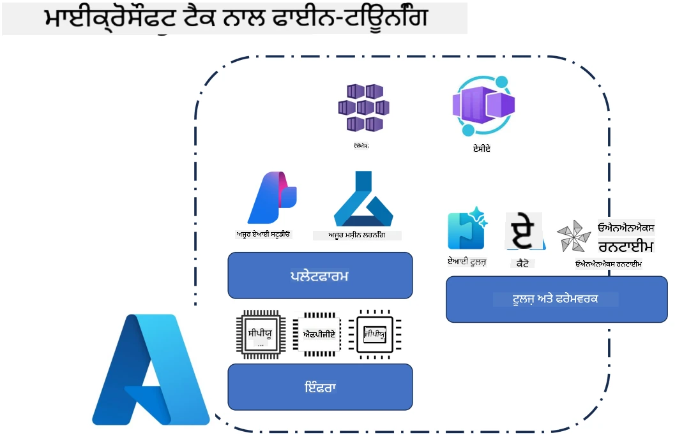
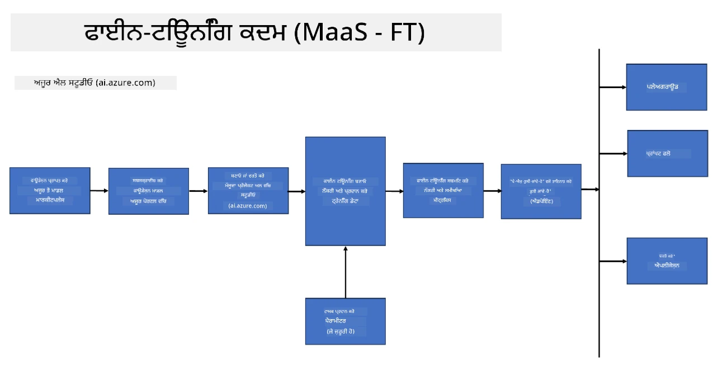
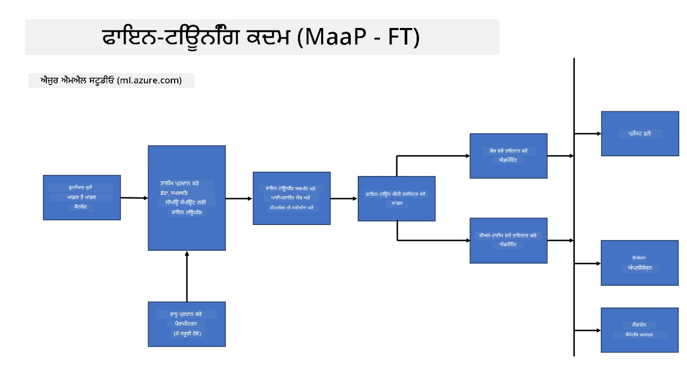
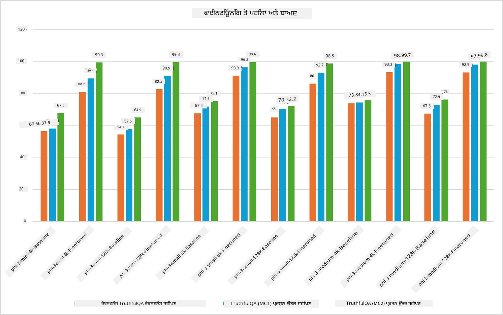

## ਫਾਈਨ ਟਿਊਨਿੰਗ ਸਥਿਤੀਆਂ

ਇਹ ਸੈਕਸ਼ਨ ਮਾਇਕ੍ਰੋਸੋਫਟ ਫਾਊਂਡਰੀ ਅਤੇ ਐਜ਼ਯੂਰ ਵਾਤਾਵਰਨਾਂ ਵਿੱਚ ਫਾਈਨ-ਟਿਊਨਿੰਗ ਸਥਿਤੀਆਂ ਦਾ ਇਕ ਝਲਕ ਪ੍ਰਦਾਨ ਕਰਦਾ ਹੈ, ਜਿਸ ਵਿੱਚ ਡਿਪਲੋਇਮੈਂਟ ਮਾਡਲ, ਢਾਂਚਾਗਤ ਪਰਤਾਂ, ਅਤੇ ਆਮ ਤੌਰ 'ਤੇ ਵਰਤੇ ਜਾਣ ਵਾਲੇ ਅਪਟੀਮਾਈਜ਼ੇਸ਼ਨ ਤਕਨੀਕਾਂ ਸ਼ਾਮਲ ਹਨ।

**ਪਲੇਟਫਾਰਮ**  
ਇਸ ਵਿੱਚ ਮੈਨੇਜ ਕੀਤੀਆਂ ਸੇਵਾਵਾਂ ਸ਼ਾਮਲ ਹਨ ਜਿਵੇਂ ਕਿ ਮਾਇਕ੍ਰੋਸੋਫਟ ਫਾਊਂਡਰੀ (ਪਹਿਲਾਂ ਐਜ਼ਯੂਰ ਏਆਈ ਫਾਊਂਡਰੀ) ਅਤੇ ਐਜ਼ਯੂਰ ਮਸ਼ੀਨ ਲਰਨਿੰਗ, ਜੋ ਮਾਡਲ ਪ੍ਰਬੰਧਨ, ਅਨੁਸ਼ਾਸਨ, ਪ੍ਰਯੋਗ ਟ੍ਰੈਕਿੰਗ, ਅਤੇ ਡਿਪਲੋਇਮੈਂਟ ਵਰਕਫਲੋਜ਼ ਪ੍ਰਦਾਨ ਕਰਦੇ ਹਨ।

**ਇੰਫ੍ਰਾਸਟਰੱਕਚਰ**  
ਫਾਈਨ-ਟਿਊਨਿੰਗ ਲਈ ਸਕੇਲਬਲ ਕੰਪਿਊਟ ਸਾਧਨਾਂ ਦੀ ਲੋੜ ਹੁੰਦੀ ਹੈ। ਐਜ਼ਯੂਰ ਵਾਤਾਵਰਨ ਵਿੱਚ, ਆਮ ਤੌਰ 'ਤੇ ਇਹ GPU-ਆਧਾਰਿਤ ਵਰਚੂਅਲ ਮਸ਼ੀਨਾਂ ਅਤੇ CPU संसाधਨਾਂ ਨੂੰ ਹਲਕੇ ਵਰਕਲੋਡ ਲਈ ਸ਼ਾਮਲ ਕਰਦਾ ਹੈ, ਨਾਲ ਹੀ ਡੇਟਾਸੈੱਟਸ ਅਤੇ ਚੈਕਪੌਇੰਟਸ ਲਈ ਸਕੇਲਬਲ ਸਟੋਰੇਜ।

**ਟੂਲਜ਼ ਅਤੇ ਫਰੇਮਵਰਕ**  
ਫਾਈਨ-ਟਿਊਨਿੰਗ ਵਰਕਫਲੋਜ਼ ਆਮ ਤੌਰ 'ਤੇ ਫਰੇਮਵਰਕਾਂ ਅਤੇ ਅਪਟੀਮਾਈਜ਼ੇਸ਼ਨ ਲਾਇਬ੍ਰੇਰੀਆਂ ਜਿਵੇਂ ਕਿ Hugging Face Transformers, DeepSpeed, ਅਤੇ PEFT (ਪੈਰਾਮੀਟਰ-ਕਾਰਗਰ ਫਾਈਨ-ਟਿਊਨਿੰਗ) 'ਤੇ ਨਿਰਭਰ ਕਰਦੇ ਹਨ।

ਮਾਇਕ੍ਰੋਸੋਫਟ ਤਕਨੀਕਾਂ ਨਾਲ ਫਾਈਨ-ਟਿਊਨਿੰਗ ਪ੍ਰਕਿਰਿਆ ਪਲੇਟਫਾਰਮ ਸੇਵਾਵਾਂ, ਕੰਪਿਊਟ ਢਾਂਚੇ ਅਤੇ ਟਰੇਨਿੰਗ ਫਰੇਮਵਰਕਾਂ ਨੂੰ ਛੁਹਦੀ ਹੈ। ਇਹ ਸਮਝ ਕੇ ਕਿ ਇਹ ਭਾਗ ਇਕੱਠੇ ਕਿਵੇਂ ਕੰਮ ਕਰਦੇ ਹਨ, ਵਿਕਾਸਕਾਰ ਅਧਾਰਭੂਤ ਮਾਡਲਾਂ ਨੂੰ ਵਿਸ਼ੇਸ਼ ਕਾਰਜਾਂ ਅਤੇ ਉਤਪਾਦਨ ਸਥਿਤੀਆਂ ਲਈ ਪ੍ਰਭਾਵਸ਼ালী ਢੰਗ ਨਾਲ ਅਨੁਕੂਲਿਤ ਕਰ ਸਕਦੇ ਹਨ।

## ਮਾਡਲ ਨੂੰ ਸੇਵਾ ਵਜੋਂ

ਹੋਸਟ ਕੀਤੀ ਫਾਈਨ-ਟਿਊਨਿੰਗ ਦੀ ਵਰਤੋਂ ਕਰਕੇ ਮਾਡਲ ਨੂੰ ਫਾਈਨ-ਟਿਊਨ ਕਰੋ, ਬਿਨਾਂ ਕੰਪਿਊਟ ਬਣਾਉਣ ਅਤੇ ਪ੍ਰਬੰਧਨ ਕਰਨ ਦੀ ਲੋੜ ਦੇ।

ਸਰਵਰਲੇਸ ਫਾਈਨ-ਟਿਊਨਿੰਗ ਹੁਣ Phi-3, Phi-3.5, ਅਤੇ Phi-4 ਮਾਡਲ ਪਰਿਵਾਰਾਂ ਲਈ ਉਪਲਬਧ ਹੈ, ਜੋ ਵਿਕਾਸਕਾਰਾਂ ਨੂੰ ਮਾਡਲਾਂ ਨੂੰ ਕਲਾਉਡ ਅਤੇ ਐਜ ਸਥਿਤੀਆਂ ਲਈ ਤੇਜ਼ ਅਤੇ ਆਸਾਨੀ ਨਾਲ ਕਸਟਮਾਈਜ਼ ਕਰਨ ਦੀ ਆਗਿਆ ਦਿੰਦੀ ਹੈ ਬਿਨਾਂ ਕੰਪਿਊਟ ਦਾ ਪ੍ਰਬੰਧ ਕਰਵਾਉਣ ਦੀ ਲੋੜ।

## ਮਾਡਲ ਨੂੰ ਪਲੇਟਫਾਰਮ ਵਜੋਂ

ਯੂਜ਼ਰ ਆਪਣਾ ਕੰਪਿਊਟ ਪ੍ਰਬੰਧ ਕਰਦੇ ਹਨ ਤਾਂ ਜੋ ਉਹ ਆਪਣੇ ਮਾਡਲਾਂ ਨੂੰ ਫਾਈਨ-ਟਿਊਨ ਕਰ ਸਕਣ।

[Fine Tuning Sample](https://github.com/Azure/azureml-examples/blob/main/sdk/python/foundation-models/system/finetune/chat-completion/chat-completion.ipynb)

## ਫਾਈਨ-ਟਿਊਨਿੰਗ ਤਕਨੀਕਾਂ ਦਾ ਤੁਲਨਾਤਮਕ ਅਧਿਐਨ

|Scenario|LoRA|QLoRA|PEFT|DeepSpeed|ZeRO|DoRA|
|---|---|---|---|---|---|---|
|ਪੂਰਵ-ਟ੍ਰੇਨ ਕੀਤੇ LLMs ਨੂੰ ਵਿਸ਼ੇਸ਼ ਕਾਰਜਾਂ ਜਾਂ ਖੇਤਰਾਂ ਲਈ ਅਨੁਕੂਲਿਤ ਕਰਨਾ|ਹਾਂ|ਹਾਂ|ਹਾਂ|ਹਾਂ|ਹਾਂ|ਹਾਂ|
|ਨੈਚਰਲ ਲੈਂਗਵੇਜ ਪ੍ਰੋਸੈਸਿੰਗ ਕਾਰਜਾਂ ਲਈ ਜਿਵੇਂ ਕਿ ਟੈਕਸਟ ਵਰਗੀਕਰਨ, ਨਾਂਵੇਂ ਸਮਾਜਿਕ ਇਕਾਈ ਦੀ ਪਛਾਣ, ਅਤੇ ਮਸ਼ੀਨ ਅਨੁਵਾਦ|ਹਾਂ|ਹਾਂ|ਹਾਂ|ਹਾਂ|ਹਾਂ|ਹਾਂ|
|ਪ੍ਰਸ਼ਨ-ਉੱਤਰ ਕਾਰਜਾਂ ਲਈ ਫਾਈਨ-ਟਿਊਨਿੰਗ|ਹਾਂ|ਹਾਂ|ਹਾਂ|ਹਾਂ|ਹਾਂ|ਹਾਂ|
|ਚੈਟਬੋਟਾਂ ਵਿੱਚ ਮਨੁੱਖ ਵਰਗੀਆਂ ਪ੍ਰਤਿਕਿਰਿਆਵਾਂ ਤਿਆਰ ਕਰਨ ਲਈ ਫਾਈਨ-ਟਿਊਨਿੰਗ|ਹਾਂ|ਹਾਂ|ਹਾਂ|ਹਾਂ|ਹਾਂ|ਹਾਂ|
|ਸੰਗੀਤ, ਕਲਾ ਜਾਂ ਹੋਰ ਕਿਸਮਾਂ ਦੀ ਰਚਨਾਤਮਕਤਾ ਲਈ ਫਾਈਨ-ਟਿਊਨਿੰਗ|ਹਾਂ|ਹਾਂ|ਹਾਂ|ਹਾਂ|ਹਾਂ|ਹਾਂ|
|ਗਣਨਾਤਮਕ ਅਤੇ ਵਿੱਤੀ ਖਰਚੇ ਘਟਾਉਣਾ|ਹਾਂ|ਹਾਂ|ਹਾਂ|ਹਾਂ|ਹਾਂ|ਹਾਂ|
|ਮੈਮੋਰੀ ਦੀ ਵਰਤੋਂ ਘਟਾਉਣਾ|ਹਾਂ|ਹਾਂ|ਹਾਂ|ਹਾਂ|ਹਾਂ|ਹਾਂ|
|ਕੰਪਿਊਟਰੇ ਬਚਤ ਲਈ ਘੱਟ ਪੈਰਾਮੀਟਰਾਂ ਦੀ ਵਰਤੋਂ|ਹਾਂ|ਹਾਂ|ਹਾਂ|ਨਹੀਂ|ਨਹੀਂ|ਹਾਂ|
|ਮੈਮੋਰੀ-ਕਾਰੀਗਰੀ ਵਾਲਾ ਡੇਟਾ ਪੈਰਾਲੇਲਿਜ਼ਮ ਜੋ ਉਪਲਬਧ ਸਾਰੇ GPU ਜੰਤਰਾਂ ਦੀ ਕੁੱਲ GPU ਮੈਮੋਰੀ ਤੱਕ ਪਹੁੰਚ ਦਿੰਦਾ ਹੈ|ਨਹੀਂ|ਨਹੀਂ|ਨਹੀਂ|ਹਾਂ|ਹਾਂ|ਨਹੀਂ|

> [!NOTE]
> LoRA, QLoRA, PEFT, ਅਤੇ DoRA ਪੈਰਾਮੀਟਰ-ਕਾਰਗਰ ਫਾਈਨ-ਟਿਊਨਿੰਗ ਤਰੀਕੇ ਹਨ, ਜਦਕਿ DeepSpeed ਅਤੇ ZeRO ਵੰਡੇ ਹੋਏ ਟਰੇਨਿੰਗ ਅਤੇ ਮੈਮੋਰੀ ਅਪਟੀਮਾਈਜ਼ੇਸ਼ਨ 'ਤੇ ਧਿਆਨ ਦੇਂਦੇ ਹਨ।

## ਫਾਈਨ ਟਿਊਨਿੰਗ ਪ੍ਰਦਰਸ਼ਨ ਉਦਾਹਰਨਾਂ

---

<!-- CO-OP TRANSLATOR DISCLAIMER START -->
**ਅਸਵੀਕਾਰੋਪਤਰ**:  
ਇਹ ਦਸਤਾਵੇਜ਼ ਏਆਈ ਅਨੁਵਾਦ ਸੇਵਾ [Co-op Translator](https://github.com/Azure/co-op-translator) ਦੀ ਵਰਤੋਂ ਕਰਕੇ ਅਨੁਵਾਦ ਕੀਤਾ ਗਿਆ ਹੈ। ਜਦੋਂ ਕਿ ਅਸੀਂ ਸਹੀਅਤ ਦੀ ਕੋਸ਼ਿਸ਼ ਕਰਦੇ ਹਾਂ, ਕਿਰਪਾ ਕਰਕੇ ਧਿਆਨ ਦਿਓ ਕਿ ਸੁਆਚਾਲਿਤ ਅਨੁਵਾਦਾਂ ਵਿੱਚ ਗਲਤੀਆਂ ਜਾਂ ਅਸਪਸ਼ਟਤਾਵਾਂ ਹੋ ਸਕਦੀਆਂ ਹਨ। ਮੂਲ ਦਸਤਾਵੇਜ਼ ਆਪਣੀ ਮੂਲ ਭਾਸ਼ਾ ਵਿੱਚ ਪ੍ਰਮਾਣਿਕ ਸਰੋਤ ਮੰਨਿਆ ਜਾਣਾ ਚਾਹੀਦਾ ਹੈ। ਮਹੱਤਵਪੂਰਨ ਜਾਣਕਾਰੀ ਲਈ, ਪੇਸ਼ੇਵਰ ਮਨੁੱਖੀ ਅਨੁਵਾਦ ਦੀ ਸਿਫਾਰਿਸ਼ ਕੀਤੀ ਜਾਂਦੀ ਹੈ। ਅਸੀਂ ਇਸ ਅਨੁਵਾਦ ਦੇ ਉਪਯੋਗ ਤੋਂ ਹੋਣ ਵਾਲੀਆਂ ਕਿਸੇ ਵੀ ਗਲਤਫਹਿਮੀਆਂ ਜਾਂ ਗਲਤ ਸਮਝਾਂ ਲਈ ਜ਼ਿੰਮੇਵਾਰ ਨਹੀਂ ਹੋਵਾਂਗੇ।
<!-- CO-OP TRANSLATOR DISCLAIMER END -->