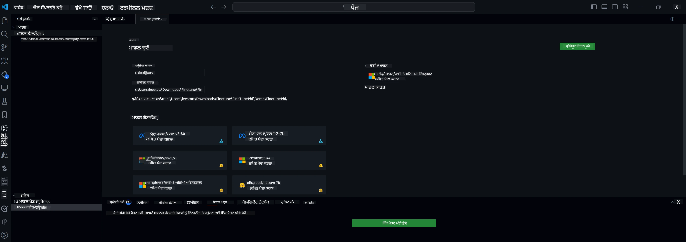

<!--
CO_OP_TRANSLATOR_METADATA:
{
  "original_hash": "c2bc0950f44919ac75a88c1a871680c2",
  "translation_date": "2025-07-17T09:08:51+00:00",
  "source_file": "md/03.FineTuning/Finetuning_VSCodeaitoolkit.md",
  "language_code": "pa"
}
-->
## VS Code ਲਈ AI Toolkit ਵਿੱਚ ਤੁਹਾਡਾ ਸਵਾਗਤ ਹੈ

[AI Toolkit for VS Code](https://github.com/microsoft/vscode-ai-toolkit/tree/main) Azure AI Studio Catalog ਅਤੇ ਹੋਰ ਕੈਟਾਲੌਗਾਂ ਜਿਵੇਂ Hugging Face ਤੋਂ ਵੱਖ-ਵੱਖ ਮਾਡਲ ਇਕੱਠੇ ਕਰਦਾ ਹੈ। ਇਹ ਟੂਲਕਿਟ ਜਨਰੇਟਿਵ AI ਟੂਲਜ਼ ਅਤੇ ਮਾਡਲਾਂ ਨਾਲ AI ਐਪ ਬਣਾਉਣ ਲਈ ਆਮ ਵਿਕਾਸ ਕਾਰਜਾਂ ਨੂੰ ਸੁਗਮ ਬਣਾਉਂਦਾ ਹੈ:
- ਮਾਡਲ ਖੋਜ ਅਤੇ ਪਲੇਗ੍ਰਾਊਂਡ ਨਾਲ ਸ਼ੁਰੂਆਤ ਕਰੋ।
- ਸਥਾਨਕ ਕੰਪਿਊਟਿੰਗ ਸਰੋਤਾਂ ਦੀ ਵਰਤੋਂ ਕਰਕੇ ਮਾਡਲ ਫਾਈਨ-ਟਿਊਨਿੰਗ ਅਤੇ ਇਨਫਰੈਂਸ।
- Azure ਸਰੋਤਾਂ ਦੀ ਵਰਤੋਂ ਕਰਕੇ ਰਿਮੋਟ ਫਾਈਨ-ਟਿਊਨਿੰਗ ਅਤੇ ਇਨਫਰੈਂਸ।

[VSCode ਲਈ AI Toolkit ਇੰਸਟਾਲ ਕਰੋ](https://marketplace.visualstudio.com/items?itemName=ms-windows-ai-studio.windows-ai-studio)



**[Private Preview]** Azure Container Apps ਲਈ ਇੱਕ-ਕਲਿੱਕ ਪ੍ਰੋਵਿਜ਼ਨਿੰਗ, ਜੋ ਮਾਡਲ ਫਾਈਨ-ਟਿਊਨਿੰਗ ਅਤੇ ਇਨਫਰੈਂਸ ਨੂੰ ਕਲਾਉਡ ਵਿੱਚ ਚਲਾਉਂਦਾ ਹੈ।

ਹੁਣ ਆਓ ਤੁਹਾਡੇ AI ਐਪ ਵਿਕਾਸ ਵਿੱਚ ਕਦਮ ਰੱਖੀਏ:

- [VS Code ਲਈ AI Toolkit ਵਿੱਚ ਤੁਹਾਡਾ ਸਵਾਗਤ ਹੈ](../../../../md/03.FineTuning)
- [ਸਥਾਨਕ ਵਿਕਾਸ](../../../../md/03.FineTuning)
  - [ਤਿਆਰੀਆਂ](../../../../md/03.FineTuning)
  - [Conda ਐਕਟੀਵੇਟ ਕਰੋ](../../../../md/03.FineTuning)
  - [ਸਿਰਫ ਬੇਸ ਮਾਡਲ ਫਾਈਨ-ਟਿਊਨਿੰਗ](../../../../md/03.FineTuning)
  - [ਮਾਡਲ ਫਾਈਨ-ਟਿਊਨਿੰਗ ਅਤੇ ਇਨਫਰੈਂਸ](../../../../md/03.FineTuning)
  - [ਮਾਡਲ ਫਾਈਨ-ਟਿਊਨਿੰਗ](../../../../md/03.FineTuning)
  - [Microsoft Olive](../../../../md/03.FineTuning)
  - [ਫਾਈਨ-ਟਿਊਨਿੰਗ ਨਮੂਨੇ ਅਤੇ ਸਰੋਤ](../../../../md/03.FineTuning)
- [**\[Private Preview\]** ਰਿਮੋਟ ਵਿਕਾਸ](../../../../md/03.FineTuning)
  - [ਪੂਰਵ-ਸ਼ਰਤਾਂ](../../../../md/03.FineTuning)
  - [ਰਿਮੋਟ ਵਿਕਾਸ ਪ੍ਰੋਜੈਕਟ ਸੈਟਅੱਪ](../../../../md/03.FineTuning)
  - [Azure ਸਰੋਤ ਪ੍ਰੋਵਿਜ਼ਨ ਕਰੋ](../../../../md/03.FineTuning)
  - [\[ਵਿਕਲਪਿਕ\] Azure Container App Secret ਵਿੱਚ Huggingface ਟੋਕਨ ਸ਼ਾਮਲ ਕਰੋ](../../../../md/03.FineTuning)
  - [ਫਾਈਨ-ਟਿਊਨਿੰਗ ਚਲਾਓ](../../../../md/03.FineTuning)
  - [ਇਨਫਰੈਂਸ ਐਂਡਪੌਇੰਟ ਪ੍ਰੋਵਿਜ਼ਨ ਕਰੋ](../../../../md/03.FineTuning)
  - [ਇਨਫਰੈਂਸ ਐਂਡਪੌਇੰਟ ਡਿਪਲੋਇ ਕਰੋ](../../../../md/03.FineTuning)
  - [ਉੱਨਤ ਵਰਤੋਂ](../../../../md/03.FineTuning)

## ਸਥਾਨਕ ਵਿਕਾਸ
### ਤਿਆਰੀਆਂ

1. ਯਕੀਨੀ ਬਣਾਓ ਕਿ NVIDIA ਡਰਾਈਵਰ ਹੋਸਟ ਵਿੱਚ ਇੰਸਟਾਲ ਹੈ।  
2. ਜੇ ਤੁਸੀਂ HF ਡੇਟਾਸੈੱਟ ਵਰਤ ਰਹੇ ਹੋ ਤਾਂ `huggingface-cli login` ਚਲਾਓ।  
3. `Olive` ਕੁੰਜੀ ਸੈਟਿੰਗਾਂ ਦੀ ਵਿਆਖਿਆ, ਜੋ ਮੈਮੋਰੀ ਦੀ ਵਰਤੋਂ ਨੂੰ ਬਦਲ ਸਕਦੀਆਂ ਹਨ।  

### Conda ਐਕਟੀਵੇਟ ਕਰੋ
ਕਿਉਂਕਿ ਅਸੀਂ WSL ਵਾਤਾਵਰਣ ਵਰਤ ਰਹੇ ਹਾਂ ਅਤੇ ਇਹ ਸਾਂਝਾ ਹੈ, ਤੁਹਾਨੂੰ ਮੈਨੁਅਲ ਤੌਰ 'ਤੇ conda ਵਾਤਾਵਰਣ ਐਕਟੀਵੇਟ ਕਰਨਾ ਪਵੇਗਾ। ਇਸ ਕਦਮ ਤੋਂ ਬਾਅਦ ਤੁਸੀਂ ਫਾਈਨ-ਟਿਊਨਿੰਗ ਜਾਂ ਇਨਫਰੈਂਸ ਚਲਾ ਸਕਦੇ ਹੋ।

```bash
conda activate [conda-env-name] 
```

### ਸਿਰਫ ਬੇਸ ਮਾਡਲ ਫਾਈਨ-ਟਿਊਨਿੰਗ
ਸਿਰਫ ਬੇਸ ਮਾਡਲ ਨੂੰ ਬਿਨਾਂ ਫਾਈਨ-ਟਿਊਨਿੰਗ ਦੇ ਟ੍ਰਾਈ ਕਰਨ ਲਈ, conda ਐਕਟੀਵੇਟ ਕਰਨ ਤੋਂ ਬਾਅਦ ਇਹ ਕਮਾਂਡ ਚਲਾਓ।

```bash
cd inference

# Web browser interface allows to adjust a few parameters like max new token length, temperature and so on.
# User has to manually open the link (e.g. http://0.0.0.0:7860) in a browser after gradio initiates the connections.
python gradio_chat.py --baseonly
```

### ਮਾਡਲ ਫਾਈਨ-ਟਿਊਨਿੰਗ ਅਤੇ ਇਨਫਰੈਂਸ

ਜਦੋਂ ਡੈਵ ਕੰਟੇਨਰ ਵਿੱਚ ਵਰਕਸਪੇਸ ਖੁਲ ਜਾਵੇ, ਇੱਕ ਟਰਮੀਨਲ ਖੋਲ੍ਹੋ (ਡਿਫਾਲਟ ਪਾਥ ਪ੍ਰੋਜੈਕਟ ਰੂਟ ਹੈ), ਫਿਰ ਹੇਠਾਂ ਦਿੱਤੀ ਕਮਾਂਡ ਚਲਾਕੇ ਚੁਣੇ ਹੋਏ ਡੇਟਾਸੈੱਟ 'ਤੇ LLM ਨੂੰ ਫਾਈਨ-ਟਿਊਨ ਕਰੋ।

```bash
python finetuning/invoke_olive.py 
```

ਚੈਕਪੌਇੰਟ ਅਤੇ ਅੰਤਿਮ ਮਾਡਲ `models` ਫੋਲਡਰ ਵਿੱਚ ਸੇਵ ਹੋਣਗੇ।

ਫਿਰ ਫਾਈਨ-ਟਿਊਨ ਕੀਤੇ ਮਾਡਲ ਨਾਲ ਚੈਟਾਂ ਰਾਹੀਂ `console`, `web browser` ਜਾਂ `prompt flow` ਵਿੱਚ ਇਨਫਰੈਂਸ ਚਲਾਓ।

```bash
cd inference

# Console interface.
python console_chat.py

# Web browser interface allows to adjust a few parameters like max new token length, temperature and so on.
# User has to manually open the link (e.g. http://127.0.0.1:7860) in a browser after gradio initiates the connections.
python gradio_chat.py
```

VS Code ਵਿੱਚ `prompt flow` ਵਰਤਣ ਲਈ, ਕਿਰਪਾ ਕਰਕੇ ਇਸ [Quick Start](https://microsoft.github.io/promptflow/how-to-guides/quick-start.html) ਨੂੰ ਵੇਖੋ।

### ਮਾਡਲ ਫਾਈਨ-ਟਿਊਨਿੰਗ

ਆਪਣੇ ਡਿਵਾਈਸ 'ਤੇ GPU ਦੀ ਉਪਲਬਧਤਾ ਦੇ ਅਨੁਸਾਰ ਹੇਠਾਂ ਦਿੱਤਾ ਮਾਡਲ ਡਾਊਨਲੋਡ ਕਰੋ।

QLoRA ਦੀ ਵਰਤੋਂ ਕਰਕੇ ਸਥਾਨਕ ਫਾਈਨ-ਟਿਊਨਿੰਗ ਸੈਸ਼ਨ ਸ਼ੁਰੂ ਕਰਨ ਲਈ, ਸਾਡੇ ਕੈਟਾਲੌਗ ਵਿੱਚੋਂ ਕੋਈ ਮਾਡਲ ਚੁਣੋ ਜਿਸਨੂੰ ਤੁਸੀਂ ਫਾਈਨ-ਟਿਊਨ ਕਰਨਾ ਚਾਹੁੰਦੇ ਹੋ।  
| ਪਲੇਟਫਾਰਮ | GPU ਉਪਲਬਧ | ਮਾਡਲ ਦਾ ਨਾਮ | ਆਕਾਰ (GB) |  
|---------|---------|--------|--------|  
| Windows | ਹਾਂ | Phi-3-mini-4k-**directml**-int4-awq-block-128-onnx | 2.13GB |  
| Linux | ਹਾਂ | Phi-3-mini-4k-**cuda**-int4-onnx | 2.30GB |  
| Windows<br>Linux | ਨਹੀਂ | Phi-3-mini-4k-**cpu**-int4-rtn-block-32-acc-level-4-onnx | 2.72GB |  

**_ਨੋਟ_** ਮਾਡਲ ਡਾਊਨਲੋਡ ਕਰਨ ਲਈ ਤੁਹਾਨੂੰ Azure ਖਾਤਾ ਲੋੜੀਂਦਾ ਨਹੀਂ।

Phi3-mini (int4) ਮਾਡਲ ਦਾ ਆਕਾਰ ਲਗਭਗ 2GB-3GB ਹੈ। ਤੁਹਾਡੇ ਨੈੱਟਵਰਕ ਦੀ ਗਤੀ ਦੇ ਅਨੁਸਾਰ ਡਾਊਨਲੋਡ ਵਿੱਚ ਕੁਝ ਮਿੰਟ ਲੱਗ ਸਕਦੇ ਹਨ।

ਪਹਿਲਾਂ ਪ੍ਰੋਜੈਕਟ ਦਾ ਨਾਮ ਅਤੇ ਸਥਾਨ ਚੁਣੋ।  
ਫਿਰ ਮਾਡਲ ਕੈਟਾਲੌਗ ਵਿੱਚੋਂ ਮਾਡਲ ਚੁਣੋ। ਤੁਹਾਨੂੰ ਪ੍ਰੋਜੈਕਟ ਟੈਮਪਲੇਟ ਡਾਊਨਲੋਡ ਕਰਨ ਲਈ ਕਿਹਾ ਜਾਵੇਗਾ। ਫਿਰ ਤੁਸੀਂ "Configure Project" 'ਤੇ ਕਲਿੱਕ ਕਰਕੇ ਵੱਖ-ਵੱਖ ਸੈਟਿੰਗਾਂ ਨੂੰ ਅਨੁਕੂਲਿਤ ਕਰ ਸਕਦੇ ਹੋ।

### Microsoft Olive

ਅਸੀਂ [Olive](https://microsoft.github.io/Olive/why-olive.html) ਦੀ ਵਰਤੋਂ ਕਰਦੇ ਹਾਂ ਤਾਂ ਜੋ ਸਾਡੇ ਕੈਟਾਲੌਗ ਵਿੱਚੋਂ PyTorch ਮਾਡਲ 'ਤੇ QLoRA ਫਾਈਨ-ਟਿਊਨਿੰਗ ਚਲਾਈ ਜਾ ਸਕੇ। ਸਾਰੀਆਂ ਸੈਟਿੰਗਾਂ ਡਿਫਾਲਟ ਮੁੱਲਾਂ ਨਾਲ ਪਹਿਲਾਂ ਹੀ ਤਿਆਰ ਕੀਤੀਆਂ ਗਈਆਂ ਹਨ ਤਾਂ ਜੋ ਮੈਮੋਰੀ ਦੀ ਬਿਹਤਰ ਵਰਤੋਂ ਨਾਲ ਸਥਾਨਕ ਤੌਰ 'ਤੇ ਫਾਈਨ-ਟਿਊਨਿੰਗ ਪ੍ਰਕਿਰਿਆ ਚੱਲ ਸਕੇ, ਪਰ ਇਹ ਤੁਹਾਡੇ ਹਾਲਾਤ ਅਨੁਸਾਰ ਬਦਲੀ ਜਾ ਸਕਦੀ ਹੈ।

### ਫਾਈਨ-ਟਿਊਨਿੰਗ ਨਮੂਨੇ ਅਤੇ ਸਰੋਤ

- [ਫਾਈਨ-ਟਿਊਨਿੰਗ ਸ਼ੁਰੂਆਤ ਗਾਈਡ](https://learn.microsoft.com/windows/ai/toolkit/toolkit-fine-tune)  
- [HuggingFace ਡੇਟਾਸੈੱਟ ਨਾਲ ਫਾਈਨ-ਟਿਊਨਿੰਗ](https://github.com/microsoft/vscode-ai-toolkit/blob/main/archive/walkthrough-hf-dataset.md)  
- [ਸਧਾਰਣ ਡੇਟਾਸੈੱਟ ਨਾਲ ਫਾਈਨ-ਟਿਊਨਿੰਗ](https://github.com/microsoft/vscode-ai-toolkit/blob/main/archive/walkthrough-simple-dataset.md)  

## **[Private Preview]** ਰਿਮੋਟ ਵਿਕਾਸ

### ਪੂਰਵ-ਸ਼ਰਤਾਂ

1. ਆਪਣੇ ਰਿਮੋਟ Azure Container App ਵਾਤਾਵਰਣ ਵਿੱਚ ਮਾਡਲ ਫਾਈਨ-ਟਿਊਨਿੰਗ ਚਲਾਉਣ ਲਈ, ਯਕੀਨੀ ਬਣਾਓ ਕਿ ਤੁਹਾਡੇ ਸਬਸਕ੍ਰਿਪਸ਼ਨ ਵਿੱਚ ਕਾਫੀ GPU ਸਮਰੱਥਾ ਹੈ। ਆਪਣੀ ਐਪਲੀਕੇਸ਼ਨ ਲਈ ਲੋੜੀਂਦੀ ਸਮਰੱਥਾ ਮੰਗਣ ਲਈ [ਸਹਾਇਤਾ ਟਿਕਟ](https://azure.microsoft.com/support/create-ticket/) ਜਮ੍ਹਾਂ ਕਰੋ। [GPU ਸਮਰੱਥਾ ਬਾਰੇ ਹੋਰ ਜਾਣਕਾਰੀ](https://learn.microsoft.com/azure/container-apps/workload-profiles-overview) ਪ੍ਰਾਪਤ ਕਰੋ।  
2. ਜੇ ਤੁਸੀਂ HuggingFace 'ਤੇ ਪ੍ਰਾਈਵੇਟ ਡੇਟਾਸੈੱਟ ਵਰਤ ਰਹੇ ਹੋ, ਤਾਂ ਯਕੀਨੀ ਬਣਾਓ ਕਿ ਤੁਹਾਡੇ ਕੋਲ [HuggingFace ਖਾਤਾ](https://huggingface.co/?WT.mc_id=aiml-137032-kinfeylo) ਹੈ ਅਤੇ [ਐਕਸੈਸ ਟੋਕਨ ਜਨਰੇਟ ਕੀਤਾ ਹੈ](https://huggingface.co/docs/hub/security-tokens?WT.mc_id=aiml-137032-kinfeylo)।  
3. VS Code ਲਈ AI Toolkit ਵਿੱਚ ਰਿਮੋਟ ਫਾਈਨ-ਟਿਊਨਿੰਗ ਅਤੇ ਇਨਫਰੈਂਸ ਫੀਚਰ ਫਲੈਗ ਚਾਲੂ ਕਰੋ:  
   1. *File -> Preferences -> Settings* ਖੋਲ੍ਹੋ।  
   2. *Extensions* ਵਿੱਚ ਜਾਓ ਅਤੇ *AI Toolkit* ਚੁਣੋ।  
   3. *"Enable Remote Fine-tuning And Inference"* ਵਿਕਲਪ ਚੁਣੋ।  
   4. ਪ੍ਰਭਾਵ ਲਈ VS Code ਨੂੰ ਰੀਲੋਡ ਕਰੋ।  

- [ਰਿਮੋਟ ਫਾਈਨ-ਟਿਊਨਿੰਗ](https://github.com/microsoft/vscode-ai-toolkit/blob/main/archive/remote-finetuning.md)

### ਰਿਮੋਟ ਵਿਕਾਸ ਪ੍ਰੋਜੈਕਟ ਸੈਟਅੱਪ
1. ਕਮਾਂਡ ਪੈਲੇਟ `AI Toolkit: Focus on Resource View` ਚਲਾਓ।  
2. *Model Fine-tuning* 'ਤੇ ਜਾਓ ਤਾਂ ਜੋ ਮਾਡਲ ਕੈਟਾਲੌਗ ਤੱਕ ਪਹੁੰਚ ਹੋਵੇ। ਆਪਣੇ ਪ੍ਰੋਜੈਕਟ ਲਈ ਨਾਮ ਅਤੇ ਸਥਾਨ ਚੁਣੋ। ਫਿਰ *"Configure Project"* ਬਟਨ 'ਤੇ ਕਲਿੱਕ ਕਰੋ।  
3. ਪ੍ਰੋਜੈਕਟ ਸੰਰਚਨਾ:  
    1. *"Fine-tune locally"* ਵਿਕਲਪ ਨੂੰ ਚਾਲੂ ਨਾ ਕਰੋ।  
    2. Olive ਸੰਰਚਨਾ ਸੈਟਿੰਗਾਂ ਡਿਫਾਲਟ ਮੁੱਲਾਂ ਨਾਲ ਆਉਣਗੀਆਂ। ਜਰੂਰਤ ਅਨੁਸਾਰ ਇਹਨਾਂ ਨੂੰ ਬਦਲੋ।  
    3. *Generate Project* 'ਤੇ ਜਾਓ। ਇਹ ਕਦਮ WSL ਦੀ ਵਰਤੋਂ ਕਰਦਾ ਹੈ ਅਤੇ ਨਵਾਂ Conda ਵਾਤਾਵਰਣ ਸੈਟਅੱਪ ਕਰਦਾ ਹੈ, ਜੋ ਭਵਿੱਖ ਵਿੱਚ Dev Containers ਲਈ ਤਿਆਰੀ ਹੈ।  
4. *"Relaunch Window In Workspace"* 'ਤੇ ਕਲਿੱਕ ਕਰਕੇ ਆਪਣਾ ਰਿਮੋਟ ਵਿਕਾਸ ਪ੍ਰੋਜੈਕਟ ਖੋਲ੍ਹੋ।  

> **ਨੋਟ:** ਪ੍ਰੋਜੈਕਟ ਇਸ ਸਮੇਂ ਸਿਰਫ ਸਥਾਨਕ ਜਾਂ ਰਿਮੋਟ ਤੌਰ 'ਤੇ AI Toolkit for VS Code ਵਿੱਚ ਕੰਮ ਕਰਦਾ ਹੈ। ਜੇ ਤੁਸੀਂ ਪ੍ਰੋਜੈਕਟ ਬਣਾਉਂਦੇ ਸਮੇਂ *"Fine-tune locally"* ਚੁਣਦੇ ਹੋ, ਤਾਂ ਇਹ ਸਿਰਫ WSL ਵਿੱਚ ਚੱਲੇਗਾ ਅਤੇ ਰਿਮੋਟ ਵਿਕਾਸ ਸਮਰੱਥਾ ਨਹੀਂ ਹੋਵੇਗੀ। ਜੇ ਤੁਸੀਂ ਇਹ ਵਿਕਲਪ ਨਾ ਚੁਣੋ, ਤਾਂ ਪ੍ਰੋਜੈਕਟ ਸਿਰਫ ਰਿਮੋਟ Azure Container App ਵਾਤਾਵਰਣ ਵਿੱਚ ਸੀਮਿਤ ਰਹੇਗਾ।

### Azure ਸਰੋਤ ਪ੍ਰੋਵਿਜ਼ਨ ਕਰੋ
ਰਿਮੋਟ ਫਾਈਨ-ਟਿਊਨਿੰਗ ਸ਼ੁਰੂ ਕਰਨ ਲਈ, ਕਮਾਂਡ ਪੈਲੇਟ ਤੋਂ `AI Toolkit: Provision Azure Container Apps job for fine-tuning` ਚਲਾਓ।

ਆਉਟਪੁੱਟ ਚੈਨਲ ਵਿੱਚ ਦਿੱਤੇ ਲਿੰਕ ਰਾਹੀਂ ਪ੍ਰੋਵਿਜ਼ਨ ਦੀ ਪ੍ਰਗਤੀ ਦੀ ਨਿਗਰਾਨੀ ਕਰੋ।

### [ਵਿਕਲਪਿਕ] Azure Container App Secret ਵਿੱਚ Huggingface ਟੋਕਨ ਸ਼ਾਮਲ ਕਰੋ
ਜੇ ਤੁਸੀਂ ਪ੍ਰਾਈਵੇਟ HuggingFace ਡੇਟਾਸੈੱਟ ਵਰਤ ਰਹੇ ਹੋ, ਤਾਂ ਆਪਣੇ HuggingFace ਟੋਕਨ ਨੂੰ ਇੱਕ ਵਾਤਾਵਰਣ ਚਲ (environment variable) ਵਜੋਂ ਸੈਟ ਕਰੋ ਤਾਂ ਜੋ Hugging Face Hub 'ਤੇ ਮੈਨੁਅਲ ਲੌਗਇਨ ਦੀ ਲੋੜ ਨਾ ਪਵੇ।  
ਇਹ ਤੁਸੀਂ `AI Toolkit: Add Azure Container Apps Job secret for fine-tuning` ਕਮਾਂਡ ਨਾਲ ਕਰ ਸਕਦੇ ਹੋ। ਇਸ ਕਮਾਂਡ ਨਾਲ ਤੁਸੀਂ ਸਿਕ੍ਰੇਟ ਦਾ ਨਾਮ [`HF_TOKEN`](https://huggingface.co/docs/huggingface_hub/package_reference/environment_variables#hftoken) ਰੱਖ ਸਕਦੇ ਹੋ ਅਤੇ ਆਪਣਾ Hugging Face ਟੋਕਨ ਸਿਕ੍ਰੇਟ ਵੈਲਯੂ ਵਜੋਂ ਵਰਤ ਸਕਦੇ ਹੋ।

### ਫਾਈਨ-ਟਿਊਨਿੰਗ ਚਲਾਓ
ਰਿਮੋਟ ਫਾਈਨ-ਟਿਊਨਿੰਗ ਜੌਬ ਸ਼ੁਰੂ ਕਰਨ ਲਈ, `AI Toolkit: Run fine-tuning` ਕਮਾਂਡ ਚਲਾਓ।

ਸਿਸਟਮ ਅਤੇ ਕਨਸੋਲ ਲੌਗ ਵੇਖਣ ਲਈ, ਤੁਸੀਂ ਆਉਟਪੁੱਟ ਪੈਨਲ ਵਿੱਚ ਦਿੱਤੇ ਲਿੰਕ ਰਾਹੀਂ Azure ਪੋਰਟਲ 'ਤੇ ਜਾ ਸਕਦੇ ਹੋ ([View and Query Logs on Azure](https://aka.ms/ai-toolkit/remote-provision#view-and-query-logs-on-azure))। ਜਾਂ, VSCode ਆਉਟਪੁੱਟ ਪੈਨਲ ਵਿੱਚ ਸਿੱਧਾ `AI Toolkit: Show the running fine-tuning job streaming logs` ਕਮਾਂਡ ਚਲਾਕੇ ਕਨਸੋਲ ਲੌਗ ਵੇਖੋ।  
> **ਨੋਟ:** ਜੌਬ ਸਰੋਤਾਂ ਦੀ ਘਾਟ ਕਾਰਨ ਕਤਾਰ ਵਿੱਚ ਹੋ ਸਕਦਾ ਹੈ। ਜੇ ਲੌਗ ਨਹੀਂ ਦਿਖਾਈ ਦੇ ਰਹੀ, ਤਾਂ `AI Toolkit: Show the running fine-tuning job streaming logs` ਕਮਾਂਡ ਚਲਾਓ, ਕੁਝ ਸਮਾਂ ਉਡੀਕ ਕਰੋ ਅਤੇ ਫਿਰ ਦੁਬਾਰਾ ਕਮਾਂਡ ਚਲਾਓ ਤਾਂ ਜੋ ਸਟ੍ਰੀਮਿੰਗ ਲੌਗ ਨਾਲ ਦੁਬਾਰਾ ਜੁੜਿਆ ਜਾ ਸਕੇ।

ਇਸ ਪ੍ਰਕਿਰਿਆ ਦੌਰਾਨ, QLoRA ਫਾਈਨ-ਟਿਊਨਿੰਗ ਲਈ ਵਰਤੀ ਜਾਵੇਗੀ ਅਤੇ ਮਾਡਲ ਲਈ LoRA ਐਡਾਪਟਰ ਬਣਾਏ ਜਾਣਗੇ ਜੋ ਇਨਫਰੈਂਸ ਦੌਰਾਨ ਵਰਤੇ ਜਾਣਗੇ।  
ਫਾਈਨ-ਟਿਊਨਿੰਗ ਦੇ ਨਤੀਜੇ Azure Files ਵਿੱਚ ਸਟੋਰ ਕੀਤੇ ਜਾਣਗੇ।

### ਇਨਫਰੈਂਸ ਐਂਡਪੌਇੰਟ ਪ੍ਰੋਵਿਜ਼ਨ ਕਰੋ
ਜਦੋਂ ਐਡਾਪਟਰ ਰਿਮੋਟ ਵਾਤਾਵਰਣ ਵਿੱਚ ਟ੍ਰੇਨ ਹੋ ਜਾਣ, ਤਾਂ ਮਾਡਲ ਨਾਲ ਇੰਟਰਐਕਟ ਕਰਨ ਲਈ ਇੱਕ ਸਧਾਰਣ Gradio ਐਪਲੀਕੇਸ਼ਨ ਵਰਤੋ।  
ਫਾਈਨ-ਟਿਊਨਿੰਗ ਵਾਂਗ, ਰਿਮੋਟ ਇਨਫਰੈਂਸ ਲਈ Azure ਸਰੋਤ ਸੈਟਅੱਪ ਕਰਨ ਲਈ ਕਮਾਂਡ ਪੈਲੇਟ ਤੋਂ `AI Toolkit: Provision Azure Container Apps for inference` ਚਲਾਓ।

ਡਿਫਾਲਟ ਤੌਰ 'ਤੇ, ਇਨਫਰੈਂਸ ਲਈ ਸਬਸਕ੍ਰਿਪਸ਼ਨ ਅਤੇ ਸਰੋਤ ਗਰੁੱਪ ਉਹੀ ਹੋਣੇ ਚਾਹੀਦੇ ਹਨ ਜੋ ਫਾਈਨ-ਟਿਊਨਿੰਗ ਲਈ ਵਰਤੇ ਗਏ ਸਨ। ਇਨਫਰੈਂਸ ਉਹੀ Azure Container App Environment ਵਰਤੇਗਾ ਅਤੇ ਮਾਡਲ ਅਤੇ ਮਾਡਲ ਐਡਾਪਟਰ ਨੂੰ Azure Files ਵਿੱਚੋਂ ਐਕਸੈਸ ਕਰੇਗਾ, ਜੋ ਫਾਈਨ-ਟਿਊਨਿੰਗ ਦੌਰਾਨ ਬਣਾਏ ਗਏ ਸਨ।

### ਇਨਫਰੈਂਸ ਐਂਡਪੌਇੰਟ ਡਿਪਲੋਇ ਕਰੋ
ਜੇ ਤੁਸੀਂ ਇਨਫਰੈਂਸ ਕੋਡ ਨੂੰ ਸੋਧਣਾ ਜਾਂ ਇਨਫਰੈਂਸ ਮਾਡਲ ਨੂੰ ਰੀਲੋਡ ਕਰਨਾ ਚਾਹੁੰਦੇ ਹੋ, ਤਾਂ `AI Toolkit: Deploy for inference` ਕਮਾਂਡ ਚਲਾਓ। ਇਹ ਤੁਹਾਡੇ ਨਵੇਂ ਕੋਡ ਨੂੰ Azure Container App ਨਾਲ ਸਿੰਕ ਕਰੇਗਾ ਅਤੇ ਰੇਪਲਿਕਾ ਨੂੰ ਰ

**ਅਸਵੀਕਾਰੋਪਣ**:  
ਇਹ ਦਸਤਾਵੇਜ਼ AI ਅਨੁਵਾਦ ਸੇਵਾ [Co-op Translator](https://github.com/Azure/co-op-translator) ਦੀ ਵਰਤੋਂ ਕਰਕੇ ਅਨੁਵਾਦ ਕੀਤਾ ਗਿਆ ਹੈ। ਜਦੋਂ ਕਿ ਅਸੀਂ ਸਹੀਤਾ ਲਈ ਕੋਸ਼ਿਸ਼ ਕਰਦੇ ਹਾਂ, ਕਿਰਪਾ ਕਰਕੇ ਧਿਆਨ ਰੱਖੋ ਕਿ ਸਵੈਚਾਲਿਤ ਅਨੁਵਾਦਾਂ ਵਿੱਚ ਗਲਤੀਆਂ ਜਾਂ ਅਸਮਰਥਤਾਵਾਂ ਹੋ ਸਕਦੀਆਂ ਹਨ। ਮੂਲ ਦਸਤਾਵੇਜ਼ ਆਪਣੀ ਮੂਲ ਭਾਸ਼ਾ ਵਿੱਚ ਪ੍ਰਮਾਣਿਕ ਸਰੋਤ ਮੰਨਿਆ ਜਾਣਾ ਚਾਹੀਦਾ ਹੈ। ਮਹੱਤਵਪੂਰਨ ਜਾਣਕਾਰੀ ਲਈ, ਪੇਸ਼ੇਵਰ ਮਨੁੱਖੀ ਅਨੁਵਾਦ ਦੀ ਸਿਫਾਰਸ਼ ਕੀਤੀ ਜਾਂਦੀ ਹੈ। ਇਸ ਅਨੁਵਾਦ ਦੀ ਵਰਤੋਂ ਨਾਲ ਹੋਣ ਵਾਲੀਆਂ ਕਿਸੇ ਵੀ ਗਲਤਫਹਿਮੀਆਂ ਜਾਂ ਗਲਤ ਵਿਆਖਿਆਵਾਂ ਲਈ ਅਸੀਂ ਜ਼ਿੰਮੇਵਾਰ ਨਹੀਂ ਹਾਂ।