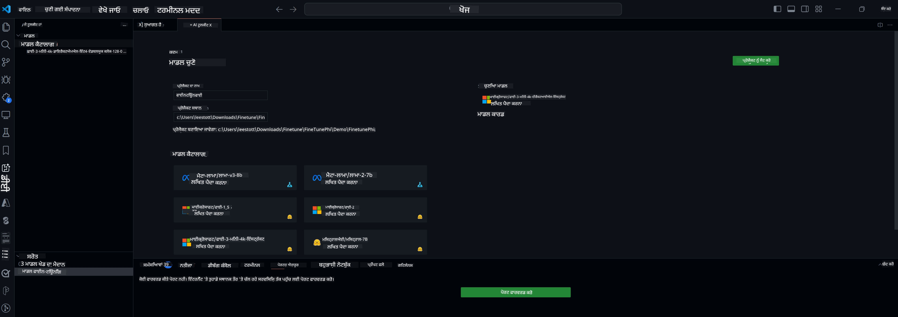

<!--
CO_OP_TRANSLATOR_METADATA:
{
  "original_hash": "c2bc0950f44919ac75a88c1a871680c2",
  "translation_date": "2025-05-09T22:09:50+00:00",
  "source_file": "md/03.FineTuning/Finetuning_VSCodeaitoolkit.md",
  "language_code": "pa"
}
-->
## VS Code ਲਈ AI Toolkit ਵਿੱਚ ਤੁਹਾਡਾ ਸੁਆਗਤ ਹੈ

[AI Toolkit for VS Code](https://github.com/microsoft/vscode-ai-toolkit/tree/main) Azure AI Studio ਕੈਟਾਲੌਗ ਅਤੇ ਹੋਰ ਕੈਟਾਲੌਗ ਜਿਵੇਂ Hugging Face ਤੋਂ ਵੱਖ-ਵੱਖ ਮਾਡਲ ਇਕੱਠੇ ਕਰਦਾ ਹੈ। ਇਹ ਟੂਲਕਿਟ ਜਨਰੇਟਿਵ AI ਟੂਲਜ਼ ਅਤੇ ਮਾਡਲਾਂ ਨਾਲ AI ਐਪਸ ਬਣਾਉਣ ਲਈ ਆਮ ਵਿਕਾਸ ਕਾਰਜਾਂ ਨੂੰ ਸਧਾਰਨ ਬਣਾਉਂਦਾ ਹੈ:
- ਮਾਡਲ ਖੋਜ ਅਤੇ ਪਲੇਗਰਾਊਂਡ ਨਾਲ ਸ਼ੁਰੂਆਤ ਕਰੋ।
- ਸਥਾਨਕ ਕੰਪਿਊਟਿੰਗ ਸਰੋਤਾਂ ਦੀ ਵਰਤੋਂ ਕਰਕੇ ਮਾਡਲ ਫਾਈਨ-ਟਿਊਨਿੰਗ ਅਤੇ ਇਨਫਰੈਂਸ।
- ਅਜ਼ੂਰ ਸਰੋਤਾਂ ਦੀ ਵਰਤੋਂ ਕਰਕੇ ਰਿਮੋਟ ਫਾਈਨ-ਟਿਊਨਿੰਗ ਅਤੇ ਇਨਫਰੈਂਸ।

[Install AI Toolkit for VSCode](https://marketplace.visualstudio.com/items?itemName=ms-windows-ai-studio.windows-ai-studio)



**[Private Preview]** ਅਜ਼ੂਰ ਕੰਟੇਨਰ ਐਪਸ ਲਈ ਇੱਕ-ਕਲਿੱਕ ਪ੍ਰੋਵਿਜ਼ਨਿੰਗ ਤਾਂ ਜੋ ਕਲਾਉਡ ਵਿੱਚ ਮਾਡਲ ਫਾਈਨ-ਟਿਊਨਿੰਗ ਅਤੇ ਇਨਫਰੈਂਸ ਚਲਾਇਆ ਜਾ ਸਕੇ।

ਹੁਣ ਆਓ ਤੁਹਾਡੇ AI ਐਪ ਵਿਕਾਸ ਵਿੱਚ ਸ਼ੁਰੂ ਕਰੀਏ:

- [VS Code ਲਈ AI Toolkit ਵਿੱਚ ਤੁਹਾਡਾ ਸੁਆਗਤ ਹੈ](../../../../md/03.FineTuning)
- [ਸਥਾਨਕ ਵਿਕਾਸ](../../../../md/03.FineTuning)
  - [ਤਿਆਰੀਆਂ](../../../../md/03.FineTuning)
  - [Conda ਨੂੰ ਐਕਟੀਵੇਟ ਕਰੋ](../../../../md/03.FineTuning)
  - [ਸਿਰਫ਼ ਬੇਸ ਮਾਡਲ ਫਾਈਨ-ਟਿਊਨਿੰਗ](../../../../md/03.FineTuning)
  - [ਮਾਡਲ ਫਾਈਨ-ਟਿਊਨਿੰਗ ਅਤੇ ਇਨਫਰੈਂਸਿੰਗ](../../../../md/03.FineTuning)
  - [ਮਾਡਲ ਫਾਈਨ-ਟਿਊਨਿੰਗ](../../../../md/03.FineTuning)
  - [Microsoft Olive](../../../../md/03.FineTuning)
  - [ਫਾਈਨ ਟਿਊਨਿੰਗ ਨਮੂਨੇ ਅਤੇ ਸਰੋਤ](../../../../md/03.FineTuning)
- [**\[Private Preview\]** ਰਿਮੋਟ ਵਿਕਾਸ](../../../../md/03.FineTuning)
  - [ਪੂਰਵ-ਸ਼ਰਤਾਂ](../../../../md/03.FineTuning)
  - [ਰਿਮੋਟ ਵਿਕਾਸ ਪ੍ਰੋਜੈਕਟ ਸੈਟਅਪ ਕਰਨਾ](../../../../md/03.FineTuning)
  - [ਅਜ਼ੂਰ ਸਰੋਤ ਪ੍ਰੋਵਿਜ਼ਨ ਕਰੋ](../../../../md/03.FineTuning)
  - [\[ਵਿਕਲਪਿਕ\] ਅਜ਼ੂਰ ਕੰਟੇਨਰ ਐਪ ਸਿਕ੍ਰੇਟ ਵਿੱਚ Huggingface ਟੋਕਨ ਸ਼ਾਮਿਲ ਕਰੋ](../../../../md/03.FineTuning)
  - [ਫਾਈਨ-ਟਿਊਨਿੰਗ ਚਲਾਓ](../../../../md/03.FineTuning)
  - [ਇਨਫਰੈਂਸ ਐਂਡਪੌਇੰਟ ਪ੍ਰੋਵਿਜ਼ਨ ਕਰੋ](../../../../md/03.FineTuning)
  - [ਇਨਫਰੈਂਸ ਐਂਡਪੌਇੰਟ ਡਿਪਲੋਯ ਕਰੋ](../../../../md/03.FineTuning)
  - [ਅਡਵਾਂਸਡ ਵਰਤੋਂ](../../../../md/03.FineTuning)

## ਸਥਾਨਕ ਵਿਕਾਸ
### ਤਿਆਰੀਆਂ

1. ਯਕੀਨੀ ਬਣਾਓ ਕਿ ਹੋਸਟ ਵਿੱਚ NVIDIA ਡਰਾਈਵਰ ਇੰਸਟਾਲ ਹੈ।  
2. ਜੇ ਤੁਸੀਂ HF ਨੂੰ ਡੇਟਾਸੇਟ ਲਈ ਵਰਤ ਰਹੇ ਹੋ ਤਾਂ `huggingface-cli login` ਚਲਾਓ।  
3. `Olive` ਕੁੰਜੀ ਸੈਟਿੰਗਾਂ ਦੀ ਵਿਆਖਿਆ ਜੋ ਮੈਮੋਰੀ ਦੀ ਵਰਤੋਂ ਨੂੰ ਬਦਲਦੀਆਂ ਹਨ।  

### Conda ਨੂੰ ਐਕਟੀਵੇਟ ਕਰੋ
ਕਿਉਂਕਿ ਅਸੀਂ WSL ਮਾਹੌਲ ਵਰਤ ਰਹੇ ਹਾਂ ਜੋ ਸਾਂਝਾ ਹੈ, ਤੁਹਾਨੂੰ Conda ਵਾਤਾਵਰਣ ਨੂੰ ਮੈਨੁਅਲ ਤੌਰ 'ਤੇ ਐਕਟੀਵੇਟ ਕਰਨਾ ਪਵੇਗਾ। ਇਸ ਕਦਮ ਤੋਂ ਬਾਅਦ ਤੁਸੀਂ ਫਾਈਨ-ਟਿਊਨਿੰਗ ਜਾਂ ਇਨਫਰੈਂਸ ਚਲਾ ਸਕਦੇ ਹੋ।

```bash
conda activate [conda-env-name] 
```

### ਸਿਰਫ਼ ਬੇਸ ਮਾਡਲ ਫਾਈਨ-ਟਿਊਨਿੰਗ
ਜੇਕਰ ਤੁਸੀਂ ਸਿਰਫ਼ ਬੇਸ ਮਾਡਲ ਨੂੰ ਬਿਨਾਂ ਫਾਈਨ-ਟਿਊਨਿੰਗ ਦੇ ਅਜ਼ਮਾਉਣਾ ਚਾਹੁੰਦੇ ਹੋ ਤਾਂ Conda ਐਕਟੀਵੇਟ ਕਰਨ ਤੋਂ ਬਾਅਦ ਇਹ ਕਮਾਂਡ ਚਲਾਓ।

```bash
cd inference

# Web browser interface allows to adjust a few parameters like max new token length, temperature and so on.
# User has to manually open the link (e.g. http://0.0.0.0:7860) in a browser after gradio initiates the connections.
python gradio_chat.py --baseonly
```

### ਮਾਡਲ ਫਾਈਨ-ਟਿਊਨਿੰਗ ਅਤੇ ਇਨਫਰੈਂਸਿੰਗ

ਜਦੋਂ ਵਰਕਸਪੇਸ ਇੱਕ ਡਿਵ ਕਨਟੇਨਰ ਵਿੱਚ ਖੁਲ ਜਾਵੇ, ਟਰਮੀਨਲ ਖੋਲ੍ਹੋ (ਡਿਫਾਲਟ ਰਾਹ ਪ੍ਰੋਜੈਕਟ ਰੂਟ ਹੈ), ਫਿਰ ਹੇਠਾਂ ਦਿੱਤੀ ਕਮਾਂਡ ਚਲਾਓ ਤਾਂ ਜੋ ਚੁਣੀ ਹੋਈ ਡੇਟਾਸੇਟ 'ਤੇ LLM ਨੂੰ ਫਾਈਨ-ਟਿਊਨ ਕੀਤਾ ਜਾ ਸਕੇ।

```bash
python finetuning/invoke_olive.py 
```

ਚੈਕਪੌਇੰਟ ਅਤੇ ਅੰਤਿਮ ਮਾਡਲ `models` folder.

Next run inferencing with the fune-tuned model through chats in a `console`, `web browser` or `prompt flow` ਵਿੱਚ ਸੇਵ ਹੋਣਗੇ।

```bash
cd inference

# Console interface.
python console_chat.py

# Web browser interface allows to adjust a few parameters like max new token length, temperature and so on.
# User has to manually open the link (e.g. http://127.0.0.1:7860) in a browser after gradio initiates the connections.
python gradio_chat.py
```

`prompt flow` in VS Code, please refer to this [Quick Start](https://microsoft.github.io/promptflow/how-to-guides/quick-start.html).

### Model Fine-tuning

Next, download the following model depending on the availability of a GPU on your device.

To initiate the local fine-tuning session using QLoRA, select a model you want to fine-tune from our catalog.
| Platform(s) | GPU available | Model name | Size (GB) |
|---------|---------|--------|--------|
| Windows | Yes | Phi-3-mini-4k-**directml**-int4-awq-block-128-onnx | 2.13GB |
| Linux | Yes | Phi-3-mini-4k-**cuda**-int4-onnx | 2.30GB |
| Windows<br>Linux | No | Phi-3-mini-4k-**cpu**-int4-rtn-block-32-acc-level-4-onnx | 2.72GB |

**_Note_** You do not need an Azure Account to download the models

The Phi3-mini (int4) model is approximately 2GB-3GB in size. Depending on your network speed, it could take a few minutes to download.

Start by selecting a project name and location.
Next, select a model from the model catalog. You will be prompted to download the project template. You can then click "Configure Project" to adjust various settings.

### Microsoft Olive 

We use [Olive](https://microsoft.github.io/Olive/why-olive.html) to run QLoRA fine-tuning on a PyTorch model from our catalog. All of the settings are preset with the default values to optimize to run the fine-tuning process locally with optimized use of memory, but it can be adjusted for your scenario.

### Fine Tuning Samples and Resoures

- [Fine tuning Getting Started Guide](https://learn.microsoft.com/windows/ai/toolkit/toolkit-fine-tune)
- [Fine tuning with a HuggingFace Dataset](https://github.com/microsoft/vscode-ai-toolkit/blob/main/archive/walkthrough-hf-dataset.md)
- [Fine tuning with Simple DataSet](https://github.com/microsoft/vscode-ai-toolkit/blob/main/archive/walkthrough-simple-dataset.md)

## **[Private Preview]** Remote Development

### Prerequisites

1. To run the model fine-tuning in your remote Azure Container App Environment, make sure your subscription has enough GPU capacity. Submit a [support ticket](https://azure.microsoft.com/support/create-ticket/) to request the required capacity for your application. [Get More Info about GPU capacity](https://learn.microsoft.com/azure/container-apps/workload-profiles-overview)
2. If you are using private dataset on HuggingFace, make sure you have a [HuggingFace account](https://huggingface.co/?WT.mc_id=aiml-137032-kinfeylo) and [generate an access token](https://huggingface.co/docs/hub/security-tokens?WT.mc_id=aiml-137032-kinfeylo)
3. Enable Remote Fine-tuning and Inference feature flag in the AI Toolkit for VS Code
   1. Open the VS Code Settings by selecting *File -> Preferences -> Settings*.
   2. Navigate to *Extensions* and select *AI Toolkit*.
   3. Select the *"Enable Remote Fine-tuning And Inference"* option.
   4. Reload VS Code to take effect.

- [Remote Fine tuning](https://github.com/microsoft/vscode-ai-toolkit/blob/main/archive/remote-finetuning.md)

### Setting Up a Remote Development Project
1. Execute the command palette `AI Toolkit: Focus on Resource View`.
2. Navigate to *Model Fine-tuning* to access the model catalog. Assign a name to your project and select its location on your machine. Then, hit the *"Configure Project"* button.
3. Project Configuration
    1. Avoid enabling the *"Fine-tune locally"* option.
    2. The Olive configuration settings will appear with pre-set default values. Please adjust and fill in these configurations as required.
    3. Move on to *Generate Project*. This stage leverages WSL and involves setting up a new Conda environment, preparing for future updates that include Dev Containers.
4. Click on *"Relaunch Window In Workspace"* to open your remote development project.

> **Note:** The project currently works either locally or remotely within the AI Toolkit for VS Code. If you choose *"Fine-tune locally"* during project creation, it will operate exclusively in WSL without remote development capabilities. On the other hand, if you forego enabling *"Fine-tune locally"*, the project will be restricted to the remote Azure Container App environment.

### Provision Azure Resources
To get started, you need to provision the Azure Resource for remote fine-tuning. Do this by running the `AI Toolkit: Provision Azure Container Apps job for fine-tuning` from the command palette.

Monitor the progress of the provision through the link displayed in the output channel.

### [Optional] Add Huggingface Token to the Azure Container App Secret
If you're using private HuggingFace dataset, set your HuggingFace token as an environment variable to avoid the need for manual login on the Hugging Face Hub.
You can do this using the `AI Toolkit: Add Azure Container Apps Job secret for fine-tuning command`. With this command, you can set the secret name as [`HF_TOKEN`](https://huggingface.co/docs/huggingface_hub/package_reference/environment_variables#hftoken) and use your Hugging Face token as the secret value.

### Run Fine-tuning
To start the remote fine-tuning job, execute the `AI Toolkit: Run fine-tuning` command.

To view the system and console logs, you can visit the Azure portal using the link in the output panel (more steps at [View and Query Logs on Azure](https://aka.ms/ai-toolkit/remote-provision#view-and-query-logs-on-azure)). Or, you can view the console logs directly in the VSCode output panel by running the command `AI Toolkit: Show the running fine-tuning job streaming logs`. 
> **Note:** The job might be queued due to insufficient resources. If the log is not displayed, execute the `AI Toolkit: Show the running fine-tuning job streaming logs` command, wait for a while and then execute the command again to re-connect to the streaming log.

During this process, QLoRA will be used for fine-tuning, and will create LoRA adapters for the model to use during inference.
The results of the fine-tuning will be stored in the Azure Files.

### Provision Inference Endpoint
After the adapters are trained in the remote environment, use a simple Gradio application to interact with the model.
Similar to the fine-tuning process, you need to set up the Azure Resources for remote inference by executing the `AI Toolkit: Provision Azure Container Apps for inference` from the command palette.

By default, the subscription and the resource group for inference should match those used for fine-tuning. The inference will use the same Azure Container App Environment and access the model and model adapter stored in Azure Files, which were generated during the fine-tuning step. 


### Deploy the Inference Endpoint
If you wish to revise the inference code or reload the inference model, please execute the `AI Toolkit: Deploy for inference` command. This will synchronize your latest code with Azure Container App and restart the replica.  

Once deployment is successfully completed, you can access the inference API by clicking on the "*Go to Inference Endpoint*" button displayed in the VSCode notification. Or, the web API endpoint can be found under `ACA_APP_ENDPOINT` in `./infra/inference.config.json` ਅਤੇ ਆਉਟਪੁੱਟ ਪੈਨਲ ਵਿੱਚ ਵਰਤ ਕੇ ਤੁਸੀਂ ਹੁਣ ਇਸ ਐਂਡਪੌਇੰਟ ਨਾਲ ਮਾਡਲ ਦਾ ਮੁਲਾਂਕਣ ਕਰਨ ਲਈ ਤਿਆਰ ਹੋ।

### ਅਡਵਾਂਸਡ ਵਰਤੋਂ
AI Toolkit ਨਾਲ ਰਿਮੋਟ ਵਿਕਾਸ ਬਾਰੇ ਵਧੇਰੇ ਜਾਣਕਾਰੀ ਲਈ, [Fine-Tuning models remotely](https://aka.ms/ai-toolkit/remote-provision) ਅਤੇ [Inferencing with the fine-tuned model](https://aka.ms/ai-toolkit/remote-inference) ਦਸਤਾਵੇਜ਼ਾਂ ਨੂੰ ਦੇਖੋ।

**ਅਸਵੀਕਾਰੋਪਣ**:  
ਇਹ ਦਸਤਾਵੇਜ਼ AI ਅਨੁਵਾਦ ਸੇਵਾ [Co-op Translator](https://github.com/Azure/co-op-translator) ਦੀ ਵਰਤੋਂ ਕਰਕੇ ਅਨੁਵਾਦਿਤ ਕੀਤਾ ਗਿਆ ਹੈ। ਜਦੋਂ ਕਿ ਅਸੀਂ ਸਹੀਤਾ ਲਈ ਕੋਸ਼ਿਸ਼ ਕਰਦੇ ਹਾਂ, ਕਿਰਪਾ ਕਰਕੇ ਧਿਆਨ ਰੱਖੋ ਕਿ ਸਵੈਚਾਲਿਤ ਅਨੁਵਾਦਾਂ ਵਿੱਚ ਗਲਤੀਆਂ ਜਾਂ ਅਸਮਰਥਤਾਵਾਂ ਹੋ ਸਕਦੀਆਂ ਹਨ। ਮੂਲ ਦਸਤਾਵੇਜ਼ ਆਪਣੀ ਮੂਲ ਭਾਸ਼ਾ ਵਿੱਚ ਹੀ ਅਧਿਕਾਰਤ ਸਰੋਤ ਮੰਨਿਆ ਜਾਣਾ ਚਾਹੀਦਾ ਹੈ। ਮਹੱਤਵਪੂਰਨ ਜਾਣਕਾਰੀ ਲਈ, ਪੇਸ਼ੇਵਰ ਮਨੁੱਖੀ ਅਨੁਵਾਦ ਦੀ ਸਿਫਾਰਸ਼ ਕੀਤੀ ਜਾਂਦੀ ਹੈ। ਅਸੀਂ ਇਸ ਅਨੁਵਾਦ ਦੀ ਵਰਤੋਂ ਤੋਂ ਪੈਦਾ ਹੋਣ ਵਾਲੀਆਂ ਕਿਸੇ ਵੀ ਗਲਤਫਹਿਮੀਆਂ ਜਾਂ ਗਲਤ ਸਮਝਾਂ ਲਈ ਜ਼ਿੰਮੇਵਾਰ ਨਹੀਂ ਹਾਂ।