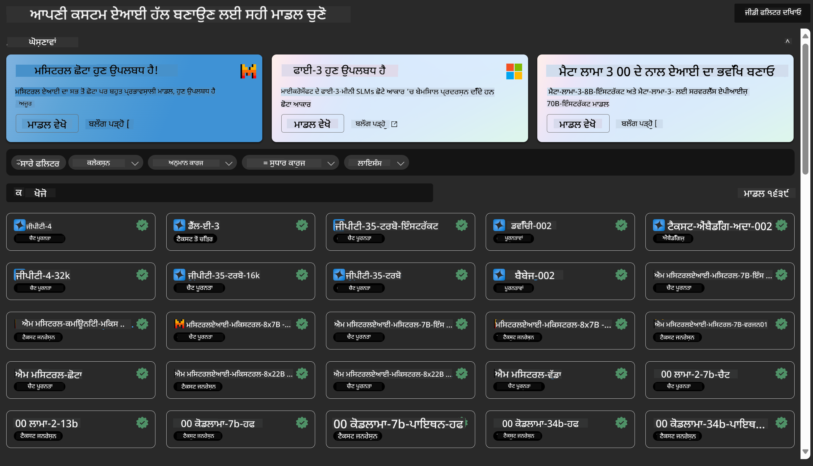
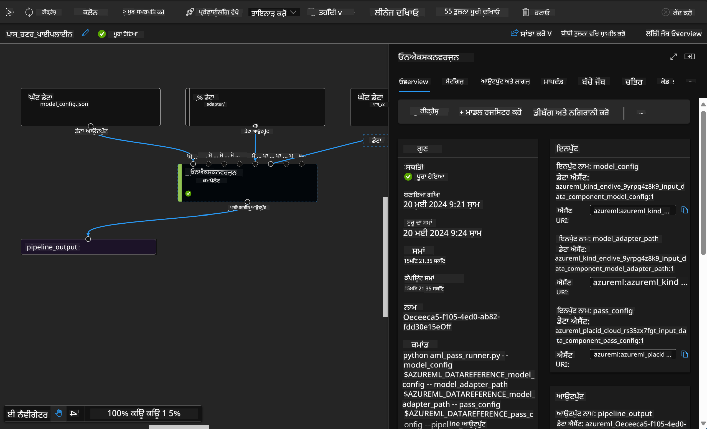

<!--
CO_OP_TRANSLATOR_METADATA:
{
  "original_hash": "7fe541373802e33568e94e13226d463c",
  "translation_date": "2025-05-09T22:18:40+00:00",
  "source_file": "md/03.FineTuning/Introduce_AzureML.md",
  "language_code": "pa"
}
-->
# **ਅਜ਼ੂਰ ਮਸ਼ੀਨ ਲਰਨਿੰਗ ਸਰਵਿਸ ਦਾ ਪਰਿਚਯ**

[Azure Machine Learning](https://ml.azure.com?WT.mc_id=aiml-138114-kinfeylo) ਇੱਕ ਕਲਾਉਡ ਸਰਵਿਸ ਹੈ ਜੋ ਮਸ਼ੀਨ ਲਰਨਿੰਗ (ML) ਪ੍ਰੋਜੈਕਟ ਦੀ ਜ਼ਿੰਦਗੀ ਚੱਕਰ ਨੂੰ ਤੇਜ਼ ਅਤੇ ਪ੍ਰਬੰਧਿਤ ਕਰਨ ਲਈ ਬਣਾਈ ਗਈ ਹੈ।

ML ਮਾਹਿਰ, ਡਾਟਾ ਸਾਇੰਟਿਸਟ ਅਤੇ ਇੰਜੀਨੀਅਰ ਇਸਨੂੰ ਆਪਣੀਆਂ ਰੋਜ਼ਾਨਾ ਦੀਆਂ ਕਾਰਵਾਈਆਂ ਵਿੱਚ ਇਸ ਤਰ੍ਹਾਂ ਵਰਤ ਸਕਦੇ ਹਨ:

- ਮਾਡਲ ਤਿਆਰ ਅਤੇ ਡਿਪਲੋਏ ਕਰੋ।  
ਮਸ਼ੀਨ ਲਰਨਿੰਗ ਓਪਰੇਸ਼ਨ (MLOps) ਦਾ ਪ੍ਰਬੰਧਨ ਕਰੋ।  
- ਤੁਸੀਂ Azure Machine Learning ਵਿੱਚ ਮਾਡਲ ਬਣਾਉਣ ਜਾਂ ਕਿਸੇ ਖੁੱਲ੍ਹੇ ਸ੍ਰੋਤ ਪਲੇਟਫਾਰਮ ਜਿਵੇਂ PyTorch, TensorFlow ਜਾਂ scikit-learn ਤੋਂ ਬਣੇ ਮਾਡਲ ਨੂੰ ਵਰਤ ਸਕਦੇ ਹੋ।  
- MLOps ਟੂਲ ਤੁਹਾਨੂੰ ਮਾਡਲਾਂ ਦੀ ਨਿਗਰਾਨੀ, ਮੁੜ-ਸਿਖਲਾਈ ਅਤੇ ਮੁੜ-ਡਿਪਲੋਏ ਕਰਨ ਵਿੱਚ ਮਦਦ ਕਰਦੇ ਹਨ।  

## Azure Machine Learning ਕੌਣ ਵਰਤ ਸਕਦਾ ਹੈ?

**ਡਾਟਾ ਸਾਇੰਟਿਸਟ ਅਤੇ ML ਇੰਜੀਨੀਅਰ**

ਉਹ ਆਪਣੇ ਰੋਜ਼ਾਨਾ ਕੰਮ ਨੂੰ ਤੇਜ਼ ਅਤੇ ਆਟੋਮੇਟ ਕਰਨ ਲਈ ਟੂਲਜ਼ ਦੀ ਵਰਤੋਂ ਕਰ ਸਕਦੇ ਹਨ।  
Azure ML ਨਿਆਂਪੂਰਨਤਾ, ਵਿਆਖਿਆਯੋਗਤਾ, ਟ੍ਰੈਕਿੰਗ ਅਤੇ ਆਡੀਟਬਿਲਟੀ ਲਈ ਖਾਸ ਵਿਸ਼ੇਸ਼ਤਾਵਾਂ ਦਿੰਦਾ ਹੈ।  
**ਐਪਲੀਕੇਸ਼ਨ ਡਿਵੈਲਪਰ:**  
ਉਹ ਮਾਡਲਾਂ ਨੂੰ ਬਿਨਾ ਕਿਸੇ ਰੁਕਾਵਟ ਦੇ ਐਪਲੀਕੇਸ਼ਨਾਂ ਜਾਂ ਸਰਵਿਸਾਂ ਵਿੱਚ ਸ਼ਾਮਿਲ ਕਰ ਸਕਦੇ ਹਨ।  

**ਪਲੇਟਫਾਰਮ ਡਿਵੈਲਪਰ**

ਉਹਨਾਂ ਕੋਲ ਮਜ਼ਬੂਤ ਟੂਲਜ਼ ਦੀ ਪਹੁੰਚ ਹੁੰਦੀ ਹੈ ਜੋ Azure Resource Manager APIs ਦੁਆਰਾ ਸਹਾਇਤ ਹੁੰਦੇ ਹਨ।  
ਇਹ ਟੂਲਜ਼ ਅਡਵਾਂਸਡ ML ਟੂਲਿੰਗ ਬਣਾਉਣ ਦੀ ਆਗਿਆ ਦਿੰਦੇ ਹਨ।  

**ਕਾਰੋਬਾਰੀ ਸੰਸਥਾਵਾਂ**

Microsoft Azure ਕਲਾਉਡ ਵਿੱਚ ਕੰਮ ਕਰਦੀਆਂ ਸੰਸਥਾਵਾਂ ਨੂੰ ਜਾਣੂ ਸੁਰੱਖਿਆ ਅਤੇ ਭੂਮਿਕਾ-ਅਧਾਰਤ ਐਕਸੈਸ ਕੰਟਰੋਲ ਦਾ ਲਾਭ ਮਿਲਦਾ ਹੈ।  
ਪ੍ਰੋਜੈਕਟ ਸੈਟਅੱਪ ਕਰਕੇ ਸੁਰੱਖਿਅਤ ਡਾਟਾ ਅਤੇ ਖਾਸ ਓਪਰੇਸ਼ਨਾਂ ਲਈ ਐਕਸੈਸ ਕੰਟਰੋਲ ਕੀਤਾ ਜਾ ਸਕਦਾ ਹੈ।  

## ਟੀਮ ਵਿੱਚ ਹਰ ਕਿਸੇ ਲਈ ਉਤਪਾਦਕਤਾ  
ML ਪ੍ਰੋਜੈਕਟਾਂ ਵਿੱਚ ਅਕਸਰ ਵੱਖ-ਵੱਖ ਹੁਨਰਾਂ ਵਾਲੀ ਟੀਮ ਦੀ ਲੋੜ ਹੁੰਦੀ ਹੈ ਜੋ ਬਣਾਉਣ ਅਤੇ ਸੰਭਾਲਣ ਲਈ।

Azure ML ਤੁਹਾਨੂੰ ਇਹ ਸਹੂਲਤ ਦਿੰਦਾ ਹੈ ਕਿ ਤੁਸੀਂ:  
- ਆਪਣੀ ਟੀਮ ਨਾਲ ਸਾਂਝੇ ਨੋਟਬੁੱਕਸ, ਕੰਪਿਊਟ ਸਰੋਤ, ਸਰਵਰਲੈੱਸ ਕੰਪਿਊਟ, ਡਾਟਾ ਅਤੇ ਵਾਤਾਵਰਨਾਂ ਰਾਹੀਂ ਸਹਿਯੋਗ ਕਰ ਸਕੋ।  
- ਨਿਆਂਪੂਰਨਤਾ, ਵਿਆਖਿਆਯੋਗਤਾ, ਟ੍ਰੈਕਿੰਗ ਅਤੇ ਆਡੀਟਬਿਲਟੀ ਨਾਲ ਮਾਡਲ ਤਿਆਰ ਕਰੋ ਤਾਂ ਜੋ ਲਾਈਨੇਜ ਅਤੇ ਆਡੀਟ ਅਨੁਕੂਲਤਾ ਦੀ ਪਾਲਣਾ ਹੋ ਸਕੇ।  
- ML ਮਾਡਲਾਂ ਨੂੰ ਤੇਜ਼ੀ ਨਾਲ ਅਤੇ ਆਸਾਨੀ ਨਾਲ ਵੱਡੇ ਪੱਧਰ 'ਤੇ ਡਿਪਲੋਏ ਕਰੋ ਅਤੇ MLOps ਨਾਲ ਉਹਨਾਂ ਦਾ ਪ੍ਰਬੰਧਨ ਅਤੇ ਗਵਰਨੈਂਸ ਕਰੋ।  
- ਮਸ਼ੀਨ ਲਰਨਿੰਗ ਕੰਮ ਕਿਤੇ ਵੀ ਚਲਾ ਸਕੋ, ਜਿੱਥੇ ਅੰਦਰੂਨੀ ਗਵਰਨੈਂਸ, ਸੁਰੱਖਿਆ ਅਤੇ ਅਨੁਕੂਲਤਾ ਮੌਜੂਦ ਹੋਵੇ।  

## ਕ੍ਰਾਸ-ਕੰਪੈਟਿਬਲ ਪਲੇਟਫਾਰਮ ਟੂਲਜ਼

ML ਟੀਮ ਵਿੱਚ ਹਰ ਕੋਈ ਆਪਣੀਆਂ ਮਨਪਸੰਦ ਟੂਲਜ਼ ਨਾਲ ਕੰਮ ਕਰ ਸਕਦਾ ਹੈ।  
ਚਾਹੇ ਤੁਸੀਂ ਤੇਜ਼ ਪ੍ਰਯੋਗ ਕਰ ਰਹੇ ਹੋ, ਹਾਈਪਰਪੈਰਾਮੀਟਰ ਟਿਊਨਿੰਗ, ਪਾਈਪਲਾਈਨ ਬਣਾਉਣਾ ਜਾਂ ਇੰਫਰੰਸ ਮੈਨੇਜ ਕਰਨਾ ਹੋਵੇ, ਤੁਸੀਂ ਜਾਣੂ ਇੰਟਰਫੇਸ ਵਰਤ ਸਕਦੇ ਹੋ ਜਿਵੇਂ:  
- Azure Machine Learning Studio  
- Python SDK (v2)  
- Azure CLI (v2)  
- Azure Resource Manager REST APIs  

ਜਿਵੇਂ ਜਿਵੇਂ ਤੁਸੀਂ ਮਾਡਲਾਂ ਨੂੰ ਸੁਧਾਰਦੇ ਹੋ ਅਤੇ ਵਿਕਾਸ ਚੱਕਰ ਵਿੱਚ ਸਹਿਯੋਗ ਕਰਦੇ ਹੋ, ਤੁਸੀਂ Azure Machine Learning Studio UI ਵਿੱਚ ਸੰਪਤੀ, ਸਰੋਤ ਅਤੇ ਮੈਟ੍ਰਿਕਸ ਸਾਂਝੇ ਅਤੇ ਲੱਭ ਸਕਦੇ ਹੋ।  

## **Azure ML ਵਿੱਚ LLM/SLM**

Azure ML ਨੇ ਬਹੁਤ ਸਾਰੇ LLM/SLM-ਸੰਬੰਧੀ ਫੰਕਸ਼ਨ ਜੋੜੇ ਹਨ, ਜੋ LLMOps ਅਤੇ SLMOps ਨੂੰ ਮਿਲਾ ਕੇ ਇਕ ਕਾਰੋਬਾਰੀ ਪੱਧਰ ਦਾ ਜਨਰੇਟਿਵ ਕ੍ਰਿਤਿਮ ਬੁੱਧੀ ਤਕਨਾਲੋਜੀ ਪਲੇਟਫਾਰਮ ਬਣਾਉਂਦਾ ਹੈ।  

### **Model Catalog**

ਕਾਰੋਬਾਰੀ ਉਪਭੋਗਤਾ ਵੱਖ-ਵੱਖ ਕਾਰੋਬਾਰੀ ਸਥਿਤੀਆਂ ਅਨੁਸਾਰ ਵੱਖ-ਵੱਖ ਮਾਡਲ ਡਿਪਲੋਏ ਕਰ ਸਕਦੇ ਹਨ Model Catalog ਰਾਹੀਂ, ਅਤੇ Model as Service ਵਜੋਂ ਸਰਵਿਸ ਪ੍ਰਦਾਨ ਕਰਦੇ ਹਨ ਤਾਂ ਜੋ ਕਾਰੋਬਾਰੀ ਡਿਵੈਲਪਰ ਜਾਂ ਉਪਭੋਗਤਾ ਐਕਸੈਸ ਕਰ ਸਕਣ।  

  

Azure Machine Learning Studio ਵਿੱਚ Model Catalog ਇੱਕ ਕੇਂਦਰ ਹੈ ਜਿੱਥੇ ਤੁਸੀਂ ਵੱਖ-ਵੱਖ ਮਾਡਲ ਖੋਜ ਅਤੇ ਵਰਤ ਸਕਦੇ ਹੋ ਜੋ ਤੁਹਾਨੂੰ ਜਨਰੇਟਿਵ AI ਐਪਲੀਕੇਸ਼ਨਾਂ ਬਣਾਉਣ ਵਿੱਚ ਸਹਾਇਤਾ ਕਰਦੇ ਹਨ। ਮਾਡਲ ਕੈਟਾਲੌਗ ਵਿੱਚ Azure OpenAI ਸਰਵਿਸ, Mistral, Meta, Cohere, Nvidia, Hugging Face ਵਰਗੇ ਮਾਡਲ ਪ੍ਰਦਾਤਾਵਾਂ ਦੇ ਸੈਂਕੜੇ ਮਾਡਲ ਸ਼ਾਮਿਲ ਹਨ, ਜਿਸ ਵਿੱਚ Microsoft ਵੱਲੋਂ ਸਿਖਾਏ ਗਏ ਮਾਡਲ ਵੀ ਹਨ। Microsoft ਤੋਂ ਇਲਾਵਾ ਹੋਰ ਪ੍ਰਦਾਤਾਵਾਂ ਦੇ ਮਾਡਲ Non-Microsoft Products ਹਨ, ਜਿਵੇਂ Microsoft ਦੇ ਉਤਪਾਦ ਨਿਯਮਾਂ ਵਿੱਚ ਪਰਿਭਾਸ਼ਿਤ ਹੈ, ਅਤੇ ਮਾਡਲ ਨਾਲ ਦਿੱਤੇ ਗਏ ਸ਼ਰਤਾਂ ਦੇ ਅਧੀਨ ਹਨ।  

### **Job Pipeline**

ਮਸ਼ੀਨ ਲਰਨਿੰਗ ਪਾਈਪਲਾਈਨ ਦਾ ਮੁੱਖ ਹਿੱਸਾ ਇੱਕ ਪੂਰੇ ਮਸ਼ੀਨ ਲਰਨਿੰਗ ਟਾਸਕ ਨੂੰ ਕਈ ਕਦਮਾਂ ਵਾਲੇ ਵਰਕਫਲੋ ਵਿੱਚ ਵੰਡਣਾ ਹੈ। ਹਰ ਕਦਮ ਇੱਕ ਸੰਭਾਲਯੋਗ ਹਿੱਸਾ ਹੁੰਦਾ ਹੈ ਜੋ ਅਲੱਗ-ਅਲੱਗ ਵਿਕਸਿਤ, ਸੁਧਾਰਿਆ, ਸੰਰਚਿਤ ਅਤੇ ਆਟੋਮੇਟ ਕੀਤਾ ਜਾ ਸਕਦਾ ਹੈ। ਕਦਮ ਇੱਕ ਦੂਜੇ ਨਾਲ ਸਾਫ਼-ਸੁਥਰੇ ਇੰਟਰਫੇਸ ਰਾਹੀਂ ਜੁੜੇ ਹੁੰਦੇ ਹਨ। Azure Machine Learning pipeline ਸਰਵਿਸ ਸਾਰੇ ਕਦਮਾਂ ਵਿਚਕਾਰ ਦੀਆਂ ਡਿਪੈਂਡੈਂਸੀਜ਼ ਨੂੰ ਆਪਣੇ ਆਪ ਸੰਜੋਦੀ ਹੈ।  

SLM / LLM ਦੀ ਫਾਈਨ-ਟਿਊਨਿੰਗ ਵਿੱਚ, ਅਸੀਂ ਆਪਣੇ ਡਾਟਾ, ਟ੍ਰੇਨਿੰਗ ਅਤੇ ਜਨਰੇਸ਼ਨ ਪ੍ਰਕਿਰਿਆਵਾਂ ਨੂੰ Pipeline ਰਾਹੀਂ ਸੰਭਾਲ ਸਕਦੇ ਹਾਂ।  

  

### **Prompt flow**

Azure Machine Learning prompt flow ਵਰਤਣ ਦੇ ਫਾਇਦੇ  
Azure Machine Learning prompt flow ਉਹਨਾਂ ਨੂੰ ਕਈ ਫਾਇਦੇ ਦਿੰਦਾ ਹੈ ਜੋ ਯੂਜ਼ਰਾਂ ਨੂੰ ਵਿਚਾਰ ਤੋਂ ਲੈ ਕੇ ਪ੍ਰਯੋਗ ਅਤੇ ਆਖ਼ਿਰਕਾਰ ਤਿਆਰ LLM-ਅਧਾਰਿਤ ਐਪਲੀਕੇਸ਼ਨਾਂ ਤੱਕ ਲਿਜਾਣ ਵਿੱਚ ਮਦਦ ਕਰਦੇ ਹਨ:  

**Prompt engineering ਵਿੱਚ ਤੇਜ਼ੀ**

ਇੰਟਰਐਕਟਿਵ ਲੇਖਨ ਅਨੁਭਵ: Azure Machine Learning prompt flow ਪ੍ਰੋਜੈਕਟ ਦੀ ਬਣਤਰ ਦਾ ਵਿਜ਼ੂਅਲ ਪ੍ਰਤੀਨਿਧਿਤਾ ਦਿੰਦਾ ਹੈ, ਜਿਸ ਨਾਲ ਯੂਜ਼ਰ ਆਪਣੀਆਂ ਪ੍ਰੋਜੈਕਟਾਂ ਨੂੰ ਆਸਾਨੀ ਨਾਲ ਸਮਝ ਅਤੇ ਨੈਵੀਗੇਟ ਕਰ ਸਕਦੇ ਹਨ। ਇਹ ਨੋਟਬੁੱਕ ਵਰਗਾ ਕੋਡਿੰਗ ਅਨੁਭਵ ਵੀ ਦਿੰਦਾ ਹੈ ਜੋ ਫਲੋ ਵਿਕਾਸ ਅਤੇ ਡਿਬੱਗਿੰਗ ਨੂੰ ਤੇਜ਼ ਕਰਦਾ ਹੈ।  
Prompt tuning ਲਈ ਵੱਖ-ਵੱਖ ਰੂਪ: ਯੂਜ਼ਰ ਕਈ ਪ੍ਰੰਪਟ ਵੈਰੀਐਂਟਸ ਬਣਾ ਅਤੇ ਤੁਲਨਾ ਕਰ ਸਕਦੇ ਹਨ, ਜਿਸ ਨਾਲ ਸੁਧਾਰ ਦੀ ਪ੍ਰਕਿਰਿਆ ਆਸਾਨ ਹੁੰਦੀ ਹੈ।  

ਮੁਲਾਂਕਣ: ਇੰਬਿਲਟ ਮੁਲਾਂਕਣ ਫਲੋਜ਼ ਯੂਜ਼ਰਾਂ ਨੂੰ ਆਪਣੇ ਪ੍ਰੰਪਟਾਂ ਅਤੇ ਫਲੋਜ਼ ਦੀ ਗੁਣਵੱਤਾ ਅਤੇ ਪ੍ਰਭਾਵਸ਼ੀਲਤਾ ਦਾ ਅੰਕੜਾ ਲੈਣ ਦੀ ਆਗਿਆ ਦਿੰਦੇ ਹਨ।  

ਵਿਆਪਕ ਸਰੋਤ: Azure Machine Learning prompt flow ਵਿੱਚ ਬਿਲਟ-ਇਨ ਟੂਲਜ਼, ਨਮੂਨੇ ਅਤੇ ਟੈਂਪਲੇਟਾਂ ਦੀ ਲਾਇਬ੍ਰੇਰੀ ਹੁੰਦੀ ਹੈ ਜੋ ਵਿਕਾਸ ਲਈ ਸ਼ੁਰੂਆਤੀ ਬਿੰਦੂ ਵਜੋਂ ਕੰਮ ਕਰਦੀ ਹੈ, ਰਚਨਾਤਮਕਤਾ ਨੂੰ ਪ੍ਰੇਰਿਤ ਕਰਦੀ ਹੈ ਅਤੇ ਪ੍ਰਕਿਰਿਆ ਨੂੰ ਤੇਜ਼ ਕਰਦੀ ਹੈ।  

**LLM-ਅਧਾਰਿਤ ਐਪਲੀਕੇਸ਼ਨਾਂ ਲਈ ਕਾਰੋਬਾਰੀ ਤਿਆਰੀ**

ਸਹਿਯੋਗ: Azure Machine Learning prompt flow ਟੀਮ ਸਹਿਯੋਗ ਨੂੰ ਸਮਰਥਨ ਦਿੰਦਾ ਹੈ, ਜਿਸ ਨਾਲ ਕਈ ਯੂਜ਼ਰ ਇਕੱਠੇ ਪ੍ਰੰਪਟ ਇੰਜੀਨੀਅਰਿੰਗ ਪ੍ਰੋਜੈਕਟਾਂ 'ਤੇ ਕੰਮ ਕਰ ਸਕਦੇ ਹਨ, ਗਿਆਨ ਸਾਂਝਾ ਕਰ ਸਕਦੇ ਹਨ ਅਤੇ ਵਰਜਨ ਕੰਟਰੋਲ ਬਰਕਰਾਰ ਰੱਖ ਸਕਦੇ ਹਨ।  

ਸਭ ਕੁਝ ਇਕੱਠਾ ਪਲੇਟਫਾਰਮ: Azure Machine Learning prompt flow ਸਾਰੇ ਪ੍ਰੰਪਟ ਇੰਜੀਨੀਅਰਿੰਗ ਪ੍ਰਕਿਰਿਆ ਨੂੰ ਸੁਚਾਰੂ ਬਣਾਉਂਦਾ ਹੈ, ਵਿਕਾਸ ਅਤੇ ਮੁਲਾਂਕਣ ਤੋਂ ਲੈ ਕੇ ਡਿਪਲੋਏਮੈਂਟ ਅਤੇ ਨਿਗਰਾਨੀ ਤੱਕ। ਯੂਜ਼ਰ ਆਪਣੇ ਫਲੋਜ਼ ਨੂੰ ਆਸਾਨੀ ਨਾਲ Azure Machine Learning endpoints ਵਜੋਂ ਡਿਪਲੋਏ ਕਰ ਸਕਦੇ ਹਨ ਅਤੇ ਉਨ੍ਹਾਂ ਦੀ ਕਾਰਗੁਜ਼ਾਰੀ ਨੂੰ ਰੀਅਲ-ਟਾਈਮ ਵਿੱਚ ਮਾਨੀਟਰ ਕਰ ਸਕਦੇ ਹਨ, ਇਹ ਯਕੀਨੀ ਬਣਾਉਂਦੇ ਹੋਏ ਕਿ ਉਹ ਬਿਹਤਰ ਢੰਗ ਨਾਲ ਕੰਮ ਕਰ ਰਹੇ ਹਨ ਅਤੇ ਲਗਾਤਾਰ ਸੁਧਾਰ ਹੋ ਰਿਹਾ ਹੈ।  

Azure Machine Learning Enterprise Readiness Solutions: Prompt flow Azure Machine Learning ਦੀ ਮਜ਼ਬੂਤ ਕਾਰੋਬਾਰੀ ਤਿਆਰੀ ਹੱਲਾਂ ਦੀ ਵਰਤੋਂ ਕਰਦਾ ਹੈ, ਜੋ ਫਲੋਜ਼ ਦੇ ਵਿਕਾਸ, ਪ੍ਰਯੋਗ ਅਤੇ ਡਿਪਲੋਏਮੈਂਟ ਲਈ ਸੁਰੱਖਿਅਤ, ਸਕੇਲਯੋਗ ਅਤੇ ਭਰੋਸੇਮੰਦ ਬੁਨਿਆਦ ਪ੍ਰਦਾਨ ਕਰਦਾ ਹੈ।  

Azure Machine Learning prompt flow ਨਾਲ, ਯੂਜ਼ਰ ਆਪਣੀ ਪ੍ਰੰਪਟ ਇੰਜੀਨੀਅਰਿੰਗ ਦੀ ਤੇਜ਼ੀ ਖੋਲ੍ਹ ਸਕਦੇ ਹਨ, ਪ੍ਰਭਾਵਸ਼ਾਲੀ ਤਰੀਕੇ ਨਾਲ ਸਹਿਯੋਗ ਕਰ ਸਕਦੇ ਹਨ, ਅਤੇ ਕਾਰੋਬਾਰੀ ਪੱਧਰ ਦੇ ਹੱਲਾਂ ਦੀ ਵਰਤੋਂ ਕਰਕੇ ਸਫਲ LLM-ਅਧਾਰਿਤ ਐਪਲੀਕੇਸ਼ਨ ਵਿਕਾਸ ਅਤੇ ਡਿਪਲੋਏਮੈਂਟ ਕਰ ਸਕਦੇ ਹਨ।  

Azure ML ਦੀ ਕੰਪਿਊਟਿੰਗ ਤਾਕਤ, ਡਾਟਾ ਅਤੇ ਵੱਖ-ਵੱਖ ਘਟਕਾਂ ਨੂੰ ਜੋੜ ਕੇ, ਕਾਰੋਬਾਰੀ ਡਿਵੈਲਪਰ ਆਪਣੇ ਖੁਦ ਦੇ ਕ੍ਰਿਤਿਮ ਬੁੱਧੀ ਐਪਲੀਕੇਸ਼ਨ ਆਸਾਨੀ ਨਾਲ ਬਣਾ ਸਕਦੇ ਹਨ।

**ਅਸਵੀਕਾਰੋक्ति**:  
ਇਹ ਦਸਤਾਵੇਜ਼ AI ਅਨੁਵਾਦ ਸੇਵਾ [Co-op Translator](https://github.com/Azure/co-op-translator) ਦੀ ਵਰਤੋਂ ਕਰਕੇ ਅਨੁਵਾਦਿਤ ਕੀਤਾ ਗਿਆ ਹੈ। ਜਦੋਂ ਕਿ ਅਸੀਂ ਸਹੀਤਾ ਲਈ ਕੋਸ਼ਿਸ਼ ਕਰਦੇ ਹਾਂ, ਕਿਰਪਾ ਕਰਕੇ ਜਾਣੋ ਕਿ ਸਵੈਚਾਲਿਤ ਅਨੁਵਾਦਾਂ ਵਿੱਚ ਗਲਤੀਆਂ ਜਾਂ ਅਸਥਿਰਤਾਵਾਂ ਹੋ ਸਕਦੀਆਂ ਹਨ। ਮੂਲ ਦਸਤਾਵੇਜ਼ ਆਪਣੀ ਮੂਲ ਭਾਸ਼ਾ ਵਿੱਚ ਹੀ ਪ੍ਰਮਾਣਿਕ ਸਰੋਤ ਮੰਨਿਆ ਜਾਣਾ ਚਾਹੀਦਾ ਹੈ। ਮਹੱਤਵਪੂਰਨ ਜਾਣਕਾਰੀ ਲਈ, ਪੇਸ਼ੇਵਰ ਮਨੁੱਖੀ ਅਨੁਵਾਦ ਦੀ ਸਿਫਾਰਸ਼ ਕੀਤੀ ਜਾਂਦੀ ਹੈ। ਅਸੀਂ ਇਸ ਅਨੁਵਾਦ ਦੀ ਵਰਤੋਂ ਤੋਂ ਉੱਪਜਣ ਵਾਲੀਆਂ ਕਿਸੇ ਵੀ ਗਲਤਫਹਿਮੀਆਂ ਜਾਂ ਗਲਤ ਵਿਆਖਿਆਵਾਂ ਲਈ ਜ਼ਿੰਮੇਵਾਰ ਨਹੀਂ ਹਾਂ।