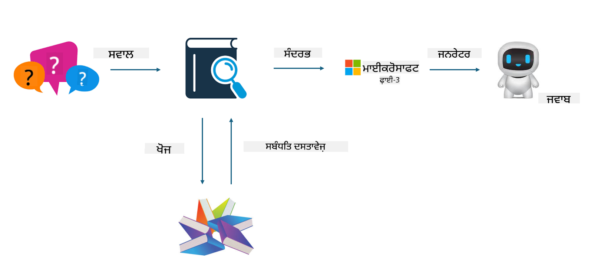

<!--
CO_OP_TRANSLATOR_METADATA:
{
  "original_hash": "743d7e9cb9c4e8ea642d77bee657a7fa",
  "translation_date": "2025-05-09T22:25:40+00:00",
  "source_file": "md/03.FineTuning/LetPhi3gotoIndustriy.md",
  "language_code": "pa"
}
-->
# **Phi-3 ਨੂੰ ਉਦਯੋਗ ਦਾ ਮਾਹਿਰ ਬਣਾਓ**

Phi-3 ਮਾਡਲ ਨੂੰ ਕਿਸੇ ਉਦਯੋਗ ਵਿੱਚ ਲਾਗੂ ਕਰਨ ਲਈ, ਤੁਹਾਨੂੰ ਉਦਯੋਗਕ ਵਪਾਰਕ ਡੇਟਾ Phi-3 ਮਾਡਲ ਵਿੱਚ ਸ਼ਾਮਲ ਕਰਨਾ ਪੈਂਦਾ ਹੈ। ਸਾਡੇ ਕੋਲ ਦੋ ਵੱਖ-ਵੱਖ ਵਿਕਲਪ ਹਨ, ਪਹਿਲਾ RAG (Retrieval Augmented Generation) ਅਤੇ ਦੂਜਾ Fine Tuning ਹੈ।

## **RAG ਅਤੇ Fine-Tuning ਵਿੱਚ ਫਰਕ**

### **Retrieval Augmented Generation**

RAG ਡੇਟਾ ਖੋਜ + ਟੈਕਸਟ ਜਨਰੇਸ਼ਨ ਹੈ। ਉਦਯੋਗ ਦੇ ਸੰਰਚਿਤ ਅਤੇ ਅਸੰਰਚਿਤ ਡੇਟਾ ਨੂੰ ਵੈਕਟਰ ਡੇਟਾਬੇਸ ਵਿੱਚ ਸਟੋਰ ਕੀਤਾ ਜਾਂਦਾ ਹੈ। ਜਦੋਂ ਸੰਬੰਧਤ ਸਮੱਗਰੀ ਦੀ ਖੋਜ ਹੁੰਦੀ ਹੈ, ਤਾਂ ਸੰਬੰਧਤ ਸਾਰ ਅਤੇ ਸਮੱਗਰੀ ਮਿਲਾ ਕੇ ਇੱਕ ਸੰਦਰਭ ਬਣਾਇਆ ਜਾਂਦਾ ਹੈ, ਅਤੇ LLM/SLM ਦੀ ਟੈਕਸਟ ਪੂਰਨ ਕਰਨ ਦੀ ਸਮਰੱਥਾ ਨਾਲ ਮਿਲਾ ਕੇ ਸਮੱਗਰੀ ਤਿਆਰ ਕੀਤੀ ਜਾਂਦੀ ਹੈ।

### **Fine-tuning**

Fine-tuning ਕਿਸੇ ਮਾਡਲ ਦੀ ਸੁਧਾਰ 'ਤੇ ਆਧਾਰਿਤ ਹੁੰਦਾ ਹੈ। ਇਸ ਲਈ ਮਾਡਲ ਦੇ ਅਲਗੋਰਿਦਮ ਤੋਂ ਸ਼ੁਰੂਆਤ ਕਰਨ ਦੀ ਲੋੜ ਨਹੀਂ ਹੁੰਦੀ, ਪਰ ਡੇਟਾ ਨੂੰ ਲਗਾਤਾਰ ਇਕੱਠਾ ਕਰਨਾ ਪੈਂਦਾ ਹੈ। ਜੇਕਰ ਤੁਹਾਨੂੰ ਉਦਯੋਗਕ ਐਪਲੀਕੇਸ਼ਨਾਂ ਵਿੱਚ ਹੋਰ ਸਹੀ ਟਰਮੀਨੋਲੋਜੀ ਅਤੇ ਭਾਸ਼ਾ ਦੀ ਲੋੜ ਹੈ, ਤਾਂ fine-tuning ਬਿਹਤਰ ਵਿਕਲਪ ਹੈ। ਪਰ ਜੇ ਡੇਟਾ ਬਹੁਤ ਵਾਰੀ ਬਦਲਦਾ ਹੈ, ਤਾਂ fine-tuning ਜਟਿਲ ਹੋ ਸਕਦਾ ਹੈ।

### **ਕਿਵੇਂ ਚੁਣਣਾ ਹੈ**

1. ਜੇ ਸਾਡੇ ਜਵਾਬ ਵਿੱਚ ਬਾਹਰੀ ਡੇਟਾ ਸ਼ਾਮਲ ਕਰਨ ਦੀ ਲੋੜ ਹੈ, ਤਾਂ RAG ਸਭ ਤੋਂ ਵਧੀਆ ਚੋਣ ਹੈ।

2. ਜੇ ਤੁਹਾਨੂੰ ਸਥਿਰ ਅਤੇ ਸਹੀ ਉਦਯੋਗਕ ਗਿਆਨ ਚਾਹੀਦਾ ਹੈ, ਤਾਂ fine-tuning ਚੰਗਾ ਵਿਕਲਪ ਹੈ। RAG ਮੁੱਖ ਤੌਰ 'ਤੇ ਸੰਬੰਧਤ ਸਮੱਗਰੀ ਖਿੱਚਦਾ ਹੈ ਪਰ ਹਰ ਵਾਰੀ ਵਿਸ਼ੇਸ਼ ਜਟਿਲਤਾਵਾਂ ਨੂੰ ਪੂਰਾ ਨਹੀਂ ਕਰ ਸਕਦਾ।

3. Fine-tuning ਲਈ ਉੱਚ ਗੁਣਵੱਤਾ ਵਾਲਾ ਡੇਟਾ ਸੈੱਟ ਚਾਹੀਦਾ ਹੈ, ਅਤੇ ਜੇ ਇਹ ਸਿਰਫ ਛੋਟੇ ਖੇਤਰ ਦਾ ਡੇਟਾ ਹੈ, ਤਾਂ ਵੱਡਾ ਫਰਕ ਨਹੀਂ ਪੈਂਦਾ। RAG ਜ਼ਿਆਦਾ ਲਚਕੀਲਾ ਹੈ।

4. Fine-tuning ਇੱਕ ਕਾਲਾ ਬਕਸਾ ਹੈ, ਇੱਕ ਮੈਟਾਫਿਜ਼ਿਕਸ, ਅਤੇ ਇਸ ਦਾ ਅੰਦਰੂਨੀ ਤਰਕੀਬ ਸਮਝਣਾ ਮੁਸ਼ਕਲ ਹੈ। ਪਰ RAG ਡੇਟਾ ਦੇ ਸਰੋਤ ਨੂੰ ਲੱਭਣਾ ਆਸਾਨ ਬਣਾਉਂਦਾ ਹੈ, ਜਿਸ ਨਾਲ ਹਲੂਸੀਨੇਸ਼ਨ ਜਾਂ ਸਮੱਗਰੀ ਦੀਆਂ ਗਲਤੀਆਂ ਨੂੰ ਪ੍ਰਭਾਵਸ਼ਾਲੀ ਤਰੀਕੇ ਨਾਲ ਠੀਕ ਕੀਤਾ ਜਾ ਸਕਦਾ ਹੈ ਅਤੇ ਵਧੀਆ ਪਾਰਦਰਸ਼ਤਾ ਮਿਲਦੀ ਹੈ।

### **ਪਰਿਸਥਿਤੀਆਂ**

1. ਖਾਸ ਉਦਯੋਗਾਂ ਨੂੰ ਵਿਸ਼ੇਸ਼ ਪੇਸ਼ਾਵਰ ਸ਼ਬਦਾਵਲੀ ਅਤੇ ਅਭਿਵਿਅਕਤੀਆਂ ਦੀ ਲੋੜ ਹੁੰਦੀ ਹੈ, ***Fine-tuning*** ਸਭ ਤੋਂ ਵਧੀਆ ਚੋਣ ਹੈ।

2. QA ਸਿਸਟਮ, ਜੋ ਵੱਖ-ਵੱਖ ਗਿਆਨ ਬਿੰਦੂਆਂ ਦੀ ਸੰਸ਼ਲੇਸ਼ਣ ਨਾਲ ਸੰਬੰਧਿਤ ਹੈ, ***RAG*** ਸਭ ਤੋਂ ਵਧੀਆ ਚੋਣ ਹੈ।

3. ਆਟੋਮੇਟਿਕ ਵਪਾਰਕ ਪ੍ਰਵਾਹ ਦੇ ਸੰਯੋਜਨ ਲਈ ***RAG + Fine-tuning*** ਸਭ ਤੋਂ ਵਧੀਆ ਚੋਣ ਹੈ।

## **RAG ਦਾ ਕਿਵੇਂ ਇਸਤੇਮਾਲ ਕਰੀਏ**

ਵੈਕਟਰ ਡੇਟਾਬੇਸ ਡੇਟਾ ਦਾ ਇੱਕ ਸਮੂਹ ਹੁੰਦਾ ਹੈ ਜੋ ਗਣਿਤੀ ਰੂਪ ਵਿੱਚ ਸਟੋਰ ਕੀਤਾ ਜਾਂਦਾ ਹੈ। ਵੈਕਟਰ ਡੇਟਾਬੇਸ ਮਸ਼ੀਨ ਲਰਨਿੰਗ ਮਾਡਲਾਂ ਲਈ ਪਿਛਲੇ ਇਨਪੁੱਟ ਨੂੰ ਯਾਦ ਰੱਖਣਾ ਆਸਾਨ ਬਣਾਉਂਦਾ ਹੈ, ਜਿਸ ਨਾਲ ਮਸ਼ੀਨ ਲਰਨਿੰਗ ਨੂੰ ਖੋਜ, ਸਿਫਾਰਸ਼ਾਂ ਅਤੇ ਟੈਕਸਟ ਜਨਰੇਸ਼ਨ ਵਰਗੇ ਕੇਸਾਂ ਵਿੱਚ ਸਹਾਇਤਾ ਲਈ ਵਰਤਿਆ ਜਾ ਸਕਦਾ ਹੈ। ਡੇਟਾ ਨੂੰ ਸਹੀ ਮੇਲ ਦੇ ਬਜਾਏ ਸਮਾਨਤਾ ਮੈਟਰਿਕਸ ਦੇ ਆਧਾਰ 'ਤੇ ਪਛਾਣਿਆ ਜਾ ਸਕਦਾ ਹੈ, ਜਿਸ ਨਾਲ ਕੰਪਿਊਟਰ ਮਾਡਲ ਡੇਟਾ ਦੇ ਸੰਦਰਭ ਨੂੰ ਸਮਝ ਸਕਦੇ ਹਨ।

ਵੈਕਟਰ ਡੇਟਾਬੇਸ RAG ਨੂੰ ਸਫਲ ਬਣਾਉਣ ਦੀ ਕੁੰਜੀ ਹੈ। ਅਸੀਂ ਟੈਕਸਟ-ਐਮਬੈਡਿੰਗ-3, jina-ai-embedding ਆਦਿ ਵੈਕਟਰ ਮਾਡਲਾਂ ਰਾਹੀਂ ਡੇਟਾ ਨੂੰ ਵੈਕਟਰ ਸਟੋਰੇਜ ਵਿੱਚ ਬਦਲ ਸਕਦੇ ਹਾਂ।

RAG ਐਪਲੀਕੇਸ਼ਨ ਬਣਾਉਣ ਬਾਰੇ ਹੋਰ ਜਾਣਕਾਰੀ ਲਈ ਵੇਖੋ [https://github.com/microsoft/Phi-3CookBook](https://github.com/microsoft/Phi-3CookBook?WT.mc_id=aiml-138114-kinfeylo)

## **Fine-tuning ਦਾ ਕਿਵੇਂ ਇਸਤੇਮਾਲ ਕਰੀਏ**

Fine-tuning ਵਿੱਚ ਆਮ ਤੌਰ 'ਤੇ ਵਰਤੇ ਜਾਣ ਵਾਲੇ ਅਲਗੋਰਿਦਮ Lora ਅਤੇ QLora ਹਨ। ਕਿਵੇਂ ਚੁਣਣਾ ਹੈ?
- [ਇਸ ਸੈਂਪਲ ਨੋਟਬੁੱਕ ਨਾਲ ਹੋਰ ਜਾਣੋ](../../../../code/04.Finetuning/Phi_3_Inference_Finetuning.ipynb)
- [Python FineTuning ਸੈਂਪਲ ਦਾ ਉਦਾਹਰਨ](../../../../code/04.Finetuning/FineTrainingScript.py)

### **Lora ਅਤੇ QLora**

LoRA (Low-Rank Adaptation) ਅਤੇ QLoRA (Quantized Low-Rank Adaptation) ਦੋਹਾਂ ਤਕਨੀਕਾਂ ਹਨ ਜੋ Parameter Efficient Fine Tuning (PEFT) ਦੀ ਵਰਤੋਂ ਕਰਕੇ ਵੱਡੇ ਭਾਸ਼ਾ ਮਾਡਲਾਂ (LLMs) ਨੂੰ fine-tune ਕਰਨ ਲਈ ਵਰਤੀਆਂ ਜਾਂਦੀਆਂ ਹਨ। PEFT ਤਕਨੀਕਾਂ ਮਾਡਲਾਂ ਨੂੰ ਪਰੰਪਰਾਗਤ ਤਰੀਕਿਆਂ ਨਾਲੋਂ ਜ਼ਿਆਦਾ ਕੁਸ਼ਲਤਾ ਨਾਲ ਟ੍ਰੇਨ ਕਰਨ ਲਈ ਡਿਜ਼ਾਇਨ ਕੀਤੀਆਂ ਗਈਆਂ ਹਨ।  
LoRA ਇੱਕ ਖ਼ੁਦਮੁਖਤਿਆਰ fine-tuning ਤਕਨੀਕ ਹੈ ਜੋ ਵਜ਼ਨ ਅਪਡੇਟ ਮੈਟ੍ਰਿਕਸ 'ਤੇ low-rank ਅਨੁਮਾਨ ਲਗਾ ਕੇ ਮੈਮੋਰੀ ਦੀ ਖਪਤ ਘਟਾਉਂਦੀ ਹੈ। ਇਹ ਤੇਜ਼ ਟ੍ਰੇਨਿੰਗ ਸਮਾਂ ਦਿੰਦੀ ਹੈ ਅਤੇ ਪਰੰਪਰਾਗਤ fine-tuning ਤਰੀਕਿਆਂ ਦੇ ਨੇੜੇ ਪ੍ਰਦਰਸ਼ਨ ਰੱਖਦੀ ਹੈ।

QLoRA LoRA ਦਾ ਇੱਕ ਵਧਿਆਤਮ ਸੰਸਕਰਣ ਹੈ ਜੋ ਮੈਮੋਰੀ ਦੀ ਵਰਤੋਂ ਹੋਰ ਘਟਾਉਣ ਲਈ ਕੁਆੰਟਾਈਜ਼ੇਸ਼ਨ ਤਕਨੀਕਾਂ ਸ਼ਾਮਲ ਕਰਦਾ ਹੈ। QLoRA ਪ੍ਰੀ-ਟ੍ਰੇਨ ਕੀਤੇ LLM ਦੇ ਵਜ਼ਨ ਪੈਰਾਮੀਟਰਾਂ ਦੀ ਸ਼ੁੱਧਤਾ ਨੂੰ 4-ਬਿੱਟ ਪ੍ਰੀਸੀਜ਼ਨ 'ਤੇ ਕੁਆੰਟਾਈਜ਼ ਕਰਦਾ ਹੈ, ਜੋ LoRA ਨਾਲੋਂ ਜ਼ਿਆਦਾ ਮੈਮੋਰੀ ਕੁਸ਼ਲ ਹੈ। ਹਾਲਾਂਕਿ, QLoRA ਦੀ ਟ੍ਰੇਨਿੰਗ LoRA ਨਾਲੋਂ ਲਗਭਗ 30% ਧੀਮੀ ਹੁੰਦੀ ਹੈ ਕਿਉਂਕਿ ਇਸ ਵਿੱਚ ਵਾਧੂ ਕੁਆੰਟਾਈਜ਼ੇਸ਼ਨ ਅਤੇ ਡੀਕੁਆੰਟਾਈਜ਼ੇਸ਼ਨ ਕਦਮ ਸ਼ਾਮਲ ਹਨ।

QLoRA LoRA ਨੂੰ ਇੱਕ ਸਹਾਇਕ ਵਜੋਂ ਵਰਤਦਾ ਹੈ ਤਾਂ ਜੋ ਕੁਆੰਟਾਈਜ਼ੇਸ਼ਨ ਦੌਰਾਨ ਪੈਦਾ ਹੋਏ ਗਲਤੀਆਂ ਨੂੰ ਠੀਕ ਕੀਤਾ ਜਾ ਸਕੇ। QLoRA ਛੋਟੇ, ਆਸਾਨੀ ਨਾਲ ਉਪਲਬਧ GPU 'ਤੇ ਬਿਲੀਅਨ ਪੈਰਾਮੀਟਰ ਵਾਲੇ ਵੱਡੇ ਮਾਡਲਾਂ ਨੂੰ fine-tune ਕਰਨ ਯੋਗ ਬਣਾਉਂਦਾ ਹੈ। ਉਦਾਹਰਨ ਵਜੋਂ, QLoRA 70B ਪੈਰਾਮੀਟਰ ਮਾਡਲ ਨੂੰ ਜੋ 36 GPU ਦੀ ਲੋੜ ਹੁੰਦੀ ਹੈ, ਸਿਰਫ 2 GPU ਨਾਲ fine-tune ਕਰ ਸਕਦਾ ਹੈ।

**ਡਿਸਕਲੇਮਰ**:  
ਇਹ ਦਸਤਾਵੇਜ਼ AI ਅਨੁਵਾਦ ਸੇਵਾ [Co-op Translator](https://github.com/Azure/co-op-translator) ਦੀ ਵਰਤੋਂ ਕਰਕੇ ਅਨੁਵਾਦ ਕੀਤਾ ਗਿਆ ਹੈ। ਜਦੋਂ ਕਿ ਅਸੀਂ ਸਹੀਅਤ ਲਈ ਕੋਸ਼ਿਸ਼ ਕਰਦੇ ਹਾਂ, ਕਿਰਪਾ ਕਰਕੇ ਧਿਆਨ ਵਿੱਚ ਰੱਖੋ ਕਿ ਸਵੈਚਾਲਿਤ ਅਨੁਵਾਦਾਂ ਵਿੱਚ ਗਲਤੀਆਂ ਜਾਂ ਅਣਸਹੀਤੀਆਂ ਹੋ ਸਕਦੀਆਂ ਹਨ। ਮੂਲ ਦਸਤਾਵੇਜ਼ ਆਪਣੇ ਮੂਲ ਭਾਸ਼ਾ ਵਿੱਚ ਪ੍ਰਮਾਣਿਕ ਸਰੋਤ ਮੰਨਿਆ ਜਾਣਾ ਚਾਹੀਦਾ ਹੈ। ਮਹੱਤਵਪੂਰਨ ਜਾਣਕਾਰੀ ਲਈ, ਪੇਸ਼ੇਵਰ ਮਨੁੱਖੀ ਅਨੁਵਾਦ ਦੀ ਸਿਫਾਰਸ਼ ਕੀਤੀ ਜਾਂਦੀ ਹੈ। ਅਸੀਂ ਇਸ ਅਨੁਵਾਦ ਦੀ ਵਰਤੋਂ ਨਾਲ ਹੋਣ ਵਾਲੀਆਂ ਕਿਸੇ ਵੀ ਗਲਤਫਹਿਮੀਆਂ ਜਾਂ ਗਲਤ ਵਿਆਖਿਆਵਾਂ ਲਈ ਜ਼ਿੰਮੇਵਾਰ ਨਹੀਂ ਹਾਂ।