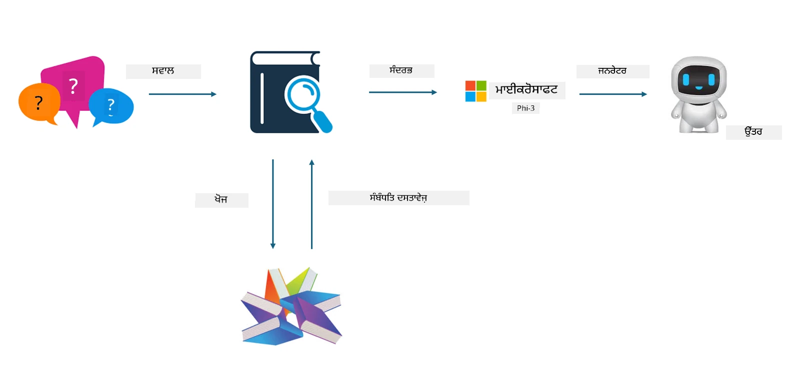
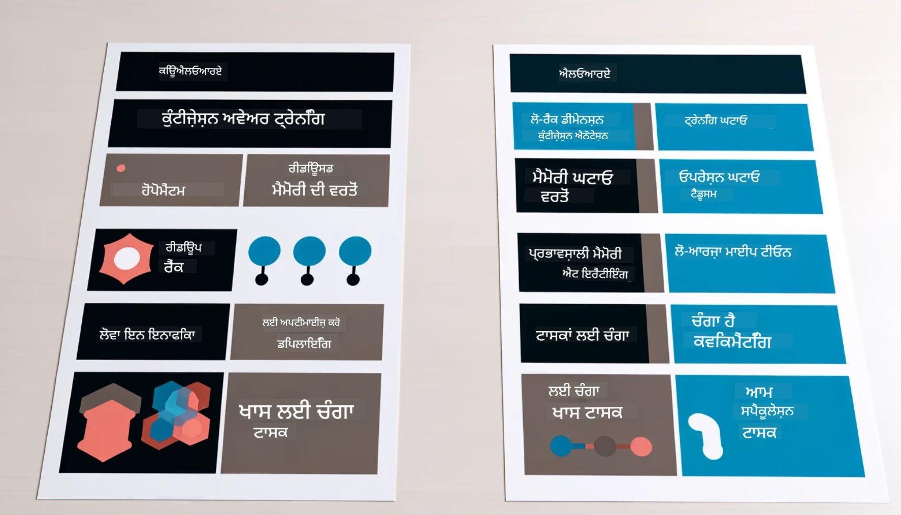

<!--
CO_OP_TRANSLATOR_METADATA:
{
  "original_hash": "743d7e9cb9c4e8ea642d77bee657a7fa",
  "translation_date": "2025-07-17T09:55:10+00:00",
  "source_file": "md/03.FineTuning/LetPhi3gotoIndustriy.md",
  "language_code": "pa"
}
-->
# **Phi-3 ਨੂੰ ਉਦਯੋਗ ਦਾ ਮਾਹਿਰ ਬਣਾਓ**

Phi-3 ਮਾਡਲ ਨੂੰ ਕਿਸੇ ਉਦਯੋਗ ਵਿੱਚ ਲਾਗੂ ਕਰਨ ਲਈ, ਤੁਹਾਨੂੰ ਉਦਯੋਗ ਦੇ ਕਾਰੋਬਾਰੀ ਡੇਟਾ ਨੂੰ Phi-3 ਮਾਡਲ ਵਿੱਚ ਸ਼ਾਮਲ ਕਰਨਾ ਪੈਂਦਾ ਹੈ। ਸਾਡੇ ਕੋਲ ਦੋ ਵੱਖ-ਵੱਖ ਵਿਕਲਪ ਹਨ, ਪਹਿਲਾ RAG (Retrieval Augmented Generation) ਹੈ ਅਤੇ ਦੂਜਾ Fine Tuning।

## **RAG ਅਤੇ Fine-Tuning ਵਿੱਚ ਫਰਕ**

### **Retrieval Augmented Generation**

RAG ਡੇਟਾ ਰੀਟਰੀਵਲ ਅਤੇ ਟੈਕਸਟ ਜਨਰੇਸ਼ਨ ਦਾ ਮਿਲਾਪ ਹੈ। ਉਦਯੋਗ ਦੇ ਸੰਰਚਿਤ ਅਤੇ ਅਸੰਰਚਿਤ ਡੇਟਾ ਨੂੰ ਵੈਕਟਰ ਡੇਟਾਬੇਸ ਵਿੱਚ ਸਟੋਰ ਕੀਤਾ ਜਾਂਦਾ ਹੈ। ਜਦੋਂ ਸਬੰਧਤ ਸਮੱਗਰੀ ਦੀ ਖੋਜ ਕੀਤੀ ਜਾਂਦੀ ਹੈ, ਤਾਂ ਸਬੰਧਤ ਸੰਖੇਪ ਅਤੇ ਸਮੱਗਰੀ ਮਿਲ ਕੇ ਇੱਕ ਸੰਦਰਭ ਬਣਾਉਂਦੇ ਹਨ, ਅਤੇ LLM/SLM ਦੀ ਟੈਕਸਟ ਪੂਰਨਤਾ ਸਮਰੱਥਾ ਨਾਲ ਮਿਲ ਕੇ ਸਮੱਗਰੀ ਤਿਆਰ ਕੀਤੀ ਜਾਂਦੀ ਹੈ।

### **Fine-tuning**

Fine-tuning ਕਿਸੇ ਮਾਡਲ ਵਿੱਚ ਸੁਧਾਰ ਕਰਨ ਦੀ ਪ੍ਰਕਿਰਿਆ ਹੈ। ਇਸ ਲਈ ਮਾਡਲ ਅਲਗੋਰਿਦਮ ਤੋਂ ਸ਼ੁਰੂਆਤ ਕਰਨ ਦੀ ਲੋੜ ਨਹੀਂ ਹੁੰਦੀ, ਪਰ ਡੇਟਾ ਨੂੰ ਲਗਾਤਾਰ ਇਕੱਠਾ ਕਰਨਾ ਪੈਂਦਾ ਹੈ। ਜੇ ਤੁਸੀਂ ਉਦਯੋਗਿਕ ਐਪਲੀਕੇਸ਼ਨਾਂ ਵਿੱਚ ਵਧੇਰੇ ਸਹੀ ਟਰਮੀਨੋਲੋਜੀ ਅਤੇ ਭਾਸ਼ਾ ਪ੍ਰਗਟਾਵਾ ਚਾਹੁੰਦੇ ਹੋ, ਤਾਂ Fine-tuning ਤੁਹਾਡੇ ਲਈ ਵਧੀਆ ਵਿਕਲਪ ਹੈ। ਪਰ ਜੇ ਤੁਹਾਡਾ ਡੇਟਾ ਬਾਰ-ਬਾਰ ਬਦਲਦਾ ਰਹਿੰਦਾ ਹੈ, ਤਾਂ Fine-tuning ਮੁਸ਼ਕਲ ਹੋ ਸਕਦਾ ਹੈ।

### **ਕਿਵੇਂ ਚੁਣਨਾ ਹੈ**

1. ਜੇ ਸਾਡੇ ਜਵਾਬ ਲਈ ਬਾਹਰੀ ਡੇਟਾ ਦੀ ਲੋੜ ਹੈ, ਤਾਂ RAG ਸਭ ਤੋਂ ਵਧੀਆ ਚੋਣ ਹੈ।

2. ਜੇ ਤੁਹਾਨੂੰ ਸਥਿਰ ਅਤੇ ਸਹੀ ਉਦਯੋਗਿਕ ਗਿਆਨ ਦੀ ਲੋੜ ਹੈ, ਤਾਂ Fine-tuning ਚੰਗਾ ਵਿਕਲਪ ਹੈ। RAG ਸਬੰਧਤ ਸਮੱਗਰੀ ਖਿੱਚਣ ਨੂੰ ਤਰਜੀਹ ਦਿੰਦਾ ਹੈ ਪਰ ਹਰ ਵਾਰੀ ਵਿਸ਼ੇਸ਼ ਤਫਸੀਲਾਂ ਨੂੰ ਪੂਰੀ ਤਰ੍ਹਾਂ ਕਵਰ ਨਹੀਂ ਕਰ ਸਕਦਾ।

3. Fine-tuning ਲਈ ਉੱਚ ਗੁਣਵੱਤਾ ਵਾਲਾ ਡੇਟਾ ਸੈੱਟ ਲੋੜੀਂਦਾ ਹੈ, ਅਤੇ ਜੇ ਡੇਟਾ ਸਿਰਫ ਛੋਟੇ ਪੱਧਰ ਦਾ ਹੈ ਤਾਂ ਇਸਦਾ ਜ਼ਿਆਦਾ ਅਸਰ ਨਹੀਂ ਪੈਂਦਾ। RAG ਜ਼ਿਆਦਾ ਲਚਕੀਲਾ ਹੈ।

4. Fine-tuning ਇੱਕ ਕਾਲਾ ਬਕਸਾ ਹੈ, ਇੱਕ ਮੈਟਾਫਿਜ਼ਿਕਸ, ਅਤੇ ਇਸਦੀ ਅੰਦਰੂਨੀ ਪ੍ਰਕਿਰਿਆ ਨੂੰ ਸਮਝਣਾ ਮੁਸ਼ਕਲ ਹੈ। ਪਰ RAG ਡੇਟਾ ਦੇ ਸਰੋਤ ਨੂੰ ਲੱਭਣਾ ਆਸਾਨ ਬਣਾਉਂਦਾ ਹੈ, ਜਿਸ ਨਾਲ ਹਲੂਸੀਨੇਸ਼ਨ ਜਾਂ ਸਮੱਗਰੀ ਦੀਆਂ ਗਲਤੀਆਂ ਨੂੰ ਪ੍ਰਭਾਵਸ਼ਾਲੀ ਤਰੀਕੇ ਨਾਲ ਠੀਕ ਕੀਤਾ ਜਾ ਸਕਦਾ ਹੈ ਅਤੇ ਵਧੀਆ ਪਾਰਦਰਸ਼ਤਾ ਮਿਲਦੀ ਹੈ।

### **ਪ੍ਰਸੰਗ**

1. ਖਾਸ ਉਦਯੋਗਾਂ ਨੂੰ ਵਿਸ਼ੇਸ਼ ਪੇਸ਼ੇਵਰ ਸ਼ਬਦਾਵਲੀ ਅਤੇ ਪ੍ਰਗਟਾਵੇ ਦੀ ਲੋੜ ਹੁੰਦੀ ਹੈ, ***Fine-tuning*** ਸਭ ਤੋਂ ਵਧੀਆ ਚੋਣ ਹੈ।

2. QA ਸਿਸਟਮ, ਜੋ ਵੱਖ-ਵੱਖ ਗਿਆਨ ਬਿੰਦੂਆਂ ਦੇ ਸੰਯੋਜਨ ਨਾਲ ਜੁੜਿਆ ਹੈ, ***RAG*** ਸਭ ਤੋਂ ਵਧੀਆ ਚੋਣ ਹੈ।

3. ਆਟੋਮੇਟਿਕ ਕਾਰੋਬਾਰੀ ਪ੍ਰਵਾਹ ਦੇ ਮਿਲਾਪ ਲਈ ***RAG + Fine-tuning*** ਸਭ ਤੋਂ ਵਧੀਆ ਚੋਣ ਹੈ।

## **RAG ਕਿਵੇਂ ਵਰਤਣਾ ਹੈ**

ਵੈਕਟਰ ਡੇਟਾਬੇਸ ਡੇਟਾ ਦਾ ਇੱਕ ਸੰਗ੍ਰਹਿ ਹੈ ਜੋ ਗਣਿਤੀ ਰੂਪ ਵਿੱਚ ਸਟੋਰ ਕੀਤਾ ਜਾਂਦਾ ਹੈ। ਵੈਕਟਰ ਡੇਟਾਬੇਸ ਮਸ਼ੀਨ ਲਰਨਿੰਗ ਮਾਡਲਾਂ ਲਈ ਪਿਛਲੇ ਇਨਪੁੱਟ ਨੂੰ ਯਾਦ ਰੱਖਣਾ ਆਸਾਨ ਬਣਾਉਂਦੇ ਹਨ, ਜਿਸ ਨਾਲ ਮਸ਼ੀਨ ਲਰਨਿੰਗ ਨੂੰ ਖੋਜ, ਸਿਫਾਰਸ਼ਾਂ ਅਤੇ ਟੈਕਸਟ ਜਨਰੇਸ਼ਨ ਵਰਗੇ ਕੇਸਾਂ ਵਿੱਚ ਵਰਤਿਆ ਜਾ ਸਕਦਾ ਹੈ। ਡੇਟਾ ਨੂੰ ਸਹੀ ਮੇਲ ਦੇ ਬਜਾਏ ਸਮਾਨਤਾ ਮੈਟਰਿਕਸ ਦੇ ਆਧਾਰ 'ਤੇ ਪਛਾਣਿਆ ਜਾ ਸਕਦਾ ਹੈ, ਜਿਸ ਨਾਲ ਕੰਪਿਊਟਰ ਮਾਡਲ ਡੇਟਾ ਦੇ ਸੰਦਰਭ ਨੂੰ ਸਮਝ ਸਕਦੇ ਹਨ।

ਵੈਕਟਰ ਡੇਟਾਬੇਸ RAG ਨੂੰ ਸਾਕਾਰ ਕਰਨ ਦੀ ਕੁੰਜੀ ਹੈ। ਅਸੀਂ ਟੈਕਸਟ-ਐਮਬੈਡਿੰਗ-3, jina-ai-embedding ਆਦਿ ਵਰਗੇ ਵੈਕਟਰ ਮਾਡਲਾਂ ਰਾਹੀਂ ਡੇਟਾ ਨੂੰ ਵੈਕਟਰ ਸਟੋਰੇਜ ਵਿੱਚ ਬਦਲ ਸਕਦੇ ਹਾਂ।

RAG ਐਪਲੀਕੇਸ਼ਨ ਬਣਾਉਣ ਬਾਰੇ ਹੋਰ ਜਾਣਕਾਰੀ ਲਈ ਵੇਖੋ [https://github.com/microsoft/Phi-3CookBook](https://github.com/microsoft/Phi-3CookBook?WT.mc_id=aiml-138114-kinfeylo)

## **Fine-tuning ਕਿਵੇਂ ਵਰਤਣਾ ਹੈ**

Fine-tuning ਵਿੱਚ ਆਮ ਤੌਰ 'ਤੇ ਵਰਤੇ ਜਾਣ ਵਾਲੇ ਅਲਗੋਰਿਦਮ Lora ਅਤੇ QLora ਹਨ। ਕਿਵੇਂ ਚੁਣਨਾ ਹੈ?
- [ਇਸ ਸੈਂਪਲ ਨੋਟਬੁੱਕ ਨਾਲ ਹੋਰ ਸਿੱਖੋ](../../../../code/04.Finetuning/Phi_3_Inference_Finetuning.ipynb)
- [Python FineTuning ਸੈਂਪਲ ਦਾ ਉਦਾਹਰਨ](../../../../code/04.Finetuning/FineTrainingScript.py)

### **Lora ਅਤੇ QLora**

LoRA (Low-Rank Adaptation) ਅਤੇ QLoRA (Quantized Low-Rank Adaptation) ਦੋਹਾਂ ਤਕਨੀਕਾਂ ਹਨ ਜੋ Parameter Efficient Fine Tuning (PEFT) ਦੀ ਵਰਤੋਂ ਕਰਕੇ ਵੱਡੇ ਭਾਸ਼ਾਈ ਮਾਡਲਾਂ (LLMs) ਨੂੰ ਫਾਈਨ-ਟਿਊਨ ਕਰਨ ਲਈ ਵਰਤੀ ਜਾਂਦੀਆਂ ਹਨ। PEFT ਤਕਨੀਕਾਂ ਮਾਡਲਾਂ ਨੂੰ ਰਵਾਇਤੀ ਤਰੀਕਿਆਂ ਨਾਲੋਂ ਜ਼ਿਆਦਾ ਪ੍ਰਭਾਵਸ਼ਾਲੀ ਢੰਗ ਨਾਲ ਟ੍ਰੇਨ ਕਰਨ ਲਈ ਬਣਾਈਆਂ ਗਈਆਂ ਹਨ।  
LoRA ਇੱਕ ਖੁਦਮੁਖਤਿਆਰ ਫਾਈਨ-ਟਿਊਨਿੰਗ ਤਕਨੀਕ ਹੈ ਜੋ ਵਜ਼ਨ ਅਪਡੇਟ ਮੈਟ੍ਰਿਕਸ 'ਤੇ ਘੱਟ-ਰੈਂਕ ਅਨੁਮਾਨ ਲਗਾ ਕੇ ਮੈਮੋਰੀ ਦੀ ਖਪਤ ਘਟਾਉਂਦੀ ਹੈ। ਇਹ ਤੇਜ਼ ਟ੍ਰੇਨਿੰਗ ਸਮਾਂ ਦਿੰਦੀ ਹੈ ਅਤੇ ਰਵਾਇਤੀ ਫਾਈਨ-ਟਿਊਨਿੰਗ ਤਰੀਕਿਆਂ ਦੇ ਨੇੜੇ ਪ੍ਰਦਰਸ਼ਨ ਬਰਕਰਾਰ ਰੱਖਦੀ ਹੈ।

QLoRA LoRA ਦਾ ਵਧਾਇਆ ਹੋਇਆ ਸੰਸਕਰਣ ਹੈ ਜੋ ਮੈਮੋਰੀ ਦੀ ਵਰਤੋਂ ਨੂੰ ਹੋਰ ਘਟਾਉਣ ਲਈ ਕਵਾਂਟਾਈਜ਼ੇਸ਼ਨ ਤਕਨੀਕਾਂ ਨੂੰ ਸ਼ਾਮਲ ਕਰਦਾ ਹੈ। QLoRA ਪ੍ਰੀ-ਟ੍ਰੇਨਡ LLM ਵਿੱਚ ਵਜ਼ਨ ਪੈਰਾਮੀਟਰਾਂ ਦੀ ਪ੍ਰਿਸੀਜ਼ਨ ਨੂੰ 4-ਬਿਟ ਪ੍ਰਿਸੀਜ਼ਨ 'ਤੇ ਕਵਾਂਟਾਈਜ਼ ਕਰਦਾ ਹੈ, ਜੋ LoRA ਨਾਲੋਂ ਜ਼ਿਆਦਾ ਮੈਮੋਰੀ-ਦੋਸਤ ਹੈ। ਹਾਲਾਂਕਿ, QLoRA ਦੀ ਟ੍ਰੇਨਿੰਗ LoRA ਨਾਲੋਂ ਲਗਭਗ 30% ਧੀਮੀ ਹੁੰਦੀ ਹੈ ਕਿਉਂਕਿ ਇਸ ਵਿੱਚ ਵਾਧੂ ਕਵਾਂਟਾਈਜ਼ੇਸ਼ਨ ਅਤੇ ਡੀਕਵਾਂਟਾਈਜ਼ੇਸ਼ਨ ਕਦਮ ਸ਼ਾਮਲ ਹੁੰਦੇ ਹਨ।

QLoRA LoRA ਨੂੰ ਇੱਕ ਸਹਾਇਕ ਵਜੋਂ ਵਰਤਦਾ ਹੈ ਤਾਂ ਜੋ ਕਵਾਂਟਾਈਜ਼ੇਸ਼ਨ ਦੌਰਾਨ ਆਏ ਗਲਤੀਆਂ ਨੂੰ ਠੀਕ ਕੀਤਾ ਜਾ ਸਕੇ। QLoRA ਬਹੁਤ ਵੱਡੇ ਮਾਡਲਾਂ ਨੂੰ, ਜਿਨ੍ਹਾਂ ਵਿੱਚ ਅਰਬਾਂ ਪੈਰਾਮੀਟਰ ਹੁੰਦੇ ਹਨ, ਛੋਟੇ ਅਤੇ ਆਸਾਨੀ ਨਾਲ ਉਪਲਬਧ GPUs 'ਤੇ ਫਾਈਨ-ਟਿਊਨ ਕਰਨ ਯੋਗ ਬਣਾਉਂਦਾ ਹੈ। ਉਦਾਹਰਨ ਵਜੋਂ, QLoRA 70B ਪੈਰਾਮੀਟਰ ਮਾਡਲ ਨੂੰ 36 GPUs ਦੀ ਲੋੜ ਵਾਲਾ ਮਾਡਲ ਸਿਰਫ 2 GPUs ਨਾਲ ਫਾਈਨ-ਟਿਊਨ ਕਰ ਸਕਦਾ ਹੈ।

**ਅਸਵੀਕਾਰੋਪਣ**:  
ਇਹ ਦਸਤਾਵੇਜ਼ AI ਅਨੁਵਾਦ ਸੇਵਾ [Co-op Translator](https://github.com/Azure/co-op-translator) ਦੀ ਵਰਤੋਂ ਕਰਕੇ ਅਨੁਵਾਦਿਤ ਕੀਤਾ ਗਿਆ ਹੈ। ਜਦੋਂ ਕਿ ਅਸੀਂ ਸਹੀਅਤ ਲਈ ਕੋਸ਼ਿਸ਼ ਕਰਦੇ ਹਾਂ, ਕਿਰਪਾ ਕਰਕੇ ਧਿਆਨ ਰੱਖੋ ਕਿ ਸਵੈਚਾਲਿਤ ਅਨੁਵਾਦਾਂ ਵਿੱਚ ਗਲਤੀਆਂ ਜਾਂ ਅਸਮਰਥਤਾਵਾਂ ਹੋ ਸਕਦੀਆਂ ਹਨ। ਮੂਲ ਦਸਤਾਵੇਜ਼ ਆਪਣੀ ਮੂਲ ਭਾਸ਼ਾ ਵਿੱਚ ਪ੍ਰਮਾਣਿਕ ਸਰੋਤ ਮੰਨਿਆ ਜਾਣਾ ਚਾਹੀਦਾ ਹੈ। ਮਹੱਤਵਪੂਰਨ ਜਾਣਕਾਰੀ ਲਈ, ਪੇਸ਼ੇਵਰ ਮਨੁੱਖੀ ਅਨੁਵਾਦ ਦੀ ਸਿਫਾਰਸ਼ ਕੀਤੀ ਜਾਂਦੀ ਹੈ। ਅਸੀਂ ਇਸ ਅਨੁਵਾਦ ਦੀ ਵਰਤੋਂ ਤੋਂ ਉਤਪੰਨ ਕਿਸੇ ਵੀ ਗਲਤਫਹਿਮੀ ਜਾਂ ਗਲਤ ਵਿਆਖਿਆ ਲਈ ਜ਼ਿੰਮੇਵਾਰ ਨਹੀਂ ਹਾਂ।