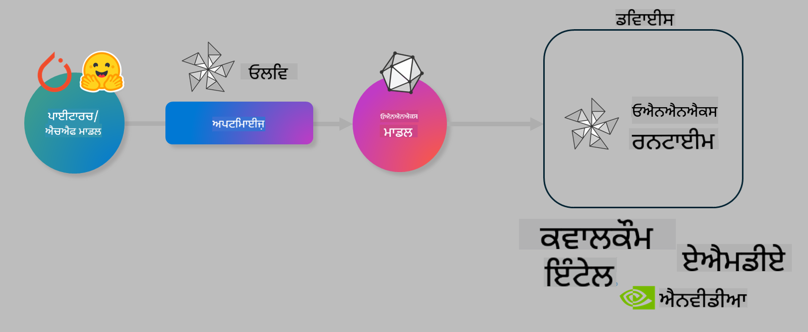

<!--
CO_OP_TRANSLATOR_METADATA:
{
  "original_hash": "6bbe47de3b974df7eea29dfeccf6032b",
  "translation_date": "2025-05-09T22:35:06+00:00",
  "source_file": "md/03.FineTuning/olive-lab/readme.md",
  "language_code": "pa"
}
-->
# Lab. Optimize AI models for on-device inference

## Introduction 

> [!IMPORTANT]
> ਇਸ ਲੈਬ ਲਈ **Nvidia A10 ਜਾਂ A100 GPU** ਅਤੇ ਸੰਬੰਧਤ ਡਰਾਈਵਰ ਅਤੇ CUDA ਟੂਲਕਿਟ (ਵਰਜ਼ਨ 12+) ਦੀ ਲੋੜ ਹੈ।

> [!NOTE]
> ਇਹ ਇੱਕ **35 ਮਿੰਟਾਂ ਦਾ** ਲੈਬ ਹੈ ਜੋ ਤੁਹਾਨੂੰ OLIVE ਦੀ ਵਰਤੋਂ ਕਰਕੇ on-device inference ਲਈ ਮਾਡਲਾਂ ਨੂੰ optimize ਕਰਨ ਦੇ ਮੁੱਖ ਅਸੂਲਾਂ ਦੀ ਹੱਥ-ਅਨੁਭਵ ਜਾਣਕਾਰੀ ਦੇਵੇਗਾ।

## Learning Objectives

ਇਸ ਲੈਬ ਦੇ ਅੰਤ ਤੱਕ, ਤੁਸੀਂ OLIVE ਦੀ ਵਰਤੋਂ ਕਰਕੇ ਇਹ ਕਰ ਸਕੋਗੇ:

- AWQ quantization ਤਰੀਕੇ ਨਾਲ AI ਮਾਡਲ ਨੂੰ Quantize ਕਰਨਾ।
- ਕਿਸੇ ਵਿਸ਼ੇਸ਼ ਕੰਮ ਲਈ AI ਮਾਡਲ ਨੂੰ Fine-tune ਕਰਨਾ।
- ONNX Runtime 'ਤੇ ਪ੍ਰਭਾਵਸ਼ਾਲੀ on-device inference ਲਈ LoRA adapters (fine-tuned ਮਾਡਲ) ਤਿਆਰ ਕਰਨਾ।

### What is Olive

Olive (*O*NNX *live*) ਇੱਕ ਮਾਡਲ optimization ਟੂਲਕਿਟ ਹੈ ਜਿਸਦੇ ਨਾਲ CLI ਵੀ ਹੈ ਜੋ ਤੁਹਾਨੂੰ ONNX runtime +++https://onnxruntime.ai+++ ਲਈ ਗੁਣਵੱਤਾ ਅਤੇ ਪ੍ਰਦਰਸ਼ਨ ਵਾਲੇ ਮਾਡਲ ਭੇਜਣ ਦੀ ਸਹੂਲਤ ਦਿੰਦਾ ਹੈ।



Olive ਵਿੱਚ ਆਮ ਤੌਰ 'ਤੇ PyTorch ਜਾਂ Hugging Face ਮਾਡਲ ਦਾਖਲ ਹੁੰਦਾ ਹੈ ਅਤੇ ਨਤੀਜਾ ਇੱਕ optimized ONNX ਮਾਡਲ ਹੁੰਦਾ ਹੈ ਜੋ ਕਿਸੇ ਡਿਵਾਈਸ (deployment target) 'ਤੇ ਚਲਾਇਆ ਜਾਂਦਾ ਹੈ ਜੋ ONNX runtime ਚਲਾ ਰਿਹਾ ਹੁੰਦਾ ਹੈ। Olive ਮਾਡਲ ਨੂੰ deployment target ਦੇ AI accelerator (NPU, GPU, CPU) ਲਈ optimize ਕਰਦਾ ਹੈ ਜੋ Qualcomm, AMD, Nvidia ਜਾਂ Intel ਵਰਗੇ hardware vendor ਵੱਲੋਂ ਦਿੱਤਾ ਜਾਂਦਾ ਹੈ।

Olive ਇੱਕ *workflow* ਚਲਾਉਂਦਾ ਹੈ, ਜੋ ਕਿ ਕਈ model optimization ਕੰਮਾਂ ਦੀ ਲੜੀ ਹੁੰਦੀ ਹੈ ਜਿਸਨੂੰ *passes* ਕਹਿੰਦੇ ਹਨ - ਉਦਾਹਰਨ ਲਈ: model compression, graph capture, quantization, graph optimization। ਹਰ pass ਦੇ ਕੁਝ parameters ਹੁੰਦੇ ਹਨ ਜੋ metrics ਜਿਵੇਂ ਕਿ accuracy ਅਤੇ latency ਨੂੰ ਵਧੀਆ ਬਣਾਉਣ ਲਈ ਟਿਊਨ ਕੀਤੇ ਜਾ ਸਕਦੇ ਹਨ। Olive ਇੱਕ search strategy ਵਰਤਦਾ ਹੈ ਜੋ ਹਰ pass ਨੂੰ ਇੱਕ-ਇੱਕ ਕਰਕੇ ਜਾਂ ਕੁਝ passes ਨੂੰ ਇੱਕੱਠੇ auto-tune ਕਰਦਾ ਹੈ।

#### Benefits of Olive

- **ਹੱਥ-ਅਨੁਭਵ ਤਜਰਬੇ ਨਾਲ ਹੋਣ ਵਾਲੀ ਥਕਾਵਟ ਅਤੇ ਸਮਾਂ ਘਟਾਓ**। ਗੁਣਵੱਤਾ ਅਤੇ ਪ੍ਰਦਰਸ਼ਨ ਦੀਆਂ ਸ਼ਰਤਾਂ ਸੈੱਟ ਕਰੋ ਅਤੇ Olive ਆਪ ਹੀ ਤੁਹਾਡੇ ਲਈ ਸਭ ਤੋਂ ਵਧੀਆ ਮਾਡਲ ਲੱਭੇਗਾ।
- **40+ built-in model optimization components** ਜੋ quantization, compression, graph optimization ਅਤੇ finetuning ਵਿੱਚ ਅੱਗੇ ਹਨ।
- **ਆਸਾਨ CLI** ਆਮ model optimization ਕੰਮਾਂ ਲਈ। ਉਦਾਹਰਨ ਲਈ, olive quantize, olive auto-opt, olive finetune।
- ਮਾਡਲ ਪੈਕੇਜਿੰਗ ਅਤੇ deployment built-in।
- **Multi LoRA serving** ਲਈ ਮਾਡਲ ਤਿਆਰ ਕਰਨ ਦੀ ਸਮਰੱਥਾ।
- YAML/JSON ਨਾਲ workflows ਬਣਾਓ ਜੋ model optimization ਅਤੇ deployment ਕੰਮਾਂ ਨੂੰ ਆਯੋਜਿਤ ਕਰਦੇ ਹਨ।
- **Hugging Face** ਅਤੇ **Azure AI** ਇੰਟਿਗ੍ਰੇਸ਼ਨ।
- ਖਰਚ ਬਚਾਉਣ ਲਈ built-in **caching** ਮਕੈਨਿਜ਼ਮ।

## Lab Instructions
> [!NOTE]
> ਕਿਰਪਾ ਕਰਕੇ ਯਕੀਨੀ ਬਣਾਓ ਕਿ ਤੁਸੀਂ ਆਪਣਾ Azure AI Hub ਅਤੇ Project ਪ੍ਰੋਵਿਜ਼ਨ ਕੀਤਾ ਹੈ ਅਤੇ Lab 1 ਅਨੁਸਾਰ ਆਪਣਾ A100 compute ਸੈੱਟਅੱਪ ਕੀਤਾ ਹੈ।

### Step 0: Connect to your Azure AI Compute

ਤੁਸੀਂ VS Code ਦੀ remote ਫੀਚਰ ਦੀ ਵਰਤੋਂ ਕਰਕੇ Azure AI compute ਨਾਲ ਜੁੜੋਗੇ।

1. ਆਪਣੀ **VS Code** ਡੈਸਕਟਾਪ ਐਪ ਖੋਲ੍ਹੋ:
1. **Shift+Ctrl+P** ਨਾਲ **command palette** ਖੋਲ੍ਹੋ
1. command palette ਵਿੱਚ ਖੋਜੋ **AzureML - remote: Connect to compute instance in New Window**।
1. ਸਕ੍ਰੀਨ 'ਤੇ ਦਿੱਤੇ ਹੁਕਮਾਂ ਦੀ ਪਾਲਣਾ ਕਰਦੇ ਹੋਏ Compute ਨਾਲ ਜੁੜੋ। ਇਸ ਵਿੱਚ ਤੁਹਾਡੀ Azure Subscription, Resource Group, Project ਅਤੇ Lab 1 ਵਿੱਚ ਸੈੱਟ ਕੀਤਾ Compute ਨਾਮ ਚੁਣਨਾ ਸ਼ਾਮਲ ਹੈ।
1. ਜਦੋਂ ਤੁਸੀਂ Azure ML Compute node ਨਾਲ ਜੁੜ ਜਾਵੋਗੇ ਤਾਂ ਇਹ Visual Code ਦੇ **ਥੱਲੇ ਖੱਬੇ ਕੋਨੇ** ਵਿੱਚ ਦਿਖਾਈ ਦੇਵੇਗਾ `><Azure ML: Compute Name`

### Step 1: Clone this repo

VS Code ਵਿੱਚ, **Ctrl+J** ਨਾਲ ਨਵਾਂ ਟਰਮੀਨਲ ਖੋਲ੍ਹੋ ਅਤੇ ਇਸ repo ਨੂੰ clone ਕਰੋ:

ਟਰਮੀਨਲ ਵਿੱਚ ਤੁਸੀਂ prompt ਵੇਖੋਗੇ

```
azureuser@computername:~/cloudfiles/code$ 
```
ਸੋਲੂਸ਼ਨ ਨੂੰ ਕਲੋਨ ਕਰੋ

```bash
cd ~/localfiles
git clone https://github.com/microsoft/phi-3cookbook.git
```

### Step 2: Open Folder in VS Code

ਟਰਮੀਨਲ ਵਿੱਚ ਹੇਠਾਂ ਦਿੱਤਾ ਕਮਾਂਡ ਚਲਾਓ, ਜੋ ਨਵੀਂ ਵਿੰਡੋ ਵਿੱਚ VS Code ਖੋਲ੍ਹੇਗੀ:

```bash
code phi-3cookbook/code/04.Finetuning/Olive-lab
```

ਵਿਕਲਪ ਵਜੋਂ, ਤੁਸੀਂ **File** > **Open Folder** ਚੁਣ ਕੇ ਵੀ ਫੋਲਡਰ ਖੋਲ੍ਹ ਸਕਦੇ ਹੋ।

### Step 3: Dependencies

VS Code ਵਿੱਚ ਆਪਣੇ Azure AI Compute Instance 'ਚ ਇੱਕ ਟਰਮੀਨਲ ਖੋਲ੍ਹੋ (ਸੁਝਾਅ: **Ctrl+J**) ਅਤੇ dependencies ਇੰਸਟਾਲ ਕਰਨ ਲਈ ਹੇਠਾਂ ਦਿੱਤੀਆਂ ਕਮਾਂਡਾਂ ਚਲਾਓ:

```bash
conda create -n olive-ai python=3.11 -y
conda activate olive-ai
pip install -r requirements.txt
az extension remove -n azure-cli-ml
az extension add -n ml
```

> [!NOTE]
> ਸਾਰੇ dependencies ਇੰਸਟਾਲ ਕਰਨ ਵਿੱਚ ਲਗਭਗ 5 ਮਿੰਟ ਲੱਗਣਗੇ।

ਇਸ ਲੈਬ ਵਿੱਚ ਤੁਸੀਂ ਮਾਡਲ Azure AI Model ਕੈਟਲੌਗ ਵਿੱਚ ਡਾਊਨਲੋਡ ਅਤੇ ਅਪਲੋਡ ਕਰੋਗੇ। ਮਾਡਲ ਕੈਟਲੌਗ ਤੱਕ ਪਹੁੰਚ ਲਈ, ਤੁਹਾਨੂੰ Azure ਵਿੱਚ ਲੌਗਿਨ ਕਰਨਾ ਪਵੇਗਾ:

```bash
az login
```

> [!NOTE]
> ਲੌਗਿਨ ਸਮੇਂ ਤੁਹਾਨੂੰ ਆਪਣੀ subscription ਚੁਣਣ ਲਈ ਕਿਹਾ ਜਾਵੇਗਾ। ਯਕੀਨੀ ਬਣਾਓ ਕਿ ਤੁਸੀਂ ਇਸ ਲੈਬ ਲਈ ਦਿੱਤੀ subscription ਚੁਣੀ ਹੈ।

### Step 4: Execute Olive commands 

VS Code ਵਿੱਚ Azure AI Compute Instance 'ਚ ਟਰਮੀਨਲ ਖੋਲ੍ਹੋ (ਸੁਝਾਅ: **Ctrl+J**) ਅਤੇ ਯਕੀਨੀ ਬਣਾਓ ਕਿ `olive-ai` conda environment ਐਕਟੀਵੇਟ ਹੈ:

```bash
conda activate olive-ai
```

ਫਿਰ ਹੇਠਾਂ ਦਿੱਤੀਆਂ Olive ਕਮਾਂਡਾਂ ਚਲਾਓ:

1. **ਡਾਟਾ ਦੀ ਜਾਂਚ ਕਰੋ:** ਇਸ ਉਦਾਹਰਨ ਵਿੱਚ, ਤੁਸੀਂ Phi-3.5-Mini ਮਾਡਲ ਨੂੰ fine-tune ਕਰ ਰਹੇ ਹੋ ਤਾਂ ਜੋ ਇਹ ਯਾਤਰਾ ਨਾਲ ਸੰਬੰਧਿਤ ਸਵਾਲਾਂ ਦੇ ਜਵਾਬ ਦੇਣ ਵਿੱਚ ਮਾਹਿਰ ਹੋ ਜਾਵੇ। ਹੇਠਾਂ ਦਿੱਤਾ ਕੋਡ dataset ਦੇ ਪਹਿਲੇ ਕੁਝ ਰਿਕਾਰਡ ਦਿਖਾਉਂਦਾ ਹੈ ਜੋ JSON lines ਫਾਰਮੈਟ ਵਿੱਚ ਹਨ:
   
    ```bash
    head data/data_sample_travel.jsonl
    ```
1. **ਮਾਡਲ ਨੂੰ Quantize ਕਰੋ:** ਮਾਡਲ ਨੂੰ train ਕਰਨ ਤੋਂ ਪਹਿਲਾਂ, ਤੁਸੀਂ ਹੇਠਾਂ ਦਿੱਤੀ ਕਮਾਂਡ ਨਾਲ Active Aware Quantization (AWQ) +++https://arxiv.org/abs/2306.00978+++ ਤਕਨੀਕ ਵਰਤ ਕੇ quantize ਕਰੋਗੇ। AWQ ਮਾਡਲ ਦੇ weights ਨੂੰ quantize ਕਰਦਾ ਹੈ ਜਿਸ ਵਿੱਚ inference ਦੌਰਾਨ ਬਣਦੇ activations ਨੂੰ ਧਿਆਨ ਵਿੱਚ ਰੱਖਿਆ ਜਾਂਦਾ ਹੈ। ਇਸਦਾ ਮਤਲਬ ਹੈ ਕਿ quantization actual data distribution ਨੂੰ ਧਿਆਨ ਵਿੱਚ ਰੱਖਦਾ ਹੈ, ਜਿਸ ਨਾਲ ਮਾਡਲ ਦੀ accuracy ਵਧੀਆ ਰਹਿੰਦੀ ਹੈ ਬਜਾਏ ਪਰੰਪਰਾਗਤ weight quantization ਤਰੀਕਿਆਂ ਦੇ।
    
    ```bash
    olive quantize \
       --model_name_or_path microsoft/Phi-3.5-mini-instruct \
       --trust_remote_code \
       --algorithm awq \
       --output_path models/phi/awq \
       --log_level 1
    ```
    
    AWQ quantization ਕਰਨ ਵਿੱਚ ਲਗਭਗ **8 ਮਿੰਟ** ਲੱਗਦੇ ਹਨ, ਜੋ ਮਾਡਲ ਦਾ ਆਕਾਰ ~7.5GB ਤੋਂ ~2.5GB ਕਰ ਦਿੰਦਾ ਹੈ।
   
   ਇਸ ਲੈਬ ਵਿੱਚ, ਅਸੀਂ ਦਿਖਾ ਰਹੇ ਹਾਂ ਕਿ ਕਿਸ ਤਰ੍ਹਾਂ Hugging Face ਤੋਂ ਮਾਡਲ ਲਿਆ ਜਾ ਸਕਦਾ ਹੈ (ਉਦਾਹਰਨ: `microsoft/Phi-3.5-mini-instruct`). However, Olive also allows you to input models from the Azure AI catalog by updating the `model_name_or_path` argument to an Azure AI asset ID (for example:  `azureml://registries/azureml/models/Phi-3.5-mini-instruct/versions/4`). 

1. **Train the model:** Next, the `olive finetune` ਕਮਾਂਡ quantized ਮਾਡਲ ਨੂੰ fine-tune ਕਰਦੀ ਹੈ। Quantize ਕਰਨ ਤੋਂ ਪਹਿਲਾਂ fine-tune ਕਰਨ ਨਾਲ accuracy ਵਧੀਆ ਹੁੰਦੀ ਹੈ ਕਿਉਂਕਿ fine-tuning quantization ਨਾਲ ਹੋਏ ਕੁਝ ਨੁਕਸਾਨ ਨੂੰ ਠੀਕ ਕਰਦਾ ਹੈ।
    
    ```bash
    olive finetune \
        --method lora \
        --model_name_or_path models/phi/awq \
        --data_files "data/data_sample_travel.jsonl" \
        --data_name "json" \
        --text_template "<|user|>\n{prompt}<|end|>\n<|assistant|>\n{response}<|end|>" \
        --max_steps 100 \
        --output_path ./models/phi/ft \
        --log_level 1
    ```
    
    Fine-tuning (100 steps) ਕਰਨ ਵਿੱਚ ਲਗਭਗ **6 ਮਿੰਟ** ਲੱਗਦੇ ਹਨ।

1. **Optimize ਕਰੋ:** ਮਾਡਲ train ਹੋਣ ਤੋਂ ਬਾਅਦ, ਤੁਸੀਂ Olive ਦੇ `auto-opt` command, which will capture the ONNX graph and automatically perform a number of optimizations to improve the model performance for CPU by compressing the model and doing fusions. It should be noted, that you can also optimize for other devices such as NPU or GPU by just updating the `--device` and `--provider` arguments ਦੀ ਵਰਤੋਂ ਕਰਕੇ ਮਾਡਲ ਨੂੰ optimize ਕਰੋਗੇ - ਪਰ ਇਸ ਲੈਬ ਲਈ ਅਸੀਂ CPU ਦੀ ਵਰਤੋਂ ਕਰਾਂਗੇ।

    ```bash
    olive auto-opt \
       --model_name_or_path models/phi/ft/model \
       --adapter_path models/phi/ft/adapter \
       --device cpu \
       --provider CPUExecutionProvider \
       --use_ort_genai \
       --output_path models/phi/onnx-ao \
       --log_level 1
    ```
    
    Optimize ਕਰਨ ਵਿੱਚ ਲਗਭਗ **5 ਮਿੰਟ** ਲੱਗਦੇ ਹਨ।

### Step 5: Model inference quick test

ਮਾਡਲ ਦੀ inference ਟੈਸਟ ਕਰਨ ਲਈ, ਆਪਣੇ ਫੋਲਡਰ ਵਿੱਚ **app.py** ਨਾਮ ਦਾ Python ਫਾਈਲ ਬਣਾਓ ਅਤੇ ਹੇਠਾਂ ਦਿੱਤਾ ਕੋਡ ਕਾਪੀ-ਪੇਸਟ ਕਰੋ:

```python
import onnxruntime_genai as og
import numpy as np

print("loading model and adapters...", end="", flush=True)
model = og.Model("models/phi/onnx-ao/model")
adapters = og.Adapters(model)
adapters.load("models/phi/onnx-ao/model/adapter_weights.onnx_adapter", "travel")
print("DONE!")

tokenizer = og.Tokenizer(model)
tokenizer_stream = tokenizer.create_stream()

params = og.GeneratorParams(model)
params.set_search_options(max_length=100, past_present_share_buffer=False)
user_input = "what is the best thing to see in chicago"
params.input_ids = tokenizer.encode(f"<|user|>\n{user_input}<|end|>\n<|assistant|>\n")

generator = og.Generator(model, params)

generator.set_active_adapter(adapters, "travel")

print(f"{user_input}")

while not generator.is_done():
    generator.compute_logits()
    generator.generate_next_token()

    new_token = generator.get_next_tokens()[0]
    print(tokenizer_stream.decode(new_token), end='', flush=True)

print("\n")
```

ਕੋਡ ਚਲਾਉਣ ਲਈ:

```bash
python app.py
```

### Step 6: Upload model to Azure AI

ਮਾਡਲ ਨੂੰ Azure AI ਮਾਡਲ ਰਿਪੋਜ਼ਿਟਰੀ ਵਿੱਚ ਅਪਲੋਡ ਕਰਨ ਨਾਲ ਮਾਡਲ ਤੁਹਾਡੇ ਵਿਕਾਸ ਟੀਮ ਦੇ ਹੋਰ ਮੈਂਬਰਾਂ ਨਾਲ ਸਾਂਝਾ ਹੋ ਸਕਦਾ ਹੈ ਅਤੇ ਮਾਡਲ ਦਾ ਵਰਜ਼ਨ ਕੰਟਰੋਲ ਵੀ ਹੁੰਦਾ ਹੈ। ਮਾਡਲ ਅਪਲੋਡ ਕਰਨ ਲਈ ਹੇਠਾਂ ਦਿੱਤੀ ਕਮਾਂਡ ਚਲਾਓ:

> [!NOTE]
> `{}` ਅਤੇ Azure AI Project ਦਾ ਨਾਮ ਅਪਡੇਟ ਕਰੋ ਅਤੇ ਹੇਠਾਂ ਦਿੱਤੀ ਕਮਾਂਡ ਚਲਾਓ

```
az ml workspace show
```

ਜਾਂ +++ai.azure.com+++ 'ਤੇ ਜਾ ਕੇ **management center** > **project** > **overview** ਚੁਣੋ।

`{}` ਵਾਲੇ placeholders ਨੂੰ ਆਪਣੇ resource group ਅਤੇ Azure AI Project Name ਨਾਲ ਅਪਡੇਟ ਕਰੋ।

```bash
az ml model create \
    --name ft-for-travel \
    --version 1 \
    --path ./models/phi/onnx-ao \
    --resource-group {RESOURCE_GROUP_NAME} \
    --workspace-name {PROJECT_NAME}
```

ਤੁਸੀਂ ਆਪਣਾ ਅਪਲੋਡ ਕੀਤਾ ਮਾਡਲ ਵੇਖ ਸਕਦੇ ਹੋ ਅਤੇ https://ml.azure.com/model/list 'ਤੇ ਆਪਣਾ ਮਾਡਲ deploy ਵੀ ਕਰ ਸਕਦੇ ਹੋ।

**ਅਸਵੀਕਾਰੋਤਾ**:  
ਇਹ ਦਸਤਾਵੇਜ਼ AI ਅਨੁਵਾਦ ਸੇਵਾ [Co-op Translator](https://github.com/Azure/co-op-translator) ਦੀ ਵਰਤੋਂ ਕਰਕੇ ਅਨੁਵਾਦ ਕੀਤਾ ਗਿਆ ਹੈ। ਜਦੋਂ ਕਿ ਅਸੀਂ ਸਹੀਅਤ ਲਈ ਕੋਸ਼ਿਸ਼ ਕਰਦੇ ਹਾਂ, ਕਿਰਪਾ ਕਰਕੇ ਧਿਆਨ ਰੱਖੋ ਕਿ ਸਵੈਚਾਲਿਤ ਅਨੁਵਾਦਾਂ ਵਿੱਚ ਗਲਤੀਆਂ ਜਾਂ ਅਸਤੀਰਤਾਵਾਂ ਹੋ ਸਕਦੀਆਂ ਹਨ। ਮੂਲ ਦਸਤਾਵੇਜ਼ ਆਪਣੀ ਮੂਲ ਭਾਸ਼ਾ ਵਿੱਚ ਹੀ ਅਧਿਕਾਰਤ ਸਰੋਤ ਮੰਨਿਆ ਜਾਣਾ ਚਾਹੀਦਾ ਹੈ। ਮਹੱਤਵਪੂਰਣ ਜਾਣਕਾਰੀ ਲਈ, ਪੇਸ਼ੇਵਰ ਮਨੁੱਖੀ ਅਨੁਵਾਦ ਦੀ ਸਿਫਾਰਿਸ਼ ਕੀਤੀ ਜਾਂਦੀ ਹੈ। ਅਸੀਂ ਇਸ ਅਨੁਵਾਦ ਦੀ ਵਰਤੋਂ ਤੋਂ ਉਤਪੰਨ ਕਿਸੇ ਵੀ ਗਲਤਫਹਿਮੀ ਜਾਂ ਗਲਤ ਸਮਝ ਲਈ ਜ਼ਿੰਮੇਵਾਰ ਨਹੀਂ ਹਾਂ।