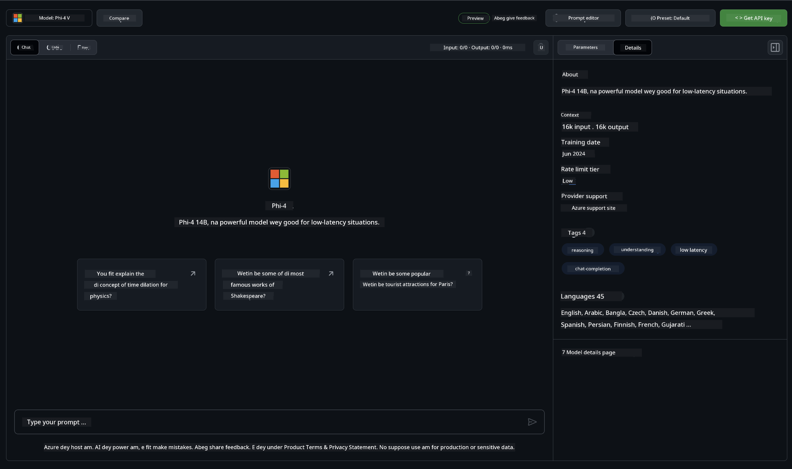

## Phi Family wey dey for GitHub Models

Welcome to [GitHub Models](https://github.com/marketplace/models) ! We don set everything, e ready make you fit explore AI Models wey dem dey host for Azure AI.


If you wan get more info about di Models wey dey for GitHub Models, check out the [GitHub Model Marketplace](https://github.com/marketplace/models)

## Models Wey Dey Available

Each model get dedicated playground and sample code 



### Phi Family wey dey for GitHub Model Catalog

- [Phi-4](https://github.com/marketplace/models/azureml/Phi-4)

- [Phi-3.5-MoE instruct (128k)](https://github.com/marketplace/models/azureml/Phi-3-5-MoE-instruct)

- [Phi-3.5-vision instruct (128k)](https://github.com/marketplace/models/azureml/Phi-3-5-vision-instruct)

- [Phi-3.5-mini instruct (128k)](https://github.com/marketplace/models/azureml/Phi-3-5-mini-instruct)

- [Phi-3-Medium-128k-Instruct](https://github.com/marketplace/models/azureml/Phi-3-medium-128k-instruct)

- [Phi-3-medium-4k-instruct](https://github.com/marketplace/models/azureml/Phi-3-medium-4k-instruct)

- [Phi-3-mini-128k-instruct](https://github.com/marketplace/models/azureml/Phi-3-mini-128k-instruct)

- [Phi-3-mini-4k-instruct](https://github.com/marketplace/models/azureml/Phi-3-mini-4k-instruct)

- [Phi-3-small-128k-instruct](https://github.com/marketplace/models/azureml/Phi-3-small-128k-instruct)

- [Phi-3-small-8k-instruct](https://github.com/marketplace/models/azureml/Phi-3-small-8k-instruct)

## Getting Started

We get small basic examples wey don ready make you run. You fit find dem for the samples directory. If you wan jump straight to your favorite language, you fit find the examples for the following Languages:

- Python
- JavaScript
- C#
- Java
- cURL

E still get dedicated Codespaces Environment to run the samples and models. 


## Sample Code 

Below na example code snippets for some use cases. For extra info about Azure AI Inference SDK, see full documentation and samples.

## Setup 

1. Create a personal access token
You no need to give any permissions to the token. Note say the token go get sent to a Microsoft service.

To use the code snippets below, create an environment variable to set your token as the key for the client code.

If you're using bash:
```
export GITHUB_TOKEN="<your-github-token-goes-here>"
```
If you're in powershell:

```
$Env:GITHUB_TOKEN="<your-github-token-goes-here>"
```

If you're using Windows command prompt:

```
set GITHUB_TOKEN=<your-github-token-goes-here>
```

## Python Sample

### Install dependencies
Install di Azure AI Inference SDK using pip (Requires: Python >=3.8):

```
pip install azure-ai-inference
```
### Run a basic code sample

Dis sample dey show one basic call to the chat completion API. E dey use the GitHub AI model inference endpoint and your GitHub token. Di call na synchronous.

```python
import os
from azure.ai.inference import ChatCompletionsClient
from azure.ai.inference.models import SystemMessage, UserMessage
from azure.core.credentials import AzureKeyCredential

endpoint = "https://models.inference.ai.azure.com"
model_name = "Phi-4"
token = os.environ["GITHUB_TOKEN"]

client = ChatCompletionsClient(
    endpoint=endpoint,
    credential=AzureKeyCredential(token),
)

response = client.complete(
    messages=[
        UserMessage(content="I have $20,000 in my savings account, where I receive a 4% profit per year and payments twice a year. Can you please tell me how long it will take for me to become a millionaire? Also, can you please explain the math step by step as if you were explaining it to an uneducated person?"),
    ],
    temperature=0.4,
    top_p=1.0,
    max_tokens=2048,
    model=model_name
)

print(response.choices[0].message.content)
```

### Run a multi-turn conversation

Dis sample dey show multi-turn conversation with the chat completion API. When you dey use the model for chat application, you go need manage the history of that conversation and send the latest messages to the model.

```
import os
from azure.ai.inference import ChatCompletionsClient
from azure.ai.inference.models import AssistantMessage, SystemMessage, UserMessage
from azure.core.credentials import AzureKeyCredential

token = os.environ["GITHUB_TOKEN"]
endpoint = "https://models.inference.ai.azure.com"
# Replace Model_Name
model_name = "Phi-4"

client = ChatCompletionsClient(
    endpoint=endpoint,
    credential=AzureKeyCredential(token),
)

messages = [
    SystemMessage(content="You are a helpful assistant."),
    UserMessage(content="What is the capital of France?"),
    AssistantMessage(content="The capital of France is Paris."),
    UserMessage(content="What about Spain?"),
]

response = client.complete(messages=messages, model=model_name)

print(response.choices[0].message.content)
```

### Stream the output

For better user experience, you go wan stream the response of the model so that the first token show early and you no go wait for long responses.

```
import os
from azure.ai.inference import ChatCompletionsClient
from azure.ai.inference.models import SystemMessage, UserMessage
from azure.core.credentials import AzureKeyCredential

token = os.environ["GITHUB_TOKEN"]
endpoint = "https://models.inference.ai.azure.com"
# Replace Model_Name
model_name = "Phi-4"

client = ChatCompletionsClient(
    endpoint=endpoint,
    credential=AzureKeyCredential(token),
)

response = client.complete(
    stream=True,
    messages=[
        SystemMessage(content="You are a helpful assistant."),
        UserMessage(content="Give me 5 good reasons why I should exercise every day."),
    ],
    model=model_name,
)

for update in response:
    if update.choices:
        print(update.choices[0].delta.content or "", end="")

client.close()
```

## FREE Usage and Rate limits for GitHub Models


The [rate limits for the playground and free API usage](https://docs.github.com/en/github-models/prototyping-with-ai-models#rate-limits) dem dey meant to help you experiment with models and prototype your AI application. If you wan use beyond those limits, and make your application scale, you must provision resources from an Azure account, and authenticate from there instead of your GitHub personal access token. You no need change anything else for your code. Use this link to see how to go beyond the free tier limits in Azure AI.


### Disclosures

Make you remember say when you dey interact with model you dey experiment with AI, so content fit get mistakes.

Di feature get various limits (including requests per minute, requests per day, tokens per request, and concurrent requests) and e no design for production use cases.

GitHub Models dey use Azure AI Content Safety. Dem filters no fit turn off as part of the GitHub Models experience. If you decide to employ models through a paid service, abeg configure your content filters make dem meet your requirements.

Dis service dey under GitHub’s Pre-release Terms.

---

<!-- CO-OP TRANSLATOR DISCLAIMER START -->
Disclaimer:
Dis document na AI translation service wey dem call Co-op Translator (https://github.com/Azure/co-op-translator) translate am. Even though we dey try make everything correct, make you sabi say automatic translation fit get mistakes or no too correct. Di original document for im original language suppose be di main source wey you trust. If na serious or important info, e better make professional human translator check am. We no go responsible for any misunderstanding or wrong interpretation wey fit come from dis translation.
<!-- CO-OP TRANSLATOR DISCLAIMER END -->