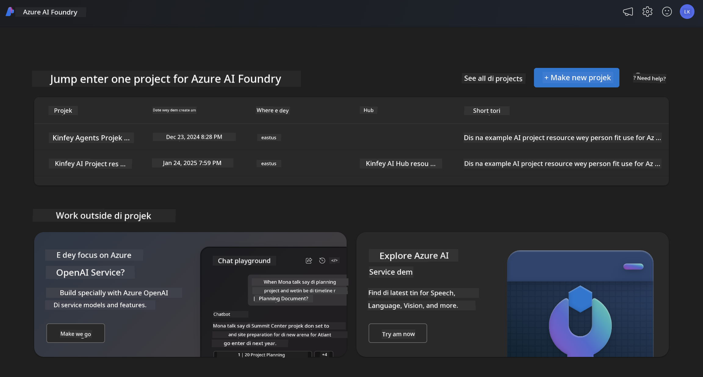
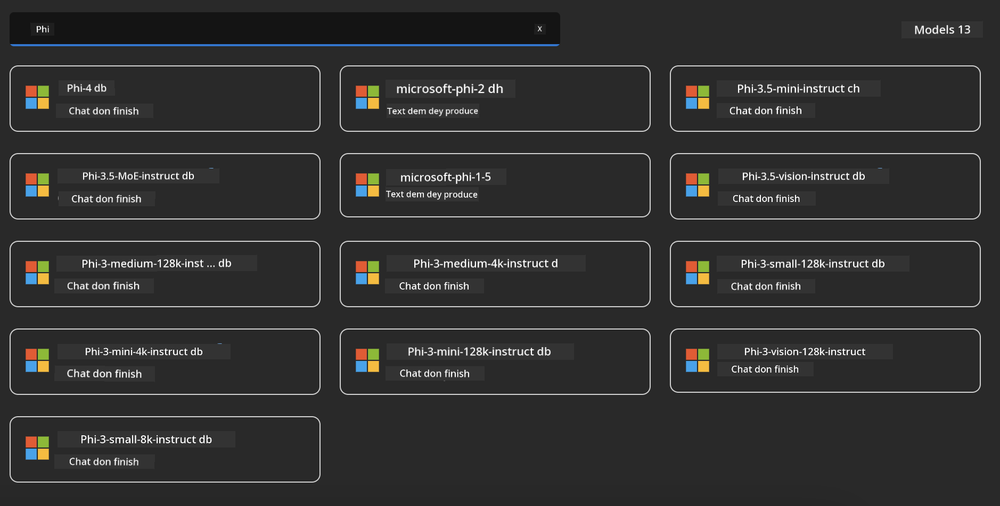

<!--
CO_OP_TRANSLATOR_METADATA:
{
  "original_hash": "3ae21dc5554e888defbe57946ee995ee",
  "translation_date": "2025-12-21T23:59:11+00:00",
  "source_file": "md/01.Introduction/02/03.AzureAIFoundry.md",
  "language_code": "pcm"
}
-->
## Phi Family for Azure AI Foundry

[Azure AI Foundry](https://ai.azure.com) na platform wey people fit trust, e dey empower developers make dem fit push innovation and shape di future wit AI for a safe, secure, and responsible way.


[Azure AI Foundry](https://ai.azure.com) dem design am for developers make dem fit:

- Build generative AI applications for enterprise-grade platform.
- Explore, build, test, and deploy using cutting-edge AI tools and ML models, wey dey grounded in responsible AI practices.
- Work together with a team for the full life-cycle of application development.

With Azure AI Foundry, you fit explore plenty different models, services and capabilities, and begin to build AI applications wey go best serve your goals. The Azure AI Foundry platform dey help scalability to turn proof-of-concepts into full-fledged production applications with ease. Continuous monitoring and refinement dey support long-term success.



In addition to using Azure AOAI Service in Azure AI Foundry, you fit also use third-party models for the Azure AI Foundry Model Catalog. Dis one good choice if you wan use Azure AI Foundry as your AI solution platform.

We fit quickly deploy Phi Family Models through the Model Catalog in Azure AI Foundry 

[Microsoft Phi Models in Azure AI Foundry Models](https://ai.azure.com/explore/models/?selectedCollection=phi)



### **Deploy Phi-4 for Azure AI Foundry**


### **Test Phi-4 for Azure AI Foundry Playground**


### **How to run Python code wey go call Azure AI Foundry Phi-4**


```python

import os  
import base64
from openai import AzureOpenAI  
from azure.identity import DefaultAzureCredential, get_bearer_token_provider  
        
endpoint = os.getenv("ENDPOINT_URL", "Your Azure AOAI Service Endpoint")  
deployment = os.getenv("DEPLOYMENT_NAME", "Phi-4")  
      
token_provider = get_bearer_token_provider(  
    DefaultAzureCredential(),  
    "https://cognitiveservices.azure.com/.default"  
)  
  
client = AzureOpenAI(  
    azure_endpoint=endpoint,  
    azure_ad_token_provider=token_provider,  
    api_version="2024-05-01-preview",  
)  
  

chat_prompt = [
    {
        "role": "system",
        "content": "You are an AI assistant that helps people find information."
    },
    {
        "role": "user",
        "content": "can you introduce yourself"
    }
] 
    
# Include speech result if speech dey enabled
messages = chat_prompt 

completion = client.chat.completions.create(  
    model=deployment,  
    messages=messages,
    max_tokens=800,  
    temperature=0.7,  
    top_p=0.95,  
    frequency_penalty=0,  
    presence_penalty=0,
    stop=None,  
    stream=False  
)  
  
print(completion.to_json())  

```

---

<!-- CO-OP TRANSLATOR DISCLAIMER START -->
Abeg note:

Dis document don translate wit AI translation service [Co-op Translator](https://github.com/Azure/co-op-translator). We dey try make am accurate, but make you sabi say automatic translations fit get mistakes or inaccuracies. The original document for im native language na the correct/authoritative source. If na critical information, better make you use professional human translator. We no go responsible for any misunderstandings or wrong interpretations wey fit arise from using dis translation.
<!-- CO-OP TRANSLATOR DISCLAIMER END -->