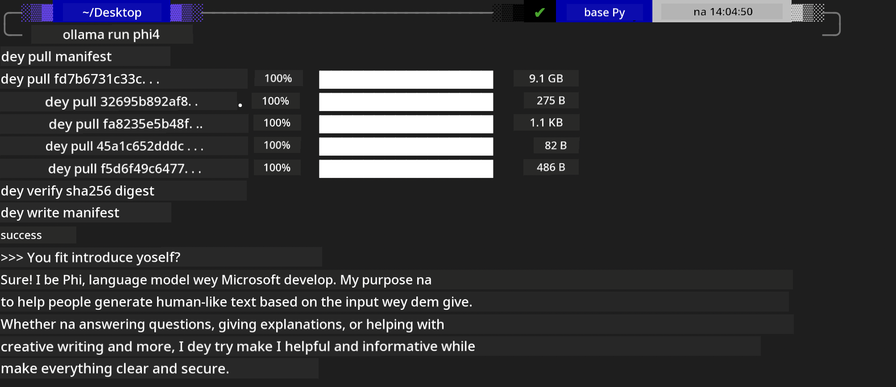

## Phi Family for Ollama


[Ollama](https://ollama.com) dey allow more people to directly deploy open source LLM or SLM through simple scripts, and e fit also build APIs wey go help local Copilot application scenarios.

## **1. Installation**

Ollama fit run on Windows, macOS, and Linux. You fit install Ollama through this link ([https://ollama.com/download](https://ollama.com/download)). After installation don succeed, you fit directly use Ollama script to call Phi-3 through terminal window. You fit see all the [available libaries in Ollama](https://ollama.com/library). If you open this repository in a Codespace, e go don already get Ollama installed.

```bash

ollama run phi4

```

> [!NOTE]
> The model go first dey download when you run am for the first time. Of course, you fit also directly specify the downloaded Phi-4 model. We use WSL as example to run the command. After the model don download successful, you fit interact directly on the terminal.



## **2. Call the phi-4 API from Ollama**

If you wan call the Phi-4 API wey ollama generate, you fit use this command for the terminal to start the Ollama server.

```bash

ollama serve

```

> [!NOTE]
> If you dey run MacOS or Linux, abeg note say you fit encounter dis error **"Error: listen tcp 127.0.0.1:11434: bind: address already in use"**. You fit get this error when you run the command. You fit either ignore the error, because normally e mean say the server don already dey run, or you fit stop am and restart Ollama:

**macOS**

```bash

brew services restart ollama

```

**Linux**

```bash

sudo systemctl stop ollama

```

Ollama get two API: generate and chat. You fit call the model API wey Ollama provide according to wetin you need, by sending requests to the local service wey dey run on port 11434.

**Chat**

```bash

curl http://127.0.0.1:11434/api/chat -d '{
  "model": "phi3",
  "messages": [
    {
      "role": "system",
      "content": "Your are a python developer."
    },
    {
      "role": "user",
      "content": "Help me generate a bubble algorithm"
    }
  ],
  "stream": false
  
}'
```

This na the result for Postman


## Additional Resources

Check di list of available models for Ollama for [their library](https://ollama.com/library).

Pull your model from the Ollama server using this command

```bash
ollama pull phi4
```

Run the model using this command

```bash
ollama run phi4
```

***Note:*** Visit this link [https://github.com/ollama/ollama/blob/main/docs/api.md](https://github.com/ollama/ollama/blob/main/docs/api.md) to learn more

## Calling Ollama from Python

You fit use `requests` or `urllib3` to make requests to the local server endpoints wey dem use above. But one popular way to use Ollama for Python na via the [openai](https://pypi.org/project/openai/) SDK, because Ollama dey provide OpenAI-compatible server endpoints too.

Here na example for phi3-mini:

```python
import openai

client = openai.OpenAI(
    base_url="http://localhost:11434/v1",
    api_key="nokeyneeded",
)

response = client.chat.completions.create(
    model="phi4",
    temperature=0.7,
    n=1,
    messages=[
        {"role": "system", "content": "You are a helpful assistant."},
        {"role": "user", "content": "Write a haiku about a hungry cat"},
    ],
)

print("Response:")
print(response.choices[0].message.content)
```

## Calling Ollama from JavaScript 

```javascript
// Example wey dey show how to summarize file wit Phi-4
script({
    model: "ollama:phi4",
    title: "Summarize with Phi-4",
    system: ["system"],
})

// Example wey dey show how to summarize
const file = def("FILE", env.files)
$`Summarize ${file} in a single paragraph.`
```

## Calling Ollama from C#

Create a new C# Console application and add the following NuGet package:

```bash
dotnet add package Microsoft.SemanticKernel --version 1.34.0
```

Then replace this code in the `Program.cs` file

```csharp
using Microsoft.SemanticKernel;
using Microsoft.SemanticKernel.ChatCompletion;

// add chat completion service using the local ollama server endpoint
#pragma warning disable SKEXP0001, SKEXP0003, SKEXP0010, SKEXP0011, SKEXP0050, SKEXP0052
builder.AddOpenAIChatCompletion(
    modelId: "phi4",
    endpoint: new Uri("http://localhost:11434/"),
    apiKey: "non required");

// invoke a simple prompt to the chat service
string prompt = "Write a joke about kittens";
var response = await kernel.InvokePromptAsync(prompt);
Console.WriteLine(response.GetValue<string>());
```

Run the app with the command:

```bash
dotnet run
```

---

<!-- CO-OP TRANSLATOR DISCLAIMER START -->
Disclaimer:
Dis document na AI don translate using translation service [Co-op Translator](https://github.com/Azure/co-op-translator). Even though we dey try make am correct, abeg note say automatic translations fit get mistakes or wrong meanings. The original document for im own language na the correct source. For important information, we recommend make professional human translator do the translation. We no go fit take responsibility for any misunderstanding or wrong interpretation wey fit arise from using this translation.
<!-- CO-OP TRANSLATOR DISCLAIMER END -->