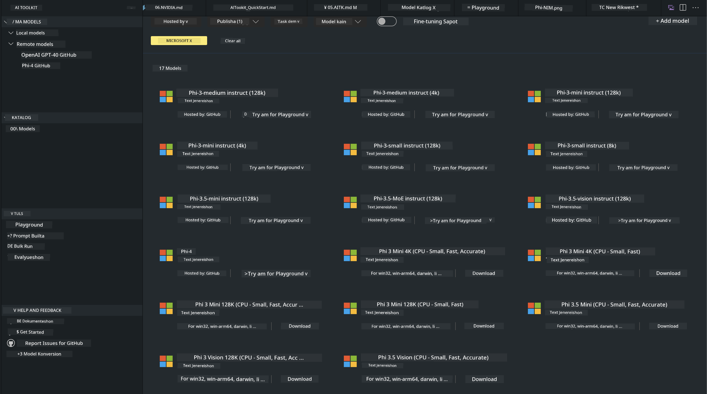
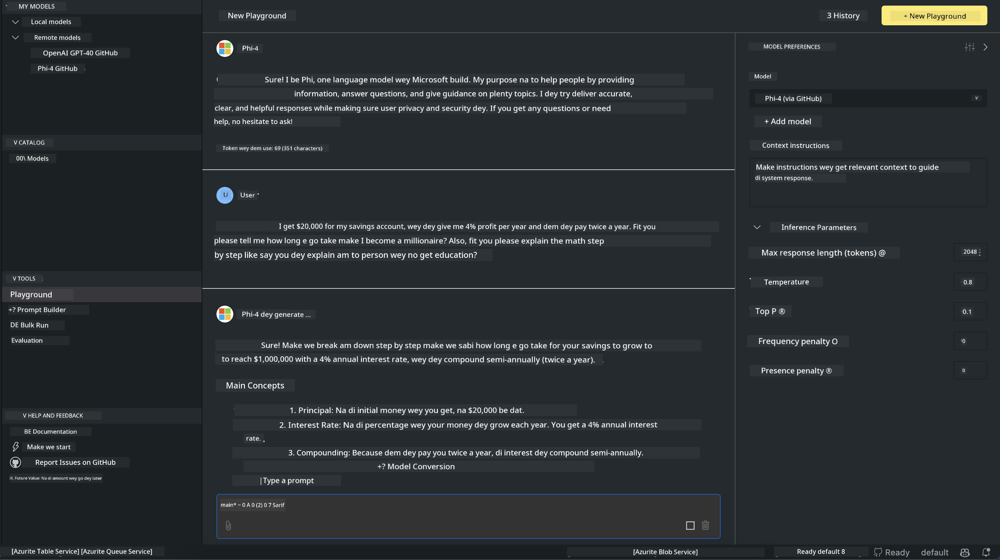

# Phi Family for AITK

[AI Toolkit for VS Code](https://marketplace.visualstudio.com/items?itemName=ms-windows-ai-studio.windows-ai-studio) dey make generative AI app development easy by bring together cutting-edge AI development tools and models from Azure AI Foundry Catalog and oda catalogs like Hugging Face. You go fit browse di AI models catalog wey GitHub Models and Azure AI Foundry Model Catalogs power, download dem locally or remote, fine-tune, test and use dem for your application.

AI Toolkit Preview go run locally. Local inference or fine-tune, e depend on di model wey you select, you fit need GPU like NVIDIA CUDA GPU. You fit run GitHub Models directly with AITK too.

## How to Start

[Learn more how to install Windows subsystem for Linux](https://learn.microsoft.com/windows/wsl/install?WT.mc_id=aiml-137032-kinfeylo)

and [changing default distribution](https://learn.microsoft.com/windows/wsl/install#change-the-default-linux-distribution-installed).

[AI Tooklit GitHub Repo](https://github.com/microsoft/vscode-ai-toolkit/)

- Windows,Linux,macOS
  
- For finetuning on both Windows and Linux, you go need an Nvidia GPU. On top dat, **Windows** need subsystem for Linux wit Ubuntu distro 18.4 or newer. [Learn more how to install Windows subsystem for Linux](https://learn.microsoft.com/windows/wsl/install) and [changing default distribution](https://learn.microsoft.com/windows/wsl/install#change-the-default-linux-distribution-installed).

### Install AI Toolkit

AI Toolkit dey ship as a [Visual Studio Code Extension](https://code.visualstudio.com/docs/setup/additional-components#_vs-code-extensions), so you need install [VS Code](https://code.visualstudio.com/docs/setup/windows?WT.mc_id=aiml-137032-kinfeylo) first, and download AI Toolkit from the [VS Marketplace](https://marketplace.visualstudio.com/items?itemName=ms-windows-ai-studio.windows-ai-studio).
The [AI Toolkit is available in the Visual Studio Marketplace](https://marketplace.visualstudio.com/items?itemName=ms-windows-ai-studio.windows-ai-studio) and fit install like any oda VS Code extension. 

If you no sabi how to install VS Code extensions, follow these steps:

### Sign In

1. In the Activity Bar in VS Code select **Extensions**
1. In the Extensions Search bar type "AI Toolkit"
1. Select the "AI Toolkit for Visual Studio code"
1. Select **Install**

Now, you ready to use the extension!

You go get prompt to sign in to GitHub, so abeg click "Allow" to continue. Dem go redirect you go GitHub signing page.

Abeg sign in and follow di process steps. After e finish well, dem go redirect you back to VS Code.

Once the extension don install you go see the AI Toolkit icon show for your Activity Bar.

Make we explore di actions wey dey!

### Available Actions

The primary sidebar of the AI Toolkit dey organized into  

- **Models**
- **Resources**
- **Playground**  
- **Fine-tuning**
- **Evaluation**

Dem dey available for di Resources section. To start, select **Model Catalog**.

### Download a model from the catalog

When you launch AI Toolkit from VS Code side bar, you fit select from di options below:



- Find a supported model from **Model Catalog** and download locally
- Test model inference in the **Model Playground**
- Fine-tune model locally or remotely in **Model Fine-tuning**
- Deploy fine-tuned models to cloud via command palette for AI Toolkit
- Evaluation models

> [!NOTE]
>
> **GPU Vs CPU**
>
> You go notice say di model cards dey show di model size, di platform and accelerator type (CPU, GPU). For better performance on **Windows devices wey get at least one GPU**, choose model versions wey target Windows only.
>
> Dis one dey make sure say model don optimize for the DirectML accelerator.
>
> Di model names dey dis format:
>
> - `{model_name}-{accelerator}-{quantization}-{format}`.
>
>To check whether you get GPU for your Windows device, open **Task Manager** and then select di **Performance** tab. If you get GPU(s), dem go show under names like "GPU 0" or "GPU 1".

### Run the model in the playground

After you don set all parameters, click **Generate Project**.

Once your model don download, select **Load in Playground** for the model card for di catalog:

- Initiate di model download
- Install all prerequisites and dependencies
- Create VS Code workspace



### Use the REST API in your application 

The AI Toolkit get local REST API web server **on port 5272** wey dey use the [OpenAI chat completions format](https://platform.openai.com/docs/api-reference/chat/create). 

This one make you fit test your application locally without depend on cloud AI model service. For example, di JSON file below show how to configure di body of di request:

```json
{
    "model": "Phi-4",
    "messages": [
        {
            "role": "user",
            "content": "what is the golden ratio?"
        }
    ],
    "temperature": 0.7,
    "top_p": 1,
    "top_k": 10,
    "max_tokens": 100,
    "stream": true
}
```

You fit test di REST API using (for example) [Postman](https://www.postman.com/) or di CURL (Client URL) utility:

```bash
curl -vX POST http://127.0.0.1:5272/v1/chat/completions -H 'Content-Type: application/json' -d @body.json
```

### Using the OpenAI client library for Python

```python
from openai import OpenAI

client = OpenAI(
    base_url="http://127.0.0.1:5272/v1/", 
    api_key="x" # di API need am but e no dey used
)

chat_completion = client.chat.completions.create(
    messages=[
        {
            "role": "user",
            "content": "what is the golden ratio?",
        }
    ],
    model="Phi-4",
)

print(chat_completion.choices[0].message.content)
```

### Using Azure OpenAI client library for .NET

Add the [Azure OpenAI client library for .NET](https://www.nuget.org/packages/Azure.AI.OpenAI/) to your project using NuGet:

```bash
dotnet add {project_name} package Azure.AI.OpenAI --version 1.0.0-beta.17
```

Add a C# file wey dem call **OverridePolicy.cs** to your project and paste di code below:

```csharp
// OverridePolicy.cs
using Azure.Core.Pipeline;
using Azure.Core;

internal partial class OverrideRequestUriPolicy(Uri overrideUri)
    : HttpPipelineSynchronousPolicy
{
    private readonly Uri _overrideUri = overrideUri;

    public override void OnSendingRequest(HttpMessage message)
    {
        message.Request.Uri.Reset(_overrideUri);
    }
}
```

Next, paste di following code into your **Program.cs** file:

```csharp
// Program.cs
using Azure.AI.OpenAI;

Uri localhostUri = new("http://localhost:5272/v1/chat/completions");

OpenAIClientOptions clientOptions = new();
clientOptions.AddPolicy(
    new OverrideRequestUriPolicy(localhostUri),
    Azure.Core.HttpPipelinePosition.BeforeTransport);
OpenAIClient client = new(openAIApiKey: "unused", clientOptions);

ChatCompletionsOptions options = new()
{
    DeploymentName = "Phi-4",
    Messages =
    {
        new ChatRequestSystemMessage("You are a helpful assistant. Be brief and succinct."),
        new ChatRequestUserMessage("What is the golden ratio?"),
    }
};

StreamingResponse<StreamingChatCompletionsUpdate> streamingChatResponse
    = await client.GetChatCompletionsStreamingAsync(options);

await foreach (StreamingChatCompletionsUpdate chatChunk in streamingChatResponse)
{
    Console.Write(chatChunk.ContentUpdate);
}
```


## Fine Tuning with AI Toolkit

- Start with model discovery and playground.
- Model fine-tuning and inference using your local computing resources.
- Remote fine-tuning and inference using Azure resources

[Fine Tuning with AI Toolkit](../../03.FineTuning/Finetuning_VSCodeaitoolkit.md)

## AI Toolkit Q&A Resources

Abeg refer to our [Q&A page](https://github.com/microsoft/vscode-ai-toolkit/blob/main/archive/QA.md) for di common issues and how to resolve dem

---

<!-- CO-OP TRANSLATOR DISCLAIMER START -->
Disclaimer:
Dis document don translate wit AI translation service [Co-op Translator] (https://github.com/Azure/co-op-translator). Even tho we dey try make am correct, abeg note say automatic translations fit get mistakes or inaccuracies. Di original document for im native language suppose be di authoritative source. If na critical/important information, e better make professional human translator do di translation. We no go responsible for any misunderstandings or wrong interpretations wey fit come from using dis translation.
<!-- CO-OP TRANSLATOR DISCLAIMER END -->