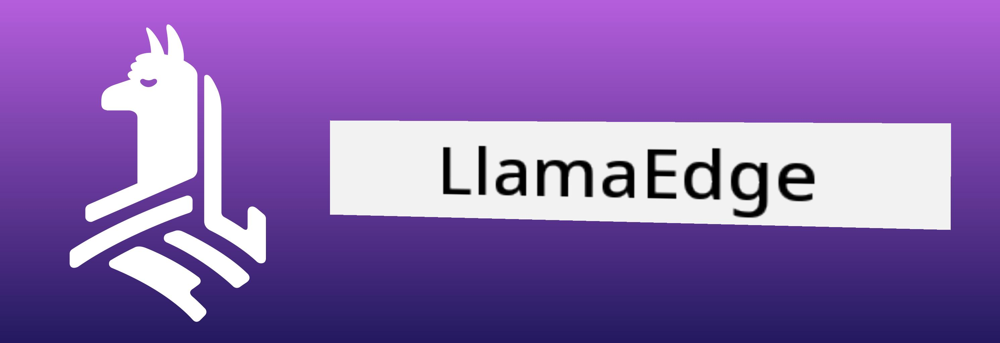

# **Inference Phi-3 for Nvidia Jetson**

Nvidia Jetson na series of embedded computing boards wey Nvidia dey make. The Jetson TK1, TX1 and TX2 models all get Tegra processor (or SoC) from Nvidia wey get ARM architecture central processing unit (CPU). Jetson na low-power system wey dem design make e help accelerate machine learning applications. Nvidia Jetson de used by professional developers to build breakthrough AI products for different industries, and na students and enthusiasts de use am for hands-on AI learning and to make better projects. SLM dey deploy for edge devices like Jetson, wey go enable better implementation of industrial generative AI application scenarios.

## Deployment on NVIDIA Jetson:
Developers wey de work on autonomous robotics and embedded devices fit use Phi-3 Mini. Phi-3 small size make am perfect for edge deployment. Parameters dem tune well during training, make responses get high accuracy.

### TensorRT-LLM Optimization:
NVIDIA's [TensorRT-LLM library](https://github.com/NVIDIA/TensorRT-LLM?WT.mc_id=aiml-138114-kinfeylo) dey optimize large language model inference. E support Phi-3 Mini long context window, wey dey improve both throughput and latency. Optimizations include techniques like LongRoPE, FP8, and inflight batching.

### Availability and Deployment:
Developers fit explore Phi-3 Mini wey get 128K context window for [NVIDIA's AI](https://www.nvidia.com/en-us/ai-data-science/generative-ai/). E package as an NVIDIA NIM, na microservice get standard API wey fit deploy anywhere. Plus, de [TensorRT-LLM implementations on GitHub](https://github.com/NVIDIA/TensorRT-LLM).

 ## **1. Preparation**


a. Jetson Orin NX / Jetson NX

b. JetPack 5.1.2+
   
c. Cuda 11.8
   
d. Python 3.8+

 ## **2. Running Phi-3 in Jetson**

 We fit choose [Ollama](https://ollama.com) or [LlamaEdge](https://llamaedge.com)

 If you wan use gguf for cloud and edge devices at the same time, LlamaEdge fit be like WasmEdge (WasmEdge na lightweight, high-performance, scalable WebAssembly runtime wey fine for cloud native, edge and decentralized applications. E support serverless applications, embedded functions, microservices, smart contracts and IoT devices. You fit deploy gguf quantitative model to edge devices and the cloud through LlamaEdge).



Here na the steps to use 

1. Install and download related libraries and files

```bash

curl -sSf https://raw.githubusercontent.com/WasmEdge/WasmEdge/master/utils/install.sh | bash -s -- --plugin wasi_nn-ggml

curl -LO https://github.com/LlamaEdge/LlamaEdge/releases/latest/download/llama-api-server.wasm

curl -LO https://github.com/LlamaEdge/chatbot-ui/releases/latest/download/chatbot-ui.tar.gz

tar xzf chatbot-ui.tar.gz

```

**Note**: llama-api-server.wasm and chatbot-ui need to be in the same directory

2. Run scripts in terminal


```bash

wasmedge --dir .:. --nn-preload default:GGML:AUTO:{Your gguf path} llama-api-server.wasm -p phi-3-chat

```

Here na the running result


***Sample code*** [Phi-3 mini WASM Notebook Sample](https://github.com/Azure-Samples/Phi-3MiniSamples/tree/main/wasm)

In short, Phi-3 Mini na big step forward for language modeling, e combine efficiency, context awareness, and NVIDIA optimization power. Whether you dey build robots or edge applications, Phi-3 Mini na strong tool wey you suppose sabi.

---

<!-- CO-OP TRANSLATOR DISCLAIMER START -->
Disclaimer:
Dis document na AI don translate am with Co-op Translator (https://github.com/Azure/co-op-translator). Even though we dey try make everything correct, abeg sabi say automated translation fit get mistakes or wrong waka. Di original document for im original language remain di correct/official source. For important mata, make una use professional human translator. We no go responsible for any misunderstanding or wrong interpretation wey fit happen because of dis translation.
<!-- CO-OP TRANSLATOR DISCLAIMER END -->