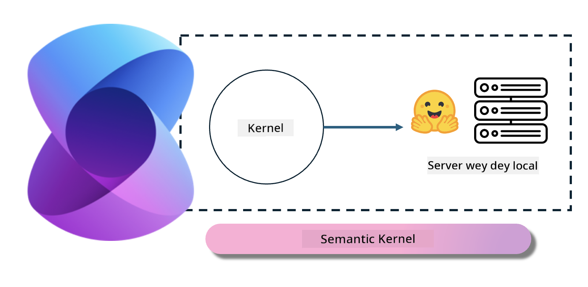
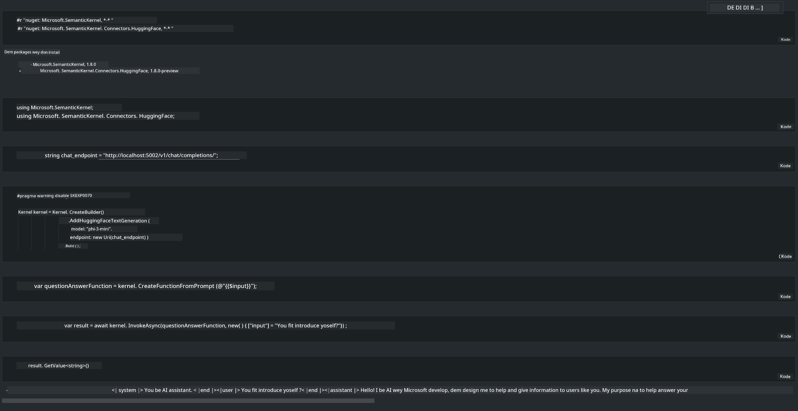

# **Inference Phi-3 in Local Server**

We fit deploy Phi-3 for local server. Users fit choose [Ollama](https://ollama.com) or [LM Studio](https://llamaedge.com) solutions, or dem fit write dia own code. You fit connect Phi-3's local services through [Semantic Kernel](https://github.com/microsoft/semantic-kernel?WT.mc_id=aiml-138114-kinfeylo) or [Langchain](https://www.langchain.com/) make you build Copilot applications

## **Use Semantic Kernel to access Phi-3-mini**

For the Copilot application, we dey create applications through Semantic Kernel / LangChain. Dis kain application framework usually dey compatible with Azure OpenAI Service / OpenAI models, and e fit also support open source models for Hugging Face and local models. Wetin we go do if we wan use Semantic Kernel to access Phi-3-mini? Using .NET as example, we fit combine am wit the Hugging Face Connector inside Semantic Kernel. By default, e go fit correspond to the model id on Hugging Face (the first time you use am, the model go download from Hugging Face, and e go take long time). You fit also connect to the local service wey you don build. Between the two, we recommend make you use the latter because e get more autonomy, especially for enterprise applications.

From the picture, accessing local services through Semantic Kernel fit easily connect to the self-built Phi-3-mini model server. This na di running result

***Sample Code*** https://github.com/kinfey/Phi3MiniSamples/tree/main/semantickernel

---

<!-- CO-OP TRANSLATOR DISCLAIMER START -->
Notis:
Dis dokument don translate wit AI translation service [Co-op Translator](https://github.com/Azure/co-op-translator). Even though we dey try make am correct, abeg sabi say automated translation fit get mistakes or wrong parts. Di original dokument for im own language na di correct/authoritative source. For important matter, e better make professional human translator do di job. We no go dey responsible for any misunderstanding or wrong interpretation wey fit come from using dis translation.
<!-- CO-OP TRANSLATOR DISCLAIMER END -->