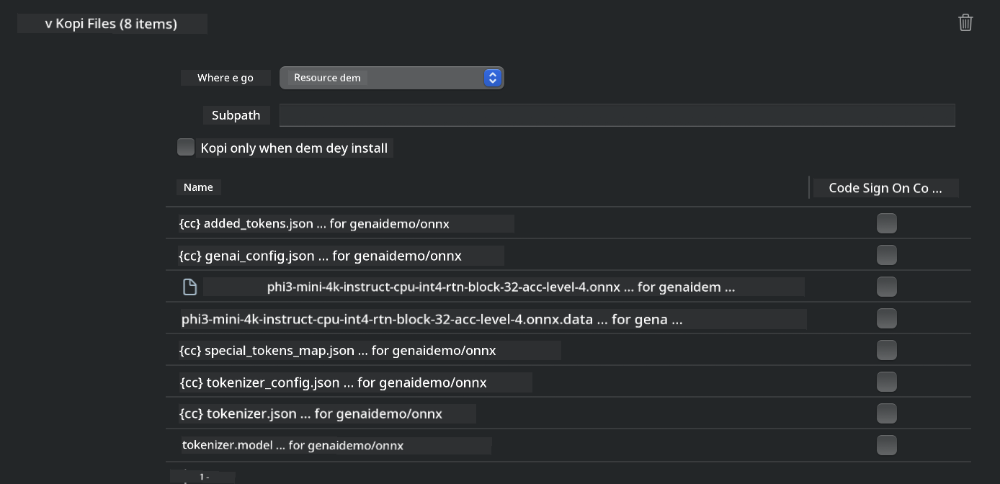

<!--
CO_OP_TRANSLATOR_METADATA:
{
  "original_hash": "82af197df38d25346a98f1f0e84d1698",
  "translation_date": "2025-12-22T00:31:31+00:00",
  "source_file": "md/01.Introduction/03/iOS_Inference.md",
  "language_code": "pcm"
}
-->
# **How to run Phi-3 for iOS**

Phi-3-mini na new model series from Microsoft wey make you fit deploy Large Language Models (LLMs) for edge devices and IoT devices. Phi-3-mini dey available for iOS, Android, and Edge Device deployments, so e fit allow generative AI make e run for BYOD environments. Dis example show how to deploy Phi-3-mini for iOS.

## **1. Wetin you go need**

- **a.** macOS 14+
- **b.** Xcode 15+
- **c.** iOS SDK 17.x (iPhone 14 A16 or higher)
- **d.** Make you install Python 3.10+ (Conda dey recommended)
- **e.** Install the Python library: `python-flatbuffers`
- **f.** Install CMake

### Semantic Kernel and Inference

Semantic Kernel na application framework wey allow you create apps wey dey compatible with Azure OpenAI Service, OpenAI models, and even local models. When you access local services through Semantic Kernel, e go make am easy to integrate your self-hosted Phi-3-mini model server.

### Calling Quantized Models with Ollama or LlamaEdge

Plenty users prefer to use quantized models to run models locally. [Ollama](https://ollama.com) and [LlamaEdge](https://llamaedge.com) make users fit call different quantized models:

#### **Ollama**

You fit run `ollama run phi3` directly or configure am for offline. Create a Modelfile wey get the path to your `gguf` file. Sample code for running the Phi-3-mini quantized model:

```gguf
FROM {Add your gguf file path}
TEMPLATE \"\"\"<|user|> .Prompt<|end|> <|assistant|>\"\"\"
PARAMETER stop <|end|>
PARAMETER num_ctx 4096
```

#### **LlamaEdge**

If you wan use `gguf` for both cloud and edge devices at the same time, LlamaEdge na better option.

## **2. Compile ONNX Runtime for iOS**

```bash

git clone https://github.com/microsoft/onnxruntime.git

cd onnxruntime

./build.sh --build_shared_lib --ios --skip_tests --parallel --build_dir ./build_ios --ios --apple_sysroot iphoneos --osx_arch arm64 --apple_deploy_target 17.5 --cmake_generator Xcode --config Release

cd ../

```

### **Notice**

- **a.** Before you compile, make sure say Xcode don set up correct and set am as the active developer directory for the terminal:

    ```bash
    sudo xcode-select -switch /Applications/Xcode.app/Contents/Developer
    ```

- **b.** ONNX Runtime suppose compile for different platforms. For iOS, you fit compile for `arm64` or `x86_64`.

- **c.** E dey recommended make you use the latest iOS SDK for compilation. But you fit still use older version if you need compatibility with previous SDKs.

## **3. Compiling Generative AI with ONNX Runtime for iOS**

> **Note:** Because Generative AI with ONNX Runtime dey for preview, abeg sabi say fit get changes.

```bash

git clone https://github.com/microsoft/onnxruntime-genai
 
cd onnxruntime-genai
 
mkdir ort
 
cd ort
 
mkdir include
 
mkdir lib
 
cd ../
 
cp ../onnxruntime/include/onnxruntime/core/session/onnxruntime_c_api.h ort/include
 
cp ../onnxruntime/build_ios/Release/Release-iphoneos/libonnxruntime*.dylib* ort/lib
 
export OPENCV_SKIP_XCODEBUILD_FORCE_TRYCOMPILE_DEBUG=1
 
python3 build.py --parallel --build_dir ./build_ios --ios --ios_sysroot iphoneos --ios_arch arm64 --ios_deployment_target 17.5 --cmake_generator Xcode --cmake_extra_defines CMAKE_XCODE_ATTRIBUTE_CODE_SIGNING_ALLOWED=NO

```

## **4. Create an App in Xcode**

I choose Objective-C as the app development method, because when you dey use Generative AI with ONNX Runtime C++ API, Objective-C dey more compatible. Of course, you fit also complete related calls through Swift bridging.


## **5. Copy the ONNX quantized INT4 model to the App project**

We need make we import the INT4 quantization model for ONNX format, you go need download am first


After you don download, you need add am to the Resources directory of the project in Xcode.



## **6. Adding the C++ API in ViewControllers**

> **Notice:**

- **a.** Add the corresponding C++ header files to the project.

  

- **b.** Include the `onnxruntime-genai` dynamic library in Xcode.

  

- **c.** Use the C Samples code for testing. You fit also add extra features like ChatUI for more functionality.

- **d.** Because you go need use C++ for your project, rename `ViewController.m` to `ViewController.mm` so Objective-C++ go work.

```objc

    NSString *llmPath = [[NSBundle mainBundle] resourcePath];
    char const *modelPath = llmPath.cString;

    auto model =  OgaModel::Create(modelPath);

    auto tokenizer = OgaTokenizer::Create(*model);

    const char* prompt = "<|system|>You are a helpful AI assistant.<|end|><|user|>Can you introduce yourself?<|end|><|assistant|>";

    auto sequences = OgaSequences::Create();
    tokenizer->Encode(prompt, *sequences);

    auto params = OgaGeneratorParams::Create(*model);
    params->SetSearchOption("max_length", 100);
    params->SetInputSequences(*sequences);

    auto output_sequences = model->Generate(*params);
    const auto output_sequence_length = output_sequences->SequenceCount(0);
    const auto* output_sequence_data = output_sequences->SequenceData(0);
    auto out_string = tokenizer->Decode(output_sequence_data, output_sequence_length);
    
    auto tmp = out_string;

```

## **7. Running the Application**

Once the setup don finish, you fit run the application to see the results of the Phi-3-mini model inference.


For more sample code and detailed instructions, visit the [Phi-3 Mini Samples repository](https://github.com/Azure-Samples/Phi-3MiniSamples/tree/main/ios).

---

<!-- CO-OP TRANSLATOR DISCLAIMER START -->
Disclaimer:
Dis document na AI don translate am wit Co-op Translator. Even though we dey try make am accurate, abeg note say automatic translation fit get mistakes or no too correct. The original document for im original language suppose remain the correct/authority version. If na important matter, e better make professional human translator check am. We no go responsible for any misunderstanding or wrong interpretation wey fit come from using dis translation.
<!-- CO-OP TRANSLATOR DISCLAIMER END -->