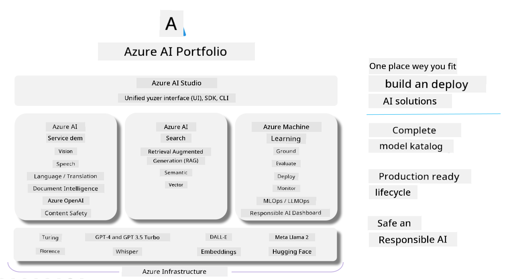

# **How to test your generative AI app wit Azure AI Foundry**

How you fit evaluate your generative AI application using [Azure AI Foundry](https://ai.azure.com?WT.mc_id=aiml-138114-kinfeylo). Whether you dey check single-turn or multi-turn conversations, Azure AI Foundry get tools wey go help you evaluate how the model dey perform and di safety.

## How to evaluate generative AI apps with Azure AI Foundry
For more details, check di [Azure AI Foundry Documentation](https://learn.microsoft.com/azure/ai-studio/how-to/evaluate-generative-ai-app?WT.mc_id=aiml-138114-kinfeylo)

Here be the steps to get started:

## Evaluating Generative AI Models in Azure AI Foundry

**Prerequisites**

- Test dataset wey fit be for CSV or JSON format.
- Deployed generative AI model (like Phi-3, GPT 3.5, GPT 4, or Davinci models).
- Runtime wey get compute instance to run the evaluation.

## Built-in Evaluation Metrics

Azure AI Foundry dey allow you evaluate both single-turn and complex, multi-turn conversations.
For Retrieval Augmented Generation (RAG) scenarios, where the model dey grounded for specific data, you fit assess performance using the built-in evaluation metrics.
Also, you fit evaluate general single-turn question answering scenarios (non-RAG).

## Creating an Evaluation Run

For the Azure AI Foundry UI, navigate to either the Evaluate page or the Prompt Flow page.
Follow the evaluation creation wizard to set up an evaluation run. You fit give your evaluation an optional name.
Choose the scenario wey match wetin your app dey try achieve.
Pick one or more evaluation metrics to assess the model's output.

## Custom Evaluation Flow (Optional)

If you want more flexibility, you fit create a custom evaluation flow. Customize the evaluation process make e match your specific requirements.

## Viewing Results

After you run the evaluation, log, view, and analyze the detailed evaluation metrics for Azure AI Foundry. Get insight into wetin your application fit do and wetin e no fit do.

**Note** Azure AI Foundry dey currently for public preview, so use am for experimentation and development purposes. For production workloads, consider other options. Check the official [AI Foundry documentation](https://learn.microsoft.com/azure/ai-studio/?WT.mc_id=aiml-138114-kinfeylo) for more details and step-by-step instructions.

---

<!-- CO-OP TRANSLATOR DISCLAIMER START -->
Disclaimer:
Dis document na AI translate sotay wey [Co-op Translator](https://github.com/Azure/co-op-translator) do. Even though we dey try make am correct, abeg sabi say automated translation fit get mistakes or wrong parts. The original document for im original language na the correct/source wey you suppose trust. If na important matter, make professional human translator do am. We no dey responsible for any misunderstanding or wrong interpretation wey fit follow from this translation.
<!-- CO-OP TRANSLATOR DISCLAIMER END -->