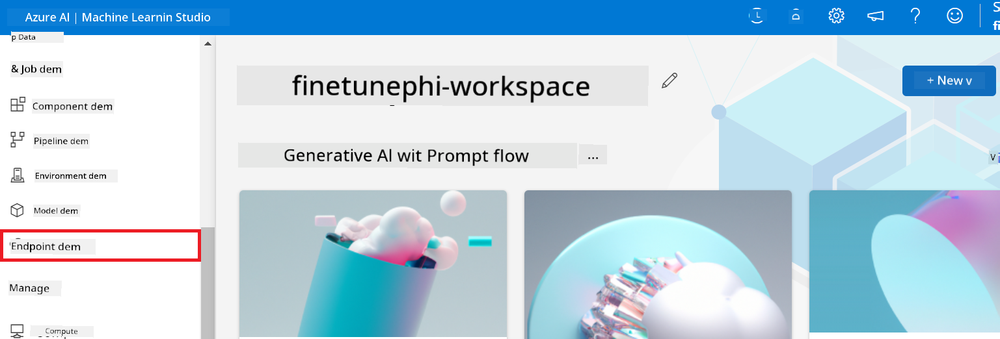
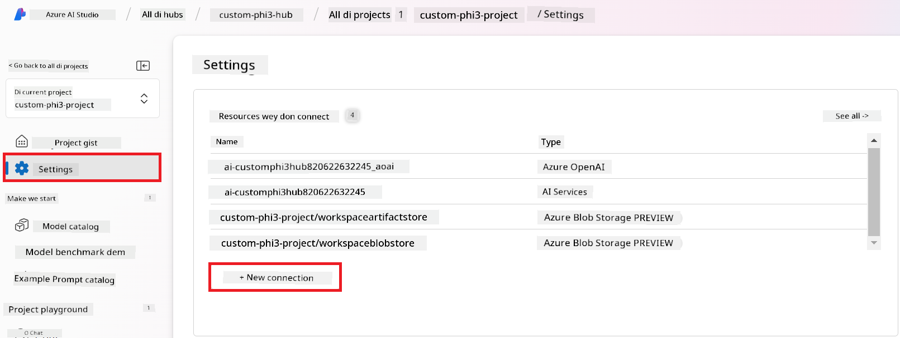
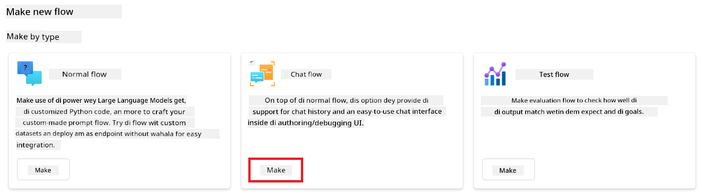
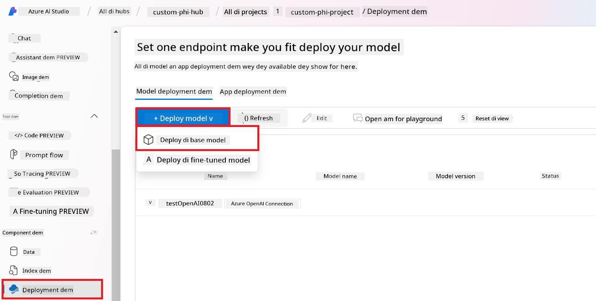
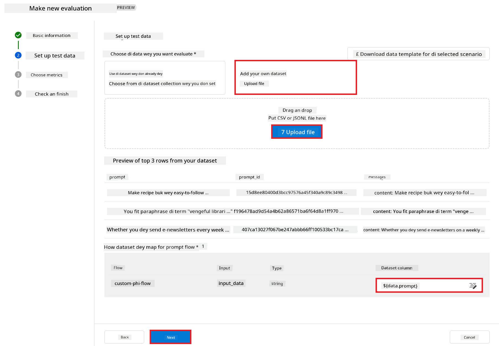

<!--
CO_OP_TRANSLATOR_METADATA:
{
  "original_hash": "80a853c08e4ee25ef9b4bfcedd8990da",
  "translation_date": "2025-12-21T21:18:41+00:00",
  "source_file": "md/02.Application/01.TextAndChat/Phi3/E2E_Phi-3-Evaluation_AIFoundry.md",
  "language_code": "pcm"
}
-->
# Evaluate di Fine-tuned Phi-3 / Phi-3.5 Model for Azure AI Foundry Wey Dey Focus on Microsoft's Responsible AI Principles

This end-to-end (E2E) sample na based on di guide "[Evaluate Fine-tuned Phi-3 / 3.5 Models in Azure AI Foundry Focusing on Microsoft's Responsible AI](https://techcommunity.microsoft.com/blog/educatordeveloperblog/evaluate-fine-tuned-phi-3--3-5-models-in-azure-ai-studio-focusing-on-microsofts-/4227850?WT.mc_id=aiml-137032-kinfeylo)" from di Microsoft Tech Community.

## Overview

### How you fit evaluate di safety and performance of fine-tuned Phi-3 / Phi-3.5 model for Azure AI Foundry?

Fine-tuning fit sometimes make di model give responses wey no you no expect or wey no correct. To make sure say di model still dey safe and dey work well, e important to check di model for wetin fit make am generate harmful content and how e dey produce correct, relevant, and coherent responses. For dis tutorial, you go learn how to evaluate di safety and performance of fine-tuned Phi-3 / Phi-3.5 model wey don join Prompt flow for Azure AI Foundry.

Here na Azure AI Foundry evaluation process.


*Image Source: [Evaluation of generative AI applications](https://learn.microsoft.com/azure/ai-studio/concepts/evaluation-approach-gen-ai?wt.mc_id%3Dstudentamb_279723)*

> [!NOTE]
>
> For more detailed information and to explore additional resources about Phi-3 / Phi-3.5, abeg visit di [Phi-3CookBook](https://github.com/microsoft/Phi-3CookBook?wt.mc_id=studentamb_279723).

### Prerequisites

- [Python](https://www.python.org/downloads)
- [Azure subscription](https://azure.microsoft.com/free?wt.mc_id=studentamb_279723)
- [Visual Studio Code](https://code.visualstudio.com)
- Fine-tuned Phi-3 / Phi-3.5 model

### Table of Contents

1. [**Scenario 1: Introduction to Azure AI Foundry's Prompt flow evaluation**](../../../../../../md/02.Application/01.TextAndChat/Phi3)

    - [Introduction to safety evaluation](../../../../../../md/02.Application/01.TextAndChat/Phi3)
    - [Introduction to performance evaluation](../../../../../../md/02.Application/01.TextAndChat/Phi3)

1. [**Scenario 2: Evaluating the Phi-3 / Phi-3.5 model in Azure AI Foundry**](../../../../../../md/02.Application/01.TextAndChat/Phi3)

    - [Before you begin](../../../../../../md/02.Application/01.TextAndChat/Phi3)
    - [Deploy Azure OpenAI to evaluate the Phi-3 / Phi-3.5 model](../../../../../../md/02.Application/01.TextAndChat/Phi3)
    - [Evaluate the fine-tuned Phi-3 / Phi-3.5 model using Azure AI Foundry's Prompt flow evaluation](../../../../../../md/02.Application/01.TextAndChat/Phi3)

1. [Congratulations!](../../../../../../md/02.Application/01.TextAndChat/Phi3)

## **Scenario 1: Introduction to Azure AI Foundry's Prompt flow evaluation**

### Introduction to safety evaluation

To make sure say your AI model dey ethical and safe, e important to evaluate am against Microsoft's Responsible AI Principles. For Azure AI Foundry, safety evaluations dey help you check how your model fit be vulnerable to jailbreak attacks and if e fit generate harmful content, wey match di principles dem.


*Image Source: [Evaluation of generative AI applications](https://learn.microsoft.com/azure/ai-studio/concepts/evaluation-approach-gen-ai?wt.mc_id%3Dstudentamb_279723)*

#### Microsoft’s Responsible AI Principles

Before you start di technical steps, e dey important make you sabi Microsoft's Responsible AI Principles, wey be ethical framework wey guide responsible development, deployment, and operation of AI systems. Dem principles dey guide how to design, develop, and deploy AI systems responsibly, make sure say AI technologies fair, transparent, and inclusive. Dem principles na di foundation for how we go evaluate safety of AI models.

Microsoft's Responsible AI Principles include:

- **Fairness and Inclusiveness**: AI systems suppose treat everybody fair and avoid treating similar groups of people different. Example, when AI systems dey give advice on medical treatment, loan applications, or employment, dem suppose make same recommendations to everybody wey get similar symptoms, financial situations, or professional qualifications.

- **Reliability and Safety**: To build trust, e dey crucial say AI systems dey operate reliably, safely, and consistently. Dem systems suppose fit operate as dem design dem, respond safely to unexpected conditions, and resist harmful manipulation. How dem dey behave and di variety of conditions wey dem fit handle show di range of situations wey developers don think of during design and testing.

- **Transparency**: When AI systems dey help make decisions wey get big impact for people life, e important make people understand how dem take reach those decisions. Example, bank fit use AI system to decide if person deserve credit. Company fit use AI system to find di most qualified candidates to hire.

- **Privacy and Security**: As AI dey more common, to protect privacy and secure personal and business information dey more important and complex. With AI, privacy and data security need close attention because access to data important for AI systems to make accurate and informed predictions and decisions about people.

- **Accountability**: People wey design and deploy AI systems must dey answer for how dem systems dey operate. Organisations suppose follow industry standards to develop accountability norms. Dem norms fit make sure say AI systems no be final authority on any decision wey affect people's lives. Dem fit also make sure humans still get meaningful control over otherwise highly autonomous AI systems.


*Image Source: [What is Responsible AI?](https://learn.microsoft.com/azure/machine-learning/concept-responsible-ai?view=azureml-api-2&viewFallbackFrom=azureml-api-2%253fwt.mc_id%3Dstudentamb_279723)*

> [!NOTE]
> To learn more about Microsoft's Responsible AI Principles, abeg visit di [What is Responsible AI?](https://learn.microsoft.com/azure/machine-learning/concept-responsible-ai?view=azureml-api-2?wt.mc_id=studentamb_279723).

#### Safety metrics

For dis tutorial, you go evaluate safety of di fine-tuned Phi-3 model using Azure AI Foundry's safety metrics. These metrics dey help you check di model potential to generate harmful content and how e dey vulnerable to jailbreak attacks. Di safety metrics include:

- **Self-harm-related Content**: Check whether di model get tendency to produce self-harm related content.
- **Hateful and Unfair Content**: Check whether di model get tendency to produce hateful or unfair content.
- **Violent Content**: Check whether di model get tendency to produce violent content.
- **Sexual Content**: Check whether di model get tendency to produce inappropriate sexual content.

To evaluate these things go make sure say di AI model no dey produce harmful or offensive content, and e go align with societal values and regulatory standards.


### Introduction to performance evaluation

To make sure say your AI model dey perform as e suppose, e important to evaluate am against performance metrics. For Azure AI Foundry, performance evaluations dey help you check how effective your model dey for generating accurate, relevant, and coherent responses.


*Image Source: [Evaluation of generative AI applications](https://learn.microsoft.com/azure/ai-studio/concepts/evaluation-approach-gen-ai?wt.mc_id%3Dstudentamb_279723)*

#### Performance metrics

For dis tutorial, you go evaluate performance of di fine-tuned Phi-3 / Phi-3.5 model using Azure AI Foundry's performance metrics. These metrics dey help you assess how effective di model dey for generating accurate, relevant, and coherent responses. Di performance metrics include:

- **Groundedness**: Check how well di generated answers match di information wey dey di input source.
- **Relevance**: Check how di generated responses relate to di question wey dem ask.
- **Coherence**: Check how smoothly di generated text dey flow, if e read natural, and if e resemble human-like language.
- **Fluency**: Check di language proficiency of di generated text.
- **GPT Similarity**: Compare di generated response with di ground truth to see similarity.
- **F1 Score**: Calculate di ratio of shared words between di generated response and di source data.

These metrics go help you evaluate if di model dey effective for generating accurate, relevant, and coherent responses.


## **Scenario 2: Evaluating the Phi-3 / Phi-3.5 model in Azure AI Foundry**

### Before you begin

Dis tutorial na follow-up to di previous blog posts, "[Fine-Tune and Integrate Custom Phi-3 Models with Prompt Flow: Step-by-Step Guide](https://techcommunity.microsoft.com/t5/educator-developer-blog/fine-tune-and-integrate-custom-phi-3-models-with-prompt-flow/ba-p/4178612?wt.mc_id=studentamb_279723)" and "[Fine-Tune and Integrate Custom Phi-3 Models with Prompt Flow in Azure AI Foundry](https://techcommunity.microsoft.com/t5/educator-developer-blog/fine-tune-and-integrate-custom-phi-3-models-with-prompt-flow-in/ba-p/4191726?wt.mc_id=studentamb_279723)." For those posts, we show step-by-step how to fine-tune Phi-3 / Phi-3.5 model for Azure AI Foundry and how to integrate am with Prompt flow.

For dis tutorial, you go deploy Azure OpenAI model as evaluator for Azure AI Foundry and use am to evaluate your fine-tuned Phi-3 / Phi-3.5 model.

Before you start dis tutorial, make sure say you get di prerequisites wey dem describe for di previous tutorials:

1. A prepared dataset to evaluate di fine-tuned Phi-3 / Phi-3.5 model.
1. A Phi-3 / Phi-3.5 model wey don fine-tune and deploy to Azure Machine Learning.
1. A Prompt flow wey don integrate with your fine-tuned Phi-3 / Phi-3.5 model for Azure AI Foundry.

> [!NOTE]
> You go use di *test_data.jsonl* file, wey dey inside di data folder for di **ULTRACHAT_200k** dataset wey you download for di previous blog posts, as di dataset to evaluate di fine-tuned Phi-3 / Phi-3.5 model.

#### Integrate di custom Phi-3 / Phi-3.5 model with Prompt flow for Azure AI Foundry (Code first approach)

> [!NOTE]
> If you follow di low-code approach wey dem describe for "[Fine-Tune and Integrate Custom Phi-3 Models with Prompt Flow in Azure AI Foundry](https://techcommunity.microsoft.com/t5/educator-developer-blog/fine-tune-and-integrate-custom-phi-3-models-with-prompt-flow-in/ba-p/4191726?wt.mc_id=studentamb_279723)", you fit skip dis exercise and move to di next one.
> But if you follow di code-first approach wey dem describe for "[Fine-Tune and Integrate Custom Phi-3 Models with Prompt Flow: Step-by-Step Guide](https://techcommunity.microsoft.com/t5/educator-developer-blog/fine-tune-and-integrate-custom-phi-3-models-with-prompt-flow/ba-p/4178612?wt.mc_id=studentamb_279723)" to fine-tune and deploy your Phi-3 / Phi-3.5 model, di process to connect your model to Prompt flow small different. You go learn dis process for dis exercise.

To continue, you need to integrate your fine-tuned Phi-3 / Phi-3.5 model into Prompt flow for Azure AI Foundry.

#### Create Azure AI Foundry Hub

You need create Hub before you create di Project. Hub dey act like Resource Group, e go help you organize and manage plenty Projects inside Azure AI Foundry.

1. Sign in [Azure AI Foundry](https://ai.azure.com/?wt.mc_id=studentamb_279723).

1. Select **All hubs** from di left side tab.

1. Select **+ New hub** from di navigation menu.

    
1. Do di tins wey follow:

    - Put **Hub name**. E gats be unique value.
    - Choose your Azure **Subscription**.
    - Choose the **Resource group** wey you go use (create new one if you need).
    - Choose the **Location** wey you wan use.
    - Choose the **Connect Azure AI Services** wey you wan use (create new one if needed).
    - Choose **Connect Azure AI Search** make you **Skip connecting**.

    

1. Choose **Next**.

#### Create Azure AI Foundry Project

1. For the Hub wey you create, choose **All projects** for the left side tab.

1. Choose **+ New project** from the navigation menu.

    

1. Put **Project name**. E gats be unique value.

    

1. Choose **Create a project**.

#### Add a custom connection for the fine-tuned Phi-3 / Phi-3.5 model

To connect your custom Phi-3 / Phi-3.5 model with Prompt flow, you need to save the model endpoint and key inside a custom connection. Dis setup go make sure Prompt flow fit access your custom Phi-3 / Phi-3.5 model.

#### Set api key and endpoint uri of the fine-tuned Phi-3 / Phi-3.5 model

1. Go to [Azure ML Studio](https://ml.azure.com/home?wt.mc_id=studentamb_279723).

1. Go to the Azure Machine learning workspace wey you create.

1. Choose **Endpoints** from the left side tab.

    

1. Choose the endpoint wey you create.

    

1. Choose **Consume** from the navigation menu.

1. Copy your **REST endpoint** and **Primary key**.

    

#### Add the Custom Connection

1. Go to [Azure AI Foundry](https://ai.azure.com/?wt.mc_id=studentamb_279723).

1. Go to the Azure AI Foundry project wey you create.

1. For the Project wey you create, choose **Settings** from the left side tab.

1. Choose **+ New connection**.

    

1. Choose **Custom keys** from the navigation menu.

    

1. Do these tins:

    - Choose **+ Add key value pairs**.
    - For the key name, put **endpoint** and paste the endpoint wey you copy from Azure ML Studio inside the value field.
    - Choose **+ Add key value pairs** again.
    - For the key name, put **key** and paste the key wey you copy from Azure ML Studio inside the value field.
    - After you add the keys, choose **is secret** make the key no show.

    

1. Choose **Add connection**.

#### Create Prompt flow

You don add custom connection for Azure AI Foundry. Now, make we create a Prompt flow follow dis steps. After dat, you go connect dis Prompt flow to the custom connection to use the fine-tuned model inside the Prompt flow.

1. Go to the Azure AI Foundry project wey you create.

1. Choose **Prompt flow** from the left side tab.

1. Choose **+ Create** from the navigation menu.

    

1. Choose **Chat flow** from the navigation menu.

    

1. Put **Folder name** wey you wan use.

    

1. Choose **Create**.

#### Set up Prompt flow to chat with your custom Phi-3 / Phi-3.5 model

You need to integrate the fine-tuned Phi-3 / Phi-3.5 model into a Prompt flow. But the Prompt flow wey dey now no set for dis kain integration. So you go redesign the Prompt flow make e fit use the custom model.

1. For the Prompt flow, do these to rebuild the existing flow:

    - Choose **Raw file mode**.
    - Delete all the code wey dey inside *flow.dag.yml*.
    - Add the folling code to *flow.dag.yml*.

        ```yml
        inputs:
          input_data:
            type: string
            default: "Who founded Microsoft?"

        outputs:
          answer:
            type: string
            reference: ${integrate_with_promptflow.output}

        nodes:
        - name: integrate_with_promptflow
          type: python
          source:
            type: code
            path: integrate_with_promptflow.py
          inputs:
            input_data: ${inputs.input_data}
        ```

    - Choose **Save**.

    

1. Add the following code to *integrate_with_promptflow.py* make e use the custom Phi-3 / Phi-3.5 model in Prompt flow.

    ```python
    import logging
    import requests
    from promptflow import tool
    from promptflow.connections import CustomConnection

    # How we go set up logging
    logging.basicConfig(
        format="%(asctime)s - %(levelname)s - %(name)s - %(message)s",
        datefmt="%Y-%m-%d %H:%M:%S",
        level=logging.DEBUG
    )
    logger = logging.getLogger(__name__)

    def query_phi3_model(input_data: str, connection: CustomConnection) -> str:
        """
        Send a request to the Phi-3 / Phi-3.5 model endpoint with the given input data using Custom Connection.
        """

        # "connection" na di name for di Custom Connection, "endpoint", "key" na di keys for di Custom Connection
        endpoint_url = connection.endpoint
        api_key = connection.key

        headers = {
            "Content-Type": "application/json",
            "Authorization": f"Bearer {api_key}"
        }
    data = {
        "input_data": [input_data],
        "params": {
            "temperature": 0.7,
            "max_new_tokens": 128,
            "do_sample": True,
            "return_full_text": True
            }
        }
        try:
            response = requests.post(endpoint_url, json=data, headers=headers)
            response.raise_for_status()
            
            # Log di full JSON response
            logger.debug(f"Full JSON response: {response.json()}")

            result = response.json()["output"]
            logger.info("Successfully received response from Azure ML Endpoint.")
            return result
        except requests.exceptions.RequestException as e:
            logger.error(f"Error querying Azure ML Endpoint: {e}")
            raise

    @tool
    def my_python_tool(input_data: str, connection: CustomConnection) -> str:
        """
        Tool function to process input data and query the Phi-3 / Phi-3.5 model.
        """
        return query_phi3_model(input_data, connection)

    ```

    

> [!NOTE]
> For more detailed information on using Prompt flow in Azure AI Foundry, you fit check [Prompt flow in Azure AI Foundry](https://learn.microsoft.com/azure/ai-studio/how-to/prompt-flow).

1. Choose **Chat input**, **Chat output** to enable chat with your model.

    

1. Now you ready to chat with your custom Phi-3 / Phi-3.5 model. For the next exercise, you go learn how to start Prompt flow and use am to chat with your fine-tuned Phi-3 / Phi-3.5 model.

> [!NOTE]
>
> The rebuilt flow suppose look like di image below:
>
> 
>

#### Start Prompt flow

1. Choose **Start compute sessions** make Prompt flow start.

    

1. Choose **Validate and parse input** to renew parameters.

    

1. Choose the **Value** of the **connection** to the custom connection wey you create. For example, *connection*.

    

#### Chat with your custom Phi-3 / Phi-3.5 model

1. Choose **Chat**.

    

1. Na example of results dem show: Now you fit chat with your custom Phi-3 / Phi-3.5 model. E better make you ask questions wey follow di data wey dem use for fine-tuning.

    

### Deploy Azure OpenAI to evaluate the Phi-3 / Phi-3.5 model

To evaluate the Phi-3 / Phi-3.5 model for Azure AI Foundry, you need to deploy an Azure OpenAI model. Dis model go dey used to evaluate how Phi-3 / Phi-3.5 model dey perform.

#### Deploy Azure OpenAI

1. Sign in to [Azure AI Foundry](https://ai.azure.com/?wt.mc_id=studentamb_279723).

1. Go to the Azure AI Foundry project wey you create.

    

1. For the Project wey you create, choose **Deployments** from the left side tab.

1. Choose **+ Deploy model** from the navigation menu.

1. Choose **Deploy base model**.

    

1. Choose the Azure OpenAI model wey you wan use. For example, **gpt-4o**.

    

1. Choose **Confirm**.

### Evaluate the fine-tuned Phi-3 / Phi-3.5 model using Azure AI Foundry's Prompt flow evaluation

### Start a new evaluation

1. Go to [Azure AI Foundry](https://ai.azure.com/?wt.mc_id=studentamb_279723).

1. Go to the Azure AI Foundry project wey you create.

    

1. For the Project wey you create, choose **Evaluation** from the left side tab.

1. Choose **+ New evaluation** from the navigation menu.

    

1. Choose **Prompt flow** evaluation.

    

1. Do these tins:

    - Put the evaluation name. E gats be unique value.
    - Choose **Question and answer without context** as the task type. Because, the **UlTRACHAT_200k** dataset wey we dey use for dis tutorial no get context.
    - Choose the prompt flow wey you wan evaluate.

    

1. Choose **Next**.

1. Do these tins:

    - Choose **Add your dataset** to upload the dataset. For example, you fit upload the test dataset file, like *test_data.json1*, wey dey included when you download the **ULTRACHAT_200k** dataset.
    - Choose the correct **Dataset column** wey match your dataset. For example, if you dey use the **ULTRACHAT_200k** dataset, choose **${data.prompt}** as the dataset column.

    

1. Choose **Next**.

1. Do these tins to configure performance and quality metrics:

    - Choose the performance and quality metrics wey you wan use.
    - Choose the Azure OpenAI model wey you deploy for evaluation. For example, choose **gpt-4o**.

    

1. Do these tins to configure the risk and safety metrics:

    - Choose the risk and safety metrics wey you wan use.
    - Choose the threshold to calculate the defect rate wey you wan use. For example, choose **Medium**.
    - For **question**, choose **Data source** to **{$data.prompt}**.
    - For **answer**, choose **Data source** to **{$run.outputs.answer}**.
    - For **ground_truth**, choose **Data source** to **{$data.message}**.

    

1. Choose **Next**.

1. Choose **Submit** make the evaluation start.

1. The evaluation go take some time to finish. You fit monitor the progress inside the **Evaluation** tab.

### Review the Evaluation Results

> [!NOTE]
> Di results wey dem show below na just example to show how evaluation dey work. For dis tutorial, we use model wey dem fine-tune with small dataset, so results fit no too good. Real results fit different wella depending on how big, how correct, and how different di dataset be, plus exact model configuration.

Once the evaluation finish, you fit check di results for both performance and safety metrics.

1. Performance and quality metrics:

    - check how the model take dey generate correct, smooth, and relevant responses.

    

1. Risk and safety metrics:
    - Make sure say di model output dem dey safe and dey follow Responsible AI Principles, make e no produce any harmful or offensive content.

    

1. You fit scroll down make you see **Detailed metrics result**.

    

1. If you evaluate your custom Phi-3 / Phi-3.5 model against both performance and safety metrics, you fit confirm say di model no just dey effective, but e still dey follow responsible AI practices, so e ready for real-world deployment.

## Congratulations!

### You don finish dis tutorial

You don successfully evaluate di fine-tuned Phi-3 model wey dem integrate with Prompt flow for Azure AI Foundry. Na important step to make sure sey your AI models no only dey perform well, but dem still dey follow Microsoft's Responsible AI principles to help you build trustworthy and reliable AI applications.


## Comot Azure Resources

Clear your Azure resources make you no dey incur extra charges for your account. Go to the Azure portal and delete the following resources:

- The Azure Machine learning resource.
- The Azure Machine learning model endpoint.
- The Azure AI Foundry Project resource.
- The Azure AI Foundry Prompt flow resource.

### Next Steps

#### Documentation

- [Check AI systems using the Responsible AI dashboard](https://learn.microsoft.com/azure/machine-learning/concept-responsible-ai-dashboard?view=azureml-api-2&source=recommendations?wt.mc_id=studentamb_279723)
- [Evaluation and monitoring metrics for generative AI](https://learn.microsoft.com/azure/ai-studio/concepts/evaluation-metrics-built-in?tabs=definition?wt.mc_id=studentamb_279723)
- [Azure AI Foundry documentation](https://learn.microsoft.com/azure/ai-studio/?wt.mc_id=studentamb_279723)
- [Prompt flow documentation](https://microsoft.github.io/promptflow/?wt.mc_id=studentamb_279723)

#### Training Content

- [Introduction to Microsoft's Responsible AI Approach](https://learn.microsoft.com/training/modules/introduction-to-microsofts-responsible-ai-approach/?source=recommendations?wt.mc_id=studentamb_279723)
- [Introduction to Azure AI Foundry](https://learn.microsoft.com/training/modules/introduction-to-azure-ai-studio/?wt.mc_id=studentamb_279723)

### Reference

- [What is Responsible AI?](https://learn.microsoft.com/azure/machine-learning/concept-responsible-ai?view=azureml-api-2?wt.mc_id=studentamb_279723)
- [Announcing new tools in Azure AI to help you build more secure and trustworthy generative AI applications](https://azure.microsoft.com/blog/announcing-new-tools-in-azure-ai-to-help-you-build-more-secure-and-trustworthy-generative-ai-applications/?wt.mc_id=studentamb_279723)
- [Evaluation of generative AI applications](https://learn.microsoft.com/azure/ai-studio/concepts/evaluation-approach-gen-ai?wt_mc_id%3Dstudentamb_279723)

---

<!-- CO-OP TRANSLATOR DISCLAIMER START -->
Abeg note:
Dis document na wetin AI translation service (Co-op Translator: https://github.com/Azure/co-op-translator) don translate. Even though we dey try make am correct, make una sabi say automated translations fit get mistakes or no too accurate. Di original document for im own language suppose be di authoritative source. For important information, e better make professional human translator check am. We no go responsible for any misunderstandings or misinterpretations wey fit come from dis translation.
<!-- CO-OP TRANSLATOR DISCLAIMER END -->