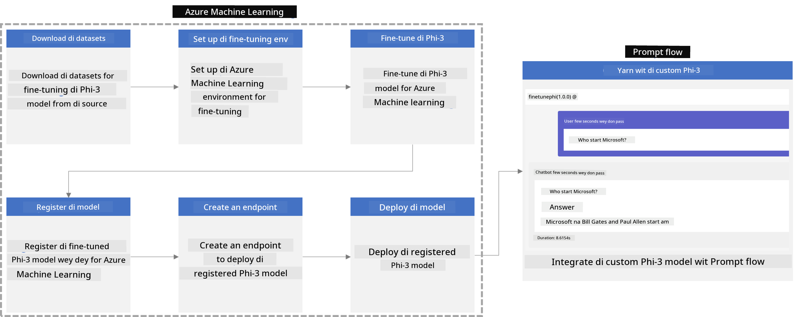
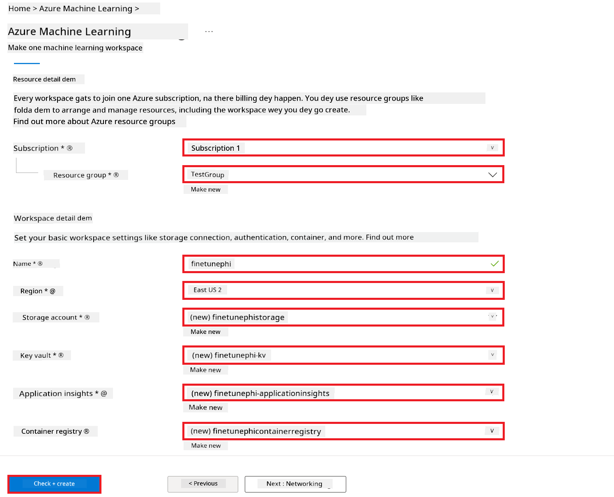
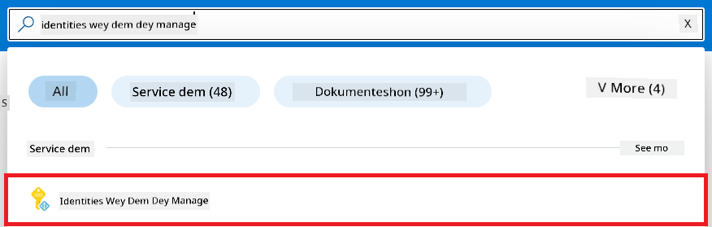
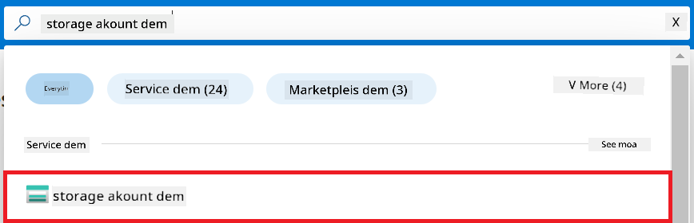
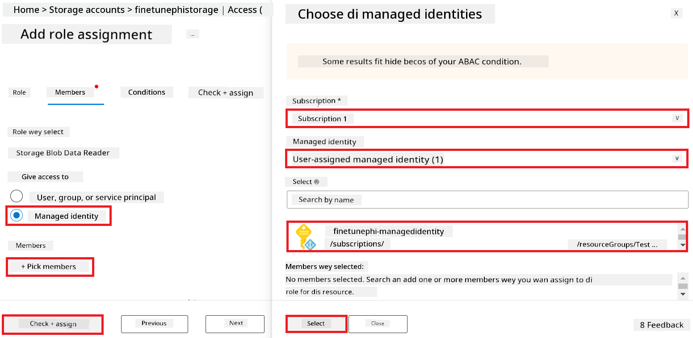
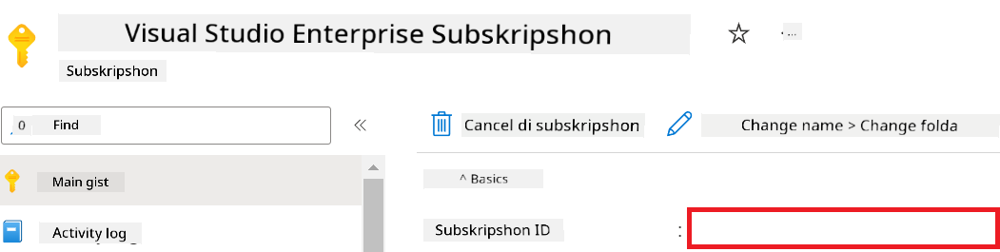
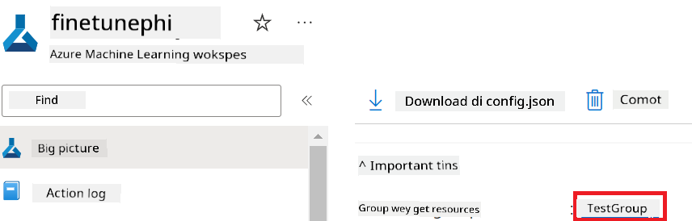
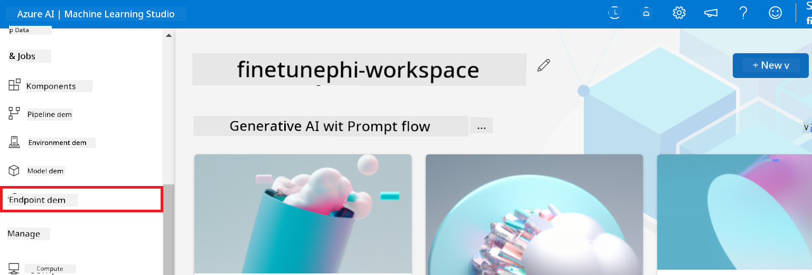
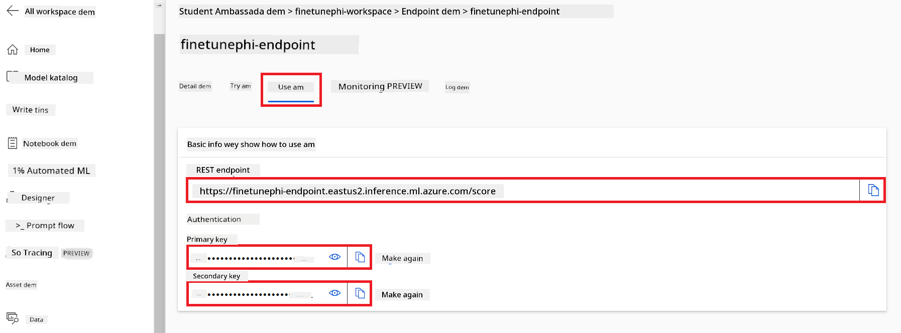

<!--
CO_OP_TRANSLATOR_METADATA:
{
  "original_hash": "455be2b7b9c3390d367d528f8fab2aa0",
  "translation_date": "2025-12-21T20:22:55+00:00",
  "source_file": "md/02.Application/01.TextAndChat/Phi3/E2E_Phi-3-FineTuning_PromptFlow_Integration.md",
  "language_code": "pcm"
}
-->
# Fine-tune an Integrate custom Phi-3 models wit Prompt flow

Dis end-to-end (E2E) sample na based on di guide "[Fine-Tune an Integrate Custom Phi-3 Models wit Prompt Flow: Step-by-Step Guide](https://techcommunity.microsoft.com/t5/educator-developer-blog/fine-tune-and-integrate-custom-phi-3-models-with-prompt-flow/ba-p/4178612?WT.mc_id=aiml-137032-kinfeylo)" from Microsoft Tech Community. E go show di steps for fine-tuning, deploying, an integrating custom Phi-3 models wit Prompt flow.

## Overview

For dis E2E sample, you go learn how to fine-tune di Phi-3 model an integrate am wit Prompt flow. By using Azure Machine Learning an Prompt flow, you go fit set up workflow for deploying an using custom AI models. Dis E2E sample divide into three scenarios:

**Scenario 1: Set up Azure resources an Prepare for fine-tuning**

**Scenario 2: Fine-tune di Phi-3 model an Deploy for Azure Machine Learning Studio**

**Scenario 3: Integrate wit Prompt flow an Chatchat wit your custom model**

Here na overview of dis E2E sample.



### Table of Contents

1. **[Scenario 1: Set up Azure resources and Prepare for fine-tuning](../../../../../../md/02.Application/01.TextAndChat/Phi3)**
    - [Create an Azure Machine Learning Workspace](../../../../../../md/02.Application/01.TextAndChat/Phi3)
    - [Request GPU quotas in Azure Subscription](../../../../../../md/02.Application/01.TextAndChat/Phi3)
    - [Add role assignment](../../../../../../md/02.Application/01.TextAndChat/Phi3)
    - [Set up project](../../../../../../md/02.Application/01.TextAndChat/Phi3)
    - [Prepare dataset for fine-tuning](../../../../../../md/02.Application/01.TextAndChat/Phi3)

1. **[Scenario 2: Fine-tune Phi-3 model and Deploy in Azure Machine Learning Studio](../../../../../../md/02.Application/01.TextAndChat/Phi3)**
    - [Set up Azure CLI](../../../../../../md/02.Application/01.TextAndChat/Phi3)
    - [Fine-tune the Phi-3 model](../../../../../../md/02.Application/01.TextAndChat/Phi3)
    - [Deploy the fine-tuned model](../../../../../../md/02.Application/01.TextAndChat/Phi3)

1. **[Scenario 3: Integrate with Prompt flow and Chat with your custom model](../../../../../../md/02.Application/01.TextAndChat/Phi3)**
    - [Integrate the custom Phi-3 model with Prompt flow](../../../../../../md/02.Application/01.TextAndChat/Phi3)
    - [Chat with your custom model](../../../../../../md/02.Application/01.TextAndChat/Phi3)

## Scenario 1: Set up Azure resources and Prepare for fine-tuning

### Create an Azure Machine Learning Workspace

1. Type *azure machine learning* for di **search bar** wey dey top di portal page an select **Azure Machine Learning** from di options wey go show.

    

1. Select **+ Create** from di navigation menu.

1. Select **New workspace** from di navigation menu.

    

1. Do di following tasks:

    - Select your Azure **Subscription**.
    - Select di **Resource group** wey you wan use (create new one if you need).
    - Enter **Workspace Name**. E gats be unique.
    - Select di **Region** wey you wan use.
    - Select di **Storage account** wey you wan use (create new one if you need).
    - Select di **Key vault** wey you wan use (create new one if you need).
    - Select di **Application insights** wey you wan use (create new one if you need).
    - Select di **Container registry** wey you wan use (create new one if you need).

    

1. Select **Review + Create**.

1. Select **Create**.

### Request GPU quotas in Azure Subscription

For dis E2E sample, you go use di *Standard_NC24ads_A100_v4 GPU* for fine-tuning, wey need quota request, an di *Standard_E4s_v3* CPU go dey used for deployment, wey no need quota request.

> [!NOTE]
>
> Only Pay-As-You-Go subscriptions (di standard subscription type) fit get GPU allocation; benefit subscriptions no dey supported yet.
>
> For people wey dey use benefit subscriptions (like Visual Studio Enterprise Subscription) or wey wan test fine-tuning an deployment quick, dis tutorial still show how you fit fine-tune wit small dataset on CPU. But make you sabi say fine-tuning results go better if you use GPU an bigger datasets.

1. Visit [Azure ML Studio](https://ml.azure.com/home?wt.mc_id=studentamb_279723).

1. Do di following tasks to request *Standard NCADSA100v4 Family* quota:

    - Select **Quota** from di left side tab.
    - Select di **Virtual machine family** wey you wan use. For example, select **Standard NCADSA100v4 Family Cluster Dedicated vCPUs**, wey include di *Standard_NC24ads_A100_v4* GPU.
    - Select di **Request quota** from di navigation menu.

        

    - For di Request quota page, enter di **New cores limit** wey you wan use. For example, 24.
    - For di Request quota page, select **Submit** to request di GPU quota.

> [!NOTE]
> You fit choose di correct GPU or CPU wey fit your need by checking [Sizes for Virtual Machines in Azure](https://learn.microsoft.com/azure/virtual-machines/sizes/overview?tabs=breakdownseries%2Cgeneralsizelist%2Ccomputesizelist%2Cmemorysizelist%2Cstoragesizelist%2Cgpusizelist%2Cfpgasizelist%2Chpcsizelist) document.

### Add role assignment

To fine-tune an deploy your models, you must first create User Assigned Managed Identity (UAI) an give am di correct permissions. Dis UAI go dey used for authentication during deployment

#### Create User Assigned Managed Identity(UAI)

1. Type *managed identities* for di **search bar** wey dey top di portal page an select **Managed Identities** from di options wey go show.

    

1. Select **+ Create**.

    

1. Do di following tasks:

    - Select your Azure **Subscription**.
    - Select di **Resource group** wey you wan use (create new one if you need).
    - Select di **Region** wey you wan use.
    - Enter di **Name**. E gats be unique.

1. Select **Review + create**.

1. Select **+ Create**.

#### Add Contributor role assignment to Managed Identity

1. Go to di Managed Identity resource wey you create.

1. Select **Azure role assignments** from di left side tab.

1. Select **+Add role assignment** from di navigation menu.

1. For di Add role assignment page, do di following tasks:
    - Select di **Scope** to **Resource group**.
    - Select your Azure **Subscription**.
    - Select di **Resource group** wey you wan use.
    - Select di **Role** to **Contributor**.

    

1. Select **Save**.

#### Add Storage Blob Data Reader role assignment to Managed Identity

1. Type *storage accounts* for di **search bar** wey dey top di portal page an select **Storage accounts** from di options wey go show.

    

1. Select di storage account wey connect to di Azure Machine Learning workspace wey you create. For example, *finetunephistorage*.

1. Do di following tasks to reach Add role assignment page:

    - Go to di Azure Storage account wey you create.
    - Select **Access Control (IAM)** from di left side tab.
    - Select **+ Add** from di navigation menu.
    - Select **Add role assignment** from di navigation menu.

    

1. For di Add role assignment page, do di following tasks:

    - For di Role page, type *Storage Blob Data Reader* for di **search bar** an select **Storage Blob Data Reader** from di options wey go show.
    - For di Role page, select **Next**.
    - For di Members page, select **Assign access to** **Managed identity**.
    - For di Members page, select **+ Select members**.
    - For di Select managed identities page, select your Azure **Subscription**.
    - For di Select managed identities page, select di **Managed identity** wey be **Manage Identity**.
    - For di Select managed identities page, select di Manage Identity wey you create. For example, *finetunephi-managedidentity*.
    - For di Select managed identities page, select **Select**.

    

1. Select **Review + assign**.

#### Add AcrPull role assignment to Managed Identity

1. Type *container registries* for di **search bar** wey dey top di portal page an select **Container registries** from di options wey go show.

    

1. Select di container registry wey connect to di Azure Machine Learning workspace. For example, *finetunephicontainerregistries*

1. Do di following tasks to reach Add role assignment page:

    - Select **Access Control (IAM)** from di left side tab.
    - Select **+ Add** from di navigation menu.
    - Select **Add role assignment** from di navigation menu.

1. For di Add role assignment page, do di following tasks:

    - For di Role page, Type *AcrPull* for di **search bar** an select **AcrPull** from di options wey go show.
    - For di Role page, select **Next**.
    - For di Members page, select **Assign access to** **Managed identity**.
    - For di Members page, select **+ Select members**.
    - For di Select managed identities page, select your Azure **Subscription**.
    - For di Select managed identities page, select di **Managed identity** wey be **Manage Identity**.
    - For di Select managed identities page, select di Manage Identity wey you create. For example, *finetunephi-managedidentity*.
    - For di Select managed identities page, select **Select**.
    - Select **Review + assign**.

### Set up project

Now, you go create folder wey you go work inside an set up virtual environment to build program wey dey interact wit users an dey use stored chat history from Azure Cosmos DB to help di responses.

#### Create a folder to work inside it

1. Open terminal window an type di following command to create folder named *finetune-phi* for di default path.

    ```console
    mkdir finetune-phi
    ```

1. Type di following command for your terminal to waka go di *finetune-phi* folder wey you create.

    ```console
    cd finetune-phi
    ```

#### Create a virtual environment

1. Type di following command for your terminal to create virtual environment named *.venv*.

    ```console
    python -m venv .venv
    ```

1. Type di following command for your terminal to activate di virtual environment.

    ```console
    .venv\Scripts\activate.bat
    ```

> [!NOTE]
>
> If e work, you go see *(.venv)* before di command prompt.

#### Install the required packages

1. Type di following commands for your terminal to install di required packages.

    ```console
    pip install datasets==2.19.1
    pip install transformers==4.41.1
    pip install azure-ai-ml==1.16.0
    pip install torch==2.3.1
    pip install trl==0.9.4
    pip install promptflow==1.12.0
    ```

#### Create project files
For dis exercise, you go create di essential files wey our project need. Dem files include scripts wey go download di dataset, set up di Azure Machine Learning environment, fine-tune di Phi-3 model, and deploy di fine-tuned model. You go still create a *conda.yml* file to set up di fine-tuning environment.

For dis exercise, you go:

- Create a *download_dataset.py* file to download di dataset.
- Create a *setup_ml.py* file to set up di Azure Machine Learning environment.
- Create a *fine_tune.py* file for di *finetuning_dir* folder to fine-tune di Phi-3 model using di dataset.
- Create a *conda.yml* file to set up di fine-tuning environment.
- Create a *deploy_model.py* file to deploy di fine-tuned model.
- Create a *integrate_with_promptflow.py* file, to integrate di fine-tuned model and run di model using Prompt flow.
- Create a flow.dag.yml file, to set up di workflow structure for Prompt flow.
- Create a *config.py* file to put your Azure information.

> [!NOTE]
>
> Di complete folder structure:
>
> ```text
> └── YourUserName
> .    └── finetune-phi
> .        ├── finetuning_dir
> .        │      └── fine_tune.py
> .        ├── conda.yml
> .        ├── config.py
> .        ├── deploy_model.py
> .        ├── download_dataset.py
> .        ├── flow.dag.yml
> .        ├── integrate_with_promptflow.py
> .        └── setup_ml.py
> ```

1. Open **Visual Studio Code**.

1. Select **File** from di menu bar.

1. Select **Open Folder**.

1. Select di *finetune-phi* folder wey you create, wey dey for *C:\Users\yourUserName\finetune-phi*.

    

1. For di left pane for Visual Studio Code, right-click and select **New File** make you create new file wey name na *download_dataset.py*.

1. For di left pane for Visual Studio Code, right-click and select **New File** make you create new file wey name na *setup_ml.py*.

1. For di left pane for Visual Studio Code, right-click and select **New File** make you create new file wey name na *deploy_model.py*.

    

1. For di left pane for Visual Studio Code, right-click and select **New Folder** make you create new folder wey name na *finetuning_dir*.

1. For di *finetuning_dir* folder, create one new file wey name na *fine_tune.py*.

#### Create and Configure *conda.yml* file

1. For di left pane for Visual Studio Code, right-click and select **New File** make you create new file wey name na *conda.yml*.

1. Add di following code to di *conda.yml* file to set up di fine-tuning environment for di Phi-3 model.

    ```yml
    name: phi-3-training-env
    channels:
      - defaults
      - conda-forge
    dependencies:
      - python=3.10
      - pip
      - numpy<2.0
      - pip:
          - torch==2.4.0
          - torchvision==0.19.0
          - trl==0.8.6
          - transformers==4.41
          - datasets==2.21.0
          - azureml-core==1.57.0
          - azure-storage-blob==12.19.0
          - azure-ai-ml==1.16
          - azure-identity==1.17.1
          - accelerate==0.33.0
          - mlflow==2.15.1
          - azureml-mlflow==1.57.0
    ```

#### Create and Configure *config.py* file

1. For di left pane for Visual Studio Code, right-click and select **New File** make you create new file wey name na *config.py*.

1. Add di following code to di *config.py* file to include your Azure information.

    ```python
    # Azure settings dem
    AZURE_SUBSCRIPTION_ID = "your_subscription_id"
    AZURE_RESOURCE_GROUP_NAME = "your_resource_group_name" # "TestGroup"

    # Azure Machine Learning settings dem
    AZURE_ML_WORKSPACE_NAME = "your_workspace_name" # "finetunephi-workspace"

    # Azure Managed Identity settings dem
    AZURE_MANAGED_IDENTITY_CLIENT_ID = "your_azure_managed_identity_client_id"
    AZURE_MANAGED_IDENTITY_NAME = "your_azure_managed_identity_name" # "finetunephi-mangedidentity"
    AZURE_MANAGED_IDENTITY_RESOURCE_ID = f"/subscriptions/{AZURE_SUBSCRIPTION_ID}/resourceGroups/{AZURE_RESOURCE_GROUP_NAME}/providers/Microsoft.ManagedIdentity/userAssignedIdentities/{AZURE_MANAGED_IDENTITY_NAME}"

    # Where dataset file dem dey
    TRAIN_DATA_PATH = "data/train_data.jsonl"
    TEST_DATA_PATH = "data/test_data.jsonl"

    # Settings wey fine-tuned model dey use
    AZURE_MODEL_NAME = "your_fine_tuned_model_name" # "finetune-phi-model"
    AZURE_ENDPOINT_NAME = "your_fine_tuned_model_endpoint_name" # "finetune-phi-endpoint"
    AZURE_DEPLOYMENT_NAME = "your_fine_tuned_model_deployment_name" # "finetune-phi-deployment"

    AZURE_ML_API_KEY = "your_fine_tuned_model_api_key"
    AZURE_ML_ENDPOINT = "your_fine_tuned_model_endpoint_uri" # "https://{your-endpoint-name}.{your-region}.inference.ml.azure.com/score"
    ```

#### Add Azure environment variables

1. Do di following things to add di Azure Subscription ID:

    - Type *subscriptions* for di **search bar** for top of di portal page and select **Subscriptions** from di options wey show.
    - Select di Azure Subscription wey you dey use now.
    - Copy and paste your Subscription ID into di *config.py* file.

    

1. Do di following things to add di Azure Workspace Name:

    - Go to di Azure Machine Learning resource wey you create.
    - Copy and paste your account name into di *config.py* file.

    

1. Do di following things to add di Azure Resource Group Name:

    - Go to di Azure Machine Learning resource wey you create.
    - Copy and paste your Azure Resource Group Name into di *config.py* file.

    

2. Do di following things to add di Azure Managed Identity name

    - Go to di Managed Identities resource wey you create.
    - Copy and paste your Azure Managed Identity name into di *config.py* file.

    

### Prepare dataset for fine-tuning

For dis exercise, you go run di *download_dataset.py* file to download di *ULTRACHAT_200k* datasets to your local environment. You go then use dis datasets to fine-tune di Phi-3 model for Azure Machine Learning.

#### Download your dataset using *download_dataset.py*

1. Open di *download_dataset.py* file for Visual Studio Code.

1. Add di following code into *download_dataset.py*.

    ```python
    import json
    import os
    from datasets import load_dataset
    from config import (
        TRAIN_DATA_PATH,
        TEST_DATA_PATH)

    def load_and_split_dataset(dataset_name, config_name, split_ratio):
        """
        Load and split a dataset.
        """
        # Load di dataset wey dem specify name, configuration, and split ratio
        dataset = load_dataset(dataset_name, config_name, split=split_ratio)
        print(f"Original dataset size: {len(dataset)}")
        
        # Split di dataset into train and test sets (80% train, 20% test)
        split_dataset = dataset.train_test_split(test_size=0.2)
        print(f"Train dataset size: {len(split_dataset['train'])}")
        print(f"Test dataset size: {len(split_dataset['test'])}")
        
        return split_dataset

    def save_dataset_to_jsonl(dataset, filepath):
        """
        Save a dataset to a JSONL file.
        """
        # Create di directory if e no dey exist
        os.makedirs(os.path.dirname(filepath), exist_ok=True)
        
        # Open di file for write mode
        with open(filepath, 'w', encoding='utf-8') as f:
            # Loop through every record inside di dataset
            for record in dataset:
                # Convert di record to JSON object and write am to di file
                json.dump(record, f)
                # Put newline character to separate records
                f.write('\n')
        
        print(f"Dataset saved to {filepath}")

    def main():
        """
        Main function to load, split, and save the dataset.
        """
        # Load an split di ULTRACHAT_200k dataset with di specific configuration and split ratio
        dataset = load_and_split_dataset("HuggingFaceH4/ultrachat_200k", 'default', 'train_sft[:1%]')
        
        # Take out di train and test datasets from di split
        train_dataset = dataset['train']
        test_dataset = dataset['test']

        # Save di train dataset to a JSONL file
        save_dataset_to_jsonl(train_dataset, TRAIN_DATA_PATH)
        
        # Save di test dataset to a separate JSONL file
        save_dataset_to_jsonl(test_dataset, TEST_DATA_PATH)

    if __name__ == "__main__":
        main()

    ```

> [!TIP]
>
> **Guidance for fine-tuning with a minimal dataset using a CPU**
>
> If you want make you use CPU for fine-tuning, dis approach good for people wey get benefit subscriptions (like Visual Studio Enterprise Subscription) or if you just wan quickly test di fine-tuning and deployment process.
>
> Replace `dataset = load_and_split_dataset("HuggingFaceH4/ultrachat_200k", 'default', 'train_sft[:1%]')` with `dataset = load_and_split_dataset("HuggingFaceH4/ultrachat_200k", 'default', 'train_sft[:10]')`
>

1. Type di following command for your terminal to run di script and download di dataset to your local environment.

    ```console
    python download_data.py
    ```

1. Verify say di datasets don save successfully to your local *finetune-phi/data* directory.

> [!NOTE]
>
> **Dataset size and fine-tuning time**
>
> For dis E2E sample, you go use only 1% of di dataset (`train_sft[:1%]`). Dis one go reduce di amount of data, make both upload and fine-tuning processes fast. You fit change di percentage to find better balance between training time and model performance. If you use smaller subset of di dataset, e go reduce di time wey fine-tuning go take, and e go make di process easier for E2E sample.

## Scenario 2: Fine-tune Phi-3 model and Deploy in Azure Machine Learning Studio

### Set up Azure CLI

You need set up Azure CLI to authenticate your environment. Azure CLI go allow you manage Azure resources straight from command line and e go give di credentials wey Azure Machine Learning need to access dem resources. To start, install [Azure CLI](https://learn.microsoft.com/cli/azure/install-azure-cli)

1. Open one terminal window and type di following command to log in to your Azure account.

    ```console
    az login
    ```

1. Select your Azure account wey you wan use.

1. Select your Azure subscription wey you wan use.

    

> [!TIP]
>
> If you dey get trouble to sign in to Azure, try use device code. Open terminal window and type di following command to sign in to your Azure account:
>
> ```console
> az login --use-device-code
> ```
>

### Fine-tune the Phi-3 model

For dis exercise, you go fine-tune di Phi-3 model using di provided dataset. First, you go define di fine-tuning process for di *fine_tune.py* file. Then, you go configure di Azure Machine Learning environment and start di fine-tuning process by running di *setup_ml.py* file. Dis script go make sure say di fine-tuning happen inside di Azure Machine Learning environment.

By running *setup_ml.py*, you go run di fine-tuning process inside di Azure Machine Learning environment.

#### Add code to the *fine_tune.py* file

1. Go inside di *finetuning_dir* folder and open di *fine_tune.py* file for Visual Studio Code.

1. Add di following code into *fine_tune.py*.

    ```python
    import argparse
    import sys
    import logging
    import os
    from datasets import load_dataset
    import torch
    import mlflow
    from transformers import AutoModelForCausalLM, AutoTokenizer, TrainingArguments
    from trl import SFTTrainer

    # Make you no go see INVALID_PARAMETER_VALUE error for MLflow, turn off MLflow integration
    os.environ["DISABLE_MLFLOW_INTEGRATION"] = "True"

    # Setup wey dem dey use for logging
    logging.basicConfig(
        format="%(asctime)s - %(levelname)s - %(name)s - %(message)s",
        datefmt="%Y-%m-%d %H:%M:%S",
        handlers=[logging.StreamHandler(sys.stdout)],
        level=logging.WARNING
    )
    logger = logging.getLogger(__name__)

    def initialize_model_and_tokenizer(model_name, model_kwargs):
        """
        Initialize the model and tokenizer with the given pretrained model name and arguments.
        """
        model = AutoModelForCausalLM.from_pretrained(model_name, **model_kwargs)
        tokenizer = AutoTokenizer.from_pretrained(model_name)
        tokenizer.model_max_length = 2048
        tokenizer.pad_token = tokenizer.unk_token
        tokenizer.pad_token_id = tokenizer.convert_tokens_to_ids(tokenizer.pad_token)
        tokenizer.padding_side = 'right'
        return model, tokenizer

    def apply_chat_template(example, tokenizer):
        """
        Apply a chat template to tokenize messages in the example.
        """
        messages = example["messages"]
        if messages[0]["role"] != "system":
            messages.insert(0, {"role": "system", "content": ""})
        example["text"] = tokenizer.apply_chat_template(
            messages, tokenize=False, add_generation_prompt=False
        )
        return example

    def load_and_preprocess_data(train_filepath, test_filepath, tokenizer):
        """
        Load and preprocess the dataset.
        """
        train_dataset = load_dataset('json', data_files=train_filepath, split='train')
        test_dataset = load_dataset('json', data_files=test_filepath, split='train')
        column_names = list(train_dataset.features)

        train_dataset = train_dataset.map(
            apply_chat_template,
            fn_kwargs={"tokenizer": tokenizer},
            num_proc=10,
            remove_columns=column_names,
            desc="Applying chat template to train dataset",
        )

        test_dataset = test_dataset.map(
            apply_chat_template,
            fn_kwargs={"tokenizer": tokenizer},
            num_proc=10,
            remove_columns=column_names,
            desc="Applying chat template to test dataset",
        )

        return train_dataset, test_dataset

    def train_and_evaluate_model(train_dataset, test_dataset, model, tokenizer, output_dir):
        """
        Train and evaluate the model.
        """
        training_args = TrainingArguments(
            bf16=True,
            do_eval=True,
            output_dir=output_dir,
            eval_strategy="epoch",
            learning_rate=5.0e-06,
            logging_steps=20,
            lr_scheduler_type="cosine",
            num_train_epochs=3,
            overwrite_output_dir=True,
            per_device_eval_batch_size=4,
            per_device_train_batch_size=4,
            remove_unused_columns=True,
            save_steps=500,
            seed=0,
            gradient_checkpointing=True,
            gradient_accumulation_steps=1,
            warmup_ratio=0.2,
        )

        trainer = SFTTrainer(
            model=model,
            args=training_args,
            train_dataset=train_dataset,
            eval_dataset=test_dataset,
            max_seq_length=2048,
            dataset_text_field="text",
            tokenizer=tokenizer,
            packing=True
        )

        train_result = trainer.train()
        trainer.log_metrics("train", train_result.metrics)

        mlflow.transformers.log_model(
            transformers_model={"model": trainer.model, "tokenizer": tokenizer},
            artifact_path=output_dir,
        )

        tokenizer.padding_side = 'left'
        eval_metrics = trainer.evaluate()
        eval_metrics["eval_samples"] = len(test_dataset)
        trainer.log_metrics("eval", eval_metrics)

    def main(train_file, eval_file, model_output_dir):
        """
        Main function to fine-tune the model.
        """
        model_kwargs = {
            "use_cache": False,
            "trust_remote_code": True,
            "torch_dtype": torch.bfloat16,
            "device_map": None,
            "attn_implementation": "eager"
        }

        # pretrained_model_name = "microsoft/Phi-3-mini-4k-instruct"
        pretrained_model_name = "microsoft/Phi-3.5-mini-instruct"

        with mlflow.start_run():
            model, tokenizer = initialize_model_and_tokenizer(pretrained_model_name, model_kwargs)
            train_dataset, test_dataset = load_and_preprocess_data(train_file, eval_file, tokenizer)
            train_and_evaluate_model(train_dataset, test_dataset, model, tokenizer, model_output_dir)

    if __name__ == "__main__":
        parser = argparse.ArgumentParser()
        parser.add_argument("--train-file", type=str, required=True, help="Path to the training data")
        parser.add_argument("--eval-file", type=str, required=True, help="Path to the evaluation data")
        parser.add_argument("--model_output_dir", type=str, required=True, help="Directory to save the fine-tuned model")
        args = parser.parse_args()
        main(args.train_file, args.eval_file, args.model_output_dir)

    ```

1. Save and close di *fine_tune.py* file.

> [!TIP]
> **You fit fine-tune Phi-3.5 model**
>
> For *fine_tune.py* file, you fit change di `pretrained_model_name` from `"microsoft/Phi-3-mini-4k-instruct"` to any model wey you wan fine-tune. For example, if you change am to `"microsoft/Phi-3.5-mini-instruct"`, you go dey use di Phi-3.5-mini-instruct model for fine-tuning. To find and use di model name wey you prefer, visit [Hugging Face](https://huggingface.co/), search for di model wey you like, then copy and paste im name into di `pretrained_model_name` field for your script.
>
> :::image type="content" source="../../imgs/03/FineTuning-PromptFlow/finetunephi3.5.png" alt-text="Fine tune Phi-3.5.":::
>

#### Add code to the *setup_ml.py* file

1. Open di *setup_ml.py* file for Visual Studio Code.

1. Add di following code into *setup_ml.py*.

    ```python
    import logging
    from azure.ai.ml import MLClient, command, Input
    from azure.ai.ml.entities import Environment, AmlCompute
    from azure.identity import AzureCliCredential
    from config import (
        AZURE_SUBSCRIPTION_ID,
        AZURE_RESOURCE_GROUP_NAME,
        AZURE_ML_WORKSPACE_NAME,
        TRAIN_DATA_PATH,
        TEST_DATA_PATH
    )

    # Di constants

    # Comot di comments for di lines below so you fit use CPU instance for training
    # COMPUTE_INSTANCE_TYPE = "Standard_E16s_v3" # cpu
    # COMPUTE_NAME = "cpu-e16s-v3"
    # DOCKER_IMAGE_NAME = "mcr.microsoft.com/azureml/openmpi4.1.0-ubuntu20.04:latest"

    # Comot di comments for di lines below so you fit use GPU instance for training
    COMPUTE_INSTANCE_TYPE = "Standard_NC24ads_A100_v4"
    COMPUTE_NAME = "gpu-nc24s-a100-v4"
    DOCKER_IMAGE_NAME = "mcr.microsoft.com/azureml/curated/acft-hf-nlp-gpu:59"

    CONDA_FILE = "conda.yml"
    LOCATION = "eastus2" # Replace am with di place wey your compute cluster dey
    FINETUNING_DIR = "./finetuning_dir" # Di path to di fine-tuning script
    TRAINING_ENV_NAME = "phi-3-training-environment" # Di name of di training environment
    MODEL_OUTPUT_DIR = "./model_output" # Di path to di model output directory for Azure ML

    # Logging setup wey go track di process
    logger = logging.getLogger(__name__)
    logging.basicConfig(
        format="%(asctime)s - %(levelname)s - %(name)s - %(message)s",
        datefmt="%Y-%m-%d %H:%M:%S",
        level=logging.WARNING
    )

    def get_ml_client():
        """
        Initialize the ML Client using Azure CLI credentials.
        """
        credential = AzureCliCredential()
        return MLClient(credential, AZURE_SUBSCRIPTION_ID, AZURE_RESOURCE_GROUP_NAME, AZURE_ML_WORKSPACE_NAME)

    def create_or_get_environment(ml_client):
        """
        Create or update the training environment in Azure ML.
        """
        env = Environment(
            image=DOCKER_IMAGE_NAME,  # Docker image for di environment
            conda_file=CONDA_FILE,  # Di Conda environment file
            name=TRAINING_ENV_NAME,  # Di name of di environment
        )
        return ml_client.environments.create_or_update(env)

    def create_or_get_compute_cluster(ml_client, compute_name, COMPUTE_INSTANCE_TYPE, location):
        """
        Create or update the compute cluster in Azure ML.
        """
        try:
            compute_cluster = ml_client.compute.get(compute_name)
            logger.info(f"Compute cluster '{compute_name}' already exists. Reusing it for the current run.")
        except Exception:
            logger.info(f"Compute cluster '{compute_name}' does not exist. Creating a new one with size {COMPUTE_INSTANCE_TYPE}.")
            compute_cluster = AmlCompute(
                name=compute_name,
                size=COMPUTE_INSTANCE_TYPE,
                location=location,
                tier="Dedicated",  # Tier of di compute cluster
                min_instances=0,  # Minimum number of instances
                max_instances=1  # Maximum number of instances
            )
            ml_client.compute.begin_create_or_update(compute_cluster).wait()  # Wait make dem create di cluster
        return compute_cluster

    def create_fine_tuning_job(env, compute_name):
        """
        Set up the fine-tuning job in Azure ML.
        """
        return command(
            code=FINETUNING_DIR,  # Di path to fine_tune.py
            command=(
                "python fine_tune.py "
                "--train-file ${{inputs.train_file}} "
                "--eval-file ${{inputs.eval_file}} "
                "--model_output_dir ${{inputs.model_output}}"
            ),
            environment=env,  # Training environment
            compute=compute_name,  # Compute cluster wey you go use
            inputs={
                "train_file": Input(type="uri_file", path=TRAIN_DATA_PATH),  # Di path to di training data file
                "eval_file": Input(type="uri_file", path=TEST_DATA_PATH),  # Di path to di evaluation data file
                "model_output": MODEL_OUTPUT_DIR
            }
        )

    def main():
        """
        Main function to set up and run the fine-tuning job in Azure ML.
        """
        # Initialize di ML Client
        ml_client = get_ml_client()

        # Create di environment
        env = create_or_get_environment(ml_client)
        
        # Create or grab existing compute cluster
        create_or_get_compute_cluster(ml_client, COMPUTE_NAME, COMPUTE_INSTANCE_TYPE, LOCATION)

        # Create and submit fine-tuning job
        job = create_fine_tuning_job(env, COMPUTE_NAME)
        returned_job = ml_client.jobs.create_or_update(job)  # Submit di job
        ml_client.jobs.stream(returned_job.name)  # Stream di job logs
        
        # Capture di job name
        job_name = returned_job.name
        print(f"Job name: {job_name}")

    if __name__ == "__main__":
        main()

    ```

1. Replace `COMPUTE_INSTANCE_TYPE`, `COMPUTE_NAME`, and `LOCATION` with your correct details.

    ```python
   # Take away di comment for di lines wey follow make e use GPU instance for training
    COMPUTE_INSTANCE_TYPE = "Standard_NC24ads_A100_v4"
    COMPUTE_NAME = "gpu-nc24s-a100-v4"
    ...
    LOCATION = "eastus2" # Change am to di location wey your compute cluster dey
    ```

> [!TIP]
>
> **Guidance for fine-tuning with a minimal dataset using a CPU**
>
> If you want use CPU for fine-tuning, dis approach good for people with benefit subscriptions (like Visual Studio Enterprise Subscription) or to quickly test di fine-tuning and deployment process.
>
> 1. Open di *setup_ml* file.
> 1. Replace `COMPUTE_INSTANCE_TYPE`, `COMPUTE_NAME`, and `DOCKER_IMAGE_NAME` with di following. If you no get access to *Standard_E16s_v3*, you fit use another CPU instance wey similar or request new quota.
> 1. Replace `LOCATION` with your specific details.
>
>    ```python
>    # Uncomment the following lines to use a CPU instance for training
>    COMPUTE_INSTANCE_TYPE = "Standard_E16s_v3" # cpu
>    COMPUTE_NAME = "cpu-e16s-v3"
>    DOCKER_IMAGE_NAME = "mcr.microsoft.com/azureml/openmpi4.1.0-ubuntu20.04:latest"
>    LOCATION = "eastus2" # Replace with the location of your compute cluster
>    ```
>

1. Type di following command to run di *setup_ml.py* script and start di fine-tuning process for Azure Machine Learning.

    ```python
    python setup_ml.py
    ```

1. For dis exercise, you don successfully fine-tune di Phi-3 model using Azure Machine Learning. By running di *setup_ml.py* script, you don set up di Azure Machine Learning environment and start di fine-tuning process wey dey define for *fine_tune.py* file. Abeg note say di fine-tuning process fit take plenty time. After you run `python setup_ml.py` command, you go need wait make di process finish. You fit monitor di status of di fine-tuning job by following di link wey dem show for terminal go Azure Machine Learning portal.

    

### Deploy the fine-tuned model

To integrate di fine-tuned Phi-3 model with Prompt Flow, you need deploy di model so dat e go dey available for real-time inference. Dis process include register di model, create online endpoint, and deploy di model.

#### Set the model name, endpoint name, and deployment name for deployment

1. Open *config.py* file.

1. Replace `AZURE_MODEL_NAME = "your_fine_tuned_model_name"` with di name wey you want give your model.

1. Replace `AZURE_ENDPOINT_NAME = "your_fine_tuned_model_endpoint_name"` with di name wey you want give your endpoint.

1. Replace `AZURE_DEPLOYMENT_NAME = "your_fine_tuned_model_deployment_name"` with di name wey you want give your deployment.

#### Add code to the *deploy_model.py* file

Running di *deploy_model.py* file go automate di whole deployment process. E go register di model, create di endpoint, and run di deployment based on di settings wey dey inside di config.py file, wey include di model name, endpoint name, and deployment name.

1. Open di *deploy_model.py* file for Visual Studio Code.

1. Add di following code into *deploy_model.py*.

    ```python
    import logging
    from azure.identity import AzureCliCredential
    from azure.ai.ml import MLClient
    from azure.ai.ml.entities import Model, ProbeSettings, ManagedOnlineEndpoint, ManagedOnlineDeployment, IdentityConfiguration, ManagedIdentityConfiguration, OnlineRequestSettings
    from azure.ai.ml.constants import AssetTypes

    # Import di configuration
    from config import (
        AZURE_SUBSCRIPTION_ID,
        AZURE_RESOURCE_GROUP_NAME,
        AZURE_ML_WORKSPACE_NAME,
        AZURE_MANAGED_IDENTITY_RESOURCE_ID,
        AZURE_MANAGED_IDENTITY_CLIENT_ID,
        AZURE_MODEL_NAME,
        AZURE_ENDPOINT_NAME,
        AZURE_DEPLOYMENT_NAME
    )

    # Constants dem
    JOB_NAME = "your-job-name"
    COMPUTE_INSTANCE_TYPE = "Standard_E4s_v3"

    deployment_env_vars = {
        "SUBSCRIPTION_ID": AZURE_SUBSCRIPTION_ID,
        "RESOURCE_GROUP_NAME": AZURE_RESOURCE_GROUP_NAME,
        "UAI_CLIENT_ID": AZURE_MANAGED_IDENTITY_CLIENT_ID,
    }

    # Set up di logging
    logging.basicConfig(
        format="%(asctime)s - %(levelname)s - %(name)s - %(message)s",
        datefmt="%Y-%m-%d %H:%M:%S",
        level=logging.DEBUG
    )
    logger = logging.getLogger(__name__)

    def get_ml_client():
        """Initialize and return the ML Client."""
        credential = AzureCliCredential()
        return MLClient(credential, AZURE_SUBSCRIPTION_ID, AZURE_RESOURCE_GROUP_NAME, AZURE_ML_WORKSPACE_NAME)

    def register_model(ml_client, model_name, job_name):
        """Register a new model."""
        model_path = f"azureml://jobs/{job_name}/outputs/artifacts/paths/model_output"
        logger.info(f"Registering model {model_name} from job {job_name} at path {model_path}.")
        run_model = Model(
            path=model_path,
            name=model_name,
            description="Model created from run.",
            type=AssetTypes.MLFLOW_MODEL,
        )
        model = ml_client.models.create_or_update(run_model)
        logger.info(f"Registered model ID: {model.id}")
        return model

    def delete_existing_endpoint(ml_client, endpoint_name):
        """Delete existing endpoint if it exists."""
        try:
            endpoint_result = ml_client.online_endpoints.get(name=endpoint_name)
            logger.info(f"Deleting existing endpoint {endpoint_name}.")
            ml_client.online_endpoints.begin_delete(name=endpoint_name).result()
            logger.info(f"Deleted existing endpoint {endpoint_name}.")
        except Exception as e:
            logger.info(f"No existing endpoint {endpoint_name} found to delete: {e}")

    def create_or_update_endpoint(ml_client, endpoint_name, description=""):
        """Create or update an endpoint."""
        delete_existing_endpoint(ml_client, endpoint_name)
        logger.info(f"Creating new endpoint {endpoint_name}.")
        endpoint = ManagedOnlineEndpoint(
            name=endpoint_name,
            description=description,
            identity=IdentityConfiguration(
                type="user_assigned",
                user_assigned_identities=[ManagedIdentityConfiguration(resource_id=AZURE_MANAGED_IDENTITY_RESOURCE_ID)]
            )
        )
        endpoint_result = ml_client.online_endpoints.begin_create_or_update(endpoint).result()
        logger.info(f"Created new endpoint {endpoint_name}.")
        return endpoint_result

    def create_or_update_deployment(ml_client, endpoint_name, deployment_name, model):
        """Create or update a deployment."""

        logger.info(f"Creating deployment {deployment_name} for endpoint {endpoint_name}.")
        deployment = ManagedOnlineDeployment(
            name=deployment_name,
            endpoint_name=endpoint_name,
            model=model.id,
            instance_type=COMPUTE_INSTANCE_TYPE,
            instance_count=1,
            environment_variables=deployment_env_vars,
            request_settings=OnlineRequestSettings(
                max_concurrent_requests_per_instance=3,
                request_timeout_ms=180000,
                max_queue_wait_ms=120000
            ),
            liveness_probe=ProbeSettings(
                failure_threshold=30,
                success_threshold=1,
                period=100,
                initial_delay=500,
            ),
            readiness_probe=ProbeSettings(
                failure_threshold=30,
                success_threshold=1,
                period=100,
                initial_delay=500,
            ),
        )
        deployment_result = ml_client.online_deployments.begin_create_or_update(deployment).result()
        logger.info(f"Created deployment {deployment.name} for endpoint {endpoint_name}.")
        return deployment_result

    def set_traffic_to_deployment(ml_client, endpoint_name, deployment_name):
        """Set traffic to the specified deployment."""
        try:
            # Get di current endpoint details
            endpoint = ml_client.online_endpoints.get(name=endpoint_name)
            
            # Log di current traffic allocation for debugging
            logger.info(f"Current traffic allocation: {endpoint.traffic}")
            
            # Set di traffic allocation for di deployment
            endpoint.traffic = {deployment_name: 100}
            
            # Update di endpoint with di new traffic allocation
            endpoint_poller = ml_client.online_endpoints.begin_create_or_update(endpoint)
            updated_endpoint = endpoint_poller.result()
            
            # Log di updated traffic allocation for debugging
            logger.info(f"Updated traffic allocation: {updated_endpoint.traffic}")
            logger.info(f"Set traffic to deployment {deployment_name} at endpoint {endpoint_name}.")
            return updated_endpoint
        except Exception as e:
            # Log any errors wey happen during di process
            logger.error(f"Failed to set traffic to deployment: {e}")
            raise


    def main():
        ml_client = get_ml_client()

        registered_model = register_model(ml_client, AZURE_MODEL_NAME, JOB_NAME)
        logger.info(f"Registered model ID: {registered_model.id}")

        endpoint = create_or_update_endpoint(ml_client, AZURE_ENDPOINT_NAME, "Endpoint for finetuned Phi-3 model")
        logger.info(f"Endpoint {AZURE_ENDPOINT_NAME} is ready.")

        try:
            deployment = create_or_update_deployment(ml_client, AZURE_ENDPOINT_NAME, AZURE_DEPLOYMENT_NAME, registered_model)
            logger.info(f"Deployment {AZURE_DEPLOYMENT_NAME} is created for endpoint {AZURE_ENDPOINT_NAME}.")

            set_traffic_to_deployment(ml_client, AZURE_ENDPOINT_NAME, AZURE_DEPLOYMENT_NAME)
            logger.info(f"Traffic is set to deployment {AZURE_DEPLOYMENT_NAME} at endpoint {AZURE_ENDPOINT_NAME}.")
        except Exception as e:
            logger.error(f"Failed to create or update deployment: {e}")

    if __name__ == "__main__":
        main()

    ```

1. Do di following steps to get di `JOB_NAME`:

    - Go to di Azure Machine Learning resource wey you create.
    - Select **Studio web URL** to open di Azure Machine Learning workspace.
    - Select **Jobs** from di left side tab.
    - Select di experiment for fine-tuning. For example, *finetunephi*.
    - Select di job wey you create.
    - Copy an paste your job Name into the `JOB_NAME = "your-job-name"` in *deploy_model.py* file.

1. Replace `COMPUTE_INSTANCE_TYPE` wit your specific details.

1. Type the following command to run the *deploy_model.py* script and start the deployment process in Azure Machine Learning.

    ```python
    python deploy_model.py
    ```

> [!WARNING]
> Make sure say you delete the endpoint wey dem create for the Azure Machine Learning workspace so you no go get extra charges for your account.
>

#### Check deployment status in Azure Machine Learning Workspace

1. Go visit [Azure ML Studio](https://ml.azure.com/home?wt.mc_id=studentamb_279723).

1. Navigate to the Azure Machine Learning workspace wey you created.

1. Select **Studio web URL** to open the Azure Machine Learning workspace.

1. Select **Endpoints** from the left side tab.

    

2. Select the endpoint wey you created.

    

3. On this page, you fit manage the endpoints wey dem create during the deployment process.

## Scenario 3: Integrate with Prompt flow and Chat with your custom model

### Integrate the custom Phi-3 model with Prompt flow

After you don successfully deploy your fine-tuned model, you fit now integrate am with Prompt flow to use your model for real-time applications, enabling plenty interactive tasks with your custom Phi-3 model.

#### Set api key and endpoint uri of the fine-tuned Phi-3 model

1. Navigate to the Azure Machine learning workspace that you created.
1. Select **Endpoints** from the left side tab.
1. Select the endpoint wey you created.
1. Select **Consume** from the navigation menu.
1. Copy an paste your **REST endpoint** into the *config.py* file, replacing `AZURE_ML_ENDPOINT = "your_fine_tuned_model_endpoint_uri"` with your **REST endpoint**.
1. Copy an paste your **Primary key** into the *config.py* file, replacing `AZURE_ML_API_KEY = "your_fine_tuned_model_api_key"` with your **Primary key**.

    

#### Add code to the *flow.dag.yml* file

1. Open the *flow.dag.yml* file in Visual Studio Code.

1. Add the following code into *flow.dag.yml*.

    ```yml
    inputs:
      input_data:
        type: string
        default: "Who founded Microsoft?"

    outputs:
      answer:
        type: string
        reference: ${integrate_with_promptflow.output}

    nodes:
    - name: integrate_with_promptflow
      type: python
      source:
        type: code
        path: integrate_with_promptflow.py
      inputs:
        input_data: ${inputs.input_data}
    ```

#### Add code to the *integrate_with_promptflow.py* file

1. Open the *integrate_with_promptflow.py* file in Visual Studio Code.

1. Add the following code into *integrate_with_promptflow.py*.

    ```python
    import logging
    import requests
    from promptflow.core import tool
    import asyncio
    import platform
    from config import (
        AZURE_ML_ENDPOINT,
        AZURE_ML_API_KEY
    )

    # Setup wey dem take dey log
    logging.basicConfig(
        format="%(asctime)s - %(levelname)s - %(name)s - %(message)s",
        datefmt="%Y-%m-%d %H:%M:%S",
        level=logging.DEBUG
    )
    logger = logging.getLogger(__name__)

    def query_azml_endpoint(input_data: list, endpoint_url: str, api_key: str) -> str:
        """
        Send a request to the Azure ML endpoint with the given input data.
        """
        headers = {
            "Content-Type": "application/json",
            "Authorization": f"Bearer {api_key}"
        }
        data = {
            "input_data": [input_data],
            "params": {
                "temperature": 0.7,
                "max_new_tokens": 128,
                "do_sample": True,
                "return_full_text": True
            }
        }
        try:
            response = requests.post(endpoint_url, json=data, headers=headers)
            response.raise_for_status()
            result = response.json()[0]
            logger.info("Successfully received response from Azure ML Endpoint.")
            return result
        except requests.exceptions.RequestException as e:
            logger.error(f"Error querying Azure ML Endpoint: {e}")
            raise

    def setup_asyncio_policy():
        """
        Setup asyncio event loop policy for Windows.
        """
        if platform.system() == 'Windows':
            asyncio.set_event_loop_policy(asyncio.WindowsSelectorEventLoopPolicy())
            logger.info("Set Windows asyncio event loop policy.")

    @tool
    def my_python_tool(input_data: str) -> str:
        """
        Tool function to process input data and query the Azure ML endpoint.
        """
        setup_asyncio_policy()
        return query_azml_endpoint(input_data, AZURE_ML_ENDPOINT, AZURE_ML_API_KEY)

    ```

### Chat with your custom model

1. Type the following command to run the *deploy_model.py* script and start the deployment process in Azure Machine Learning.

    ```python
    pf flow serve --source ./ --port 8080 --host localhost
    ```

1. Dis na example of the results: Now you fit chat wit your custom Phi-3 model. E dey recommended make you ask questions wey base on the data wey dem use for fine-tuning.

    

---

<!-- CO-OP TRANSLATOR DISCLAIMER START -->
Abeg note:
Dem use AI translation service [Co-op Translator] (https://github.com/Azure/co-op-translator) take translate dis document. Even though we dey try our best make am correct, abeg sabi say automated translations fit get mistakes or no too accurate. The original document for im original language na the authoritative source. If na critical matter, e better make professional human translator handle am. We no go dey liable for any misunderstanding or wrong interpretation wey fit come from using this translation.
<!-- CO-OP TRANSLATOR DISCLAIMER END -->