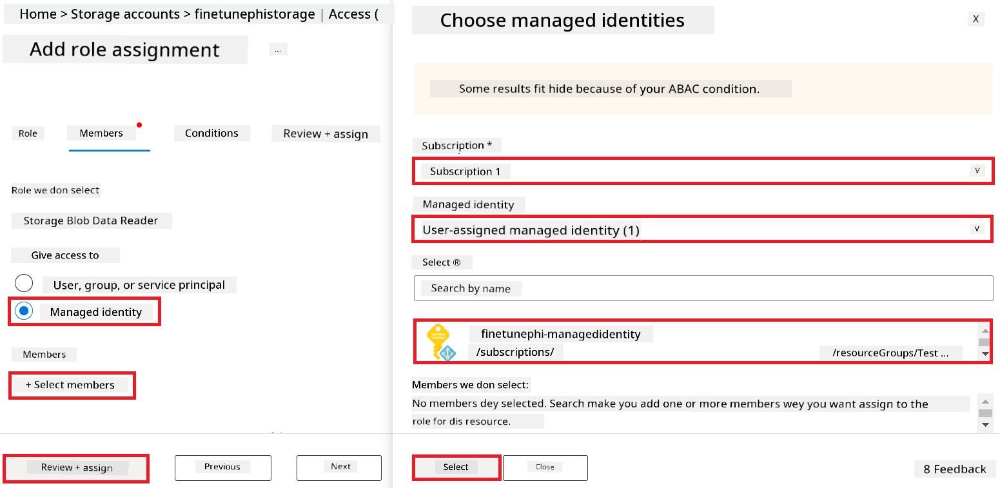
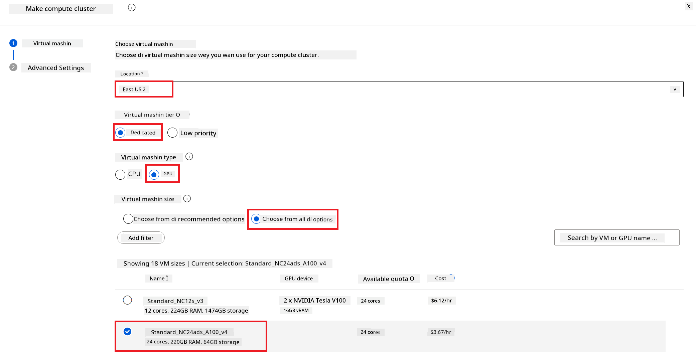
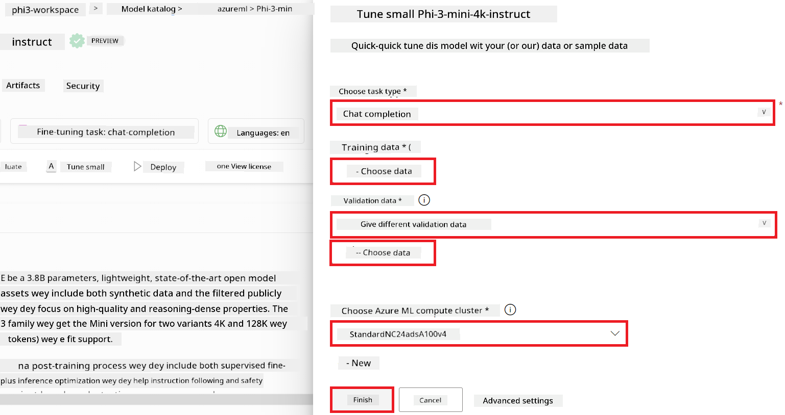
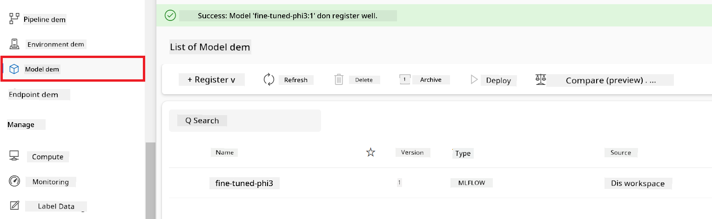
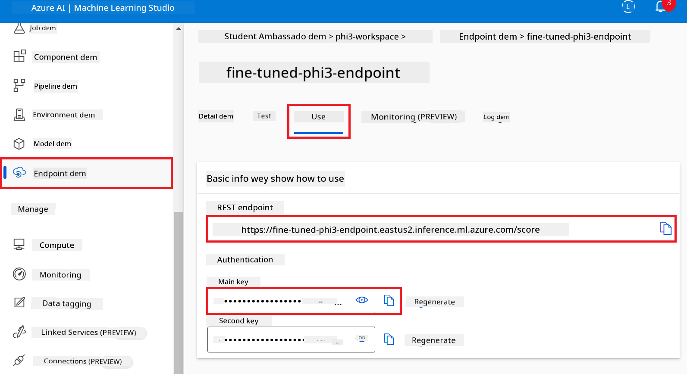
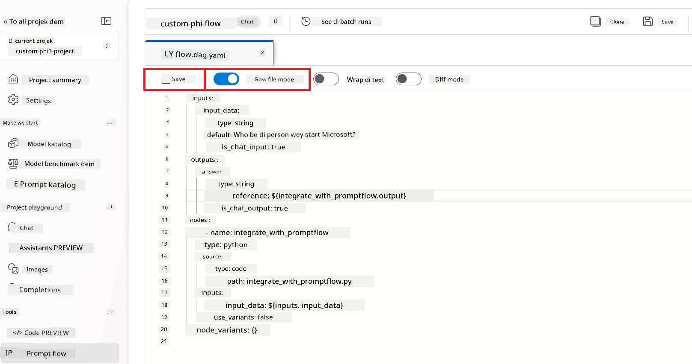
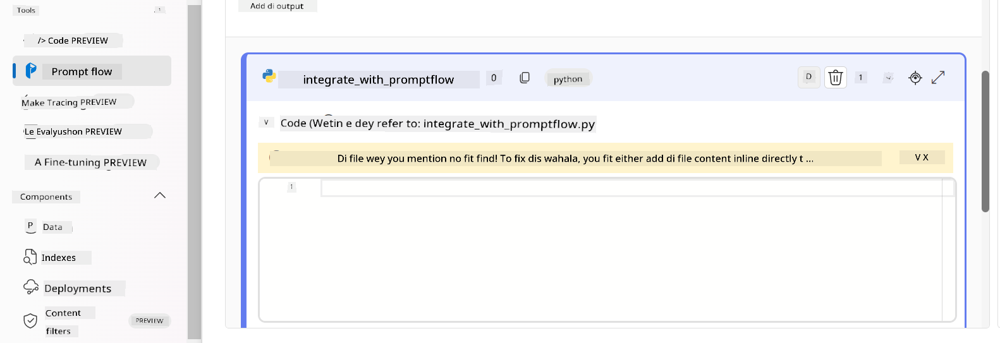
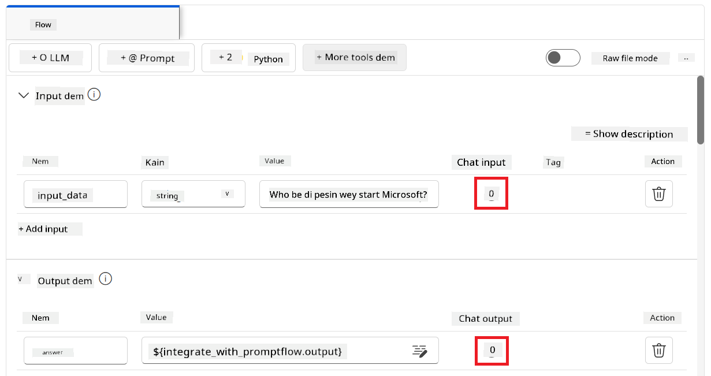
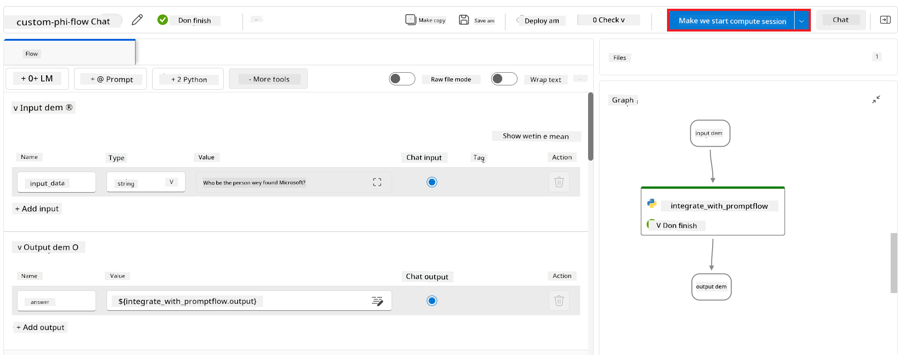
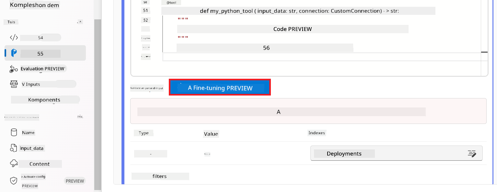

<!--
CO_OP_TRANSLATOR_METADATA:
{
  "original_hash": "ecbd9179a21edbaafaf114d47f09f3e3",
  "translation_date": "2025-12-21T20:42:13+00:00",
  "source_file": "md/02.Application/01.TextAndChat/Phi3/E2E_Phi-3-FineTuning_PromptFlow_Integration_AIFoundry.md",
  "language_code": "pcm"
}
-->
# Fine-tune and Integrate custom Phi-3 models with Prompt flow in Azure AI Foundry

This end-to-end (E2E) sample dey based on di guide "[Fine-Tune and Integrate Custom Phi-3 Models with Prompt Flow in Azure AI Foundry](https://techcommunity.microsoft.com/t5/educator-developer-blog/fine-tune-and-integrate-custom-phi-3-models-with-prompt-flow-in/ba-p/4191726?WT.mc_id=aiml-137032-kinfeylo)" from Microsoft Tech Community. E dey introduce di process dem for fine-tuning, deploying, an integrating custom Phi-3 models wit Prompt flow for Azure AI Foundry.
No like di E2E sample, "[Fine-Tune and Integrate Custom Phi-3 Models with Prompt Flow](./E2E_Phi-3-FineTuning_PromptFlow_Integration.md)", wey require to run code for local machine, dis tutorial dey focus complete on fine-tuning an integrating your model inside Azure AI / ML Studio.

## Overview

For dis E2E sample, you go learn how to fine-tune di Phi-3 model an integrate am wit Prompt flow for Azure AI Foundry. By using Azure AI / ML Studio, you go set up workflow to deploy an use custom AI models. Dis E2E sample divide into three scenarios:

**Scenario 1: Set up Azure resources and Prepare for fine-tuning**

**Scenario 2: Fine-tune the Phi-3 model and Deploy in Azure Machine Learning Studio**

**Scenario 3: Integrate with Prompt flow and Chat with your custom model in Azure AI Foundry**

Below na small overview of dis E2E sample.


### Table of Contents

1. **[Scenario 1: Set up Azure resources and Prepare for fine-tuning](../../../../../../md/02.Application/01.TextAndChat/Phi3)**
    - [Create an Azure Machine Learning Workspace](../../../../../../md/02.Application/01.TextAndChat/Phi3)
    - [Request GPU quotas in Azure Subscription](../../../../../../md/02.Application/01.TextAndChat/Phi3)
    - [Add role assignment](../../../../../../md/02.Application/01.TextAndChat/Phi3)
    - [Set up project](../../../../../../md/02.Application/01.TextAndChat/Phi3)
    - [Prepare dataset for fine-tuning](../../../../../../md/02.Application/01.TextAndChat/Phi3)

1. **[Scenario 2: Fine-tune Phi-3 model and Deploy in Azure Machine Learning Studio](../../../../../../md/02.Application/01.TextAndChat/Phi3)**
    - [Fine-tune the Phi-3 model](../../../../../../md/02.Application/01.TextAndChat/Phi3)
    - [Deploy the fine-tuned Phi-3 model](../../../../../../md/02.Application/01.TextAndChat/Phi3)

1. **[Scenario 3: Integrate with Prompt flow and Chat with your custom model in Azure AI Foundry](../../../../../../md/02.Application/01.TextAndChat/Phi3)**
    - [Integrate the custom Phi-3 model with Prompt flow](../../../../../../md/02.Application/01.TextAndChat/Phi3)
    - [Chat with your custom Phi-3 model](../../../../../../md/02.Application/01.TextAndChat/Phi3)

## Scenario 1: Set up Azure resources and Prepare for fine-tuning

### Create an Azure Machine Learning Workspace

1. Type *azure machine learning* for di **search bar** wey dey top of di portal page an select **Azure Machine Learning** from di options wey go show.

    

2. Select **+ Create** from di navigation menu.

3. Select **New workspace** from di navigation menu.

    

4. Do di following tasks:

    - Select your Azure **Subscription**.
    - Select di **Resource group** wey you go use (create new one if you need).
    - Enter **Workspace Name**. E must be unique.
    - Select di **Region** wey you wan use.
    - Select di **Storage account** wey you go use (create new one if you need).
    - Select di **Key vault** wey you go use (create new one if you need).
    - Select di **Application insights** wey you go use (create new one if you need).
    - Select di **Container registry** wey you go use (create new one if you need).

    

5. Select **Review + Create**.

6. Select **Create**.

### Request GPU quotas in Azure Subscription

For dis tutorial, you go learn how to fine-tune an deploy a Phi-3 model, using GPUs. For fine-tuning, you go use di *Standard_NC24ads_A100_v4* GPU, wey need quota request. For deployment, you go use di *Standard_NC6s_v3* GPU, wey also need quota request.

> [!NOTE]
>
> Only Pay-As-You-Go subscriptions (di standard subscription type) fit get GPU allocation; benefit subscriptions no dey supported now.
>

1. Visit [Azure ML Studio](https://ml.azure.com/home?wt.mc_id=studentamb_279723).

1. Do di following tasks to request *Standard NCADSA100v4 Family* quota:

    - Select **Quota** from di left side tab.
    - Select di **Virtual machine family** wey you want use. For example, select **Standard NCADSA100v4 Family Cluster Dedicated vCPUs**, wey include di *Standard_NC24ads_A100_v4* GPU.
    - Select di **Request quota** from di navigation menu.

        

    - For di Request quota page, enter di **New cores limit** wey you wan use. For example, 24.
    - For di Request quota page, select **Submit** to request di GPU quota.

1. Do di following tasks to request *Standard NCSv3 Family* quota:

    - Select **Quota** from di left side tab.
    - Select di **Virtual machine family** wey you want use. For example, select **Standard NCSv3 Family Cluster Dedicated vCPUs**, wey include di *Standard_NC6s_v3* GPU.
    - Select di **Request quota** from di navigation menu.
    - For di Request quota page, enter di **New cores limit** wey you wan use. For example, 24.
    - For di Request quota page, select **Submit** to request di GPU quota.

### Add role assignment

To fine-tune an deploy your models, you must first create a User Assigned Managed Identity (UAI) an give am correct permissions. Dis UAI go dey used for authentication during deployment

#### Create User Assigned Managed Identity(UAI)

1. Type *managed identities* for di **search bar** wey dey top of di portal page an select **Managed Identities** from di options wey go show.

    

1. Select **+ Create**.

    

1. Do di following tasks:

    - Select your Azure **Subscription**.
    - Select di **Resource group** wey you go use (create new one if you need).
    - Select di **Region** wey you wan use.
    - Enter di **Name**. E must be unique.

    

1. Select **Review + create**.

1. Select **+ Create**.

#### Add Contributor role assignment to Managed Identity

1. Go to di Managed Identity resource wey you create.

1. Select **Azure role assignments** from di left side tab.

1. Select **+Add role assignment** from di navigation menu.

1. For Add role assignment page, do di following tasks:
    - Select di **Scope** to **Resource group**.
    - Select your Azure **Subscription**.
    - Select di **Resource group** wey you go use.
    - Select di **Role** to **Contributor**.

    

2. Select **Save**.

#### Add Storage Blob Data Reader role assignment to Managed Identity

1. Type *storage accounts* for di **search bar** wey dey top of di portal page an select **Storage accounts** from di options wey go show.

    

1. Select di storage account wey join wit di Azure Machine Learning workspace wey you create. For example, *finetunephistorage*.

1. Do di following tasks to go Add role assignment page:

    - Go to di Azure Storage account wey you create.
    - Select **Access Control (IAM)** from di left side tab.
    - Select **+ Add** from di navigation menu.
    - Select **Add role assignment** from di navigation menu.

    

1. For Add role assignment page, do di following tasks:

    - For di Role page, type *Storage Blob Data Reader* for di **search bar** an select **Storage Blob Data Reader** from di options wey go show.
    - For di Role page, select **Next**.
    - For di Members page, select **Assign access to** **Managed identity**.
    - For di Members page, select **+ Select members**.
    - For di Select managed identities page, select your Azure **Subscription**.
    - For di Select managed identities page, select di **Managed identity** to **Manage Identity**.
    - For di Select managed identities page, select di Manage Identity wey you create. For example, *finetunephi-managedidentity*.
    - For di Select managed identities page, select **Select**.

    

1. Select **Review + assign**.

#### Add AcrPull role assignment to Managed Identity

1. Type *container registries* for di **search bar** wey dey top of di portal page an select **Container registries** from di options wey go show.

    

1. Select di container registry wey join wit di Azure Machine Learning workspace. For example, *finetunephicontainerregistry*

1. Do di following tasks to go Add role assignment page:

    - Select **Access Control (IAM)** from di left side tab.
    - Select **+ Add** from di navigation menu.
    - Select **Add role assignment** from di navigation menu.

1. For Add role assignment page, do di following tasks:

    - For di Role page, Type *AcrPull* for di **search bar** an select **AcrPull** from di options wey go show.
    - For di Role page, select **Next**.
    - For di Members page, select **Assign access to** **Managed identity**.
    - For di Members page, select **+ Select members**.
    - For di Select managed identities page, select your Azure **Subscription**.
    - For di Select managed identities page, select di **Managed identity** to **Manage Identity**.
    - For di Select managed identities page, select di Manage Identity wey you create. For example, *finetunephi-managedidentity*.
    - For di Select managed identities page, select **Select**.
    - Select **Review + assign**.

### Set up project

To download di datasets wey you need for fine-tuning, you go set up local environment.

For dis exercise, you go

- Create one folder to work inside.
- Create virtual environment.
- Install di required packages.
- Create *download_dataset.py* file to download di dataset.

#### Create a folder to work inside it

1. Open terminal window an type dis command to create one folder wey name na *finetune-phi* for di default path.

    ```console
    mkdir finetune-phi
    ```

2. Type di following command for your terminal to navigate go inside di *finetune-phi* folder wey you don create.

    ```console
    cd finetune-phi
    ```

#### Create a virtual environment

1. Type di following command for your terminal to create virtual environment wey dem name *.venv*.

    ```console
    python -m venv .venv
    ```

2. Type di following command for your terminal to activate di virtual environment.

    ```console
    .venv\Scripts\activate.bat
    ```

> [!NOTE]
> If e work, you go see *(.venv)* before di command prompt.

#### Install di required packages

1. Type di following commands for your terminal to install di required packages.

    ```console
    pip install datasets==2.19.1
    ```

#### Create `donload_dataset.py`

> [!NOTE]
> Complete folder structure:
>
> ```text
> └── YourUserName
> .    └── finetune-phi
> .        └── download_dataset.py
> ```

1. Open **Visual Studio Code**.

1. Select **File** from di menu bar.

1. Select **Open Folder**.

1. Select di *finetune-phi* folder wey you create, wey dey for *C:\Users\yourUserName\finetune-phi*.

    

1. For left pane for Visual Studio Code, right-click and select **New File** make you create new file wey dem go name *download_dataset.py*.

    

### Prepare dataset for fine-tuning

For dis exercise, you go run di *download_dataset.py* file to download di *ultrachat_200k* datasets to your local environment. You go den use these datasets to fine-tune di Phi-3 model for Azure Machine Learning.

For dis exercise, you go:

- Add code to di *download_dataset.py* file to download di datasets.
- Run di *download_dataset.py* file to download di datasets to your local environment.

#### Download your dataset using *download_dataset.py*

1. Open di *download_dataset.py* file for Visual Studio Code.

1. Add di following code inside di *download_dataset.py* file.

    ```python
    import json
    import os
    from datasets import load_dataset

    def load_and_split_dataset(dataset_name, config_name, split_ratio):
        """
        Load and split a dataset.
        """
        # Load di dataset wey dem give name, configuration, an di split ratio
        dataset = load_dataset(dataset_name, config_name, split=split_ratio)
        print(f"Original dataset size: {len(dataset)}")
        
        # Split di dataset into train an test sets (80% train, 20% test)
        split_dataset = dataset.train_test_split(test_size=0.2)
        print(f"Train dataset size: {len(split_dataset['train'])}")
        print(f"Test dataset size: {len(split_dataset['test'])}")
        
        return split_dataset

    def save_dataset_to_jsonl(dataset, filepath):
        """
        Save a dataset to a JSONL file.
        """
        # Create di directory if e no dey
        os.makedirs(os.path.dirname(filepath), exist_ok=True)
        
        # Open di file for write mode
        with open(filepath, 'w', encoding='utf-8') as f:
            # Iterate over each record inside di dataset
            for record in dataset:
                # Dump di record as JSON object an write am to di file
                json.dump(record, f)
                # Write one newline character make records separate
                f.write('\n')
        
        print(f"Dataset saved to {filepath}")

    def main():
        """
        Main function to load, split, and save the dataset.
        """
        # Load an split di ULTRACHAT_200k dataset with di specific configuration an split ratio
        dataset = load_and_split_dataset("HuggingFaceH4/ultrachat_200k", 'default', 'train_sft[:1%]')
        
        # Extract di train an test datasets from di split
        train_dataset = dataset['train']
        test_dataset = dataset['test']

        # Save di train dataset to one JSONL file
        save_dataset_to_jsonl(train_dataset, "data/train_data.jsonl")
        
        # Save di test dataset to another JSONL file
        save_dataset_to_jsonl(test_dataset, "data/test_data.jsonl")

    if __name__ == "__main__":
        main()

    ```

1. Type di following command for your terminal to run di script and download di dataset to your local environment.

    ```console
    python download_dataset.py
    ```

1. Verify say di datasets don save well for your local *finetune-phi/data* directory.

> [!NOTE]
>
> #### Note on dataset size and fine-tuning time
>
> For dis tutorial, you dey use only 1% of di dataset (`split='train[:1%]'`). Dis one go reduce di amount of data wella, e go make upload and fine-tuning faster. You fit change di percentage to balance training time and how well di model go perform. If you use small subset of di dataset, e go reduce di time wey fine-tuning go take, make am easier for tutorial.

## Scenario 2: Fine-tune Phi-3 model and Deploy in Azure Machine Learning Studio

### Fine-tune the Phi-3 model

For dis exercise, you go fine-tune di Phi-3 model for Azure Machine Learning Studio.

For dis exercise, you go:

- Create computer cluster for fine-tuning.
- Fine-tune di Phi-3 model for Azure Machine Learning Studio.

#### Create computer cluster for fine-tuning

1. Visit [Azure ML Studio](https://ml.azure.com/home?wt.mc_id=studentamb_279723).

1. Select **Compute** for di left side tab.

1. Select **Compute clusters** from di navigation menu.

1. Select **+ New**.

    

1. Do di following tasks:

    - Select di **Region** wey you want use.
    - Select di **Virtual machine tier** to **Dedicated**.
    - Select di **Virtual machine type** to **GPU**.
    - Select di **Virtual machine size** filter to **Select from all options**.
    - Select di **Virtual machine size** to **Standard_NC24ads_A100_v4**.

    

1. Select **Next**.

1. Do di following tasks:

    - Enter **Compute name**. E must be unique.
    - Select di **Minimum number of nodes** to **0**.
    - Select di **Maximum number of nodes** to **1**.
    - Select di **Idle seconds before scale down** to **120**.

    

1. Select **Create**.

#### Fine-tune the Phi-3 model

1. Visit [Azure ML Studio](https://ml.azure.com/home?wt.mc_id=studentamb_279723).

1. Select di Azure Macnine Learning workspace wey you create.

    

1. Do di following tasks:

    - Select **Model catalog** from di left side tab.
    - Type *phi-3-mini-4k* for di **search bar** and select **Phi-3-mini-4k-instruct** from di options wey show.

    

1. Select **Fine-tune** from di navigation menu.

    

1. Do di following tasks:

    - Select **Select task type** to **Chat completion**.
    - Select **+ Select data** to upload **Traning data**.
    - Select di Validation data upload type to **Provide different validation data**.
    - Select **+ Select data** to upload **Validation data**.

    

    > [!TIP]
    >
    > You fit select **Advanced settings** to customize configurations like **learning_rate** and **lr_scheduler_type** to optimize di fine-tuning process as e suit your needs.

1. Select **Finish**.

1. For dis exercise, you don successfully fine-tune di Phi-3 model using Azure Machine Learning. Abeg note say fine-tuning fit take plenty time. After you run di fine-tuning job, you need wait make e finish. You fit monitor di status of di fine-tuning job by going to di Jobs tab for left side of your Azure Machine Learning Workspace. For di next series, you go deploy di fine-tuned model and integrate am with Prompt flow.

    

### Deploy the fine-tuned Phi-3 model

To integrate di fine-tuned Phi-3 model with Prompt flow, you need deploy di model make e available for real-time inference. Dis process involve registering di model, creating online endpoint, and deploying di model.

For dis exercise, you go:

- Register di fine-tuned model for Azure Machine Learning workspace.
- Create online endpoint.
- Deploy di registered fine-tuned Phi-3 model.

#### Register the fine-tuned model

1. Visit [Azure ML Studio](https://ml.azure.com/home?wt.mc_id=studentamb_279723).

1. Select di Azure Macnine Learning workspace wey you create.

    

1. Select **Models** from di left side tab.
1. Select **+ Register**.
1. Select **From a job output**.

    

1. Select di job wey you create.

    

1. Select **Next**.

1. Select **Model type** to **MLflow**.

1. Make sure say **Job output** dey selected; e suppose select am automatically.

    

2. Select **Next**.

3. Select **Register**.

    

4. You fit view your registered model by going to **Models** menu for left side tab.

    

#### Deploy the fine-tuned model

1. Navigate go di Azure Macnine Learning workspace wey you create.

1. Select **Endpoints** from di left side tab.

1. Select **Real-time endpoints** from di navigation menu.

    

1. Select **Create**.

1. Select di registered model wey you create.

    

1. Select **Select**.

1. Do di following tasks:

    - Select **Virtual machine** to *Standard_NC6s_v3*.
    - Select di **Instance count** wey you want use. For example, *1*.
    - Select di **Endpoint** to **New** to create new endpoint.
    - Enter **Endpoint name**. E must be unique.
    - Enter **Deployment name**. E must be unique.

    

1. Select **Deploy**.

> [!WARNING]
> To avoid extra charges for your account, make sure say you delete di endpoint wey you create for Azure Machine Learning workspace.
>

#### Check deployment status in Azure Machine Learning Workspace

1. Navigate go di Azure Machine Learning workspace wey you create.

1. Select **Endpoints** from di left side tab.

1. Select di endpoint wey you create.

    

1. For dis page, you fit manage di endpoints while dem dey deploy.

> [!NOTE]
> Once di deployment don complete, make sure say **Live traffic** set to **100%**. If e never, select **Update traffic** to change di traffic settings. Note say you no fit test di model if di traffic set to 0%.
>
> 
>

## Scenario 3: Integrate with Prompt flow and Chat with your custom model in Azure AI Foundry

### Integrate the custom Phi-3 model with Prompt flow

After you don successfully deploy your fine-tuned model, you fit now integrate am with Prompt Flow to use your model for real-time applications, make you fit do different interactive tasks with your custom Phi-3 model.

For dis exercise, you go:

- Create Azure AI Foundry Hub.
- Create Azure AI Foundry Project.
- Create Prompt flow.
- Add custom connection for di fine-tuned Phi-3 model.
- Set up Prompt flow to chat with your custom Phi-3 model

> [!NOTE]
> You fit still integrate with Promptflow using Azure ML Studio. Di same integration process fit apply for Azure ML Studio.

#### Create Azure AI Foundry Hub

You need create Hub before you fit create di Project. Hub dey act like Resource Group, e help organize and manage many Projects inside Azure AI Foundry.

1. Visit [Azure AI Foundry](https://ai.azure.com/?WT.mc_id=aiml-137032-kinfeylo).

1. Select **All hubs** from di left side tab.

1. Select **+ New hub** from di navigation menu.


1. Do di following tasks:

    - Enter **Hub name**. E must be unique value.
    - Select your Azure **Subscription**.
    - Select di **Resource group** wey you go use (create new one if need).
    - Select di **Location** wey you wan use.
    - Select di **Connect Azure AI Services** wey you go use (create new one if need).
    - Select **Connect Azure AI Search** make e **Skip connecting**.

    

1. Select **Next**.

#### Create Azure AI Foundry Project

1. For di Hub wey you create, select **All projects** from di left side tab.

1. Select **+ New project** from di navigation menu.

    

1. Enter **Project name**. E must be unique value.

    

1. Select **Create a project**.

#### Add a custom connection for the fine-tuned Phi-3 model

To join your custom Phi-3 model with Prompt flow, you need save di model's endpoint and key for a custom connection. Dis setup go make sure say Prompt flow fit access your custom Phi-3 model.

#### Set api key and endpoint uri of the fine-tuned Phi-3 model

1. Visit [Azure ML Studio](https://ml.azure.com/home?WT.mc_id=aiml-137032-kinfeylo).

1. Go to di Azure Machine learning workspace wey you create.

1. Select **Endpoints** from di left side tab.

    

1. Select di endpoint wey you create.

    

1. Select **Consume** from di navigation menu.

1. Copy your **REST endpoint** and **Primary key**.

    

#### Add the Custom Connection

1. Visit [Azure AI Foundry](https://ai.azure.com/?WT.mc_id=aiml-137032-kinfeylo).

1. Go to di Azure AI Foundry project wey you create.

1. For di Project wey you create, select **Settings** from di left side tab.

1. Select **+ New connection**.

    

1. Select **Custom keys** from di navigation menu.

    

1. Do di following tasks:

    - Select **+ Add key value pairs**.
    - For di key name, enter **endpoint** and paste di endpoint wey you copy from Azure ML Studio inside di value field.
    - Select **+ Add key value pairs** again.
    - For di key name, enter **key** and paste di key wey you copy from Azure ML Studio inside di value field.
    - After you don add di keys, select **is secret** make di key no open.

    

1. Select **Add connection**.

#### Create Prompt flow

You don add custom connection for Azure AI Foundry. Now, make we create Prompt flow follow dis steps. After dat, you go connect dis Prompt flow to di custom connection so you fit use di fine-tuned model inside Prompt flow.

1. Go to di Azure AI Foundry project wey you create.

1. Select **Prompt flow** from di left side tab.

1. Select **+ Create** from di navigation menu.

    

1. Select **Chat flow** from di navigation menu.

    

1. Enter **Folder name** wey you wan use.

    

2. Select **Create**.

#### Set up Prompt flow to chat with your custom Phi-3 model

You need to join di fine-tuned Phi-3 model into a Prompt flow. But, di Prompt flow wey dem give no set up for dis kind thing. So, you go redesign di Prompt flow make e fit use di custom model.

1. For di Prompt flow, do di following tasks to rebuild di existing flow:

    - Select **Raw file mode**.
    - Delete all existing code inside di *flow.dag.yml* file.
    - Add di following code to *flow.dag.yml* file.

        ```yml
        inputs:
          input_data:
            type: string
            default: "Who founded Microsoft?"

        outputs:
          answer:
            type: string
            reference: ${integrate_with_promptflow.output}

        nodes:
        - name: integrate_with_promptflow
          type: python
          source:
            type: code
            path: integrate_with_promptflow.py
          inputs:
            input_data: ${inputs.input_data}
        ```

    - Select **Save**.

    

1. Add di following code to *integrate_with_promptflow.py* file to use di custom Phi-3 model inside Prompt flow.

    ```python
    import logging
    import requests
    from promptflow import tool
    from promptflow.connections import CustomConnection

    # How we go set up logging
    logging.basicConfig(
        format="%(asctime)s - %(levelname)s - %(name)s - %(message)s",
        datefmt="%Y-%m-%d %H:%M:%S",
        level=logging.DEBUG
    )
    logger = logging.getLogger(__name__)

    def query_phi3_model(input_data: str, connection: CustomConnection) -> str:
        """
        Send a request to the Phi-3 model endpoint with the given input data using Custom Connection.
        """

        # "connection" na di name of di Custom Connection, "endpoint", "key" na di keys wey dey inside di Custom Connection
        endpoint_url = connection.endpoint
        api_key = connection.key

        headers = {
            "Content-Type": "application/json",
            "Authorization": f"Bearer {api_key}"
        }
        data = {
            "input_data": {
                "input_string": [
                    {"role": "user", "content": input_data}
                ],
                "parameters": {
                    "temperature": 0.7,
                    "max_new_tokens": 128
                }
            }
        }
        try:
            response = requests.post(endpoint_url, json=data, headers=headers)
            response.raise_for_status()
            
            # Log di full JSON response
            logger.debug(f"Full JSON response: {response.json()}")

            result = response.json()["output"]
            logger.info("Successfully received response from Azure ML Endpoint.")
            return result
        except requests.exceptions.RequestException as e:
            logger.error(f"Error querying Azure ML Endpoint: {e}")
            raise

    @tool
    def my_python_tool(input_data: str, connection: CustomConnection) -> str:
        """
        Tool function to process input data and query the Phi-3 model.
        """
        return query_phi3_model(input_data, connection)

    ```

    

> [!NOTE]
> If you want more detail gist about how to use Prompt flow inside Azure AI Foundry, you fit check [Prompt flow in Azure AI Foundry](https://learn.microsoft.com/azure/ai-studio/how-to/prompt-flow).

1. Select **Chat input**, **Chat output** to enable chat with your model.

    

1. Now you ready to chat with your custom Phi-3 model. For di next exercise, you go learn how to start Prompt flow and how to use am to yarn with your fine-tuned Phi-3 model.

> [!NOTE]
>
> Di rebuilt flow suppose resemble di image below:
>
> 
>

### Chat with your custom Phi-3 model

Now wey you don fine-tune and join your custom Phi-3 model with Prompt flow, you ready to start to dey interact with am. Dis exercise go guide you step-by-step to set up and start chat with your model using Prompt flow. If you follow di steps, you go fit use di kain power wey your fine-tuned Phi-3 model get for different tasks and conversations.

- Yarn with your custom Phi-3 model using Prompt flow.

#### Start Prompt flow

1. Select **Start compute sessions** to start Prompt flow.

    

1. Select **Validate and parse input** to renew parameters.

    

1. Select di **Value** of di **connection** to di custom connection wey you create. For example, *connection*.

    

#### Chat with your custom model

1. Select **Chat**.

    

1. Check example of di results: Now you fit yarn with your custom Phi-3 model. E better make you ask questions wey base on di data wey dem use for fine-tuning.

    

---

<!-- CO-OP TRANSLATOR DISCLAIMER START -->
Disclayma:
Dis dokument don translate wit AI translation service wey dem dey call Co-op Translator (https://github.com/Azure/co-op-translator). Even though we dey try make am correct, make you sabi say automatic translations fit get mistakes or wrong parts. Di original dokument for im original language na di official source wey you suppose take. If na important mata, e better make person wey sabi do professional human translation do am. We no go responsible for any misunderstanding or wrong interpretation wey fit follow because of this translation.
<!-- CO-OP TRANSLATOR DISCLAIMER END -->