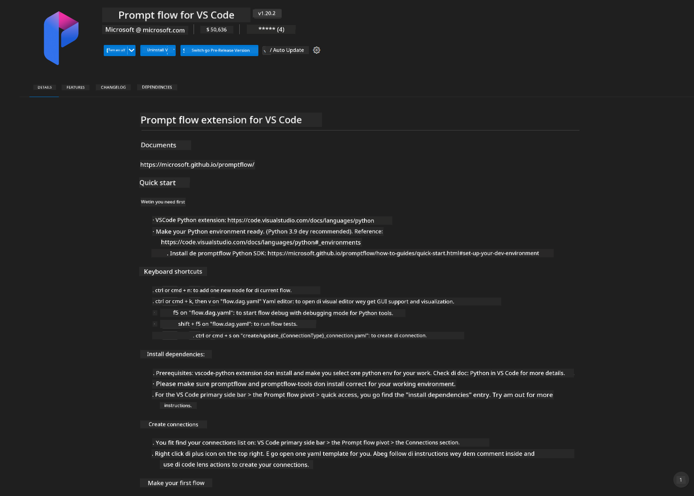
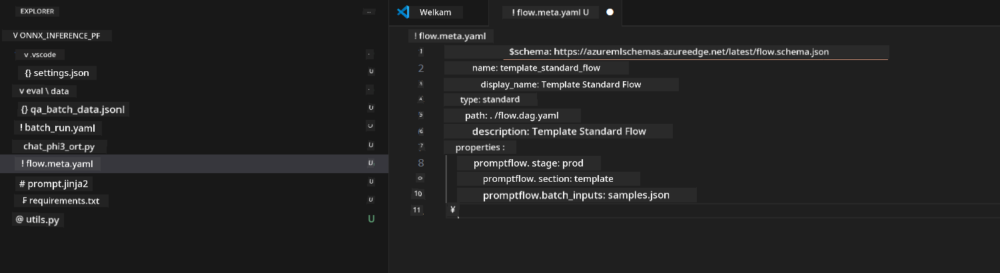
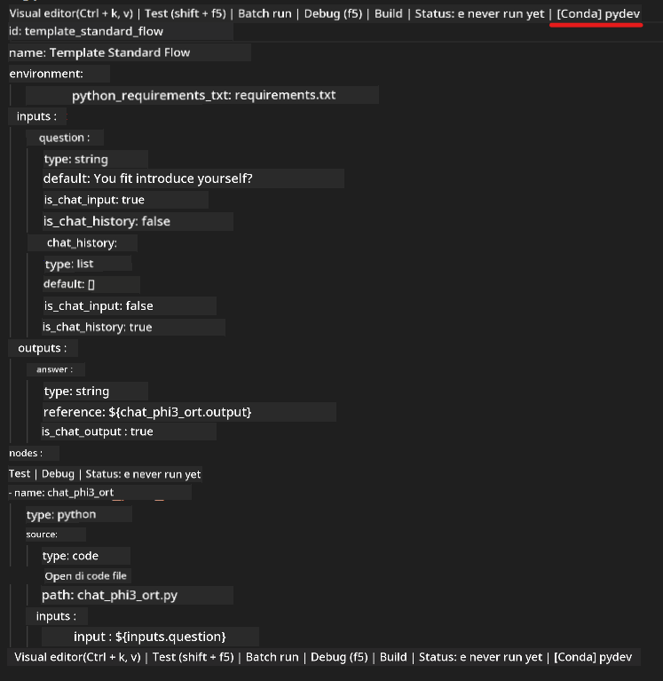
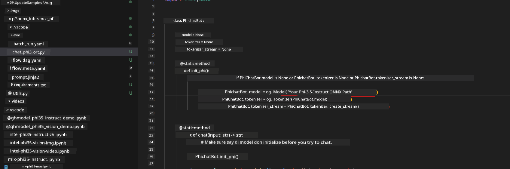

<!--
CO_OP_TRANSLATOR_METADATA:
{
  "original_hash": "92e7dac1e5af0dd7c94170fdaf6860fe",
  "translation_date": "2025-12-21T21:40:13+00:00",
  "source_file": "md/02.Application/01.TextAndChat/Phi3/UsingPromptFlowWithONNX.md",
  "language_code": "pcm"
}
-->
# How to use Windows GPU to make Prompt flow solution wit Phi-3.5-Instruct ONNX 

The following document na example wey show how to use PromptFlow wit ONNX (Open Neural Network Exchange) for developing AI applications wey base on Phi-3 models.

PromptFlow na suite of development tools wey dem design to streamline the end-to-end development cycle of LLM-based (Large Language Model) AI applications, from ideation and prototyping to testing and evaluation.

By integrating PromptFlow wit ONNX, developers fit:

- Make Model Performance better: Use ONNX to make model inference and deployment efficient.
- Make Development Easy: Use PromptFlow to manage di workflow and automate repetitive tasks.
- Make Collaboration Better: Help team members collaborate beta by providing one unified development environment.

**Prompt flow** na suite of development tools wey dem design to streamline the end-to-end development cycle of LLM-based AI applications, from ideation, prototyping, testing, evaluation to production deployment and monitoring. E dey make prompt engineering plenty easier and e dey enable you build LLM apps wit production quality.

Prompt flow fit connect to OpenAI, Azure OpenAI Service, and customizable models (Huggingface, local LLM/SLM). We dey hope to deploy Phi-3.5's quantized ONNX model to local applications. Prompt flow fit help us plan our business beta and complete local solutions based on Phi-3.5. For this example, we go combine ONNX Runtime GenAI Library to complete the Prompt flow solution wey go run on Windows GPU.

## **Installation**

### **ONNX Runtime GenAI for Windows GPU**

Read dis guideline to set up ONNX Runtime GenAI for Windows GPU  [click here](./ORTWindowGPUGuideline.md)

### **Set up Prompt flow in VSCode**

1. Install di Prompt flow VS Code Extension



2. After you don install di Prompt flow VS Code Extension， click di extension，and choose **Installation dependencies** follow dis guideline to install Prompt flow SDK in your env


3. Download [Sample Code](../../../../../../code/09.UpdateSamples/Aug/pf/onnx_inference_pf) and use VS Code to open this sample



4. Open **flow.dag.yaml** to choose your Python env



   Open **chat_phi3_ort.py** to change your Phi-3.5-instruct ONNX Model location



5. Run your prompt flow to testing

Open **flow.dag.yaml** click visual editor


after you click am, run am to test


1. You fit run batch for terminal to check more results


```bash

pf run create --file batch_run.yaml --stream --name 'Your eval qa name'    

```

You fit check di results for your default browser


---

<!-- CO-OP TRANSLATOR DISCLAIMER START -->
Abeg note:
Dis document dem don translate wit AI translation service Co-op Translator (https://github.com/Azure/co-op-translator). Even though we dey try make am correct, abeg sabi say automated translations fit get errors or mistakes. Di original document for e original language na di official one wey you suppose trust. For important information, better make professional human translator do di translation. We no go take responsibility for any misunderstanding or wrong interpretation wey fit come from dis translation.
<!-- CO-OP TRANSLATOR DISCLAIMER END -->