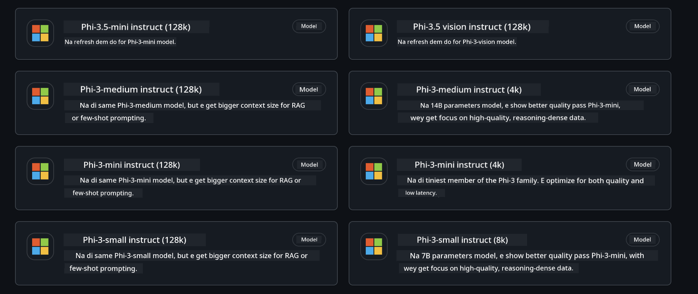
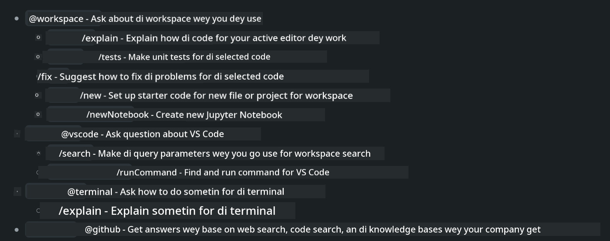
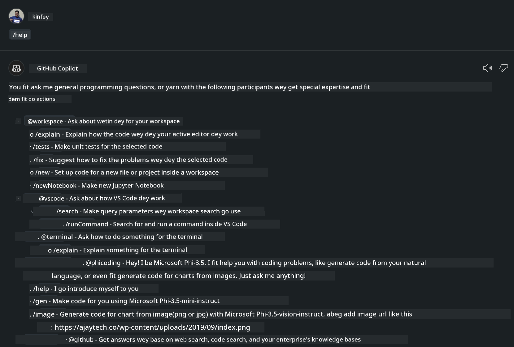

# **Make your own Visual Studio Code Chat Copilot Agent wit Phi-3.5 wey dey from GitHub Models**

You dey use Visual Studio Code Copilot? Especially for Chat, you fit use different agents to improve how you dey create, write, and maintain projects for Visual Studio Code. Visual Studio Code get API wey allow companies and individuals create different agents based on their business to expand their power for different private fields. For this article, we go focus on **Phi-3.5-mini-instruct (128k)** and **Phi-3.5-vision-instruct (128k)** from GitHub Models to make your own Visual Studio Code Agent.

## **About Phi-3.5 on GitHub Models**

We sabi say Phi-3/3.5-mini-instruct for the Phi-3/3.5 Family get strong ability to understand and generate code, and e get advantages pass Gemma-2-9b and Mistral-Nemo-12B-instruct-2407.


The latest GitHub Models don already give access to Phi-3.5-mini-instruct (128k) and Phi-3.5-vision-instruct (128k) models. Developers fit access dem through OpenAI SDK, Azure AI Inference SDK, and REST API.



***Note: *** Dem recommend make you use Azure AI Inference SDK for here, because e fit switch better with Azure Model Catalog for production environment

Below na the results wey **Phi-3.5-mini-instruct (128k)** and **Phi-3.5-vision-instruct (128k)** give for code generation scenario after we connect dem to GitHub Models, and e ready for the examples we go show later

**Demo: GitHub Models Phi-3.5-mini-instruct (128k) generate code from Prompt** ([click dis link](../../../../code/09.UpdateSamples/Aug/ghmodel_phi35_instruct_demo.ipynb))

**Demo: GitHub Models Phi-3.5-vision-instruct (128k) generate code from Image** ([click dis link](../../../../code/09.UpdateSamples/Aug/ghmodel_phi35_vision_demo.ipynb))


## **About GitHub Copilot Chat Agent**

GitHub Copilot Chat Agent fit complete all kinds tasks for different project scenarios based on the code. The system get four agents: workspace, github, terminal, vscode



If you add the agent name with ‘@’, you go quickly finish the work wey dey relevant. For companies, if you add your business-related content like requirements, coding, test specifications, and release, you fit get more powerful private enterprise features based on GitHub Copilot.

Visual Studio Code Chat Agent don officially release im API, so companies or enterprise developers fit build agents based on different software business ecosystems. Based on how you dey develop Visual Studio Code Extensions, you fit easily access the Visual Studio Code Chat Agent API. We fit develop following this process


This development scenario fit support third-party model APIs (like GitHub Models, Azure Model Catalog, and self-built services wey base on open source models) and e fit also use gpt-35-turbo, gpt-4, and gpt-4o models wey GitHub Copilot provide.

## **Add an Agent @phicoding based on Phi-3.5**

We dey try join the programming power of Phi-3.5 to finish code writing, image generation code and other tasks. Make an Agent wey build around Phi-3.5 - @PHI, below na some functions

1. Generate a self-introduction based on GPT-4o wey GitHub Copilot provide through the **@phicoding /help** command

2. Generate code for different programming languages based on **Phi-3.5-mini-instruct (128k)** through the **@phicoding /gen** command

3. Generate code based on **Phi-3.5-vision-instruct (128k)** and do image completion through the **@phicoding /image** command


## **Related steps**

1. Install Visual Studio Code Extension development support using npm

```bash

npm install --global yo generator-code 

```
2. Create a Visual Studio Code Extension plugin (using Typescript development mode, named phiext)


```bash

yo code 

```

3. Open the created project and modify package.json. Here na the instructions and configurations wey related, plus the configuration for GitHub Models. Remember say you need to add your GitHub Models token here.


```json

{
  "name": "phiext",
  "displayName": "phiext",
  "description": "",
  "version": "0.0.1",
  "engines": {
    "vscode": "^1.93.0"
  },
  "categories": [
    "AI",
    "Chat"
  ],
  "activationEvents": [],
  "enabledApiProposals": [
      "chatVariableResolver"
  ],
  "main": "./dist/extension.js",
  "contributes": {
    "chatParticipants": [
        {
            "id": "chat.phicoding",
            "name": "phicoding",
            "description": "Hey! I am Microsoft Phi-3.5, She can help me with coding problems, such as generation code with your natural language, or even generation code about chart from images. Just ask me anything!",
            "isSticky": true,
            "commands": [
                {
                    "name": "help",
                    "description": "Introduce myself to you"
                },
                {
                    "name": "gen",
                    "description": "Generate code for you with Microsoft Phi-3.5-mini-instruct"
                },
                {
                    "name": "image",
                    "description": "Generate code for chart from image(png or jpg) with Microsoft Phi-3.5-vision-instruct, please add image url like this : https://ajaytech.co/wp-content/uploads/2019/09/index.png"
                }
            ]
        }
    ],
    "commands": [
        {
            "command": "phicoding.namesInEditor",
            "title": "Use Microsoft Phi 3.5 in Editor"
        }
    ],
    "configuration": {
      "type": "object",
      "title": "githubmodels",
      "properties": {
        "githubmodels.endpoint": {
          "type": "string",
          "default": "https://models.inference.ai.azure.com",
          "description": "Your GitHub Models Endpoint",
          "order": 0
        },
        "githubmodels.api_key": {
          "type": "string",
          "default": "Your GitHub Models Token",
          "description": "Your GitHub Models Token",
          "order": 1
        },
        "githubmodels.phi35instruct": {
          "type": "string",
          "default": "Phi-3.5-mini-instruct",
          "description": "Your Phi-35-Instruct Model",
          "order": 2
        },
        "githubmodels.phi35vision": {
          "type": "string",
          "default": "Phi-3.5-vision-instruct",
          "description": "Your Phi-35-Vision Model",
          "order": 3
        }
      }
    }
  },
  "scripts": {
    "vscode:prepublish": "npm run package",
    "compile": "webpack",
    "watch": "webpack --watch",
    "package": "webpack --mode production --devtool hidden-source-map",
    "compile-tests": "tsc -p . --outDir out",
    "watch-tests": "tsc -p . -w --outDir out",
    "pretest": "npm run compile-tests && npm run compile && npm run lint",
    "lint": "eslint src",
    "test": "vscode-test"
  },
  "devDependencies": {
    "@types/vscode": "^1.93.0",
    "@types/mocha": "^10.0.7",
    "@types/node": "20.x",
    "@typescript-eslint/eslint-plugin": "^8.3.0",
    "@typescript-eslint/parser": "^8.3.0",
    "eslint": "^9.9.1",
    "typescript": "^5.5.4",
    "ts-loader": "^9.5.1",
    "webpack": "^5.94.0",
    "webpack-cli": "^5.1.4",
    "@vscode/test-cli": "^0.0.10",
    "@vscode/test-electron": "^2.4.1"
  },
  "dependencies": {
    "@types/node-fetch": "^2.6.11",
    "node-fetch": "^3.3.2",
    "@azure-rest/ai-inference": "latest",
    "@azure/core-auth": "latest",
    "@azure/core-sse": "latest"
  }
}


```

4. Modify src/extension.ts


```typescript

// Di module 'vscode' get di VS Code extensibility API
// Import di module den reference am wit di alias vscode for your code wey dey below
import * as vscode from 'vscode';
import ModelClient from "@azure-rest/ai-inference";
import { AzureKeyCredential } from "@azure/core-auth";


interface IPhiChatResult extends vscode.ChatResult {
    metadata: {
        command: string;
    };
}


const MODEL_SELECTOR: vscode.LanguageModelChatSelector = { vendor: 'copilot', family: 'gpt-4o' };

function isValidImageUrl(url: string): boolean {
    const regex = /^(https?:\/\/.*\.(?:png|jpg))$/i;
    return regex.test(url);
}
  

// Dis method dey call wen your extension activate
// Your extension go activate di very first time wey di command run
export function activate(context: vscode.ExtensionContext) {

    const codinghandler: vscode.ChatRequestHandler = async (request: vscode.ChatRequest, context: vscode.ChatContext, stream: vscode.ChatResponseStream, token: vscode.CancellationToken): Promise<IPhiChatResult> => {


        const config : any = vscode.workspace.getConfiguration('githubmodels');
        const endPoint: string = config.get('endpoint');
        const apiKey: string = config.get('api_key');
        const phi35instruct: string = config.get('phi35instruct');
        const phi35vision: string = config.get('phi35vision');
        
        if (request.command === 'help') {

            const content = "Welcome to Coding assistant with Microsoft Phi-3.5"; 
            stream.progress(content);


            try {
                const [model] = await vscode.lm.selectChatModels(MODEL_SELECTOR);
                if (model) {
                    const messages = [
                        vscode.LanguageModelChatMessage.User("Please help me express this content in a humorous way: I am a programming assistant who can help you convert natural language into code and generate code based on the charts in the images. output format like this : Hey I am Phi ......")
                    ];
                    const chatResponse = await model.sendRequest(messages, {}, token);
                    for await (const fragment of chatResponse.text) {
                        stream.markdown(fragment);
                    }
                }
            } catch(err) {
                console.log(err);
            }


            return { metadata: { command: 'help' } };

        }

        
        if (request.command === 'gen') {

            const content = "Welcome to use phi-3.5 to generate code";

            stream.progress(content);

            const client = new ModelClient(endPoint, new AzureKeyCredential(apiKey));

            const response = await client.path("/chat/completions").post({
              body: {
                messages: [
                  { role:"system", content: "You are a coding assistant.Help answer all code generation questions." },
                  { role:"user", content: request.prompt }
                ],
                model: phi35instruct,
                temperature: 0.4,
                max_tokens: 1000,
                top_p: 1.
              }
            });

            stream.markdown(response.body.choices[0].message.content);

            return { metadata: { command: 'gen' } };

        }


        
        if (request.command === 'image') {


            const content = "Welcome to use phi-3.5 to generate code from image(png or jpg),image url like this:https://ajaytech.co/wp-content/uploads/2019/09/index.png";

            stream.progress(content);

            if (!isValidImageUrl(request.prompt)) {
                stream.markdown('Please provide a valid image URL');
                return { metadata: { command: 'image' } };
            }
            else
            {

                const client = new ModelClient(endPoint, new AzureKeyCredential(apiKey));
    
                const response = await client.path("/chat/completions").post({
                    body: {
                      messages: [
                        { role: "system", content: "You are a helpful assistant that describes images in details." },
                        { role: "user", content: [
                            { type: "text", text: "Please generate code according to the chart in the picture according to the following requirements\n1. Keep all information in the chart, including data and text\n2. Do not generate additional information that is not included in the chart\n3. Please extract data from the picture, do not generate it from csv\n4. Please save the regenerated chart as a chart and save it to ./output/demo.png"},
                            { type: "image_url", image_url: {url: request.prompt}
                            }
                          ]
                        }
                      ],
                      model: phi35vision,
                      temperature: 0.4,
                      max_tokens: 2048,
                      top_p: 1.
                    }
                  });
    
                
                stream.markdown(response.body.choices[0].message.content);
    
                return { metadata: { command: 'image' } };
            }


        }


        return { metadata: { command: '' } };
    };


    const phi_ext = vscode.chat.createChatParticipant("chat.phicoding", codinghandler);

    phi_ext.iconPath = new vscode.ThemeIcon('sparkle');


    phi_ext.followupProvider = {
        provideFollowups(result: IPhiChatResult, context: vscode.ChatContext, token: vscode.CancellationToken) {
            return [{
                prompt: 'Let us coding with Phi-3.5 😋😋😋😋',
                label: vscode.l10n.t('Enjoy coding with Phi-3.5'),
                command: 'help'
            } satisfies vscode.ChatFollowup];
        }
    };

    context.subscriptions.push(phi_ext);
}

// Dis method dey call wen your extension deactivate
export function deactivate() {}


```

6. Running

***/help***



***@phicoding /help***


***@phicoding /gen***


***@phicoding /image***


You fit download sample code :[click](../../../../../../code/09.UpdateSamples/Aug/vscode)

## **Resources**

1. Sign up GitHub Models [https://gh.io/models](https://gh.io/models)

2. Learn Visual Studio Code Extension Development [https://code.visualstudio.com/api/get-started/your-first-extension](https://code.visualstudio.com/api/get-started/your-first-extension)

3. Learn about Visual Studio Code Coilot Chat API [https://code.visualstudio.com/api/extension-guides/chat](https://code.visualstudio.com/api/extension-guides/chat)

---

<!-- CO-OP TRANSLATOR DISCLAIMER START -->
Disclaimer:
Dis document don translate by AI translation service [Co-op Translator](https://github.com/Azure/co-op-translator). Even though we dey try make am correct, make you sabi say automatic translations fit get mistakes or wrong tins. Di original document for im original language na di official/authoritative source. If na important information, better make you use professional human translator. We no go responsible for any misunderstanding or wrong interpretation wey fit comot from using dis translation.
<!-- CO-OP TRANSLATOR DISCLAIMER END -->