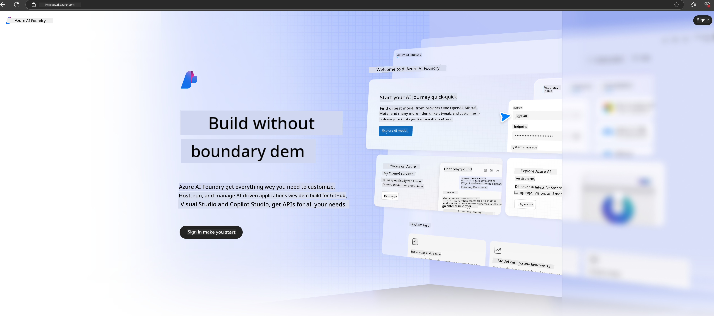

# **How to take use Phi-3 inside Azure AI Foundry**

As Generative AI dey develop, we wan use one platform wey go manage different LLM and SLM, enterprise data integration, fine-tuning/RAG operations, and to evaluate different enterprise business dem after we don join LLM and SLM, make generative AI fit enter Smart applications better. [Azure AI Foundry](https://ai.azure.com) na enterprise-level generative AI application platform.

With Azure AI Foundry, you fit evaluate large language model (LLM) responses and organize prompt application components with prompt flow make e perform well. The platform dey help scale make proof of concept fit turn production easy. Continuous monitoring and refinement dey support long-term success.

We fit quickly deploy the Phi-3 model for Azure AI Foundry with simple steps, den use Azure AI Foundry do Phi-3 related Playground/Chat, Fine-tuning, evaluation and other related work.

## **1. Wetin to Prepare**

If you don already get the [Azure Developer CLI](https://learn.microsoft.com/azure/developer/azure-developer-cli/overview?WT.mc_id=aiml-138114-kinfeylo) installed for your machine, to use this template simple as to run this command for new directory.

## Manual Creation

Creating Microsoft Azure AI Foundry project and hub na beta way to organize and manage your AI work. Below na step-by-step guide wey go start you:

### Creating a Project in Azure AI Foundry

1. **Go to Azure AI Foundry**: Sign in to the Azure AI Foundry portal.
2. **Create a Project**:
   - If you dey for inside one project, select "Azure AI Foundry" for top left of the page to commot go Home page.
   - Select "+ Create project".
   - Enter name for the project.
   - If you get hub, e go dey selected by default. If you get access to more than one hub, you fit choose another one from the dropdown. If you want create new hub, select "Create new hub" and give am name.
   - Select "Create".

### Creating a Hub in Azure AI Foundry

1. **Go to Azure AI Foundry**: Sign in with your Azure account.
2. **Create a Hub**:
   - Select the Management center from the left menu.
   - Select "All resources", then the down arrow beside "+ New project" and choose "+ New hub".
   - For the "Create a new hub" dialog, enter name for your hub (for example, contoso-hub) and change the other fields as you want.
   - Select "Next", review the info, then select "Create".

For more details, you fit refer to the official [Microsoft documentation](https://learn.microsoft.com/azure/ai-studio/how-to/create-projects).

After you don create am successful, you fit access the studio wey you create through [ai.azure.com](https://ai.azure.com/)

You fit get many projects for one AI Foundry. Create one project for AI Foundry to prepare.

Create Azure AI Foundry [QuickStarts](https://learn.microsoft.com/azure/ai-studio/quickstarts/get-started-code)

## **2. Deploy a Phi model in Azure AI Foundry**

Click the Explore option of the project to enter the Model Catalog and select Phi-3

Select Phi-3-mini-4k-instruct

Click 'Deploy' to deploy the Phi-3-mini-4k-instruct model

> [!NOTE]
>
> You fit select computing power when you dey deploy

## **3. Playground Chat Phi in Azure AI Foundry**

Go the deployment page, select Playground, and dey chat with Phi-3 for Azure AI Foundry

## **4. Deploying the Model from Azure AI Foundry**

To deploy model from the Azure Model Catalog, you fit follow these steps:

- Sign in to Azure AI Foundry.
- Choose the model wey you want deploy from the Azure AI Foundry model catalog.
- For the model's Details page, select Deploy and then select Serverless API with Azure AI Content Safety.
- Select the project wey you want deploy your models inside. To use the Serverless API offering, your workspace must dey for East US 2 or Sweden Central region. You fit customize the Deployment name.
- For the deployment wizard, select the Pricing and terms to learn about the pricing and terms of use.
- Select Deploy. Wait till deployment ready and dem redirect you to the Deployments page.
- Select Open in playground to start to interact with the model.
- You fit return to the Deployments page, select the deployment, and note the endpoint's Target URL and the Secret Key, wey you fit use to call the deployment and generate completions.
- You fit always find the endpoint's details, URL, and access keys by navigating to the Build tab and selecting Deployments from the Components section.

> [!NOTE]
> Please note say your account must get the Azure AI Developer role permissions on the Resource Group to fit perform these steps.

## **5. Using Phi API in Azure AI Foundry**

You fit access https://{Your project name}.region.inference.ml.azure.com/swagger.json through Postman GET and combine am with your Key to check the provided interfaces

You fit get the request parameters quick, and the response parameters too.

---

<!-- CO-OP TRANSLATOR DISCLAIMER START -->
Disclaimer:
Dis document don translate with AI translation service Co-op Translator (https://github.com/Azure/co-op-translator). Even though we dey try make everything correct, abeg sabi say automatic translations fit get mistakes or inaccuracies. Di original document for im native language suppose be di authoritative source. If na critical information, make person wey sabi (professional human translator) do di translation. We no dey liable for any misunderstanding or misinterpretation wey fit come from the use of this translation.
<!-- CO-OP TRANSLATOR DISCLAIMER END -->