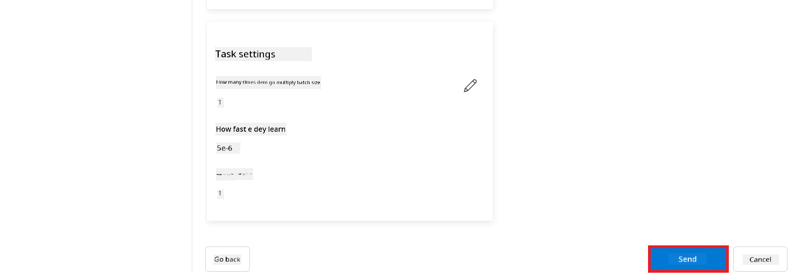
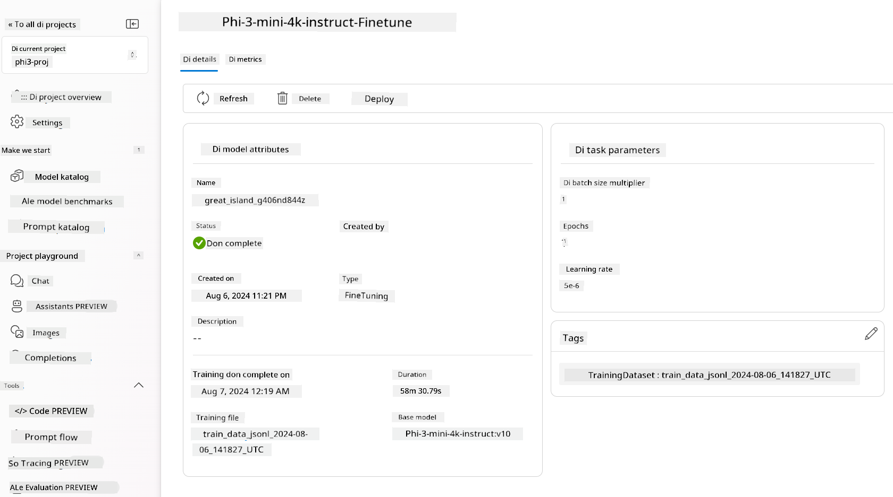

<!--
CO_OP_TRANSLATOR_METADATA:
{
  "original_hash": "c1559c5af6caccf6f623fd43a6b3a9a3",
  "translation_date": "2025-12-21T16:59:48+00:00",
  "source_file": "md/03.FineTuning/FineTuning_AIFoundry.md",
  "language_code": "pcm"
}
-->
# Fine-tuning Phi-3 wit Azure AI Foundry

 Make we explore how to fine-tune Microsoft’s Phi-3 Mini language model using Azure AI Foundry. Fine-tuning dey allow you adapt Phi-3 Mini to specific tasks, make am more powerful and sabi di context.

## Considerations

- **Capabilities:** Which models you fit fine-tune? Wetin di base model fit do after you don fine-tune am?
- **Cost:** How dem dey charge for fine tuning
**Customizability:** How much I fit change di base model – and how I fit change am?
- **Convenience:** How fine-tuning dey really happen – I go need write custom code? I go need bring my own compute?
- **Safety:** Fine-tuned models get safety risks – dem get any guardrails wey go protect against unintended harm?


## Preparation for fine-tuning

### Prerequisites

> [!NOTE]
> For Phi-3 family models, the pay-as-you-go model fine-tune offering dey only available for hubs wey dem create for **East US 2** regions.

- An Azure subscription. If you no get Azure subscription, create a [paid Azure account](https://azure.microsoft.com/pricing/purchase-options/pay-as-you-go) to start.

- An [AI Foundry project](https://ai.azure.com?WT.mc_id=aiml-138114-kinfeylo).
- Azure role-based access controls (Azure RBAC) dey used to give access to operations for Azure AI Foundry. To do di steps for this article, your user account must get assigned the __Azure AI Developer role__ on the resource group.

### Subscription provider registration

Make sure the subscription don register with the `Microsoft.Network` resource provider.

1. Sign in to the [Azure portal](https://portal.azure.com).
1. Select **Subscriptions** from di left menu.
1. Select di subscription wey you wan use.
1. Select **AI project settings** > **Resource providers** from di left menu.
1. Confirm say **Microsoft.Network** dey for di list of resource providers. If e no dey, add am.

### Data preparation

Prepare your training and validation data to fine-tune your model. Your training data and validation data sets go contain input and output examples wey show how you wan make di model perform.

Make sure say all your training examples follow di expected format for inference. To fine-tune models well, ensure say your dataset balance and diverse.

This one mean say you go maintain data balance, add different scenarios, and dey refine training data from time to time to match real-world expectations, so model response go dey more accurate and balanced.

Different model types need different format of training data.

### Chat Completion

Di training and validation data wey you go use **must** be formatted as JSON Lines (JSONL) document. For `Phi-3-mini-128k-instruct` di fine-tuning dataset must dey in di conversational format wey di Chat completions API dey use.

### Example file format

```json
    {"messages": [{"role": "system", "content": "You are an Xbox customer support agent whose primary goal is to help users with issues they are experiencing with their Xbox devices. You are friendly and concise. You only provide factual answers to queries, and do not provide answers that are not related to Xbox."}, {"role": "user", "content": "Is Xbox better than PlayStation?"}, {"role": "assistant", "content": "I apologize, but I cannot provide personal opinions. My primary job is to assist you with any issues related to your Xbox device. Do you have any Xbox-related issues that need addressing?"}]}
    {"messages": [{"role": "system", "content": "You are an Xbox customer support agent whose primary goal is to help users with issues they are experiencing with their Xbox devices. You are friendly and concise. You only provide factual answers to queries, and do not provide answers that are not related to Xbox."}, {"role": "user", "content": "Can I play PC games on my Xbox?"}, {"role": "assistant", "content": "While Xbox consoles don't natively support PC games, they can play an array of Xbox games, many of which are also available on PC. Can I assist you with finding games compatible with your Xbox device?"}]}
    {"messages": [{"role": "system", "content": "You are an Xbox customer support agent whose primary goal is to help users with issues they are experiencing with their Xbox devices. You are friendly and concise. You only provide factual answers to queries, and do not provide answers that are not related to Xbox."}, {"role": "user", "content": "I'm having trouble connecting my Xbox to the Wi-Fi."}, {"role": "assistant", "content": "No worries, let's go through the network settings on your Xbox. Can you please tell me what happens when you try to connect it to the Wi-Fi?"}]}
```

Di supported file type na JSON Lines. Files dey upload to di default datastore and dem go make am available for your project.

## Fine-Tuning Phi-3 with Azure AI Foundry

Azure AI Foundry dey allow you tailor large language models to your own datasets by fine-tuning. Fine-tuning get plenty value because e allow customization and optimization for specific tasks and applications. E dey give better performance, save cost, reduce latency, and produce outputs wey match wetin you want.


### Create a New Project

1. Sign in to [Azure AI Foundry](https://ai.azure.com).

1. Select **+New project** to create new project for Azure AI Foundry.

    

1. Do these tasks:

    - Project **Hub name**. E must be unique.
    - Select di **Hub** wey you wan use (create new one if you need).

    

1. Do these tasks to create new hub:

    - Enter **Hub name**. E must be unique.
    - Select your Azure **Subscription**.
    - Select di **Resource group** wey you wan use (create new one if you need).
    - Select di **Location** wey you wan use.
    - Select di **Connect Azure AI Services** wey you wan use (create new one if you need).
    - Select **Connect Azure AI Search** to **Skip connecting**.

    

1. Select **Next**.
1. Select **Create a project**.

### Data Preparation

Before fine-tuning, gather or create dataset weh relate to your task, like chat instructions, question-answer pairs, or any other text wey matter. Clean and preprocess the data by removing noise, handle missing values, and tokenize the text.

### Fine-tune Phi-3 models in Azure AI Foundry

> [!NOTE]
> Fine-tuning of Phi-3 models dey supported for projects wey dey located for East US 2.

1. Select **Model catalog** from di left side tab.

1. Type *phi-3* for di **search bar** and select di phi-3 model wey you wan use.

    

1. Select **Fine-tune**.

    

1. Enter di **Fine-tuned model name**.

    

1. Select **Next**.

1. Do these tasks:

    - Select **task type** to **Chat completion**.
    - Select di **Training data** wey you wan use. You fit upload am through Azure AI Foundry data or from your local environment.

    

1. Select **Next**.

1. Upload di **Validation data** wey you wan use, or you fit select **Automatic split of training data**.

    

1. Select **Next**.

1. Do these tasks:

    - Select di **Batch size multiplier** wey you wan use.
    - Select di **Learning rate** wey you wan use.
    - Select di **Epochs** wey you wan use.

    

1. Select **Submit** to start di fine-tuning process.

    


1. Once your model don fine-tune, di status go show **Completed**, like di image below. Now you fit deploy di model and use am for your own application, playground, or prompt flow. For more info, see [How to deploy Phi-3 family of small language models with Azure AI Foundry](https://learn.microsoft.com/azure/ai-studio/how-to/deploy-models-phi-3?tabs=phi-3-5&pivots=programming-language-python).

    

> [!NOTE]
> For more detailed info on fine-tuning Phi-3, abeg visit [Fine-tune Phi-3 models in Azure AI Foundry](https://learn.microsoft.com/azure/ai-studio/how-to/fine-tune-phi-3?tabs=phi-3-mini).

## Cleaning up your fine-tuned models

You fit delete fine-tuned model from di fine-tuning model list for [Azure AI Foundry](https://ai.azure.com) or from di model details page. Select di fine-tuned model wey you wan delete from di Fine-tuning page, then select di Delete button to remove di fine-tuned model.

> [!NOTE]
> You no fit delete custom model if e get existing deployment. You must first delete your model deployment before you fit delete your custom model.

## Cost and quotas

### Cost and quota considerations for Phi-3 models fine-tuned as a service

Phi models wey dem fine-tune as a service na Microsoft dey provide and dem integrate am with Azure AI Foundry for use. You fit find pricing when you dey [deploying](https://learn.microsoft.com/azure/ai-studio/how-to/deploy-models-phi-3?tabs=phi-3-5&pivots=programming-language-python) or fine-tuning di models under di Pricing and terms tab on deployment wizard.

## Content filtering

Models wey dem deploy as a service with pay-as-you-go protected by Azure AI Content Safety. When dem deploy to real-time endpoints, you fit opt out of this feature. With Azure AI content safety enabled, both di prompt and completion go pass through some classification models wey dey try detect and prevent harmful content. Di content filtering system dey detect and take action on specific categories of potentially harmful content for both input prompts and output completions. Learn more about [Azure AI Content Safety](https://learn.microsoft.com/azure/ai-studio/concepts/content-filtering).

**Fine-Tuning Configuration**

Hyperparameters: Define hyperparameters like learning rate, batch size, and number of training epochs.

**Loss Function**

Choose correct loss function for your task (for example, cross-entropy).

**Optimizer**

Pick optimizer (for example, Adam) for gradient updates during training.

**Fine-Tuning Process**

- Load Pre-Trained Model: Load di Phi-3 Mini checkpoint.
- Add Custom Layers: Add task-specific layers (for example, classification head for chat instructions).

**Train the Model**
Fine-tune di model using your prepared dataset. Dey monitor training progress and adjust hyperparameters as needed.

**Evaluation and Validation**

Validation Set: Split your data into training and validation sets.

**Evaluate Performance**

Use metrics like accuracy, F1-score, or perplexity to check how di model dey perform.

## Save Fine-Tuned Model

**Checkpoint**
Save di fine-tuned model checkpoint make you fit use am later.

## Deployment

- Deploy as a Web Service: Deploy your fine-tuned model as web service for Azure AI Foundry.
- Test the Endpoint: Send test queries to di deployed endpoint to make sure e dey work.

## Iterate and Improve

Iterate: If di performance no good reach your expectation, do another round: adjust hyperparameters, add more data, or fine-tune for extra epochs.

## Monitor and Refine

Dey monitor di model behavior continuously and refine as e dey needed.

## Customize and Extend

Custom Tasks: Phi-3 Mini fit be fine-tuned for plenty tasks beyond chat instructions. Try other use cases!
Experiment: Try different architectures, layer combinations, and techniques to boost performance.

> [!NOTE]
> Fine-tuning na iterative process. Try, learn, and adapt your model to get di best results for your specific task!

---

<!-- CO-OP TRANSLATOR DISCLAIMER START -->
Disclaimer:
Dis dokument don translate with AI translation service Co-op Translator (https://github.com/Azure/co-op-translator). Even though we dey try make am accurate, abeg note say automated translations fit get mistakes or no dey completely correct. The original dokument for im original language na the authoritative source. If na important matter, make professional human translator handle am. We no go responsible for any misunderstanding or misinterpretation wey fit happen because of this translation.
<!-- CO-OP TRANSLATOR DISCLAIMER END -->