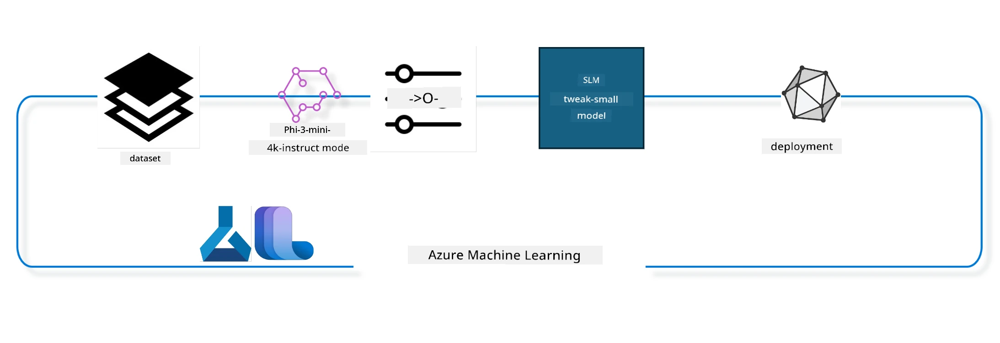

## How use chat-completion components from the Azure ML system registry to fine tune a model

For dis example we go do fine tuning of the Phi-3-mini-4k-instruct model to complete conversation between 2 people using ultrachat_200k dataset.



The example go show you how to do fine tuning using the Azure ML SDK and Python then deploy the fine tuned model to online endpoint for real time inference.

### Training data

We go use the ultrachat_200k dataset. Na heavily filtered version of the UltraChat dataset and e dey use to train Zephyr-7B-β, one kind state of the art 7b chat model.

### Model

We go use the Phi-3-mini-4k-instruct model to show how person fit finetune model for chat-completion task. If you open dis notebook from specific model card, make you remember to change the specific model name.

### Tasks

- Pick model wey you wan fine tune.
- Pick and explore training data.
- Configure the fine tuning job.
- Run the fine tuning job.
- Check training and evaluation metrics.
- Register the fine tuned model.
- Deploy the fine tuned model for real time inference.
- Clear resources.

## 1. Setup pre-requisites

- Install dependencies
- Connect to AzureML Workspace. Learn more for set up SDK authentication. Change <WORKSPACE_NAME>, <RESOURCE_GROUP> and <SUBSCRIPTION_ID> below.
- Connect to azureml system registry
- Set optional experiment name
- Check or create compute.

> [!NOTE]
> Dem require single GPU node fit get many GPU cards. For example, for one node of Standard_NC24rs_v3 get 4 NVIDIA V100 GPUs while for Standard_NC12s_v3 get 2 NVIDIA V100 GPUs. Check docs for details. Number of GPU cards per node dey inside the param gpus_per_node below. Set the value correct so that all GPUs for the node go work well. Recommended GPU compute SKUs dey here and here.

### Python Libraries

Install dependencies by running the cell below. This step no dey optional if you dey run for new environment.

```bash
pip install azure-ai-ml
pip install azure-identity
pip install datasets==2.9.0
pip install mlflow
pip install azureml-mlflow
```

### Interacting with Azure ML

1. Dis Python script dey use to interact with Azure Machine Learning (Azure ML) service. Here na wetin e dey do:

    - E dey import modules wey e need from azure.ai.ml, azure.identity, and azure.ai.ml.entities packages. E still dey import the time module.

    - E go try authenticate with DefaultAzureCredential(), wey dey provide simple way to quickly start develop apps for Azure cloud. If e no work, e go try InteractiveBrowserCredential(), wey dey give interactive login prompt.

    - E go try create MLClient instance using from_config method, wey dey read config from default config file (config.json). If e no work, e go create MLClient manually by giving subscription_id, resource_group_name, and workspace_name.

    - E go create another MLClient instance, this time for Azure ML registry wey dem call "azureml". This registry na where dem dey keep models, fine-tuning pipelines, and environments.

    - E go set experiment_name to "chat_completion_Phi-3-mini-4k-instruct".

    - E go generate unique timestamp by converting current time (seconds since epoch, as floating point) to integer then to string. This timestamp fit dey use create unique names and versions.

    ```python
    # Import di modules dem wey dem need from Azure ML and Azure Identity
    from azure.ai.ml import MLClient
    from azure.identity import (
        DefaultAzureCredential,
        InteractiveBrowserCredential,
    )
    from azure.ai.ml.entities import AmlCompute
    import time  # Import time module
    
    # Try authenticate wit DefaultAzureCredential
    try:
        credential = DefaultAzureCredential()
        credential.get_token("https://management.azure.com/.default")
    except Exception as ex:  # If DefaultAzureCredential no work, use InteractiveBrowserCredential
        credential = InteractiveBrowserCredential()
    
    # Try create MLClient instance wit di default config file
    try:
        workspace_ml_client = MLClient.from_config(credential=credential)
    except:  # If dat one no work, create MLClient instance by manually give di details
        workspace_ml_client = MLClient(
            credential,
            subscription_id="<SUBSCRIPTION_ID>",
            resource_group_name="<RESOURCE_GROUP>",
            workspace_name="<WORKSPACE_NAME>",
        )
    
    # Create oda MLClient instance for Azure ML registry wey dem dey call "azureml"
    # Dis registry na where models, fine-tuning pipelines, and environments dey stored
    registry_ml_client = MLClient(credential, registry_name="azureml")
    
    # Set di experiment name
    experiment_name = "chat_completion_Phi-3-mini-4k-instruct"
    
    # Generate one unique timestamp wey fit use for names and versions wey gots be unique
    timestamp = str(int(time.time()))
    ```

## 2. Pick a foundation model to fine tune

1. Phi-3-mini-4k-instruct get 3.8B parameters, e light, and na state-of-the-art open model wey dem build based on datasets wey dem use for Phi-2. The model na part of Phi-3 model family, and Mini version get two types: 4K and 128K wey be the context length (tokens) e fit support. We need finetune the model for our special purpose to fit use am. You fit find these models for Model Catalog inside AzureML Studio, filtering by chat-completion task. For this example, we dey use Phi-3-mini-4k-instruct model. If you open this notebook for different model, change the model name and version based on dat.

> [!NOTE]
> the model id property na wetin model get. E go enter as input to fine tuning job. You fit see am as Asset ID for model details page for AzureML Studio Model Catalog.

2. Dis Python script dey interact with Azure Machine Learning (Azure ML) service. Here na wetin e dey do:

    - E set model_name to "Phi-3-mini-4k-instruct".

    - E use get method from models property of registry_ml_client object to get latest version of the model with that name from Azure ML registry. The get method get two arguments: model name and label to tell am make e fetch latest version.

    - E print message for console to show name, version and id of the model wey e go use for fine-tuning. E use string format method put the name, version and id inside the message. The name, version and id dey inside foundation_model object.

    ```python
    # Set di model name
    model_name = "Phi-3-mini-4k-instruct"
    
    # Collect di latest version of di model from di Azure ML registry
    foundation_model = registry_ml_client.models.get(model_name, label="latest")
    
    # Print di model name, version, and id
    # Dis info dey useful for tracking and debugging
    print(
        "\n\nUsing model name: {0}, version: {1}, id: {2} for fine tuning".format(
            foundation_model.name, foundation_model.version, foundation_model.id
        )
    )
    ```

## 3. Create a compute to be used with the job

Fine tune job dey work ONLY with GPU compute. The size of the compute depend on how big the model be and for most cases, e hard to know the right compute for the job. For dis cell, we go guide person to select the correct compute.

> [!NOTE]
> The computes dem list below work with the most optimized configuration. Any changes for the configuration fit cause Cuda Out Of Memory error. If dat happen, try upgrade your compute to bigger size.

> [!NOTE]
> While you dey select compute_cluster_size below, make sure say the compute dey your resource group. If you no get the compute, you fit request access to the compute resources.

### Checking Model for Fine Tuning Support

1. Dis Python script dey interact with Azure Machine Learning (Azure ML) model. Here na wetin e do:

    - E import ast module, wey dey give functions to process Python abstract syntax grammar trees.

    - E dey check if foundation_model object (wey represent model for Azure ML) get tag called finetune_compute_allow_list. Tags for Azure ML na key-value pairs wey you fit create and use to filter and sort models.

    - If finetune_compute_allow_list tag dey, e go use ast.literal_eval function to safely convert the tag value (string) to Python list. That list e put for computes_allow_list variable. E go print message say compute suppose come from the list.

    - If finetune_compute_allow_list tag no dey, e go set computes_allow_list to None and print message say tag no dey the model tags.

    - Overall, e dey check if model get specific tag, convert tag value to list if e exist, and dey give feedback to user.

    ```python
    # Import di ast module, wey get functions to process trees of di Python abstract syntax grammar
    import ast
    
    # Check if di 'finetune_compute_allow_list' tag dey for di model's tags
    if "finetune_compute_allow_list" in foundation_model.tags:
        # If di tag dey, use ast.literal_eval to safely parse di tag value (wey be string) enter Python list
        computes_allow_list = ast.literal_eval(
            foundation_model.tags["finetune_compute_allow_list"]
        )  # change string to python list
        # Print message wey talk say one compute suppose create from di list
        print(f"Please create a compute from the above list - {computes_allow_list}")
    else:
        # If di tag no dey, set computes_allow_list to None
        computes_allow_list = None
        # Print message wey talk say 'finetune_compute_allow_list' tag no dey part of di model's tags
        print("`finetune_compute_allow_list` is not part of model tags")
    ```

### Checking Compute Instance

1. Dis Python script dey interact with Azure Machine Learning (Azure ML) service and dey do different checks on compute instance. Here na wetin e dey do:

    - E try find compute instance wey get name stored in compute_cluster from Azure ML workspace. If the compute instance provisioning state na "failed", e go raise ValueError.

    - E check if computes_allow_list no be None. If no be None, e go convert all compute sizes inside the list to lowercase and check if size of current compute dey inside list. If no dey, e go raise ValueError.

    - If computes_allow_list na None, e go check if size of compute dey inside list of GPU VM sizes wey no dey support. If e dey, e go raise ValueError.

    - E get list of all available compute sizes inside workspace. Then e go run for the list, for each compute size e check if name match size of current compute. If e match, e go get number of GPUs for that compute size and set gpu_count_found to True.

    - If gpu_count_found na True, e go print number of GPUs for the compute instance. If e False, e go raise ValueError.

    - Overall, e dey do plenty checks on compute instance for Azure ML workspace, including provisioning state, size against allow or deny list, plus number of GPUs.

    ```python
    # Print di exception message
    print(e)
    # Raise ValueError if di compute size no dey for di workspace
    raise ValueError(
        f"WARNING! Compute size {compute_cluster_size} not available in workspace"
    )
    
    # Collect di compute instance from di Azure ML workspace
    compute = workspace_ml_client.compute.get(compute_cluster)
    # Check if di provisioning state of di compute instance be "failed"
    if compute.provisioning_state.lower() == "failed":
        # Raise ValueError if di provisioning state na "failed"
        raise ValueError(
            f"Provisioning failed, Compute '{compute_cluster}' is in failed state. "
            f"please try creating a different compute"
        )
    
    # Check if computes_allow_list no be None
    if computes_allow_list is not None:
        # Change all compute sizes for computes_allow_list to small letter
        computes_allow_list_lower_case = [x.lower() for x in computes_allow_list]
        # Check if di size of di compute instance dey inside computes_allow_list_lower_case
        if compute.size.lower() not in computes_allow_list_lower_case:
            # Raise ValueError if di size of di compute instance no dey inside computes_allow_list_lower_case
            raise ValueError(
                f"VM size {compute.size} is not in the allow-listed computes for finetuning"
            )
    else:
        # Make list of GPU VM sizes wey no support
        unsupported_gpu_vm_list = [
            "standard_nc6",
            "standard_nc12",
            "standard_nc24",
            "standard_nc24r",
        ]
        # Check if di size of di compute instance dey for unsupported_gpu_vm_list
        if compute.size.lower() in unsupported_gpu_vm_list:
            # Raise ValueError if di size of di compute instance dey for unsupported_gpu_vm_list
            raise ValueError(
                f"VM size {compute.size} is currently not supported for finetuning"
            )
    
    # Start one flag to check if di number of GPUs for di compute instance don show
    gpu_count_found = False
    # Collect list of all compute sizes wey dey for di workspace
    workspace_compute_sku_list = workspace_ml_client.compute.list_sizes()
    available_sku_sizes = []
    # waka go through di list of compute sizes wey dey
    for compute_sku in workspace_compute_sku_list:
        available_sku_sizes.append(compute_sku.name)
        # Check if di name of di compute size match di size of di compute instance
        if compute_sku.name.lower() == compute.size.lower():
            # If e match, collect di number of GPUs for dat compute size and mark gpu_count_found as True
            gpus_per_node = compute_sku.gpus
            gpu_count_found = True
    # If gpu_count_found be True, print di number of GPUs wey dey for di compute instance
    if gpu_count_found:
        print(f"Number of GPU's in compute {compute.size}: {gpus_per_node}")
    else:
        # If gpu_count_found be False, raise ValueError
        raise ValueError(
            f"Number of GPU's in compute {compute.size} not found. Available skus are: {available_sku_sizes}."
            f"This should not happen. Please check the selected compute cluster: {compute_cluster} and try again."
        )
    ```

## 4. Pick the dataset for fine-tuning the model

1. We dey use ultrachat_200k dataset. The dataset get four splits, perfect for Supervised fine-tuning (sft).
Generation ranking (gen). Number of examples per split na as e follow:

    ```bash
    train_sft test_sft  train_gen  test_gen
    207865  23110  256032  28304
    ```

1. The next cells go show basic data preparation for fine tuning:

### Visualize some data rows

We want make this sample run fast, so we go save train_sft, test_sft files wey get 5% of the already trimmed rows. That one mean the fine tuned model go get lower accuracy, so e no suppose use am for real-world.

The download-dataset.py script dey use to download ultrachat_200k dataset and transform am into format wey fine tune pipeline component fit use. Because the dataset big, we no get all the dataset here, only some part.

1. If you run the script below, e go download only 5% of the data. You fit increase am by changing dataset_split_pc parameter to percent you want.

> [!NOTE]
> Some language models get different language codes so the column names for dataset must reflect the same thing.

1. Here be example of how data suppose look
The chat-completion dataset dey store as parquet format with each entry dey use this schema:

    - Na JSON (JavaScript Object Notation) document, popular data interchange format. E no be code to run but way to save and carry data. Here na weting e get:

    - "prompt": Dis key get string value wey represent task or question wey dem ask AI assistant.

    - "messages": Dis key get array of objects. Each object na message for conversation between user and AI assistant. Each message get two keys:

    - "content": This key get string wey represent message content.
    - "role": This key get string wey represent role of the person wey send the message. E fit be "user" or "assistant".
    - "prompt_id": This key get string wey represent unique ID for the prompt.

1. For this JSON document, na conversation dey where user ask AI assistant to create protagonist for dystopian story. The assistant respond, then user ask for more details. Assistant agree to give more details. The whole conversation get link with specific prompt id.

    ```python
    {
        // The task or question posed to an AI assistant
        "prompt": "Create a fully-developed protagonist who is challenged to survive within a dystopian society under the rule of a tyrant. ...",
        
        // An array of objects, each representing a message in a conversation between a user and an AI assistant
        "messages":[
            {
                // The content of the user's message
                "content": "Create a fully-developed protagonist who is challenged to survive within a dystopian society under the rule of a tyrant. ...",
                // The role of the entity that sent the message
                "role": "user"
            },
            {
                // The content of the assistant's message
                "content": "Name: Ava\n\n Ava was just 16 years old when the world as she knew it came crashing down. The government had collapsed, leaving behind a chaotic and lawless society. ...",
                // The role of the entity that sent the message
                "role": "assistant"
            },
            {
                // The content of the user's message
                "content": "Wow, Ava's story is so intense and inspiring! Can you provide me with more details.  ...",
                // The role of the entity that sent the message
                "role": "user"
            }, 
            {
                // The content of the assistant's message
                "content": "Certainly! ....",
                // The role of the entity that sent the message
                "role": "assistant"
            }
        ],
        
        // A unique identifier for the prompt
        "prompt_id": "d938b65dfe31f05f80eb8572964c6673eddbd68eff3db6bd234d7f1e3b86c2af"
    }
    ```

### Download Data

1. Dis Python script dey use download dataset using helper script named download-dataset.py. Here na wetin e do:

    - E import os module, wey dey provide portable way to use operating system dependent functions.

    - E use os.system function to run download-dataset.py script for shell with command-line arguments. Arguments show dataset to download (HuggingFaceH4/ultrachat_200k), directory wey e go download to (ultrachat_200k_dataset), and percentage of dataset split (5). os.system return exit status of the command wey e run; e store am for exit_status variable.

    - E check if exit_status no be 0. For Unix-like OS, exit status 0 mean command succeed; any other number mean error. If exit_status no be 0, e raise Exception with message say error happen for downloading dataset.

    - Overall, this script dey run command to download dataset using helper script, and e throw exception if command fail.

    ```python
    # Import di os module wey dey provide way to use operating system-dependent things
    import os
    
    # Use di os.system function run di download-dataset.py script for shell wit particular command-line arguments
    # Di arguments talk di dataset wey dem go download (HuggingFaceH4/ultrachat_200k), di folder dem go put am (ultrachat_200k_dataset), plus di percent wey dem go split (5)
    # Di os.system function go return di exit status of di command wey e run; dis status dem store for exit_status variable
    exit_status = os.system(
        "python ./download-dataset.py --dataset HuggingFaceH4/ultrachat_200k --download_dir ultrachat_200k_dataset --dataset_split_pc 5"
    )
    
    # Check if exit_status no be 0
    # For Unix-like operating systems, exit status 0 mean say command don succeed, but any oda number mean say error dey
    # If exit_status no be 0, throw Exception wit message wey talk say error happen while dem dey download di dataset
    if exit_status != 0:
        raise Exception("Error downloading dataset")
    ```

### Loading Data into a DataFrame

1. Dis Python script dey load JSON Lines file into pandas DataFrame and dey show first 5 rows. Here na wetin e do:

    - E import pandas library, wey powerful for data manipulation and analysis.

    - E set maximum column width for pandas display options to 0. That one mean say all text for each column go show without cutting when DataFrame print.
    - E de use pd.read_json function to load di train_sft.jsonl file from di ultrachat_200k_dataset directory enter inside DataFrame. Di lines=True argument mean say di file na JSON Lines format, weh each line be separate JSON object.

    - E de use di head method to show di first 5 rows for di DataFrame. If di DataFrame get less than 5 rows, e go show all of dem.

    - To summarize, dis script na to load JSON Lines file enter inside DataFrame and show di first 5 rows wit all di text for columns.
    
    ```python
    # Import di pandas library, wey be powerful tool for data manipulation and analysis
    import pandas as pd
    
    # Set di maximum column width for pandas display options to 0
    # Dis mean say di full text of each column go show without any cut when you print di DataFrame
    pd.set_option("display.max_colwidth", 0)
    
    # Use pd.read_json function to load di train_sft.jsonl file from di ultrachat_200k_dataset folder into one DataFrame
    # Di lines=True argument mean say di file dey for JSON Lines format, wey each line be separate JSON object
    df = pd.read_json("./ultrachat_200k_dataset/train_sft.jsonl", lines=True)
    
    # Use di head method to show di first 5 rows of di DataFrame
    # If di DataFrame get less than 5 rows, e go show all of dem
    df.head()
    ```

## 5. Submit di fine tuning job using di model and data as inputs

Create di job weh de use di chat-completion pipeline component. Learn more about all di parameters weh dem support for fine tuning.

### Define finetune parameters

1. Finetune parameters fit group into 2 categories - training parameters, optimization parameters

1. Training parameters dey define di training aspects like -

    - Di optimizer, scheduler wey dem go use
    - Di metric wey dem go optimize for di finetune
    - Number of training steps and di batch size and so on
    - Optimization parameters dey help to optimize GPU memory and use di compute resources well-well. 

1. Below na some of di parameters wey belong to dis category. Di optimization parameters different for each model and dem package am wit di model to handle dis differences.

    - Enable di deepspeed and LoRA
    - Enable mixed precision training
    - Enable multi-node training

> [!NOTE]
> Supervised finetuning fit make you lost alignment or make pesin forget well-well. We suggest say make you check dis problem and run alignment stage after you finetune.

### Fine Tuning Parameters

1. Dis Python script dey set parameters for fine-tuning machine learning model. Dis na wetin e dey do:

    - E dey set default training parameters like number of training epochs, batch sizes for training and evaluation, learning rate, and learning rate scheduler type.

    - E dey set default optimization parameters like whether to apply Layer-wise Relevance Propagation (LoRa) and DeepSpeed, and di DeepSpeed stage.

    - E combine di training and optimization parameters into one dictionary wey dem call finetune_parameters.

    - E dey check if di foundation_model get any model-specific default parameters. If e get, e go print warning message and update di finetune_parameters dictionary wit these model-specific defaults. Di ast.literal_eval function dey convert di model-specific defaults from string to Python dictionary.

    - E go print di final set of fine-tuning parameters weh go use for di run.

    - To summarize, dis script dey set up and show di parameters for fine-tuning machine learning model, wit di ability to override default parameters wit model-specific ones.

    ```python
    # Set up default training parameters like how many times we go train, batch sizes for training and evaluation, learning rate, and type of learning rate scheduler
    training_parameters = dict(
        num_train_epochs=3,
        per_device_train_batch_size=1,
        per_device_eval_batch_size=1,
        learning_rate=5e-6,
        lr_scheduler_type="cosine",
    )
    
    # Set up default optimization parameters like whether make we use Layer-wise Relevance Propagation (LoRa) and DeepSpeed, and the DeepSpeed stage
    optimization_parameters = dict(
        apply_lora="true",
        apply_deepspeed="true",
        deepspeed_stage=2,
    )
    
    # Put together the training and optimization parameters inside one dictionary wey dem call finetune_parameters
    finetune_parameters = {**training_parameters, **optimization_parameters}
    
    # Check if the foundation_model get any model-specific default parameters
    # If e get, print one warning message and update the finetune_parameters dictionary with these model-specific defaults
    # The ast.literal_eval function na to change the model-specific defaults from string go Python dictionary
    if "model_specific_defaults" in foundation_model.tags:
        print("Warning! Model specific defaults exist. The defaults could be overridden.")
        finetune_parameters.update(
            ast.literal_eval(  # change string to python dict
                foundation_model.tags["model_specific_defaults"]
            )
        )
    
    # Print the final set of fine-tuning parameters wey dem go use for the run
    print(
        f"The following finetune parameters are going to be set for the run: {finetune_parameters}"
    )
    ```

### Training Pipeline

1. Dis Python script dey define function to generate display name for machine learning training pipeline, then e call dis function to generate and print di display name. Dis na wetin e dey do:

1. Di get_pipeline_display_name function dey defined. Dis function dey generate display name based on many parameters about di training pipeline.

1. Inside di function, e dey calculate total batch size by multiplying di per-device batch size, di number of gradient accumulation steps, di number of GPUs per node, and di number of nodes wey dem dey use for fine-tuning.

1. E go fetch other parameters like learning rate scheduler type, whether DeepSpeed dey applied, DeepSpeed stage, whether Layer-wise Relevance Propagation (LoRa) dey applied, limit on how many model checkpoints to keep, and di maximum sequence length.

1. E go build one string wey get all these parameters separated by hyphens. If DeepSpeed or LoRa dey applied, di string go get "ds" plus di DeepSpeed stage, or "lora" respectively. If no, e go put "nods" or "nolora" respectively.

1. Di function go return dis string wey serve as display name for di training pipeline.

1. After di function don defined, e call am to generate di display name then e print am.

1. To summarize, dis script dey generate display name for machine learning training pipeline based on parameters then e print di display name.

    ```python
    # Define function wey go make display name for di training pipeline
    def get_pipeline_display_name():
        # Calculate di total batch size by multiply per-device batch size, di number of gradient accumulation steps, di number of GPUs per node, and di number of nodes wey dem use for fine-tuning
        batch_size = (
            int(finetune_parameters.get("per_device_train_batch_size", 1))
            * int(finetune_parameters.get("gradient_accumulation_steps", 1))
            * int(gpus_per_node)
            * int(finetune_parameters.get("num_nodes_finetune", 1))
        )
        # Comot di learning rate scheduler type
        scheduler = finetune_parameters.get("lr_scheduler_type", "linear")
        # Find out if DeepSpeed dey apply
        deepspeed = finetune_parameters.get("apply_deepspeed", "false")
        # Find di DeepSpeed stage
        ds_stage = finetune_parameters.get("deepspeed_stage", "2")
        # If DeepSpeed dey apply, put "ds" plus di DeepSpeed stage for di display name; if e no dey, put "nods"
        if deepspeed == "true":
            ds_string = f"ds{ds_stage}"
        else:
            ds_string = "nods"
        # Find out if Layer-wise Relevance Propagation (LoRa) dey apply
        lora = finetune_parameters.get("apply_lora", "false")
        # If LoRa dey apply, put "lora" for di display name; if e no dey, put "nolora"
        if lora == "true":
            lora_string = "lora"
        else:
            lora_string = "nolora"
        # Find di limit on how many model checkpoints to keep
        save_limit = finetune_parameters.get("save_total_limit", -1)
        # Find di maximum sequence length
        seq_len = finetune_parameters.get("max_seq_length", -1)
        # Make di display name by join all dis parameters, separate dem with hyphens
        return (
            model_name
            + "-"
            + "ultrachat"
            + "-"
            + f"bs{batch_size}"
            + "-"
            + f"{scheduler}"
            + "-"
            + ds_string
            + "-"
            + lora_string
            + f"-save_limit{save_limit}"
            + f"-seqlen{seq_len}"
        )
    
    # Call di function wey go make di display name
    pipeline_display_name = get_pipeline_display_name()
    # Print di display name
    print(f"Display name used for the run: {pipeline_display_name}")
    ```

### Configuring Pipeline

Dis Python script dey define and configure machine learning pipeline using Azure Machine Learning SDK. Dis na wetin e dey do:

1. E import necessary modules from Azure AI ML SDK.

1. E fetch pipeline component wey dem call "chat_completion_pipeline" from registry.

1. E define pipeline job using di `@pipeline` decorator and di function `create_pipeline`. Di pipeline name set as `pipeline_display_name`.

1. Inside di `create_pipeline` function, e initialize di fetched pipeline component wit many parameters including model path, compute clusters for different stages, dataset splits for training and testing, number of GPUs to use for fine-tuning, and other fine-tuning parameters.

1. E map di output of di fine-tuning job to di output of di pipeline job. Dis na make e easy to register di fine-tuned model, weh dem need to deploy di model to online or batch endpoint.

1. E create instance of di pipeline by calling di `create_pipeline` function.

1. E set `force_rerun` setting of pipeline to `True`, which mean say e no go use any cached result from previous jobs.

1. E set `continue_on_step_failure` setting of pipeline to `False`, which mean say di pipeline go stop if any step fail.

1. To summarize, dis script define and configure machine learning pipeline for chat completion task using Azure Machine Learning SDK.

    ```python
    # Import di necessary modules from di Azure AI ML SDK
    from azure.ai.ml.dsl import pipeline
    from azure.ai.ml import Input
    
    # Fetch di pipeline component wey dem name "chat_completion_pipeline" from di registry
    pipeline_component_func = registry_ml_client.components.get(
        name="chat_completion_pipeline", label="latest"
    )
    
    # Define di pipeline job using di @pipeline decorator and di function create_pipeline
    # Di name of di pipeline e set to pipeline_display_name
    @pipeline(name=pipeline_display_name)
    def create_pipeline():
        # Initialize di fetched pipeline component with different parameters
        # Dem include di model path, di compute clusters for different stages, dataset splits for training and testing, di number of GPUs wey go use for fine-tuning, and oda fine-tuning parameters
        chat_completion_pipeline = pipeline_component_func(
            mlflow_model_path=foundation_model.id,
            compute_model_import=compute_cluster,
            compute_preprocess=compute_cluster,
            compute_finetune=compute_cluster,
            compute_model_evaluation=compute_cluster,
            # Map di dataset splits to parameters
            train_file_path=Input(
                type="uri_file", path="./ultrachat_200k_dataset/train_sft.jsonl"
            ),
            test_file_path=Input(
                type="uri_file", path="./ultrachat_200k_dataset/test_sft.jsonl"
            ),
            # Training settings dem
            number_of_gpu_to_use_finetuning=gpus_per_node,  # E set to di number of GPUs wey dey for di compute
            **finetune_parameters
        )
        return {
            # Map di output of di fine tuning job to di output of pipeline job
            # Dis one na so dat we fit easy register di fine tuned model
            # Register di model na requirement to deploy di model to online or batch endpoint
            "trained_model": chat_completion_pipeline.outputs.mlflow_model_folder
        }
    
    # Create instance of di pipeline by to call di create_pipeline function
    pipeline_object = create_pipeline()
    
    # No use cached results from previous jobs
    pipeline_object.settings.force_rerun = True
    
    # Set continue on step failure to False
    # Dis one mean say di pipeline go stop if any step fail
    pipeline_object.settings.continue_on_step_failure = False
    ```

### Submit di Job

1. Dis Python script dey submit machine learning pipeline job to Azure Machine Learning workspace then wait make di job finish. Dis na wetin e dey do:

    - E call create_or_update method of di jobs object inside workspace_ml_client to submit di pipeline job. Di pipeline weh go run na specified by pipeline_object, and di experiment weh di job dey under na specified by experiment_name.

    - E then call stream method of di jobs object inside workspace_ml_client to wait make di pipeline job finish. Di job weh e go wait for na di name attribute of di pipeline_job object.

    - To summarize, dis script dey submit machine learning pipeline job to Azure Machine Learning workspace then wait for di job to finish.

    ```python
    # Submit di pipeline job go the Azure Machine Learning workspace
    # Di pipeline wey go run na the one wey pipeline_object specify
    # Di experiment wey di job go run under na the one wey experiment_name specify
    pipeline_job = workspace_ml_client.jobs.create_or_update(
        pipeline_object, experiment_name=experiment_name
    )
    
    # Wait make di pipeline job finish
    # Di job wey you go wait for na the one wey get name attribute for pipeline_job object
    workspace_ml_client.jobs.stream(pipeline_job.name)
    ```

## 6. Register di fine tuned model wit di workspace

We go register di model from di output of di fine tuning job. Dis go track lineage between di fine tuned model and di fine tuning job. Di fine tuning job sef go track lineage to di foundation model, data and training code.

### Registering di ML Model

1. Dis Python script dey register machine learning model wey dem train inside Azure Machine Learning pipeline. Dis na wetin e dey do:

    - E import necessary modules from Azure AI ML SDK.

    - E check if trained_model output dey available from di pipeline job by calling get method of di jobs object inside workspace_ml_client then access di outputs attribute.

    - E construct path to di trained model by formatting string with di pipeline job name and di name of di output ("trained_model").

    - E define name for di fine-tuned model by appending "-ultrachat-200k" to original model name and replace slash with hyphen.

    - E prepare to register di model by creating Model object wit parameters including path to model, type of model (MLflow model), di name and version of model, and description of di model.

    - E register di model by calling create_or_update method of di models object inside workspace_ml_client with di Model object as argument.

    - E print di registered model.

1. To summarize, dis script dey register machine learning model weh dem train inside Azure Machine Learning pipeline.
    
    ```python
    # Import all di modules wey Azure AI ML SDK need
    from azure.ai.ml.entities import Model
    from azure.ai.ml.constants import AssetTypes
    
    # Check if `trained_model` output dey available from di pipeline job
    print("pipeline job outputs: ", workspace_ml_client.jobs.get(pipeline_job.name).outputs)
    
    # Build di path to di trained model by formatting string with pipeline job name and di output name ("trained_model")
    model_path_from_job = "azureml://jobs/{0}/outputs/{1}".format(
        pipeline_job.name, "trained_model"
    )
    
    # Give di fine-tuned model new name by adding "-ultrachat-200k" to di original model name and change any slash to hyphen
    finetuned_model_name = model_name + "-ultrachat-200k"
    finetuned_model_name = finetuned_model_name.replace("/", "-")
    
    print("path to register model: ", model_path_from_job)
    
    # Ready to register di model by creating Model object with different parameters
    # Dis include di path to di model, di type of model (MLflow model), di name and version of di model, plus description of di model
    prepare_to_register_model = Model(
        path=model_path_from_job,
        type=AssetTypes.MLFLOW_MODEL,
        name=finetuned_model_name,
        version=timestamp,  # Use timestamp as version to prevent any version wahala
        description=model_name + " fine tuned model for ultrachat 200k chat-completion",
    )
    
    print("prepare to register model: \n", prepare_to_register_model)
    
    # Register di model by calling create_or_update method of di models object inside workspace_ml_client with Model object as argument
    registered_model = workspace_ml_client.models.create_or_update(
        prepare_to_register_model
    )
    
    # Print di registered model
    print("registered model: \n", registered_model)
    ```

## 7. Deploy di fine tuned model to online endpoint

Online endpoints dey give durable REST API weh fit help integrate wit applications weh need use di model.

### Manage Endpoint

1. Dis Python script dey create managed online endpoint for Azure Machine Learning for registered model. Dis na wetin e do:

    - E import necessary modules from Azure AI ML SDK.

    - E define unique name for di online endpoint by appending timestamp to "ultrachat-completion-".

    - E prepare create online endpoint by creating ManagedOnlineEndpoint object wit parameters like name of endpoint, description of endpoint and authentication mode ("key").

    - E create di online endpoint by calling begin_create_or_update method of workspace_ml_client wit ManagedOnlineEndpoint object as argument then e wait for creation to complete by calling wait method.

1. To summarize, dis script dey create managed online endpoint for Azure Machine Learning for registered model.

    ```python
    # Import di necessary modules from di Azure AI ML SDK
    from azure.ai.ml.entities import (
        ManagedOnlineEndpoint,
        ManagedOnlineDeployment,
        ProbeSettings,
        OnlineRequestSettings,
    )
    
    # Define one unique name for di online endpoint by add one timestamp join di string "ultrachat-completion-"
    online_endpoint_name = "ultrachat-completion-" + timestamp
    
    # Get ready to create di online endpoint by creating one ManagedOnlineEndpoint object wit different parameters
    # Dem parameters include di name of di endpoint, one description of di endpoint, and di authentication mode ("key")
    endpoint = ManagedOnlineEndpoint(
        name=online_endpoint_name,
        description="Online endpoint for "
        + registered_model.name
        + ", fine tuned model for ultrachat-200k-chat-completion",
        auth_mode="key",
    )
    
    # Create di online endpoint by to call di begin_create_or_update method of di workspace_ml_client wit di ManagedOnlineEndpoint object as di argument
    # Den wait for di creation operation to finish by calling di wait method
    workspace_ml_client.begin_create_or_update(endpoint).wait()
    ```

> [!NOTE]
> You fit find here di list of SKU's wey dem support for deployment - [Managed online endpoints SKU list](https://learn.microsoft.com/azure/machine-learning/reference-managed-online-endpoints-vm-sku-list)

### Deploying ML Model

1. Dis Python script dey deploy registered machine learning model to managed online endpoint for Azure Machine Learning. Dis na wetin e dey do:

    - E import ast module, wey get functions to process Python abstract syntax grammar trees.

    - E set instance type for deployment to "Standard_NC6s_v3".

    - E check if inference_compute_allow_list tag dey inside foundation model. If e dey, e convert di tag value from string to Python list then assign am to inference_computes_allow_list. If no, e set inference_computes_allow_list to None.

    - E check if di specified instance type dey inside di allow list. If no, e print message to ask di user to select instance type from di allow list.

    - E prepare to create di deployment by creating ManagedOnlineDeployment object wit parameters like name of deployment, endpoint name, model id, instance type and count, liveness probe settings, and request settings.

    - E create di deployment by calling begin_create_or_update method of workspace_ml_client wit ManagedOnlineDeployment object as argument then e wait for creation to complete by calling wait method.

    - E set traffic for di endpoint to direct 100% traffic to "demo" deployment.

    - E update di endpoint by calling begin_create_or_update method of workspace_ml_client wit endpoint object as argument then e wait for update to complete by calling result method.

1. To summarize, dis script dey deploy registered machine learning model to managed online endpoint for Azure Machine Learning.

    ```python
    # Import di ast module, wey dey provide functions to process trees of di Python abstract syntax grammar
    import ast
    
    # Set di instance type for di deployment
    instance_type = "Standard_NC6s_v3"
    
    # Check if di `inference_compute_allow_list` tag dey inside di foundation model
    if "inference_compute_allow_list" in foundation_model.tags:
        # If e dey, change di tag value from string to Python list and put am for `inference_computes_allow_list`
        inference_computes_allow_list = ast.literal_eval(
            foundation_model.tags["inference_compute_allow_list"]
        )
        print(f"Please create a compute from the above list - {computes_allow_list}")
    else:
        # If e no dey, set `inference_computes_allow_list` to `None`
        inference_computes_allow_list = None
        print("`inference_compute_allow_list` is not part of model tags")
    
    # Check if di instance type wey dem specify dey inside di allow list
    if (
        inference_computes_allow_list is not None
        and instance_type not in inference_computes_allow_list
    ):
        print(
            f"`instance_type` is not in the allow listed compute. Please select a value from {inference_computes_allow_list}"
        )
    
    # Prepare to create di deployment by creating `ManagedOnlineDeployment` object with different parameters
    demo_deployment = ManagedOnlineDeployment(
        name="demo",
        endpoint_name=online_endpoint_name,
        model=registered_model.id,
        instance_type=instance_type,
        instance_count=1,
        liveness_probe=ProbeSettings(initial_delay=600),
        request_settings=OnlineRequestSettings(request_timeout_ms=90000),
    )
    
    # Create di deployment by calling di `begin_create_or_update` method of di `workspace_ml_client` with di `ManagedOnlineDeployment` object as argument
    # Then wait make di creation operation finish by calling di `wait` method
    workspace_ml_client.online_deployments.begin_create_or_update(demo_deployment).wait()
    
    # Set di endpoint traffic to direct 100% traffic go di "demo" deployment
    endpoint.traffic = {"demo": 100}
    
    # Update di endpoint by calling di `begin_create_or_update` method of di `workspace_ml_client` with di `endpoint` object as argument
    # Then wait make di update operation finish by calling di `result` method
    workspace_ml_client.begin_create_or_update(endpoint).result()
    ```

## 8. Test di endpoint wit sample data

We go fetch some sample data from test dataset and submit am to online endpoint for inference. We go then show di scored labels alongside di ground truth labels.

### Reading di results

1. Dis Python script dey read JSON Lines file enter pandas DataFrame, take random sample, then reset di index. Dis na wetin e dey do:

    - E read file ./ultrachat_200k_dataset/test_gen.jsonl into pandas DataFrame. E use read_json function wit lines=True argument because di file na JSON Lines format, weh each line be separate JSON object.

    - E take random sample of 1 row from di DataFrame. E use sample function wit n=1 argument to specify how many random rows to select.

    - E reset di index of di DataFrame. E use reset_index function wit drop=True argument to drop original index and replace am wit new default integer index.

    - E display first 2 rows of di DataFrame using head function wit 2 argument. But since di DataFrame get only 1 row after di sampling, e go just display dat one row.

1. To summarize, dis script dey read JSON Lines file into pandas DataFrame, take random sample of 1 row, reset index, then display di first row.
    
    ```python
    # Bring in the pandas library
    import pandas as pd
    
    # Read the JSON Lines file './ultrachat_200k_dataset/test_gen.jsonl' enter pandas DataFrame
    # The 'lines=True' argument mean say the file dey JSON Lines format, wey each line be separate JSON object
    test_df = pd.read_json("./ultrachat_200k_dataset/test_gen.jsonl", lines=True)
    
    # Take one random sample of 1 row from the DataFrame
    # The 'n=1' argument dey specify how many random rows to pick
    test_df = test_df.sample(n=1)
    
    # Reset the index of the DataFrame
    # The 'drop=True' argument mean say make dem drop the original index and put new default integer index
    # The 'inplace=True' argument talk say make the DataFrame change for inside (no create new object)
    test_df.reset_index(drop=True, inplace=True)
    
    # Show the first 2 rows of the DataFrame
    # But since the DataFrame get only one row after sampling, e go show only that one row
    test_df.head(2)
    ```

### Create JSON Object

1. Dis Python script dey create JSON object wit specific parameters then save am to file. Dis na wetin e dey do:

    - E import json module, wey provide functions to work wit JSON data.
    - E dey create dictionary parameters wey get keys and values wey mean parameters for machine learning model. The keys na "temperature", "top_p", "do_sample", and "max_new_tokens", and their corresponding values na 0.6, 0.9, True, and 200 respectively.

    - E dey create another dictionary test_json wey get two keys: "input_data" and "params". The value for "input_data" na another dictionary wey get keys "input_string" and "parameters". The value for "input_string" na list wey get the first message from the test_df DataFrame. The value for "parameters" na the parameters dictionary wey dem create earlier. The value for "params" na empty dictionary.

    - E dey open file wey dem call sample_score.json
    
    ```python
    # Import di json module, wey dey provide functions to work wit JSON data
    import json
    
    # Create one dictionary `parameters` wit keys and values wey represent parameters for machine learning model
    # Di keys na "temperature", "top_p", "do_sample", and "max_new_tokens", and their values na 0.6, 0.9, True, and 200 respectively
    parameters = {
        "temperature": 0.6,
        "top_p": 0.9,
        "do_sample": True,
        "max_new_tokens": 200,
    }
    
    # Create anoda dictionary `test_json` wit two keys: "input_data" and "params"
    # Di value of "input_data" na anoda dictionary wit keys "input_string" and "parameters"
    # Di value of "input_string" na list wey get di first message from di `test_df` DataFrame
    # Di value of "parameters" na di `parameters` dictionary wey we don create before
    # Di value of "params" na empty dictionary
    test_json = {
        "input_data": {
            "input_string": [test_df["messages"][0]],
            "parameters": parameters,
        },
        "params": {},
    }
    
    # Open one file wey dem call `sample_score.json` for di `./ultrachat_200k_dataset` directory for write mode
    with open("./ultrachat_200k_dataset/sample_score.json", "w") as f:
        # Write di `test_json` dictionary go inside di file for JSON format using di `json.dump` function
        json.dump(test_json, f)
    ```

### Invoking Endpoint

1. Dis Python script dey invoke online endpoint for Azure Machine Learning to score JSON file. Na wetin e dey do e be dis:

    - E dey call invoke method wey dey part of online_endpoints property of workspace_ml_client object. Dis method dey used to send request to online endpoint and get response.

    - E dey specify the name of endpoint and deployment with endpoint_name and deployment_name arguments. For dis case, the endpoint name dey inside online_endpoint_name variable and the deployment name na "demo".

    - E dey specify the path to the JSON file wey dem go score with request_file argument. For dis case, the file na ./ultrachat_200k_dataset/sample_score.json.

    - E dey store the response from the endpoint for response variable.

    - E dey print the raw response.

1. To summarize, dis script dey invoke online endpoint for Azure Machine Learning to score JSON file and e dey print the response.

    ```python
    # Call di online endpoint for Azure Machine Learning to score di `sample_score.json` file
    # Di `invoke` method for di `online_endpoints` property of di `workspace_ml_client` object na wetin dem dey use send request to online endpoint and get response
    # Di `endpoint_name` argument na to show di name of di endpoint, wey dey for `online_endpoint_name` variable
    # Di `deployment_name` argument na to show di name of di deployment, wey be "demo"
    # Di `request_file` argument na to show di path to di JSON file wey go score, wey be `./ultrachat_200k_dataset/sample_score.json`
    response = workspace_ml_client.online_endpoints.invoke(
        endpoint_name=online_endpoint_name,
        deployment_name="demo",
        request_file="./ultrachat_200k_dataset/sample_score.json",
    )
    
    # Print di raw response wey come from di endpoint
    print("raw response: \n", response, "\n")
    ```

## 9. Delete the online endpoint

1. No forget say make you delete the online endpoint, if not you go leave the billing meter dey run for the compute wey the endpoint use. Dis line of Python code dey delete online endpoint for Azure Machine Learning. Na wetin e dey do e be dis:

    - E dey call begin_delete method wey dey part of online_endpoints property of workspace_ml_client object. Dis method dey used to start deletion of online endpoint.

    - E dey specify the name of endpoint wey dem go delete with name argument. For dis case, the endpoint name dey inside online_endpoint_name variable.

    - E dey call wait method to wait make the deletion operation finish. Dis na blocking operation, mean say e no go allow the script continue until deletion finish.

    - To summarize, dis line of code dey start deletion of online endpoint for Azure Machine Learning and e dey wait make the operation finish.

    ```python
    # Comot di online endpoint for inside Azure Machine Learning
    # Di `begin_delete` method wey dey for di `online_endpoints` property of di `workspace_ml_client` object na wetin dem dey use start to delete online endpoint
    # Di `name` argument show di name of di endpoint wey dem wan delete, wey dey inside di `online_endpoint_name` variable
    # Dem call di `wait` method to make e wait as di deletion work finish. Dis one na blocking operation, mean say e no go gree make di script continue till deletion don finish
    workspace_ml_client.online_endpoints.begin_delete(name=online_endpoint_name).wait()
    ```

---

<!-- CO-OP TRANSLATOR DISCLAIMER START -->
**Disclaimer**:
Dis document don translate wit AI translation service [Co-op Translator](https://github.com/Azure/co-op-translator). Even though we try make e correct, abeg sabi say automated translation fit get errors or mistakes. Di original document for im own language na di correct one. If na important information, make person wey sabi human translation do am. We no go responsible for any misunderstanding or wrong meaning we fit come from dis translation.
<!-- CO-OP TRANSLATOR DISCLAIMER END -->