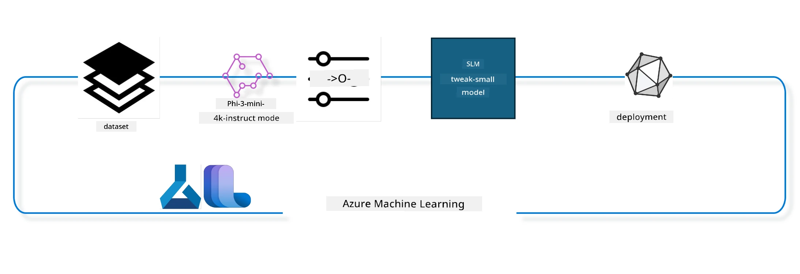

## How to use chat-completion components from the Azure ML system registry to fine-tune a model

Inside dis example, we go do fine tuning of di Phi-3-mini-4k-instruct model to complete conversation between 2 people using ultrachat_200k dataset.



Di example go show you how to take do fine tuning using di Azure ML SDK and Python and then deploy di fine tuned model to online endpoint for real time inference.

### Training data

We go use di ultrachat_200k dataset. Dis na heavily filtered version of di UltraChat dataset and e dey used to train Zephyr-7B-β, one state of di art 7b chat model.

### Model

We go use di Phi-3-mini-4k-instruct model to show how user fit finetune model for chat-completion task. If you open dis notebook from one specific model card, abeg remember to change di specific model name.

### Tasks

- Pick one model to fine tune.
- Pick and explore training data.
- Configure di fine tuning job.
- Run di fine tuning job.
- Review training and evaluation metrics.
- Register di fine tuned model.
- Deploy di fine tuned model for real time inference.
- Clean up resources.

## 1. Setup pre-requisites

- Install dependencies
- Connect to AzureML Workspace. Learn more at set up SDK authentication. Change <WORKSPACE_NAME>, <RESOURCE_GROUP> and <SUBSCRIPTION_ID> for below.
- Connect to azureml system registry
- Set optional experiment name
- Check or create compute.

> [!NOTE]
> Requirements na say one GPU node fit get many GPU cards. For example, for one node of Standard_NC24rs_v3, e get 4 NVIDIA V100 GPUs while for Standard_NC12s_v3, e get 2 NVIDIA V100 GPUs. Abeg check docs for this kind information. Di number of GPU cards wey dey for node na im di param gpus_per_node dey below dey control. If you set am well, e go make sure say all GPUs for di node dey used. Di recommended GPU compute SKUs fit dey for here and here.

### Python Libraries

Install dependencies by running di cell below. Dis no be optional step if na new environment you dey run.

```bash
pip install azure-ai-ml
pip install azure-identity
pip install datasets==2.9.0
pip install mlflow
pip install azureml-mlflow
```

### Interacting with Azure ML

1. Dis Python script dey used to interact with Azure Machine Learning (Azure ML) service. Na breakdown of wetin e dey do:

    - E dey import necessary modules from azure.ai.ml, azure.identity, and azure.ai.ml.entities packages. E also dey import time module.

    - E dey try authenticate using DefaultAzureCredential(), wey dey give simplified authentication experience to quickly start develop applications wey dey run inside Azure cloud. If e fail, e fallback to InteractiveBrowserCredential(), wey dey provide interactive login prompt.

    - E then dey try create MLClient instance using from_config method, wey dey read configuration from default config file (config.json). If e fail, e go create MLClient instance by manually giving subscription_id, resource_group_name, and workspace_name.

    - E create another MLClient instance, dis time for Azure ML registry named "azureml". Dis registry na where models, fine-tuning pipelines, and environments dey stored.

    - E set experiment_name to "chat_completion_Phi-3-mini-4k-instruct".

    - E generate unique timestamp by converting current time (in seconds since epoch, as floating point number) to integer then string. Dis timestamp fit be used for create unique names and versions.

    ```python
    # Import di necessary modules from Azure ML and Azure Identity
    from azure.ai.ml import MLClient
    from azure.identity import (
        DefaultAzureCredential,
        InteractiveBrowserCredential,
    )
    from azure.ai.ml.entities import AmlCompute
    import time  # Import time module
    
    # Try to authenticate using DefaultAzureCredential
    try:
        credential = DefaultAzureCredential()
        credential.get_token("https://management.azure.com/.default")
    except Exception as ex:  # If DefaultAzureCredential no work, use InteractiveBrowserCredential
        credential = InteractiveBrowserCredential()
    
    # Try to create MLClient instance using default config file
    try:
        workspace_ml_client = MLClient.from_config(credential=credential)
    except:  # If e no work, create MLClient instance by manually provide di details
        workspace_ml_client = MLClient(
            credential,
            subscription_id="<SUBSCRIPTION_ID>",
            resource_group_name="<RESOURCE_GROUP>",
            workspace_name="<WORKSPACE_NAME>",
        )
    
    # Create another MLClient instance for di Azure ML registry wey e get name "azureml"
    # Dis registry na where models, fine-tuning pipelines, and environments dey store
    registry_ml_client = MLClient(credential, registry_name="azureml")
    
    # Set di experiment name
    experiment_name = "chat_completion_Phi-3-mini-4k-instruct"
    
    # Generate unique timestamp wey fit dey used for names and versions wey gats be unique
    timestamp = str(int(time.time()))
    ```

## 2. Pick a foundation model to fine tune

1. Phi-3-mini-4k-instruct na 3.8B parameters, lightweight, state-of-the-art open model wey build on top datasets wey dem use for Phi-2. Di model belong to Phi-3 model family, and di Mini version get two variants 4K and 128K wey be di context length (in tokens) e fit support, we need to finetune di model for our specific purpose to fit use am. You fit browse these models for Model Catalog for AzureML Studio, filter am by di chat-completion task. For dis example, we go use di Phi-3-mini-4k-instruct model. If you open dis notebook for different model, abeg change di model name and version well well.

> [!NOTE]
> Model id property na from di model. E go pass as input to di fine tuning job. E also dey available as Asset ID field for model details page for AzureML Studio Model Catalog.

2. Dis Python script dey interact with Azure Machine Learning (Azure ML) service. Na breakdown of wetin e dey do:

    - E set model_name to "Phi-3-mini-4k-instruct".

    - E dey use get method of models property from registry_ml_client object to get latest version of model with di specified name from Azure ML registry. Di get method dey called with two arguments: model name and label wey specify say make e bring di latest version.

    - E dey print message to console wey talk di name, version, and id of model wey dem go use for fine-tuning. Di format method for string dey insert di name, version, and id into message. Di name, version, and id of di model dem get am as properties of di foundation_model object.

    ```python
    # Set di model name
    model_name = "Phi-3-mini-4k-instruct"
    
    # Collect di latest version of di model from di Azure ML registry
    foundation_model = registry_ml_client.models.get(model_name, label="latest")
    
    # Print di model name, version, and id
    # Dis information dey useful for tracking and debugging
    print(
        "\n\nUsing model name: {0}, version: {1}, id: {2} for fine tuning".format(
            foundation_model.name, foundation_model.version, foundation_model.id
        )
    )
    ```

## 3. Create a compute to be used with the job

Di finetune job go ONLY work with GPU compute. Di size of di compute depend on how big di model be, and for most cases, e fit be hard to find di right compute for di job. For dis cell, we go guide user to select di right compute.

> [!NOTE]
> Computes wey dem list below dey work with di most optimized configuration. Any change to di configuration fit cause Cuda Out Of Memory error. If that one happen, try upgrade di compute to bigger compute size.

> [!NOTE]
> When you dey select di compute_cluster_size below, abeg make sure say di compute dey for your resource group. If one compute no dey available, you fit request to get access to di compute resources.

### Checking Model for Fine Tuning Support

1. Dis Python script dey interact with Azure Machine Learning (Azure ML) model. Na breakdown of wetin e dey do:

    - E import ast module, wey get functions to process trees of Python abstract syntax grammar.

    - E check if foundation_model object (wey represent model for Azure ML) get tag named finetune_compute_allow_list. Tags for Azure ML na key-value pairs you fit create and use to filter and sort models.

    - If finetune_compute_allow_list tag dey present, e dey use ast.literal_eval function to safely parse di tag value (string) to Python list. Dis list go assign to computes_allow_list variable. E then print message wey say make user create compute from di list.

    - If finetune_compute_allow_list tag no dey, e set computes_allow_list to None and print message wey say finetune_compute_allow_list tag no dey part of model tags.

    - Summary be say, dis script dey check one specific tag for model metadata, convert tag value to list if e dey, and give feedback to user accordingly.

    ```python
    # Import di ast module, wey get functions to waka through trees of Python abstract syntax grammar
    import ast
    
    # Check if 'finetune_compute_allow_list' tag dey inside di model tags
    if "finetune_compute_allow_list" in foundation_model.tags:
        # If di tag dey, use ast.literal_eval to safely parse di tag value (wey na string) go Python list
        computes_allow_list = ast.literal_eval(
            foundation_model.tags["finetune_compute_allow_list"]
        )  # change string go python list
        # Print message wey talk say dem go create compute from di list
        print(f"Please create a compute from the above list - {computes_allow_list}")
    else:
        # If di tag no dey, make computes_allow_list be None
        computes_allow_list = None
        # Print message wey talk say 'finetune_compute_allow_list' tag no dey among di model tags
        print("`finetune_compute_allow_list` is not part of model tags")
    ```

### Checking Compute Instance

1. Dis Python script dey interact with Azure Machine Learning (Azure ML) service and e dey do plenty checks on compute instance. Na breakdown of wetin e dey do:

    - E try retrieve compute instance wey name dey inside compute_cluster from Azure ML workspace. If provisioning state of compute instance be "failed", e go raise ValueError.

    - E check if computes_allow_list no be None. If no be None, e go convert all compute sizes inside list to lowercase and check if size of current compute instance dey inside list. If no dey, e go raise ValueError.

    - If computes_allow_list be None, e check if compute instance size dey inside list of unsupported GPU VM sizes. If e dey, e go raise ValueError.

    - E retrieve list of all available compute sizes for workspace. E then loop through dis list, for each compute size, e check if name match size of current compute instance. If e match, e retrieve number of GPUs for that compute size and set gpu_count_found to True.

    - If gpu_count_found be True, e print number of GPUs inside compute instance. If no be True, e go raise ValueError.

    - Summary be say, dis script dey do plenty checks on compute instance inside Azure ML workspace, including checking provisioning state, size against allow list or deny list, and number of GPUs inside am.
    
    ```python
    # Print di exception message
    print(e)
    # Raise ValueError if di compute size no dey for di workspace
    raise ValueError(
        f"WARNING! Compute size {compute_cluster_size} not available in workspace"
    )
    
    # Comot di compute instance from di Azure ML workspace
    compute = workspace_ml_client.compute.get(compute_cluster)
    # Check if di provisioning state of di compute instance na "failed"
    if compute.provisioning_state.lower() == "failed":
        # Raise ValueError if di provisioning state na "failed"
        raise ValueError(
            f"Provisioning failed, Compute '{compute_cluster}' is in failed state. "
            f"please try creating a different compute"
        )
    
    # Check if computes_allow_list no be None
    if computes_allow_list is not None:
        # Change all compute sizes for computes_allow_list to small letter
        computes_allow_list_lower_case = [x.lower() for x in computes_allow_list]
        # Check if di size of di compute instance dey for computes_allow_list_lower_case
        if compute.size.lower() not in computes_allow_list_lower_case:
            # Raise ValueError if di size of di compute instance no dey for computes_allow_list_lower_case
            raise ValueError(
                f"VM size {compute.size} is not in the allow-listed computes for finetuning"
            )
    else:
        # Define list of GPU VM sizes wey no support
        unsupported_gpu_vm_list = [
            "standard_nc6",
            "standard_nc12",
            "standard_nc24",
            "standard_nc24r",
        ]
        # Check if di size of di compute instance dey for unsupported_gpu_vm_list
        if compute.size.lower() in unsupported_gpu_vm_list:
            # Raise ValueError if di size of di compute instance dey for unsupported_gpu_vm_list
            raise ValueError(
                f"VM size {compute.size} is currently not supported for finetuning"
            )
    
    # Start flag to check if number of GPU inside di compute instance don find
    gpu_count_found = False
    # Collect list of all compute sizes wey dey for workspace
    workspace_compute_sku_list = workspace_ml_client.compute.list_sizes()
    available_sku_sizes = []
    # waka through di list of available compute sizes
    for compute_sku in workspace_compute_sku_list:
        available_sku_sizes.append(compute_sku.name)
        # Check if di name of di compute size match di size of di compute instance
        if compute_sku.name.lower() == compute.size.lower():
            # If e match, collect number of GPUs for dat compute size and set gpu_count_found to True
            gpus_per_node = compute_sku.gpus
            gpu_count_found = True
    # If gpu_count_found na True, print number of GPUs for di compute instance
    if gpu_count_found:
        print(f"Number of GPU's in compute {compute.size}: {gpus_per_node}")
    else:
        # If gpu_count_found na False, raise ValueError
        raise ValueError(
            f"Number of GPU's in compute {compute.size} not found. Available skus are: {available_sku_sizes}."
            f"This should not happen. Please check the selected compute cluster: {compute_cluster} and try again."
        )
    ```

## 4. Pick the dataset for fine-tuning the model

1. We use di ultrachat_200k dataset. Di dataset get four splits, wey dey suitable for Supervised fine-tuning (sft).
Generation ranking (gen). Di number of examples per split dey show as follows:

    ```bash
    train_sft test_sft  train_gen  test_gen
    207865  23110  256032  28304
    ```

1. Di next few cells go show basic data preparation for fine tuning:

### Visualize some data rows

We want make dis sample run fast fast, so we go save train_sft, test_sft files wey get 5% of di trimmed rows dem already get. This one mean say di fine tuned model no go get high accuracy, so e no suppose for real-world use.
The download-dataset.py dey used to download di ultrachat_200k dataset and transform di dataset into finetune pipeline component consumable format. Plus di dataset big, so we only get part of am here.

1. Running di script below go only download 5% of di data. You fit increase am by changing di dataset_split_pc parameter to di percentage wey you want.

> [!NOTE]
> Some language models get different language codes and so di column names for di dataset suppose reflect di same.

1. Here na example of how data suppose look like
Di chat-completion dataset dey store for parquet format and every entry dey use di following schema:

    - Dis na JSON (JavaScript Object Notation) document, wey popular for data interchange format. E no be executable code, na way to store and transport data. Here na breakdown of im structure:

    - "prompt": Dis key get string value wey represent task or question wey dem ask AI assistant.

    - "messages": Dis key get array of objects. Each object represent message inside conversation between user and AI assistant. Each message object get two keys:

    - "content": Dis key get string value wey be content of di message.
    - "role": Dis key get string value wey represent role of di entity wey send di message. E fit be either "user" or "assistant".
    - "prompt_id": Dis key get string value wey represent unique identifier for di prompt.

1. For dis particular JSON document, conversation exist where user ask AI assistant to create protagonist for dystopian story. Di assistant respond, and di user ask for more details. Di assistant agree to give more details. Di whole conversation dey linked to specific prompt id.

    ```python
    {
        // The task or question posed to an AI assistant
        "prompt": "Create a fully-developed protagonist who is challenged to survive within a dystopian society under the rule of a tyrant. ...",
        
        // An array of objects, each representing a message in a conversation between a user and an AI assistant
        "messages":[
            {
                // The content of the user's message
                "content": "Create a fully-developed protagonist who is challenged to survive within a dystopian society under the rule of a tyrant. ...",
                // The role of the entity that sent the message
                "role": "user"
            },
            {
                // The content of the assistant's message
                "content": "Name: Ava\n\n Ava was just 16 years old when the world as she knew it came crashing down. The government had collapsed, leaving behind a chaotic and lawless society. ...",
                // The role of the entity that sent the message
                "role": "assistant"
            },
            {
                // The content of the user's message
                "content": "Wow, Ava's story is so intense and inspiring! Can you provide me with more details.  ...",
                // The role of the entity that sent the message
                "role": "user"
            }, 
            {
                // The content of the assistant's message
                "content": "Certainly! ....",
                // The role of the entity that sent the message
                "role": "assistant"
            }
        ],
        
        // A unique identifier for the prompt
        "prompt_id": "d938b65dfe31f05f80eb8572964c6673eddbd68eff3db6bd234d7f1e3b86c2af"
    }
    ```

### Download Data

1. Dis Python script dey used to download dataset using helper script wey dem call download-dataset.py. Here na wetin e dey do:

    - E import os module, wey give portable way to use operating system dependent functions.

    - E use os.system function to run download-dataset.py script inside shell with specific command-line arguments. Arguments specify which dataset to download (HuggingFaceH4/ultrachat_200k), directory to download am to (ultrachat_200k_dataset), and percentage of dataset to split (5). Di os.system go return exit status of command wey e run; dis status dey store for exit_status variable.

    - E check if exit_status no be 0. For Unix-like operating systems, exit status 0 mean command succeed, any other number mean error. If exit_status no be 0, e go raise Exception with message wey tell say error happen during dataset download.

    - In summary, dis script dey run command to download dataset using helper script, and if command fail, e go raise exception.
    
    ```python
    # Import di os module, wey dey provide way to use operating system dependent functionality
    import os
    
    # Use di os.system function to run di download-dataset.py script for di shell wit specific command-line arguments
    # Di arguments talk di dataset wey you wan download (HuggingFaceH4/ultrachat_200k), di directory wey you wan put am (ultrachat_200k_dataset), and di percentage of di dataset wey you go split (5)
    # Di os.system function go return di exit status of di command wey e run; dis status dey store for di exit_status variable
    exit_status = os.system(
        "python ./download-dataset.py --dataset HuggingFaceH4/ultrachat_200k --download_dir ultrachat_200k_dataset --dataset_split_pc 5"
    )
    
    # Check if exit_status no be 0
    # For Unix-like operating systems, exit status wey be 0 mean say command don succeed, but any oda number mean say error dey
    # If exit_status no be 0, raise Exception wit message wey talk say error dey for downloading di dataset
    if exit_status != 0:
        raise Exception("Error downloading dataset")
    ```

### Loading Data into a DataFrame
1. Dis Python script dey load one JSON Lines file inside one pandas DataFrame and e dey show di first 5 rows. Dis na wetin e dey do:

    - E dey import pandas library, wey be strong tool for handling and checking data.

    - E put max column width for pandas display settings to 0. Dis mean say full text for each column go show without cutting off when dem print di DataFrame.

    - E use pd.read_json function load di train_sft.jsonl file from di ultrachat_200k_dataset folder into DataFrame. Di lines=True argument mean say di file na JSON Lines format, wey mean each line na separate JSON object.

    - E use di head method show di first 5 rows of di DataFrame. If DataFrame get less than 5 rows, e go show all of dem.

    - Overall, dis script dey load JSON Lines file inside DataFrame and e dey show di first 5 rows with full column text.
    
    ```python
    # Bring in the pandas library, wey dey strong for data manipulation and analysis
    import pandas as pd
    
    # Set the max column width for pandas' display options to 0
    # Dis mean say the full text of each column go show without cut when you print the DataFrame
    pd.set_option("display.max_colwidth", 0)
    
    # Use the pd.read_json function to load the train_sft.jsonl file from the ultrachat_200k_dataset directory into one DataFrame
    # The lines=True argument show say the file dey JSON Lines format, wey mean each line na different JSON object
    df = pd.read_json("./ultrachat_200k_dataset/train_sft.jsonl", lines=True)
    
    # Use the head method to show the first 5 rows of the DataFrame
    # If the DataFrame get less than 5 rows, e go show all of dem
    df.head()
    ```

## 5. Submit di fine tuning job using di model and data as inputs

Make you create di job wey go use di chat-completion pipeline component. Learn more about all di parameters wey fine tuning de support.

### Define finetune parameters

1. Finetune parameters fit divide into 2 main types - training parameters, optimization parameters

1. Training parameters na wetin define di training aspects for example -

    - Di optimizer, scheduler wey go use
    - Di metric wey go optimize di finetune
    - Number of training steps, batch size, and so on
    - Optimization parameters dey help optimize GPU memory and make compute resources dey used well.

1. Below na some parameters for dis category. Di optimization parameters dey different for each model and dem package am with di model so dat e fit handle di differences.

    - Enable di deepspeed and LoRA
    - Enable mixed precision training
    - Enable multi-node training

> [!NOTE]
> Supervised finetuning fit cause loss of alignment or catastrophic forgetting. We dey recommend to check dat kind problem and run an alignment stage after you finish finetune.

### Fine Tuning Parameters

1. Dis Python script dey set parameters for fine-tuning machine learning model. Na wetin e dey do e be dis:

    - E dey set default training parameters like number of epochs, batch sizes for training and evaluation, learning rate, and learning rate scheduler type.

    - E dey set default optimization parameters like whether to apply Layer-wise Relevance Propagation (LoRa) and DeepSpeed, plus di DeepSpeed stage.

    - E merge di training and optimization parameters into one dictionary called finetune_parameters.

    - E check if di foundation_model get any model-specific default parameters. If e get, e go print warning message and update di finetune_parameters dictionary with di model-specific defaults. E dey use ast.literal_eval function convert di model-specific defaults from string go Python dictionary.

    - E print di final set of fine-tuning parameters wey go use for di run.

    - Overall, dis script dey set up and show di parameters for fine-tuning machine learning model, with option to override default parameters with model-specific ones.

    ```python
    # Set up default training parameters like how many training epochs, batch sizes for training and evaluation, learning rate, and wetin kind learning rate scheduler go use
    training_parameters = dict(
        num_train_epochs=3,
        per_device_train_batch_size=1,
        per_device_eval_batch_size=1,
        learning_rate=5e-6,
        lr_scheduler_type="cosine",
    )
    
    # Set up default optimization parameters like whether to use Layer-wise Relevance Propagation (LoRa) and DeepSpeed, plus the DeepSpeed stage
    optimization_parameters = dict(
        apply_lora="true",
        apply_deepspeed="true",
        deepspeed_stage=2,
    )
    
    # Join the training and optimization parameters into one dictionary wey dem go call finetune_parameters
    finetune_parameters = {**training_parameters, **optimization_parameters}
    
    # Check if the foundation_model get any model-specific default parameters
    # If e get, print warning message and update the finetune_parameters dictionary with these model-specific defaults
    # The ast.literal_eval function dey used to change the model-specific defaults from string to Python dictionary
    if "model_specific_defaults" in foundation_model.tags:
        print("Warning! Model specific defaults exist. The defaults could be overridden.")
        finetune_parameters.update(
            ast.literal_eval(  # change string to python dict
                foundation_model.tags["model_specific_defaults"]
            )
        )
    
    # Print the final fine-tuning parameters wey dem go use for the run
    print(
        f"The following finetune parameters are going to be set for the run: {finetune_parameters}"
    )
    ```

### Training Pipeline

1. Dis Python script dey define function to generate display name for machine learning training pipeline, then e dey call dis function to generate and print di display name. Na wetin e dey do:

1. E define di get_pipeline_display_name function. Dis function go create display name based on different parameters about di training pipeline.

1. Inside di function, e calculate total batch size by multiplying di per-device batch size, number of gradient accumulation steps, number of GPUs per node, and number of nodes wey dem dey use for fine-tuning.

1. E grab other parameters like di learning rate scheduler type, whether dem dey use DeepSpeed, di DeepSpeed stage, whether dem dey use Layer-wise Relevance Propagation (LoRa), limit on number of model checkpoints to keep, and di max sequence length.

1. E combine all dis parameters into one string separated by hyphen. If DeepSpeed or LoRa dey apply, di string go get "ds" plus di DeepSpeed stage, or "lora". If dem no dey apply, e go put "nods" or "nolora" instead.

1. Di function go return dis string, wey be di display name for di training pipeline.

1. After e define di function, e call am to generate di display name, then print am.

1. Overall, dis script dey generate display name for machine learning training pipeline based on plenty parameters, then e print di display name.

    ```python
    # Define one function wey go generate display name for the training pipeline
    def get_pipeline_display_name():
        # Calculate the total batch size by multiply the per-device batch size, the number of gradient accumulation steps, the number of GPUs per node, and the number of nodes wey dem dey use for fine-tuning
        batch_size = (
            int(finetune_parameters.get("per_device_train_batch_size", 1))
            * int(finetune_parameters.get("gradient_accumulation_steps", 1))
            * int(gpus_per_node)
            * int(finetune_parameters.get("num_nodes_finetune", 1))
        )
        # Make we collect the learning rate scheduler type
        scheduler = finetune_parameters.get("lr_scheduler_type", "linear")
        # Make we check if DeepSpeed dey applied
        deepspeed = finetune_parameters.get("apply_deepspeed", "false")
        # Make we fetch the DeepSpeed stage
        ds_stage = finetune_parameters.get("deepspeed_stage", "2")
        # If DeepSpeed dey applied, make you add "ds" plus the DeepSpeed stage for the display name; if e no dey, add "nods"
        if deepspeed == "true":
            ds_string = f"ds{ds_stage}"
        else:
            ds_string = "nods"
        # Make we check if Layer-wise Relevance Propagation (LoRa) dey applied
        lora = finetune_parameters.get("apply_lora", "false")
        # If LoRa dey applied, make you add "lora" for the display name; if e no dey, add "nolora"
        if lora == "true":
            lora_string = "lora"
        else:
            lora_string = "nolora"
        # Make we get the limit for how many model checkpoints to keep
        save_limit = finetune_parameters.get("save_total_limit", -1)
        # Make we get the maximum sequence length
        seq_len = finetune_parameters.get("max_seq_length", -1)
        # Make we arrange the display name by joining all these parameters together, separate dem with hyphens
        return (
            model_name
            + "-"
            + "ultrachat"
            + "-"
            + f"bs{batch_size}"
            + "-"
            + f"{scheduler}"
            + "-"
            + ds_string
            + "-"
            + lora_string
            + f"-save_limit{save_limit}"
            + f"-seqlen{seq_len}"
        )
    
    # Call the function to generate the display name
    pipeline_display_name = get_pipeline_display_name()
    # Print the display name
    print(f"Display name used for the run: {pipeline_display_name}")
    ```

### Configuring Pipeline

Dis Python script dey define and arrange one machine learning pipeline using Azure Machine Learning SDK. Na wetin e dey do:

1. E dey import necessary modules from Azure AI ML SDK.

1. E dey fetch pipeline component wey dem name "chat_completion_pipeline" from registry.

1. E dey define pipeline job using `@pipeline` decorator and function `create_pipeline`. Di pipeline name na `pipeline_display_name`.

1. Inside di `create_pipeline` function, e initialize di component wey e fetch with plenty parameters including model path, compute clusters for different stages, dataset splits for training and testing, di number of GPUs to use for fine-tuning, and other fine-tuning parameters.

1. E dey map output of fine-tuning job to output of pipeline job. Dis na so fine-tuned model go fit register well, wey dem need to deploy model to online or batch endpoint.

1. E create instance of pipeline by calling `create_pipeline` function.

1. E set `force_rerun` option of pipeline to `True`. Means say any cached results from previous jobs no go use.

1. E set `continue_on_step_failure` option of pipeline to `False`. Means pipeline go stop if any step fail.

1. Overall, dis script dey define and arrange machine learning pipeline for chat completion task using Azure Machine Learning SDK.

    ```python
    # Import wetin dem need from Azure AI ML SDK
    from azure.ai.ml.dsl import pipeline
    from azure.ai.ml import Input
    
    # Comot di pipeline component wey dem call "chat_completion_pipeline" from di registry
    pipeline_component_func = registry_ml_client.components.get(
        name="chat_completion_pipeline", label="latest"
    )
    
    # Define di pipeline job with the @pipeline decorator and di create_pipeline function
    # Di name of di pipeline na pipeline_display_name
    @pipeline(name=pipeline_display_name)
    def create_pipeline():
        # Start di pipeline component wey dem fetch with different parameters
        # Dem get di model path, compute clusters for different stages, dataset splits for training and testing, di number of GPUs to use for fine-tuning, plus other fine-tuning parameters
        chat_completion_pipeline = pipeline_component_func(
            mlflow_model_path=foundation_model.id,
            compute_model_import=compute_cluster,
            compute_preprocess=compute_cluster,
            compute_finetune=compute_cluster,
            compute_model_evaluation=compute_cluster,
            # Make di dataset splits follow parameters
            train_file_path=Input(
                type="uri_file", path="./ultrachat_200k_dataset/train_sft.jsonl"
            ),
            test_file_path=Input(
                type="uri_file", path="./ultrachat_200k_dataset/test_sft.jsonl"
            ),
            # Training settings
            number_of_gpu_to_use_finetuning=gpus_per_node,  # Set am to di number of GPUs wey dey di compute
            **finetune_parameters
        )
        return {
            # Join di output of fine tuning job with di output of di pipeline job
            # Dis one na make e easy to register di fine tuned model
            # To register di model na wetin you need to do to fit deploy di model for online or batch endpoint
            "trained_model": chat_completion_pipeline.outputs.mlflow_model_folder
        }
    
    # Create instance of di pipeline by calling di create_pipeline function
    pipeline_object = create_pipeline()
    
    # No use cached results from di previous jobs
    pipeline_object.settings.force_rerun = True
    
    # Set make e no continue if step fail
    # Dis one mean say pipeline go stop if any step fail
    pipeline_object.settings.continue_on_step_failure = False
    ```

### Submit di Job

1. Dis Python script dey submit machine learning pipeline job to Azure Machine Learning workspace, then e dey wait make job finish. Na wetin e dey do:

    - E dey call create_or_update method of jobs object inside workspace_ml_client to submit pipeline job. Pipeline wey go run na pipeline_object, experiment wey go run the job under na experiment_name.

    - E dey call stream method of jobs object inside workspace_ml_client to wait make pipeline job complete. Job to wait for na name attribute of pipeline_job object.

    - Overall, dis script dey submit machine learning pipeline job to Azure Machine Learning workspace, then e dey wait make job finish.

    ```python
    # Send pipeline job go Azure Machine Learning workspace
    # Pipeline wey go run na pipeline_object na im be
    # Experiment wey dem run the job under na experiment_name na e be
    pipeline_job = workspace_ml_client.jobs.create_or_update(
        pipeline_object, experiment_name=experiment_name
    )
    
    # Wait make pipeline job finish
    # The job wey you go wait for na the name attribute of the pipeline_job object
    workspace_ml_client.jobs.stream(pipeline_job.name)
    ```

## 6. Register di fine tuned model with di workspace

We go register di model from di output of di fine tuning job. Dis one go track lineage between di fine tuned model and di fine tuning job. Di fine tuning job, still, dey track lineage to di foundation model, data and training code.

### Registering di ML Model

1. Dis Python script dey register machine learning model wey dem train inside Azure Machine Learning pipeline. Na wetin e dey do:

    - E dey import necessary modules from Azure AI ML SDK.

    - E check if di trained_model output dey from di pipeline job by calling get method of jobs object inside workspace_ml_client and then access outputs attribute.

    - E construct path to di trained model by formatting string with di pipeline job name and output name "trained_model".

    - E define name for fine-tuned model by appending "-ultrachat-200k" to original model name and replace any slashes with hyphens.

    - E dey prepare to register model by creating Model object with di model path, model type (MLflow model), model name and version, and description.

    - E register di model by calling create_or_update method of models object inside workspace_ml_client with Model object as argument.

    - E print di registered model.

1. Overall, dis script dey register machine learning model wey dem train inside Azure Machine Learning pipeline.
    
    ```python
    # Bring in di necessary modules from di Azure AI ML SDK
    from azure.ai.ml.entities import Model
    from azure.ai.ml.constants import AssetTypes
    
    # Check if di `trained_model` output dey available from di pipeline job
    print("pipeline job outputs: ", workspace_ml_client.jobs.get(pipeline_job.name).outputs)
    
    # Build di path to di trained model by arranging string wit di name of di pipeline job and di name of di output ("trained_model")
    model_path_from_job = "azureml://jobs/{0}/outputs/{1}".format(
        pipeline_job.name, "trained_model"
    )
    
    # Set name for di fine-tuned model by adding "-ultrachat-200k" to di original model name and change any slash to hyphen
    finetuned_model_name = model_name + "-ultrachat-200k"
    finetuned_model_name = finetuned_model_name.replace("/", "-")
    
    print("path to register model: ", model_path_from_job)
    
    # Get ready to register di model by creating one Model object wit different parameters
    # Dis include di path to di model, di type of di model (MLflow model), di name and version of di model, plus di description of di model
    prepare_to_register_model = Model(
        path=model_path_from_job,
        type=AssetTypes.MLFLOW_MODEL,
        name=finetuned_model_name,
        version=timestamp,  # Use timestamp as version make e no get version wahala
        description=model_name + " fine tuned model for ultrachat 200k chat-completion",
    )
    
    print("prepare to register model: \n", prepare_to_register_model)
    
    # Register di model by calling di create_or_update method of di models object for di workspace_ml_client wit di Model object as di argument
    registered_model = workspace_ml_client.models.create_or_update(
        prepare_to_register_model
    )
    
    # Show di registered model for print
    print("registered model: \n", registered_model)
    ```

## 7. Deploy di fine tuned model to online endpoint

Online endpoints dey give durable REST API wey fit use join applications wey need use di model.

### Manage Endpoint

1. Dis Python script dey create managed online endpoint for Azure Machine Learning for one registered model. Na wetin e dey do:

    - E dey import necessary modules from Azure AI ML SDK.

    - E define unique name for di online endpoint by appending timestamp to "ultrachat-completion-".

    - E prepare to create online endpoint by creating ManagedOnlineEndpoint object with parameters like endpoint name, description, and authentication mode ("key").

    - E create di online endpoint by calling begin_create_or_update method of workspace_ml_client with ManagedOnlineEndpoint object then wait for creation to finish with wait method.

1. Overall, dis script dey create managed online endpoint for Azure Machine Learning for registered model.

    ```python
    # Import di necessary modules from di Azure AI ML SDK
    from azure.ai.ml.entities import (
        ManagedOnlineEndpoint,
        ManagedOnlineDeployment,
        ProbeSettings,
        OnlineRequestSettings,
    )
    
    # Define one unique name for di online endpoint by adding one timestamp to di string "ultrachat-completion-"
    online_endpoint_name = "ultrachat-completion-" + timestamp
    
    # Prepare to create di online endpoint by creating one ManagedOnlineEndpoint object with different parameters
    # Dem include di name of di endpoint, one description of di endpoint, and di authentication mode ("key")
    endpoint = ManagedOnlineEndpoint(
        name=online_endpoint_name,
        description="Online endpoint for "
        + registered_model.name
        + ", fine tuned model for ultrachat-200k-chat-completion",
        auth_mode="key",
    )
    
    # Create di online endpoint by to call di begin_create_or_update method of di workspace_ml_client with di ManagedOnlineEndpoint object as di argument
    # Den wait for di creation operation to finish by to call di wait method
    workspace_ml_client.begin_create_or_update(endpoint).wait()
    ```

> [!NOTE]
> You fit see here list of SKUs wey dem support for deployment - [Managed online endpoints SKU list](https://learn.microsoft.com/azure/machine-learning/reference-managed-online-endpoints-vm-sku-list)

### Deploying ML Model

1. Dis Python script dey deploy registered machine learning model to managed online endpoint for Azure Machine Learning. Na wetin e do:

    - E import ast module, wey dey provide function to handle Python abstract syntax grammar trees.

    - E set instance type for deployment to "Standard_NC6s_v3".

    - E check if inference_compute_allow_list tag dey for foundation model. If e dey, e convert tag value from string to Python list and assign am to inference_computes_allow_list. If no, e set inference_computes_allow_list to None.

    - E check if di set instance type dey inside allow list. If no dey, e print message wey tell user to pick instance type from allow list.

    - E prepare to create deployment by creating ManagedOnlineDeployment object with parameters like deployment name, endpoint name, model ID, instance type and count, liveness probe settings, and request settings.

    - E create deployment by calling begin_create_or_update of workspace_ml_client with ManagedOnlineDeployment object then e wait for creation complete with wait method.

    - E set traffic of endpoint to direct 100% traffic to "demo" deployment.

    - E update endpoint by calling begin_create_or_update of workspace_ml_client with endpoint object, then wait for update to complete with result method.

1. Overall, dis script dey deploy registered machine learning model to managed online endpoint for Azure Machine Learning.

    ```python
    # Import di ast module, wey dey provide functions to process trees of di Python abstract syntax grammar
    import ast
    
    # Set di instance type for di deployment
    instance_type = "Standard_NC6s_v3"
    
    # Check if di `inference_compute_allow_list` tag dey for di foundation model
    if "inference_compute_allow_list" in foundation_model.tags:
        # If e dey, convert di tag value from string go Python list and assign am to `inference_computes_allow_list`
        inference_computes_allow_list = ast.literal_eval(
            foundation_model.tags["inference_compute_allow_list"]
        )
        print(f"Please create a compute from the above list - {computes_allow_list}")
    else:
        # If e no dey, set `inference_computes_allow_list` to `None`
        inference_computes_allow_list = None
        print("`inference_compute_allow_list` is not part of model tags")
    
    # Check if di specified instance type dey for di allow list
    if (
        inference_computes_allow_list is not None
        and instance_type not in inference_computes_allow_list
    ):
        print(
            f"`instance_type` is not in the allow listed compute. Please select a value from {inference_computes_allow_list}"
        )
    
    # Prepare to create di deployment by creating `ManagedOnlineDeployment` object wit different parameters
    demo_deployment = ManagedOnlineDeployment(
        name="demo",
        endpoint_name=online_endpoint_name,
        model=registered_model.id,
        instance_type=instance_type,
        instance_count=1,
        liveness_probe=ProbeSettings(initial_delay=600),
        request_settings=OnlineRequestSettings(request_timeout_ms=90000),
    )
    
    # Create di deployment by calling di `begin_create_or_update` method of di `workspace_ml_client` wit di `ManagedOnlineDeployment` object as di argument
    # Then wait for di creation operation to finish by calling di `wait` method
    workspace_ml_client.online_deployments.begin_create_or_update(demo_deployment).wait()
    
    # Set di traffic for di endpoint to direct 100% of di traffic go di "demo" deployment
    endpoint.traffic = {"demo": 100}
    
    # Update di endpoint by calling di `begin_create_or_update` method of di `workspace_ml_client` wit di `endpoint` object as di argument
    # Then wait for di update operation to finish by calling di `result` method
    workspace_ml_client.begin_create_or_update(endpoint).result()
    ```

## 8. Test di endpoint with sample data

We go fetch some sample data from test dataset and submit to online endpoint for inference. Then we go show scored labels alongside di ground truth labels.

### Reading di results

1. Dis Python script dey read JSON Lines file into pandas DataFrame, grab random sample, then reset di index. Na wetin e do:

    - E read file ./ultrachat_200k_dataset/test_gen.jsonl into pandas DataFrame. E dey use read_json function with lines=True because file be JSON Lines format, wey mean each line na separate JSON object.

    - E take random sample of 1 row from DataFrame. E dey use sample function with n=1 to specify number of rows to pick randomly.

    - E reset index of DataFrame. E dey use reset_index with drop=True to remove original index and put new default integer index.

    - E display first 2 rows of DataFrame using head function with argument 2. But because DataFrame only get one row after sampling, e go only show dat one row.

1. Overall, dis script dey read JSON Lines file into pandas DataFrame, take random sample of 1 row, reset index, then show first row.
    
    ```python
    # Bring in pandas library
    import pandas as pd
    
    # Read the JSON Lines file './ultrachat_200k_dataset/test_gen.jsonl' put am for pandas DataFrame
    # The 'lines=True' mean say the file na for JSON Lines format, wey each line be separate JSON object
    test_df = pd.read_json("./ultrachat_200k_dataset/test_gen.jsonl", lines=True)
    
    # Make you pick random sample of 1 row from the DataFrame
    # The 'n=1' mean how many random rows you wan choose
    test_df = test_df.sample(n=1)
    
    # Reset the index of the DataFrame
    # The 'drop=True' mean say make dem comot the original index and put new index wey be default number
    # The 'inplace=True' mean say make the DataFrame change for inside without create new object
    test_df.reset_index(drop=True, inplace=True)
    
    # Show the first 2 rows of the DataFrame
    # But because the DataFrame get only one row after sampling, e go just show that one row only
    test_df.head(2)
    ```

### Create JSON Object
1. Dis Python script dey create one JSON object wit specific parameters and saving am for one file. Na so e dey do am:

    - E import the json module, wey dey provide functions to work wit JSON data.

    - E create one dictionary parameters wey get keys and values wey represent parameters for machine learning model. The keys na "temperature", "top_p", "do_sample", and "max_new_tokens", and their corresponding values na 0.6, 0.9, True, and 200 respectively.

    - E create another dictionary test_json wey get two keys: "input_data" and "params". The value for "input_data" na another dictionary wit keys "input_string" and "parameters". The value for "input_string" na list wey get the first message from the test_df DataFrame. The value for "parameters" na the parameters dictionary wey e create before. The value for "params" na empty dictionary.

    - E open one file wey dem name sample_score.json
    
    ```python
    # Import di json module, wey get functions to work with JSON data
    import json
    
    # Create one dictionary `parameters` with keys and values wey represent parameters for machine learning model
    # Di keys na "temperature", "top_p", "do_sample", and "max_new_tokens", and their corresponding values na 0.6, 0.9, True, and 200 respectively
    parameters = {
        "temperature": 0.6,
        "top_p": 0.9,
        "do_sample": True,
        "max_new_tokens": 200,
    }
    
    # Create another dictionary `test_json` wey get two keys: "input_data" and "params"
    # Di value of "input_data" na another dictionary with keys "input_string" and "parameters"
    # Di value of "input_string" na one list wey get di first message from di `test_df` DataFrame
    # Di value of "parameters" na di `parameters` dictionary we create before
    # Di value of "params" na empty dictionary
    test_json = {
        "input_data": {
            "input_string": [test_df["messages"][0]],
            "parameters": parameters,
        },
        "params": {},
    }
    
    # Open one file wey dem name `sample_score.json` for di `./ultrachat_200k_dataset` directory for write mode
    with open("./ultrachat_200k_dataset/sample_score.json", "w") as f:
        # Write di `test_json` dictionary go inside di file for JSON format using di `json.dump` function
        json.dump(test_json, f)
    ```

### Invoking Endpoint

1. Dis Python script dey invoke online endpoint for Azure Machine Learning to score one JSON file. Na wetin e dey do:

    - E call the invoke method of the online_endpoints property of the workspace_ml_client object. Dis method na to send request go online endpoint and get response.

    - E specify the name of the endpoint and the deployment wit the endpoint_name and deployment_name arguments. For here, the endpoint name dey inside the online_endpoint_name variable and the deployment name na "demo".

    - E specify the path to the JSON file wey dem dey score wit the request_file argument. For here, the file na ./ultrachat_200k_dataset/sample_score.json.

    - E store the response from the endpoint inside the response variable.

    - E print the raw response.

1. To summarize, dis script dey invoke online endpoint for Azure Machine Learning to score one JSON file and dey print the response.

    ```python
    # Call the online point for Azure Machine Learning to score di `sample_score.json` file
    # Di `invoke` method for `online_endpoints` property of di `workspace_ml_client` object na to send request go online point and collect response
    # Di `endpoint_name` argument mean di name of di endpoint, wey dey for `online_endpoint_name` variable
    # Di `deployment_name` argument mean di name of di deployment, wey be "demo"
    # Di `request_file` argument mean di path to di JSON file wey we wan score, na `./ultrachat_200k_dataset/sample_score.json`
    response = workspace_ml_client.online_endpoints.invoke(
        endpoint_name=online_endpoint_name,
        deployment_name="demo",
        request_file="./ultrachat_200k_dataset/sample_score.json",
    )
    
    # Show di fresh response wey come from di endpoint
    print("raw response: \n", response, "\n")
    ```

## 9. Delete the online endpoint

1. No forget to delete the online endpoint, because if you no delete am, the billing meter go continue dey run for the compute wey the endpoint dey use. Dis Python code line dey delete one online endpoint for Azure Machine Learning. Na wetin e dey do:

    - E call the begin_delete method of the online_endpoints property of the workspace_ml_client object. Dis method dey start the deletion of online endpoint.

    - E specify the name of the endpoint wey e wan delete wit the name argument. For here, the endpoint name dey inside the online_endpoint_name variable.

    - E call the wait method to wait for the deletion process to finish. Dis one na blocking operation, meaning say the script no go continue until the deletion finish.

    - Summary be say, dis line of code dey start the deletion of online endpoint for Azure Machine Learning and e dey wait make the operation finish.

    ```python
    # Delete di online endpoint for Azure Machine Learning
    # Di `begin_delete` method wey dey for di `online_endpoints` property of di `workspace_ml_client` object na to start to delete online endpoint
    # Di `name` argument dey tell di name of di endpoint wey dem go delete, wey dey for di `online_endpoint_name` variable
    # Dem go call di `wait` method to dey wait make deletion operation finish. Dis one na blocking operation, e mean say e no go gree make script continue till deletion done complete
    workspace_ml_client.online_endpoints.begin_delete(name=online_endpoint_name).wait()
    ```

---

<!-- CO-OP TRANSLATOR DISCLAIMER START -->
**Disclaimer**: Dis document don translate wit AI translation service [Co-op Translator](https://github.com/Azure/co-op-translator). Even though we dey try make am correct, abeg make you sabi say automated translations fit get some errors or wrong parts. Di original document wey e dey your own language na di correct one wey you go trust pass. If na serious matter, better make human professional person translate am for you. We no go responsible if person no sabi or misunderstand anything wey come from dis translation.
<!-- CO-OP TRANSLATOR DISCLAIMER END -->