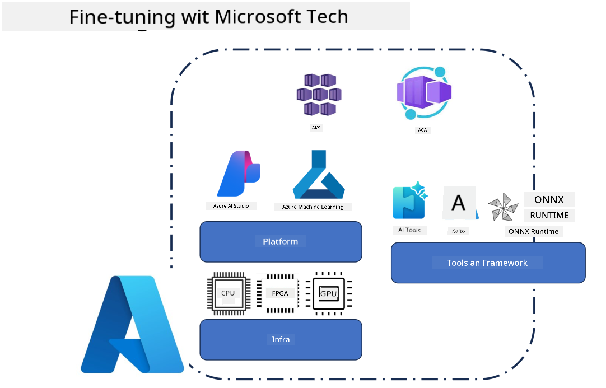
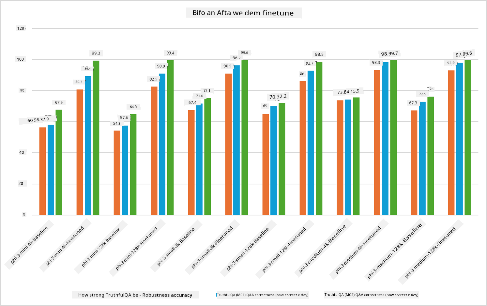

## Fine Tuning Scenarios

**Platform** Dis dey include different technologies like Azure AI Foundry, Azure Machine Learning, AI Tools, Kaito, and ONNX Runtime. 

**Infrastructure** Dis dey include the CPU and FPGA, wey dey important for the fine-tuning process. Make I show you the icons for each of these technologies.

**Tools & Framework** Dis dey include ONNX Runtime and ONNX Runtime. Make I show you the icons for each of these technologies.

The fine-tuning process wey use Microsoft technologies get plenty components and tools. If person understand and use these technologies well, we fit fine-tune our applications better and create betta solutions. 

## Model as Service

Fine-tune the model using hosted fine-tuning, e no need to create or manage compute.

Serverless fine-tuning dey available for Phi-3-mini and Phi-3-medium models, e allow developers to quickly and easily customize the models for cloud and edge scenarios without them need to arrange for compute. We don also announce say Phi-3-small don dey available through our Models-as-a-Service offering so developers fit quickly and easily start AI development without them need manage the underlying infrastructure.

## Model as a Platform 

Users go manage their own compute to fine-tune their models.

[Sample wey show Fine-tuning](https://github.com/Azure/azureml-examples/blob/main/sdk/python/foundation-models/system/finetune/chat-completion/chat-completion.ipynb)

## Fine Tuning Scenarios 

| | | | | | | |
|-|-|-|-|-|-|-|
|Scenario|LoRA|QLoRA|PEFT|DeepSpeed|ZeRO|DORA|
|Adapting pre-trained LLMs to specific tasks or domains|Yes|Yes|Yes|Yes|Yes|Yes|
|Fine-tuning for NLP tasks such as text classification, named entity recognition, and machine translation|Yes|Yes|Yes|Yes|Yes|Yes|
|Fine-tuning for QA tasks|Yes|Yes|Yes|Yes|Yes|Yes|
|Fine-tuning for generating human-like responses in chatbots|Yes|Yes|Yes|Yes|Yes|Yes|
|Fine-tuning for generating music, art, or other forms of creativity|Yes|Yes|Yes|Yes|Yes|Yes|
|Reducing computational and financial costs|Yes|Yes|No|Yes|Yes|No|
|Reducing memory usage|No|Yes|No|Yes|Yes|Yes|
|Using fewer parameters for efficient finetuning|No|Yes|Yes|No|No|Yes|
|Memory-efficient form of data parallelism that gives access to the aggregate GPU memory of all the GPU devices available|No|No|No|Yes|Yes|Yes|

## Fine Tuning Performance Examples

---

<!-- CO-OP TRANSLATOR DISCLAIMER START -->
Disclaimer:
Dis document don translate wit AI translation service Co-op Translator (https://github.com/Azure/co-op-translator). Even though we dey try make am correct, abeg note say automated translations fit get mistakes or inaccuracies. Make una consider the original document wey dey im native language as the official/authoritative source. If na important information, e better make professional human translator do am. We no go responsible for any misunderstanding or wrong interpretation wey fit come from using this translation.
<!-- CO-OP TRANSLATOR DISCLAIMER END -->