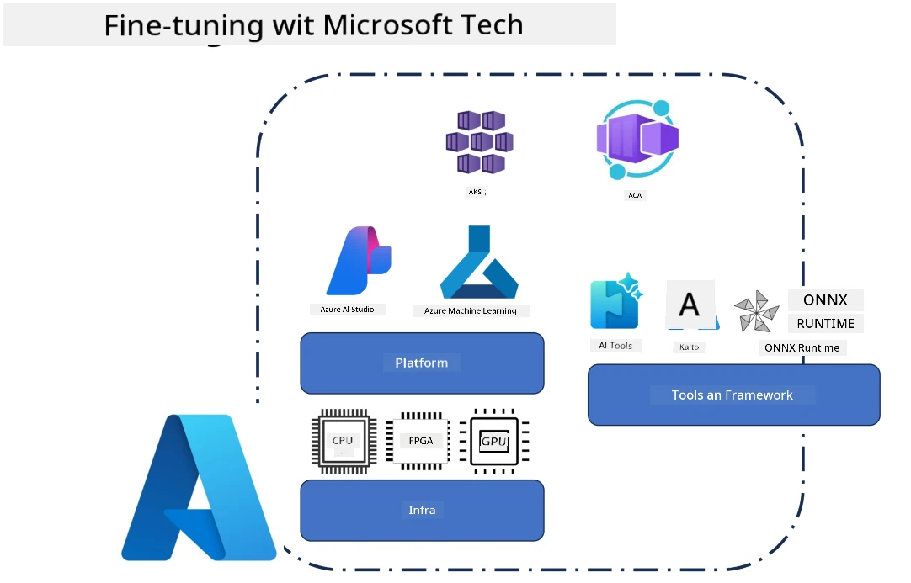
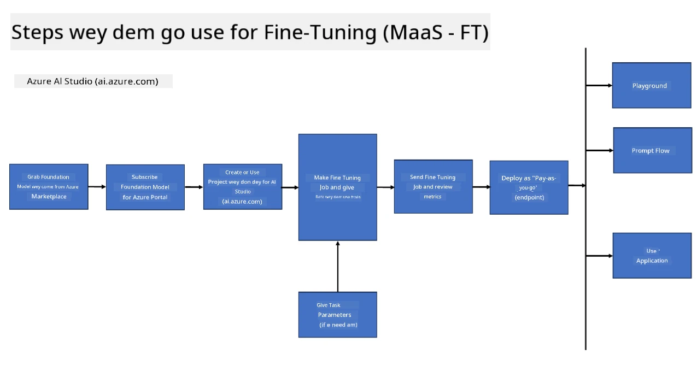
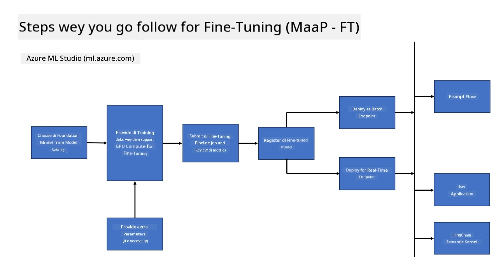
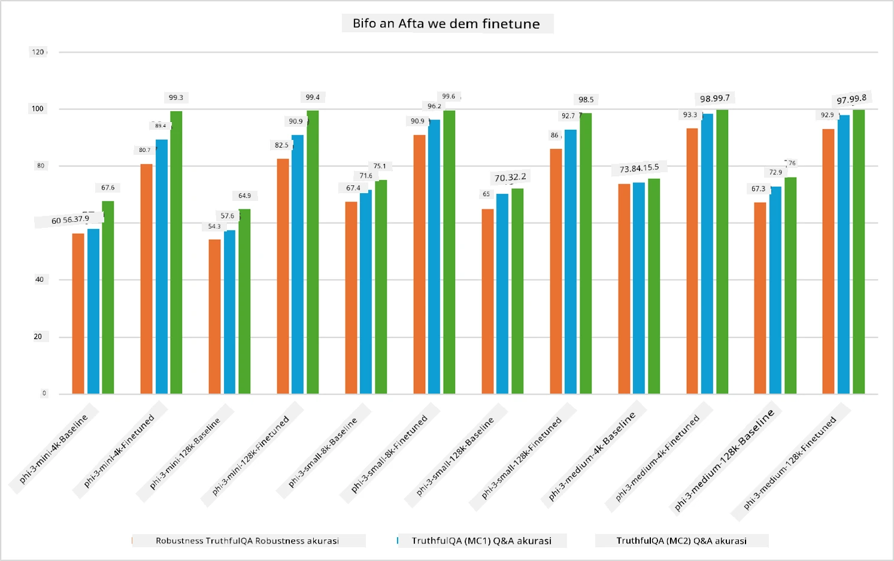

## Fine Tuning Scenarios

Dis section dey provide overview of fine-tuning scenarios for Microsoft Foundry and Azure environments, including deployment models, infrastructure layers, and commonly used optimization techniques.

**Platform**  
Dis one include managed services like Microsoft Foundry (wey dem use to call Azure AI Foundry) and Azure Machine Learning, wey dey provide model management, orchestration, experiment tracking, and deployment workflows.

**Infrastructure**  
Fine-tuning need scalable compute resources. For Azure environments, e usually include GPU-based virtual machines and CPU resources for light workload dem, plus scalable storage for datasets and checkpoints.

**Tools & Framework**  
Fine-tuning workflows dey rely on frameworks and optimization libraries like Hugging Face Transformers, DeepSpeed, and PEFT (Parameter-Efficient Fine-Tuning).

The fine-tuning process with Microsoft technologies cover platform services, compute infrastructure, and training frameworks. If you sabi how these components dey work together, developers fit adapt foundation models to specific tasks and production scenarios well well.

## Model as Service

Fine-tune the model using hosted fine-tuning, no need to create and manage compute.

Serverless fine-tuning don dey available for Phi-3, Phi-3.5, and Phi-4 model families, wey make am easy and fast for developers to customize the models for cloud and edge scenarios without the need to arrange compute.

## Model as a Platform 

Users dey manage their own compute make dem fit Fine-tune their models.

[Fine Tuning Sample](https://github.com/Azure/azureml-examples/blob/main/sdk/python/foundation-models/system/finetune/chat-completion/chat-completion.ipynb)

## Fine-Tuning Techniques Comparison

|Scenario|LoRA|QLoRA|PEFT|DeepSpeed|ZeRO|DoRA|
|---|---|---|---|---|---|---|
|Adapting pre-trained LLMs to specific tasks or domains|Yes|Yes|Yes|Yes|Yes|Yes|
|Fine-tuning for NLP tasks such as text classification, named entity recognition, and machine translation|Yes|Yes|Yes|Yes|Yes|Yes|
|Fine-tuning for QA tasks|Yes|Yes|Yes|Yes|Yes|Yes|
|Fine-tuning for generating human-like responses in chatbots|Yes|Yes|Yes|Yes|Yes|Yes|
|Fine-tuning for generating music, art, or other forms of creativity|Yes|Yes|Yes|Yes|Yes|Yes|
|Reducing computational and financial costs|Yes|Yes|Yes|Yes|Yes|Yes|
|Reducing memory usage|Yes|Yes|Yes|Yes|Yes|Yes|
|Using fewer parameters for efficient finetuning|Yes|Yes|Yes|No|No|Yes|
|Memory-efficient form of data parallelism that gives access to the aggregate GPU memory of all the GPU devices available|No|No|No|Yes|Yes|No|

> [!NOTE]
> LoRA, QLoRA, PEFT, and DoRA na parameter-efficient fine-tuning methods, but DeepSpeed and ZeRO dey focus on distributed training and memory optimization.

## Fine Tuning Performance Examples

---

<!-- CO-OP TRANSLATOR DISCLAIMER START -->
**Disclaimer**:
Dis document na translation wey AI translation service [Co-op Translator](https://github.com/Azure/co-op-translator) do for am. Even tho we dey try make am correct, abeg understand say machine translation fit get some mistakes or no too clear. Di original document wey dem write for im own language still be di true correct source. If na important info, e better make human professional person translate am. We no go responsible for any misunderstanding or wrong meaning wey fit come from dis translation.
<!-- CO-OP TRANSLATOR DISCLAIMER END -->